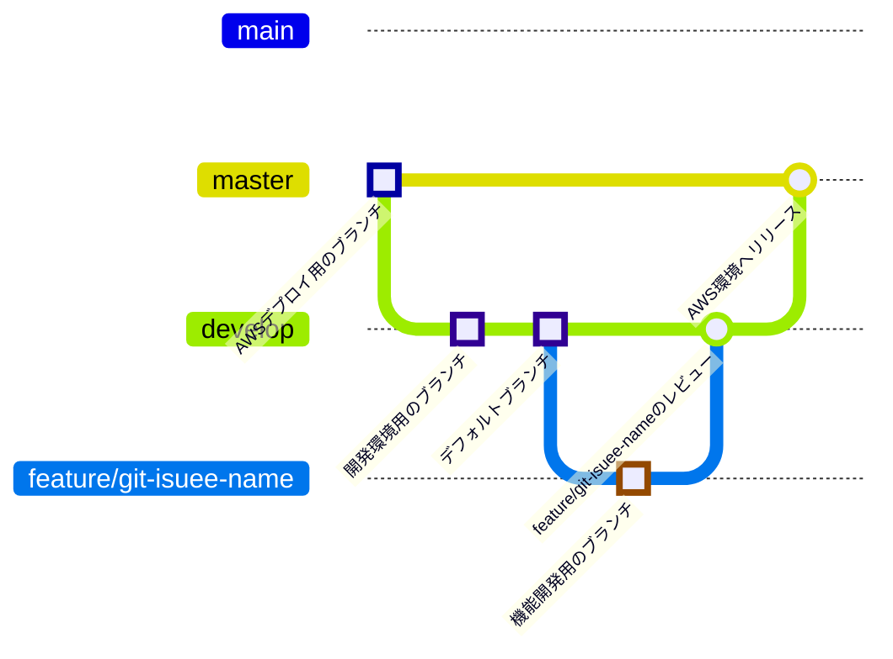

# boilerplate-nextyjs
Next.jsのボイラープレート

ここからフォークして各種リポジトリを作成する用のリポジトリです。

## 拡張機能

- ESLint
- Prettier - Code formatter
- JavaScript and TypeScript Nightly
- TypeScript Import Sorter
- TypeScript Importer
- Path Autocomplete
- Auto Rename Tag
- React Snippets
- Error Lens

## ブランチルール



## Gitコミットメッセージ用プレフィックス一覧

| プレフィックス       | 説明                              |
|----------------------|--------------------------------|
| `fix` | 既存の機能の問題を修正する場合。               |
| `add` | 新しいファイルや機能を追加する場合。            |
| `chg` | 仕様変更する場合。                          |
| `ref` | コードを修正する場合。                       |
| `rmv` | ファイルを削除する場合や、機能を削除する場合。   |
| `doc` | ドキュメントを修正する場合に使用します。        |
| `sty` | コーディングスタイルの修正をする場合に使用します。|

---

## Getting Started

First, run the development server:

```bash
npm run dev
# or
yarn dev
# or
pnpm dev
# or
bun dev
```

Open [http://localhost:3000](http://localhost:3000) with your browser to see the result.

You can start editing the page by modifying `app/page.tsx`. The page auto-updates as you edit the file.

This project uses [`next/font`](https://nextjs.org/docs/app/building-your-application/optimizing/fonts) to automatically optimize and load [Geist](https://vercel.com/font), a new font family for Vercel.

## Learn More

To learn more about Next.js, take a look at the following resources:

- [Next.js Documentation](https://nextjs.org/docs) - learn about Next.js features and API.
- [Learn Next.js](https://nextjs.org/learn) - an interactive Next.js tutorial.

You can check out [the Next.js GitHub repository](https://github.com/vercel/next.js) - your feedback and contributions are welcome!
