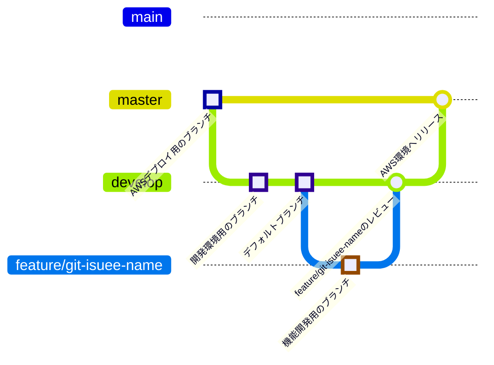

# boilerplate-nextyjs
Next.jsのボイラープレート

ここからフォークして各種リポジトリを作成する用のリポジトリです。

## ブランチルール

## Gitコミットメッセージ用プレフィックス一覧

| プレフィックス       | 説明                              |
|----------------------|--------------------------------|
| `fix` | 既存の機能の問題を修正する場合。               |
| `add` | 新しいファイルや機能を追加する場合。            |
| `chg` | 仕様変更する場合。                          |
| `ref` | コードを修正する場合。                       |
| `rmv` | ファイルを削除する場合や、機能を削除する場合。   |
| `doc` | ドキュメントを修正する場合に使用します。        |
| `sty` | コーディングスタイルの修正をする場合に使用します。|

---
