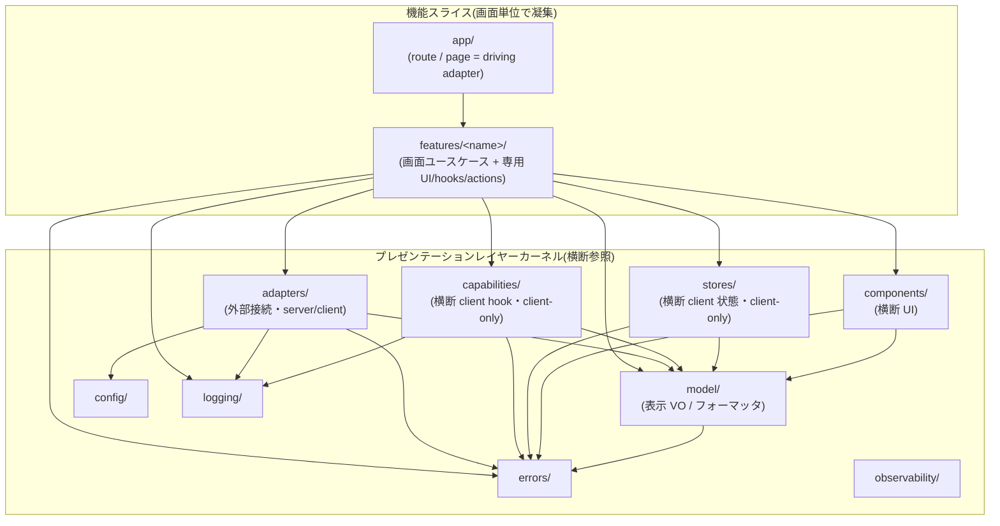

> **このファイルは [`0020-adopted-architecture.md`](0020-adopted-architecture.md) の日本語訳です。**
> 直接編集しないでください。変更は英語の canonical な `0020-adopted-architecture.md` を先に更新し、そのうえでこの日本語訳を同期してください。
> エージェントが読むのは `0020-adopted-architecture.md` だけです。このファイルは人間が読むための翻訳です。

# 採用アーキテクチャ

本プロジェクトの全体アーキテクチャとして **機能スライス × プレゼンテーションレイヤーカーネル**(feature-sliced × presentation-layer kernels)を採用する。`src/` 直下は 11 カーネル構成とし、画面単位で凝集する **機能スライス**(`app` / `features` の 2 カーネル)と、複数機能から横断参照される **プレゼンテーションレイヤーカーネル**(`model` / `components` / `adapters` / `capabilities` / `stores` / `config` / `errors` / `logging` / `observability` の 9 カーネル)の 2 系統に大別する(2 + 9 = 11)。依存は常に内向き(機能スライス → プレゼンテーションレイヤーカーネル、プレゼンテーションレイヤーカーネル間はより内側のカーネルのみ)とする。

本 ADR はアーキテクチャの **宣言・設計原則・採用しないパターン** を定める。各カーネルの詳細な責務・依存マトリクス・命名規律・受入基準・機械的強制(Enforcement)は [0021](0021-frontend-responsibility.ja.md) に委ねる(本 ADR = パターン宣言、0021 = 日常運用規約という分担)。

## Status

Accepted

## 背景

本リポジトリは Next.js をプレゼンテーションレイヤー(presentation layer)として用いる boilerplate であり([0011](0011-no-docker.ja.md))、ビジネスロジック・DB・認証はバックエンド別リポジトリ / 別サービスが持つ。この前提では、バックエンドで一般的な onion(`controller → usecase → domain`、infrastructure が domain の interface を実装)をディレクトリ名ごと持ち込んでも、安定核に置くものが表示用の値と変換くらいしか無く、レイヤーが形骸化する。

本 ADR がプレゼンテーションレイヤーへ持ち込むのは onion の **ディレクトリ名ではなく原則** である —— 内向き依存 / 境界 interface / 型漏洩禁止 / レイヤー別 README / driving adapter を分割軸にしない / ツールによる機械強制。これらをプレゼンテーションレイヤーの現実(機能単位の変更が支配的・RSC の server/client 混在)に合う形で配置する。

## 決定: 機能スライス × プレゼンテーションレイヤーカーネル

`src/` を以下の 11 カーネル構成とする(`capabilities` は [0022](0022-capabilities-kernel.ja.md)、`stores` は [0023](0023-stores-kernel.ja.md) が中身を定める)。

```text
src/
├── app/            # controller 相当。route-segment / route-handler / server-action / metadata の driving adapter([0025])
├── features/       # 機能スライス。<name>/ ごとに画面ユースケース + 専用 UI / hooks / actions を共置
│   └── <name>/     #   内部はフラットなファイル共置が基本(ネスト深化の防止)。Server Action もここ
├── model/          # プレゼンテーションレイヤーカーネル: 表示用 VO / フォーマッタ / 表示バリデーション / 表示結果型(ActionState<T>)。依存は errors のみ
├── components/     # 横断 UI カーネル: デザインシステム的な純 UI(fetch / config 禁止)
├── adapters/       # 境界アダプタ: 外部接続のみ。server/・client/ の 2 面([0024])。config 唯一の許可レイヤー
├── capabilities/   # 横断 client hook カーネル: runtime 能力(connectivity / storage / clipboard 等)。client-only([0022])
├── stores/         # 横断 client 状態カーネル: 複数 feature が共有する client 状態(Zustand)。client-only([0023])
├── config/         # 型付き Config カーネル([0030])
├── errors/         # エラー分類カーネル([0080])
├── logging/        # 構造化ログカーネル([0081])
└── observability/  # OTel カーネル([0081])
```

系統の対応関係(全体像):



(依存方向の詳細な許可 / 禁止マトリクスは [0021](0021-frontend-responsibility.ja.md) を正とする。上図は全体像の把握用。)

## 設計原則

本アーキテクチャの不変原則。

### 1. 依存は内向きのみ

外側のレイヤー(揮発的)ほど内側(安定)を知り、内側は外側を知らない。スライス(`app` → `features`)はプレゼンテーションレイヤーカーネルを import してよいが、プレゼンテーションレイヤーカーネルはスライスを import しない。プレゼンテーションレイヤーカーネル間も内向きのみ(例: `model` は `errors` のみに依存し、`adapters` や `components` を知らない)。

### 2. 境界は構造的型(TypeScript)で表現する

「内側は抽象に依存し、実装は外側が与える」という境界 interface の考え方を、TypeScript の**構造的型**で表現する。`adapters` が公開する型(公開面)が事実上の境界 interface であり、`features` はその構造的型に依存する。テストでは具体実装ではなく factory 注入で差し替える(DI コンテナは持たず、ESM モジュールキャッシュ + import 境界で代替する。config の注入は [0030](0030-environment-variable-management.ja.md))。

### 3. 生成型・外部型を内層に漏らさない(型漏洩禁止)

OpenAPI 由来の生成型([0072](0072-api-type-generation.ja.md))や外部ライブラリの型を、`model` などの内層に漏らさない。外界の型は所有境界(`adapters`)で自前の表示用型へ変換する。「request ⊂ domain ⊂ response」「wire contract はドメインルールではない」という境界値所有の哲学を維持する(詳細は [0070](0070-backend-role-separation.ja.md) / [0072](0072-api-type-generation.ja.md))。

### 4. route・Server Action は driving adapter でありコード分割の軸にしない

App Router のルートセグメント(`app/` 配下)と Server Action は**薄い呼び口**(driving adapter)であり、業務の編成やロジックを抱えない([0011](0011-no-docker.ja.md) の thin proxy 決定と接続)。呼び口は呼ばれ方(page / Route Handler / Server Action)ごとに増えるエントリポイントであって、1 つの機能は複数のエントリポイントから呼ばれうる。エントリポイントで分割すると 1 機能がエントリポイントの数だけ散らばるため、コード分割の第一軸は route ではなく **feature** とする。`page.tsx` は feature の画面 RSC を呼ぶだけの薄いレイヤーに留める。

### 5. 構造安全性は ESLint boundaries で CI 強制する

レイヤーの依存方向は文書だけで守らず、機械的に強制する。文書だけの規約は、破った commit が咎められずに通り、後から誰も違反の起点を特定できない。強制手段は、ESLint を biome の補完として使う [0002](0002-formatter-linter.ja.md) の方針に接続する — フォーマットと biome が表現できる検査は biome が担い、「import する側のレイヤー」を文脈に取る境界検査(biome 非対応)のみ ESLint boundaries で補完し、CI(`pnpm lint:ci`)で強制する。プラグイン選定(`eslint-plugin-boundaries`)・element 定義・violation severity は、レイヤー規則の強制方法を述べる [0021](0021-frontend-responsibility.ja.md) が定め、`eslint.config.ts` はそれを検査へ変換する。

### 6. 他のレイヤーが握る問題を、こちらで予防的に手当てしない

**責務を超えない。外の責務の問題は、外の責務が握る。** 手前のレイヤーで先回りして書いた防御は、同じ問題に対する二つ目の答えになり、どちらが正かを決める仕事を恒久的に増やす。片方だけが直った状態も作れる。

**書かないもの**:

- **その下のレイヤーが既に握っているもの** —— 契約の妥当性は境界の生成スキーマ([0072](0072-api-type-generation.ja.md) / [0029](0029-type-design-discipline.ja.md))、業務ルールはバックエンド([0070](0070-backend-role-separation.ja.md))、同一 render 内の取得の重複排除は `adapters`([0071](0071-bff-api-integration.ja.md))が握る。上流から来た値を網羅的に無害化し直すのは、このレイヤーの設計目標ではない
- **エッジケースのさらにエッジケースだけを捕まえるもの** —— 起こり得ないものへの手当て

**これは予防そのものの禁止ではない。** 次は対象外であり、禁じない。

- **下では捕まえられないもの** —— そのレイヤーへ届く前に答えが要るもの
- **UX 上、こちらに在るほうが正しいもの** —— 入力の即時フィードバックが典型で、境界の契約検証と `model` の表示検証を二層に分ける形は [0062](0062-form-input-validation.ja.md) が既に定めている。往復を待たせないことが目的なら、同じ検査が二層にあってよい

**セキュリティ上の懸念は、この原則の対象外である。**

XSS・インジェクション等の防御は、下のレイヤーが握っていても**重複を理由に落とさない**。アーキテクチャは保守性と堅牢性を守るための道具であり、**それに従った結果セキュリティが毀損されるなら、それは前提の破壊であってアーキテクチャ側の欠陥**である。責務分界は、防御を薄くする理由にはならない(セキュリティ運用の全体像は [0110](0110-security-operations.ja.md))。

上の「網羅的な無害化を設計目標にしない」との線引きは、**具体的な脅威を特定できるか**である。上流由来の値を一律に疑って洗い直すことはしないが、特定できる脅威(この値が HTML として解釈される / この文字列が URL として解決される、等)への防御は、他所にあっても置く。

判定は 3 つ: **起こりうるか** / **ここが握るべきか** / **下で間に合うか**。ただしセキュリティ上の懸念は、2 つ目を問わない。

## onion 語彙 `domain` / `usecase` を採用しない理由

onion は安定核を `domain` / `usecase` と名付けるが、本リポジトリではこれを**採用しない**。

- **緊張点**: 本リポジトリは [0011](0011-no-docker.ja.md) で「ビジネスロジックはバックエンド別リポ」「`/api/*` は thin proxy」を既に決定している。`src/domain/` / `src/usecase/` という受け皿は、本来ここに存在しないはずのビジネスロジックの**誘導路**になる。onion が守る「安定核」は、プレゼンテーションレイヤーでは表示用 VO・フォーマッタ程度と小さく、同じレイヤー数・レイヤー名の再現は過剰装備である。
- **解消**: 語彙を変えて縮退する。安定核 `domain` はプレゼンテーションレイヤーの語彙 **`model`**(表示用 VO・フォーマッタ・表示バリデーション、ビジネスルール禁止)へ縮退し、`usecase`(画面ユースケース)は独立ディレクトリを持たず **feature 内へ共置**する。onion の各役割との対応は下記の対応表で担保し、レイヤー別監査・scaffold は本表を土台に載せる。

### onion の役割との対応表

| onion の役割 | 本リポの対応 | 備考 |
| --- | --- | --- |
| domain(安定核) | `src/model/` | 表示用 VO / フォーマッタ / 表示バリデーション。**ビジネスルール禁止**。依存は `errors` のみ |
| usecase | `src/features/<name>/` の編成部(server 関数 / hooks) | 画面ユースケース。boundary IF は `adapters` 公開面の構造的型で代替 |
| controller(driving adapter) | `src/app/`(route-segment / route-handler / server-action / metadata。[0025](0025-app-layer-elements.ja.md))+ feature 内 `actions.ts` | 薄い編成のみ([0011](0011-no-docker.ja.md) thin proxy と接続) |
| infrastructure(driven adapter) | `src/adapters/`(server / client の 2 面。[0024](0024-adapters-server-client-split.ja.md)) | 外部接続のみ(backend API client / BFF fetch / analytics 等)。config import の唯一の許可レイヤー(server 面)。命名規律により `lib` は不採用 |
| 横断: config | `src/config/` | 型付き Config([0030](0030-environment-variable-management.ja.md)) |
| 横断: エラー分類 | `src/errors/` | 全レイヤーから参照可([0080](0080-error-handling.ja.md)) |
| 横断: ログ | `src/logging/` | 構造化ログ([0081](0081-observability-logging.ja.md)) |
| 横断: 観測性 | `src/observability/` | OTel([0081](0081-observability-logging.ja.md)) |
| (view — onion に対応なし) | `src/components/`(横断)+ feature 内 UI | fetch / config 禁止 |
| (client runtime hook — onion に対応なし) | `src/capabilities/` | 横断 client hook(runtime 能力)。client-only。[0022](0022-capabilities-kernel.ja.md) |
| (client 状態 store — onion に対応なし) | `src/stores/` | 横断 client 状態(複数 feature が共有する Zustand ストア)。client-only。[0023](0023-stores-kernel.ja.md) |

## 横断関心事の第一階層分離

横断関心事(`config` / `errors` / `logging` / `observability`)は **`src/` 直下の第一階層へ分離**する。あらゆるレイヤーが参照するものを、どれか 1 つのカーネル(例えば `adapters`)の下に置くと、そのカーネルが全レイヤーの依存先になり、内向き依存の図が壊れる。独立させれば、各カーネルは「自分より内側の横断関心事」だけを見る形に収まる。

- `adapters` から `config` を独立させ、`errors` / `logging` / `observability` を並べる。`adapters` は**外部接続のみ**(backend API client / BFF fetch / analytics 送信 等。server/client の 2 面。[0024](0024-adapters-server-client-split.ja.md))に責務を縮小する(local ブラウザ API の storage / clipboard 等は `capabilities`。[0022](0022-capabilities-kernel.ja.md))
- 各ディレクトリ内は**フラットなファイル共置を基本**とし(feature 内も同様)、肥大化時のみ分割する — ネスト深化の防止

## 採用しないパターン

決定過程で比較した代替案と、不採用の理由。

| 不採用パターン | 内容 | 不採用の理由 |
| --- | --- | --- |
| **onion 直訳(レイヤーディレクトリ型)** | `src/{app, domain, usecase, adapter, components}` と onion のレイヤーを 1:1 でディレクトリ化 | プレゼンテーションレイヤーでは domain / usecase が薄く**形骸化**する。1 機能の修正が複数ディレクトリに散らばり co-location が弱い。view と usecase の関係は onion に無い軸で結局独自ルールが要る。Next.js 慣行から遠い。加えて `domain/` が業務ロジックの誘導路になる([0011](0011-no-docker.ja.md) 緊張点) |
| **Next.js 慣行ミニマル** | `src/{app, components, hooks, lib, types}` の最小構成 | usecase の置き場が曖昧で `hooks` が何でも屋化し、境界検査も粗くしか書けない。レイヤー別 README とレイヤー別の監査 / scaffold が**載らない** |
| **Atomic Design** | atoms / molecules / organisms / templates / pages と、**粒度**で UI を分類する | 粒度は責務を表さない。organism が肥大し、ロジックの滞留先になる。置き場所の判断が「どちらの粒度か」という主観へ移り、名前から責務が読めなくなる。本リポジトリが優先するのは**責務の明瞭さと、それが名前に出ていること**である |
| **Feature-Sliced Design (FSD)** | shared / entities / features / widgets / pages / app の 6 レイヤー | 機能スライスという第一軸は同じだが、`entities` / `widgets` が本リポジトリのレイヤーと**二重の語彙**になる。同じものを 2 通りに分類できる構造は、置き場所の判断を毎回揺らす |

採用パターン(機能スライス × カーネル)は、onion の不変原則(内向き依存・境界強制・型漏洩禁止・README 正)を全て維持したまま、プレゼンテーションレイヤーの現実(機能単位の変更が支配的・RSC の server/client 混在)に最適化できる。レイヤーファーストではなく機能ファーストに軸を置くのは意図的な設計判断であり、onion の各役割との対応は上記対応表で担保する。

## 禁止事項

- ❌ `src/domain/` / `src/usecase/` を作成すること(安定核は `model`、画面ユースケースは feature 内共置。上記「採用しない理由」参照)（強制: ESLint `boundaries/no-unknown-files` が `src/domain/` / `src/usecase/` に置いたコードを落とす。コード以外のファイルだけを持つディレクトリは散文 —— **寄せられる**（`src/` 直下のディレクトリを `architecture.ts` の `KERNELS` と突き合わせる。規則は無い））
- ❌ route / Server Action / `page.tsx` に業務ロジックを書くこと(driving adapter は薄い編成のみ。[0011](0011-no-docker.ja.md) thin proxy)（強制: 散文 —— **寄せられない**。どこからが業務ロジックでどこまでが薄い編成かはレイヤーの責務の判断で、コードの形からは決まらない）
- ❌ コード分割の第一軸を route にすること(第一軸は feature)（強制: 散文 —— **寄せられない**。コードをどの軸で分けたかは設計の判断で、ディレクトリの形からは決まらない）
- ❌ 生成型・外部ライブラリ型を `model` 等の内層へ漏らすこと(変換は `adapters` 所有境界で行う)（強制: ESLint boundaries が `adapters` 以外からの `src/adapters/gen` の import を落とす。`src/model` での外部ライブラリの import は `no-restricted-imports` で落とせるが規則は無い。`adapters` の公開面を経由した生成型の再公開は散文 —— **寄せられない**。型の由来の追跡が要り、依存表の向きからは決まらない）
- ❌ カーネルの依存を外向きにすること(`model` が `adapters` を import する等。詳細マトリクスは [0021](0021-frontend-responsibility.ja.md))
- ❌ 中身の決定を持たないカーネルの空ディレクトリを生やすこと(カーネルは、その中身を定める ADR と対で存在する)（強制: 散文 —— **一部寄せられる**。コードを持たないカーネルのディレクトリ（`.gitkeep` だけ等）は `src/` のスキャンで落とせるが規則は無い。対になる ADR がそのカーネルの中身を定めているかは文書の意味で決まる）

## 補足

- 本 ADR はパターン**宣言**であり、各カーネルの責務・依存マトリクス・命名規律・受入基準・Server Action の置き場・Enforcement の詳細は [0021](0021-frontend-responsibility.ja.md) を正とする
- カーネルの物理配置は [0027](0027-directory-structure.ja.md)、命名は [0028](0028-naming-convention.ja.md)、config カーネルの中身は [0030](0030-environment-variable-management.ja.md) が具体化する

## 関連 ADR

- [0011-no-docker.md](0011-no-docker.ja.md) — プレゼンテーションレイヤーロール定義(ビジネスロジックはバックエンド別リポ)。`domain` / `usecase` 不採用と driving adapter 非分割軸の根拠
- [0002-formatter-linter.md](0002-formatter-linter.ja.md) — 構造安全性の機械強制(ESLint boundaries によるレイヤー境界検査の補完)の接続先
- [0021-frontend-responsibility.md](0021-frontend-responsibility.ja.md) — 各カーネルの責務 / 依存マトリクス / 命名規律 / 受入基準 / Enforcement(本 ADR の従属決定)
- [0022-capabilities-kernel.md](0022-capabilities-kernel.ja.md) — `capabilities` カーネル(横断 client hook)
- [0023-stores-kernel.md](0023-stores-kernel.ja.md) — `stores` カーネル(横断 client 状態)
- [0024-adapters-server-client-split.md](0024-adapters-server-client-split.ja.md) / [0025-app-layer-elements.md](0025-app-layer-elements.ja.md) — `adapters` / `app` の element 細分
- [0027-directory-structure.md](0027-directory-structure.ja.md) / [0028-naming-convention.md](0028-naming-convention.ja.md) / [0030-environment-variable-management.md](0030-environment-variable-management.ja.md) — 本アーキテクチャ上の物理配置・命名・config カーネルを具体化する ADR
