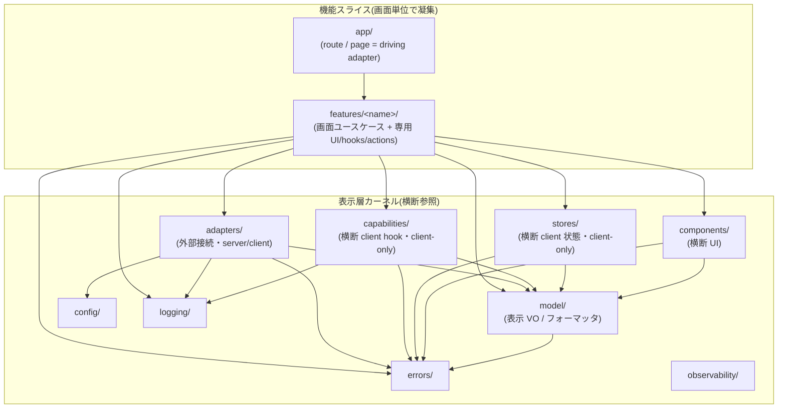

# 採用アーキテクチャ

本プロジェクトの全体アーキテクチャとして **機能スライス × 表示層カーネル**(feature-sliced × presentation-layer kernels)を採用する。`src/` 直下を、画面単位で凝集する **機能スライス**(`app` / `features`)と、複数機能から横断参照される **カーネル**(`model` / `components` / `adapters` / `capabilities` / `stores` / `config` / `errors` / `logging` / `observability`)の 2 系統で構成し、依存は常に内向き(スライス → カーネル、カーネルはより内側のカーネルのみ)とする。

本 ADR はアーキテクチャの **宣言・設計原則・採用しないパターン** を定める。各カーネルの詳細な責務・依存マトリクス・命名規律・受入基準・機械的強制(Enforcement)は [0021](0021-frontend-responsibility.md) に委ねる(go-boilerplate における「ADR = 決定 / rules.md = 日常ルール」の役割分担に相当し、本 ADR = パターン宣言、0021 = 日常運用規約という分担)。

## Status

Accepted

（採番はブロック帯で確定〈2026-07-14・0001〜0155。トピック順ブロック帯(10 番台=主題ブロック)〉。`docs/adr/README.md` の採番記述との整合は反映済み。本 ADR の内容自体はユーザ決定済み。日付 2026-07-12。0.0.x の ADR は living document として本文を直接上書きし、改定履歴を積まない）

## 背景

本リポジトリは Next.js を表示層(presentation layer)として用いる boilerplate であり([0011](0011-no-docker.md))、ビジネスロジック・DB・認証はバックエンド別リポジトリ / 別サービスが持つ。この前提のもとで、AGENTS.md の `[TODO] Overall Architecture Pattern` は「全体パターン・不採用パターン・依存方向を決定するまで、パターン固有のディレクトリ名や依存制約を勝手に導入しない」という暫定運用を敷いていた。

一方、隣接する `go-boilerplate` リポジトリは Pragmatic Onion(`controller → usecase → domain`、infrastructure が domain の interface を実装)で構成され、内向き依存 / 境界 interface / 型漏洩禁止 / 層別 README / driving adapter 非分割軸 / ツールによる機械強制、という **ADR レベルの設計原則** を確立している。本 boilerplate は「ディレクトリ名の一致」ではなく、この **原則** を表示層に持ち込むことを狙う。

決定の経緯・選択肢比較・go 層マッピング・整合確認は [docs/plan/a1-layer-mapping-options.md](../plan/a1-layer-mapping-options.md) を正とする。本 ADR はその決定を追認・成文化するものである。

## 決定: 機能スライス × 表示層カーネル

`src/` を以下の 11 カーネル構成とする(`capabilities` は [0022](0022-capabilities-kernel.md)、`stores` は [0023](0023-stores-kernel.md) で追加)。物理ディレクトリは各対応決定が下りた時点で作成し(`config` = A7 実装時 / `errors` = B6 / `logging`・`observability` = B7)、本 ADR では**全体図として枠を予約するのみ**とする(空ディレクトリは生やさない)。

```text
src/
├── app/            # controller 相当。route-segment / route-handler / metadata の driving adapter([0025])
├── features/       # 機能スライス。<name>/ ごとに画面ユースケース + 専用 UI / hooks / actions を共置
│   └── <name>/     #   内部はフラットなファイル共置が基本(ネスト深化の防止)。Server Action もここ
├── model/          # 表示層カーネル: 表示用 VO / フォーマッタ / 表示バリデーション / 表示結果型(ActionState<T>)。依存は errors のみ
├── components/     # 横断 UI カーネル: デザインシステム的な純 UI(fetch / config 禁止)
├── adapters/       # 境界アダプタ: 外部接続のみ。server/・client/ の 2 element([0024])。config 唯一の許可層
├── capabilities/   # 横断 client hook カーネル: runtime 能力(connectivity / storage / clipboard 等)。client-only([0022])
├── stores/         # 横断 client 状態カーネル: 複数 feature が共有する client 状態(Zustand)。client-only([0023])
├── config/         # 型付き Config カーネル(go internal/config 直訳。A7 実装時に作成)
├── errors/         # エラー分類カーネル(go apperror 直訳。B6 確定時に作成)
├── logging/        # 構造化ログカーネル(go logging 直訳。B7 確定時に作成)
└── observability/  # OTel カーネル(go observability 直訳。B7 確定時に作成)
```

系統の対応関係(全体像):



(依存方向の詳細な許可 / 禁止マトリクスは [0021](0021-frontend-responsibility.md) を正とする。上図は全体像の把握用。)

## 設計原則

go-boilerplate の ADR レベル原則(**go 側**の `docs/adr/0002` / `0020` / `0021` / `rules.md`。本リポの同番号 ADR ではない)を表示層へ翻案した、本アーキテクチャの不変原則。

### 1. 依存は内向きのみ

外側の層(揮発的)ほど内側(安定)を知り、内側は外側を知らない。スライス(`app` → `features`)はカーネルを import してよいが、カーネルはスライスを import しない。カーネル間も内向きのみ(例: `model` は `errors` のみに依存し、`adapters` や `components` を知らない)。

### 2. 境界は構造的型(TypeScript)で表現する

go の boundary interface(内側は抽象に依存し、実装は外側が与える)を、TypeScript の**構造的型**で翻案する。`adapters` が公開する型(公開面)が事実上の境界 interface であり、`features` はその構造的型に依存する。テストでは具体実装ではなく factory 注入で差し替える(DI の代替 = ESM モジュールキャッシュ + import 境界。詳細は A7 翻案方針)。

### 3. 生成型・外部型を内層に漏らさない(型漏洩禁止)

OpenAPI 由来の生成型(B4)や外部ライブラリの型を、`model` などの内層に漏らさない。外界の型は所有境界(`adapters`)で自前の表示用型へ変換する。「request ⊂ domain ⊂ response」「wire contract はドメインルールではない」という境界値所有の哲学を維持する(詳細は A2 / B4)。

### 4. route・Server Action は driving adapter でありコード分割の軸にしない

App Router のルートセグメント(`app/` 配下)と Server Action は**薄い呼び口**(driving adapter)であり、業務の編成やロジックを抱えない([0011](0011-no-docker.md) の thin proxy 決定と接続)。したがってコード分割の第一軸は route ではなく **feature** とする(go ADR 0005「REST / Worker / Job は driving adapter であり分割軸にしない」の翻案)。`page.tsx` は feature の画面 RSC を呼ぶだけの薄い層に留める。

### 5. 構造安全性は ESLint boundaries で CI 強制する

層の依存方向は文書だけで守らず、機械的に強制する(go ADR 0006 の翻案)。強制手段は [0002](0002-formatter-linter.md)「ESLint による補完」節に接続する — フォーマットと biome が表現できる検査は biome が担い、「import する側の層」を文脈に取る境界検査(biome 非対応)のみ ESLint boundaries で補完し、CI(`pnpm lint:ci`)で強制する。プラグイン選定(`eslint-plugin-boundaries`)・element 定義・violation severity は [0021](0021-frontend-responsibility.md) の Enforcement 節で確定済みであり、実装 PR で行うのは `eslint.config.mjs` の具体記述のみである(0002 の「A3 が Accepted になるまで ESLint の実導入は行わない」と接続)。

## go 語彙 `domain` / `usecase` を採用しない理由

go-boilerplate は onion の安定核を `domain` / `usecase` と名付けるが、本リポジトリではこれを**採用しない**。

- **緊張点**: 本リポジトリは [0011](0011-no-docker.md) で「ビジネスロジックはバックエンド別リポ」「`/api/*` は thin proxy」を既に決定している。`src/domain/` / `src/usecase/` という受け皿は、本来ここに存在しないはずのビジネスロジックの**誘導路**になる(AGENTS.md の A1 `[TODO]`「DDD / Onion 由来の `domain/` 等を勝手に作らない」はこの混同防止の布石)。go で onion が守る「安定核」は、表示層では表示用 VO・フォーマッタ程度と小さく、同じ層数・層名の再現は過剰装備である。
- **解消**: 語彙を変えて縮退する案を採用する。安定核 `domain` は表示層の語彙 **`model`**(表示用 VO・フォーマッタ・表示バリデーション、ビジネスルール禁止)へ縮退し、`usecase`(画面ユースケース)は独立ディレクトリを持たず **feature 内へ共置**する。go との対応は下記マッピング表で担保し、層別監査・scaffold の C 系スキル(C-1 / C-2 / C-4)は本表を差し替えて載せる。

### go 層マッピング表

| go の層 / パッケージ | 本リポの対応 | 備考 |
| --- | --- | --- |
| domain | `src/model/` | 表示用 VO / フォーマッタ / 表示バリデーション。**ビジネスルール禁止**。依存は `errors` のみ |
| usecase | `src/features/<name>/` の編成部(server 関数 / hooks) | 画面ユースケース。boundary IF は `adapters` 公開面の構造的型で代替 |
| controller | `src/app/`(route-segment / route-handler / metadata。[0025](0025-app-layer-elements.md))+ feature 内 `actions.ts` | driving adapter。薄い編成のみ([0011](0011-no-docker.md) thin proxy と接続) |
| infrastructure | `src/adapters/`(server / client の 2 element。[0024](0024-adapters-server-client-split.md)) | 外部接続のみ(backend API client / BFF fetch / analytics 等)。config import の唯一の許可層(server 面)。命名規律により `lib` は不採用 |
| internal/config | `src/config/` | 型付き Config(A7 翻案方針。実装は A7) |
| internal/apperror | `src/errors/` | エラー分類。全層から参照可(中身は B6) |
| internal/logging | `src/logging/` | 構造化ログ(中身は B7) |
| internal/observability | `src/observability/` | OTel(中身は B7) |
| (view — go に対応なし) | `src/components/`(横断)+ feature 内 UI | fetch / config 禁止 |
| (client runtime hook — go に対応なし) | `src/capabilities/` | 横断 client hook(runtime 能力)。client-only。[0022](0022-capabilities-kernel.md) |
| (client 状態 store — go に対応なし) | `src/stores/` | 横断 client 状態(複数 feature が共有する Zustand ストア)。client-only。[0023](0023-stores-kernel.md) |

## 横断関心事の第一階層分離

go は横断関心事を `internal/` 直下の独立パッケージとする(`config` / `logging` / `observability` / `apperror` — `pkg/README.md` に明文)。これに倣い、本リポジトリも横断関心事を **`src/` 直下の第一階層へ分離**する。

- `adapters` から `config` を独立させ、`errors`(= apperror 直訳)/ `logging` / `observability` の枠を予約する。`adapters` は**外部接続のみ**(backend API client / BFF fetch / analytics 送信 等。server/client の 2 面。[0024](0024-adapters-server-client-split.md))に責務を縮小する(local ブラウザ API の storage / clipboard 等は `capabilities`。[0022](0022-capabilities-kernel.md))
- 各ディレクトリ内は**フラットなファイル共置を基本**とし(feature 内も同様)、肥大化時のみ分割する — ネスト深化の防止
- 物理ディレクトリは対応決定が下りた時点で作成する(`config` = A7 / `errors` = B6 / `logging`・`observability` = B7)。本 ADR はカーネル全体図として枠を予約するのみとし、空ディレクトリは生やさない

## 採用しないパターン

決定過程で比較した代替案と、不採用の理由(詳細は [docs/plan/a1-layer-mapping-options.md](../plan/a1-layer-mapping-options.md))。

| 不採用パターン | 内容 | 不採用の理由 |
| --- | --- | --- |
| **onion 直訳(層ディレクトリ型)** | `src/{app, domain, usecase, adapter, components}` と go の層を 1:1 でディレクトリ化 | 表示層では domain / usecase が薄く**形骸化**する。1 機能の修正が複数ディレクトリに散らばり co-location が弱い。view と usecase の関係は onion に無い軸で結局独自ルールが要る。Next.js 慣行から遠い。加えて `domain/` が業務ロジックの誘導路になる([0011](0011-no-docker.md) 緊張点) |
| **Next.js 慣行ミニマル** | `src/{app, components, hooks, lib, types}` の最小構成 | usecase の置き場が曖昧で `hooks` が何でも屋化し、境界検査も粗くしか書けない。層別 README・C-1〜C-4 の監査 / scaffold **監査体系が載らず**、go-boilerplate 準拠の完成基準に届かない |

採用パターン(機能スライス × カーネル)は、go の不変原則(内向き依存・境界強制・型漏洩禁止・README 正)を全て維持したまま、表示層の現実(機能単位の変更が支配的・RSC の server/client 混在)に最適化できる。go の **de facto レイアウト**(層ファースト)とは意図的に軸を反転させているが、これは翻案上の設計判断であり、上記マッピング表で go との対応を担保する。

## 禁止事項

- ❌ `src/domain/` / `src/usecase/` を作成すること(安定核は `model`、画面ユースケースは feature 内共置。上記「採用しない理由」参照)
- ❌ route / Server Action / `page.tsx` に業務ロジックを書くこと(driving adapter は薄い編成のみ。[0011](0011-no-docker.md) thin proxy)
- ❌ コード分割の第一軸を route にすること(第一軸は feature)
- ❌ 生成型・外部ライブラリ型を `model` 等の内層へ漏らすこと(変換は `adapters` 所有境界で行う)
- ❌ カーネルの依存を外向きにすること(`model` が `adapters` を import する等。詳細マトリクスは [0021](0021-frontend-responsibility.md))
- ❌ 対応決定(A7 / B6 / B7)が下りる前に横断関心事カーネルの空ディレクトリを生やすこと

## 補足

- 本 ADR はパターン**宣言**であり、各カーネルの責務・依存マトリクス・命名規律・受入基準・Server Action の置き場・Enforcement の詳細は [0021](0021-frontend-responsibility.md) を正とする
- カーネルの物理ディレクトリと層別 README の整備は、対応決定(A5 / A7 / B6 / B7)の Accepted と実装 PR で段階的に進める。本 ADR は `src/` へ実ディレクトリを追加しない
- 本 ADR の Accepted に伴い、AGENTS.md の `[TODO] Overall Architecture Pattern` 節の削除・書き換えを実施する(計画書「ADR 化時に明示する翻案 3 点」③。未実施 — AGENTS.md は Protected Documentation のため、変更案の提示とユーザ承認を経て適用する)

## 関連 ADR

- [0011-no-docker.md](0011-no-docker.md) — 表示層ロール定義(ビジネスロジックはバックエンド別リポ)。`domain` / `usecase` 不採用と driving adapter 非分割軸の根拠
- [0002-formatter-linter.md](0002-formatter-linter.md) — 構造安全性の機械強制(ESLint boundaries による層境界検査の補完)の接続先
- [0021-frontend-responsibility.md](0021-frontend-responsibility.md) — 各カーネルの責務 / 依存マトリクス / 命名規律 / 受入基準 / Enforcement(本 ADR の従属決定)
- [0022-capabilities-kernel.md](0022-capabilities-kernel.md) — 10 個目のカーネル `capabilities`(本 ADR の 9 → 10 の追加)
- [0023-stores-kernel.md](0023-stores-kernel.md) — 11 個目のカーネル `stores`(本 ADR の 10 → 11 の追加。横断 client 状態)
- [0024-adapters-server-client-split.md](0024-adapters-server-client-split.md) / [0025-app-layer-elements.md](0025-app-layer-elements.md) — `adapters` / `app` の element 細分(構造ブロッカー解決)
- BACKLOG A5(ディレクトリ構造)/ A6(命名規則)/ A7(環境変数管理) — 本アーキテクチャ上の物理配置・命名・config カーネルを具体化する後続 ADR 枠
