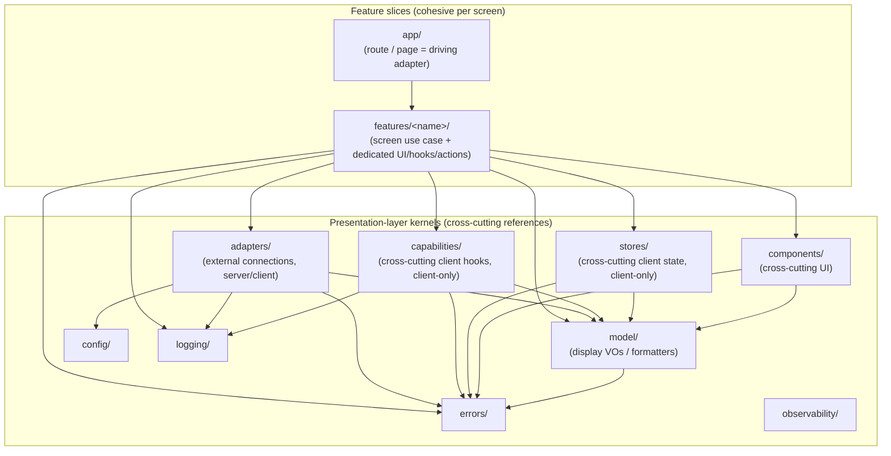

# Adopted Architecture

This project adopts **feature slices × presentation-layer kernels** (feature-sliced × presentation-layer kernels) as its overall architecture. The top level of `src/` consists of 11 kernels, divided into two families: **feature slices** that cohere per screen (the 2 kernels `app` / `features`), and **presentation-layer kernels** referenced across multiple features (the 9 kernels `model` / `components` / `adapters` / `capabilities` / `stores` / `config` / `errors` / `logging` / `observability`) (2 + 9 = 11). Dependencies always point inward (feature slices → presentation-layer kernels; between presentation-layer kernels, only toward kernels further in).

This ADR sets the architecture's **declaration, design principles and rejected patterns**. The detailed responsibilities of each kernel, the dependency matrix, the naming discipline, the acceptance criteria and the mechanical enforcement (Enforcement) are delegated to [0021](0021-frontend-responsibility.md) (division of labor: this ADR = the pattern declaration, 0021 = the day-to-day operating conventions).

## Status

Accepted

## Context

This repository is a boilerplate that uses Next.js as the presentation layer ([0011](0011-no-docker.md)); business logic, the DB and authentication are held by a separate backend repository / service. Under this premise, bringing in the onion common on the backend (`controller → usecase → domain`, with infrastructure implementing the domain's interfaces) wholesale, directory names included, leaves little more than display values and conversions to place in the stable core, and the layers become hollow.

What this ADR brings into the presentation layer is the onion's **principles, not its directory names** — inward dependencies / boundary interfaces / no type leakage / per-layer READMEs / not using driving adapters as a splitting axis / mechanical enforcement by tools. These are arranged in a shape that fits the reality of the presentation layer (changes are dominated by feature units; RSC mixes server and client).

## Decision: Feature Slices × Presentation-Layer Kernels

`src/` consists of the following 11 kernels (the contents of `capabilities` are set by [0022](0022-capabilities-kernel.md), and those of `stores` by [0023](0023-stores-kernel.md)).

```text
src/
├── app/            # controller equivalent. driving adapters: route-segment / route-handler / server-action / metadata ([0025])
├── features/       # feature slices. each <name>/ co-locates screen use cases + dedicated UI / hooks / actions
│   └── <name>/     #   flat file co-location inside by default (prevents deep nesting). Server Actions live here too
├── model/          # presentation-layer kernel: display VOs / formatters / display validation / display result types (ActionState<T>). depends on errors only
├── components/     # cross-cutting UI kernel: design-system-style pure UI (no fetch / config)
├── adapters/       # boundary adapters: external connections only. two faces, server/ and client/ ([0024]). the only layer allowed config
├── capabilities/   # cross-cutting client hook kernel: runtime capabilities (connectivity / storage / clipboard, etc.). client-only ([0022])
├── stores/         # cross-cutting client state kernel: client state shared by several features (Zustand). client-only ([0023])
├── config/         # typed config kernel ([0030])
├── errors/         # error classification kernel ([0080])
├── logging/        # structured logging kernel ([0081])
└── observability/  # OTel kernel ([0081])
```

How the families relate (the overall picture):


```mermaid
flowchart TD
    subgraph slices["Feature slices (cohesive per screen)"]
        app["app/\n(route / page = driving adapter)"]
        features["features/&lt;name&gt;/\n(screen use case + dedicated UI/hooks/actions)"]
    end
    subgraph kernels["Presentation-layer kernels (cross-cutting references)"]
        model["model/\n(display VOs / formatters)"]
        components["components/\n(cross-cutting UI)"]
        adapters["adapters/\n(external connections, server/client)"]
        capabilities["capabilities/\n(cross-cutting client hooks, client-only)"]
        stores["stores/\n(cross-cutting client state, client-only)"]
        config["config/"]
        errors["errors/"]
        logging["logging/"]
        observability["observability/"]
    end
    app --> features
    features --> model
    features --> components
    features --> adapters
    features --> capabilities
    features --> stores
    features --> errors
    features --> logging
    adapters --> model
    adapters --> config
    adapters --> errors
    adapters --> logging
    capabilities --> model
    capabilities --> errors
    capabilities --> logging
    stores --> model
    stores --> errors
    components --> model
    components --> errors
    model --> errors
```

([0021](0021-frontend-responsibility.md) is authoritative for the detailed allow / deny matrix of dependency directions. The diagram above is for grasping the overall picture.)

## Design Principles

The invariant principles of this architecture.

### 1. Dependencies Point Inward Only

The further out (more volatile) a layer is, the more it knows of the inside (stable); the inside does not know the outside. Slices (`app` → `features`) may import presentation-layer kernels, but presentation-layer kernels do not import slices. Between presentation-layer kernels, too, dependencies point only inward (e.g. `model` depends only on `errors` and knows nothing of `adapters` or `components`).

### 2. Boundaries Are Expressed with Structural Types (TypeScript)

The idea of a boundary interface — "the inside depends on abstractions, and the outside supplies the implementation" — is expressed with TypeScript's **structural types**. The types `adapters` exposes (its public surface) are the de facto boundary interface, and `features` depends on those structural types. Tests swap in factory injection rather than concrete implementations (there is no DI container; the ESM module cache + import boundaries stand in for it. Config injection is [0030](0030-environment-variable-management.md)).

### 3. Generated and External Types Do Not Leak into Inner Layers (No Type Leakage)

Types generated from OpenAPI ([0072](0072-api-type-generation.md)) and types of external libraries are not leaked into inner layers such as `model`. Types from the outside world are converted into our own display types at the ownership boundary (`adapters`). The philosophy of owning boundary values — "request ⊂ domain ⊂ response", "the wire contract is not a domain rule" — is maintained (details in [0070](0070-backend-role-separation.md) / [0072](0072-api-type-generation.md)).

### 4. Routes and Server Actions Are Driving Adapters and Not the Axis of Code Splitting

App Router route segments (under `app/`) and Server Actions are **thin call endpoints** (driving adapters) and hold no business orchestration or logic (connected to [0011](0011-no-docker.md)'s thin-proxy decision). Call endpoints are entry points that multiply with the way something is called (page / Route Handler / Server Action), and one feature can be called from several entry points. Splitting by entry point scatters one feature across as many places as it has entry points, so the primary axis of code splitting is the **feature**, not the route. `page.tsx` stays a thin layer that only calls the feature's screen RSC.

### 5. Structural Safety Is Enforced on CI with ESLint boundaries

Layer dependency directions are not protected by documents alone; they are enforced mechanically. A document-only convention lets a commit that breaks it pass unchallenged, and later nobody can identify where the violation started. The means of enforcement connects to [0002](0002-formatter-linter.md)'s use of ESLint as a complement to Biome — Biome handles formatting and the checks it can express, and only the boundary check that takes "the layer doing the import" as context (unsupported by Biome) is complemented with ESLint boundaries and enforced on CI (`pnpm lint:ci`). The plugin choice (`eslint-plugin-boundaries`), the element definitions and the violation severity are set by [0021](0021-frontend-responsibility.md), where it states how its layer rules are enforced, and `eslint.config.ts` turns them into checks.

### 6. Do not pre-emptively handle a problem another layer owns

**Do not exceed your responsibility. A problem belonging to another responsibility is owned by that responsibility.** A defense written ahead of time in an earlier layer becomes a second answer to the same problem and permanently adds the work of deciding which one is right. It also makes a state possible in which only one of them is fixed.

**What is not written**:

- **What a lower layer already owns** — contract validity is owned by the generated schemas at the boundary ([0072](0072-api-type-generation.md) / [0029](0029-type-design-discipline.md)), business rules by the backend ([0070](0070-backend-role-separation.md)), and deduplication of fetches within a single render by `adapters` ([0071](0071-bff-api-integration.md)). Re-sanitizing values from upstream exhaustively is not a design goal of this layer
- **What only catches an edge case of an edge case** — handling for what cannot happen

**This is not a ban on prevention itself.** The following are out of scope and not prohibited.

- **What cannot be caught below** — anything that needs an answer before it reaches that layer
- **What is more correct here for UX** — immediate input feedback is the typical case, and [0062](0062-form-input-validation.md) already sets the shape that splits validation into two layers: contract validation at the boundary and display validation in `model`. If the purpose is not to make the user wait for a round trip, the same check may exist in both layers

**Security concerns are outside this principle.**

Defenses against XSS, injection and the like are **not dropped for being duplicated**, even when a lower layer owns them. The architecture is a tool for protecting maintainability and robustness, and **if following it damages security, that is a breach of its premise and a defect on the architecture's side**. The division of responsibilities is not a reason to thin out defenses (the overall picture of security operations is [0110](0110-security-operations.md)).

The line between this and "exhaustive sanitization is not a design goal" above is **whether a concrete threat can be identified**. Values from upstream are not uniformly suspected and re-washed, but a defense against an identifiable threat (this value is interpreted as HTML / this string is resolved as a URL, etc.) is put in place even if it also exists elsewhere.

There are three questions: **can it happen** / **should this place own it** / **is it caught in time below**. For security concerns, however, the second is not asked.

## Why the Onion Vocabulary `domain` / `usecase` Is Not Adopted

The onion names its stable core `domain` / `usecase`, but this repository **does not adopt** those names.

- **The tension**: this repository has already decided in [0011](0011-no-docker.md) that "business logic lives in a separate backend repository" and "`/api/*` is a thin proxy". A receptacle named `src/domain/` / `src/usecase/` becomes a **guide path** for business logic that should not exist here in the first place. The "stable core" the onion protects is small in the presentation layer, roughly display VOs and formatters, and reproducing the same number and names of layers is over-equipment.
- **The resolution**: change the vocabulary and degenerate. The stable core `domain` degenerates into the presentation-layer word **`model`** (display VOs, formatters, display validation; business rules prohibited), and `usecase` (screen use cases) gets no independent directory and is **co-located inside the feature**. The correspondence with each onion role is secured by the mapping table below, and per-layer audits and scaffolding are built on this table.

### Mapping to Onion Roles

| Onion role | This repository's counterpart | Notes |
| --- | --- | --- |
| domain (stable core) | `src/model/` | Display VOs / formatters / display validation. **Business rules prohibited.** Depends only on `errors` |
| usecase | The orchestration part of `src/features/<name>/` (server functions / hooks) | Screen use cases. Boundary IFs are replaced by the structural types of the `adapters` public surface |
| controller (driving adapter) | `src/app/` (route-segment / route-handler / server-action / metadata; [0025](0025-app-layer-elements.md)) + `actions.ts` inside the feature | Thin orchestration only (connected to [0011](0011-no-docker.md)'s thin proxy) |
| infrastructure (driven adapter) | `src/adapters/` (two faces, server / client; [0024](0024-adapters-server-client-split.md)) | External connections only (backend API client / BFF fetch / analytics, etc.). The only layer allowed to import config (server face). `lib` is not adopted, per the naming discipline |
| Cross-cutting: config | `src/config/` | Typed Config ([0030](0030-environment-variable-management.md)) |
| Cross-cutting: error classification | `src/errors/` | Referenceable from every layer ([0080](0080-error-handling.md)) |
| Cross-cutting: logging | `src/logging/` | Structured logging ([0081](0081-observability-logging.md)) |
| Cross-cutting: observability | `src/observability/` | OTel ([0081](0081-observability-logging.md)) |
| (view — no onion counterpart) | `src/components/` (cross-cutting) + UI inside features | fetch / config prohibited |
| (client runtime hook — no onion counterpart) | `src/capabilities/` | Cross-cutting client hooks (runtime capabilities). client-only. [0022](0022-capabilities-kernel.md) |
| (client state store — no onion counterpart) | `src/stores/` | Cross-cutting client state (Zustand stores shared by multiple features). client-only. [0023](0023-stores-kernel.md) |

## Separating Cross-Cutting Concerns at the Top Level

Cross-cutting concerns (`config` / `errors` / `logging` / `observability`) are **separated at the top level directly under `src/`**. Placing something every layer refers to under one kernel (for example `adapters`) would make that kernel a dependency of every layer and break the inward-dependency picture. Made independent, each kernel fits a shape where it looks only at "the cross-cutting concerns further in than itself".

- `config` is made independent of `adapters`, alongside `errors` / `logging` / `observability`. `adapters` shrinks its responsibility to **external connections only** (backend API client / BFF fetch / sending analytics, etc.; two faces, server/client; [0024](0024-adapters-server-client-split.md)) (local browser APIs such as storage / clipboard go to `capabilities`; [0022](0022-capabilities-kernel.md))
- Inside each directory, **flat co-location of files is the default** (likewise inside features), split only when it grows too large — preventing deep nesting

## Rejected Patterns

The alternatives compared during the decision, and why they were rejected.

| Rejected pattern | What it is | Why it was rejected |
| --- | --- | --- |
| **Literal onion (layer-directory style)** | Turn the onion's layers into directories 1:1 as `src/{app, domain, usecase, adapter, components}` | In the presentation layer, domain / usecase are thin and **become hollow**. A change to one feature scatters across several directories and co-location is weak. The relation between view and usecase is an axis the onion lacks, so custom rules are needed anyway. Far from Next.js practice. In addition, `domain/` becomes a guide path for business logic (the tension in [0011](0011-no-docker.md)) |
| **Minimal Next.js practice** | The minimal layout `src/{app, components, hooks, lib, types}` | Where use cases go is ambiguous, `hooks` turns into a catch-all, and boundary checks can only be written coarsely. Per-layer READMEs and per-layer audits / scaffolding **cannot be built on it** |
| **Atomic Design** | Classifies UI by **granularity**: atoms / molecules / organisms / templates / pages | Granularity does not express responsibility. Organisms bloat and become where logic piles up. The judgment of where to put something shifts to the subjective "which granularity is it", and responsibility can no longer be read from the name. What this repository prioritizes is **clarity of responsibility, and that it shows in the name** |
| **Feature-Sliced Design (FSD)** | Six layers: shared / entities / features / widgets / pages / app | The primary axis of feature slices is the same, but `entities` / `widgets` become **a second vocabulary** alongside this repository's layers. A structure that can classify the same thing in two ways unsettles the judgment of where to put things every time |

The adopted pattern (feature slices × kernels) keeps all of the onion's invariant principles (inward dependencies, boundary enforcement, no type leakage, READMEs as authority) while optimizing for the reality of the presentation layer (changes dominated by feature units; RSC mixes server and client). Putting the axis feature-first rather than layer-first is a deliberate design decision, and the correspondence with each onion role is secured by the mapping table above.

## Prohibitions

- ❌ Creating `src/domain/` / `src/usecase/` (the stable core is `model`; screen use cases are co-located in features. See "Why the Onion Vocabulary `domain` / `usecase` Is Not Adopted" above) (Enforcement: ESLint `boundaries/no-unknown-files` fails on code placed in `src/domain/` / `src/usecase/`. A directory holding only non-code files is Prose — **mechanizable** (compare the directories directly under `src/` with `KERNELS` in `architecture.ts`. No rule exists))
- ❌ Writing business logic in routes / Server Actions / `page.tsx` (driving adapters do thin orchestration only; [0011](0011-no-docker.md) thin proxy) (Enforcement: Prose — **not mechanizable**. Where business logic begins and thin orchestration ends is a judgment about a layer's responsibility and is not decided by the shape of the code)
- ❌ Making the route the primary axis of code splitting (the primary axis is the feature) (Enforcement: Prose — **not mechanizable**. Which axis the code was split along is a design judgment and is not decided by the shape of the directories)
- ❌ Leaking generated types or external library types into inner layers such as `model` (conversion happens at the `adapters` ownership boundary) (Enforcement: ESLint boundaries fails on imports of `src/adapters/gen` from anywhere other than `adapters`. Imports of external libraries in `src/model` could be caught with `no-restricted-imports`, but no rule exists. Re-exporting generated types through the `adapters` public surface is Prose — **not mechanizable**: it requires tracing where a type came from and is not decided by the direction of the dependency table)
- ❌ Making kernel dependencies point outward (`model` importing `adapters`, etc.; the detailed matrix is in [0021](0021-frontend-responsibility.md))
- ❌ Sprouting an empty directory for a kernel whose contents have not been decided (a kernel exists paired with the ADR that sets its contents) (Enforcement: Prose — **partly mechanizable**. A kernel directory with no code (only `.gitkeep`, etc.) could be caught by scanning `src/`, but no rule exists. Whether the paired ADR sets that kernel's contents is decided by the meaning of the document)

## Notes

- This ADR is a pattern **declaration**; [0021](0021-frontend-responsibility.md) is authoritative for each kernel's responsibilities, the dependency matrix, the naming discipline, the acceptance criteria, where Server Actions live, and the details of Enforcement
- The physical placement of kernels is made concrete by [0027](0027-directory-structure.md), naming by [0028](0028-naming-convention.md), and the contents of the config kernel by [0030](0030-environment-variable-management.md)

## Related ADRs

- [0011-no-docker.md](0011-no-docker.md) — the presentation-layer role definition (business logic lives in a separate backend repository). The basis for rejecting `domain` / `usecase` and for driving adapters not being a splitting axis
- [0002-formatter-linter.md](0002-formatter-linter.md) — where the mechanical enforcement of structural safety connects (the layer-boundary check complemented by ESLint boundaries)
- [0021-frontend-responsibility.md](0021-frontend-responsibility.md) — each kernel's responsibilities / the dependency matrix / the naming discipline / the acceptance criteria / Enforcement (decisions subordinate to this ADR)
- [0022-capabilities-kernel.md](0022-capabilities-kernel.md) — the `capabilities` kernel (cross-cutting client hooks)
- [0023-stores-kernel.md](0023-stores-kernel.md) — the `stores` kernel (cross-cutting client state)
- [0024-adapters-server-client-split.md](0024-adapters-server-client-split.md) / [0025-app-layer-elements.md](0025-app-layer-elements.md) — the element subdivision of `adapters` / `app`
- [0027-directory-structure.md](0027-directory-structure.md) / [0028-naming-convention.md](0028-naming-convention.md) / [0030-environment-variable-management.md](0030-environment-variable-management.md) — the ADRs that make physical placement, naming and the config kernel concrete on this architecture
