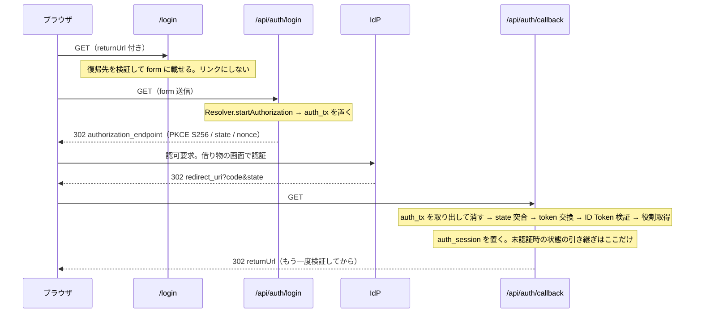

# 認証の前側

この表現層が認証について**何を持ち、何を持たないか**を、実装を読んだうえで通しで説明する。決定そのもの —— seam の形・2 層の認可・Resolver 方式・所有画面の線 —— は [ADR 0079](../adr/0079-auth-frontend-seam.md) が持ち、入口（`proxy.ts`）の射程は [ADR 0043](../adr/0043-middleware-policy.md)、開発用の口の制御面は [ADR 0113](../adr/0113-development-access-surface.md) が持つ。ここが持つのは、それらを読むために要る前提と、実装の在り処、そして読まずに触ると踏む落とし穴である。

判断に迷ったら ADR を優先する。この文書は説明であって規約ではない。

## 責務の線 —— 中継するが、検証しない

バックエンドが**検証する側**であるのに対し、この層は**検証しない側**である。資格情報の正しさを判定しない、試行回数を数えない、鍵を持たない。持つのは次の 3 つだけである。

| 持つもの | 持たないもの |
| --- | --- |
| サインインの導線（`/login`）と、認証を始める操作 | 資格情報の正しさの判定・試行回数の制限・ロックアウト（バックエンド / IdP） |
| IdP から受け取ったトークンを **httpOnly cookie に封緘して持つ**こと | トークンの発行・署名鍵・利用者の記録 |
| session を読んで**入口を捌く**こと（前捌きと確定認可） | 役割の正本（バックエンドが持つ。session に載るのは確立時の写し） |

この非対称が可能にするのは、**IdP を替えても画面が変わらない**ことである。この層が IdP について知っているのは `AUTH_ISSUER` 1 つと、そこから引く Discovery 文書だけで、IdP 固有の SDK も資格情報も依存に入っていない。バックエンドの役割体系も知らない —— 知っているのは「特権を持つ側 / 持たない側」の 2 値だけで（`src/model/session.ts` の `SESSION_ROLE`）、この集合は自分の体系へ置き換える。

同じ非対称が不可能にするのは、**session の中身を自分で検証すること**である。cookie を復元できたなら、その中身は正しいと信じる —— 役割が確立時のまま古くなっていても、この層には照らし合わせる先が無い。確定認可（`verifySession()`）が確かめているのは「この cookie は自分が封緘したもので、まだ失効していない」ことまでであり、「この主体はいまもこの役割を持つ」ことではない。それを答えられるのは、Bearer を検証するバックエンドだけである。

## 登場するもの

| 役割 | 在り処 |
| --- | --- |
| session の型（内側の層へ渡してよい身元）と役割の述語 | `src/model/session.ts` |
| 保護する経路の宣言と、管理への述語 | `src/model/authz.ts` |
| 復帰先の検証（open redirect を止める） | `src/model/return-url.ts` |
| 入口の前捌き（optimistic な認可・origin・`Cache-Control`） | `src/proxy.ts` |
| 確定認可の入口 `verifySession()`・Bearer の取り出し口・cookie の読み書き | `src/adapters/server/auth/session.ts` |
| 差し替え点 `SessionResolver` の面 | `src/adapters/server/auth/session-resolver.ts` |
| 既定 Resolver（Authorization Code + PKCE、JWE 封緘、RP-Initiated Logout） | `src/adapters/server/auth/default-session-resolver.ts` |
| 開発用 Resolver（IdP の代わりに `/dev/session` へ送り出す） | `src/adapters/server/auth/development-session-resolver.ts` |
| どちらの Resolver を選ぶか | `src/adapters/server/auth/resolver.ts` |
| cookie の名前と属性 | `src/adapters/server/auth/session-cookie.ts` |
| 認証の往復の口 | `src/app/api/auth/{login,callback,logout}/route.ts` |
| ログイン画面 | `src/app/(auth)/login/page.tsx` → `src/features/auth/login-view.tsx` |
| 開発用の口（画面・Server Action・認可 endpoint・直接発行 API） | `src/app/dev/session/` / `src/app/api/auth/test-session/route.dev.ts` |
| 開発専用の口を開けてよいかの判定 | `src/config/load-environment.ts` の `isDevelopmentOnlyEndpointOpen()` と `src/adapters/server/auth/development-access.ts` |
| `AUTH_*` の検証と Config | `src/config/auth/` |

`features` からは `adapters/server/auth` を引けない（`architecture.ts` の区画 `adapters-auth`。引けるのは `app` / `adapters` / `proxy`）。したがって session を読む場所は app 層の器・Server Action・Route Handler に限られ、feature が受け取るのは判定済みの結果だけになる。

## session の持ち方

**2 つの型を分けている。** `Session`（`userId` / `role` / `expiresAt`）は内側の層へ渡してよい身元で、`SessionRecord` はそれに Access Token と ID Token を足したものである。`verifySession()` が返すのは前者だけで、後者は `adapters/server/auth` の外へ出ない。`readSessionRecord` は復元した記録を taint に登録するので、記録そのものを Client Component へ渡すと描画が落ちる —— ただし参照でしか追えないため、項目を抜き出したコピーには及ばない。約束が主で、taint は補助である。

**cookie は 2 枚ある。**

| cookie | 中身 | 寿命 |
| --- | --- | --- |
| `auth_session` | `SessionRecord` を JWE（`dir` / `A256GCM`）で封緘したもの | Access Token の `expires_in`（無ければ ID Token の `exp`） |
| `auth_tx` | 認可要求の一時状態（`state` / PKCE 検証子 / `nonce` / 復帰先） | 600 秒。callback で取り出すと同時に消える |

属性はどちらも `httpOnly` / `sameSite: "lax"` / `path: "/"` で、`secure` は `AUTH_REDIRECT_URI` の scheme が `https:` かで決まる。`strict` にしないのは、IdP からのリダイレクトで cookie が届かず callback が成立しなくなるためである。鍵は `AUTH_SESSION_SECRET` を SHA-256 に通した 32 バイトで、設定側に長さの制約を課さない。

**session の寿命は Access Token の寿命と同じである。** Resolver の面に `refresh` は無い —— それを使う既定実装が無いためで、IdP が refresh を持つなら `restore` の内側で完結させる。失効した session は `restore` が `null` を返し、未認証と区別されない（壊れた cookie も同じ）。失効・改竄・鍵の入れ替えを呼び出し側が区別できると、その区別が攻撃者への手掛かりになる。

**役割は確立時に 1 度だけ引く。** 既定 Resolver は `resolveRole` を依存として受け取り、`completeAuthorization` の途中で Access Token を渡して呼ぶ。ここは cookie がまだ無い唯一の往復なので、取得口は `getBearerToken` ではなく `bearerToken` の綴りで解決済みの値を渡す（[ADR 0112](../adr/0112-data-classification-cache-boundary.md) 決定 5 の例外）。**`resolveRole` を渡さなければ、権限を持たない側へ倒す。** 同梱サンプルはバックエンドの役割の口を繋いでいるが、その adapter はサンプルと一緒に消えるので、残る側では役割の出所を繋ぎ直す。

## 認証の往復

**始めるのは form であってリンクではない。** 認可要求の開始は一時状態の cookie を置く操作なので、リンクにすると prefetch で利用者が押していないのに始まる。

**callback の失敗はすべて `/login` へ戻す。** `state` 不一致・復号失敗・`nonce` 不一致・`azp` 不一致・IdP がエラーを返した場合のどれも同じ扱いで、理由は画面に出さず記録にだけ残す。何が欠けたか（`code` / `state` / 一時状態）は booleans で記録され、IdP 側の設定違いで全員が入れない状態になったときの手掛かりはそこにしかない。

ログアウトは `POST /api/auth/logout` だけが受ける。`signOut()` は**先に自分の cookie を消し**、それから IdP の終了口（Discovery の `end_session_endpoint` に `id_token_hint` を添えた URL）を返す。Route Handler はそこへ 303 で送り出す。**IdP 側の session を終わらせるのは、この応答ではなく次の遷移である** —— IdP の session を持っているのは利用者のブラウザの cookie で、サーバから叩いた要求にそれは載らない。送り先を組み立てられなくてもトップへ戻す。手元の cookie は既に消えているので、利用者はログアウトできている。

## 保護の掛かる場所

保護は 3 段あり、どれも他の段が見えないものを見ている。

| 段 | 何を見るか | どこ |
| --- | --- | --- |
| 前捌き（optimistic） | cookie を復元できるか、宣言した役割を持つか。データ源は引かない | `src/proxy.ts` の `authorize` |
| 確定認可 | 同じ cookie を、描画・Server Action・Route Handler の各入口で改めて確かめる | `verifySession()` を呼ぶ側 |
| バックエンド | Bearer の署名と主体。この層が唯一持てない判定 | `adapters/server` の取得口が 401 を `unauthenticated` へ写す |

**どの経路に何の役割が要るかは `src/model/authz.ts` の 1 か所が宣言する。** 保護される側を列挙し（公開側を列挙すると足した画面が既定で公開になる）、接頭辞は入れ子にしない（どちらの宣言が勝つかの規則が要らないようにする）。前捌きも確定認可も `robots.ts` も同じ宣言を引く。残る側の宣言は `/account`（認証だけ）と `/admin`（特権だけ）の 2 つで、求める役割が違う 2 つを残すのは、役割不足で弾く分岐を通す入力を無くさないためである。**残る側に `/account` の画面は無い** —— 宣言だけが置き場として残っている。

**未認証と役割不足は行き先が違う。** 未認証は `/login?returnUrl=<元の URL>` へ送る（やり直せば入れる）。役割不足は `/` へ送り、復帰先を持たせない（やり直しても同じ結果になる）。403 の画面も出さない —— 導線を出していない以上、届いた時点で URL を直接叩いた要求であり、権限の有無を答えることは面の存在を教えることにしかならない。前捌きと確定認可は同じ行き先へ送る。

**役割を持たない主体には、入口そのものを出さない。** 出したうえで押した先で断ると、その面がある事実だけが誰にでも伝わる。出す・出さないの判定と確定認可は同じ述語（`isAdmin` / `hasAllowedRole`）を使い、別々に書かない。判定は session を読む部品を `Suspense` の穴として器へ差す形で行う —— 器で読むと cookie に触れた時点で殻が動的になり、器を通る画面が全部バックエンドの往復を待つ。

**Server Action は画面とは別の入口である。** 画面が保護されていることを理由に断言を省かない。特権の要る操作は Action の先頭で `verifySession()` を通し、足りなければ `PERMISSION_DENIED` を返す。

**Route Handler は宣言した接頭辞の下にあるときだけ前捌きの対象になる。** `/api` を matcher から外していないのはこのためで、逆に `/api/auth/*` と `/api/health` は宣言に無いので誰でも叩ける。認証の要る取得の Route Handler は自分では弾かず、`adapters` が返す `unauthenticated` をそのまま 401 へ写す —— 判定を 2 か所に置くと片方だけが緩む。

### `proxy.ts` が入口で見るもの

前捌きは認可だけをしているのではない。順に、**停止判定**（`APP_MAINTENANCE_MODE`。認可より先に置き、読み取りは停止画面へ rewrite、それ以外は 503）、**origin の判定**（宣言に無い origin からの状態を変える要求は 403。`/api/*` へは宣言した origin に限って CORS を開く）、**認可**、そして応答の前に **`Cache-Control: private, no-store`** を session cookie を載せた要求と cookie を書き換えた応答に一律で付ける。画面や Route Handler ごとに書かないのはこのためである。

matcher は `_next/static` / `_next/image` / metadata ファイルを外している。外した経路には `Cache-Control` も届かないので、画像最適化に載るのが公開画像だけであることが前提になる。

## dev / live のモード —— 何を差し替え、何を差し替えないか

軸は 2 つあり、直交している。**API の相手**（`APP_API_MODE=mock | live`）と、**認可の開始先**（`AUTH_MODE=idp | dev`）である。前者は `mocks/` が差し替える（認証はそこを通らない —— IdP との往復は Discovery が示す口へ出るもので、契約から生成したハンドラは間に挟まらない）。後者がここの主題である。

| `APP_ENV` | `APP_API_MODE` | `AUTH_MODE` | 到達のしかた |
| --- | --- | --- | --- |
| `local` | `live` | `idp`（既定） | 開発用 IdP へ通常のログインを通す。`/dev/session` も開く |
| `ci` | `mock` | `dev` | `/login` が `/dev/session` へ送り出す。E2E は `/api/auth/test-session` で直接発行する |
| `dev` / `stg` / `prd` | `live` | `idp` | 実 IdP。**`AUTH_*` は空欄で、利用側が埋める** |

**`AUTH_MODE=dev` だけでは何も起きない。** `resolver.ts` の `usesDevelopmentAuthorization()` は `isDevelopmentOnlyEndpointOpen()`（`APP_ENV` が明示され、かつ `local` / `ci`）と併せて見る。`AUTH_MODE` だけを条件にすると、設定を誤って実環境へ `dev` を与えた瞬間に、IdP を通らずに任意の役割で入れる経路が公開ドメインで開く。

開発用 Resolver が**差し替えるのは 2 つだけ**である。

| 差し替える | 差し替えない |
| --- | --- |
| `startAuthorization` —— IdP の authorize の代わりに `/dev/session?returnUrl&state` へ送り出す | `seal` / `restore` / `sealTransaction` / `restoreTransaction` —— 既定 Resolver をそのまま借りる。cookie の形が方式で変わると、`dev` で作った session を `idp` で読めなくなる |
| `completeAuthorization` —— IdP の token 交換の代わりに、封緘した開発用の認可コードを開く | `auth_tx` の往復と `/api/auth/callback` —— 本番と同じ経路を通す。ここで直接 session を置くと、callback が一度も踏まれないまま画面を触り続け、往復が壊れていても気づけない |
| `endSession` —— 終わらせる相手が居ないので `null` | 保護ルートの判定・復帰先の検証・役割の述語 —— Resolver の外にあり、方式に依らない |

開発用の認可コードは、指定（主体 / 役割 / 失効秒数 / Access Token）だけでなく**発行元の要求の `state` も一緒に封緘する**。指定だけを封緘すると、コードを持っている側が自分で新しい往復を始めて交換できてしまう（一時状態の消費が止められるのは「自分の往復を自分でもう一度使うこと」だけ）。実在の IdP では PKCE の検証子がこの役目を負う。

`/dev/session` には送信先が 2 つある。**直接開いたとき**は Server Action がその場で session を置いて戻り先へ送る。**認可の往復の途中で開かれたとき**（URL に `state` がある）は素の form で `/dev/session/authorize`（Route Handler）へ送り、そこが認可コードを持って `/api/auth/callback` へ 303 する。Server Action の `redirect()` は Route Handler へ遷移できない（[rendering.md](rendering.md)）ので、この経路だけ Route Handler になっている。

**live に繋ぐとき、Bearer は `/dev/session` が取る。** 「誰として入るか」に入れた主体で、指定した issuer の Discovery を引き、Resource Owner Password Credentials で主体を名指ししたトークンを取る（`development-token.ts`）。接続先を設定から固定しないのは、バックエンドを複数の口で並行して立てる開発機では、いま叩いている API が期待する IdP と `AUTH_ISSUER` がずれるためである。ずれたまま取るとトークンは出るのに API で 401 になる。この付与方式は本物の IdP で使ってはならない（廃止済み）—— 通るのは、照合する相手が居ない開発用の実装だからである。mock に繋いでいる間は Bearer を検証する先が無いので、空欄で足りる。

**開発用の口は 2 重に閉じている。** `page.dev.tsx` / `route.dev.ts` の拡張子は、`next.config.ts` が `isDevelopmentOnlyEndpointOpen()` を見て build に含めるかを決めるので、実環境の成果物には面そのものが無い。加えて実行時に、画面・Server Action・Route Handler がそれぞれ `isDevelopmentAccessAllowed()`（環境 + `Host` / `X-Forwarded-Host` が手元の名前）を呼び、閉じているときは 404 を返す。宛先の判定は防御線ではない —— `Host` は名乗る値で偽れる。止めるのは設定を誤ったまま公開したときに普通の利用者が普通に踏む経路で、狙って偽る相手を止めるのは環境の側である。

## 開発用 IdP が持たないもの

`local` が繋ぐ開発用 IdP（バックエンドの compose が立てる）は、この層が要るものを揃えている —— OIDC Discovery、Authorization Code + PKCE、`end_session_endpoint`、主体を名指しできるパスワード付与。**同時に、実在の IdP が持つもののうち 3 つを持たず、設計はそれを前提に組んである。** 立っている実物に対して確かめた結果である。

1. **refresh token を返さない。** token endpoint の応答は `access_token` / `id_token` / `expires_in`（3600 秒）だけで、Resolver の面に `refresh` が無いのと釣り合っている。**失効に到達する手段は、待つか、`/dev/session` で失効秒数を短くして入るかの 2 つ**である。失効後の見え方（復帰先付きでログインへ送られる）は後者で踏む。
2. **利用者の記録も役割も持たない。** ログイン画面（またはパスワード付与）に入れた名前がそのまま `sub` になり、誰でも認証は成功する。この層が役割を IdP の claim から読まずバックエンドから引くのはこのためで、バックエンドに登録の無い主体はトークンこそ出るが API で 401 になる。**特権を持つ側と持たない側を切り替えたいときは、登録済みの主体を使い分けるか、`/dev/session` で役割を直接与える**（[ADR 0113](../adr/0113-development-access-surface.md) —— 制御面は到達したい状態で決め、実システムのポリシーで狭めない）。なお `mock` の側でも「認証済みだが記録が無い」状態は作れない —— 契約から生成したハンドラは 404 を返さない。
3. **実在の IdP が拒むものを拒まない。** `redirect_uri` は登録と照合されず、PKCE は `plain` も広告され強制されない。したがって**認可の往復を守る検証はすべてこちら側にある** —— S256 しか実装しない `pkce.ts`、`state` / `nonce` / `azp` の突合、`iss` と Discovery の `issuer` の完全一致、復帰先と `post_logout_redirect_uri` を `redirectUri` から導くこと。開発用 IdP で通ったことは、実在の IdP で通ることを保証しない。逆に、実在の IdP に登録する値（callback URL・ログアウト後の戻り先）は、開発用 IdP では要らなかった分だけ忘れやすい。

## 資格情報が出てはいけない境界

| 境界 | 何が止めるか |
| --- | --- |
| **ブラウザ** | Access Token は `Session` 型に含めない。cookie は httpOnly。`SessionRecord` と `AUTH_SESSION_SECRET` は taint に登録され、Client Component へ渡した時点で描画が落ちる。`/dev/session` は貼った Access Token を読み返す欄を持たない |
| **ログ・span** | `authorization` / `cookie` / `password` / `token` の名前を持つ項目を一律に伏せる（`src/logging/logger.ts` の `REDACTED_FIELD_NAMES`。値の形は見ない）。callback が記録するのは何が欠けたかの booleans と `cause` の文字列だけで、トークンは持ち回らない |
| **外向きの要求** | Bearer を付けるのは `baseUrl` と同じ origin へ出る要求だけ（`request.ts` の `authorizationHeader`）。Discovery が返す絶対 URL のように接続先を離れる宛先には載せない。取得口へ渡せるのは import した `getBearerToken` だけで、掴んだ値・引数で持ち回った値は lint が落とす |
| **第三者のクライアント** | `/api/*` への CORS は `HTTP_ALLOWED_ORIGINS` に宣言した origin にしか開かず、宣言に無い origin からの状態を変える要求は前捌きが 403 で止める。ログアウトは POST だけを受ける（GET で消せると `` だけでログアウトさせられる） |
| **設定** | 同梱の `AUTH_SESSION_SECRET` は `local` / `ci` 以外で起動を拒む。公開リポジトリに平文で載っている値なので、それで封緘した cookie は誰でも偽造できる |

**通過するだけの値に責任範囲が広がるのは、保存・ログ・派生を始めた時点である。** ID Token だけは例外で、ログアウトの送り先に `id_token_hint` として埋めて外へ出る —— RP-Initiated Logout は利用者のブラウザ経由でそれを IdP へ届ける手順であり、届かないと IdP 側が終わらない。出るのはこの 1 用途だけで、Access Token は今も外へ出ない。

## いまの実装と ADR 0079 §8 の差

**[ADR 0079](../adr/0079-auth-frontend-seam.md) §8 が定める形と、いまの実装は一致していない。** どちらが実態かを先に書く。

| | ADR §8 / §6 が定める形 | いまの実装 |
| --- | --- | --- |
| 資格情報の入力面 | `/login` が所有する。利用者は自分のドメインを離れない | **IdP の画面（借り物）が受け取る。** `/login` は「ログインへ進む」の 1 ボタンで、`/api/auth/login` が authorize endpoint へ 302 する |
| 検証との接点 | Route Handler がバックエンドへ中継し、バックエンドが正規化したチャレンジを返す | **既定 Resolver が OIDC クライアントとして IdP と直接往復する**（Discovery / token 交換 / JWKS） |
| 借り物の画面が現れる場所 | federation の連携先と IdP の終了口だけ | **主たる経路そのもの** |

つまり、いまの実装は同 ADR §6 が **federation に限って**認めている形を、主たる経路として採っている。ADR は書き戻していない —— 決定のほうが正しく、実装が追いついていないだけだからで、ADR を実態へ倒すと、戻す根拠が消える。

実装がそこへ届いていないのは、この層の中だけでは進められない前提の連鎖に従属しているためである。**IdP の構築が先、次にバックエンドが認証機構を持って正規化されたチャレンジを返すこと、最後にこの層の画面**の順で、逆順に着手すると、契約が無い状態で画面を書き、契約が決まった時点で書き直すことになる。`env/.env.{dev,stg,prd}` の `AUTH_*` が空欄なのはこの帰結で、cloud 環境の認証はこの層が単独で閉じられない。

連鎖が解けたとき変わるのは、`/login` が入力面を持つことと、`/api/auth/login` が「IdP へ送り出す口」から「バックエンドへ中継する口」へ変わることである。session の封緘・保護ルートの判定・復帰先の検証・ログアウト時の破棄は Resolver の外にあり、この切り替えで書き直さない。

## 間違えやすいところ

- **`AUTH_MODE=dev` を置いても `APP_ENV` が `local` / `ci` でなければ既定 Resolver が選ばれる。** 起動は通り、`/login` は IdP へ向かう。`APP_ENV` 未指定は既定へ落ちず起動時に落ちる。
- **`verifySession()` は「cookie が自分のもので失効していない」までしか確かめない。** 役割は確立時の写しで、バックエンド側で変わっても session が失効するまで古いままである。役割を変えた主体には入り直させる。
- **session の寿命は Access Token の寿命である。** 開発用 IdP では 3600 秒。refresh は無いので、それを過ぎると保護された画面がログインへ送り出す。「1 時間ごとにログインを求められる」は不具合ではなく既定の姿で、伸ばす手段は IdP 側の `expires_in` か、`restore` の内側に refresh を足すことである。
- **callback の失敗は理由なしで `/login` へ戻る。** 画面から原因は読めない。ログの `認可の完了に失敗しました` / `認可の応答を受け取れませんでした` を見る。`auth_tx` は取り出した時点で消えるので、callback の URL を再読み込みすると 2 度目は必ず失敗する。
- **Discovery の `issuer` は `AUTH_ISSUER` と文字列として完全一致していなければならない。** 末尾の `/` の有無だけで `INTERNAL` になり、`/login` に「認証を始められませんでした」が出る。手元では `http://localhost:2010/default` のように、IdP が名乗る形そのままを置く。
- **`signOut()` は URL を返すだけで、遷移させなければ IdP 側は終わらない。** 返り値を捨てると手元だけのログアウトになり、直後の再ログインが認証を求めずに素通りする。開発用 Resolver は `null` を返すので、`dev` で「ログアウトしても IdP に戻らない」のは正常である。
- **`sameSite` を `strict` にすると認証が成立しない。** IdP からのリダイレクトで `auth_tx` が届かず、callback は「一時状態が無い」で `/login` へ戻る。
- **`secure` は `APP_ENV` ではなく `AUTH_REDIRECT_URI` の scheme で決まる。** `https://` の callback を置いたまま `http://localhost` で開くと cookie が保存されず、ログインが成立したように見えて次の要求で未認証になる。
- **前捌きは宣言した接頭辞しか見ない。** `/api/auth/*` と `/api/health` は誰でも叩ける。認証の要る Route Handler を足すときは、`authz.ts` へ接頭辞を足すか、`adapters` の 401 を写すかのどちらかであり、Route Handler 自身に判定を書かない。
- **`Cache-Control: private, no-store` は matcher が外した経路には届かない。** 主体ごとに違う画像を `next/image` に載せるなら、除外を見直す。
- **Bearer は `baseUrl` と同じ origin にしか付かない。** Discovery が返した絶対 URL や、別 origin の API を同じクライアントで叩くと、認証なしで出ていって 401 になる。接続先ごとにクライアントを作る。
- **`resolveRole` を渡さなければ全員が権限を持たない側になる。** サンプルを破棄した直後はこの状態で、`/admin` には誰も入れない。役割の出所を繋ぐのが最初の仕事である。
- **`/account` は宣言だけで画面が無い。** 前捌きは効く（未認証で踏むとログインへ送られる）が、認証後に戻ると 404 になる。宣言を消さずに画面を足すか、宣言ごと自分の接頭辞へ書き換える。
- **Server Action から Route Handler へ `redirect()` しても要求は出ない。** `/dev/session` の認可の往復が素の form 送信になっているのはこのためで、同じ形を他所で組むときも Server Action を経由させない。
- **`use cache` の下で `verifySession()` は呼べない。** `cookies()` を読むため framework が落とす。認可の判定は穴の内側で解く。
- **開発用 IdP で通ったことは、実在の IdP で通ることを保証しない。** `redirect_uri` の登録、`post_logout_redirect_uri` の登録、PKCE の強制はすべて実在の IdP 側にしか無い。`dev` へ繋いだ最初の 1 回で落ちるのは、たいていこの登録漏れである。

## 関連する ADR

- [0079](../adr/0079-auth-frontend-seam.md) — 認証の前側の seam。所有の線・2 層の認可・Resolver 方式・§8 の所有画面
- [0043](../adr/0043-middleware-policy.md) — `proxy.ts` は optimistic な前捌きまで。唯一の防御線にしない
- [0113](../adr/0113-development-access-surface.md) — 開発用の口の制御面と、それを閉じる環境の判定
- [0112](../adr/0112-data-classification-cache-boundary.md) — 資格情報が通る道のりの関所。`bearerToken` の例外
- [0030](../adr/0030-environment-variable-management.md) — `AUTH_*` の読み方・secret の境界・taint
- [0011](../adr/0011-no-docker.md) — 環境の定義と、開発専用の口が開く環境
- [0070](../adr/0070-backend-role-separation.md) — 認証本体は out of scope。役割の正本はバックエンド
- [0021](../adr/0021-frontend-responsibility.md) — `adapters/server/auth` へ触れてよい層
- [0080](../adr/0080-error-handling.md) — 401 / 403 の分類と、`unauthenticated` を畳まないこと
- [0111](../adr/0111-csp-security-headers.md) — 応答ヘッダの配置。`proxy.ts` が持つ `Cache-Control`
