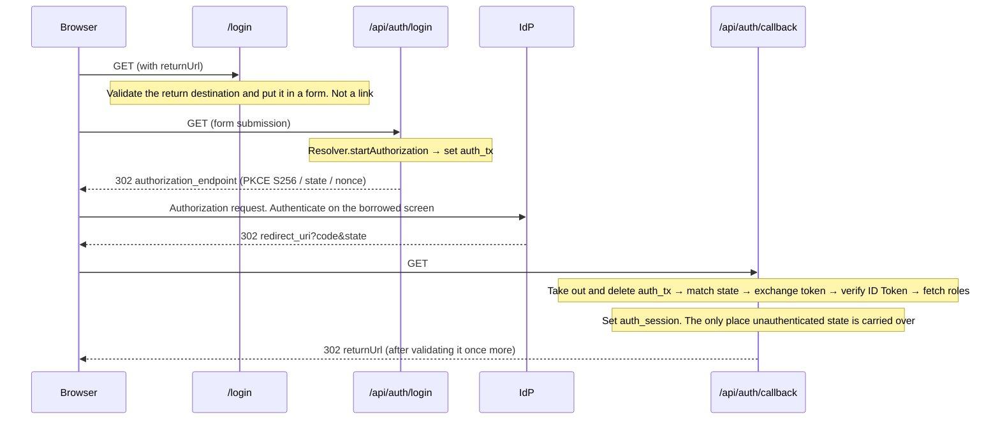

# The Front Side of Authentication

This page explains end to end, after reading the implementation, **what this presentation layer holds and does not hold** about authentication. The decisions themselves — the shape of the seam, the two tiers of authorization, the Resolver approach, the line around the screens it owns — belong to [ADR 0079](../adr/0079-auth-frontend-seam.md); the reach of the entry point (`proxy.ts`) belongs to [ADR 0043](../adr/0043-middleware-policy.md), and the control surface of the development endpoints to [ADR 0113](../adr/0113-development-access-surface.md). What this page holds is the background needed to read them, where the implementation lives, and the pitfalls you step into if you touch it without reading.

When in doubt, the ADR wins. This document is an explanation, not a rule.

## The line of responsibility — relay, but do not verify

Where the backend is **the side that verifies**, this layer is **the side that does not verify**. It does not judge whether credentials are correct, does not count attempts, and holds no keys. It holds only the following three things.

| Holds | Does not hold |
| --- | --- |
| The sign-in path (`/login`) and the action that starts authentication | Judging whether credentials are correct, limiting attempts, lockout (backend / IdP) |
| **Holding the tokens received from the IdP sealed in an httpOnly cookie** | Issuing tokens, signing keys, the record of users |
| Reading the session to **screen requests at the entry points** (pre-screening and confirmed authorization) | The authoritative copy of roles (held by the backend; what the session carries is a copy taken when it was established) |

What this asymmetry makes possible is that **swapping the IdP does not change the screens**. All this layer knows about the IdP is the single `AUTH_ISSUER` and the Discovery document fetched from it; no IdP-specific SDK or credentials are among its dependencies. It does not know the backend's role system either — all it knows is the two values "the privileged side / the unprivileged side" (`SESSION_ROLE` in `src/model/session.ts`), and this set is replaced with your own system.

What the same asymmetry makes impossible is **verifying the session's contents itself**. If the cookie can be restored, its contents are trusted as correct — even if the role has gone stale since it was established, this layer has nothing to check it against. What confirmed authorization (`verifySession()`) establishes goes only as far as "this cookie is one I sealed, and it has not expired yet", not "this principal still holds this role". Only the backend that verifies the Bearer can answer that.

## The Pieces Involved

| Role | Location |
| --- | --- |
| The session type (the identity that may be passed to inner layers) and the role predicates | `src/model/session.ts` |
| The declaration of protected routes, and the predicate for admin | `src/model/authz.ts` |
| Validating the return destination (stopping open redirects) | `src/model/return-url.ts` |
| Pre-screening at the entry point (optimistic authorization, origin, `Cache-Control`) | `src/proxy.ts` |
| The entry point of confirmed authorization `verifySession()`, the point that extracts the Bearer, reading and writing cookies | `src/adapters/server/auth/session.ts` |
| The surface of the replacement point `SessionResolver` | `src/adapters/server/auth/session-resolver.ts` |
| The default Resolver (Authorization Code + PKCE, JWE sealing, RP-Initiated Logout) | `src/adapters/server/auth/default-session-resolver.ts` |
| The development Resolver (sends the user to `/dev/session` instead of the IdP) | `src/adapters/server/auth/development-session-resolver.ts` |
| Which Resolver is chosen | `src/adapters/server/auth/resolver.ts` |
| Cookie names and attributes | `src/adapters/server/auth/session-cookie.ts` |
| The endpoints of the authentication round trip | `src/app/api/auth/{login,callback,logout}/route.ts` |
| The login screen | `src/app/(auth)/login/page.tsx` → `src/features/auth/login-view.tsx` |
| The development endpoints (screen, Server Action, authorization endpoint, direct-issue API) | `src/app/dev/session/` / `src/app/api/auth/test-session/route.dev.ts` |
| Deciding whether development-only endpoints may be open | `isDevelopmentOnlyEndpointOpen()` in `src/config/application-environment.ts` and `src/adapters/server/auth/development-access.ts` |
| Validation of `AUTH_*` and the Config | `src/config/auth/` |

`features` cannot reach `adapters/server/auth` (the `adapters-auth` zone in `architecture.ts`; only `app` / `adapters` / `proxy` can reach it). So the places that read the session are limited to the app layer's layout shells, Server Actions and Route Handlers, and a feature receives only the already-judged result.

## How the Session Is Held

**Two types are kept apart.** `Session` (`userId` / `role` / `expiresAt`) is the identity that may be passed to inner layers, and `SessionRecord` is that plus the Access Token and ID Token. `verifySession()` returns only the former; the latter never leaves `adapters/server/auth`. `readSessionRecord` registers the restored record with taint, so passing the record itself to a Client Component makes rendering fail — but because taint can follow only references, it does not reach a copy with fields picked out of it. The promise is primary; taint is a backstop.

**There are two cookies.**

| Cookie | Contents | Lifetime |
| --- | --- | --- |
| `auth_session` | `SessionRecord` sealed with JWE (`dir` / `A256GCM`) | The Access Token's `expires_in` (the ID Token's `exp` if absent) |
| `auth_tx` | The temporary state of the authorization request (`state` / PKCE verifier / `nonce` / return destination) | 600 seconds. Deleted at the moment the callback takes it out |

Both have the attributes `httpOnly` / `sameSite: "lax"` / `path: "/"`, and `secure` depends on whether the scheme of `AUTH_REDIRECT_URI` is `https:`. It is not `strict` because then the cookie would not arrive on the redirect from the IdP and the callback could not complete. The key is `AUTH_SESSION_SECRET` passed through SHA-256 into 32 bytes, so no length constraint is imposed on the configuration side.

**The session's lifetime equals the Access Token's lifetime.** The Resolver surface has no `refresh` — because there is no default implementation that would use it; if the IdP has refresh, it is completed inside `restore`. For an expired session `restore` returns `null`, indistinguishable from unauthenticated (a broken cookie is the same). If the caller could tell expiry, tampering and key rotation apart, that distinction would become a clue for an attacker.

**The role is fetched only once, when the session is established.** The default Resolver takes `resolveRole` as a dependency and calls it with the Access Token partway through `completeAuthorization`. This is the only round trip in which the cookie does not exist yet, so the fetch endpoint is handed the already-resolved value under the spelling `bearerToken` rather than through `getBearerToken` (the exception in [ADR 0112](../adr/0112-data-classification-cache-boundary.md)). **If `resolveRole` is not passed, it falls to the unprivileged side.** The source of roles (the backend's role endpoint) is connected by the adopter in `resolver.ts`.

<!-- sample:begin -->
The bundled sample connects the backend's role endpoint, but that adapter disappears with the sample, so the surviving side reconnects the source of roles.
<!-- sample:end -->

## The Authentication Round Trip

```mermaid
sequenceDiagram
  participant B as Browser
  participant L as /login
  participant A as /api/auth/login
  participant I as IdP
  participant C as /api/auth/callback
  B->>L: GET (with returnUrl)
  Note over L: Validate the return destination and put it in a form. Not a link
  B->>A: GET (form submission)
  Note over A: Resolver.startAuthorization → set auth_tx
  A-->>B: 302 authorization_endpoint (PKCE S256 / state / nonce)
  B->>I: Authorization request. Authenticate on the borrowed screen
  I-->>B: 302 redirect_uri?code&state
  B->>C: GET
  Note over C: Take out and delete auth_tx → match state → exchange token → verify ID Token → fetch roles
  Note over C: Set auth_session. The only place unauthenticated state is carried over
  C-->>B: 302 returnUrl (after validating it once more)
```

**It starts from a form, not a link.** Starting an authorization request is an operation that sets a temporary-state cookie, so as a link it would start on prefetch without the user having pressed anything.

**Every callback failure goes back to `/login`.** A `state` mismatch, a decryption failure, a `nonce` mismatch, an `azp` mismatch and an error returned by the IdP are all treated the same; the reason is not shown on screen and is only recorded. What was missing (`code` / `state` / the temporary state) is recorded as booleans, and that is the only clue when a misconfiguration on the IdP side locks everyone out.

Logout is accepted only by `POST /api/auth/logout`. `signOut()` **deletes its own cookie first**, then returns the IdP's end-session endpoint (Discovery's `end_session_endpoint` with `id_token_hint` attached). The Route Handler sends the user there with a 303. **What ends the session on the IdP side is not this response but the next navigation** — the IdP's session is held by a cookie in the user's browser, and a request made from the server does not carry it. Even when the destination cannot be built, the user is sent back to the top page. The local cookie is already gone, so the user has logged out.

## Where Protection Applies

There are three tiers of protection, and each checks something the others cannot see.

| Tier | What it checks | Where |
| --- | --- | --- |
| Pre-screening (optimistic) | Whether the cookie can be restored and whether it carries the declared role. It does not consult the data source | `authorize` in `src/proxy.ts` |
| Confirmed authorization | The same cookie, checked again at each entry point: rendering, Server Actions, Route Handlers | The callers of `verifySession()` |
| Backend | The Bearer's signature and principal. The one judgment this layer cannot hold | The fetch endpoints in `adapters/server` map 401 to `unauthenticated` |

**Which route requires which role is declared in one place, `src/model/authz.ts`.** It enumerates the protected side (enumerating the public side would make every added screen public by default), and prefixes are not nested (so no rule is needed for which declaration wins). Pre-screening, confirmed authorization and `robots.ts` all read the same declaration. The surviving side has two declarations, `/account` (authentication only) and `/admin` (privileged only); two with different required roles are kept so as not to lose an input that exercises the branch rejecting for insufficient role. **The surviving side has no `/account` screen** — only the declaration remains, as a placeholder.

**Unauthenticated and insufficient role go to different destinations.** Unauthenticated goes to `/login?returnUrl=<the original URL>` (trying again gets you in). Insufficient role goes to `/` with no return destination (trying again gives the same result). No 403 screen is shown either — since no path to it is displayed, a request that arrives is one that hit the URL directly, and answering whether the permission exists would only reveal that the surface exists. Pre-screening and confirmed authorization send to the same destination.

**A principal without the role is not shown the entrance at all.** Showing it and refusing after the click tells anyone the one fact that the surface exists. The show/hide decision and confirmed authorization use the same predicates (`isAdmin` / `hasAllowedRole`), never written separately. The decision is made by inserting the component that reads the session into the layout shell as a `Suspense` dynamic hole — reading it in the layout shell makes the static shell dynamic the moment it touches the cookie, and every screen passing through that layout shell waits for the backend round trip.

**A Server Action is an entry point separate from the screen.** Do not skip the check on the grounds that the screen is protected. An operation that needs privilege passes `verifySession()` at the top of the Action and returns `PERMISSION_DENIED` if insufficient.

**A Route Handler is subject to pre-screening only when it sits under a declared prefix.** This is why `/api` is not excluded from the matcher; conversely, `/api/auth/*` and `/api/health` are not in the declaration, so anyone can call them. A fetch Route Handler that needs authentication does not reject on its own; it maps the `unauthenticated` returned by `adapters` straight to 401 — putting the judgment in two places lets one of them loosen.

### What `proxy.ts` checks at the entry point

Pre-screening does more than authorization. In order: the **maintenance check** (`APP_MAINTENANCE_MODE`; placed before authorization, it rewrites reads to the maintenance screen and returns 503 for everything else), the **origin check** (a state-changing request from an undeclared origin gets 403; CORS for `/api/*` opens only to declared origins), **authorization**, and before the response, **`Cache-Control: private, no-store`** added uniformly to requests carrying the session cookie and to responses that rewrote a cookie. This is why it is not written per screen or per Route Handler.

The matcher excludes `_next/static` / `_next/image` / metadata files. `Cache-Control` does not reach the excluded routes either, so it is a precondition that only public images go through image optimization.

## dev / live modes — what is swapped and what is not

There are two axes, and they are orthogonal: **the API counterpart** (`APP_API_MODE=mock | live`) and **where authorization starts** (`AUTH_MODE=idp | dev`). The former is swapped by `mocks/` (authentication does not pass through it — the round trip with the IdP goes out to the endpoint Discovery points to, and the handlers generated from the contract do not sit in between). The latter is the subject here.

| `APP_ENV` | `APP_API_MODE` | `AUTH_MODE` | How you get in |
| --- | --- | --- | --- |
| `local` | `live` | `idp` (default) | Go through the normal login against the development IdP. `/dev/session` is also open |
| `ci` | `mock` | `dev` | `/login` sends you to `/dev/session`. E2E issues sessions directly via `/api/auth/test-session` |
| `dev` / `stg` / `prd` | `live` | `idp` | The real IdP. **`AUTH_*` are blank, and the adopter fills them in** |

**`AUTH_MODE=dev` alone does nothing.** `usesDevelopmentAuthorization()` in `resolver.ts` looks at it together with `isDevelopmentOnlyEndpointOpen()` (`APP_ENV` is set explicitly, and is `local` / `ci`). If `AUTH_MODE` were the only condition, the moment a misconfiguration gave `dev` to a real environment, a path that lets anyone in with any role without going through the IdP would open on the public domain.

The development Resolver **swaps only two things**.

| Swapped | Not swapped |
| --- | --- |
| `startAuthorization` — sends the user to `/dev/session?returnUrl&state` instead of the IdP's authorize | `seal` / `restore` / `sealTransaction` / `restoreTransaction` — borrowed from the default Resolver unchanged. If the cookie's shape changed with the approach, a session made under `dev` could not be read under `idp` |
| `completeAuthorization` — instead of the IdP's token exchange, opens a sealed development authorization code | The `auth_tx` round trip and `/api/auth/callback` — the same path as production. Setting the session directly here would keep you using the screens without ever hitting the callback, and you would not notice a broken round trip |
| `endSession` — `null`, since there is nothing to end | The protected-route decision, return-destination validation, the role predicates — these sit outside the Resolver and do not depend on the approach |

The development authorization code seals **not only the specification (principal / role / expiry seconds / Access Token) but also the `state` of the issuing request**. If only the specification were sealed, whoever holds the code could start a new round trip of their own and exchange it (consuming the temporary state stops only "reusing your own round trip"). With a real IdP, the PKCE verifier carries this role.

`/dev/session` has two submit targets. **When opened directly**, a Server Action sets the session on the spot and sends the user to the return destination. **When opened partway through an authorization round trip** (the URL carries `state`), a plain form submits to `/dev/session/authorize` (a Route Handler), which then 303s to `/api/auth/callback` with the authorization code. A Server Action's `redirect()` cannot navigate to a Route Handler ([rendering.md](rendering.md)), so only this path is a Route Handler.

**When connecting to live, `/dev/session` obtains the Bearer.** For the principal entered in 「誰として入るか」 ("who to sign in as"), it fetches the Discovery of the specified issuer and obtains a token naming the principal through Resource Owner Password Credentials (`development-token.ts`). The connection target is not fixed from configuration because on a development machine running the backend in parallel on several ports, the IdP expected by the API currently being called and `AUTH_ISSUER` drift apart. Obtaining a token while they disagree yields a token but a 401 from the API. This grant type must not be used with a real IdP (it is deprecated) — it works only because this is a development implementation with no one to check against. While connected to mock there is nothing to verify the Bearer, so blank is enough.

**The development endpoints are closed twice.** For the `page.dev.tsx` / `route.dev.ts` extensions, `next.config.ts` decides whether to include them in the build by looking at `isDevelopmentOnlyEndpointOpen()`, so the build output of a real environment has no such surface at all. In addition, at runtime the screen, the Server Action and the Route Handler each call `isDevelopmentAccessAllowed()` (environment + `Host` / `X-Forwarded-Host` being a local name), and return 404 when closed. The destination check is not a line of defense — `Host` is a self-declared value and can be forged. What it stops is the path an ordinary user would ordinarily hit if the site were published while misconfigured; stopping someone who forges it on purpose is the environment's job.

## What the Development IdP Lacks

The development IdP that `local` connects to (started by the backend's compose) has what this layer needs — OIDC Discovery, Authorization Code + PKCE, `end_session_endpoint`, and a password grant that can name the principal. **At the same time, it lacks three things a real IdP has, and the design is built on that assumption.** This was checked against the running instance.

1. **It does not return a refresh token.** The token endpoint's response is only `access_token` / `id_token` / `expires_in` (3600 seconds), which matches the Resolver surface having no `refresh`. **There are two ways to reach expiry: wait, or sign in through `/dev/session` with a short expiry.** How things look after expiry (being sent to login with a return destination) is exercised with the latter.
2. **It holds no user records and no roles.** The name entered on the login screen (or in the password grant) becomes `sub` as is, and anyone authenticates successfully. This is why this layer fetches roles from the backend rather than reading them from the IdP's claims: a principal not registered with the backend gets a token but a 401 from the API. **To switch between the privileged and unprivileged sides, use different registered principals, or assign the role directly in `/dev/session`** ([ADR 0113](../adr/0113-development-access-surface.md) — the control surface is decided by the states you want to reach, not narrowed by the real system's policy). Note that the `mock` side cannot produce the "authenticated but no record" state either — the handlers generated from the contract do not return 404.
3. **It does not reject what a real IdP rejects.** `redirect_uri` is not checked against a registration, and PKCE advertises `plain` too and is not enforced. So **every check that protects the authorization round trip is on this side** — `pkce.ts`, which implements only S256; matching `state` / `nonce` / `azp`; exact equality between `iss` and Discovery's `issuer`; deriving the return destination and `post_logout_redirect_uri` from `redirectUri`. Passing against the development IdP does not guarantee passing against a real IdP. Conversely, the values registered with a real IdP (the callback URL, the post-logout return destination) are easy to forget, precisely because the development IdP never needed them.

## Boundaries Credentials Must Not Cross

| Boundary | What stops it |
| --- | --- |
| **Browser** | The Access Token is not part of the `Session` type. Cookies are httpOnly. `SessionRecord` and `AUTH_SESSION_SECRET` are registered with taint, and rendering fails the moment one is passed to a Client Component. `/dev/session` has no field that reads back a pasted Access Token |
| **Logs and spans** | Fields named `authorization` / `cookie` / `password` / `token` are redacted uniformly (`REDACTED_FIELD_NAMES` in `src/logging/logger.ts`; the value's shape is not inspected). The callback records only booleans for what was missing and the `cause` string; tokens are not carried around |
| **Outbound requests** | The Bearer is attached only to requests going to the same origin as `baseUrl` (`authorizationHeader` in `request.ts`). It is not attached to destinations that leave the connection target, such as absolute URLs returned by Discovery. Only an imported `getBearerToken` can be passed to a fetch endpoint; a captured value or a value carried around as an argument is rejected by lint |
| **Third-party clients** | CORS for `/api/*` opens only to origins declared in `HTTP_ALLOWED_ORIGINS`, and pre-screening stops state-changing requests from undeclared origins with 403. Logout accepts only POST (if GET could clear it, an `` alone could log someone out) |
| **Configuration** | The bundled `AUTH_SESSION_SECRET` refuses to start outside `local` / `ci`. It is published in plain text in a public repository, so anyone can forge a cookie sealed with it |

**Responsibility for a value that only passes through expands the moment you start storing, logging or deriving from it.** The ID Token alone is the exception: it leaves as `id_token_hint` embedded in the logout destination — RP-Initiated Logout is the procedure that delivers it to the IdP via the user's browser, and without it the IdP side does not end. This one use is the only way it leaves, and the Access Token still never leaves.

## The credential entry surface — the current implementation versus ADR 0079

**The shape [ADR 0079](../adr/0079-auth-frontend-seam.md) prescribes and the current implementation do not match.** Which one is reality is stated first.

| | The shape the ADR prescribes (own the authentication screens including their design; borrowed screens only for federation) | The current implementation |
| --- | --- | --- |
| The credential entry surface | Owned by `/login`. Users never leave your domain | **The IdP's (borrowed) screen receives them.** `/login` is a single 「ログインへ進む」 ("proceed to login") button, and `/api/auth/login` 302s to the authorize endpoint |
| The contact point with verification | A Route Handler relays to the backend, and the backend returns a normalized challenge | **The default Resolver, acting as an OIDC client, round-trips directly with the IdP** (Discovery / token exchange / JWKS) |
| Where borrowed screens appear | Only at federation partners and the IdP's end-session endpoint | **On the main path itself** |

In other words, the current implementation takes as its main path the shape that the same ADR allows **only for federation**. The ADR has not been rewritten — because the decision is the correct one and the implementation simply has not caught up; bending the ADR to fit reality would erase the grounds for going back.

The implementation has not reached it because it depends on a chain of preconditions that cannot be advanced inside this layer alone. The order is **first build the IdP, next have the backend hold an authentication mechanism and return normalized challenges, and last this layer's screens**; starting in reverse order means writing screens with no contract and rewriting them once the contract is settled. The blank `AUTH_*` in `env/.env.{dev,stg,prd}` is a consequence of this: authentication in cloud environments cannot be closed by this layer alone.

When the chain is resolved, what changes is that `/login` holds the entry surface, and that `/api/auth/login` turns from "the endpoint that sends the user to the IdP" into "the endpoint that relays to the backend". Sealing the session, the protected-route decision, return-destination validation and discarding on logout sit outside the Resolver and are not rewritten by this switch.

## Common Pitfalls

- **Setting `AUTH_MODE=dev` still selects the default Resolver unless `APP_ENV` is `local` / `ci`.** Startup succeeds, and `/login` heads for the IdP. An unset `APP_ENV` does not fall back to a default; it fails at startup.
- **`verifySession()` establishes only "the cookie is mine and has not expired".** The role is a copy taken when the session was established, and stays stale until the session expires even if it changed on the backend. Make a principal whose role changed sign in again.
- **The session's lifetime is the Access Token's lifetime.** With the development IdP it is 3600 seconds. There is no refresh, so after that, protected screens send the user to login. "Being asked to log in every hour" is not a defect but the default behavior; the ways to extend it are the IdP's `expires_in`, or adding refresh inside `restore`.
- **A callback failure returns to `/login` with no reason.** The cause cannot be read from the screen. Look at the log messages `認可の完了に失敗しました` / `認可の応答を受け取れませんでした`. `auth_tx` is deleted at the moment it is taken out, so reloading the callback URL always fails the second time.
- **Discovery's `issuer` must match `AUTH_ISSUER` exactly as a string.** A trailing `/` alone makes it `INTERNAL`, and `/login` shows 「認証を始められませんでした」 ("could not start authentication"). Locally, put the exact form the IdP declares, such as `http://localhost:2010/default`.
- **`signOut()` only returns a URL; without navigating there, the IdP side does not end.** Discarding the return value makes it a local-only logout, and the next login goes straight through without asking for authentication. The development Resolver returns `null`, so "logging out under `dev` does not go back to the IdP" is normal.
- **Setting `sameSite` to `strict` breaks authentication.** `auth_tx` does not arrive on the redirect from the IdP, and the callback returns to `/login` with "no temporary state".
- **`secure` depends on the scheme of `AUTH_REDIRECT_URI`, not on `APP_ENV`.** Opening `http://localhost` with an `https://` callback configured means the cookie is not saved: login appears to succeed, and the next request is unauthenticated.
- **Pre-screening looks only at declared prefixes.** `/api/auth/*` and `/api/health` can be called by anyone. When adding a Route Handler that needs authentication, either add the prefix to `authz.ts` or map the 401 from `adapters`; do not write the judgment in the Route Handler itself.
- **`Cache-Control: private, no-store` does not reach routes the matcher excluded.** If you put images that differ per principal through `next/image`, revisit the exclusions.
- **The Bearer is attached only to the same origin as `baseUrl`.** Calling an absolute URL returned by Discovery, or an API on another origin, with the same client sends the request without authentication and gets 401. Create one client per connection target.
- **If `resolveRole` is not passed, everyone ends up on the unprivileged side.** That is the state until it is connected, and nobody can enter `/admin`. Connecting the source of roles is the first job.
- **`/account` is only a declaration with no screen.** Pre-screening works (hitting it unauthenticated sends you to login), but returning after authentication gives a 404. Either add a screen while keeping the declaration, or rewrite the declaration to your own prefix.
- **A `redirect()` from a Server Action to a Route Handler sends no request.** This is why the authorization round trip in `/dev/session` is a plain form submission; when building the same shape elsewhere, do not route it through a Server Action.
- **`verifySession()` cannot be called under `use cache`.** It reads `cookies()`, so the framework fails it. Resolve the authorization decision inside the dynamic hole.
- **Passing against the development IdP does not guarantee passing against a real IdP.** Registering `redirect_uri`, registering `post_logout_redirect_uri` and enforcing PKCE all exist only on the real IdP's side. What fails on the first connection to `dev` is usually one of these missing registrations.

## Related ADRs

- [0079](../adr/0079-auth-frontend-seam.md) — the seam on the front side of authentication. The ownership line, two tiers of authorization, the Resolver approach, owning the authentication screens including their design
- [0043](../adr/0043-middleware-policy.md) — `proxy.ts` goes only as far as optimistic pre-screening. It is never the only line of defense
- [0113](../adr/0113-development-access-surface.md) — the control surface of the development endpoints, and the environment check that closes them
- [0112](../adr/0112-data-classification-cache-boundary.md) — the checkpoints along the path credentials travel. The `bearerToken` exception
- [0030](../adr/0030-environment-variable-management.md) — how `AUTH_*` is read, the secret boundary, taint
- [0011](../adr/0011-no-docker.md) — the definition of environments, and the environments in which the development-only endpoints open
- [0070](../adr/0070-backend-role-separation.md) — authentication itself is out of scope. The authoritative copy of roles is the backend's
- [0021](../adr/0021-frontend-responsibility.md) — which layers may touch `adapters/server/auth`
- [0080](../adr/0080-error-handling.md) — classifying 401 / 403, and not folding `unauthenticated`
- [0111](../adr/0111-csp-security-headers.md) — where response headers are placed. The `Cache-Control` held by `proxy.ts`
