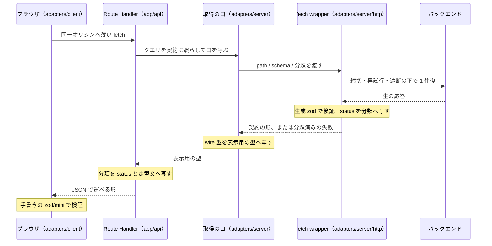
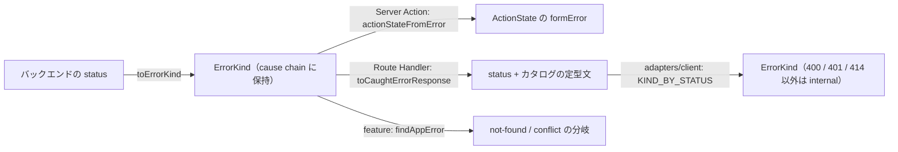

# 取得と契約

ブラウザから BFF（同一オリジンの `/api/*`）へ、BFF からバックエンドへ、値がどの口を通って画面へ届くかを通しで説明する。**この文書が担うのは通り道の説明**であり、何を選んだかは ADR が持つ —— fetch wrapper の責務は [ADR 0071](../adr/0071-bff-api-integration.md)、生成物の扱いは [ADR 0072](../adr/0072-api-type-generation.md)、分類とキャッシュの境界は [ADR 0112](../adr/0112-data-classification-cache-boundary.md)。描画とキャッシュの語彙（memoization / Data Cache / `use cache`）は [rendering.md](rendering.md) が持ち、ここでは取得の口から見た形だけを扱う。

判断に迷ったら ADR を優先する。この文書は説明であって規約ではない。

## 通り道の全体像

値が通る段は 3 つで、**契約に照らして検証するのは 1 段目だけ**である。それより手前の段は、1 段目が確定させた形を運ぶ。



| 段 | 置き場 | 持つもの | 持たないもの |
| --- | --- | --- | --- |
| バックエンドとの往復 | [`adapters/server/http/request.ts`](../../src/adapters/server/http/request.ts) | 締切・再試行・遮断・応答の検証・status の分類 | 業務の判断、ログ |
| 取得の口 | `adapters/server/api/*.ts` | 契約の形から表示用の型への変換、クエリの照合、`cache()` / `use cache` | 生の `fetch` |
| BFF | `app/api/**/route.ts` | 分類を HTTP へ写すこと、クエリの受け取り | 取得・検証・変換 |
| ブラウザ発の取得 | [`adapters/client/http/request.ts`](../../src/adapters/client/http/request.ts) | 同一オリジンへの `fetch`、BFF が組んだ形の検証、status の分類 | 締切・再試行・遮断・資格情報 |

**Server Component と Server Action は BFF を通らない。** どちらもサーバで動くので取得の口を直接呼ぶ。BFF が要るのは、ブラウザで動く部分が続きを取りに来るときだけである（後述「一覧の続きを取る」）。

## `adapters` の server / client が分けているもの

分けているのは実行場所ではなく、**持ってよいもの**である。境界の宣言は `architecture.ts` が持ち、`server/` は `import "server-only"` を名乗る。

| | `adapters/server` | `adapters/client` |
| --- | --- | --- |
| 接続先 | バックエンド（`APP_API_BASE_URL`） | 同一オリジンの BFF だけ |
| 資格情報 | cookie から解決した Bearer を要求境界が付ける | 持たない。ブラウザが cookie を自動で載せる |
| 設定 | server config（接続先・上限） | `NEXT_PUBLIC_` のリテラルだけ |
| 応答の検証 | 契約から生成した zod（`gen/<契約名>/endpoints.zod.ts`） | 手書きの `zod/mini`。BFF が組んだ形を照らす |
| 生成物 | wire 型と zod スキーマ | **`gen/<契約名>/limits.ts` の定数だけ** |
| resilience | 締切・再試行・遮断・retry budget | 無い。中断（`AbortSignal`）だけ |

client 側の要求境界が resilience を持たないのは、同じ往復に対して再試行が 2 つの勘定で走るのを避けるためである。ブラウザ発の要求が失敗したとき、再試行はもう BFF の内側で済んでいる。

**実行文脈を持たない規則は `http/` に置く。** [`http/url-budget.ts`](../../src/adapters/http/url-budget.ts) がその形で、server と client のどちらの要求境界も同じ判定を呼ぶ。片方の element へ置くと、もう片方から import できないので規則が 2 つに割れる。

**`gen/` と `http/` は `adapters` の中からしか届かない。** `architecture.ts` が `adapters-gen` / `adapters-http` として宣言しているためで、`features` が `adapters` を import できることと、生成型が `features` へ素通しで届くことは別である。

## 契約から生成物へ、生成物から表示の型へ

契約の正本はバックエンドのリポジトリにあり、このリポジトリは**取得して固定する**だけを行う。

```text
openapi/sources.yaml            取得座標。repo / path / ref を人が書き、sha は取得時に書き戻る
  └─ make api-fetch ──▶ openapi/<契約名>.gen.yaml     取得物。do-not-edit
        └─ make api-gen ──▶ src/adapters/gen/<契約名>/model/          wire 型
                            src/adapters/gen/<契約名>/endpoints.zod.ts  operation ごとの zod
                            src/adapters/gen/<契約名>/limits.ts        検証を伴わない定数だけ
                            mocks/<契約名>/endpoints.msw.ts            契約駆動モック
```

**生成物を編集しない理由は「次で消える」だけではない。** `make api-gen` は置き場を空にしてから生成するので、手で足したファイルも、契約から消えたスキーマの残骸も、次の生成で無くなる。残っていれば `make api-gen-check` が差分として落とす。linter も掛かっていない（`biome.json` の overrides）ので、規約違反として気づく機会も無い。

### 変換はどこに居るか

生成型が `features` へ漏れないのは、取得の口が**契約の形を受け取り、表示用の型を返す**からである。口の中に `toEntry(wire)` のような変換が居て、外へ出るのは [`model`](../../src/model/README.md) の型だけになる。

```ts
// adapters/server/api/<資源>.ts
type WireEntry = z.infer<typeof GetEntriesResponse>["items"][number];

function toEntry(wire: WireEntry): Entry {
  return {
    id: toEntryId(wire.id),                          // brand は検証の出口で付ける
    publishedAt: wire.publishedAt === null ? null : new Date(wire.publishedAt),
    // ...
  };
}

export const getEntry = cache(async (id: EntryId): Promise<Entry> => {
  const wire = await getClient().request({ path: `/v1/entries/${encodeURIComponent(id)}`, schema: GetEntryResponse });

  return toEntry(wire);
});
```

変換の中で起きていることを 3 つ押さえる。

- **日時は文字列のまま出さない。** 契約は ISO 文字列で運ぶが、内層が受け取るのは `Date` である。逆向き（送るとき）は `toISOString()` へ戻す
- **識別子は brand を付けてから出す。** `string` のまま内層へ渡すと、別の資源の識別子と取り違えても型が通る（[ADR 0029](../adr/0029-type-design-discipline.md)）
- **契約の enum は `satisfies` で生成スキーマに照らす。** 並び順の候補のように画面が名指しする値を、生成型から `z.infer` した型に対して `satisfies` で固定しておくと、契約から値が消えた日に型エラーになる。手で書き写した一覧は再生成しても黙って古いままになる

**逆向きの検証も口が持つ。** URL から来た検索条件は、生成された `...QueryParams` スキーマで照らしてから送る。URL の値は常に文字列なので、契約が整数・真偽値・配列で宣言しているキーだけを先に型へ直し、読めない綴りは文字列のまま zod へ落として「契約を外れたキー」として返す。範囲外の値を既定へ丸めると、絞り込んだつもりの一覧が絞り込まれずに出る。

### client が引けるのは定数だけ

生成 zod は 1 ファイルに全 operation を持つので、定数を 1 つ引くだけでその全体がブラウザへ配られる。だから生成の最後に `limits.ts` を切り出し、client はそこだけを引く。`endpoints.zod.ts` を client から引く経路は `scripts/client-schema-weight.gate.test.ts` が落とす。

## fetch wrapper で起きること

[`createHttpClient`](../../src/adapters/server/http/request.ts) が返す `request()` は、1 回の呼び出しで次の順に進む。**順序が意味を持つ**ので、前から読む。

1. **分類の関門。** `assertSpecWithinScope` が user-scoped の口に `cache` / `tags` が混ざっていないかを、`assertNoCredentialHeader` が呼び出しごとのヘッダに `Authorization` / `Cookie` が無いかを見る。型が既に禁じていることの後詰めで、型を迂回して組んだ spec を止める
2. **URL の組み立て。** 相対パスは接続先の path を残したまま繋ぐ（`new URL(path, base)` は base の path を捨てる）。`.` / `..` の区間を含む path は `invalid-argument` で落とす —— `encodeURIComponent` で包んでも残るためである。絶対 URL はそのまま使う
3. **URL の予算。** 遮断の判定より**先に**確かめる。予算超過は入力の誤りであって接続先の状態ではないので、遮断中の `unavailable` で覆うと直せる誤りが障害に見える
4. **遮断器。** open なら即座に `unavailable`。待たせない
5. **資格情報の解決。** 再試行の**外側で 1 度だけ**。試行ごとに解決すると、認証できないことが接続の失敗と同じ扱いになり、通らない要求を上限回数ぶん送る。接続先と生成元が違う URL には載せない
6. **試行の繰り返し。** 各試行は `perAttemptTimeoutMs` の締切を持ち、全体は `overallTimeoutMs` で打ち切られる。再試行するのは、メソッドが冪等（または `idempotent: true`）で、結果が 5xx / 429 / 応答なしで、retry budget が残っていて、待った先が全体の期限を越えないときだけ。待ち時間は `Retry-After` があればそれ、無ければ full jitter の backoff
7. **成功。** `204` なら本文を読まず、それ以外は JSON を `schema` で照らす。合わなければ `internal` —— 契約破れは送り直しても直らない
8. **失敗。** status を分類へ写し、`422` のときだけ本文の `details` を読む。他の status の本文は読まない

### 接続先ごとに分かれるもの

締切・回数・遮断の閾値は [`ResilienceProfile`](../../src/adapters/server/http/resilience-profile.ts) で、`createHttpClient` の `profile` に渡す。渡さなければ `DEFAULT_PROFILE`（試行 3s / 全体 10s / 3 回 / budget 10% / 失敗率 0.5 を 20 件で判定 / open 5s / half-open 3 本）。

**遮断器と retry budget は client のインスタンスに載る。** だから同じ接続先へ client を複数作ると、劣化したかどうかの判断が作った数だけ割れる。だから**接続先ごとに 1 つを共有する口**を `adapters/server` 側に置き、モジュールごとに作らせない。user-scoped の口は各モジュールがモジュール変数に 1 つずつ持っており、**寄っていない** —— 資格情報の取得口をどこへ寄せるかが `project-rules/no-captured-bearer-token` と交差するためで、扱いは [BACKLOG](../adr/BACKLOG.md) が持つ。

### wrapper が持たないもの

- **trace context の注入。** wrapper は `traceparent` を知らない。付けているのは [`instrumentation.ts`](../../src/instrumentation.ts) が立てる OTel の Undici 計装で、`tracePropagationOrigins` に渡した接続先（`APP_API_BASE_URL` の origin）へ出る `fetch` にだけ載る。他の origin へ叩く要求には載らない
- **ログ。** wrapper は記録しない。失敗は分類済みのエラーとして投げるだけで、記録するかどうかは受け取った側が決める。実装で記録しているのは「読めなければ `null` に畳む口」（後述）と、一部の Route Handler である

## エラーの正規化 —— 生 status が分類へ変わる場所

分類は [`errors`](../../src/errors/README.md) の `ErrorKind` で、transport を知らない。status との対応表は `adapters/server/http` が**両向きとも**持つ。

| 向き | 関数 | 置き場 |
| --- | --- | --- |
| status → 分類 | `toErrorKind(status)` | [`retry-policy.ts`](../../src/adapters/server/http/retry-policy.ts) |
| 分類 → status | `toHttpStatus(kind)` | [`error-status.ts`](../../src/adapters/server/http/error-status.ts) |
| 分類 → 応答 | `toErrorResponse(kind)` / `toCaughtErrorResponse(error)` | [`error-response.ts`](../../src/adapters/server/http/error-response.ts) |

**素通しさせない境界は 3 つある。**



1. **バックエンド → wrapper。** 表に無い status は `internal` へ矯正される。分類を持たない値が上へ出ることは無い
2. **Route Handler → ブラウザ。** `toCaughtErrorResponse` は cause chain から分類を拾い、無ければ `internal` にする。載せる文言は `errors` のカタログが持つ既定文だけで、バックエンドの `message` は出ない
3. **BFF → `adapters/client`。** `KIND_BY_STATUS` に載っている 400 / 401 / 414 だけを写し、残りは `internal` に畳む。BFF が返すのは自分で組んだ応答なので、それ以上の区別は呼び出し側に要らない。**401 だけは畳まない** —— 畳むと画面は読み直す操作しか出せず、押しても同じ経路を辿る

**本文から読むのは `details` だけである。** それも契約が `ErrorResponseWithDetails` を宣言した `422` に限る。読めた項目名は `withErrorDetails` で cause に載り、表示名へ写すのは項目を知っている feature / form の側になる。読めなかった本文は「詳細が無い」に畳み、元の失敗をすり替えない。

**分類が表示へ変わるのは `adapters` の外である。** Server Action は [`actionStateFromError`](../../src/model/action-state.ts) で `formError` へ、Server Component は `findAppError(error)?.kind === ErrorKind.NOT_FOUND` で `notFound()` へ、増分取得の hook は `UNAUTHENTICATED` で `router.refresh()` へ写す。

**補助的な値は口の側で畳む。** 無くても画面が成り立つ添え物（別の口から引く参考表示など）は、`adapters` に「読めなければ `null`」を返す口を置き、投げる口も残す。画面ごとに try / catch を書かせると、同じ判断が画面の数だけ増える。畳んでよいのは、どの画面も同じ扱いをすると言い切れるときだけである。

## 一覧の続きを取る

初回ページは Server Component が取得の口を直接呼ぶ。ブラウザで動く部分が取りに来るのは **2 ページ目以降だけ**で、その経路は往路と復路で口が違う。

```text
features/<一覧>/use-infinite-<資源>.ts        末尾の目印が見えたら続きを頼む
  └─ adapters/client/api/<資源>.ts             同一オリジンへ薄い fetch。件数と cursor を URL に載せる
       └─ app/api/<資源>/route.ts              toRawQuery → parse<資源>Query → 400 / 取得 → toCaughtErrorResponse
            └─ adapters/server/api/<資源>.ts   初回ページと同じ口。JSON で運べる形へ落として返す
```

Route Handler が持つのは分類を HTTP へ写すところだけで、取得も検証も画像 URL の解決も取得の口が済ませている。**Route Handler の `try / catch` は握り潰しではない** —— 投げたままにすると応答の中身が framework の既定になり、内側の事情がそのまま外へ出る。

**BFF が返す形は契約の形ではない。** 取得の口が表示用に絞った形（`Date` も省略可能な値も含まない `CursorPage<T>`）なので、client 側の検証は生成物ではなく手書きの `zod/mini` になる。初回ページと 2 ページ目以降で形が違うと、積み上げた一覧の途中から表示が壊れる。

1 ページの型は [`model/pagination.ts`](../../src/model/pagination.ts) が持つ。`CursorPage<T>` は総件数を持たず（cursor は次の位置しか指さない）、`OffsetPage<T>` は別に持つ。`appendCursorPage` は重複を取り除かない —— 重複が出るのは取得元が cursor の約束を守っていないときで、表示層で吸収すると契約違反が見えなくなる。

hook の側で押さえるのは 3 つ。

- **中断は失敗ではない。** 条件が変わった・画面を離れたときの `abort` は、伝える相手がもう居ない
- **`UNAUTHENTICATED` は「続きの失敗」に畳まない。** `router.refresh()` でサーバへ描き直しを頼み、送り先は route の確定認可に委ねる
- **積み上げを捨てる判断を hook が持たない。** 別の一覧になったかどうかは置く側が `key` で表す。サーバは毎回新しい値を組むので、参照同一性で見張ると常に真になる

## `use cache` / memoization との関係

語の意味と寿命の違いは [rendering.md](rendering.md)「キャッシュ（名前が似ていて寿命が違う）」が持つ。ここでは**取得の口から見て何が違うか**だけを置く。

| 機構 | 口の書き方 | 生存範囲 | 分類 |
| --- | --- | --- | --- |
| React `cache()` | すべての取得の口を包む | 1 リクエストの描画中 | 問わない |
| `use cache` + `cacheLife` + `cacheTag` | 関数の先頭で名乗る | リクエストを跨ぐ（殻へ焼かれた分は確実） | **public だけ** |

**`use cache` を名乗る口は `getPublicClient()` しか引けない。** `createHttpClient` を直に引けるモジュールは user-scoped な client も組める状態にあり、`project-rules/no-user-scoped-in-cached-module` が落とす。`getPublicClient` が作れるのは公開の client だけなので、キャッシュの下で分類を取り違えようがない。

**寿命は profile の名前で、印は定数で。** 口は `cacheLife("<profile>")` と `cacheTag(<定数>)` を名乗り、秒数は `next.config.ts` の `cacheLife` が持つ。印の定数は口が `export` し、捨てる側はそれを import する。このリポジトリでキャッシュを名乗っているのは、バックエンドが持ちこの面からは更新しないマスタの口と `sitemap.ts` で、**`use cache: private` を使っている口は無い**。

**内側の `fetch` に `cache` / `tags` を置かない。** 内側の取得はまとめて外側の寿命に従うので、二重に持つと外側が取り直しても同じ古い応答を掴む。

**Route Handler は component tree の外にある。** `cache()` の memoization は描画の中でしか効かないので、BFF 経由の取得は同じ前提を置けない（[rendering.md](rendering.md)）。

## データ分類が取得の口に付く

分類は値ではなく**口**に付く。`createHttpClient` は `scope` を必ず受け取り、分類ごとに受け取れる引数が型として変わる（[ADR 0112](../adr/0112-data-classification-cache-boundary.md)）。

| `scope` | 持てるもの | 型として持たないもの |
| --- | --- | --- |
| `"public"` | `cache` / `tags` | `getBearerToken` / `bearerToken` / `allowAnonymous` |
| `"user-scoped"` | `getBearerToken`（または `bearerToken`）/ `allowAnonymous` | `cache` / `tags` |

実装で押さえる点は 4 つ。

- **資格情報を載せうる口は user-scoped である。** `allowAnonymous: true` を立てても分類は動かない。分類は口の性質であって要求ごとの結果ではない
- **主体を指すのは Bearer だけではない。** 契約が独自に持つ識別子のヘッダ（未認証の主体を指す `X-...` など）を載せる口も user-scoped になる。判定は「認証されているか」ではなく「応答が主体で変わるか」。`assertNoCredentialHeader` が弾くのは `Authorization` / `Cookie` の 2 つだけで、独自ヘッダは通る —— だから分類の側で覆う
- **`getBearerToken` には import した口を渡す。** [`session.ts`](../../src/adapters/server/auth/session.ts) の `getAccessToken` がそれで、要求のたびに `cookies()` を読む。解決済みの値を掴むと、cached scope の防御（`next-request-in-use-cache`）が何も言わずに外れる。`project-rules/no-captured-bearer-token` がこの形だけを通す
- **`bearerToken`（解決済みの値）は session 確立の 1 往復だけ。** cookie がまだ無い時点で役割を引く口がそれで、渡せるのは囲む関数の引数だけ。モジュール変数の client にこの綴りを持ち込むと、最初の主体の資格情報がプロセスの寿命だけ居座る

**client へ渡してはいけないものを登録する口は別にある。** [`server/taint/taint.ts`](../../src/adapters/server/taint/taint.ts) の `taintObjectReference` / `taintUniqueValue` で、登録しているのは session の記録（Access Token を持つ object）と署名鍵だけである。取得の口で PII を含む取得結果を汚す形は [`adapters/README.md`](../../src/adapters/README.md) が参照実装として示しているが、**同梱の口でそれを呼んでいるものは無い**。

段の全体（型 / lint / framework / 取得時の関門 / taint / 応答ヘッダ）は ADR 0112 決定 4 の表が持ち、ここでは再掲しない。

## 購読はこの通り道に無い

wrapper は**単発の往復**だけを扱う。締切・再試行・遮断はどれも「1 つの応答を待つ」前提で組まれており、長寿命の接続には当てはまらない。server → client の push（SSE / WebSocket）の家は `adapters/client` と決まっており（[ADR 0074](../adr/0074-runtime-communication-seam.md)）、**購読 adapter は `src/adapters/client/stream/` に実体を持つ**。契約（ticket の扱い・event の粒度・到達順・mock の線引き）は ADR 0074 が主題として持ち、実装の在り処と落とし穴は[購読と配信](realtime-delivery.md)が持つ。

## 間違えやすいところ

### `getBearerToken` を落としても何も落ちない

`createHttpClient({ scope: "user-scoped" })` に `getBearerToken` を渡さないと、その client を通る要求は**すべて匿名**で出ていく。型も lint も落ちない。読み取りだけを持つうちは匿名で妥当に見えるので、同じ client に書き込みを足した日に「その画面の保存だけが必ず 401 になる」という形で現れる。

**確かめ方**: バックエンドのログで、その要求に `Authorization` が載っているかを見る。

### 絶対 URL には資格情報が載らない

`path` に `https://...` を渡すと、接続先とは別の origin として扱われ、`Authorization` は付かない。Discovery が返すエンドポイントのように外から来た URL へ資格情報を渡さないための仕様であり、「相対パスで書く慣習」だけでは止まらない経路を型ではなく origin の比較で塞いでいる。同じ接続先を絶対 URL で書いても、生成元が一致すれば載る。

### `..` は `encodeURIComponent` で消えない

可変の区間を `encodeURIComponent` で包む慣習は正しいが、`.` と `..` は未予約文字だけでできているので符号化しても残り、URL の正規化で 1 階層上へ畳まれる。wrapper は組み立ての前に `/\/\.{1,2}(?:\/|$)/` で検査し、`invalid-argument` で落とす。接続先の不調ではないので再試行もしない。

### POST / PATCH は既定で再試行されない

`isRetryableMethod` が通すのは GET / HEAD / PUT / DELETE / OPTIONS と、`idempotent: true` を宣言した呼び出しだけである。宣言してよいのは `Idempotency-Key` を付けたときだけで、自然キーを持たない作成や相対値の加算に付けると、応答が返らなかった試行の分だけ二重に成立する。**再送していないのに 2 件できたなら、疑うのは wrapper ではなく呼び出し側の再送である。**

### 応答が契約と違うと `internal` になり、500 と見分けが付かない

`schema.safeParse` に失敗した応答は `internal` に分類され、再試行されない。画面から見れば 500 と同じ表示になる。原因は cause chain の zod エラーにしか残っていない。**契約を取り込み直したのに生成していない**ときにこの形で現れるので、先に `make api-gen-check` を疑う。

### 本文を読むのは 422 だけ

`readErrorDetails` は `response.status === 422` のときしか本文を読まない。400 や 409 の本文に何が入っていても画面には届かず、`message` は status に関わらず読まれない。「バックエンドが返した文言が出ない」は仕様である。

### `use cache` の口から `createHttpClient` を引くと lint で落ちる

`project-rules/no-user-scoped-in-cached-module` の判定はモジュール単位で、そのモジュールが `createHttpClient` を直に引いているかを見る。口と純粋な変換が同居するモジュールは、変換だけを import しても止まる —— 止まったほうを直す（変換が自分のモジュールを持つ）。公開の口は `getPublicClient()` を引く。

### client 側の zod は生成物ではない

`adapters/client/api/*.ts` が持つスキーマは `zod/mini` の手書きである。受け取るのはバックエンドの応答ではなく BFF が組んだ表示用の形なので、生成スキーマを当てても形が違って通らない。逆に client から `gen/<契約名>/endpoints.zod.ts` を引くと、生成物の全体と classic の `zod` がブラウザへ配られ、`scripts/client-schema-weight.gate.test.ts` が落とす。引いてよいのは `limits.ts` だけである。

### 遮断中は要求が出ていない

open の間、`request()` は `fetchImpl` を呼ばずに `unavailable` を投げる。trace に span が無い・バックエンドのログに要求が無いのはそのためで、接続断ではない。遮断器は client のインスタンスに載るので、同じ接続先へ client を複数作ると、片方だけ open という状態が作れる。

### `traceparent` を付けているのは wrapper ではない

外向きの `fetch` に W3C trace context を載せているのは OTel の Undici 計装で、`instrumentation.ts` が `tracePropagationOrigins` に渡した origin（`APP_API_BASE_URL`）へ出る要求にしか付かない。別の origin を叩いて trace が切れて見えるなら、それは wrapper の欠陥ではなく計装の allowlist である。`requireParentforSpans: true` なので、親 span の無い文脈（静的生成・テスト）では要求の span 自体が作られない。

### 締切は壁時計で動かない

`now` の既定は `performance.now` で、締切と遮断はこの単調な時計の差だけを見る。`Date.now` を差し替えても締切も遮断の解除も動かない。壁時計を読むのは `Retry-After` が HTTP-date で来たときの差の計算だけで、そちらは `wallClockNow` で差し替える。テストで時間を進めるなら `now` / `sleep` を注入する。

### URL の予算は符号化後のバイト数

`assertRequestTargetWithinBudget` が数えるのは percent-encode 後の path とクエリで、全角 1 文字は 3 バイトが 9 文字へ膨らむ。符号化前の値を渡すと予算を 3 分の 1 に見誤る。閾値は `NEXT_PUBLIC_HTTP_MAX_URL_BYTES` で、`NEXT_PUBLIC_` なので変えたら再ビルドが要る。超過は `uri-too-long` で、`payload-too-large` とは分かれている —— 利用者が減らすべきものが違う。

### `Object.fromEntries(searchParams)` は繰り返しキーを 1 つにする

複数選べる条件は同じキーの繰り返しで届く。`URLSearchParams` をそのまま `Object.fromEntries` に掛けると最後の 1 つだけが残り、条件が黙って減る。Route Handler は [`toRawQuery`](../../src/adapters/server/http/search-params.ts) で畳んでから取得の口へ渡す。同じ関数がキーを `__proto__` に書かせない形（配列を組んでから `Object.fromEntries`）になっているのは、キーを決めるのが利用者だからである。

### 件数を明示しないと契約の既定値になる

増分取得で `first` を落とすと、契約の既定件数が効く。初回ページが画面の件数で取っていれば、2 ページ目以降だけ増える量が変わる。hook は URL に載せる前に件数を明示する。

### 部分更新の `undefined` は「触らない」として届く

`JSON.stringify` は値が `undefined` のキーを落とすので、`{ name: undefined }` と `{}` は wire 上で同じになる。「消す」は `null` を明示する。[`patch-payload.ts`](../../src/adapters/server/http/patch-payload.ts) の `PatchPayload<T>` が値の `undefined` を型で禁じ、`normalizePatchPayload` が直列化の手前でキーを落とす。

## 自分で確かめる

```bash
# 契約と生成物の版が揃っているか（取り込んだのに生成していない状態を検出する）
make api-gen-check

# BFF が返す失敗の形（本文は分類の定型文だけで、バックエンドの message は出ない）
curl -s -i 'http://localhost:3000/api/<資源>?first=abc' | head -20
```

開発サーバのログに、遮断中の要求が出ていないこと・再試行が試行の数だけ並ぶことは、どちらも「取得が失敗して見える」の原因が別物であることを示す。先に応答を見てから、wrapper のどの段で止まったかを判断する。

## 関連する ADR

- [0024](../adr/0024-adapters-server-client-split.md) — `adapters` の server / client 分割と、client 側の外部接続境界
- [0029](../adr/0029-type-design-discipline.md) — 境界で 1 度だけ parse する規律、branded id、`satisfies`、部分更新の正規化
- [0070](../adr/0070-backend-role-separation.md) — 契約の正本はバックエンド、response の検証はフロントが最後の砦
- [0071](../adr/0071-bff-api-integration.md) — fetch wrapper の resilience、エラー正規化の境界、キャッシュの所有層
- [0072](../adr/0072-api-type-generation.md) — 契約の取り込み、生成物の置き場と do-not-edit、drift ゲート、`limits.ts`
- [0073](../adr/0073-pagination-fetch-boundary.md) — cursor 既定、増分取得の所有者、401 を続きの失敗に畳まないこと
- [0074](../adr/0074-runtime-communication-seam.md) — 往復モデルの外側にある購読 seam（非同梱）
- [0080](../adr/0080-error-handling.md) — 分類と status の対応表、本文から読むもの、補助的な値の degrade
- [0112](../adr/0112-data-classification-cache-boundary.md) — 分類を口に持たせること、段としての関所、資格情報の解決規約
