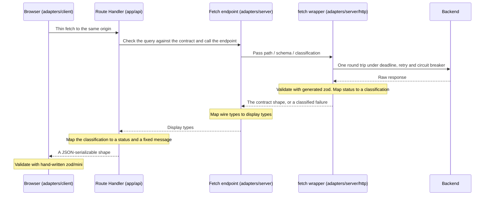
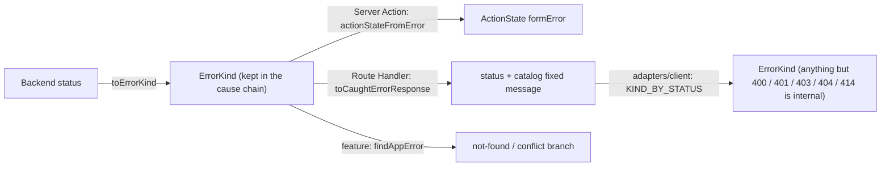

# Fetching and Contracts

Explains end to end which endpoints a value passes through on its way to the screen: from the browser to the BFF (the same-origin `/api/*`), and from the BFF to the backend. **What this document carries is the description of the path**; what was chosen belongs to the ADRs — the fetch wrapper's responsibilities to [ADR 0071](../adr/0071-bff-api-integration.md), the handling of generated artifacts to [ADR 0072](../adr/0072-api-type-generation.md), and the classification and cache boundary to [ADR 0112](../adr/0112-data-classification-cache-boundary.md). The vocabulary of rendering and caching (memoization / Data Cache / `use cache`) belongs to [rendering.md](rendering.md); here only the shape seen from the fetch endpoint is covered.

When in doubt, the ADR wins. This document is an explanation, not a rule.

## The Path at a Glance

A value passes through three stages, and **only the first stage validates against the contract**. The stages after it carry the shape the first stage settled.


```mermaid
sequenceDiagram
  participant B as Browser (adapters/client)
  participant R as Route Handler (app/api)
  participant S as Fetch endpoint (adapters/server)
  participant W as fetch wrapper (adapters/server/http)
  participant A as Backend
  B->>R: Thin fetch to the same origin
  R->>S: Check the query against the contract and call the endpoint
  S->>W: Pass path / schema / classification
  W->>A: One round trip under deadline, retry and circuit breaker
  A-->>W: Raw response
  Note over W: Validate with generated zod. Map status to a classification
  W-->>S: The contract shape, or a classified failure
  Note over S: Map wire types to display types
  S-->>R: Display types
  Note over R: Map the classification to a status and a fixed message
  R-->>B: A JSON-serializable shape
  Note over B: Validate with hand-written zod/mini
```

| Stage | Location | Owns | Does not own |
| --- | --- | --- | --- |
| Round trip with the backend | [`adapters/server/http/request.ts`](../../src/adapters/server/http/request.ts) | Deadlines, retries, circuit breaking, response validation, status classification | Business decisions, logging |
| Fetch endpoint | `adapters/server/api/*.ts` | Converting the contract shape into display types, checking queries, `cache()` / `use cache` | Raw `fetch` |
| BFF | `app/api/**/route.ts` | Mapping the classification onto HTTP, receiving the query | Fetching, validation, conversion |
| Browser-originated fetch | [`adapters/client/http/request.ts`](../../src/adapters/client/http/request.ts) | Same-origin `fetch`, validating the shape the BFF built, status classification | Deadlines, retries, circuit breaking, credentials |

**Server Components and Server Actions do not go through the BFF.** Both run on the server, so they call the fetch endpoint directly. The BFF is needed only when a part running in the browser comes to fetch the continuation (see *Fetching the next page of a list* below).

## What the `adapters` server / client split separates

What is split is not where the code runs but **what it may hold**. `architecture.ts` owns the boundary declaration, and `server/` declares itself with `import "server-only"`.

| | `adapters/server` | `adapters/client` |
| --- | --- | --- |
| Destination | The backend (`APP_API_BASE_URL`) | Only the same-origin BFF |
| Credentials | The request boundary attaches a Bearer resolved from the cookie | None. The browser attaches the cookie automatically |
| Configuration | Server config (destination, limits) | Only `NEXT_PUBLIC_` literals |
| Response validation | zod generated from the contract (`gen/<contract>/endpoints.zod.ts`) | Hand-written `zod/mini`, checking the shape the BFF built |
| Generated artifacts | Wire types and zod schemas | **Only the constants in `gen/<contract>/limits.ts`** |
| Resilience | Deadlines, retries, circuit breaking, retry budget | None. Only cancellation (`AbortSignal`) |

The client-side request boundary has no resilience so that retries for one round trip do not run under two separate counts. When a browser-originated request fails, the retrying has already happened inside the BFF.

**Rules that have no execution context go in `http/`.** [`http/url-budget.ts`](../../src/adapters/http/url-budget.ts) has that shape: the server and client request boundaries both call the same check. Placed in one element, it could not be imported from the other, and the rule would split in two.

**`gen/` and `http/` are reachable only from inside `adapters`.** This is because `architecture.ts` declares them as `adapters-gen` / `adapters-http`; that `features` may import `adapters` is a separate matter from generated types passing straight through to `features`.

## From Contract to Generated Artifacts, from Generated Artifacts to Display Types

The canonical contract lives in the backend repository; this repository only **fetches and pins** it.

```text
openapi/sources.yaml            Fetch coordinates. A human writes repo / path / ref; sha is written back on fetch
  └─ make api-fetch ──▶ openapi/<contract>.gen.yaml     Fetched artifact. do-not-edit
        └─ make api-gen ──▶ src/adapters/gen/<contract>/model/          wire types
                            src/adapters/gen/<contract>/endpoints.zod.ts  zod per operation
                            src/adapters/gen/<contract>/limits.ts        Only constants that carry no validation
                            mocks/<contract>/endpoints.msw.ts            Contract-driven mocks
```

**"It disappears on the next run" is not the only reason not to edit generated artifacts.** `make api-gen` empties the location before generating, so both hand-added files and the leftovers of schemas removed from the contract vanish on the next generation. If anything remains, `make api-gen-check` fails on it as a diff. No linter runs over them either (the overrides in `biome.json`), so there is no chance of noticing a rule violation.

### Where the Conversion Lives

Generated types do not leak into `features` because the fetch endpoint **receives the contract shape and returns a display type**. A conversion such as `toEntry(wire)` lives inside the endpoint, and only [`model`](../../src/model/README.md) types leave it.

```ts
// adapters/server/api/<resource>.ts
type WireEntry = z.infer<typeof GetEntriesResponse>["items"][number];

function toEntry(wire: WireEntry): Entry {
  return {
    id: toEntryId(wire.id),                          // brand は検証の出口で付ける
    publishedAt: wire.publishedAt === null ? null : new Date(wire.publishedAt),
    // ...
  };
}

export const getEntry = cache(async (id: EntryId): Promise<Entry> => {
  const wire = await getUserScopedClient().request({ path: `/v1/entries/${encodeURIComponent(id)}`, schema: GetEntryResponse });

  return toEntry(wire);
});
```

Three things happen inside the conversion.

- **Dates do not leave as strings.** The contract carries ISO strings, but the inner layers receive `Date`. In the reverse direction (when sending) it goes back through `toISOString()`
- **Identifiers leave only after they are branded.** Passed into the inner layers as a plain `string`, an identifier mixed up with another resource's still type-checks ([ADR 0029](../adr/0029-type-design-discipline.md))
- **Contract enums are checked against the generated schema with `satisfies`.** Pin values the screen names — such as the candidate sort orders — with `satisfies` against the type `z.infer`-ed from the generated type, and the day a value disappears from the contract it becomes a type error. A hand-copied list silently stays stale even after regeneration

**The endpoint also owns validation in the reverse direction.** Search conditions that came from the URL are checked against the generated `...QueryParams` schema before they are sent. URL values are always strings, so only the keys the contract declares as integers, booleans or arrays are converted to their types first; unreadable spellings drop into zod as strings and come back as "keys outside the contract". Rounding an out-of-range value to the default makes a list that was meant to be filtered come out unfiltered.

### The client may import only constants

Generated zod holds every operation in one file, so importing a single constant ships the whole of it to the browser. That is why the last step of generation splits out `limits.ts`, and the client imports only that. `scripts/client-schema-weight.gate.test.ts` fails any path where the client imports `endpoints.zod.ts`.

## What Happens in the Fetch Wrapper

The `request()` returned by [`createHttpClient`](../../src/adapters/server/http/request.ts) proceeds in the following order within one call. **The order carries meaning**, so read it from the top.

1. **The classification gate.** `assertSpecWithinScope` checks that no `cache` / `tags` is mixed into a user-scoped endpoint, and `assertNoCredentialHeader` checks that no per-call header carries `Authorization` / `Cookie`. This backs up what the types already forbid, and stops a spec assembled by bypassing the types
2. **Building the URL.** A relative path is joined while keeping the destination's path (`new URL(path, base)` discards the base's path). A path containing a `.` / `..` segment fails with `invalid-argument` — because wrapping it in `encodeURIComponent` does not remove it. An absolute URL is used as is
3. **The URL budget.** Checked **before** the circuit-breaker decision. Exceeding the budget is an input error, not a state of the destination, so masking it with the open circuit's `unavailable` makes a fixable error look like an outage
4. **The circuit breaker.** When open, `unavailable` immediately. No waiting
5. **Resolving credentials.** **Once, outside** the retries. Resolving per attempt would treat an inability to authenticate the same as a connection failure, and send a request that cannot succeed up to the attempt limit. They are not attached to a URL whose origin differs from the destination
6. **Repeating attempts.** Each attempt has a `perAttemptTimeoutMs` deadline, and the whole is cut off by `overallTimeoutMs`. A retry happens only when the method is idempotent (or `idempotent: true`), the result is 5xx / 429 / no response, retry budget remains, and the wait does not run past the overall deadline. The wait is `Retry-After` when present, otherwise a full-jitter backoff
7. **Success.** On `204` the body is not read; otherwise the JSON is checked against `schema`. A mismatch is `internal` — a broken contract is not fixed by resending
8. **Failure.** The status is mapped onto the classification, and the body's `details` is read only for `422`. Bodies of other statuses are not read

### What Varies per Destination

Deadlines, attempt counts and circuit-breaker thresholds are a [`ResilienceProfile`](../../src/adapters/server/http/resilience-profile.ts) passed as `createHttpClient`'s `profile`. When omitted, `DEFAULT_PROFILE` applies (3s per attempt / 10s overall / 3 attempts / budget 10% / failure rate 0.5 judged over 20 calls / open 5s / 3 half-open probes).

**The circuit breaker and the retry budget live on the client instance.** So creating several clients for the same destination splits the judgment of whether it has degraded by the number created. That is why a **connection point shared once per destination-and-classification pair** sits in [`adapters/server/http`](../../src/adapters/server/http/README.md) (`getPublicClient()` / `getUserScopedClient()`), and modules are not allowed to create their own. The places allowed to build one are `architecture.ts`'s `CONNECTION_PORTS`; importing `createHttpClient` anywhere else fails `project-rules/no-client-outside-connection-port`.

**As a consequence, all user-scoped endpoints share one circuit breaker.** When failures persist on one endpoint and the circuit opens, the other user-scoped endpoints also fail with `unavailable` without connecting. The sharing holds within one module graph; at each boundary where the framework builds separate graphs, the connection point is built separately too. The public connection point has its own circuit breaker.

### What the Wrapper Does Not Own

- **Injecting trace context.** The wrapper does not know `traceparent`. It is attached by the OTel Undici instrumentation that [`instrumentation.ts`](../../src/instrumentation.ts) sets up, and only to `fetch` calls going to the destination passed in `tracePropagationOrigins` (the origin of `APP_API_BASE_URL`). Requests to other origins do not carry it
- **Logging.** The wrapper records nothing. It only throws failures as classified errors, and the receiving side decides whether to record them. In the implementation, the ones that record are the "endpoints that fold to `null` when unreadable" (below) and some Route Handlers

## Error Normalization — Where a Raw Status Becomes a Classification

The classification is the [`errors`](../../src/errors/README.md) `ErrorKind`, which knows nothing of transport. `adapters/server/http` owns the mapping to statuses **in both directions**.

| Direction | Function | Location |
| --- | --- | --- |
| status → classification | `toErrorKind(status)` | [`retry-policy.ts`](../../src/adapters/server/http/retry-policy.ts) |
| classification → status | `toHttpStatus(kind)` | [`error-status.ts`](../../src/adapters/server/http/error-status.ts) |
| classification → response | `toErrorResponse(kind)` / `toCaughtErrorResponse(error)` | [`error-response.ts`](../../src/adapters/server/http/error-response.ts) |

**There are three boundaries that do not let values pass straight through.**


```mermaid
flowchart LR
  A["Backend status"] -->|toErrorKind| K["ErrorKind (kept in the cause chain)"]
  K -->|Server Action: actionStateFromError| S["ActionState formError"]
  K -->|Route Handler: toCaughtErrorResponse| H["status + catalog fixed message"]
  H -->|adapters/client: KIND_BY_STATUS| C["ErrorKind (anything but 400 / 401 / 403 / 404 / 414 is internal)"]
  K -->|feature: findAppError| N["not-found / conflict branch"]
```

1. **Backend → wrapper.** A status not in the table is coerced to `internal`. No value without a classification goes up
2. **Route Handler → browser.** `toCaughtErrorResponse` picks the classification out of the cause chain, falling back to `internal`. The only text it carries is the default message from the `errors` catalog; the backend's `message` never appears
3. **BFF → `adapters/client`.** Only the 400 / 401 / 403 / 404 / 414 listed in `KIND_BY_STATUS` are mapped, and the rest fold into `internal`. What the BFF returns is a response it built itself, so callers need no finer distinction. **401 / 403 / 404 are not folded** — folding them leaves the screen able to offer only a reload, which follows the same path when pressed. For a subscription that keeps reconnecting, folding them means it keeps reconnecting to a peer that will not recover

**The only thing read from the body is `details`.** And only for a `422` where the contract declares `ErrorResponseWithDetails`. The field names that could be read go onto the cause through `withErrorDetails`, and mapping them to display names is the job of the feature / form that knows the fields. An unreadable body folds into "no details", without replacing the original failure.

**The classification turns into display outside `adapters`.** A Server Action maps it to `formError` through [`actionStateFromError`](../../src/model/action-state.ts), a Server Component maps `findAppError(error)?.kind === ErrorKind.NOT_FOUND` to `notFound()`, and the incremental-fetch hook maps `UNAUTHENTICATED` to `router.refresh()`.

**Auxiliary values are folded on the endpoint side.** For an extra the screen can stand without (such as a supplement fetched from an endpoint other than the main content's), `adapters` provides an endpoint that returns "`null` if unreadable", and keeps the throwing endpoint as well. Making each screen write its own try / catch multiplies the same decision by the number of screens. Folding is allowed only when it can be said that every screen treats the value the same way.

## Fetching the next page of a list

The first page is fetched by a Server Component calling the fetch endpoint directly. The part running in the browser comes to fetch **only from the second page on**, and on that path the outbound and return legs go through different endpoints.

```text
features/<list>/use-infinite-<resource>.ts        Request more when the end marker becomes visible
  └─ adapters/client/api/<resource>.ts             Thin fetch to the same origin. Puts count and cursor in the URL
       └─ app/api/<resource>/route.ts              toRawQuery → parse<Resource>Query → 400 / fetch → toCaughtErrorResponse
            └─ adapters/server/api/<resource>.ts   Same endpoint as the first page. Returns a JSON-serializable shape
```

All the Route Handler owns is mapping the classification onto HTTP; fetching, validation and conversion to display types are already done by the fetch endpoint. **The Route Handler's `try / catch` is not swallowing errors** — left to throw, the response body becomes the framework's default and the internal details leak out as they are.

**The shape the BFF returns is not the contract shape.** It is the shape the fetch endpoint narrowed for display (a `CursorPage<T>` containing neither `Date` nor optional values), so client-side validation uses hand-written `zod/mini` rather than generated artifacts. If the first page and later pages differ in shape, the display breaks partway through the accumulated list.

The type of one page belongs to [`model/pagination.ts`](../../src/model/pagination.ts). `CursorPage<T>` holds no total count (a cursor only points to the next position), and `OffsetPage<T>` is kept separately. `appendCursorPage` does not remove duplicates — duplicates appear when the source breaks the cursor promise, and absorbing them in the presentation layer would hide the contract violation.

Three things to get right on the hook side.

- **Cancellation is not a failure.** An `abort` because the conditions changed or the user left the screen has no one left to tell
- **`UNAUTHENTICATED` is not folded into "the continuation failed".** `router.refresh()` asks the server to re-render, and where the user is sent is left to the route's definitive authorization
- **The hook does not own the decision to discard what has accumulated.** Whether it has become a different list is expressed by the placing side with `key`. The server builds new values every time, so watching for referential identity would always be true

## Relationship to `use cache` / Memoization

The meaning of the terms and the differences in lifetime belong to [rendering.md § Caches (similar names, different lifetimes)](rendering.md#caches-similar-names-different-lifetimes). Here only **what differs from the fetch endpoint's point of view** is given.

| Mechanism | How the endpoint is written | Lifetime | Classification |
| --- | --- | --- | --- |
| React `cache()` | Wraps every fetch endpoint | During the rendering of one request | Any |
| `use cache` + `cacheLife` + `cacheTag` | Declared at the top of the function | Across requests (certainly for what is baked into the static shell) | **public only** |

**An endpoint that declares `use cache` can import only `getPublicClient()`.** A module that can import `createHttpClient` directly is in a position to build a user-scoped client too, and `project-rules/no-user-scoped-in-cached-module` fails it. `getPublicClient` can build only the public client, so there is no way to get the classification wrong under the cache.

**Lifetime by profile name, tag by constant.** The endpoint declares `cacheLife("<profile>")` and `cacheTag(<constant>)`, and the number of seconds belongs to `cacheLife` in `next.config.ts`. The endpoint `export`s the tag constant, and the invalidating side imports it.

<!-- sample:begin -->
In the bundled sample, the ones declaring a cache are the endpoints for values the backend owns and this surface never updates, plus `sitemap.ts`; **no endpoint uses `use cache: private`**.
<!-- sample:end -->

**Do not put `cache` / `tags` on the inner `fetch`.** Inner fetches all follow the outer lifetime, so holding it twice means the same stale response is grabbed even when the outer one refetches.

**Route Handlers are outside the component tree.** `cache()` memoization only works inside rendering, so fetches through the BFF cannot assume the same ([rendering.md](rendering.md)).

## Data classification attaches to the fetch endpoint

The classification attaches not to a value but to the **endpoint**. `createHttpClient` always receives a `scope`, and the arguments it accepts change by classification at the type level ([ADR 0112](../adr/0112-data-classification-cache-boundary.md)).

| `scope` | What the client may hold | What a request may hold | What the type does not have |
| --- | --- | --- | --- |
| `"public"` | — | `cache` / `tags` | `getBearerToken` / `bearerToken` / `allowAnonymous` |
| `"user-scoped"` | `getBearerToken` (or `bearerToken`) | `allowAnonymous` | `cache` / `tags` |

Four points to get right in the implementation.

- **An endpoint that may carry credentials is user-scoped.** Setting `allowAnonymous: true` does not move the classification. The classification is a property of the endpoint, not a per-request result. `allowAnonymous` is set on the request, and only for operations whose contract includes `{}` in `security`. An operation with `security: []` imports the public connection point
- **Bearer is not the only thing that identifies a subject.** An endpoint that carries a contract-specific identifier header (such as an `X-...` naming an unauthenticated subject) is user-scoped as well. The test is not "is it authenticated" but "does the response vary by subject". `assertNoCredentialHeader` rejects only the two headers `Authorization` / `Cookie`, and custom headers pass — which is why the classification side covers them
- **Only the user-scoped connection point passes a fetch endpoint to `getBearerToken`, and it passes an imported one.** That is `getAccessToken` in [`session.ts`](../../src/adapters/server/auth/session.ts), which reads `cookies()` on every request. Capturing a resolved value silently removes the cached-scope defense (`next-request-in-use-cache`). `project-rules/no-captured-bearer-token` lets only this shape through
- **`bearerToken` (an already-resolved value) is for the single session-establishment round trip only.** That is the endpoint that looks up roles before the cookie exists, and it may be passed only as an argument of the enclosing function. Bringing this spelling into a module-level client keeps the first subject's credentials resident for the life of the process

**There is a separate endpoint for registering what must not be passed to the client.** It is `taintObjectReference` / `taintUniqueValue` in [`server/taint/taint.ts`](../../src/adapters/server/taint/taint.ts), and what it registers is only the session record (the object holding the Access Token) and the signing key. [`adapters/README.md`](../../src/adapters/README.md) shows, as a reference implementation, the shape of tainting a fetch result containing PII at the fetch endpoint, but **no bundled endpoint calls it**.

The full set of stages (types / lint / framework / the gate at fetch time / taint / response headers) belongs to the table in [0112](../adr/0112-data-classification-cache-boundary.md), which decided to lay the checkpoints out as stages rather than gather them at one point; it is not repeated here.

## Subscriptions are not on this path

The wrapper handles only **single round trips**. Deadlines, retries and circuit breaking are all built on the premise of "waiting for one response", and do not apply to long-lived connections. The home of server → client push (SSE / WebSocket) is settled as `adapters/client` ([ADR 0074](../adr/0074-runtime-communication-seam.md)), and **the subscription adapter has its implementation in `src/adapters/client/stream/`**. The contract (ticket handling, event granularity, arrival order, where mocks draw the line) is owned by ADR 0074 as its subject, and where the implementation lives and its pitfalls belong to [subscription and delivery](realtime-delivery.md).

## Common Pitfalls

### Forgetting or misplacing `allowAnonymous` fails neither types nor lint

**Forgetting it**: when it is not set on a read whose contract makes authentication optional, a logged-out request fails with `unauthenticated` before it is sent. It stays invisible while you test logged in, and shows up the day someone opens it logged out, as "only that screen always jumps to login".

**Misplacing it**: set on an operation that requires authentication, it sends anonymously even when credentials could not be obtained, and nothing notices until the backend's 401. It is not a leak, but it delays by one round trip a failure that could have been stopped earlier.

**How to check**: look at that operation's `security` in the contract. If it includes `{}`, set it; if `[]`, import the public connection point.

### Absolute URLs do not carry credentials

Passing `https://...` as `path` treats it as an origin other than the destination, and no `Authorization` is attached. This is by design, so credentials are not handed to URLs that came from outside, such as endpoints returned by Discovery; it closes, by origin comparison rather than by types, a path that the "write relative paths" convention alone would not stop. The same destination written as an absolute URL does get them when the origin matches.

### `..` does not disappear under `encodeURIComponent`

The convention of wrapping variable segments in `encodeURIComponent` is right, but `.` and `..` consist only of unreserved characters, so they survive encoding and URL normalization collapses them one level up. Before building, the wrapper checks with `/\/\.{1,2}(?:\/|$)/` and fails with `invalid-argument`. It is not a destination fault, so it is not retried either.

### POST / PATCH are not retried by default

`isRetryableMethod` lets through only GET / HEAD / PUT / DELETE / OPTIONS and calls that declare `idempotent: true`. Declaring it is allowed only when an `Idempotency-Key` is attached; put on a create without a natural key or on a relative increment, it succeeds twice for every attempt whose response never came back. **If two records appear without a resend, suspect the caller's resend, not the wrapper.**

### A response that differs from the contract becomes `internal`, indistinguishable from a 500

A response that fails `schema.safeParse` is classified `internal` and not retried. From the screen it looks the same as a 500. The cause survives only in the zod error in the cause chain. This is how it shows up **when the contract was re-imported but not regenerated**, so suspect `make api-gen-check` first.

### Only a 422 body is read

`readErrorDetails` reads the body only when `response.status === 422`. Whatever is in a 400 or 409 body never reaches the screen, and `message` is not read for any status. "The text the backend returned does not appear" is by design.

### Importing a user-scoped endpoint from a `use cache` endpoint fails lint

`project-rules/no-user-scoped-in-cached-module` judges per module: it checks whether the imported module, and one step beyond what it imports, spell out the user-scoped classification. The classification is spelled in the connection point, so importing a fetch endpoint that calls `getUserScopedClient()` fails. A module where an endpoint and a pure conversion live together is stopped even when only the conversion is imported — fix the one that got stopped (give the conversion its own module). Public endpoints import `getPublicClient()`.

### The client-side zod is not a generated artifact

The schemas in `adapters/client/api/*.ts` are hand-written `zod/mini`. What they receive is not the backend response but the display shape the BFF built, so applying a generated schema does not pass because the shapes differ. Conversely, importing `gen/<contract>/endpoints.zod.ts` from the client ships the whole generated artifact and classic `zod` to the browser, and `scripts/client-schema-weight.gate.test.ts` fails it. Only `limits.ts` may be imported.

### While the circuit is open, no request goes out

While open, `request()` throws `unavailable` without calling `fetchImpl`. That is why there is no span in the trace and no request in the backend's logs; it is not a disconnection. The circuit breaker lives on the client instance, so creating several clients for the same destination can produce a state where only one of them is open.

### `traceparent` is not attached by the wrapper

What puts the W3C trace context on outbound `fetch` is the OTel Undici instrumentation, and it is attached only to requests going to the origin `instrumentation.ts` passed in `tracePropagationOrigins` (`APP_API_BASE_URL`). If the trace looks broken when calling another origin, that is the instrumentation's allowlist, not a wrapper defect. With `requireParentforSpans: true`, no span is created for the request at all in a context without a parent span (static generation, tests).

### Deadlines do not move with the wall clock

`now` defaults to `performance.now`, and deadlines and circuit breaking look only at differences on this monotonic clock. Replacing `Date.now` moves neither the deadline nor the circuit's release. The wall clock is read only to compute the difference when `Retry-After` arrives as an HTTP-date, and that is replaced through `wallClockNow`. To advance time in a test, inject `now` / `sleep`.

### The URL budget is the byte count after encoding

`assertRequestTargetWithinBudget` counts the path and query after percent-encoding, where one full-width character of 3 bytes swells to 9 characters. Passing the pre-encoding value misjudges the budget by a factor of three. The threshold is `NEXT_PUBLIC_HTTP_MAX_URL_BYTES`, and since it is `NEXT_PUBLIC_`, changing it requires a rebuild. Exceeding it is `uri-too-long`, kept separate from `payload-too-large` — what the user should reduce is different.

### `Object.fromEntries(searchParams)` collapses repeated keys into one

Multi-select conditions arrive as the same key repeated. Applying `Object.fromEntries` straight to `URLSearchParams` keeps only the last one, and conditions silently disappear. Route Handlers fold them with [`toRawQuery`](../../src/adapters/server/http/search-params.ts) before passing them to the fetch endpoint. The same function is shaped so a key cannot write `__proto__` (it builds an array and then calls `Object.fromEntries`), because the user decides the keys.

### Without an explicit page size, the contract's default applies

If incremental fetching drops `first`, the contract's default page size takes effect. When the first page was fetched with the screen's page size, only the later pages grow by a different amount. The hook makes the page size explicit before putting it on the URL.

### `undefined` in a partial update arrives as "leave it alone"

`JSON.stringify` drops keys whose value is `undefined`, so `{ name: undefined }` and `{}` are identical on the wire. "Clear it" is an explicit `null`. `PatchPayload<T>` in [`patch-payload.ts`](../../src/adapters/server/http/patch-payload.ts) forbids `undefined` values at the type level, and `normalizePatchPayload` drops the keys just before serialization.

## Verify it yourself

```bash
# 契約と生成物の版が揃っているか（取り込んだのに生成していない状態を検出する）
make api-gen-check

# BFF が返す失敗の形（本文は分類の定型文だけで、バックエンドの message は出ない）
curl -s -i 'http://localhost:3000/api/<resource>?first=abc' | head -20
```

In the dev server's log, the absence of requests while the circuit is open and retries lining up one per attempt both show that the cause behind "the fetch appears to fail" is something different. Look at the response first, then judge at which stage of the wrapper it stopped.

## Related ADRs

- [0024](../adr/0024-adapters-server-client-split.md) — the `adapters` server / client split, and the client side's boundary for external connections
- [0029](../adr/0029-type-design-discipline.md) — the discipline of parsing once at the boundary, branded ids, `satisfies`, normalizing partial updates
- [0070](../adr/0070-backend-role-separation.md) — the canonical contract lives in the backend; the frontend is the last line of defense in response validation
- [0071](../adr/0071-bff-api-integration.md) — fetch wrapper resilience, the boundary of error normalization, the layer that owns caching
- [0072](../adr/0072-api-type-generation.md) — importing the contract, the location of generated artifacts and do-not-edit, the drift gate, `limits.ts`
- [0073](../adr/0073-pagination-fetch-boundary.md) — cursor by default, the owner of incremental fetching, not folding 401 into a continuation failure
- [0074](../adr/0074-runtime-communication-seam.md) — the subscription seam outside the round-trip model (not bundled)
- [0080](../adr/0080-error-handling.md) — the classification-to-status mapping, what is read from the body, degrading auxiliary values
- [0112](../adr/0112-data-classification-cache-boundary.md) — giving the classification to the endpoint, checkpoints as stages, the credential-resolution rules
