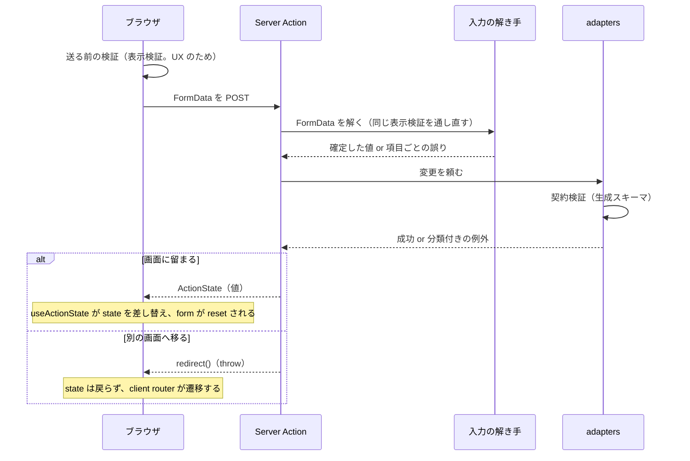

# 入力と送信の読み方

この文書は、入力欄に文字が入ってから Server Action が結果を返し、それが画面に現れるまでを**通しで**説明するものである。送信の機構は [ADR 0061](../adr/0061-form-mutation-ux.md)、検証の二層は [ADR 0062](../adr/0062-form-input-validation.md)、結果の見せ方は [ADR 0063](../adr/0063-mutation-result-notification.md)、入力状態のライブラリは [ADR 0060](../adr/0060-state-management.md)、ファイル添付の経路は [ADR 0075](../adr/0075-file-upload-seam.md) が持つ。日々強制される規則は [`docs/rules.md`](../rules.md#forms)「フォームと送信」にある。

ここが持つのは**それらを読むために要る前提**と、**実装のどこに何が居るか**である。規則の写しは作らない。判断に迷ったら ADR を優先する。

## 用語

| 語 | 意味 | よくある取り違え |
| --- | --- | --- |
| **Server Action** | `"use server"` を付けた非同期関数のうち、`<form action>` に渡されたもの。**公開 HTTP の口**であり、action id を知る者は画面を経由せずに呼べる | 「画面の裏の関数」ではない。描いた画面が保護されていても、action 自身は保護されない |
| **`FormData`** | `<form>` が集めた `name` と値の組。Server Action が受け取る唯一の入力 | React の state ではなく **DOM の現在値**から作られる。DOM に無い値は届かない |
| **`ActionState<T>`** | Server Action が画面へ返す結果の**判別可能 union**（`idle` / `success` / `error`） | 例外ではなく値である。`Error` も `Date` も往復しない |
| **表示検証** | `model` の手書きスキーマ。項目の必須・形式・長さを人向けの文言つきで判定する | wire contract ではない。契約より狭くてよい |
| **契約検証** | `adapters` 境界で生成スキーマが応答・要求の形を確かめること | 画面には届かない。届くのは分類だけ |
| **冪等キー** | 同じ画面からの再送を初回の再生として畳むための鍵 | 秘密ではない。送信の単位を決めている画面が作る |

## 1 回の送信で起きること

順序で押さえるべき点は 3 つある。

1. **検証は 3 回起きる。** 送る前（ブラウザ）、受け取った後（Server Action の中で同じスキーマをもう一度）、外へ出す境界（`adapters` の契約検証）。1 回目は体験のため、2 回目が正、3 回目は契約の砦であり、役割が違うので省けない
2. **Server Action は戻り値で失敗を返す。** 例外を投げて終わるのは `redirect()` だけで、それは成立の合図である
3. **action が終わると `<form>` は reset される。** 成功でも失敗でも起きる（後述）

## 3 つの hook と、それぞれが見ている木

| hook | 返すもの | 動く場所 |
| --- | --- | --- |
| `useActionState(action, initial)` | `[state, formAction, isPending]` | `<form action={formAction}>` を描く component |
| `useFormStatus()` | `{ pending, data, ... }` | **親の `<form>` の中**。form を描く component 自身では読めない |
| `useOptimistic` | 楽観的な仮の値 | 使っていない。使うならロールバックを持てる場合に限る（[`docs/rules.md`](../rules.md#forms)） |

`useFormStatus` は「自分を包む最も近い `form`」の送信状態を読む。したがって送信中の姿を出すボタンは、`form` を描く component から**子へ切り出す**。同梱サンプルではどの feature も `ui/submit-button/` にその子を持ち、`Button` の `pending` へ渡すだけにしている。

送信中の見せ方は [`components/design-system/action/button`](../../src/components/design-system/action/button/button.tsx) の `pending` が持つ。`disabled` にし、`aria-busy` を立て、文言を**場所を取ったまま**見えなくして `aria-label={pendingLabel}` で名前を差し替える。文言を差し替えないのは幅が動くからで、名前を差し替えるのは、見えなくした文言から組まれていた名前が消えるからである。

**`isPending` と `useFormStatus().pending` は別の値である。** 前者は `useActionState` が持つ 1 つの送信の状態、後者は form ごとの状態。同じ送信部を画面の 2 か所へ描く（帯の幅で出し分けるが DOM には両方居る）と、`useFormStatus` では表に出ている側が「何も送っていない」姿になる。その画面は `isPending` を Context で配り、`useFormStatus` を使わない。

## 入力の値を誰が持つか

`<form action>` は **action が終わると `form.reset()` を呼ぶ**。React は action を始めた時点で reset を予約し、transition が終わる commit で実行する。戻り値が `error` でも起きる。非制御の入力欄（`value` を React が持たない欄）は、弾かれた送信のあとに書いた内容を失う。

この性質から、入力の形は 3 つに分かれる。

| 形 | 値の持ち主 | 向くもの |
| --- | --- | --- |
| **ボタンと hidden だけ** | 持たない。押した先の値を `<button name value>` や `<input type="hidden">` が運ぶ | 1 操作 1 送信。増減・削除・状態を 1 つ進める |
| **react-hook-form** | rhf の内部状態と DOM。`register` は非制御 | 複数項目 + 検証 + 誤りの表示 |
| **`useState` で全項目を文字列で持つ** | 画面。入力欄は `value` を受ける制御欄 | 判定が zod ではなく関数で書かれ、送信のたびに欄を作り直したくないとき |

**rhf は送信機構を置き換えない。** `handleSubmit` を呼ばず、`register` で欄を配線し、`FormData` はそのまま `<form action>` へ流す。rhf が持つのは入力中の検証だけである。JavaScript が動かない環境でも form は送られ、Server Action 側の同じスキーマが検証する。

rhf を使うときの配線は次のとおり。

- **`useForm` の `resolver` は `standardSchemaResolver`。** 表示検証スキーマは `zod/mini` で書く（[ADR 0029](../adr/0029-type-design-discipline.md)）ため、`zod` の型を要求する `zodResolver` では繋がらない。`zod/mini` は Standard Schema を実装しているので標準側の口で繋ぐ
- **`defaultValues` は全項目に与える。** `undefined` の項目は非制御のまま扱われ、初回の送信で項目そのものが欠ける。まだ値が無いなら空文字を置く
- **`mode: "onTouched"`。** 一度 focus が外れた項目を変更のたびに見直すための設定で、`reValidateMode` は submit の後にしか効かない

## 検証の二層と、その正

| 層 | 何を判定するか | 置き場 | 流儀 | 届く先 |
| --- | --- | --- | --- | --- |
| **表示検証** | 必須・長さ・形式。人向けの文言を持つ | `src/model/<領域>/*-schema.ts` | `zod/mini` | ブラウザ（resolver）と Server Action（解き手）の**両方** |
| **契約検証** | 要求と応答が契約の形か | `src/adapters/gen/api/endpoints.zod.ts`。実施点は [`adapters/server/http/request.ts`](../../src/adapters/server/http/request.ts) | `zod` | サーバのみ。画面には分類だけが返る |

**正は Server Action の側で通し直した表示検証である。** ブラウザ側の判定は即時に返すためのもので、送信者が差し替えられる。同じスキーマを両側で通すのは、判定と文言を 1 か所に置くためであり、ブラウザ側を信用するためではない。

**契約由来の上限をブラウザで使うときは、生成スキーマではなく定数を引く。** `src/adapters/gen/api/limits.ts` は生成物のうち zod を参照しない定数だけを写したもので、client はこちらだけを import する。スキーマ本体を引くと全エンドポイント分の生成物がブラウザへ配られる（[ADR 0072](../adr/0072-api-type-generation.md)）。

**接続先が項目を名指しして拒んだ結果は、表示検証と同じ形へ写す。** 契約が返す `details` は項目名だけで理由を含まないので、文言は「〈項目名〉は受け付けられませんでした」の形にしか書けない。この画面の入力欄に結び付かない名前は捨てる —— 鍵にすると、どこにも出ない文言を持った「項目の誤りがある」状態が生まれる。写す先は `ActionState` の `fieldErrors` で、画面は送る前に弾かれたのか接続先に弾かれたのかを知らずに同じように出せる。

**表示検証は zod でなくてもよい。** 判定を関数（`(value: string) => string | undefined`）で書き、送る側と受ける側が同じ関数を呼ぶ形でも、原則（判定と文言が 1 か所）は同じである。zod を使わないのは、値を全部文字列のまま持ち回る画面で、スキーマの型推論が要らないときに限る。

### いつ誤りを見せるか

検証の**実行**と、結果を**見せるかどうか**は別の関心である。後者だけを持つ hook（同梱サンプルでは `use-error-visibility.ts`）が、focus が当たっている項目では「focus した時点に出ていた文言」を上限にする。直れば消え、直っていなければ文言は変わらず、focus 中に**新しい**誤りは出ない。rhf の設定だけではこれを満たせない（[ADR 0062](../adr/0062-form-input-validation.md) 補足）。

必須の印はスキーマから導く。項目を列挙せず、スキーマへ空文字を通して落ちるかで判定すれば、規則を緩めたのに印が残る状態を作れない。

### 欄の a11y 属性は誰が組むか

| 部品 | 持つもの |
| --- | --- |
| [`patterns/form-field`](../../src/components/patterns/form-field/README.md) | 項目名・必須の印・補足・誤りの並び。`fieldControlAttributes()` が `aria-invalid` / `aria-describedby` / `aria-required` / `id` を組み、**children の引数として渡す**。呼び出し元は入力欄へ広げるだけ |
| [`design-system/form/field`](../../src/components/design-system/form/field/README.md) | `Field` 一式と、補足・誤りの `id` の綴り（`toErrorId` / `toDescriptionId`） |

`id` はどちらも生成しない。同じ form を 1 つの文書へ 2 度置いたときに重複するため、`useId()` を持てる呼び出し元が接頭辞を作る。

## 結果の見せ方

`ActionState<T, TField>`（[`src/model/action-state.ts`](../../src/model/action-state.ts)）は次の 3 つの姿を持つ。

| 姿 | 持つもの |
| --- | --- |
| `idle` | 何も持たない。`useActionState` の初期値 |
| `success` | `value: T` |
| `error` | `formError`（form 全体の文言。無ければ `null`）/ `fieldErrors`（項目ごと。複数文言を持てる）/ `kind`（[`ErrorKind`](../../src/errors/error-kind.ts) の分類） |

`actionStateFromError` は投げられたエラーを `error` へ写し、文言は `errors` カタログが分類ごとに持つものを使う。画面固有の言い方が要る分類（`CONFLICT` など）だけ、Server Action が自分の文言と `kind` を付けて返す。

**出し分けの合図は `kind` であって文言ではない。** 「衝突なら読み込み直す導線を添える」は `state.kind === ErrorKind.CONFLICT` で判定する。文言は自由に変えてよく、動的な要素を足しても導線は消えない。

手段の使い分けは [ADR 0063](../adr/0063-mutation-result-notification.md) が持つ。それぞれの実体は次にある。

| 手段 | 部品 | 補足 |
| --- | --- | --- |
| インライン（form 全体） | [`app-starter/form-feedback`](../../src/components/app-starter/form-feedback/README.md) | `Alert` を使う。`children` に次の行動（読み込み直す導線など）を差す |
| インライン（要約） | [`app-starter/form-validation-summary`](../../src/components/app-starter/form-validation-summary/README.md) | 項目数が多い form で、欄ごとの文言と**両方**出す。link 先は欄の `id` |
| インライン（欄ごと） | `FieldError` | `FormField` の `message` へ渡す |
| toast | [`shell/toaster`](../../src/components/shell/toaster/README.md) | `useToast().toast()` を `state.status === "success"` の effect で呼ぶ |
| redirect | Server Action の `redirect()` | 成功の状態が画面に現れることは無い。`ActionState<void>` になる |

**`redirect()` で終わる action は「戻らない」。** 成立時に throw するので、`success` を返す枝が存在しない。したがってその画面の `ActionState` は成功値を持たず、成功の表示も持たない。テストでは成立時の throw を正常系に置く（[`docs/testing-conventions.md`](../testing-conventions.md#何をどこに置くか)）。overlay の中から確定したときは `RedirectType.replace` にする —— overlay が積んだ履歴 1 件が戻り先に残るためである。

**画面に留まる action は再検証を自分で頼む。** `revalidatePath` の範囲は、変更が出る場所で決まる。外枠（header の件数・脇の領域）にも出るものは `revalidatePath("/", "layout")` にしないと、本文だけが新しく外枠が古いままになる。

**結果は次の送信まで残る。** 入力を直した時点・観点を移した時点で下げ、送り直せばまた出す。「下げた印」を戻す合図は結果の**同一性**で、`useActionState` は送信のたびに新しい object を返すので、前回の結果との `!==` で入れ替わりが判る。同梱サンプルでは `use-action-result-freshness.ts` がこれを持ち、題材を知らない形になっている。

**確認 dialog の中で送るなら、結果はどこに出すかを先に決める。** dialog の中の form が送り、失敗しても dialog は開いたままなので、失敗は dialog の中に出す（利用者が見ている場所）。成立すれば dialog は閉じ、そこに出したものごと消える。`AlertDialogAction` は押した時点で dialog を閉じる部品なので、実行ボタンには使わず、`AlertDialogCancel` と `type="submit"` のボタンを並べる。

## 送信中・二重送信・確認

**送信中は `Button` の `pending` が押せなくする。** 冪等キーがあるから二度押しても増えない、を理由に押せるまま残さない。

**冪等キーの作り方と運び方。** [`src/model/idempotency-key.ts`](../../src/model/idempotency-key.ts) の `newIdempotencyKey()` を**画面を組み立てる Server Component**が 1 回呼び、props で島へ渡し、島は `useState(initial)` で**最初に受け取った値を固定**して hidden input（`IDEMPOTENCY_KEY_FIELD`）に載せる。固定するのは、`router.refresh()` が器を unmount せず prop だけ差し替えるためで、固定しないと書きかけの入力は残ったまま鍵だけが新しくなり、届かなかった送信のやり直しが別の鍵で飛ぶ。Server Action は `z.uuid()` で解き、`adapters/server` が `Idempotency-Key` header に載せる。fetch wrapper（[`adapters/server/http/request.ts`](../../src/adapters/server/http/request.ts)）は `idempotent: true` を宣言した要求だけ再試行する。

鍵は全部の変更に要るわけではない。**設定（絶対値）を送る操作は自然に冪等**なので鍵を持たない。逆に自然キーを持たない作成は再試行もしない —— 同じ本文を二度送れば 2 件できる。

**確認を挟むかどうか**の基準は [`docs/rules.md`](../rules.md#forms) が持つ。挟むときの形は「`AlertDialog` の中に `form`」で、確認を経た合図（hidden の 1 項目）を送信に載せ、Server Action の側でも合図の有無で止める。画面が押す前に確かめても、確かめた後に前提が変わることがある。

**送信の失敗は 2 系統ある。** action が `error` を**返す**失敗と、呼び出しそのものが **reject する**失敗（切断・本文の上限超過・5xx）で、後者は戻り値では受け取れない。`<form action>` 経由なら reject は最も近い error 境界（`error.tsx`。[ADR 0080](../adr/0080-error-handling.md)）へ届く。action を **form を通さず直接呼ぶ**場合（選んだ時点で送るファイルなど）は呼び出し側が `try / catch` で受けないと、その送信は進行中でも失敗でもない状態に居残る。

**離脱の抑止**は 2 部品に分かれる。[`app-starter/unload-guard`](../../src/components/app-starter/unload-guard/README.md)（リロード・タブを閉じる・外部へ）と [`app-starter/navigation-guard`](../../src/components/app-starter/navigation-guard/README.md)（配下の `Link`）で、**ブラウザの戻る / 進むはどちらでも塞げない**。

## ファイル添付の口

受け口は **Server Action ひとつ**である（[ADR 0075](../adr/0075-file-upload-seam.md)）。
`/api/*` に本体を受ける中継口は無く、署名付き URL へブラウザが直接送る形も採っていない。

Server Action が `File` を受け取り、`adapters/server` の fetch wrapper が `multipart:` 指定で
backend の受け口へ送る。返るのは**保存キー**だけで、表示 URL への組み立ては `adapters/server` が
起動時設定の配信元と結合して行う。**画面の層は配信元を読めない。**

**配信は公開である。** 見せる相手を絞る必要があるものは、この経路へ載せられない。

Server Action 経路で押さえること。

- **本文の上限は全 Server Action に効く。** [`next.config.ts`](../../next.config.ts) の `serverActions.bodySizeLimit` は `NEXT_PUBLIC_HTTP_MAX_UPLOAD_BYTES` に封筒ぶんを足した値で、action ごとの上限は持てない
- **受け口でもう一度確かめる。** 空・形式（宣言された `type`）・大きさを Server Action が見る。署名ポリシーが担っていた層がこの経路には無く、`type` は送信者が付けられる値なので中身までは保証しない
- **選んだ時点で送り、本体の送信にはキーだけを載せる。** 画像を選ぶたびに upload action を直接呼び、返った object key を hidden input として form に並べる。大きな本文が本体の送信に混ざらず、1 枚の失敗が他の項目を巻き込まない。この経路には**進捗が無い**（送信の途中を観測する口が無い）
- fetch wrapper は multipart のとき `Content-Type` を組まない（境界文字列は runtime が付ける）し、**再試行しない**

部品は 3 つに分かれ、送信経路をどれも知らない。

| 部品 | 持つもの |
| --- | --- |
| [`app-starter/file-upload`](../../src/components/app-starter/file-upload/README.md) | 選ぶ受け口。`accept` / `maxSize` で送る前に弾き、`onSelect` / `onReject` で渡す。`progress` は呼び出し元が与えるが、Server Action 経路では与えるものが無い |
| [`app-starter/upload-preview`](../../src/components/app-starter/upload-preview/README.md) | 選んだ一覧と件ごとの操作。`File` を渡すと object URL の生成と破棄を引き受ける |
| [`app-starter/attachment`](../../src/components/app-starter/attachment/README.md) | 1 件の見た目。Server Component |

## このリポジトリでの在り処

カーネル側（サンプルを外しても残る）。

| 役割 | 場所 |
| --- | --- |
| 戻り値契約と helper | [`src/model/action-state.ts`](../../src/model/action-state.ts) |
| 冪等キー | [`src/model/idempotency-key.ts`](../../src/model/idempotency-key.ts) |
| 表示検証スキーマ | `src/model/<領域>/*-schema.ts`（`zod/mini`） |
| 契約検証の実施点 | [`src/adapters/server/http/request.ts`](../../src/adapters/server/http/request.ts) |
| 契約由来の定数 | `src/adapters/gen/api/limits.ts` |
| 部分更新の正規化 | [`src/adapters/server/http/patch-payload.ts`](../../src/adapters/server/http/patch-payload.ts) |
| エラー分類 | [`src/errors/error-kind.ts`](../../src/errors/error-kind.ts) |
| 欄の外枠 / 属性 | [`src/components/patterns/form-field/`](../../src/components/patterns/form-field/README.md) / [`src/components/design-system/form/field/`](../../src/components/design-system/form/field/README.md) |
| 送信結果の表示 | [`src/components/app-starter/form-feedback/`](../../src/components/app-starter/form-feedback/README.md) / [`form-validation-summary/`](../../src/components/app-starter/form-validation-summary/README.md) / [`src/components/shell/toaster/`](../../src/components/shell/toaster/README.md) |
| 確認 | [`src/components/design-system/overlay/alert-dialog/`](../../src/components/design-system/overlay/alert-dialog/) |
| 段に分けた入力 | [`src/components/patterns/wizard-form/`](../../src/components/patterns/wizard-form/README.md)。表示していない段も `hidden` で DOM に残す |
| Server Action の本文上限 | [`next.config.ts`](../../next.config.ts) `serverActions.bodySizeLimit` |
| カタログでの代役 | [`.storybook/lib/pending-action.ts`](../../.storybook/lib/pending-action.ts)（解決しない送信先）と `.storybook/preview.tsx` の `sb.mock` |

feature 側は、どの feature も同じ役割分担のファイルを持つ。**Server Action は編成だけを持ち、解くことと分類することを隣へ出す。**

| 役割 | ファイル |
| --- | --- |
| Server Action | `features/<name>/actions.ts`。**主体の断言が要るものは `app/**/actions.ts`**（`features` から `adapters/server/auth` へ届かないため。[ADR 0025](../adr/0025-app-layer-elements.md)）。その場合、画面は送信先を props で受け取る |
| 戻り値の型 | `form-state.ts`。`ActionState<T, TField>` を画面の項目名で閉じる |
| `FormData` の項目名 | `form-names.ts` / `form-fields.ts`。送る側と読む側が同じ綴りを引く |
| `FormData` を解く | `parse-*-form.ts`。表示検証を通し直し、`fieldErrors` か確定した値を返す |
| 接続先の拒否を項目へ写す | `*-rejection.ts` |
| 誤りをいつ見せるか | `use-error-visibility.ts` |
| 検証を回し欄の props を組む | `use-*-fields.ts`（rhf） |
| 結果の鮮度 | `use-action-result-freshness.ts` |
| 送信ボタン | `ui/submit-button/`（`form` の子） |
| カタログ用の差し替え | `__mocks__/actions.ts` |

<!-- sample:begin -->
同梱サンプルで実物を読むなら、次の 2 本が形の異なる典型である。

| feature | 形 |
| --- | --- |
| [`features/account`](../../src/features/account/README.md) | rhf + `zod/mini` の表示検証。toast で留まる更新と、`redirect` で移る登録。段に分けた入力と冪等キー |
| [`features/admin/products`](../../src/features/admin/products/) | `useState` で持つ制御欄と関数による判定。要約付きの誤り表示、`kind` による導線の出し分け、選んだ時点で送るファイル。Server Action は [`app/admin/products/actions.ts`](../../src/app/admin/products/actions.ts) |
<!-- sample:end -->

## 間違えやすいところ

### `useFormStatus` を form を描く component で読むと、常に `pending: false` になる

読めるのは親の `form` の状態だけで、自分が描く `form` は親ではない。送信中の姿を出す部品は子へ切り出す。同じ理由で、**1 つの送信を 2 つの `form` から出す**画面では `useFormStatus` が割れる —— 送信状態を持つのは `useActionState` の側なので、`isPending` を Context で配る。

**確かめ方**: 送信中のボタンが押せるままなら、この形になっている。

### action が終わると form は reset される。失敗でもされる

React は action を始めた時点で reset を予約し、transition の commit で `form.reset()` を呼ぶ。戻り値の `status` は見ない。非制御の欄は `defaultValue` 属性の値（無ければ空）へ戻る。

**rhf の `register` はこれを防がない。** `register` が配るのは `name` / `onChange` / `onBlur` / `ref` で、`value` は配らない（非制御）。値は mount 時に `ref.value` へ書かれるだけで、同じ要素への 2 回目以降の ref 呼び出しは早期 return し、書き直さない。したがって reset のあと、rhf の内部状態は入力済みのままなのに DOM は空、という食い違いが起きうる。弾かれた送信のあとも残す欄は `value` を React が持つ形にする（`useState` で持つ、または rhf なら `Controller` / `useController` で制御欄にする）。

**確かめ方**: 失敗を返す action を用意し、送信後に入力欄の中身が残っているかをブラウザで見る。jsdom のテストは `FormData` の中身と文言しか見ていないことが多い。

### `zodResolver` は `zod/mini` のスキーマを受け付けない

`zodResolver` は `zod` の型を要求し、`zod/mini` の object はそれを満たさない。型エラーで止まるので気付けるが、`zod` の入口へ書き換えて通すと、その画面の bundle に classic の `zod` が丸ごと入る。繋ぐ口は `standardSchemaResolver` である。

### `defaultValues` を省いた項目は、初回の送信から欠ける

rhf は `undefined` の項目を非制御のまま扱う。`FormData` には空文字ではなく**項目そのものが無い**状態で届き、解き手が `formData.get(name)` を `typeof === "string"` で読んでいれば空文字へ均されるが、`getAll` や存在判定で読む項目は挙動が変わる。値が無いなら空文字で埋める。

### `redirect()` の後ろに書いたコードは動かない

`redirect()` は throw する。`try / catch` の中で呼ぶと catch がそれを捕まえて失敗の状態を返し、遷移が起きないまま画面に「失敗」が出る。`redirect()` は try の**外**で呼ぶ。同梱サンプルの action はすべて、通信を try で包み、成立後の `revalidatePath` と `redirect()` を try の外に置いている。

Route Handler を指す `redirect()` は要求を出さない。理由は [`rendering.md`](rendering.md#server-action-の-redirect-は-route-handler-へ遷移しない) が持つ。

### 文言を合図に出し分けると、文言を直した瞬間に壊れる

「読み込み直す導線を添えるかどうか」を `formError` の一致で判定すると、文言へ件数や名前を差し込んだ時点で導線が黙って消える。`kind` で判定する。同じ理由で、専用の文言を持つ action は `kind` も一緒に返す —— `actionStateFromError` を通らない枝では `kind` を自分で付けないと、画面に分類が届かない。

### 冪等キーを render のたびに作ると、鍵の意味が無くなる

`newIdempotencyKey()` を Client Component の render で呼ぶと、再描画のたびに鍵が変わり、二重送信も再送も別の要求になる。作るのは画面を組み立てる Server Component の 1 か所で、島は `useState(initial)` で固定する。**hidden input に prop をそのまま渡す**のも同じ穴で、`router.refresh()` が prop だけを差し替える。

### 開閉で unmount される部分木に、鍵と送信の状態を置かない

dialog / sheet / drawer の中で `useActionState` を呼ぶと、閉じた時点で木ごと外れ、開き直すたびに `idle` から始まる。送信中に閉じれば結果を受け取る先も消える。鍵と状態は画面が 1 つだけ持ち、dialog の中の form は `formAction` を受け取るだけにする。

### `FormData` の項目名を文字列で 2 か所に書くと、型では止まらない

送る側の `name` と読む側の `formData.get()` の綴りが食い違っても、型は通り、実行して初めて「送ったのに空で届く」形で現れる。綴りは `form-names.ts` の 1 か所に置き、`satisfies Readonly<Record<Field, string>>` で項目の集合と突き合わせる。

### `required` を付けると、隠れた段でブラウザが送信を止める

段に分けた入力は表示していない段も DOM に残す（`hidden`）。`required` の欄が隠れた段に空のまま在ると、ブラウザは focus できない欄を理由に**何も言わずに**送信を止める。必須の**表示**は `Field` が持ち、**強制**は Server Action の検証が持つ。`FormField` は `aria-required` を組むが `required` は組まない。

### 選んだ時点で送るファイルは、form の `action` を通らない

upload action を hook から直接呼ぶ経路では、`useFormStatus` も `useActionState` も関与しない。reject を自分で受け、進行中・失敗・完了を自分の state で持つ。**送信ボタンは、送り終わっていない枚がある間は止める**（`blocked`）—— 止めないと、まだキーの無い枚を落とした本体が通る。

### `revalidatePath` の範囲が狭いと、外枠だけが古いまま残る

変更の結果が本文の外（header の件数・脇の領域）にも出るなら、その route だけ再検証しても外枠は描き直されない。どこに出るかを先に数え、外枠に出るなら `"layout"` で無効にする。

### `useActionState` の結果を effect で読むと、1 描画遅れる

送信の結果で観点を移す・要約へ focus を移す処理を `useEffect` に書くと、移す前の描画が一度挟まり、「どこも赤くないのに送信だけ通らない」画面が一瞬出る。結果の入れ替わりは描画の中で判る（前回との `!==`）ので、描画の本体で state を更新する。toast のように**描画の外で起こす**ものだけを effect に置く。

### カタログでは Server Action がそのままでは動かない

`"use server"` の action を Storybook で押すと `config` の読み込みで落ちる。`.storybook/preview.tsx` の `sb.mock(import("…/actions.ts"))` で隣の `__mocks__/actions.ts` へ差し替える（引数は拡張子まで綴る）。送信中の姿を撮るには解決しない送信先（`neverSettlingAction`）を使う。`redirect` で終わる action の代役は成功を返してその場に留まるので、実物と違うことを代役の doc に書く。

## 試験

Server Action は「値を返す対象」として `unit` で扱い、`redirect()` の throw を正常系に置く。form を含む component の試験で何を見るかは [`docs/testing-conventions.md`](../testing-conventions.md) が持つ。ここでは扱わない。

## 関連する ADR

- [0060](../adr/0060-state-management.md) — form state = react-hook-form + zod。どこまで rhf に任せ、送信はどこへ合流させるか
- [0061](../adr/0061-form-mutation-ux.md) — `<form action>` + `useActionState` + `useFormStatus` の正機構と `ActionState<T>` 契約
- [0062](../adr/0062-form-input-validation.md) — 表示検証と契約検証の二層、いつ誤りを見せるか
- [0063](../adr/0063-mutation-result-notification.md) — インライン / toast / redirect の使い分けと live region
- [0075](../adr/0075-file-upload-seam.md) — 受け口は Server Action ひとつ、配信は公開の配信元
- [0029](../adr/0029-type-design-discipline.md) — 判別可能 union、境界での parse、`zod/mini` の選び方
- [0025](../adr/0025-app-layer-elements.md) — 主体の断言が要る Server Action の置き場
- [0072](../adr/0072-api-type-generation.md) — 生成スキーマを client へ載せない理由と `limits.ts`
- [0080](../adr/0080-error-handling.md) — 分類とカタログ文言、error 境界
