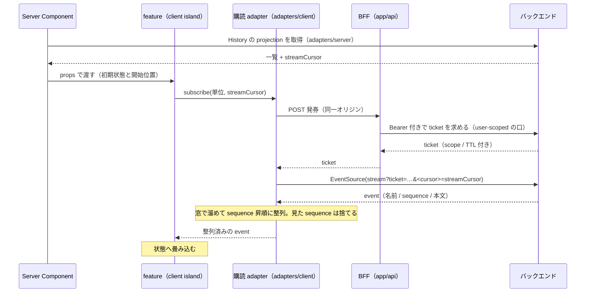
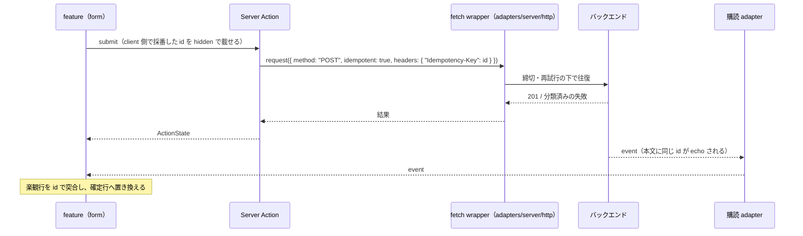
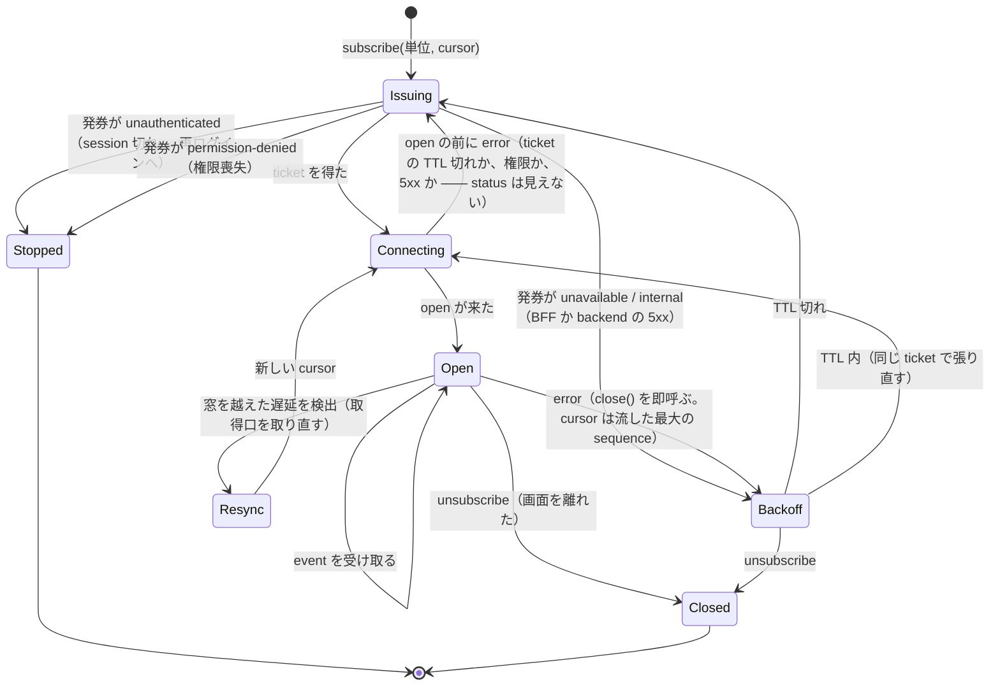

# 購読と配信

**購読 seam は実体を持つ。** 置き場は [`src/adapters/client/stream/`](../../src/adapters/client/stream/README.md) で、購読 1 本の状態機械と、それを組み立てる部品（封筒・順序・カーソル・待ち時間）から成る。この文書は他の設計リファレンスと同じく実装を読んで書いた。

決定そのもの —— transport は SSE、認証は BFF 発行の ticket、stream が運ぶのは event、client が前提するのは単調増加だけ、再接続は自前、mock で差し替えない —— は [ADR 0074](../adr/0074-runtime-communication-seam.md) が持つ。家が `adapters/client` である理由は [ADR 0024](../adr/0024-adapters-server-client-split.md)、往復側の取得と正規化は [data-fetching.md](data-fetching.md)、資格情報の持ち方は [auth.md](auth.md) が持つ。ここが持つのは、それらを読むために要る前提と、実体化するときに踏むものである。

判断に迷ったら ADR を優先する。この文書は説明であって規約ではない。

## 責務の線 —— 開いて読むが、保持しない

長寿命接続を**保持する側**はバックエンドで、この層は**開いて読む側**である。ソケットを持たない、イベントを永続化しない、誰に何を配るかを決めない。持つのは次の 3 つだけである。

| 持つもの | 持たないもの |
| --- | --- |
| BFF が backend から ticket を取り、ブラウザへ渡すこと | ticket の検証・失効・保管（backend） |
| ブラウザが backend の stream を開き、届いた event を整列して feature へ渡すこと | 接続の保持・replay・fan-out（backend） |
| event を画面の状態へ畳み込むこと（feature） | event の採番・順序の保証（backend） |

この非対称が可能にするのは、**backend の実装が変わっても画面が変わらない**ことである。この層が stream について知っているのは「URL を 1 つ開くと、名前と sequence を持つ event が届く」ことだけで、backend が event をどう作り、どう溜め、どう配っているかは知らない。

同じ非対称が不可能にするのは、**stream の中身を自分で補完すること**である。届かなかった event を推測して埋めない、順序を backend に問い合わせて直さない。整合を取り戻す手段は 1 つ —— 初期表示の取得口を取り直す —— しか持たない。

## 登場するもの（在り処）

| 役割 | 在り処 | いま在るか |
| --- | --- | --- |
| 初期表示の取得口（History の projection と、購読の開始位置） | `src/adapters/server/api/<資源>.ts` | 資源ごとに作る |
| 発券の取得口（backend へ Bearer 付きで ticket を求める user-scoped の口） | `src/adapters/server/api/<資源>-stream.ts` | 無い |
| 発券の BFF | `src/app/api/<資源>/stream-ticket/route.ts` | 無い |
| 購読 adapter（開く / 整列 / 重複排除 / 再接続 / 閉じる） | `src/adapters/client/stream/` | 無い |
| React への束ね（購読と snapshot の 2 口を `useSyncExternalStore` へ渡す） | 使う feature が 1 つならその feature。複数なら購読 adapter の隣 | 無い |
| event の畳み込み（どの event で何をどう変えるか） | `src/features/<feature>/` | 無い |
| 送信（Server Action → `adapters/server` の冪等な POST） | `src/app/**/actions.ts` → `src/adapters/server/api/<資源>.ts` | 資源ごとに作る |
| CSP の `connect-src` に stream の origin を足す口 | [`src/config/security-headers/security-headers.ts`](../../src/config/security-headers/security-headers.ts) | 在る。origin の入力が無い |
| status → 分類の対応（ブラウザ側） | [`src/adapters/client/http/request.ts`](../../src/adapters/client/http/request.ts) の `KIND_BY_STATUS` | 在る。403 の行が無い |

React への束ねの置き場は依存表から導ける。`capabilities` と `components` は `adapters` を import できず（`architecture.ts` の `DEPENDENCIES`）、stream の生死は通信機構の状態として `adapters/client` に属する（[ADR 0022](../adr/0022-capabilities-kernel.md)）。したがって hook は feature か `adapters/client` のどちらかにしか置けず、`use-media-query` と同じ `useSyncExternalStore` の形で束ねる。

## 一連の流れ

初期表示は往復で組み、購読はその続きから始める。送信は購読の外で行い、その結果が event として戻ってくる。



**開始位置は取得の応答から来る。** projection を返す口が、その時点の stream の位置を一緒に返す。購読側がこれを引数に取るので、初期表示と購読の間に隙間は無い —— 隙間の event は「cursor より後」として stream から届く。

**発券は同一オリジンの BFF を叩く。** ブラウザは Access Token を持たないので（[auth.md](auth.md)）、backend の認可を通せるのは BFF だけである。発券の Route Handler は宣言した保護経路の下に無ければ前捌きの対象にならず、backend の 401 を `unauthenticated` へ写してそのまま 401 で返す —— 認証の要る取得の Route Handler と同じ形である。

**送信は購読と別の経路を通る。**



`idempotent: true` を立ててよいのは `Idempotency-Key` を付けたときだけである（[data-fetching.md](data-fetching.md)「POST / PATCH は既定で再試行されない」）。client 側の id をそのまま鍵にすれば、楽観追加の突合と再送の重複排除が同じ 1 つの値で済む。

## 順序の扱い

client が前提してよいのは「単位ごとに sequence が単調増加する」ことだけで、歯抜けも到達順の乱れも正常である（[ADR 0074](../adr/0074-runtime-communication-seam.md) 決定 6）。この前提から、整列の組み立ては次の形になる。

| 段 | 何をするか | 持つ状態 |
| --- | --- | --- |
| 受信 | event を窓へ入れる | 窓（短い時間。数百 ms の桁） |
| 整列 | 窓が閉じたら sequence 昇順に並べ、上へ流す | 上へ流した最大の sequence（= 次の cursor） |
| 重複排除 | 流した最大の sequence 以下は捨てる | 同上 |
| 遅延 | 窓を越えて遅れたもの（流した最大より小さい sequence）は捨て、取得口を取り直す | 取り直し中かどうか |

**「穴が埋まるまで待つ」は成立しない。** 歯抜けが正常なので、待ち続ける条件が無い。窓は「同時に届いたものの順序を直す」ためにあり、「欠けたものを待つ」ためにあるのではない。

**遅れて届いたものを描画済みの位置へ挿入しない。** 上へ流した最大の sequence より小さいものが窓の外から届いたら、それは重複か、窓を越えて遅れたかのどちらかで、adapter には区別が付かない。どちらでも同じ扱い —— 捨てて、初期表示の取得口を取り直す —— にしておけば、区別が要らない。取り直した応答の cursor から購読を張り直す。

**cursor は adapter が持ち、feature へ見せない。** 次に張り直すときの開始位置は「上へ流した最大の sequence」で、これは transport の状態である。feature が持つと、feature の数だけ再開位置の正が増える。

**stream の cursor と一覧の cursor は別物である。** 一覧の cursor（[ADR 0073](../adr/0073-pagination-fetch-boundary.md)）は「次のページの位置」を指す不透明な値で、URL が覚える。stream の cursor は sequence そのもので、adapter が覚える。同じ語を使うと取り違えるので、props と型には `streamCursor` のように区別できる名前を付ける。

## 再接続の組み立て

`EventSource` の組み込み再接続は使わず、adapter が自前で張り直す（[ADR 0074](../adr/0074-runtime-communication-seam.md) 決定 8）。状態は adapter が 1 つの機械として持つ。



**`error` が来たら即 `close()` する。** 組み込み再接続は `error` を発火してから `retry:` の間隔で張り直すので、その前に閉じないと、自前の backoff と組み込みの再接続が同じ URL へ二重に走る。閉じた `EventSource` は再利用できないので、張り直しは新しいインスタンスになる —— だから `Last-Event-ID` は載らず、cursor を query で毎回渡す。

**backoff は 5xx と網の断だけに掛ける。** jitter を付け、上限を持つ。画面が見えていない間（`document.hidden`）は張り直しを止め、見えたときに再開する —— 見えていない画面のために backend の接続数を消費しない。

**打ち切りの分類は往復の側から来る。** `EventSource` の `error` は status を持たないので、stream 側だけを見ても「権限が無い」と「backend が落ちている」を区別できない。区別できるのは発券の往復だけである —— `open` の前に `error` が来たら発券へ戻り、そこで返る分類（`unauthenticated` / `permission-denied` / それ以外）で打ち切るか backoff するかを決める。`open` の後に落ちたものは transport の都合として backoff する。

**feature が受け取るのは分類だけである。** `unauthenticated` なら再ログインへ導く（増分取得の hook が `UNAUTHENTICATED` で `router.refresh()` へ写すのと同じ形）、`permission-denied` なら購読を止めた姿を出す、backoff 中なら「切れている」姿を出す。close code も `readyState` も feature には見せない。

## どの層が何を持つか

| 層 | 持つもの | 持たないもの |
| --- | --- | --- |
| `adapters/server` | 発券の口（user-scoped）、projection の口（cursor を返す）、送信の口（`idempotent: true`） | stream を開くこと（server は購読しない） |
| `app/api` | 発券の BFF。分類を status へ写すだけ | ticket の検証・保管 |
| `adapters/client` | 開く / 閉じる、整列、重複排除、cursor、再接続、backoff、TTL 内の ticket の再利用、分類への正規化、event の schema 検証 | event の意味、画面の状態 |
| `features` | event の畳み込み、楽観行の突合、切れているときの姿 | sequence、再接続、ticket |
| `config` | CSP の `connect-src` に stream の origin を載せること | — |

**分類への正規化は adapter の内側で 1 度だけ行う。** 往復側と同じで（[data-fetching.md](data-fetching.md)「エラーの正規化」）、ブラウザが投げた例外も `EventSource` の `error` も `errors` の分類へ写してから feature に渡す。

**adapter は event の形を検証してから流す。** 名前で判別する discriminated union の zod schema を持ち、契約に無い名前・形の合わない本文は落として記録する。往復側の「応答を検証せずに UI へ流さない」と同じ原則である。契約から生成した schema をそのまま当てられるかは、契約が event を component として宣言しているかで決まる（後述「バックエンド側に決めてもらうもの」）。

## 間違えやすいところ

### `EventSource` は status を見せない

`onerror` に届くのは `Event` で、応答の status も本文も無い。403 も 500 も網の断も同じ `error` である。判定の材料は「`open` が来たことがあるか」と「発券の往復が返した分類」だけで、上の状態機械はそれで組んである。status を読む必要が出たなら、それは `EventSource` を使わず `fetch` で SSE を読む判断であり、[ADR 0074](../adr/0074-runtime-communication-seam.md) の既定を外れる。

### `KIND_BY_STATUS` に 403 が無い

ブラウザ側の要求境界は 400 / 401 / 414 だけを分類へ写し、残りを `internal` に畳む。発券の BFF が backend の `permission-denied` を 403 で返しても、`adapters/client/http/request.ts` はそれを `internal` にするので、権限喪失が backoff の対象になる。発券口を足すときに 403 → `PERMISSION_DENIED` の行を足す —— 「401 を畳まない」と同じ理由で、畳むと打ち切れない。

### `connect-src` が `'self'` だけ

CSP の `connect-src` は同一オリジンと計測の送り先しか許していない。ブラウザが backend の stream を直接開く以上、その origin を `connect-src` に載せなければ接続はブロックされ、コンソール以外に何も出ない。`SecurityHeaderInputs` は `mediaOrigin` / `authIssuer` の形で origin を受けているので、stream の origin も同じ形で足す。開発時は backend の origin が `localhost` の別ポートになるので、そこも同じ経路で通す。

### ticket は URL に載る

redaction は**名前で伏せ、値の形は見ない**（[observability.md](observability.md)）。`REDACTED_FIELD_NAMES` は `authorization` / `cookie` / `password` / `token` の 4 つで、URL 文字列の中の ticket には届かない。ブラウザ側の例外は `reportClientError` が `message` をそのまま中継へ送るので、adapter が URL を含む文言を作った時点で ticket が中継に載る。

守り方は 2 つで、両方要る。adapter は例外の文言に URL を入れない。ブラウザ由来の例外（`EventSource` の構築失敗など）を包むときは `redactMessage(message, [ticket])` で値を名指しして消してから `createAppError` へ渡す。`FetchInstrumentation` は `EventSource` を計装しないので span には載らないが、backend や edge のアクセスログには載る —— それはこの層の外である。

### heartbeat がコメント行だと client には見えない

`EventSource` は `:` で始まるコメント行を捨て、event を発火しない。backend が heartbeat をコメントで送ると（proxy の idle timeout を防ぐ形）、client からは何も届いていないのと同じで、「一定時間 event が無い」を切断の合図に使えない。client 側で liveness を見たいなら heartbeat は名前付きの event でなければならず、それは契約の側の決定である。決まるまでは、liveness は `error` の到着だけに頼る。

### 見えない画面の購読を張ったままにしない

`useSyncExternalStore` の subscribe は mount で張られ unmount で外れるが、タブが背面に回っても mount は続く。画面が見えていない間の backoff を止めるのは adapter の仕事で、hook の仕事ではない。逆に unsubscribe は失敗ではない —— 条件が変わったか画面を離れたかで、伝える相手がもういない。打ち切りとして記録しない（[`docs/rules.md`](../rules.md)「client 取得の打ち切り（abort）を失敗として記録しない」と同じ）。

### 楽観追加はロールバックを持てるときだけ

`useOptimistic` は同梱サンプルでは使っておらず、使うならロールバックを持てる場合に限る（[forms.md](forms.md)）。送信が分類付きで失敗したら楽観行を消し、event が echo した id と突合できたら確定行へ置き換える。突合できないまま残った楽観行は、取得口を取り直したときに消える —— 取り直しは楽観行を持たない状態から組み直す。

### テストは構築子を差し替える

購読 adapter は `EventSource` の構築子を注入で受ける（往復側の `fetchImpl` と同じ形）。テストは偽の構築子で `open` / `message` / `error` を順に起こし、整列・重複排除・打ち切り・backoff を確かめる。実行環境が `EventSource` を持つかどうかに検証を依存させない。`integration` の宣言が掛かるのは外部との往復を持つ発券の口で、adapter の判定は `unit` の形で確かめる（[`src/adapters/README.md`](../../src/adapters/README.md)「運用」）。

### Storybook と mock は購読を持たない

`mocks/` に SSE のハンドラは置かない（[ADR 0074](../adr/0074-runtime-communication-seam.md) 決定 9）。story が見せるのは購読の結果として feature が取る状態 —— 開いている / 切れている / 権限が無い / 楽観行がある —— で、それは props で与える。開発時に event を起こす手段は backend 側が持ち、この層は実 backend へ繋ぐ。

## バックエンド側に決めてもらうもの

この層の設計はここまでで閉じるが、次の値は契約の側にあり、決まると client の形が 1 つ決まる。

| 項目 | client 側に何が決まるか |
| --- | --- |
| 再開 cursor の query パラメータ名 | adapter が URL を組む綴り |
| heartbeat の形式と間隔 | コメント行なら client は liveness を持たない。名前付き event なら「一定時間 event が無い」を切断の合図にできる |
| ticket の TTL と scope | backoff 中に同じ ticket で張り直せる時間。TTL を過ぎたら発券へ戻る |
| event の名前と本文の schema が契約（OpenAPI の component）に載るか | 載れば生成物の schema を当てられる。載らなければ adapter が手書きの schema を持つ（`adapters/client` の他の口と同じ） |
| 権限喪失を stream の切断で伝えるか、切断前に event で伝えるか | 前者なら発券へ戻って分類を得る。後者なら adapter がその event を `permission-denied` へ写して打ち切る |
| 開発時に event を起こす手段 | 手元で購読の姿を確かめる手順 |

## 自分で確かめる

```bash
# 購読の実装が `adapters/client` の外に無いか
grep -rn "new EventSource\|new WebSocket" src --include='*.ts' --include='*.tsx' | grep -v "src/adapters/client/"

# CSP が stream の origin を許しているか（起動した dev サーバに対して）
curl -sI http://localhost:3000/ | grep -i content-security-policy | tr ';' '\n' | grep connect-src
```

## 関連する ADR

- [0074](../adr/0074-runtime-communication-seam.md) — 購読 seam の決定と却下。この文書の土台
- [0024](../adr/0024-adapters-server-client-split.md) — `adapters/client` が家である理由
- [0022](../adr/0022-capabilities-kernel.md) — 通信機構の状態と runtime の能力の区別
- [0071](../adr/0071-bff-api-integration.md) — 往復側の resilience と POST 冪等性の opt-in
- [0073](../adr/0073-pagination-fetch-boundary.md) — 一覧の cursor（stream の cursor と別物）
- [0079](../adr/0079-auth-frontend-seam.md) — Access Token はブラウザに無い
- [0080](../adr/0080-error-handling.md) — 401 / 403 を再試行しない
- [0081](../adr/0081-observability-logging.md) — 名前で伏せる redaction
- [0111](../adr/0111-csp-security-headers.md) — `connect-src` の既定
- [0112](../adr/0112-data-classification-cache-boundary.md) — 発券口は user-scoped
