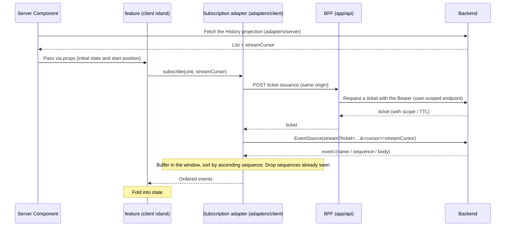
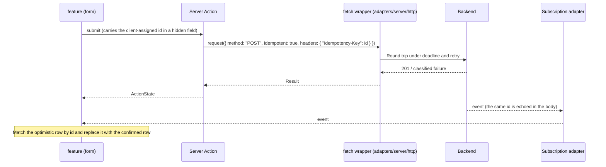
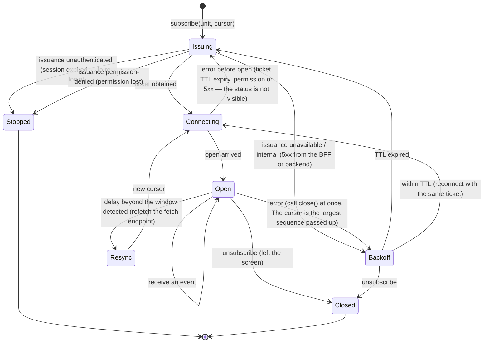

# Subscription and Delivery

**The subscription seam has a real implementation.** It lives in [`src/adapters/client/stream/`](../../src/adapters/client/stream/README.md), and consists of the state machine for one subscription and the components that assemble it (envelope, ordering, cursor, wait time). Like the other design references, this document was written after reading the implementation.

The decisions themselves — the transport is SSE, authentication is a ticket issued by the BFF, the stream carries events, the client assumes only monotonic increase, reconnection is done in-house, and it is not swapped out in mocks — belong to [ADR 0074](../adr/0074-runtime-communication-seam.md). Why its home is `adapters/client` belongs to [ADR 0024](../adr/0024-adapters-server-client-split.md), round-trip fetching and normalization to [data-fetching.md](data-fetching.md), and how credentials are held to [auth.md](auth.md). What this page holds is the background needed to read them, and what you step on when giving it a real implementation.

When in doubt, the ADR wins. This document is an explanation, not a rule.

## The line of responsibility — open and read, but do not hold

The side that **holds** the long-lived connection is the backend; this layer is **the side that opens and reads**. It holds no sockets, does not persist events, and does not decide who gets what. It holds only the following three things.

| Holds | Does not hold |
| --- | --- |
| The BFF obtaining a ticket from the backend and handing it to the browser | Validating, expiring and storing tickets (backend) |
| The browser opening the backend's stream, ordering the events that arrive, and passing them to the feature | Holding connections, replay, fan-out (backend) |
| Folding events into the screen's state (feature) | Numbering events and guaranteeing their order (backend) |

What this asymmetry makes possible is that **the screens do not change when the backend's implementation changes**. All this layer knows about the stream is "open one URL, and events carrying a name and a sequence arrive"; it does not know how the backend creates, stores or delivers events.

What the same asymmetry makes impossible is **filling in the stream's contents on its own**. It does not guess and fill in events that did not arrive, and does not ask the backend to fix the order. It has only one means of restoring consistency — refetching the initial-display fetch endpoint.

## The Pieces Involved (Locations)

| Role | Location |
| --- | --- |
| The initial-display fetch endpoint (the History projection, and where the subscription starts) | `src/adapters/server/api/<resource>.ts` |
| The ticket-issuing fetch endpoint (a user-scoped endpoint that asks the backend for a ticket with a Bearer) | `src/adapters/server/api/<resource>-stream.ts` |
| The ticket-issuing BFF | `src/app/api/<resource>/stream-ticket/route.ts` |
| The subscription adapter (open / order / deduplicate / reconnect / close) | `src/adapters/client/stream/` |
| The binding to React (passing the two functions, subscribe and snapshot, to `useSyncExternalStore`) | In the feature if only one feature uses it. Next to the subscription adapter if several do |
| Folding events (which event changes what, and how) | `src/features/<feature>/` |
| Submission (Server Action → an idempotent POST in `adapters/server`) | `src/app/**/actions.ts` → `src/adapters/server/api/<resource>.ts` |
| The place that adds the backend's origin to the CSP's `connect-src` | [`src/config/security-headers/security-headers.ts`](../../src/config/security-headers/security-headers.ts) |
| The status → classification mapping (browser side) | `KIND_BY_STATUS` in [`src/adapters/client/http/request.ts`](../../src/adapters/client/http/request.ts) |

Where the binding to React goes can be derived from the dependency table. `capabilities` and `components` cannot import `adapters` (`DEPENDENCIES` in `architecture.ts`), and whether a stream is alive belongs to `adapters/client` as the state of a communication mechanism ([ADR 0022](../adr/0022-capabilities-kernel.md)). So the hook can go only in the feature or in `adapters/client`, and it binds in the same `useSyncExternalStore` shape as `use-media-query`.

## The End-to-End Flow

The initial display is built from a round trip, and the subscription starts from where it left off. Submission happens outside the subscription, and its result comes back as an event.


```mermaid
sequenceDiagram
  participant S as Server Component
  participant F as feature (client island)
  participant A as Subscription adapter (adapters/client)
  participant R as BFF (app/api)
  participant B as Backend
  S->>B: Fetch the History projection (adapters/server)
  B-->>S: List + streamCursor
  S->>F: Pass via props (initial state and start position)
  F->>A: subscribe(unit, streamCursor)
  A->>R: POST ticket issuance (same origin)
  R->>B: Request a ticket with the Bearer (user-scoped endpoint)
  B-->>R: ticket (with scope / TTL)
  R-->>A: ticket
  A->>B: EventSource(stream?ticket=…&<cursor>=streamCursor)
  B-->>A: event (name / sequence / body)
  Note over A: Buffer in the window, sort by ascending sequence. Drop sequences already seen
  A-->>F: Ordered events
  Note over F: Fold into state
```

**The start position comes from the fetch response.** The endpoint that returns the projection also returns the stream's position at that moment. The subscribing side takes it as an argument, so there is no gap between the initial display and the subscription — events in that gap arrive from the stream as "after the cursor".

**Ticket issuance calls the same-origin BFF.** The browser holds no Access Token ([auth.md](auth.md)), so only the BFF can pass the backend's authorization. The ticket-issuing Route Handler is not subject to pre-screening unless it sits under a declared protected route, and it maps the backend's 401 to `unauthenticated` and returns it as a 401 — the same shape as a fetch Route Handler that needs authentication.

**Submission takes a path separate from the subscription.**


```mermaid
sequenceDiagram
  participant F as feature (form)
  participant X as Server Action
  participant W as fetch wrapper (adapters/server/http)
  participant B as Backend
  participant A as Subscription adapter
  F->>X: submit (carries the client-assigned id in a hidden field)
  X->>W: request({ method: "POST", idempotent: true, headers: { "Idempotency-Key": id } })
  W->>B: Round trip under deadline and retry
  B-->>W: 201 / classified failure
  W-->>X: Result
  X-->>F: ActionState
  B-->>A: event (the same id is echoed in the body)
  A-->>F: event
  Note over F: Match the optimistic row by id and replace it with the confirmed row
```

`idempotent: true` may be set only when an `Idempotency-Key` is attached ([data-fetching.md § POST / PATCH are not retried by default](data-fetching.md#post--patch-are-not-retried-by-default)). Using the client-side id as the key as is lets matching optimistic additions and deduplicating resends be done with one and the same value.

## Handling Order

All the client may assume is that "sequence increases monotonically per unit"; gaps and out-of-order arrival are both normal ([ADR 0074](../adr/0074-runtime-communication-seam.md)). From this assumption, ordering is assembled as follows.

| Stage | What it does | State it holds |
| --- | --- | --- |
| Receive | Puts the event into the window | The window (short; on the order of hundreds of ms) |
| Order | When the window closes, sorts by ascending sequence and passes it up | The largest sequence passed up (= the next cursor) |
| Deduplicate | Drops anything at or below the largest sequence passed up | Same as above |
| Late | Drops anything delayed beyond the window (a sequence smaller than the largest passed up), and refetches the fetch endpoint | Whether a refetch is in progress |

**"Waiting until the gap is filled" does not work.** Gaps are normal, so there is no condition under which to keep waiting. The window exists to "fix the order of what arrived at the same time", not to "wait for what is missing".

**Do not insert something that arrived late into an already-rendered position.** When something smaller than the largest sequence passed up arrives from outside the window, it is either a duplicate or something delayed beyond the window, and the adapter cannot tell which. Treating both the same — drop it and refetch the initial-display fetch endpoint — makes the distinction unnecessary. The subscription is re-established from the cursor of the refetched response.

**The adapter holds the cursor and does not show it to the feature.** The start position for the next reconnection is "the largest sequence passed up", which is transport state. If the feature held it, there would be as many authoritative resume positions as there are features.

**The stream's cursor and a list's cursor are different things.** A list's cursor ([ADR 0073](../adr/0073-pagination-fetch-boundary.md)) is an opaque value pointing at "the position of the next page", remembered by the URL. The stream's cursor is the sequence itself, remembered by the adapter. Using the same word invites confusion, so props and types get a distinguishable name such as `streamCursor`.

## How Reconnection Is Built

`EventSource`'s built-in reconnection is not used; the adapter reconnects on its own ([ADR 0074](../adr/0074-runtime-communication-seam.md)). The adapter holds the state as a single machine.


```mermaid
stateDiagram-v2
    [*] --> Issuing: subscribe(unit, cursor)
    Issuing --> Connecting: ticket obtained
    Issuing --> Stopped: issuance unauthenticated (session expired → to re-login)
    Issuing --> Stopped: issuance permission-denied (permission lost)
    Issuing --> Backoff: issuance unavailable / internal (5xx from the BFF or backend)
    Connecting --> Open: open arrived
    Connecting --> Issuing: error before open (ticket TTL expiry, permission or 5xx — the status is not visible)
    Open --> Open: receive an event
    Open --> Backoff: error (call close() at once. The cursor is the largest sequence passed up)
    Open --> Resync: delay beyond the window detected (refetch the fetch endpoint)
    Resync --> Connecting: new cursor
    Backoff --> Issuing: TTL expired
    Backoff --> Connecting: within TTL (reconnect with the same ticket)
    Open --> Closed: unsubscribe (left the screen)
    Backoff --> Closed: unsubscribe
    Stopped --> [*]
    Closed --> [*]
```

**When `error` arrives, call `close()` immediately.** The built-in reconnection fires `error` and then reconnects at the `retry:` interval, so unless it is closed first, the in-house backoff and the built-in reconnection both hit the same URL twice. A closed `EventSource` cannot be reused, so reconnecting means a new instance — which is why `Last-Event-ID` is not sent, and the cursor is passed in the query every time.

**Backoff applies only to 5xx and network drops.** It has jitter and an upper limit. While the screen is not visible (`document.hidden`), reconnection stops and resumes when it becomes visible — the backend's connection count is not spent on a screen nobody sees.

**The classification for giving up comes from the round-trip side.** `EventSource`'s `error` carries no status, so looking only at the stream side cannot tell "no permission" from "the backend is down". Only the ticket-issuing round trip can tell them apart — if `error` arrives before `open`, go back to issuance, and the classification returned there (`unauthenticated` / `permission-denied` / anything else) decides whether to give up or back off. Anything that drops after `open` is backed off as a transport matter.

**All the feature receives is the classification.** For `unauthenticated` it leads to re-login (the same shape as the incremental-fetch hook mapping `UNAUTHENTICATED` to `router.refresh()`); for `permission-denied` it shows the subscription-stopped state; during backoff it shows the "disconnected" state. Neither the close code nor `readyState` is shown to the feature.

## Which Layer Holds What

| Layer | Holds | Does not hold |
| --- | --- | --- |
| `adapters/server` | The ticket-issuing endpoint (user-scoped), the projection endpoint (returns the cursor), the submission endpoint (`idempotent: true`) | Opening the stream (the server does not subscribe) |
| `app/api` | The ticket-issuing BFF. It only maps the classification to a status | Validating and storing tickets |
| `adapters/client` | Open / close, ordering, deduplication, the cursor, reconnection, backoff, reusing a ticket within its TTL, normalizing into classifications, schema validation of events | The meaning of events, the screen's state |
| `features` | Folding events, matching optimistic rows, how the disconnected state looks | Sequence, reconnection, tickets |
| `config` | Adding the backend's origin to the CSP's `connect-src` | — |

**Normalization into classifications happens once, inside the adapter.** As on the round-trip side ([data-fetching.md § Error Normalization](data-fetching.md#error-normalization--where-a-raw-status-becomes-a-classification)), both exceptions thrown by the browser and `EventSource`'s `error` are mapped to the `errors` classifications before being passed to the feature.

**The adapter validates the shape of an event before passing it on.** It holds a zod schema of a discriminated union keyed by name, and drops and records names not in the contract and bodies whose shape does not match. It is the same principle as the round-trip side's "do not pass a response to the UI without validating it". Whether a schema generated from the contract can be applied as is depends on whether the contract declares events as components (see "What the Backend Side Needs to Decide" below).

## Common Pitfalls

### `EventSource` does not expose the status

What reaches `onerror` is an `Event`, with neither the response status nor the body. A 403, a 500 and a network drop are all the same `error`. The standard distinguishes only the cleanup: on a network drop it returns `readyState` to `CONNECTING` and proceeds to built-in reconnection, and on a non-200 response it drops to `CLOSED` and does not reconnect ([WHATWG HTML "Server-sent events"](https://html.spec.whatwg.org/multipage/server-sent-events.html)). Even that difference does not reach this adapter, which calls `close()` right after either `error`. The only materials for the decision are "has `open` ever arrived?" and "the classification the ticket-issuing round trip returned", and the state machine above is built from them. If you ever need to read the status, that is a decision to read SSE with `fetch` instead of `EventSource`, which departs from the default of [ADR 0074](../adr/0074-runtime-communication-seam.md).

### `KIND_BY_STATUS` does not fold 403 and 404

The browser-side request boundary (`adapters/client/http/request.ts`) maps the 401 / 403 / 404 returned by the ticket-issuing BFF to `unauthenticated` / `permission-denied` / `not-found` respectively. Folding them into `internal` would make both loss of permission and the absence of anything to subscribe to subject to backoff, reconnecting forever against something that will not recover — the same reason as "do not fold 401". When adding a ticket-issuing endpoint, if the rejection status the backend returns is not in this table, add a row.

### `connect-src` needs the backend's origin

Every round trip goes through the same-origin BFF, so `'self'` is enough for those, but a subscription is opened by the browser directly to the backend. If that origin is not in `connect-src`, the connection is blocked and nothing appears anywhere but the console. The subscription endpoint is assumed to sit on the same origin as the API, and `apiOrigin` of `SecurityHeaderInputs` (derived from `APP_API_BASE_URL`) goes into `connect-src` ([ADR 0111](../adr/0111-csp-security-headers.md)). If you connect to a backend that puts the subscription endpoint on an origin different from the API, add that origin as an input of the same shape. During development the backend's origin is a different port on `localhost`, but it is derived from the same input.

`EventSource` issues a CORS request to a different origin ([WHATWG HTML "Server-sent events"](https://html.spec.whatwg.org/multipage/server-sent-events.html)). If the response has no `Access-Control-Allow-Origin` allowing this origin, the browser treats the connection as failed. This is decided on the backend's response side, and is a different thing from this repository's CORS (what is attached to the BFF's responses; [ADR 0111](../adr/0111-csp-security-headers.md)).

### The ticket travels in the URL

Redaction **hides by name and does not look at the value's shape** ([observability.md](observability.md)). `REDACTED_FIELD_NAMES` is the four `authorization` / `cookie` / `password` / `token`, and does not reach a ticket inside a URL string. For browser-side exceptions, `reportClientError` sends `message` to the relay as is, so the moment the adapter builds a message containing the URL, the ticket rides along to the relay.

There are two safeguards, and both are needed. The adapter does not put URLs into exception messages. When wrapping an exception that originates in the browser (a failure to construct `EventSource` and the like), it erases the value by naming it with `redactMessage(message, [ticket])` before passing it to `createAppError`. `FetchInstrumentation` does not instrument `EventSource`, so it does not appear in spans, but it does appear in the backend's and the edge's access logs — that is outside this layer.

### A heartbeat sent as a comment line is invisible to the client

`EventSource` discards comment lines starting with `:` and fires no event. If the backend sends its heartbeat as a comment (a shape that prevents a proxy's idle timeout), from the client's side it is the same as nothing arriving, and "no event for a certain time" cannot be used as a signal of disconnection. If the client wants to watch liveness, the heartbeat must be a named event, and that is a decision on the contract's side. As long as the heartbeat is a comment line, liveness relies only on `error` arriving.

### Do not keep subscriptions open for screens that are not visible

`useSyncExternalStore`'s subscribe is set up on mount and torn down on unmount, but the mount continues even when the tab goes to the background. Stopping backoff while the screen is not visible is the adapter's job, not the hook's. Conversely, unsubscribing is not a failure — either the conditions changed or the user left the screen, and there is no one left to tell. Do not record it as giving up (the same as [`docs/rules.md`](../rules.md) "Do not record an abort of a client fetch as a failure").

### Optimistic additions only when a rollback is possible

`useOptimistic` is not used in the bundled sample, and if it is used, it is limited to cases where a rollback can be held ([forms.md](forms.md)). If submission fails with a classification, remove the optimistic row; if it can be matched with the id echoed by the event, replace it with the confirmed row. An optimistic row left unmatched disappears when the fetch endpoint is refetched — the refetch rebuilds from a state with no optimistic rows.

### Tests swap the constructor

The subscription adapter receives the `EventSource` constructor by injection (the same shape as `fetchImpl` on the round-trip side). Tests use a fake constructor to raise `open` / `message` / `error` in order, and check ordering, deduplication, giving up and backoff. Verification does not depend on whether the runtime environment has `EventSource`. The `integration` declaration applies to the ticket-issuing endpoint, which has a round trip with the outside, and the adapter's decisions are checked in the `unit` shape ([`src/adapters/README.md`](../../src/adapters/README.md) "Operations").

### Subscriptions are opened per tab and not shared between tabs

Open the same screen in several tabs, and subscriptions for the same unit are opened as many times as there are tabs. Ordering, deduplication and the cursor are closed inside one subscription, and there is no mechanism that bundles them into one across tabs (sharing via `BroadcastChannel` or `SharedWorker`) — bundling would need a state separate from transport: which tab holds the connection and which tab receives. This assumes the backend accepts several connections from one principal. Connections beyond the accepted limit are refused, and ride the reconnection path as an `error` before `open`.

### Storybook and mocks hold no subscriptions

No SSE handlers go into `mocks/` ([ADR 0074](../adr/0074-runtime-communication-seam.md)). What a story shows is the state the feature takes as a result of the subscription — open / disconnected / no permission / has optimistic rows — given through props. The means of raising events during development is held by the backend side, and this layer connects to the real backend.

## What the Backend Side Needs to Decide

The design of this layer closes here, but the following values sit on the contract's side, and once each is decided, one shape of the client is decided.

| Item | What it decides on the client side |
| --- | --- |
| The query parameter name of the resume cursor | The spelling the adapter uses to build the URL |
| The format and interval of the heartbeat | If it is a comment line, the client holds no liveness. If it is a named event, "no event for a certain time" can be the signal of disconnection |
| The ticket's TTL and scope | How long reconnection with the same ticket is possible during backoff. Past the TTL, go back to issuance |
| Whether event names and body schemas are in the contract (as OpenAPI components) | If they are, the generated schema can be applied. If not, the adapter holds a hand-written schema (as with the other endpoints in `adapters/client`) |
| Whether loss of permission is conveyed by dropping the stream, or by an event before dropping | If the former, go back to issuance to get the classification. If the latter, the adapter maps that event to `permission-denied` and gives up |
| The means of raising events during development | The procedure for checking the subscription's states locally |

## Verify it yourself

```bash
# 購読の実装が `adapters/client` の外に無いか
grep -rn "new EventSource\|new WebSocket" src --include='*.ts' --include='*.tsx' | grep -v "src/adapters/client/"

# CSP が stream の origin を許しているか（起動した dev サーバに対して）
curl -sI http://localhost:3000/ | grep -i content-security-policy | tr ';' '\n' | grep connect-src
```

## Related ADRs

- [0074](../adr/0074-runtime-communication-seam.md) — the decisions and rejections for the subscription seam. The foundation of this document
- [0024](../adr/0024-adapters-server-client-split.md) — why `adapters/client` is its home
- [0022](../adr/0022-capabilities-kernel.md) — the distinction between the state of a communication mechanism and a runtime capability
- [0071](../adr/0071-bff-api-integration.md) — resilience on the round-trip side and the opt-in to POST idempotency
- [0073](../adr/0073-pagination-fetch-boundary.md) — a list's cursor (a different thing from the stream's cursor)
- [0079](../adr/0079-auth-frontend-seam.md) — the Access Token is not in the browser
- [0080](../adr/0080-error-handling.md) — do not retry 401 / 403
- [0081](../adr/0081-observability-logging.md) — redaction that hides by name
- [0111](../adr/0111-csp-security-headers.md) — the default of `connect-src`
- [0112](../adr/0112-data-classification-cache-boundary.md) — the ticket-issuing endpoint is user-scoped
