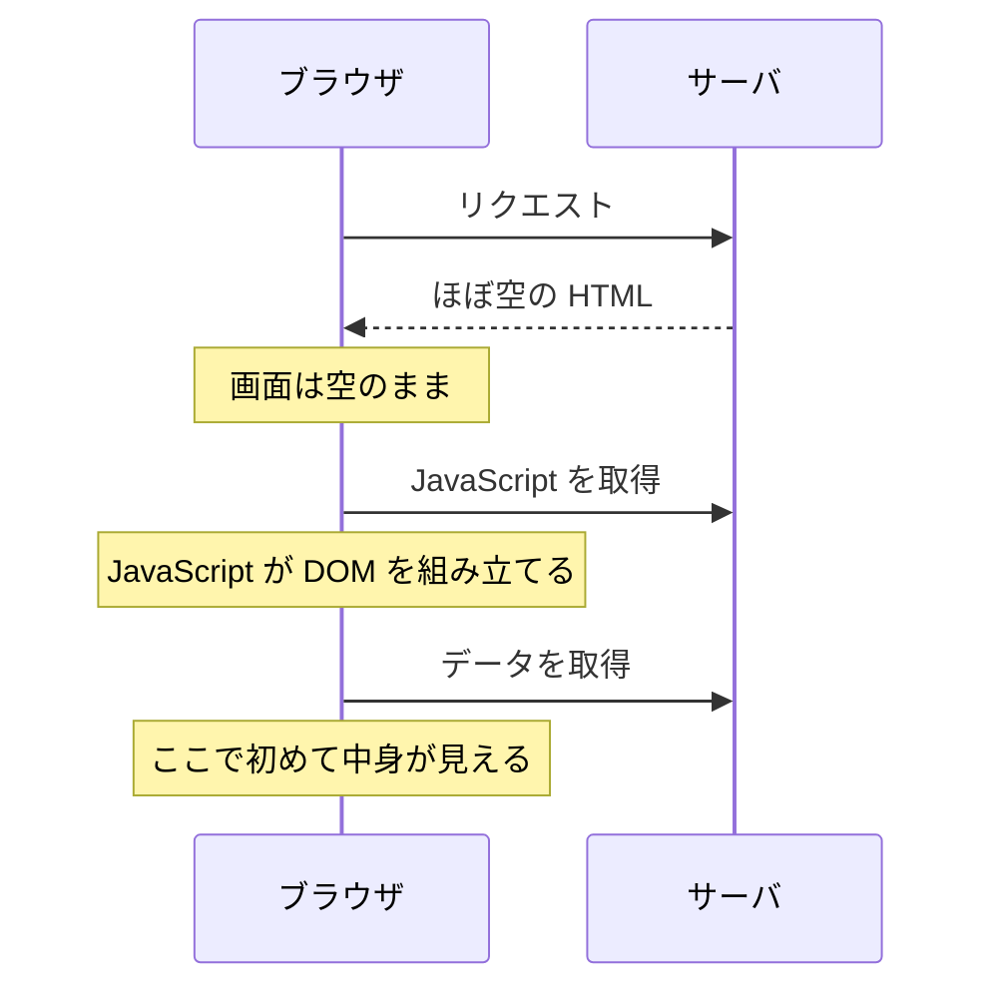
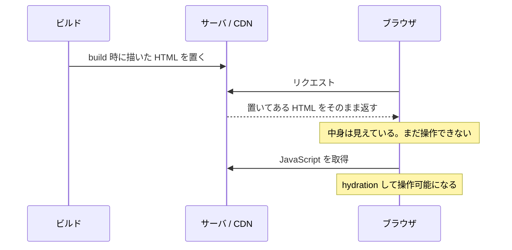
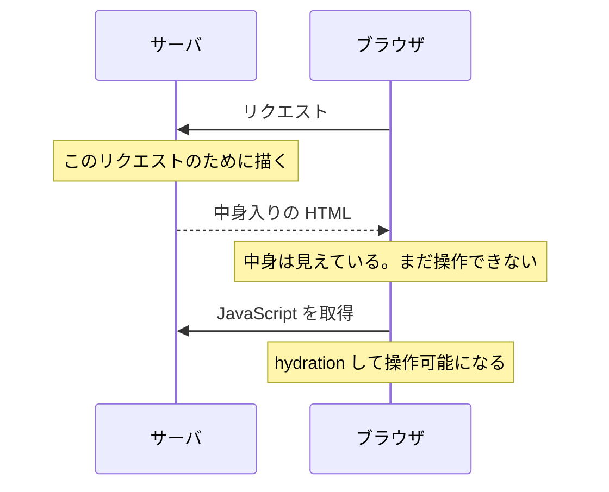
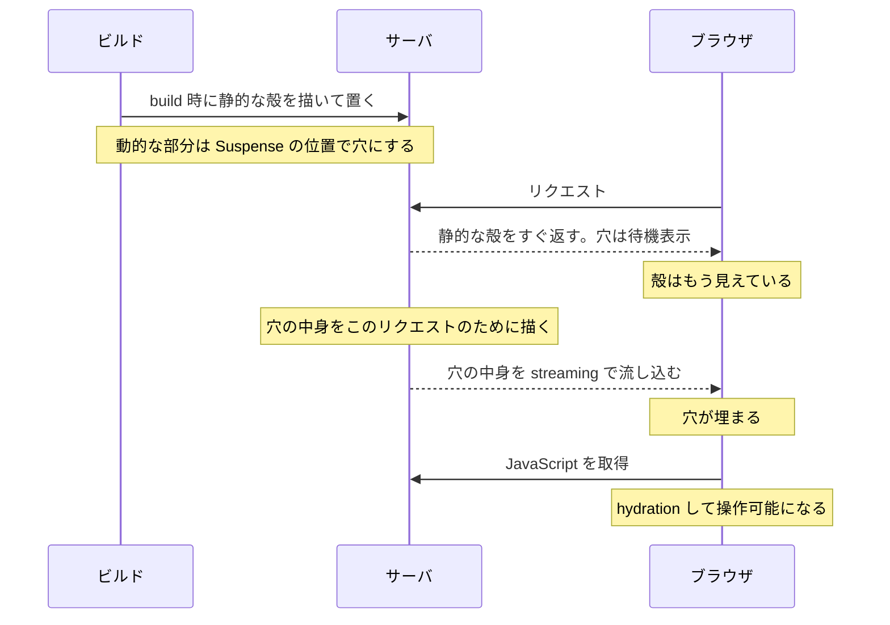

# レンダリングの読み方

この文書は、Next.js App Router のレンダリングについて**間違えやすいところ**だけを集めたものである。何をどこで描くかの方針は [ADR 0040](../adr/0040-routing-rendering-strategy.md)（ルーティング / レンダリング戦略）が、コンポーネント内部の書き方は [ADR 0042](../adr/0042-react19-rendering-api.md)（React 19 レンダリング API）が持つ。ここはその手前で、**用語の意味を取り違えたまま設計してしまうこと**を防ぐために置く。

判断に迷ったら ADR を優先する。この文書は説明であって規約ではない。

## 用語

この 5 つを取り違えると、以降の議論が全部ずれる。

| 語 | 意味 | よくある取り違え |
| --- | --- | --- |
| **Server Component** | サーバでだけ実行され、ブラウザへコードが送られないコンポーネント。App Router の既定 | 「速いコンポーネント」ではない。実行場所の話 |
| **Client Component** | `"use client"` を持つファイルから始まるコンポーネント。ブラウザへコードが送られ、操作を受け付ける | **「サーバで描かれない」ではない**（後述） |
| **SSR** | サーバで HTML を組み立てて返すこと | Server Component 専用の仕組みではない。Client Component も対象 |
| **hydration** | 返ってきた HTML に、ブラウザ側で event handler を取り付けて操作可能にすること | HTML を作り直すことではない。既にある DOM に紐付けるだけ |
| **RSC Payload** | Server Component を描いた結果の直列表現。HTML とは別に配られ、ブラウザ側が木を突き合わせるのに使う | HTML の別名ではない |

**Client Island** は正式な用語ではなく、「ほぼサーバで描かれた画面の中に、操作のために埋め込まれた小さい Client Component」を指す通称である。このリポジトリではこの形を既定にしている。

## 1 リクエストで起きること

順序を押さえると、後の誤解がほとんど消える。

1. サーバが **Server Component** を描き、結果を **RSC Payload** にする
2. サーバが **Client Component も描いて**、Payload と合わせて **HTML** を組み立てる
3. ブラウザが HTML を表示する。**画面はここで既に見えている**
4. ブラウザが RSC Payload で木を突き合わせる
5. ブラウザが JavaScript で **Client Component だけを hydration** する。**ここで操作可能になる**

**2 が最大の分かれ目である。** Client Component もサーバで HTML になる。`"use client"` は「サーバで描くな」という意味ではない。

### 3 の時点で何が見えているか

**Server Component の結果も Client Component の結果も、両方すでに見えている。** 欠けているのは見た目ではなく反応で、ボタンは描かれているが押しても何も起きない、という状態である。

例外は 2 つある。

- **Suspense の中でまだ解決していない部分**は fallback（待機表示）が出ている。中身も同じくサーバが描くが、届く時刻が後になる
- **ブラウザにしか分からない値に依存する分岐**は、サーバ側の姿で描かれている。画面幅・ポインタの種類・`window` の有無がこれにあたる（後述）

この 2 つを除けば、**JavaScript が 1 行も動いていない時点で画面は完成している**。検索する側や、通信が細くて JavaScript の到着が遅れる利用者が見るのはこの状態である。

## 描く時点の違い

前節は「Server Component と Client Component が 1 リクエストの中でどう分担するか」だった。ここは別の軸で、**いつ・どの単位で描くか**を扱う。

3 つの軸が別物であることを先に押さえる。混ぜると議論が噛み合わない。

| 軸 | 問い | 値 |
| --- | --- | --- |
| どこで作るか | サーバか、ブラウザか | SSR / CSR |
| いつ作るか | build 時か、リクエスト時か | Static rendering / Dynamic rendering |
| どの単位で返すか | ページ丸ごとか、部分ごとか | 一括 / streaming |

**PPR が触るのは 2 つめと 3 つめであって、CSR / SSR ではない。** サーバで描く話に閉じており、「ブラウザで描くか」には関与しない。

### CSR — 比較のために置く（App Router の既定ではない）



**中身が見えるまでに JavaScript の到着とデータ取得を待つ。** App Router でこの形になるのは `ssr: false` を明示したときだけである。

### Static rendering — build 時に描いて置いておく



**リクエスト時にサーバは何も描かない。** 速いが、build 時に決まらない情報は載せられない。

### Dynamic rendering — リクエストごとに描く



**リクエスト固有の情報を載せられる。** 代わりに、描き終わるまで最初の 1 バイトも返せない。

### PPR — 殻を先に返し、穴を後から埋める



**Static の「すぐ返せる」と Dynamic の「リクエスト固有の情報を載せられる」を 1 つの route の中で両立させる。** 引き換えに、**どこが殻でどこが穴かを決めるのが `<Suspense>` の位置**になる。前の 3 つでは書いても書かなくても届く時刻が変わらなかったものが、ここでは配信の形そのものを決める。

### 対称性

| | 最初の HTML が出るまで | リクエスト固有の情報 | 境界を決めるもの |
| --- | --- | --- | --- |
| CSR | JavaScript とデータを待つ | 載る | — |
| Static rendering | 待たない | 載らない | — |
| Dynamic rendering | サーバが描き終わるまで待つ | 載る | — |
| PPR | 待たない | 載る | **`<Suspense>` の位置** |

**PPR だけが最後の列を持つ。** これが「Suspense が飾りから構造になる」ということであり、PPR の複雑さの出どころである。

## 間違えやすいこと

### `"use client"` は「CSR にする指示」ではない

`"use client"` が宣言しているのは、**client bundle に入る境界**である。レンダリングの場所ではない。

古い枠組み（サーバで HTML を返す SSR か、空の HTML に JavaScript が描く CSR かの二択）で読むと、`"use client"` が「CSR 側へ倒す指示」に見える。App Router にその二択は無い。既定は「サーバで HTML を作り、操作の要る部分だけブラウザで hydration する」の一本で、`"use client"` はその後半に参加するかどうかを決めているだけである。

**唯一の本物の CSR** は、`dynamic(..., { ssr: false })` のようにサーバでの描画を明示的に止めた場合である。これは意図して選ぶものであって、`"use client"` の一般的な帰結ではない。

### Client Component の下が全部 Client になるとは限らない

伝染するのは **module graph（import の連鎖）** であって、**画面の親子関係**ではない。

- **伝染する**: `"use client"` のファイルが `import` したもの、および直接描画するコンポーネント
- **伝染しない**: `children` や props として**渡された**もの

渡されたものはサーバで描かれ、**描画済みの結果**として Client Component に置かれる。Client Component はそれを import していないので、client bundle には入らない。

したがって「Server → Client → Server」の入れ子は成立する。Client Component に `children` の口を開け、そこへサーバで描いたものを差す形がその実装である。

```tsx
// layout（Server Component）
<ClientShell>{children}</ClientShell>   // children はサーバで描かれたまま渡る
```

**確かめ方**: `curl` で初期 HTML を取り、中身が入っているかを見る。JavaScript を実行する前の状態が見えるので、SSR されたかどうかがそのまま判る。

### サーバでしか分からないこと・ブラウザでしか分からないことがある

画面幅・ポインタの種類・`window` の有無は、サーバでは決められない。そこで **サーバ側の初期値**を決めておき、hydration の後に本当の値へ入れ替える形になる。

このリポジトリの [`capabilities/use-media-query.ts`](../../src/capabilities/use-media-query.ts) はサーバで常に `false` を返す。つまり**初回の HTML は「一致していない側」の姿**であり、一致した側の姿は hydration の後に現れる。

この性質から、次の使い分けが出る。

- **本文の幅・順序が変わる出し分けには使わない**。hydration の前後で配置が動く。CSS の media query（Tailwind の `lg:` など）で行う（[ADR 0051](../adr/0051-styling-system.md) §2）
- **押せる必要のある操作の有無にも使わない**。JavaScript が届くまで押せない操作ができる
- **使ってよいのは、DOM を残したままでは成立しないもの**（focus trap など）と、**現れても位置が動かないもの**

### hydration mismatch は偶発的ではない

サーバが描いた HTML とブラウザが描いた結果が食い違うと起きる。原因は必ず**サーバとブラウザで違う値を使ったこと**にある。典型は現在時刻、乱数、`window` 依存の値である。

日時については [`docs/rules.md`](../rules.md) #53 が「server と client で異なる値を初期 render しない」を規約として持つ。

**確かめ方**: ブラウザの console を見る。mismatch が起きていれば警告が出る。出ていなければ起きていない。

### Server Component は「速い」わけではない

Server Component の利点は、**そのコードがブラウザへ送られないこと**と、**サーバ側の資源（設定・秘密・バックエンド接続）へ直接届くこと**である。実行そのものが速いわけではない。

逆に Client Component の代償は、**その分の JavaScript がブラウザへ送られること**である。SSR が壊れることではない。したがって「Client Component にすると SSR が死ぬ」を心配する必要はなく、心配すべきは**送るコードの量**である。

## このリポジトリでの現れ方

| 層 | 既定 | 備考 |
| --- | --- | --- |
| `app/` の `page.tsx` / `layout.tsx` | Server | 薄い層に留め、取得と組み立ては `features` が持つ |
| `app/**/route.ts` | サーバのみ | HTTP の口。[ADR 0025](../adr/0025-app-layer-elements.md) |
| `features/` | 原則 Server。操作の要る部分だけ Client Island | 島は小さく切り、器は Server のまま保つ |
| `components/` | 部品による | 操作を持つ部品は Client |
| `capabilities/` | Client | ブラウザの能力を購読する hook。[ADR 0022](../adr/0022-capabilities-kernel.md) |
| `stores/` | Client | 横断する client 状態。[ADR 0023](../adr/0023-stores-kernel.md) |
| `adapters/server` | サーバのみ | `server-only` を宣言している |
| `adapters/client` | Client | 同一オリジンへの薄い取得。[ADR 0024](../adr/0024-adapters-server-client-split.md) |

**器を Client にせず、島を差す。** 横断的な操作を足したくなったとき、外枠そのものを `"use client"` にすると、外枠が import しているものが全部ブラウザへ行く。外枠に props の口を開け、そこへ小さい Client Component を渡す形にすれば、外枠は Server のまま保てる。[`components/shell/app-shell`](../../src/components/shell/app-shell/) が `headerActions` / `sidebar` の口を持っているのはこのためである。

## 他に踏みやすい語

知らない語より、**知っている語が別の意味で使われている**ほうが危ない。以下は後者を優先して並べたものである。網羅ではなく、この構成を読むのに要るものに絞ってある。全語の定義は Next.js 同梱の用語集（`node_modules/next/dist/docs/01-app/04-glossary.md`）にある。

1 行では足りないものは「[表では足りない語](#表では足りない語)」で扱う。

### Server / Client

| 語 | 意味 | 取り違え |
| --- | --- | --- |
| `"use server"` | **`"use client"` の反対ではない。** client から呼べるサーバ関数を宣言する印 | 「このファイルはサーバで動く」の意味だと読む。既定でサーバなので、そういう宣言は要らない |
| Server Function | `"use server"` を付けた非同期関数。client から呼べる | — |
| Server Action | Server Function のうち、form の `action` や Client Component の props として渡されたもの | Server Function との差は**呼ばれ方**だけ |
| Client Bundles | ブラウザへ送られる JavaScript の塊 | Client Component の代償はここであって、SSR の可否ではない |
| `server-only` / `client-only` | 反対側へ import したらビルドを落とす印 | 実行を止めるものではなく、依存の混線を build 時に気付かせるもの |

### ルーティング

| 語 | 意味 | 取り違え |
| --- | --- | --- |
| Route Segment | URL の 1 階層に対応するフォルダ | — |
| Route Handler | `route.ts`。HTTP の口 | Pages Router の「API Routes」とは別物。同じ階層に `page.tsx` と共存できない |
| Proxy | `proxy.ts`。route に届く前に通る層 | **Next 16 で `middleware.ts` から改称された。** 「middleware」で調べると旧名の情報に当たる |

### 描画の決まり方

| 語 | 意味 | 取り違え |
| --- | --- | --- |
| Static rendering | build 時に描いておく | 明示的に選ぶものではない |
| Dynamic rendering | リクエストごとに描く | 同上。**使った API で自動的に決まる** |
| Runtime rendering | Dynamic rendering の別名 | **3 つめの描画方式ではない。** 資料によって呼び名が揺れているだけ |
| Prerendering / Static Shell | 事前に描いてある部分。ブラウザへ即座に返る | — |
| Streaming / Suspense boundary | 描けたところから順に送る仕組みと、その区切り | — |
| Loading UI | Suspense が解決するまで出る表示。`loading.tsx` がこれにあたる | `loading.tsx` は「読み込み中の画面」ではなく、**そのセグメントに Suspense を敷く宣言**である |

### キャッシュ（名前が似ていて寿命が違う）

| 語 | 生存範囲 | 取り違え |
| --- | --- | --- |
| Memoization | **1 リクエストの描画中だけ**。同じ `fetch` GET は自動で 1 回にまとまる。`fetch` 以外は React の `cache()` を使う | 「キャッシュした」と言うと次のリクエストにも残ると読まれる。残らない |
| Data Cache / Revalidation | **リクエストを跨いで残る**。`tags` を無効化して捨てる | 上と同じ「キャッシュ」の語で呼ばれる |
| Client Cache | **ブラウザが持つ** RSC Payload の控え。戻る / 進むで再利用される | サーバ側のキャッシュと混同する。再読み込みで消える |

**Route Handler は React の component tree の外にある。** `fetch` の自動 memoization が効くのは component tree の中なので、`route.ts` から呼ぶ経路では同じ前提を置かない。

### 遷移

| 語 | 意味 | 取り違え |
| --- | --- | --- |
| Client-side navigation | ページ全体を作り直さず、変わった部分だけ差し替える遷移 | `<a>` による通常の遷移とは別物。`Link` はこちら |
| Prefetching | 遷移先を先読みしておくこと | — |
| `router.refresh()` | サーバから描き直すが、**client state は保つ** | ブラウザの再読み込みとは別物。あちらは client state を捨てる |
| Version skew | 利用者が開いたままの間に新しい版がデプロイされ、新旧が食い違うこと | 「たまに壊れる」で片付けられがちだが、原因の名前が付いている |

### 境界とエラー

| 語 | 意味 | 取り違え |
| --- | --- | --- |
| Error Boundary | 配下で投げられた例外を捕まえて代わりの表示を出す仕組み。`error.tsx` がこれにあたる | **Client Component でなければならない。** また production では Server Component から投げられた例外の本文が伏せられ、境界には汎用の文言と `digest` しか届かない（[ADR 0080](../adr/0080-error-handling.md)） |

### ルーティングの残り

| 語 | 意味 | 取り違え |
| --- | --- | --- |
| Dynamic route segment | `[id]`。値が入る階層 | — |
| Catch-all segment | `[...slug]` / `[[...slug]]`。以降の階層をまとめて受ける | — |
| Private Folder `_name` | **URL に現れない**フォルダ。ルーティングの対象から外す | **URL に出ないフォルダは 2 種類ある。** `(name)` は器を分けるため、`_name` はルーティングから外すため。目的が違う |

### ビルドと配信

| 語 | 意味 | 取り違え |
| --- | --- | --- |
| ISR（Incremental Static Regeneration） | 静的に描いたものを期限付きで作り直す | 名前が難しいだけで、やっていることは「静的だが古くなったら描き直す」 |
| Static Export | ページを全部静的ファイルとして出す構成 | 採るとサーバが無くなるため、Request-time API も Route Handler も使えなくなる |

### その他

| 語 | 意味 | 取り違え |
| --- | --- | --- |
| `params` / `searchParams` は Promise | Next 15 以降、`await` してから読む | 同期で読めた頃のコード例が大量に残っている |
| Edge runtime / Node.js runtime | 実行環境が 2 つある | [`instrumentation.ts`](../../src/instrumentation.ts) が `NEXT_RUNTIME` で分岐しているのはこのため |
| Turbopack | 既定のバンドラ | webpack 前提の設定情報に当たることがある |

## 表では足りない語

### Request-time API — 触ると描画方式が変わる

`cookies()` / `headers()` / `searchParams` / `draftMode()` の 4 つ。これらに触れたコンポーネントは、その時点で **dynamic rendering へ倒れる**。

倒れるのはページ全体ではなく、触れたコンポーネントを含む区画である。したがって木の深いところにある小さなコンポーネントが `cookies()` を読んだだけで、その区画は毎リクエスト描かれるようになる。

**「読むだけ」という感覚と実際の影響が釣り合わない。** 静的に配れるはずだったところが動的になっていることに、書いた側は気付きにくい。静的に保ちたい部分とリクエストごとに変わる部分は、Suspense で区切って別々に扱う。

### Route Group `(name)` — URL に出ないだけではない

括弧で囲んだフォルダは URL に現れない。`app/(marketing)/about/page.tsx` は `/about` である。ここまでは知られているが、**副作用が 2 つある**。

- **グループごとに root layout を分けられる。** 分けた場合、**異なる root layout を跨ぐ遷移はフルページリロードになる**（client-side navigation にならない）。器を分けたこと自体が遷移の質を変える
- **別のグループが同じ URL へ解決するとエラーになる。** `(marketing)/about` と `(shop)/about` はどちらも `/about` なので共存できない

### Partial Prerendering (PPR) — 1 つの機能ではなくモデルの切り替え

**難しいのは機能そのものではなく、それまで前提にしていたモデルが崩れるところである。** 順に 4 つ崩れる。配信の形そのものは「[描く時点の違い](#描く時点の違い)」の図で先に見ておくと早い。

**1 つの route は静的か動的かのどちらか、という前提が消える。** PPR は 1 つの route の中に静的な部分と動的な部分を同居させる。build 時に描ける範囲を「静的な殻」として出力し、描けない部分には穴を空けておく。リクエスト時にその穴へ動的な中身を streaming で流し込む。

**Suspense の役割が変わる。** それまで `<Suspense>` は「待っている間に代わりを出す」ための飾りだった。PPR ではそれが**静的と動的の境界線そのもの**になる。書き方は同じで意味だけが重くなり、境界を 1 つ動かすと静的に配れる範囲が変わる。

**既定が反転する。** データ取得は**動的が既定**になり、キャッシュしたいものに `"use cache"` を付けて選ぶ形になる。従来モデルの「静的が既定で、動的にしたいものが opt-out」とは向きが逆である。

**遷移の意味論まで変わる。** client-side navigation が React の `<Activity>` を使うようになり、前の route が unmount されずに隠されるだけになる。**戻ると state が残っている。** 便利だが、「開いたまま離れた」状態が残る前提で作っていない部品は影響を受ける。

#### 3 つの語の関係

| 語 | 位置づけ |
| --- | --- |
| `"use cache"` | **指示子**。route / コンポーネント / 関数に「キャッシュしてよい」と印を付ける。ファイル先頭なら全 export、関数の先頭ならその戻り値が対象 |
| Cache Components | **機構**。`"use cache"` を軸に、静的・キャッシュ済み・動的を 1 つの route の中で混ぜられるようにする。寿命は `cacheLife()`、タグ付けは `cacheTag()` |
| Partial Prerendering (PPR) | **その機構で得られる描画の形**。静的な殻を即座に返し、動的な部分は準備でき次第 streaming で流し込む |

`"use client"` / `"use server"` と字面が揃っているが、**3 つで 1 組の選択肢ではない**。前 2 つは実行場所と呼び出し可否の話で、`"use cache"` はキャッシュの話である。

#### route 単位で試せるものではない

Next 16 では `cacheComponents: true` の 1 つに束ねられ、有効にすると PPR が既定の挙動になる。Next 15 にあった `experimental.ppr` と route 単位の `experimental_ppr` は**削除された**。つまり**リポジトリ全体のモデルを切り替えるスイッチ**であり、1 画面だけ試すことはできない。

#### このリポジトリは無効にしている

`next.config.ts` に `cacheComponents` を書いていない（= 無効）。したがって**従来モデル**で動いており、`fetch` は既定でキャッシュせず、必要なところで opt-in する。判断と根拠は [ADR 0041](../adr/0041-cache-components-decision.md) が持つ。

**外部の情報を読むときは、どちらのモデルの話かを先に確かめる。** Next.js 自身のドキュメントも Cache Components 前提のページと従来モデル向けのページが別々にある。区別を見落とすと、書いてあるとおりにしても動かない。

### Code Splitting / Tree Shaking — 代償を見積もる道具

- **Code Splitting**: **route 単位**で JavaScript を分割する。開いたページに届くのは、その route に要る分だけ
- **Tree Shaking**: 使っていない export を build 時に落とす

この 2 つがあるので、「Client Component を 1 つ足したらアプリ全部の JavaScript が届く」にはならない。**増えるのはその route の塊だけ**である。

逆に言えば、**使っているものは落ちない**。大きなライブラリを Client Component から import すれば、その route の塊はその分だけ膨らむ。器を Client にせず島を差す形が効くのはここで、島が小さければ import も小さい。

### Parallel Routes / Intercepting Routes — 知らないと自前で組んでしまう

- **Parallel Routes**（`@folder`）: 1 つの layout の中に**複数のページを同時に**、あるいは条件によって描く。独立した区画が並ぶ画面で使う
- **Intercepting Routes**: 遷移元によって同じ URL の描き方を変える

組み合わせると、「一覧から押したときはその場にモーダルで開き、同じ URL を直接叩いたら全画面で開く。**URL は共有できる**」という形が、ルーティングの機能だけで成立する。

**知らないと、同じことを client state とモーダルの出し分けで自前に組むことになる。** その場合 URL が変わらないので、共有も戻る操作も成立しない。まだ使っていないが、「一覧から詳細をモーダルで開きたい」と思った時点で最初に検討する選択肢である。

## ここでは扱わない語

次は Next.js 固有の語ではあるが、**判断を持っている ADR が別にある**。ここに定義を書くと二重管理になるため、誘導だけ置く。

| 語 | 判断の在り処 |
| --- | --- |
| Metadata | [ADR 0044](../adr/0044-seo-metadata-strategy.md) |
| Font Optimization / Image Optimization | [ADR 0045](../adr/0045-fonts-and-images.md) |
| Redirect / Rewrite | [ADR 0043](../adr/0043-middleware-policy.md) |
| Not Found | [ADR 0080](../adr/0080-error-handling.md) |
| Environment Variables | [ADR 0030](../adr/0030-environment-variable-management.md) |
| Import Aliases | [ADR 0027](../adr/0027-directory-structure.md) |

## 自分で確かめる

思い込みで判断せず、次の 2 つで足りる。

```bash
# 初期 HTML に中身が入っているか（JavaScript 実行前の状態が見える）
curl -s http://localhost:3000/<path> | grep -o '<探したい文字列>'
```

ブラウザの console に hydration の警告が出ていないかを見る。出ていなければ、サーバとブラウザの出力は一致している。

**開発サーバの状態を過信しない。** 起動時に一度だけ走る初期化（モックの起動など）は、ファイルを保存して再コンパイルした後に失われていることがある。挙動が変わったように見えたら、開発サーバを立て直してから判断する。
