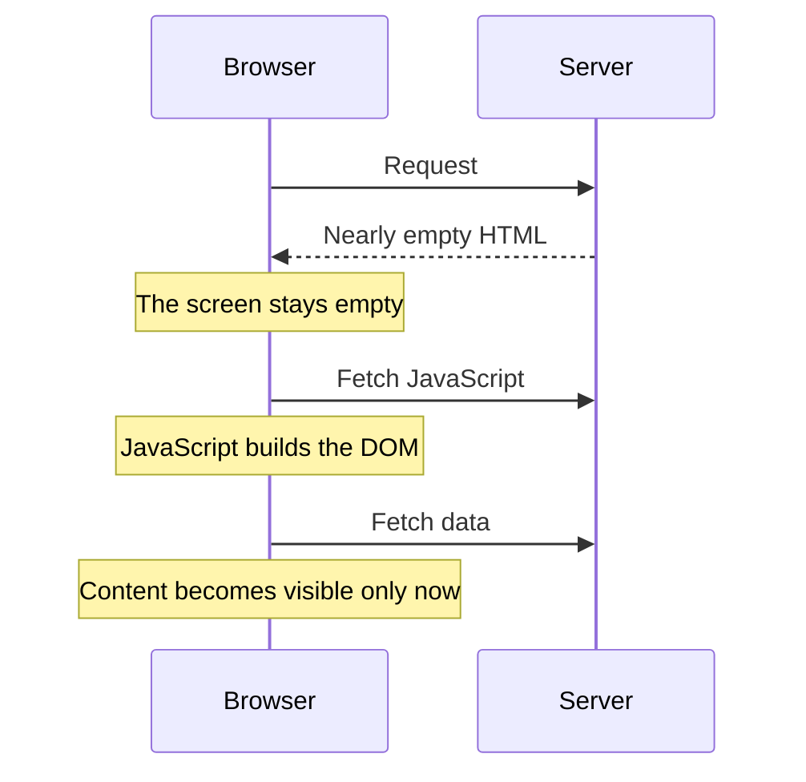
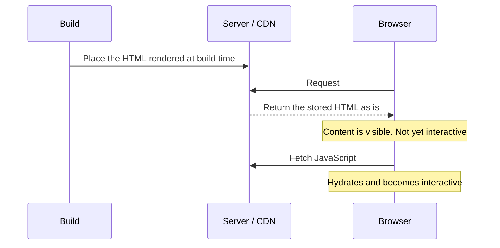
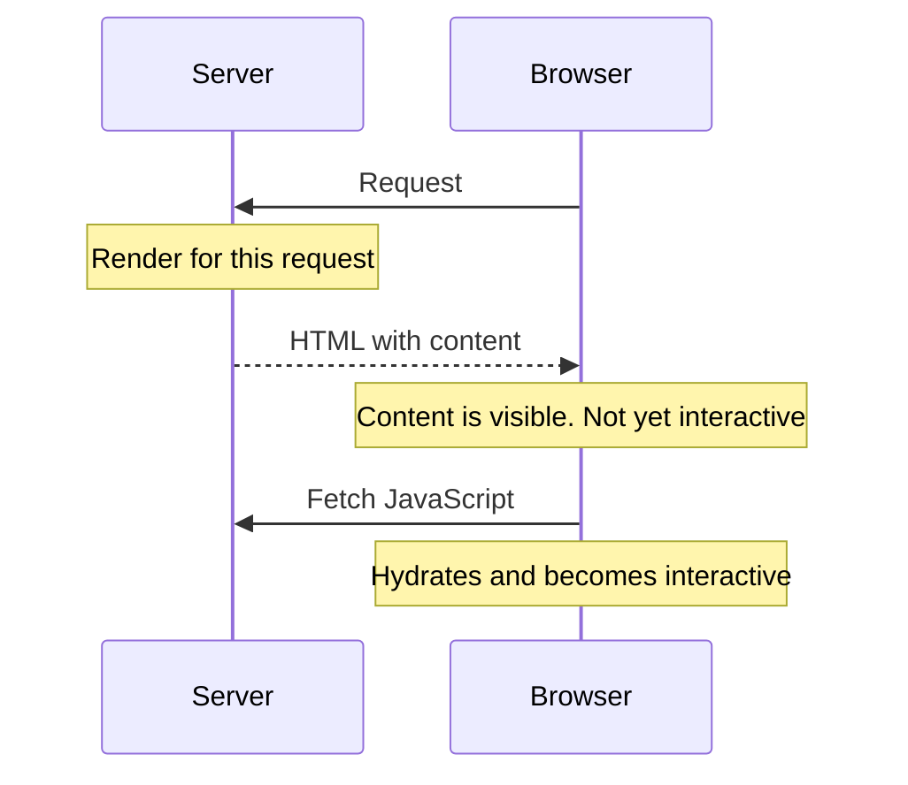
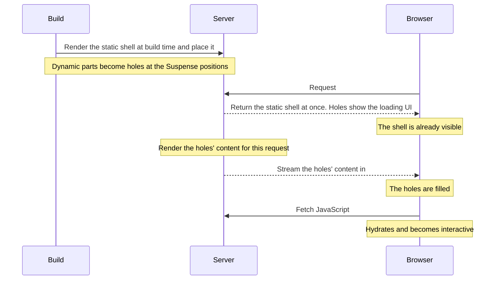

# Understanding Rendering

This document collects only **the places that are easy to get wrong** about rendering in the Next.js App Router. The policy on what to render where belongs to [ADR 0040](../adr/0040-routing-rendering-strategy.md) (routing / rendering strategy), and how to write the inside of a component belongs to [ADR 0042](../adr/0042-react19-rendering-api.md) (React 19 rendering APIs). This page sits before those, to prevent **designing while the meaning of the terms is misunderstood**.

When in doubt, the ADR wins. This document is an explanation, not a rule.

## Terminology

Confuse these five, and every discussion that follows drifts.

| Term | Meaning | Common confusion |
| --- | --- | --- |
| **Server Component** | A component that runs only on the server; its code is not sent to the browser. The App Router default | It is not "a fast component". It is about where it runs |
| **Client Component** | A component starting from a file that has `"use client"`. Its code is sent to the browser, and it accepts interaction | **It does not mean "not rendered on the server"** (see below) |
| **SSR** | Assembling HTML on the server and returning it | Not a mechanism exclusive to Server Components. Client Components are included |
| **hydration** | Attaching event handlers in the browser to the returned HTML so it becomes interactive | It does not rebuild the HTML. It only binds to the DOM already there |
| **RSC Payload** | The serialized result of rendering Server Components. Delivered separately from the HTML, and used by the browser to reconcile the tree | It is not another name for HTML |

**Client Island** is not an official term but a nickname for "a small Client Component embedded for interaction inside a screen rendered almost entirely on the server". This repository makes this shape the default.

## What Happens in One Request

Once you have the order, most later misunderstandings disappear.

1. The server renders the **Server Components** and turns the result into the **RSC Payload**
2. The server **also renders the Client Components**, and assembles the **HTML** together with the Payload
3. The browser displays the HTML. **The screen is already visible at this point**
4. The browser reconciles the tree with the RSC Payload
5. The browser **hydrates only the Client Components** with JavaScript. **This is when it becomes interactive**

**Step 2 is the biggest fork in understanding.** Client Components also become HTML on the server. `"use client"` does not mean "do not render on the server".

### What is visible at step 3

**The results of both Server Components and Client Components are already visible.** What is missing is not appearance but response: the button is rendered, but pressing it does nothing.

There are two exceptions.

- **Parts inside Suspense that have not resolved yet** show the fallback (loading UI). Their contents are rendered by the server too, but arrive later
- **Branches that depend on values only the browser knows** are rendered in their server-side form. Screen width, pointer type and whether `window` exists are such values (see below)

Apart from these two, **the screen is complete before a single line of JavaScript has run**. This is the state seen by search engines, and by users on slow connections whose JavaScript arrives late.

## When Rendering Happens

The previous section was about "how Server Components and Client Components divide the work within one request". This one is a different axis: **when, and in what unit, rendering happens**.

First note that the three axes are separate things. Mixing them makes discussions talk past each other.

| Axis | Question | Values |
| --- | --- | --- |
| Where it is built | Server or browser | SSR / CSR |
| When it is built | At build time or at request time | Static rendering / Dynamic rendering |
| In what unit it is returned | The whole page or part by part | All at once / streaming |

**PPR touches the second and third, not CSR / SSR.** It is confined to rendering on the server and has nothing to do with "whether to render in the browser".

### CSR — for comparison (not the App Router default)


```mermaid
sequenceDiagram
  participant B as Browser
  participant S as Server
  B->>S: Request
  S-->>B: Nearly empty HTML
  Note over B: The screen stays empty
  B->>S: Fetch JavaScript
  Note over B: JavaScript builds the DOM
  B->>S: Fetch data
  Note over B: Content becomes visible only now
```

**Before the content is visible, it waits for JavaScript to arrive and for data to be fetched.** In the App Router you get this shape only when you specify `ssr: false` explicitly.

### Static rendering — render at build time and keep it


```mermaid
sequenceDiagram
  participant D as Build
  participant S as Server / CDN
  participant B as Browser
  D->>S: Place the HTML rendered at build time
  B->>S: Request
  S-->>B: Return the stored HTML as is
  Note over B: Content is visible. Not yet interactive
  B->>S: Fetch JavaScript
  Note over B: Hydrates and becomes interactive
```

**At request time the server renders nothing.** It is fast, but cannot carry information not settled at build time.

### Dynamic rendering — render per request


```mermaid
sequenceDiagram
  participant S as Server
  participant B as Browser
  B->>S: Request
  Note over S: Render for this request
  S-->>B: HTML with content
  Note over B: Content is visible. Not yet interactive
  B->>S: Fetch JavaScript
  Note over B: Hydrates and becomes interactive
```

**It can carry request-specific information.** In exchange, not even the first byte can be returned until rendering finishes.

### PPR — return the static shell first, fill the dynamic holes later


```mermaid
sequenceDiagram
  participant D as Build
  participant S as Server
  participant B as Browser
  D->>S: Render the static shell at build time and place it
  Note over D,S: Dynamic parts become holes at the Suspense positions
  B->>S: Request
  S-->>B: Return the static shell at once. Holes show the loading UI
  Note over B: The shell is already visible
  Note over S: Render the holes' content for this request
  S-->>B: Stream the holes' content in
  Note over B: The holes are filled
  B->>S: Fetch JavaScript
  Note over B: Hydrates and becomes interactive
```

**It combines Static's "can return immediately" and Dynamic's "can carry request-specific information" within one route.** In exchange, **the position of `<Suspense>` decides what is static shell and what is dynamic hole**. Something that, in the previous three, changed nothing about arrival time whether you wrote it or not, here decides the very shape of delivery.

### Symmetry

| | Until the first HTML comes out | Request-specific information | What decides the boundary |
| --- | --- | --- | --- |
| CSR | Waits for JavaScript and data | Carried | — |
| Static rendering | Does not wait | Not carried | — |
| Dynamic rendering | Waits until the server finishes rendering | Carried | — |
| PPR | Does not wait | Carried | **The position of `<Suspense>`** |

**Only PPR has the last column.** This is what "Suspense turns from decoration into structure" means, and it is where PPR's complexity comes from.

## Common Mistakes

### `"use client"` is not "an instruction to do CSR"

What `"use client"` declares is **the boundary of what goes into the client bundle**. It is not where rendering happens.

Read with the old framework (a binary choice between SSR, where the server returns HTML, and CSR, where JavaScript draws into empty HTML), `"use client"` looks like "an instruction to switch to the CSR side". The App Router has no such binary choice. The default is the single path "build HTML on the server, and hydrate in the browser only the parts that need interaction", and `"use client"` only decides whether a component takes part in the second half of that.

**The only real CSR** is when server rendering is explicitly turned off, as in `dynamic(..., { ssr: false })`. That is something chosen deliberately, not a general consequence of `"use client"`.

### Not everything under a Client Component becomes Client

What spreads is **the module graph (the chain of imports)**, not **the parent-child relationship on screen**.

- **Spreads**: what a `"use client"` file `import`s, and the components it renders directly
- **Does not spread**: what is **passed** as `children` or props

What is passed is rendered on the server and placed into the Client Component as **an already-rendered result**. The Client Component does not import it, so it does not enter the client bundle.

So nesting "Server → Client → Server" works. Opening a `children` slot on the Client Component and inserting something rendered on the server into it is how this is implemented.

```tsx
// layout（Server Component）
<ClientShell>{children}</ClientShell>   // children はサーバで描かれたまま渡る
```

**How to check**: fetch the initial HTML with `curl` and see whether the content is there. You see the state before any JavaScript runs, so whether it was SSR'd is directly visible.

### Some things only the server knows, and some only the browser knows

Screen width, pointer type and whether `window` exists cannot be decided on the server. So the shape is to decide a **server-side initial value** and replace it with the real value after hydration.

This repository's [`capabilities/use-media-query.ts`](../../src/capabilities/use-media-query.ts) always returns `false` on the server. So **the first HTML is the "not matching" form**, and the matching form appears after hydration.

From this property, the following division of use follows.

- **Do not use it to switch content in ways that change the width or order of the body**. The layout moves before and after hydration. Do it with CSS media queries (Tailwind's `lg:` and the like) ([ADR 0051](../adr/0051-styling-system.md))
- **Do not use it for whether an interaction that must be pressable exists either**. It creates interactions that cannot be pressed until JavaScript arrives
- **What may use it is what cannot work while leaving the DOM in place** (focus traps and the like), and **what does not move position when it appears**

**This asymmetry extends beyond rendering to "how a value sent in is read".** What a `datetime-local` input carries is
**a wall-clock time with no offset** (`2026-09-01T09:00`), and if the receiving endpoint passes it to `new Date()`, it is interpreted in **the offset of the
runtime environment**. The deployment target is usually UTC, so an instant shifted by the difference from the inputting person's offset is stored.
There is no hydration warning and no type error; **only the stored value is quietly wrong**.

Only the inputting side knows which offset it should be read in, so either send the offset itself along with it, or settle it into an
instant before submitting. On the server side, do not pass a bare wall-clock time to `new Date()`.

A receiving endpoint that accepts a pair of wall-clock time and offset **rejects spellings that already carry an offset**. A validation that only checks whether
`new Date` can read it lets them through, and an instant different from the intent is settled from a spelling that cannot be re-read as a wall-clock time.

### Hydration mismatches are not accidental

They happen when the HTML the server rendered and the result the browser rendered disagree. There are two causes.

**1. The server and the browser used different values.** Typical are the current time, random numbers and values that depend on `window`. For dates and times, [the implementation rules on display and formatting](../rules.md#formatting) hold "do not render different values on server and client in the initial render" as a rule.

**2. The DOM was rewritten from outside React.** What React compares against is not "the HTML the server returned" but **the DOM at the moment of hydration**, so if someone adds an attribute before that, it is reported as a mismatch even though the values are the same on both sides. The one rewriting it is not necessarily your own code — libraries that trap focus or make the background inert reach into `document` directly without going through React.

**Cause 2 happens when hydration does not finish in one commit.** Hydration is split per Suspense boundary: outside a boundary is hydrated first, inside later. If the effect of an island hydrated first rewrites DOM on the side not yet hydrated, React arriving there later sees a mismatch. The condition is that **the island's position and the position of what it rewrites differ**, so aligning values does not make it go away.

**To fix it, the rewrite has to be deferred until "after the other side is hydrated". A timer cannot defer it.** The approaches that measurably missed — `requestIdleCallback` is missing in WebKit and throws. `setTimeout` is too early. `requestAnimationFrame` does not fire in a background tab. `startTransition` does not work because `useSyncExternalStore` updates run synchronously. `load` sometimes has `readyState` already at `complete` by the time of the effect. It comes down to either **having the other side say "I am hydrated"**, or **changing what gets rewritten into an
element that is hydrated first**. This repository takes the latter, wrapping the screen body in one element rendered by the root layout
(`app-root` in `src/app/layout.tsx`).

**How to check**: look at the browser console. If a mismatch happened, there is a warning. If there is none, it did not happen.

### Server Components are not "fast"

The advantages of a Server Component are that **its code is not sent to the browser** and that **it reaches server-side resources (configuration, secrets, backend connections) directly**. Execution itself is not faster.

Conversely, the cost of a Client Component is that **that much JavaScript is sent to the browser**. It is not that SSR breaks. So there is no need to worry that "making it a Client Component kills SSR"; what to worry about is **the amount of code sent**.

### A Server Action's `redirect()` does not navigate to a Route Handler

Calling `redirect()` inside a Server Action makes the response an instruction "move to this URL", and **the one actually navigating is the client router**. The router knows route segments (`page.tsx`), not Route Handlers (`route.ts`), so **a redirect pointing at a Route Handler rewrites only the URL without a single request going out.** The same holds even with a same-origin absolute URL, because from the client router's point of view it is an internal navigation.

If you need to hand off to a Route Handler after causing a side effect, receive it with **a plain form submission** (`<form method="post" action="/...">`) rather than a Server Action. The browser itself navigates, so a chain of `Response.redirect`s and the cookie round trip go through as is.

The cost is that a plain submission cannot carry state over. **Per-field errors and the submitting indicator** carried on `useActionState`'s return value do not appear, so failures are returned through URL search conditions (`?error=...`). In the sample, the authorization round trip of `/dev/session` takes this shape (`DEV_AUTHORIZE_PATH` in [`src/features/dev-session/paths.ts`](../../src/features/dev-session/paths.ts)).

**How to check**: open a screen that calls `redirect("/api/…")` from a Server Action, operate it, and look at the development server's log. The URL has changed, but not a single line for that `GET` appears.

## How It Shows Up in This Repository

| Layer | Default | Notes |
| --- | --- | --- |
| `page.tsx` / `layout.tsx` in `app/` | Server | Kept a thin layer; fetching and assembly belong to `features` |
| `app/**/route.ts` | Server only | HTTP endpoints. [ADR 0025](../adr/0025-app-layer-elements.md) |
| `features/` | Server in principle. A Client Island only for parts that need interaction | Cut islands small, and keep the layout shell Server |
| `components/` | Depends on the component | Components with interaction are Client |
| `capabilities/` | Client | Hooks that subscribe to browser capabilities. [ADR 0022](../adr/0022-capabilities-kernel.md) |
| `stores/` | Client | Cross-cutting client state. [ADR 0023](../adr/0023-stores-kernel.md) |
| `adapters/server` | Server only | Declares `server-only` |
| `adapters/client` | Client | Thin same-origin fetching. [ADR 0024](../adr/0024-adapters-server-client-split.md) |

**Do not make the layout shell Client; insert islands.** When you want to add a cross-cutting interaction, making the outer frame itself `"use client"` sends everything the outer frame imports to the browser. Open a props slot on the outer frame and pass a small Client Component into it, and the outer frame stays Server. This is why [`components/shell/app-shell`](../../src/components/shell/app-shell/) has the `headerActions` / `sidebar` slots.

## Other Terms That Trip People Up

**A term you know being used with a different meaning** is more dangerous than a term you do not know. The following list puts that kind first. It is not exhaustive; it is narrowed to what is needed to read this setup. Definitions of every term are in the glossary bundled with Next.js (`node_modules/next/dist/docs/01-app/04-glossary.md`).

Terms that one line cannot cover are handled in "[Terms a Table Cannot Cover](#terms-a-table-cannot-cover)".

### Server / Client

| Term | Meaning | Confusion |
| --- | --- | --- |
| `"use server"` | **Not the opposite of `"use client"`.** A marker declaring server functions that can be called from the client | Reading it as "this file runs on the server". The server is the default, so no such declaration is needed |
| Server Function | An async function marked `"use server"`. Callable from the client | — |
| Server Action | A Server Function passed as a form's `action` or as a Client Component's props | The only difference from a Server Function is **how it is called** |
| Client Bundles | The chunks of JavaScript sent to the browser | This is where a Client Component's cost lies, not in whether SSR works |
| `server-only` / `client-only` | Markers that fail the build if imported on the opposite side | They do not stop execution; they surface tangled dependencies at build time |

### Routing

| Term | Meaning | Confusion |
| --- | --- | --- |
| Route Segment | A folder corresponding to one level of the URL | — |
| Route Handler | `route.ts`. An HTTP endpoint | A different thing from the Pages Router's "API Routes". Cannot coexist with `page.tsx` at the same level |
| Proxy | `proxy.ts`. The layer passed through before reaching a route | **Renamed from `middleware.ts` in Next 16.** Searching for "middleware" hits information under the old name |
| Parallel Route / Slot | A branch rendered independently per `@name/` and received by the layout as props | Easy to trip over the two points below |

**On a screen that has no route corresponding to a slot, the previous slot stays as it is.** It goes back to `default.tsx` only
on a reload, not on a move across screens (soft navigation). So when you add a slot,
**place the slot for every route beneath it**. Otherwise, after a save sends you to the list, the previous screen's
slot remains.

**A slot passes an element even to a screen whose content is empty.** What it passes is "a component that returns `null`", not `undefined`,
so a check like `slot === undefined` on the layout side does not work. If you do not want to reserve space when it is empty,
collapse it by **whether the rendered result is empty** (`empty:hidden` and the like).

### How the Rendering Mode Is Decided

| Term | Meaning | Confusion |
| --- | --- | --- |
| Static rendering | Rendered ahead at build time | Not something you choose explicitly |
| Dynamic rendering | Rendered per request | Same as above. **Decided automatically by the APIs you use** |
| Runtime rendering | Another name for Dynamic rendering | **Not a third rendering mode.** The name merely varies between sources |
| Prerendering / Static Shell | The parts rendered in advance. Returned to the browser immediately | — |
| Streaming / Suspense boundary | The mechanism that sends parts in order as they finish rendering, and its divisions | — |
| Loading UI | What is shown until Suspense resolves. `loading.tsx` is this | `loading.tsx` is not "a loading screen" but **a declaration that lays a Suspense over that segment** |

### Caches (similar names, different lifetimes)

| Term | Lifetime | Confusion |
| --- | --- | --- |
| Memoization | **Only during the rendering of one request**. Identical `fetch` GETs are automatically collapsed into one. For anything other than `fetch`, use React's `cache()` | Saying "it is cached" is read as surviving into the next request. It does not |
| Data Cache / Revalidation | **Survives across requests**. Discarded by invalidating `tags` | Called by the same word "cache" as above |
| Client Cache | The copy of the RSC Payload **held by the browser**. Reused on back / forward | Confused with server-side caches. Disappears on reload |

**Route Handlers are outside React's component tree.** Automatic `fetch` memoization works inside the component tree, so do not assume the same for paths called from `route.ts`.

**Seeing the same fetch several times in one rendering's trace is not necessarily a memoization failure.** Retries happen inside
memoization (attempts of the fetch wrapper), so even when `cache()` works, spans multiply by the number of attempts. Look at the responses
first — if failed attempts line up, they are retries; if successful calls line up from separate callers,
memoization is not working.

### Navigation

| Term | Meaning | Confusion |
| --- | --- | --- |
| Client-side navigation | Navigation that swaps only the changed parts without rebuilding the whole page | A different thing from ordinary navigation by `<a>`. `Link` does this kind |
| Prefetching | Loading the destination ahead of time | — |
| `router.refresh()` | Re-renders from the server, but **keeps client state** | A different thing from a browser reload, which discards client state |
| Version skew | A new version is deployed while a user keeps the page open, and old and new disagree | Tends to be dismissed as "it breaks occasionally", but the cause has a name |

### Boundaries and Errors

| Term | Meaning | Confusion |
| --- | --- | --- |
| Error Boundary | The mechanism that catches exceptions thrown beneath it and shows a substitute. `error.tsx` is this | **It must be a Client Component.** Also, in production the body of an exception thrown from a Server Component is hidden, and only a generic message and `digest` reach the boundary ([ADR 0080](../adr/0080-error-handling.md)) |

### More Routing

| Term | Meaning | Confusion |
| --- | --- | --- |
| Dynamic route segment | `[id]`. A level that takes a value | — |
| Catch-all segment | `[...slug]` / `[[...slug]]`. Takes all following levels at once | — |
| Private Folder `_name` | A folder that **does not appear in the URL**. Excluded from routing | **There are two kinds of folders that do not appear in the URL.** `(name)` is for separating layout shells, `_name` for excluding from routing. Their purposes differ |

### Build and Delivery

| Term | Meaning | Confusion |
| --- | --- | --- |
| ISR (Incremental Static Regeneration) | Rebuilds statically rendered output with an expiry | Only the name is difficult; what it does is "static, but re-rendered once stale" |
| Static Export | A setup that outputs every page as static files | Adopting it removes the server, so neither Request-time APIs nor Route Handlers can be used |

### Other

| Term | Meaning | Confusion |
| --- | --- | --- |
| `params` / `searchParams` are Promises | Since Next 15, read them after `await` | Plenty of code examples from when they could be read synchronously remain |
| Edge runtime / Node.js runtime | There are two runtime environments | This is why [`instrumentation.ts`](../../src/instrumentation.ts) branches on `NEXT_RUNTIME` |
| Turbopack | The default bundler | You may run into configuration information that assumes webpack |

## Terms a Table Cannot Cover

### Request-time API — touching one changes the rendering mode

The four `cookies()` / `headers()` / `searchParams` / `draftMode()`. A component that touches one of these **falls over into dynamic rendering** at that point.

What falls over is not the whole page but the region containing the component that touched it. So merely having a small component deep in the tree read `cookies()` makes that region render on every request.

**The feeling of "just reading it" and the actual impact do not match.** In the model without Cache Components (static by default, and a touched region silently falls over to dynamic), the author rarely notices that something which could have been delivered statically has become dynamic. In this repository's model ([enabled](#this-repository-enables-it)) nothing falls over silently; touching one outside the static shell fails the build — place the touching part in a dynamic hole (inside `<Suspense>`). In either model, separate with Suspense the parts you want to keep static from the parts that change per request, and treat them separately.

### Route Group `(name)` — more than just not appearing in the URL

A folder in parentheses does not appear in the URL. `app/(marketing)/about/page.tsx` is `/about`. That much is well known, but **it has two side effects**.

- **Each group can have its own root layout.** If you split them, **navigation across different root layouts becomes a full page reload** (not client-side navigation). Splitting the layout shells itself changes the quality of navigation
- **Different groups resolving to the same URL is an error.** `(marketing)/about` and `(shop)/about` are both `/about`, so they cannot coexist

### Partial Prerendering (PPR) — not one feature but a switch of model

**The hard part is not the feature itself but how the model you had assumed until then breaks down.** Four things break, in order. The shape of delivery itself is quicker to grasp from the diagrams in "[When Rendering Happens](#when-rendering-happens)" first.

**The assumption that a route is either static or dynamic disappears.** PPR lets static and dynamic parts live together within one route. The range renderable at build time is output as a "static shell", and holes are left in the parts that cannot be rendered. At request time, dynamic content is streamed into those holes.

**The role of Suspense changes.** Until then, `<Suspense>` was decoration for "showing a substitute while waiting". Under PPR it becomes **the boundary line between static and dynamic itself**. The syntax is the same and only its meaning gets heavier; moving one boundary changes how much can be delivered statically.

**The default flips.** Data fetching becomes **dynamic by default**, and you opt in by marking what you want cached with `"use cache"`. That is the reverse direction of the traditional model's "static by default, opt out what you want dynamic".

**Even navigation semantics change.** Client-side navigation comes to use React's `<Activity>`, and the previous route is merely hidden rather than unmounted. **Going back, the state is still there.** Convenient, but components not built on the assumption that an "opened and left" state remains are affected.

#### How the three terms relate

| Term | Position |
| --- | --- |
| `"use cache"` | **A directive**. Marks a route / component / function as "may be cached". At the top of a file it covers every export; at the top of a function, that function's return value |
| Cache Components | **A mechanism**. Built around `"use cache"`, it allows static, cached and dynamic to be mixed within one route. Lifetime via `cacheLife()`, tagging via `cacheTag()` |
| Partial Prerendering (PPR) | **The rendering shape obtained from that mechanism**. Returns the static shell immediately, and streams in the dynamic parts as soon as they are ready |

The spelling lines up with `"use client"` / `"use server"`, but **the three are not one set of options**. The first two are about where code runs and whether it can be called; `"use cache"` is about caching.

#### Not something you can try per route

In Next 16 it is bundled into the single `cacheComponents: true`, and enabling it makes PPR the default behavior. Next 15's `experimental.ppr` and the per-route `experimental_ppr` **were removed**. In other words it is **a switch for the whole repository's model**, and you cannot try it on just one screen.

#### This repository enables it

`next.config.ts` has `cacheComponents: true`. So it runs on **this model**: only fetches marked `use cache` go into the prerender, and everything else arrives later as a dynamic hole. The decision and its basis belong to [ADR 0041](../adr/0041-cache-components-decision.md).

As a result of enabling it, the following three come into effect as implementation practice.

- **Screens do not declare a rendering mode.** Segment config (`export const dynamic`) does not coexist with it. The split between static shell and dynamic hole is the position of `<Suspense>` itself, and `params` / `searchParams` / cookies / authorization decisions / the real clock are all resolved inside the dynamic hole
- **Only screens that cannot deliver a static shell say so.** `export const instant = false` is that declaration, and `scripts/render-mode` checks declaration against reality by looking at `compute` in `prerender-manifest.json`
- **Client components that read the current location also need a dynamic hole.** `usePathname` / `useSearchParams` cannot resolve in the static shell of a route with dynamic segments, and the build does not pass until the reading side is wrapped in `<Suspense>`

**When reading outside information, first check which model it is about.** Next.js's own documentation also has separate pages that assume Cache Components and pages for the traditional model. Miss the distinction, and doing exactly what is written does not work.

### Code Splitting / Tree Shaking — tools for estimating the cost

- **Code Splitting**: splits JavaScript **per route**. What reaches an opened page is only what that route needs
- **Tree Shaking**: drops unused exports at build time

Because of these two, "adding one Client Component delivers the whole app's JavaScript" does not happen. **Only that route's chunk grows.**

Conversely, **what is used is not dropped**. Import a large library from a Client Component, and that route's chunk swells by that much. This is where the shape of keeping the layout shell Server and inserting islands pays off: if the island is small, so are its imports.

### Parallel Routes / Intercepting Routes — without knowing them, you build it yourself

- **Parallel Routes** (`@folder`): render **several pages at once**, or conditionally, inside one layout. Used on screens where independent regions sit side by side
- **Intercepting Routes**: change how the same URL is rendered depending on where the navigation came from

Combined, the shape "when pressed from a list, open in place as a modal; when the same URL is hit directly, open full screen. **The URL can be shared**" works with routing features alone.

**Without knowing them, you end up building the same thing yourself with client state and modal toggling.** Then the URL does not change, so neither sharing nor going back works. It is not used yet, but it is the first option to consider the moment you think "I want to open the detail from the list as a modal".

## Terms Not Covered Here

The following are Next.js-specific terms, but **a separate ADR holds the decision**. Writing definitions here would mean managing them twice, so only pointers are placed.

| Term | Where the decision lives |
| --- | --- |
| Metadata | [ADR 0044](../adr/0044-seo-metadata-strategy.md) |
| Font Optimization / Image Optimization | [ADR 0045](../adr/0045-fonts-and-images.md) |
| Redirect / Rewrite | [ADR 0043](../adr/0043-middleware-policy.md) |
| Not Found | [ADR 0080](../adr/0080-error-handling.md) |
| Environment Variables | [ADR 0030](../adr/0030-environment-variable-management.md) |
| Import Aliases | [ADR 0027](../adr/0027-directory-structure.md) |

## Verify it yourself

Rather than judging on assumptions, the following two are enough.

```bash
# 初期 HTML に中身が入っているか（JavaScript 実行前の状態が見える）
curl -s http://localhost:3000/<path> | grep -o '<string-to-find>'
```

Look at whether the browser console shows hydration warnings. If not, the server's and the browser's output match.

**Do not overtrust the development server's state.** Initialization that runs only once at startup (starting mocks and the like) can be lost after saving a file and recompiling. If behavior seems to have changed, restart the development server before judging.
