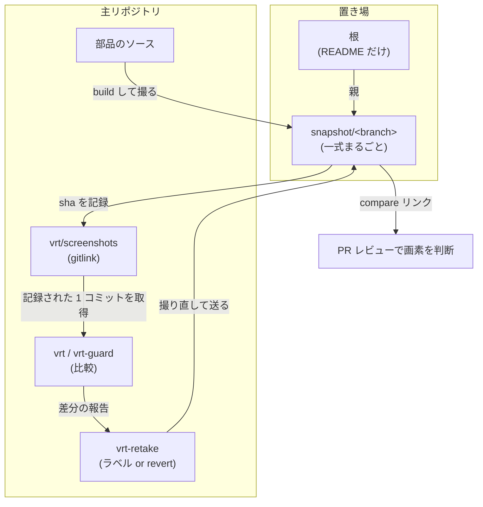

# VRT の機構

story 単位の visual regression が、どの部品でどう組み上がっているか。決定は
[ADR 0091](../adr/0091-test-verification-methods.md) §3、使い方は [`vrt/README.md`](../../vrt/README.md)、
初回の用意は [セットアップ手順](../get-started/setup-repository.md) §6 が正。ここは**全体の composition**
だけを持つ。

## 何と何を比べているか

比べているのは **build 済み Storybook の story** であって、デプロイされたアプリではない。
`pnpm build-storybook` の静的出力を手元のプロセスが配り、`/iframe.html?id=<story>&globals=theme:<theme>`
を固定した container の中で撮る。

したがって**基準画像はコミットの中身だけで決まる**。同じコミットなら誰がどこで撮っても同じ絵になる。

| 画像を決めるもの | 決めないもの |
| --- | --- |
| 部品のソース / design token / CSS | どの環境にデプロイされているか |
| Playwright の container image（digest 固定） | バックエンドのデータ |
| viewport / theme / timezone / locale | 実行時の環境変数 |

## 構成要素

| どこ | 何 |
| --- | --- |
| `vrt/stories.spec.ts` | story を列挙して 1 件ずつ撮る本体 |
| `vrt/lib/` | 目録の解釈・URL 組み立て・除外の宣言 |
| `vrt/screenshots` | **サブモジュール**。基準画像の置き場を指す gitlink |
| `playwright.config.ts` | 実行環境と比較条件（`maxDiffPixels: 0`） |
| `docker-compose.dev-tools.yml` | `vrt_runner`（digest と platform を固定） |
| `scripts/vrt/` | 実行結果 → 一覧表 / 撮り直す id |
| `scripts/vrt-images/` | 置き場の ref 名・送出・掃除の算出 |
| `.github/actions/setup-vrt-baselines` | CI が記録されたコミット 1 つだけを取る |
| 置き場（別リポジトリ） | `<系統>/<テーマ>/<story id>.png` を持つ `snapshot/*` ブランチ群 |

## 流れ

## 全体が乗っている不変条件

**撮影どうしを繋げない。** 各撮影コミットの親は常に置き場の根で、前回の撮影ではない。繋ぐと古い
一式が新しい一式の祖先になり、ref を消しても何も落ちなくなる。掃除が成立するのはこの一点による。

**gitlink は木の一部である。** ポインタはコードと同じようにマージで運ばれるので、同期する作業が
存在しない。`production` から切った hotfix は、コードもポインタも production の状態から始まるため、
触っていない画面は緑のまま始まる。

**判定する木と撮る木を一致させる。** 比較は base へマージした結果（`refs/pull/N/merge`）に対して
行うので、required status checks を `strict` にしてブランチが最新であることを要求する。base に遅れた
head では撮り直させない。

**撮り直しは承認ではない。** ラベルは画素を見られる形にするだけで、判断は置き場の compare ビューを
見た人が PR で行う。ruleset の `require_last_push_approval` が bot の push の後に人の承認を強制する。

**保持するのは生きた ref の先端が指す一式だけ。** 過去のコミットへ遡ると基準画像は揃わない。掃除は
ブランチを消すだけで、履歴は書き換えない。

## 限界

**本番を見ない。** 比較は story の描画で閉じているので、実行時の設定や feature flag で見た目が変わる
部品は、story が与えた props の姿しか撮られない。「本番でだけ崩れている」は検知できない。これは
赤くなる側ではなく**沈黙する側**の穴で、画面単位の比較（P6-4）でも MSW モードで回す以上は残る。

**大量の差分は人が見きれない。** design token を触ると全数が動く。件数を表の先頭に出す以上のことは
仕組みでは塞げない。

**並行して撮り直すとポインタが衝突する。** 2 本が同時に基準画像を動かすと、後からマージする側で
gitlink が衝突し、base を取り込んでからもう一度撮り直すことになる。`strict` が要求する手順に乗るので
新しい作業は増えないが、後発は撮り直しが 2 回になる。

**fork からの PR では撮り直せない。** secrets が渡らないため、置き場へ push できない。手元で
`make vrt-retake` を回してもらう。置き場が非公開なら、読み取りもできないので比較自体が落ちる。
