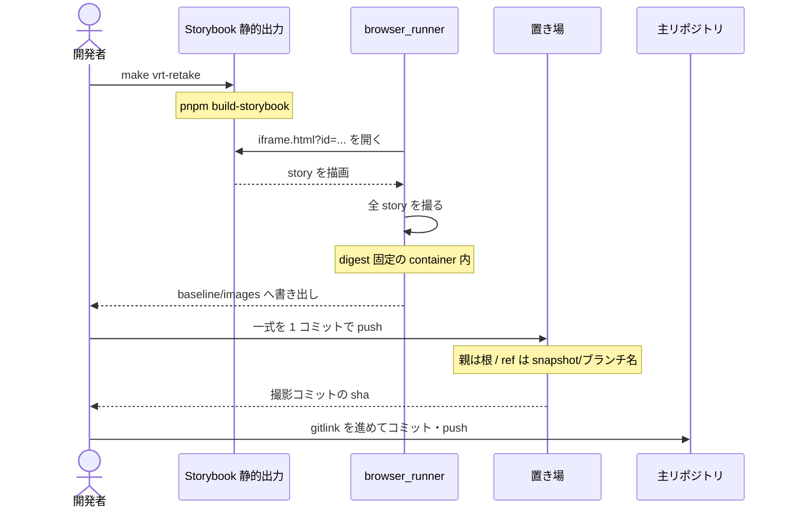
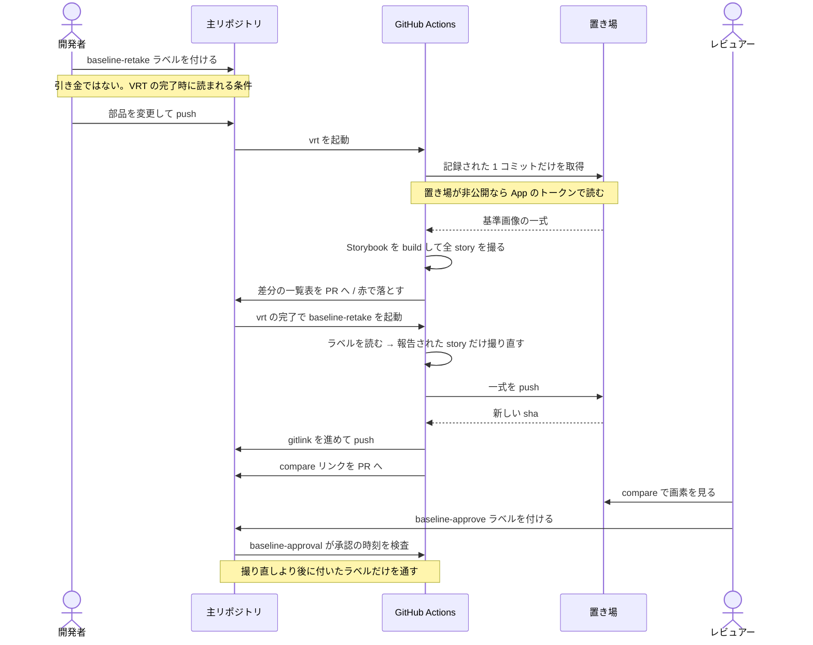

# VRT の機構

story 単位の visual regression が、どの部品でどう組み上がっているか。決定は
[ADR 0091](../adr/0091-test-verification-methods.md) §3、使い方は [`vrt/README.md`](../../vrt/README.md)、
初回の用意は [セットアップ手順](../get-started/setup-repository.md) §6 が正。ここは**全体の composition**
だけを持つ。

## 何と何を比べているか

比べているのは **build 済み Storybook の story** であって、デプロイされたアプリではない。
`pnpm build-storybook` の静的出力を手元のプロセスが配り、`/iframe.html?id=<story>&globals=theme:<theme>`
を固定した container の中で撮る。

したがって**基準画像はコミットの中身だけで決まる**。同じコミットなら誰がどこで撮っても同じ絵になる。

| 画像を決めるもの | 決めないもの |
| --- | --- |
| 部品のソース / design token / CSS | どの環境にデプロイされているか |
| Playwright の container image（digest 固定） | バックエンドのデータ |
| viewport / theme / timezone / locale | 実行時の環境変数 |

## 構成要素

| どこ | 何 |
| --- | --- |
| `vrt/stories.spec.ts` | story を列挙して 1 件ずつ撮る本体 |
| `vrt/lib/` | 目録の解釈・URL 組み立て・除外の宣言・撮る配色テーマ・置き場との対応 |
| `baseline/images` | **サブモジュール**。基準画像の置き場を指す gitlink。画面単位の撮影と共有し、あちらは `screen/` 区画に閉じる |
| `playwright.config.ts` | 実行環境と比較条件（`maxDiffPixels: 0`） |
| `docker-compose.dev-tools.yml` | `browser_runner`（digest と platform を固定） |
| `scripts/vrt/` | 実行結果 → 一覧表 / 撮り直す id、絵を決める入力 → ハッシュ |
| `scripts/e2e/` | 画面単位の実行結果 → 落ちた画面の名前 |
| `scripts/lib/playwright-report.ts` | 上の 2 つが共有する、JSON レポートのたどり方 |
| `scripts/review/` | 落ちた対象 → 使い捨ての作業ツリーと、そこで立てるサーバの URL |
| `scripts/baseline-store/` | 置き場の ref 名・送出・掃除の算出 |
| `.github/actions/setup-baselines` | CI が記録されたコミット 1 つだけを取る |
| 置き場（別リポジトリ） | `<系統>/<テーマ>/<story id>.png` と、撮った時点の入力のハッシュ（`render-inputs.sha256`）を持つ `snapshot/*` ブランチ群 |

## 流れ

### 手元から撮る

### CI が比較し、撮り直して承認へ渡す

## 全体が乗っている不変条件

**撮影どうしを繋げない。** 各撮影コミットの親は常に置き場の根で、前回の撮影ではない。繋ぐと古い
一式が新しい一式の祖先になり、ref を消しても何も落ちなくなる。掃除が成立するのはこの一点による。

**両種の基準画像はまとめて撮り直す。** story と画面は、置き場も container も送出も承認ラベルも 1 つを
共有している。撮り直しだけを 2 つに割ると、1 つのラベルで承認する範囲を 2 つのラベルで撮り直すことに
なる。範囲の取り方だけは別で、story は比較が報告したものに絞られ、画面は報告を持たないので常に全数を
撮る。

**gitlink は木の一部である。** ポインタはコードと同じようにマージで運ばれるので、同期する作業が
存在しない。`production` から切った hotfix は、コードもポインタも production の状態から始まるため、
触っていない画面は緑のまま始まる。

**判定する木と撮る木を一致させる。** 比較は base へマージした結果（`refs/pull/N/merge`）に対して
行うので、required status checks を `strict` にしてブランチが最新であることを要求する。base に遅れた
head では撮り直させない。

**壊れた木からは撮らない。** 撮り直しは人が見ていない時刻に走るので、その瞬間の絵がそのまま正に
なる。絵を決める入力が壊れたまま撮ると、壊れが基準画像へ焼き付く。判定に使うのは**絵を動かしうる
検査を名指しした一覧**で、落ちているもの全部ではない。全部を数えると、撮るまで存在しない画像の承認を
待つ `baseline-approval` が入り、承認は撮り直しを、撮り直しは承認を待つ。**見るのは各検査の最新の結果**
でもある。試行を合算すると、一度揺らいだ検査はその commit が生きているあいだ落ちたままになり、
再実行して緑にしても撮り直せない。

**撮り直しは承認ではない。** `baseline-retake` は画素を見られる形にするだけで、見た目を受け入れたことは
`baseline-approve` が表す。基準画像が動いている PR では `baseline-approval` がこれを必須にする。承認の単位を
PR のレビューではなくラベルに取るのは、判断の対象が PR 全体ではなく基準画像だからで、**1 人の
リポジトリでも成立する**という性質はその帰結にすぎない。

**承認は今の一式に対してだけ効く。** `baseline-approval` はラベルの有無に加えて、付いた時刻がポインタを
動かした最後のコミットより後であることを見る。保証を時刻の比較に置くのは、ラベルの削除が動かない
状況（fork の PR は token が read-only）でも古い承認を通さないためである。

**撮り直しは `baseline-approve` を外さない。** 外しても判定は変わらない — 古い承認は時刻の比較が拒む。
変わるのは雑音の側で、`baseline-approval` は `unlabeled` でも走るため、削除は「次の実行が報告する状態を
先に報告するだけの実行」を 1 つ起こし、付けた人には**自分の承認が誰かに取り消された**ように見える。
古くなった承認は付け直しで更新する（`labeled` の時刻が新しくなる）。

**`unlabeled` で走ること自体は残す。** 人が承認を取り消したとき、最後の緑がそのまま残るのを防ぐ。
撮り直しが削除しなくなった以上、この引き金を引くのは人だけである。

**ラベルは引き金ではなく条件であり、消費されるのは撮り直しが届いたときだけ。** 読まれるのは VRT の
完了時なので、人はいつ付けてもよく（PR 作成時を含む）、完了後に付けたぶんは次の実行まで効かない。
外れるのはポインタが進んだときだけで、見送りも拒否も失敗もラベルを残す。**残った 1 枚は次の実行で
そのまま使われる**ため、装填したまま放置すると意図しない変化まで撮り直す。この非対称は意図的で、
逆に倒すと「人が承認したのに撮り直されない」状態を作る。

**保持するのは生きた ref の先端が指す一式だけ。** 過去のコミットへ遡ると基準画像は揃わない。掃除は
ブランチを消すだけで、履歴は書き換えない。

**revert はラベル無しで撮り直す。** 掃除が保持するのは生きた ref の先端だけなので、戻り先の状態が
指していたコミットは既に落ちている。コードだけを戻すとポインタが宙に浮く。戻り先は一度承認された
状態なので、自動で撮り直しても承認の意味は弱まらない。範囲は全数になる。

## 限界

**本番を見ない。** 比較は story の描画で閉じているので、実行時の設定や feature flag で見た目が変わる
部品は、story が与えた props の姿しか撮られない。「本番でだけ崩れている」は検知できない。これは
赤くなる側ではなく**沈黙する側**の穴で、画面単位の比較（[e2e](../../e2e/README.md)）を足しても、
モックで回す以上は残る。

**大量の差分は人が見きれない。** design token を触ると全数が動く。件数を表の先頭に出す以上のことは
仕組みでは塞げない。

**全数が動いたとき、原因が 1 つとは限らない。** 外枠の寸法や design token を触ると全画面が同時に
落ちる。その形は「基準画像が古いだけ」と見分けがつかず、**混ざっている不具合ごと撮り直すと、それが
次の正になる**。件数も差分の割合も、原因が 1 つか 2 つかを区別しない。これは「壊れた木からは撮らない」
が塞ぐ穴とは別で、あちらは絵を動かしうる検査が赤い場合を見る。ここで問題になるのは**検査がすべて緑の
まま描画だけが誤っている**場合で、機構からは見えない。落ちた画面それぞれについて理由を言えるまで
撮り直さない、という規律だけが塞ぐ。

**サンプルの破棄（爆破）は全数を動かす。** 画面ごと消える基準画像と、残る画面の見た目の変化が同時に
起きる。上の判断が必ず 1 回要る場面であり、そこで撮り直しに頼ると、破棄が持ち込んだ崩れが最初の
基準画像になる。

**並行して撮り直すとポインタが衝突する。** 2 本が同時に基準画像を動かすと、後からマージする側で
gitlink が衝突し、base を取り込んでからもう一度撮り直すことになる。`strict` が要求する手順に乗るので
新しい作業は増えないが、後発は撮り直しが 2 回になる。

**fork からの PR では撮り直せない。** secrets が渡らないため、置き場へ push できない。手元で
`make vrt-retake` を回してもらう。置き場が非公開なら、読み取りもできないので比較自体が落ちる。
