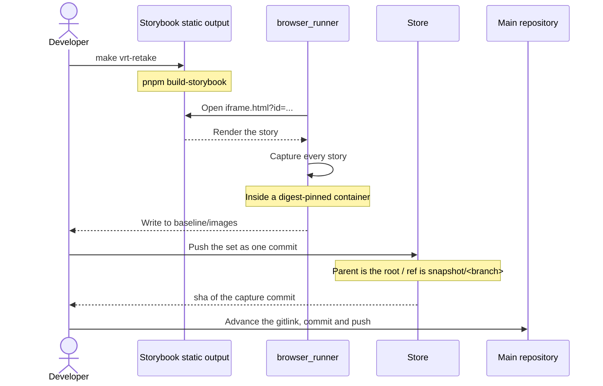
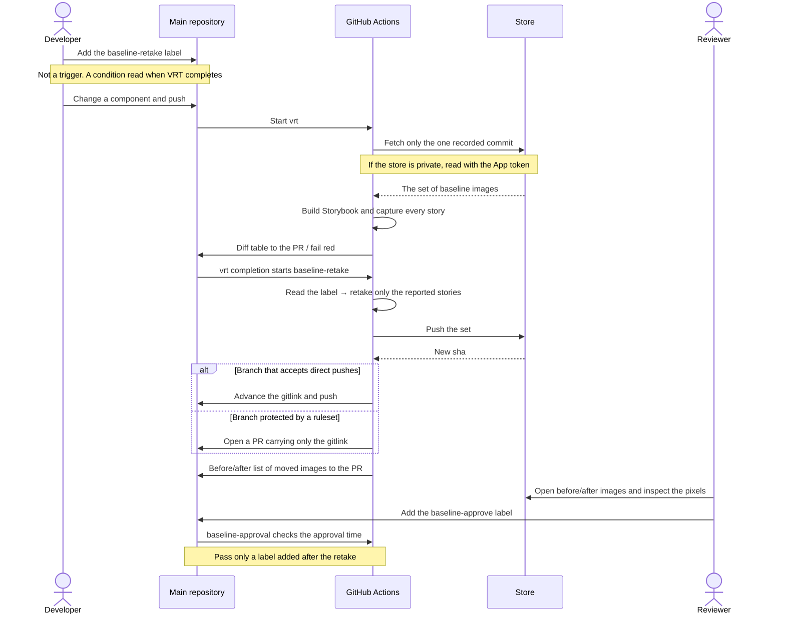

# How VRT Works

How story-level visual regression is assembled, and from which parts. The decision is owned by
[ADR 0091](../adr/0091-test-verification-methods.md), usage by [`vrt/README.md`](../../vrt/README.md), and
the first-time setup (the baseline image store, the GitHub App, the first capture) by the [setup procedure](../get-started/setup-repository.md). This document holds
**only the overall composition**.

## What Is Compared with What

What is compared is **the stories of a built Storybook**, not the deployed application.
A local process serves the static output of `pnpm build-storybook`, and `/iframe.html?id=<story>&globals=theme:<theme>`
is captured inside a pinned container.

So **baseline images are determined solely by the contents of the commit**. For the same commit, anyone capturing anywhere gets the same picture.

| What determines the image | What does not |
| --- | --- |
| Component source / design tokens / CSS | Which environment it is deployed to |
| The Playwright container image (digest pinned) | Backend data |
| viewport / theme / timezone / locale | Runtime environment variables |

## Components

| Where | What |
| --- | --- |
| `vrt/stories.spec.ts` | The core that enumerates stories and captures them one by one |
| `vrt/lib/` | Interpreting the inventory, building URLs, declaring exclusions, the color themes to capture, mapping to the store |
| `baseline/images` | **A submodule**. The gitlink pointing at the baseline image store. Shared with screen-level capture, which is confined to the `screen/` area |
| `playwright.config.ts` | Execution environment and comparison conditions (`maxDiffPixels: 0`) |
| `docker-compose.dev-tools.yml` | `browser_runner` (digest and platform pinned) |
| `scripts/vrt/` | Run results → summary table / ids to retake; inputs that determine the picture → hash |
| `scripts/e2e/` | Screen-level run results → names of the screens that failed |
| `scripts/lib/playwright-report.ts` | How to walk the JSON report, shared by the two above |
| `scripts/review/` | Failed targets → a throwaway worktree and the URL of the server started in it |
| `scripts/baseline-store/` | Computing the store's ref names, pushes and cleanup |
| `.github/actions/setup-baselines` | CI fetches only the one recorded commit |
| The store (a separate repository) | `snapshot/*` branches holding `<story group>/<theme>/<story id>.png` and the hash of the inputs at capture time (`render-inputs.sha256`) |

## Flow

### Capturing Locally

```mermaid
sequenceDiagram
    actor dev as Developer
    participant sb as Storybook static output
    participant runner as browser_runner
    participant store as Store
    participant main as Main repository

    dev->>sb: make vrt-retake
    Note over sb: pnpm build-storybook
    runner->>sb: Open iframe.html?id=...
    sb-->>runner: Render the story
    runner->>runner: Capture every story
    Note over runner: Inside a digest-pinned container
    runner-->>dev: Write to baseline/images
    dev->>store: Push the set as one commit
    Note over store: Parent is the root / ref is snapshot/<branch>
    store-->>dev: sha of the capture commit
    dev->>main: Advance the gitlink, commit and push
```

### CI Compares, Retakes, and Hands Off to Approval

```mermaid
sequenceDiagram
    actor dev as Developer
    participant main as Main repository
    participant gha as GitHub Actions
    participant store as Store
    actor rev as Reviewer

    dev->>main: Add the baseline-retake label
    Note over dev,main: Not a trigger. A condition read when VRT completes

    dev->>main: Change a component and push
    main->>gha: Start vrt
    gha->>store: Fetch only the one recorded commit
    Note over gha,store: If the store is private, read with the App token
    store-->>gha: The set of baseline images
    gha->>gha: Build Storybook and capture every story
    gha->>main: Diff table to the PR / fail red

    main->>gha: vrt completion starts baseline-retake
    gha->>gha: Read the label → retake only the reported stories
    gha->>store: Push the set
    store-->>gha: New sha
    alt Branch that accepts direct pushes
        gha->>main: Advance the gitlink and push
    else Branch protected by a ruleset
        gha->>main: Open a PR carrying only the gitlink
    end
    gha->>main: Before/after list of moved images to the PR

    rev->>store: Open before/after images and inspect the pixels
    rev->>main: Add the baseline-approve label
    main->>gha: baseline-approval checks the approval time
    Note over main,gha: Pass only a label added after the retake
```

## Invariants the Whole Rests On

**Captures are never chained.** The parent of every capture commit is always the store's root, never the previous capture. Chaining would make an old
set an ancestor of a new set, and deleting a ref would drop nothing. Cleanup works because of this one point.

**Both kinds of baseline image are retaken together.** Stories and screens share one store, one container, one push and one approval label.
Splitting only the retake in two would mean retaking with two labels the range that one label approves.
**In both cases the range is narrowed to the comparison report for that commit** — the VRT report for stories, the E2E
report for screens. This keeps pixels that are not in a report out of the store, and it is the condition under which the picture the approver saw and the picture that enters the store
match.

**That is why "no report" needs handling.** Screen comparison does not run on PRs by default, so the absence of a report can mean either
"there is no diff" or "**it was not compared**". The former simply means nothing to retake, but in the latter a PR
in which only stories were retaken looks complete, and the screen baselines go into the release stale. **Since the two cannot be told
apart, the retake names the latter in a comment** — it is a place where a machine cannot make the judgment, so the material for the judgment
is handed to a person.

**The gitlink is part of the tree.** The pointer is carried by merges just like code, so there is no
synchronization work. A hotfix cut from `production` starts with both code and pointer in production's state,
so screens it did not touch start green.

**The pointer enters through the path by which that branch receives changes.** It is pushed to branches that accept direct pushes, and for branches whose
ruleset requires a PR, one PR carrying only the gitlink is opened per target and updated. How the path is
chosen, and the decision not to loosen protection, are owned by [ADR 0091](../adr/0091-test-verification-methods.md). The one mechanism
that matters here — **the path is decided by querying the ruleset itself.** Holding a copy of the patterns would let the protection
declaration and the retake's premise move separately.

**The tree that is judged and the tree that is captured are made identical.** Comparison runs against the result of merging into the base (`refs/pull/N/merge`),
so required status checks are set to `strict` to require the branch to be up to date. A head that has fallen behind the base
is not allowed to retake.

**Nothing is captured from a broken tree.** Retakes run at times no one is watching, so the picture at that moment becomes the truth
as is. Capturing while the inputs that determine the picture are broken burns the breakage into the baseline images. The judgment uses **a list that names the checks
that can move the picture**, not everything that is failing. Counting everything would include `baseline-approval`, which waits for approval of images that do not exist until captured,
and approval would wait for the retake while the retake waits for approval. **What is looked at is also each check's latest result.**
Summing attempts would leave a check that flaked once failing for as long as that commit lives,
and even rerunning it to green would not allow a retake.

**A retake is not an approval.** `baseline-retake` only makes the pixels viewable; acceptance of the look is
expressed by `baseline-approve`. On PRs where baseline images move, `baseline-approval` makes this required. The unit of approval is taken
as a label rather than a PR review because the subject of the judgment is the baseline images, not the whole PR; the property that **it works even in a single-person
repository** is merely a consequence of that.

**Approval applies only to the current set.** Besides whether the label is present, `baseline-approval` checks that the time it was attached is after the last commit that
moved the pointer. The guarantee rests on a time comparison so that stale approvals do not pass even where removing a label does not work
(on fork PRs the token is read-only).

**One approval per set of pixels is enough.** The label is searched for not only on the current PR but also on **the PR that brought in
that pointer commit**. For a pointer that came in through a PR, the surface where a person views and accepts the pixels is on that PR's side,
and making someone approve the same set again wherever it is carried afterwards adds no invariant. What is checked is
"whether a person saw these pixels", not which PR they saw them on. The PR that brought it in is looked up from the pointer commit,
so it does not depend on how the retake names its branch.

**A retake does not remove `baseline-approve`.** Removing it would not change the verdict — the time comparison rejects stale approvals.
What changes is the noise: `baseline-approval` also runs on `unlabeled`, so removal triggers one "run that merely reports early the state the next run will
report", and to the person who attached it, it looks as if **someone revoked their approval**.
A stale approval is renewed by reattaching it (the `labeled` time becomes newer).

**Running on `unlabeled` itself is kept.** When a person revokes an approval, it prevents the last green from simply remaining.
Since the retake no longer removes the label, only a person pulls this trigger.

**The label is a condition, not a trigger, and it is consumed only when the retake lands.** It is read when VRT
completes, so a person may attach it at any time (including at PR creation), and one attached after completion does not take effect until the next run.
It comes off only when the pointer is placed; skipping, rejection and failure all leave the label. When going through a PR, it is removed as soon as the PR is
proposed, even before it has advanced — what the label buys is the retake itself, and that has already happened.
Leaving it on would retake on every subsequent comparison and rebuild the PR under review from beneath it. **A label left on is used as is
on the next run**, so leaving it loaded retakes even unintended changes. This asymmetry is deliberate;
tipping it the other way would create the state "a person approved but it is not retaken".

**Only the set pointed to by the tip of a live ref is retained.** Going back to past commits, the baseline images are not all there. Cleanup only
deletes branches and does not rewrite history.

**A revert retakes without a label.** Cleanup retains only the tips of live refs, so the commit that the restored state
pointed to has already been dropped. Reverting only the code leaves the pointer dangling. The restored state is one that was approved once,
so retaking automatically does not weaken what approval means. The range is all of them.

## Limitations

**It does not look at production.** Comparison is closed within story rendering, so components whose look changes with runtime settings or feature flags
are captured only in the form of the props the story gave them. "It breaks only in production" cannot be detected. This is
a hole on the **silent side** rather than the side that turns red, and it remains even with screen-level comparison ([e2e](../../e2e/README.md)) added,
as long as it runs on mocks.

**It has no mouse pointer.** A surface that appears only on hover is never
captured unless the story's play advances as far as focus. A surface that is not captured stays silent when it breaks.

**People cannot review a huge diff.** Touching a design token moves everything. Beyond putting the count at the top of the table,
the mechanism cannot close this.

**When everything moves, there need not be only one cause.** Touching the outer frame's dimensions or a design token makes every screen fail at
once. That shape is indistinguishable from "the baseline images are merely stale", and **retaking along with whatever defect is mixed in makes that defect
the next truth**. Neither the count nor the diff ratio distinguishes one cause from two. This is a different hole from the one that "nothing is captured from a broken tree"
closes; that one covers the case where a check that can move the picture is red. The problem here is the case where **every check stays green
and only the rendering is wrong**, which the mechanism cannot see. Only the discipline of not retaking until you can state a reason for each failed screen
closes it.

**A change that removes a group of screens at once moves everything.** Baseline images that disappear with their screens and changes in the look of the remaining screens happen at
the same time. This is a situation where the judgment above is always needed once, and relying on a retake there makes the breakage the removal brought in the
baseline images from then on.

**Retaking in parallel makes pointers collide.** When two branches move baseline images at the same time, the one merged later gets a
gitlink conflict, and has to take in the base and retake once more. It follows the procedure `strict` requires, so
there is no new work, but the later one retakes twice.

**PRs from forks cannot retake.** Secrets are not passed, so they cannot push to the store. Have the contributor run
`make vrt-retake` locally. If the store is private, it cannot even be read, so the comparison itself fails.
