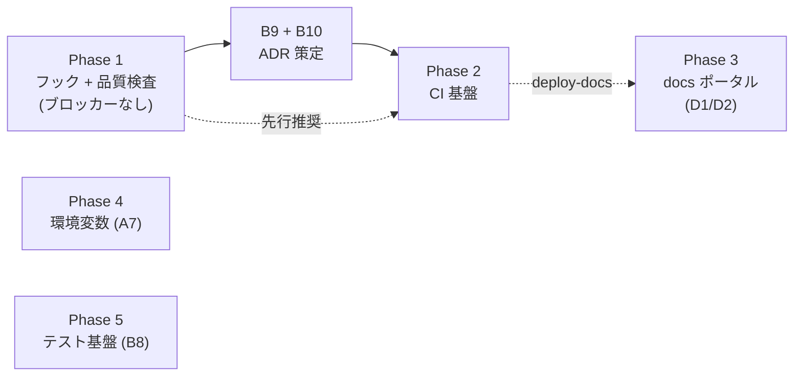

# go-boilerplate 機能移植 作業計画書

[docs/go-boilerplate-feature-port-candidates.md](../go-boilerplate-feature-port-candidates.md)(移植候補インベントリ)を実行可能な作業計画に落とし込んだもの。インベントリが「何を移植するか」を定義し、本書は「どの順で・どの単位で・何をもって完了とするか」を定義する。

- 作成日: 2026-07-11
- 対象: インベントリの Tier A〜E(Tier = 着手可能性の段階。本書の Phase と 1:1 対応)
- 進捗管理: 各 Phase 完了時に [docs/adr/BACKLOG.md](../adr/BACKLOG.md) の該当枠(選定済み / 実装済み)を更新する

## 全体方針

1. **1 Phase = 1 つ以上の PR、1 PR = 1 機能群**。巨大 PR を作らない。各 PR は単独でマージ可能な状態(検証込み)で閉じる
2. **保護対象パスは都度ユーザ指示**。ルート設定ファイル(`package.json` / `mise.toml` / `Makefile` / `.lefthook.yaml` 等)・`.github/`・`.claude/` に触れる作業は、着手前にユーザへ変更内容を提示して承認を得る(AGENTS.md「AI Modification Scope」)
3. **ADR が必要な Phase は「ADR 策定 → Accepted → 実装」の順を厳守**。保留領域に独自規約を先行して持ち込まない
4. **ツール追加は Toolchain-0005 に従う**: コア dev ツールは exact pin(`pnpm add -D -E`)、追加時に `pnpm audit` 実施、メジャー更新は別 PR
5. コミットは Dev-0002 の prefix 規約(`Build:` / `CI:` / `Docs:` / `Chore:` 中心)。作業は `/commit` / `/submit-pr` スキル経由で行う

## 依存関係マップ

Phase 1 は今すぐ着手可能。Phase 2 は B9/B10 の ADR 策定が前提。Phase 3〜5 は各 ADR(D1/D2・A7・B8)の決定順に独立して着手でき、相互依存は薄い(Phase 3 の Pages 配信のみ Phase 2 の workflows 導入後)。

---

## Phase 1: フック + 品質検査基盤(Tier A)

**ゴール**: lefthook(G2 実装ギャップ)を核に、コミット規約・ドキュメント品質・シークレット / 脆弱性のローカル検査を閉じる。ADR ブロッカーなし。

### PR 1-1: lefthook + commitlint(インベントリ A-1, A-2)

| 項目 | 内容 |
| --- | --- |
| 作業 | ① `pnpm add -D -E lefthook @commitlint/cli`(+ `pnpm audit`)② `.lefthook.yaml` 新規作成(pre-commit: `pnpm lint` の glob スコープ実行 / commit-msg: commitlint)③ `commitlint.config.js` を go 側からコピー(prefix 11 種は Dev-0002 と同一のため無翻案)④ `.makefiles/tools/setup.mk` に `activate-tools`(`pnpm exec lefthook install`)を追加 ⑤ `.makefiles/github/commitlint.mk` を移植(docker ラッパ除去、直接実行) |
| 触る保護対象 | `package.json` / `.lefthook.yaml`(新規)/ `commitlint.config.js`(新規)/ `Makefile`(include 追加)/ `.makefiles/` |
| 完了条件 | 不正 prefix のコミットが commit-msg で拒否される / biome 違反ファイルのコミットが pre-commit で拒否される / `make help` に新ターゲットが説明付きで出る |
| 検証 | わざと失敗するコミットを作って拒否を確認 → 正しいコミットが通ることを確認。`pnpm lint` / `pnpm build` 成功 |
| BACKLOG 反映 | **G2 を ✅/✅ に更新**。repo-ops スキルの「lefthook 未導入」記述の更新をユーザに提案 |

決定ポイント(着手時にユーザ確認): commitlint の管理を devDependency(exact pin)にするか mise `npm:` バックエンドにするか。**推奨: devDependency**(lefthook と同居、Toolchain-0006 の記述とも整合)。

### PR 1-2: markdownlint + mermaid lint(A-3, A-4)

| 項目 | 内容 |
| --- | --- |
| 作業 | ① `pnpm add -D -E markdownlint-cli2` と mermaid / linkedom(mermaid-lint 用)② `.markdownlint.yaml` を go 側から移植(ルール取捨選択)③ `scripts/mermaid-lint.mjs` を移植(除外リストを本リポ向けに変更: `node_modules` / `.git` / `AGENTS.md`。`vendor` / `docs/portal/guides` 等は現状不要)④ `.makefiles/markdown/lint.mk` を移植(`md-lint` / `md-fix` / `md-mermaid-lint`、docker ラッパ除去。`MD_GLOBS` の `\#` エスケープ知見を維持)⑤ `.lefthook.yaml` の pre-commit に `md-lint` を glob(`*.md`)付きで追加 |
| 触る保護対象 | `package.json` / `Makefile` / `.makefiles/` / `.lefthook.yaml` / `.markdownlint.yaml`(新規) |
| 完了条件 | `make md-lint` が既存 md 全件で成功(初回は指摘の一括修正コミットを分離)/ 壊れた mermaid フェンスで exit 1、依存欠落で exit 2 になる |
| 検証 | 既存 `docs/adr/BACKLOG.md` の mermaid 図がパースを通ること。故意に壊した図で fail を確認 |

注意: biome は Markdown 対象外(コミット `df1254c`)のため markdownlint と競合しない。初回 lint で既存 md に大量指摘が出る場合、ルール緩和か一括 `md-fix` かをユーザに確認する。

### PR 1-3: セキュリティスキャン(A-5, A-6)

| 項目 | 内容 |
| --- | --- |
| 作業 | ① `mise.toml` に gitleaks / trivy を追加(`aqua:` バックエンド。バージョンは `tools-upgrade` スキルの検疫基準で選定)② `.gitleaks.toml` を移植(allowlist は本リポ向けに最小化)③ `.makefiles/security/` を移植(`secret-scan`: `gitleaks dir . --no-banner --redact` / `trivy-fs`: `--skip-dirs node_modules` に読み替え)④ `.lefthook.yaml` の pre-push に `secret-scan` を追加 |
| 触る保護対象 | `mise.toml` / `Makefile` / `.makefiles/` / `.lefthook.yaml` / `.gitleaks.toml`(新規) |
| 完了条件 | `make secret-scan` / `make trivy-fs` が成功 / ダミーシークレットを置いた push が pre-push で拒否される |
| 検証 | テスト用シークレット文字列で検出 → `--redact` により値がログに出ないことを確認 |
| BACKLOG 反映 | B10 は「CI 組込み・閾値 SLA」が未決のため枠は動かさない(ローカル検査の先行導入である旨を BACKLOG の de facto 状態に追記) |

### PR 1-4: 開発体験の小物(A-7〜A-10)

| 項目 | 内容 |
| --- | --- |
| 作業 | ① actionlint を `mise.toml` + `.makefiles/github/lint.mk` に先行移植(workflows 不在でも空振りするだけ。B9 の受け皿)② `make_help` の未文書化 `.PHONY` 警告を既存 `scripts/make_help.sh` に追補(または `.mjs` 版へ置換)③ `scripts/setup/` に `replace-repository-reference` と `package.json` name 書換(go module rename の翻案)を追加。共有 lib(`--dry-run` / `updateFile`)は既存 `scripts/setup/lib/` に統合 |
| 触る保護対象 | `mise.toml` / `Makefile` / `.makefiles/` / `scripts/` |
| 完了条件 | `make help` が全ターゲットを説明付きで列挙し、説明欠落に警告を出す / setup スクリプトが `--dry-run` で変更予定を表示する |

**Phase 1 完了の定義**: PR 1-1〜1-4 マージ済み + BACKLOG G2 更新 + 「速い hook(ローカル)↔ 権威 CI」二重化構造の hook 側が完成している。

---

## Phase 2: CI 基盤(Tier B — B9 / B10 ADR 策定が前提)

**ゴール**: `.github/workflows/` を初導入し、PR ゲート + セキュリティスキャン + 供給網防御を CI 側に立てる。

### Step 2-0: ADR 策定(実装前の必須ゲート)

- **B9(CI 構成方針)**: job 分割(lint+typecheck / build / 将来 test)、required check、pnpm store + Next.js build cache 戦略、hook との二重化境界、workflow 衛生規約(SHA ピン / concurrency / 最小 permissions / ログの PR コメント化)を決める。インベントリ Tier B の B-1〜B-4 が設計材料
- **B10(セキュリティ運用)**: `pnpm audit` / trivy の閾値と SLA、Dependabot 採用(npm + github-actions、cooldown 段階制 patch 5 日 / minor 7 日 / major 30 日)、SECURITY.md、gitleaks の CI 組込みを決める
- 成果物: `docs/adr/` に ADR 2 本(ドラフトは AI が作成可、**Accepted 判断はユーザ**)。ADR ファイル新規作成は事前のユーザ指示が必要

### PR 2-1: CI 骨格 + 基本ゲート

- `upsert-pr-comment` composite action を as-is 移植(全 workflow のレポーティング基盤。最初に入れる)
- lint + typecheck workflow(`pnpm lint` + `tsc --noEmit`)/ build workflow(`pnpm build`)/ lockfile drift(`pnpm install --frozen-lockfile`)
- 起動スモーク(`pnpm build` → `next start` → `curl /` ポーリング、`timeout-minutes` 付き)
- 全 workflow に B9 で決めた衛生規約を適用。`.github/workflows/README.md`(トリガー戦略表)を同梱

### PR 2-2: セキュリティ CI(B10 実装)

- CodeQL(`languages: javascript-typescript`、PR + push baseline + 週次 cron `0 0 * * 1`)
- gitleaks workflow(全 PR)/ trivy-fs 二段(dev PR = fixable のみ・非ブロック / release 向け PR = unfixed 含む全量レポート)
- `dependabot.yml`(npm + github-actions、cooldown 段階制、ecosystem 単位グループ PR)
- `SECURITY.md`(報告窓口・SLA。go 側前半のみ、検証 runbook は対象外)

### PR 2-3: Actions SHA ピン留め(BACKLOG C-6 と統合)

- go 側 `scripts/pin-actions/`(Go)を **TS 書換**: `resolve` / `apply` / `check` 3 サブコマンド、lockfile `.github/actions-pin.toml`、検疫 `--min-age-days`(既定 14)
- `pin-actions-check` workflow + `make pin-actions-*` ターゲット + `.claude/skills/actions-pin` スキル(C-6)を同時に導入
- PR 2-1 / 2-2 の workflow は本 PR で全 `uses:` を SHA ピンに揃える(2-1 時点では暫定タグ参照を許容)

**Phase 2 完了の定義**: B9 / B10 が Accepted + required check が branch ruleset に反映 + BACKLOG B9 / B10 / C-6 更新 + AGENTS.md の該当 `[TODO]` セクション削除(ユーザ承認のもと)。

---

## Phase 3: docs ポータル(Tier C — D1 / D2 決定が前提)

**ゴール**: docs を GitHub Pages で閲覧可能な portal として配信し、EN/JA ペア運用を規約化する。

1. **Step 3-0**: D1(canonical EN / JA ペア運用)・D2(portal 登録基準と責務分担)の ADR 策定
2. **PR 3-1**: portal 基盤移植 — `docs/portal/manifest.yaml` + `scripts/{gen-portal-docs,gen-docs-json,build-portal}.mjs` + React SPA。Go 結合ゼロのため翻案は manifest 中身 / タイトル / EN・JA パス規約 / 除外リストのみ。deps(js-yaml / zod / esbuild / marked / fuse.js / highlight.js / react)は pnpm devDependencies に配置(Toolchain-0005 準拠)
3. **PR 3-2**: `deploy-docs` workflow(Pages 配信。Phase 2 完了後)+ BACKLOG「対象外(D)」の `portal-manifest-sync` スキル復活(C-4 の SECURITY.md 掲載などと合わせ、`readme-review` → manifest 登録の運用ループを閉じる)
4. 任意: ADR タクソノミー(decision / exclusion / rule / inventory)の部分採用を D1 と同時に検討(採番は本リポの系列プレフィックス方式を維持)

**完了の定義**: portal が Pages で閲覧可能 + manifest 経由の登録フローがスキルで回る + BACKLOG D1 / D2 更新。

## Phase 4: 環境変数・型付き Config(Tier D — A7 決定が前提)

1. **Step 4-0**: A7 ADR 策定 — `env/.env.{local,ci,dev,stg,prd}` レイアウト vs Next.js 標準 `.env.local` 系、`NEXT_PUBLIC_` 境界、シークレットの PaaS ストアマッピング。go 側の envspec / model / config 三点セットと `env/README.md` 変数表が参照設計
2. **PR 4-1**: zod ベースの型付き Config loader(`parse → validate → freeze` の factory、server / client 分離)+ `env/` レイアウト + 変数表 README
3. **PR 4-2**: `new-env` スキル再設計(Dev-0005 記載の既知課題。go 由来パス前提を A7 決定後の実パスに差し替え)— `.claude/` 変更のためユーザ指示必須

## Phase 5: テスト基盤(Tier E — B8 決定が前提)

1. **Step 5-0**: B8 ADR 策定(フレームワーク / 配置・命名 / カバレッジ目標 / Server Components の扱い)
2. **PR 5-1**: フレームワーク導入 + `make test` / `test-cached`(CI = 厳格・キャッシュ無効 / pre-commit = 高速・キャッシュ有効の二層)+ lefthook 接続
3. **PR 5-2**: カバレッジゲート(`cover-gate` 閾値 + octocov 相当の PR レポート)を CI に追加(B9 の枠組みに載せる)
4. 連動: BACKLOG C-5(テスト scaffold スキル)、full-apply / node-upgrade / repo-ops スキルの `pnpm test` 条件分岐見直し

---

## マイルストーン一覧

| Phase | 前提 ADR | PR 数目安 | 主な成果物 | BACKLOG 反映 |
| --- | --- | --- | --- | --- |
| 1 | なし(G2 は Accepted 済) | 4 | lefthook / commitlint / md+mermaid lint / gitleaks / trivy / setup 拡充 | G2 → ✅/✅ |
| 2 | B9・B10(要策定) | 3 | workflows 初導入 / upsert-pr-comment / CodeQL / dependabot / actions-pin(TS) | B9・B10 → ✅/✅、C-6 消化 |
| 3 | D1・D2(要策定) | 2 | docs portal + Pages 配信 + manifest 運用スキル | D1・D2 → ✅/✅ |
| 4 | A7(要策定) | 2 | env/ レイアウト + zod Config + new-env 再設計 | A7 → ✅/✅ |
| 5 | B8(要策定) | 2 | テストフレームワーク + カバレッジゲート | B8 → ✅/✅、C-5 消化 |

## リスクと注意点

- **既存 md への初回 lint 指摘量**(PR 1-2): 想定より多い場合はルール調整の判断をユーザに仰ぐ。`md-fix` の一括変更は独立コミット(`Style:`)に分離
- **ツールのバージョン選定**: gitleaks / trivy / actionlint は `tools-upgrade` スキルの検疫方針(min_age_days)に従い、最新すぎる版を避ける
- **lefthook 導入直後の摩擦**: pre-push の secret-scan / (将来) test が遅い場合は glob スコープと並列化で調整。フック無効化での回避(`--no-verify` 常用)を常態化させない — ただし `/commit` スキルの設計上のバイパスは除く
- **AGENTS.md の `[TODO]` セクションとの整合**: 各 Phase 完了時に該当セクションの「暫定挙動」記述が実態と乖離しないか確認し、乖離があれば AGENTS.md 更新をユーザに提案する(AGENTS.md は保護対象のため直接編集しない)
- **go 側との二重管理**: 移植後に go-boilerplate 側が改善された場合の追従は自動化しない。必要になった時点で本インベントリを再走査する(one-off 方針)
