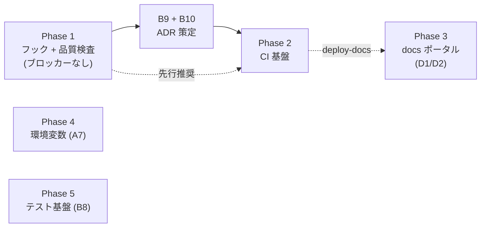

# go-boilerplate 機能移植 作業計画書

[docs/plan/go-boilerplate-feature-port-candidates.md](go-boilerplate-feature-port-candidates.md)(移植候補インベントリ)を実行可能な作業計画に落とし込んだもの。インベントリが「何を移植するか」を定義し、本書は「どの順で・どの単位で・何をもって完了とするか」を定義する。

- 作成日: 2026-07-11
- 対象: インベントリの Tier A〜E(Tier = 着手可能性の段階。本書の Phase と 1:1 対応)
- 進捗管理: 各 Phase 完了時に [docs/adr/BACKLOG.md](../adr/BACKLOG.md) の該当枠(選定済み / 実装済み)を更新する

## 全体方針

1. **1 Phase = 1 つ以上の PR、1 PR = 1 機能群**。巨大 PR を作らない。各 PR は単独でマージ可能な状態(検証込み)で閉じる
2. **保護対象パスは都度ユーザ指示**。ルート設定ファイル(`package.json` / `mise.toml` / `Makefile` / `.lefthook.yaml` 等)・`.github/`・`.claude/` に触れる作業は、着手前にユーザへ変更内容を提示して承認を得る(AGENTS.md「AI Modification Scope」)
3. **ADR が必要な Phase は「ADR 策定 → Accepted → 実装」の順を厳守**。保留領域に独自規約を先行して持ち込まない
4. **ツール追加は 0004 に従う**: コア dev ツールは exact pin(`pnpm add -D -E`)、追加時に `pnpm audit` 実施、メジャー更新は別 PR
5. コミットは 0150 の prefix 規約(`Build:` / `CI:` / `Docs:` / `Chore:` 中心)。作業は `/commit` / `/submit-pr` スキル経由で行う

## 依存関係マップ

Phase 1 は今すぐ着手可能。Phase 2 は B9/B10 の ADR 策定が前提。Phase 3〜5 は各 ADR(D1/D2・A7・B8)の決定順に独立して着手でき、相互依存は薄い(Phase 3 の Pages 配信のみ Phase 2 の workflows 導入後)。

---

## Phase 1: フック + 品質検査基盤(Tier A)

**ゴール**: lefthook(G2 実装ギャップ)を核に、コミット規約・ドキュメント品質・シークレット / 脆弱性のローカル検査を閉じる。ADR ブロッカーなし。

### PR 1-1: lefthook + commitlint(インベントリ A-1, A-2)

> **2026-07-12 更新**: A-1(lefthook)は別ルートで**導入済み**(`.lefthook.yaml` + lefthook 2.1.10 exact pin、pre-commit = `pnpm lint:ci`(biome 完全版・glob スコープではなく全体走査)/ pre-push = `pnpm typecheck`。BACKLOG **G2 は ✅/✅ 反映済み**、0151 も現行値に改定済み)。本 PR の残スコープは **commitlint 系のみ**(下表 ①の `@commitlint/cli` / ③ / ⑤ + ④ `activate-tools`)。lefthook 接続は既存 `.lefthook.yaml` への commit-msg 追加となる。

| 項目 | 内容 |
| --- | --- |
| 作業 | ① `pnpm add -D -E lefthook @commitlint/cli`(+ `pnpm audit`)② `.lefthook.yaml` 新規作成(pre-commit: `pnpm lint` の glob スコープ実行 / commit-msg: commitlint)③ `commitlint.config.js` を go 側からコピー(prefix 11 種は 0150 と同一のため無翻案)④ `.makefiles/tools/setup.mk` に `activate-tools`(`pnpm exec lefthook install`)を追加 ⑤ `.makefiles/github/commitlint.mk` を移植(docker ラッパ除去、直接実行) |
| 触る保護対象 | `package.json` / `.lefthook.yaml`(新規)/ `commitlint.config.js`(新規)/ `Makefile`(include 追加)/ `.makefiles/` |
| 完了条件 | 不正 prefix のコミットが commit-msg で拒否される / biome 違反ファイルのコミットが pre-commit で拒否される / `make help` に新ターゲットが説明付きで出る |
| 検証 | わざと失敗するコミットを作って拒否を確認 → 正しいコミットが通ることを確認。`pnpm lint` / `pnpm build` 成功 |
| BACKLOG 反映 | **G2 を ✅/✅ に更新**。repo-ops スキルの「lefthook 未導入」記述の更新をユーザに提案 |

決定ポイント(着手時にユーザ確認): commitlint の管理を devDependency(exact pin)にするか mise `npm:` バックエンドにするか。**推奨: devDependency**(lefthook と同居、0151 の記述とも整合)。

### PR 1-2: markdownlint + mermaid lint(A-3, A-4)

| 項目 | 内容 |
| --- | --- |
| 作業 | ① `pnpm add -D -E markdownlint-cli2` と mermaid / linkedom(mermaid-lint 用)② `.markdownlint.yaml` を go 側から移植(ルール取捨選択)③ `scripts/mermaid-lint.mjs` を移植(除外リストを本リポ向けに変更: `node_modules` / `.git` / `AGENTS.md`。`vendor` / `docs/portal/guides` 等は現状不要)④ `.makefiles/markdown/lint.mk` を移植(`md-lint` / `md-fix` / `md-mermaid-lint`、docker ラッパ除去。`MD_GLOBS` の `\#` エスケープ知見を維持)⑤ `.lefthook.yaml` の pre-commit に `md-lint` を glob(`*.md`)付きで追加 |
| 触る保護対象 | `package.json` / `Makefile` / `.makefiles/` / `.lefthook.yaml` / `.markdownlint.yaml`(新規) |
| 完了条件 | `make md-lint` が既存 md 全件で成功(初回は指摘の一括修正コミットを分離)/ 壊れた mermaid フェンスで exit 1、依存欠落で exit 2 になる |
| 検証 | 既存 `docs/adr/BACKLOG.md` の mermaid 図がパースを通ること。故意に壊した図で fail を確認 |

注意: biome は Markdown 対象外(コミット `df1254c`)のため markdownlint と競合しない。初回 lint で既存 md に大量指摘が出る場合、ルール緩和か一括 `md-fix` かをユーザに確認する。

### PR 1-3: セキュリティスキャン(A-5, A-6)

| 項目 | 内容 |
| --- | --- |
| 作業 | ① `mise.toml` に gitleaks / trivy を追加(`aqua:` バックエンド。バージョンは `tools-upgrade` スキルの検疫基準で選定)② `.gitleaks.toml` を移植(allowlist は本リポ向けに最小化)③ `.makefiles/security/` を移植(`secret-scan`: `gitleaks dir . --no-banner --redact` / `trivy-fs`: `--skip-dirs node_modules` に読み替え)④ `.lefthook.yaml` の pre-push に `secret-scan` を追加 |
| 触る保護対象 | `mise.toml` / `Makefile` / `.makefiles/` / `.lefthook.yaml` / `.gitleaks.toml`(新規) |
| 完了条件 | `make secret-scan` / `make trivy-fs` が成功 / ダミーシークレットを置いた push が pre-push で拒否される |
| 検証 | テスト用シークレット文字列で検出 → `--redact` により値がログに出ないことを確認 |
| BACKLOG 反映 | B10 は「CI 組込み・閾値 SLA」が未決のため枠は動かさない(ローカル検査の先行導入である旨を BACKLOG の de facto 状態に追記) |

### PR 1-4: 開発体験の小物(A-7〜A-10)

| 項目 | 内容 |
| --- | --- |
| 作業 | ① actionlint を `mise.toml` + `.makefiles/github/lint.mk` に先行移植(workflows 不在でも空振りするだけ。B9 の受け皿)② `make_help` の未文書化 `.PHONY` 警告を既存 `scripts/make_help.sh` に追補(または `.mjs` 版へ置換)③ `scripts/setup/` に `replace-repository-reference` と `package.json` name 書換(go module rename の翻案)を追加。共有 lib(`--dry-run` / `updateFile`)は既存 `scripts/setup/lib/` に統合 |
| 触る保護対象 | `mise.toml` / `Makefile` / `.makefiles/` / `scripts/` |
| 完了条件 | `make help` が全ターゲットを説明付きで列挙し、説明欠落に警告を出す / setup スクリプトが `--dry-run` で変更予定を表示する |

**Phase 1 完了の定義**: PR 1-1〜1-4 マージ済み + BACKLOG G2 更新 + 「速い hook(ローカル)↔ 権威 CI」二重化構造の hook 側が完成している。

---

## Phase 2: CI 基盤(Tier B — B9 / B10 ADR 策定が前提)

**ゴール**: `.github/workflows/` を初導入し、PR ゲート + セキュリティスキャン + 供給網防御を CI 側に立てる。

### Step 2-0: ADR 策定(実装前の必須ゲート)

- **B9(CI 構成方針)**: job 分割(lint+typecheck / build / 将来 test)、required check、pnpm store + Next.js build cache 戦略、hook との二重化境界、workflow 衛生規約(SHA ピン / concurrency / 最小 permissions / ログの PR コメント化)を決める。インベントリ Tier B の B-1〜B-4 が設計材料
- **B10(セキュリティ運用)**: `pnpm audit` / trivy の閾値と SLA、Dependabot 採用(npm + github-actions、cooldown 段階制 patch 5 日 / minor 7 日 / major 30 日)、SECURITY.md、gitleaks の CI 組込みを決める
- 成果物: `docs/adr/` に ADR 2 本(ドラフトは AI が作成可、**Accepted 判断はユーザ**)。ADR ファイル新規作成は事前のユーザ指示が必要

### PR 2-1: CI 骨格 + 基本ゲート

- `upsert-pr-comment` composite action を as-is 移植(全 workflow のレポーティング基盤。最初に入れる)
- lint + typecheck workflow(`pnpm lint:ci`(biome 完全版 — ADR 0002)+ `pnpm typecheck`)/ build workflow(`pnpm build`)/ lockfile drift(`pnpm install --frozen-lockfile`)
- 起動スモーク(`pnpm build` → `next start` → `curl /` ポーリング、`timeout-minutes` 付き)
- 全 workflow に B9 で決めた衛生規約を適用。`.github/workflows/README.md`(トリガー戦略表)を同梱

### PR 2-2: セキュリティ CI(B10 実装)

- CodeQL(`languages: javascript-typescript`、PR + push baseline + 週次 cron `0 0 * * 1`)
- gitleaks workflow(全 PR)/ trivy-fs 二段(dev PR = fixable のみ・非ブロック / release 向け PR = unfixed 含む全量レポート)
- `dependabot.yml`(npm + github-actions、cooldown 段階制、ecosystem 単位グループ PR)
- `SECURITY.md`(報告窓口・SLA。go 側前半のみ、検証 runbook は対象外)

### PR 2-3: Actions SHA ピン留め(BACKLOG C-6 と統合)

- go 側 `scripts/pin-actions/`(Go)を **TS 書換**: `resolve` / `apply` / `check` 3 サブコマンド、lockfile `.github/actions-pin.toml`、検疫 `--min-age-days`(既定 14)
- `pin-actions-check` workflow + `make pin-actions-*` ターゲット + `.claude/skills/actions-pin` スキル(C-6)を同時に導入
- PR 2-1 / 2-2 の workflow は本 PR で全 `uses:` を SHA ピンに揃える(2-1 時点では暫定タグ参照を許容)

**Phase 2 完了の定義**: B9 / B10 が Accepted + required check が branch ruleset に反映 + BACKLOG B9 / B10 / C-6 更新 + AGENTS.md の該当 `[TODO]` セクション削除(ユーザ承認のもと)。

---

## Phase 3: docs ポータル(Tier C — D1 / D2 決定が前提)

**ゴール**: docs を GitHub Pages で閲覧可能な portal として配信し、EN/JA ペア運用を規約化する。

1. **Step 3-0**: D1(canonical EN / JA ペア運用)・D2(portal 登録基準と責務分担)の ADR 策定
2. **PR 3-1**: portal 基盤移植 — `docs/portal/manifest.yaml` + `scripts/{gen-portal-docs,gen-docs-json,build-portal}.mjs` + React SPA。Go 結合ゼロのため翻案は manifest 中身 / タイトル / EN・JA パス規約 / 除外リストのみ。deps(js-yaml / zod / esbuild / marked / fuse.js / highlight.js / react)は pnpm devDependencies に配置(0004 準拠)
3. **PR 3-2**: `deploy-docs` workflow(Pages 配信。Phase 2 完了後)+ BACKLOG「対象外(D)」の `portal-manifest-sync` スキル復活(C-4 の SECURITY.md 掲載などと合わせ、`readme-review` → manifest 登録の運用ループを閉じる)
4. 任意: ADR タクソノミー(decision / exclusion / rule / inventory)の部分採用を D1 と同時に検討(採番は本リポの系列プレフィックス方式を維持)

**完了の定義**: portal が Pages で閲覧可能 + manifest 経由の登録フローがスキルで回る + BACKLOG D1 / D2 更新。

## Phase 4: 環境変数・型付き Config(Tier D — A7 決定が前提)

1. **Step 4-0**: A7 ADR 策定 — `env/.env.{local,ci,dev,stg,prd}` レイアウト vs Next.js 標準 `.env.local` 系、`NEXT_PUBLIC_` 境界、シークレットの PaaS ストアマッピング。go 側の envspec / model / config 三点セットと `env/README.md` 変数表が参照設計
2. **PR 4-1**: zod ベースの型付き Config loader(class `#` private フィールド + getter のみの不変 Config、server / client 分離。凍結方式の確定版は [pre-implementation-decisions.md](pre-implementation-decisions.md)「A7 の翻案方針」を正とする)+ `env/` レイアウト + 変数表 README
3. **PR 4-2**: `new-env` スキル再設計(0155 記載の既知課題。go 由来パス前提を A7 決定後の実パスに差し替え)— `.claude/` 変更のためユーザ指示必須

## Phase 5: テスト基盤(Tier E — B8 決定が前提)

1. **Step 5-0**: B8 ADR 策定(フレームワーク / 配置・命名 / カバレッジ目標 / Server Components の扱い)
2. **PR 5-1**: フレームワーク導入 + `make test` / `test-cached`(CI = 厳格・キャッシュ無効 / pre-commit = 高速・キャッシュ有効の二層)+ lefthook 接続
3. **PR 5-2**: カバレッジゲート(`cover-gate` 閾値 + octocov 相当の PR レポート)を CI に追加(B9 の枠組みに載せる)
4. 連動: BACKLOG C-5(テスト scaffold スキル)、full-apply / node-upgrade / repo-ops スキルの `pnpm test` 条件分岐見直し

---

## マイルストーン一覧

| Phase | 前提 ADR | PR 数目安 | 主な成果物 | BACKLOG 反映 |
| --- | --- | --- | --- | --- |
| 1 | なし(G2 は Accepted 済) | 4 | lefthook / commitlint / md+mermaid lint / gitleaks / trivy / setup 拡充 | G2 → ✅/✅ |
| 2 | B9・B10(要策定) | 3 | workflows 初導入 / upsert-pr-comment / CodeQL / dependabot / actions-pin(TS) | B9・B10 → ✅/✅、C-6 消化 |
| 3 | D1・D2(要策定) | 2 | docs portal + Pages 配信 + manifest 運用スキル | D1・D2 → ✅/✅ |
| 4 | A7(要策定) | 2 | env/ レイアウト + zod Config + new-env 再設計 | A7 → ✅/✅ |
| 5 | B8(要策定) | 2 | テストフレームワーク + カバレッジゲート | B8 → ✅/✅、C-5 消化 |

## リスクと注意点

- **既存 md への初回 lint 指摘量**(PR 1-2): 想定より多い場合はルール調整の判断をユーザに仰ぐ。`md-fix` の一括変更は独立コミット(`Style:`)に分離
- **ツールのバージョン選定**: gitleaks / trivy / actionlint は `tools-upgrade` スキルの検疫方針(min_age_days)に従い、最新すぎる版を避ける
- **lefthook 導入直後の摩擦**: pre-push の secret-scan / (将来) test が遅い場合は glob スコープと並列化で調整。フック無効化での回避(`--no-verify` 常用)を常態化させない — ただし `/commit` スキルの設計上のバイパスは除く
- **AGENTS.md の `[TODO]` セクションとの整合**: 各 Phase 完了時に該当セクションの「暫定挙動」記述が実態と乖離しないか確認し、乖離があれば AGENTS.md 更新をユーザに提案する(AGENTS.md は保護対象のため直接編集しない)
- **go 側との二重管理**: 移植後に go-boilerplate 側が改善された場合の追従は自動化しない。必要になった時点で本インベントリを再走査する(one-off 方針)

---

# 付録: フロント実装レール整備計画(2026-07-13 追加)

> 本付録は上記の **go 移植 Phase 1〜5 とは別トラック**。go 移植が「go 資産の移植」を扱うのに対し、本付録は **表示層 boilerplate 本体(カーネル群 `src/{model, components, adapters, config, errors, logging, observability}` はまだ `app/` のみで未実体化)を、掲げる哲学どおりに組めるようにするための実装レール**を扱う。
>
> **boilerplate の哲学(ベースライン)**: ①考えないでもフロントが組める / ②デザイン(Figma 等)+ README を見れば実装できる / ③責務分離されていて綺麗に実装できる。
>
> - **A 節** = 既決 33 ADR に残る**決定空白 74 件**(必要性は未選別 = 仕分け対象)。詳細本文は [adr-gap-audit.md](adr-gap-audit.md)、要点早見は [adr-digest.md](adr-digest.md)。
> - **B 節** = 上記空白を**個別に埋めるのでなく、哲学を横断的に成立させる仕掛け 14 件**(Fable 5 発案)。多くは ADR でなく tooling / reference / rule で、カーネル物理実装と同フェーズで入れるのが最小コスト。
> - いずれも**着手前にユーザが「採否・優先度」を仕分ける**。本付録は仕分け前の全量記録。

## A 節: 決定空白バックログ(74 件・詳細は adr-gap-audit.md)

凡例: 分類 = 一次分類の目安(decision=方針決定 / rule=規約 / exclusion=意図的除外+seam / tooling)。フラグ **★**=Fable 初期優先トップ8 / **【委】**=委譲先消失(既存 Accepted ADR の宙吊り参照 = 実質欠陥・要優先) / **【保】**=既存 ADR が明示保留しトリガー成立済み。
**対応先(2026-07-14 現在)**: ✅ 完了 / ⬜ 未着手(別トラック)/ — 保留。**ADR 番号 = 今回作成した解決 ADR / rules.md = rule クラス(未新設)/ B吸収 = コード成果物(B8/B3/B4/B5)/ 済 = 既存 ADR。** disposition の元は [adr-gap-triage.md](adr-gap-triage.md)。

### データ取得・キャッシュ・レンダリング境界(8)
| # | 項目 | 分類 | 対応先 |
| --- | --- | --- | --- |
| 1 | Cache Components(PPR)有効化判断 | decision | ✅ 0041 |
| 2 | キャッシュ・再検証戦略の具体(`use cache`/tag/revalidate 所有層) | decision | ✅ 済(0071) |
| 3 | Suspense / streaming 境界と `loading.tsx` 配置 | decision | ✅ 済(0080 §3.5) |
| 4 | ミューテーション後の UI 更新規約(revalidate/refresh/optimistic) | rule | ✅ 済(0071)/ ⬜ rules.md |
| 5 | リクエスト重複排除・per-request メモ化(`cache()`) | rule | ⬜ rules.md(0071 決定済) |
| 6 | プリフェッチ方針(`<Link prefetch>`) | rule | ⬜ rules.md |
| 7 | ページネーション / 無限スクロール規約 | decision | ✅ 0073 |
| 8 | Route Handler(`/api/*`)の設計規約の残余 | rule | ⬜ rules.md |

### フォーム・ミューテーション UX(8)
| # | 項目 | 分類 | 対応先 |
| --- | --- | --- | --- |
| 9 | 素の form の書き方規約(`<form action>`+`useActionState`) | rule | ⬜ B吸収(B8/0044) |
| 10 | バリデーション UX(client 側検証・zod 再利用の可否) | decision | ✅ 0062 |
| 11 | Server Action の戻り値契約・pending・エラー統合 | decision | ⬜ B吸収(B8)/ 0061 |
| 12 | 楽観的更新・二重送信防止 | rule | ⬜ rules.md |
| 13 | ファイルアップロード / メディア送信 seam | decision | ✅ 0075 |
| 14 | 離脱ガード / フォーム下書き | rule | — 保留 |
| 15 | リッチテキスト / エディタ方針 | exclusion | ✅ 0053 |
| 16 | 日付ピッカー等の複雑入力 UI の帰属(0052 射程追補) | exclusion | ✅ 0053 |

### UX 横断(表示状態・通知・インタラクション)(14)
| # | 項目 | 分類 | 対応先 |
| --- | --- | --- | --- |
| 17 | ローディング / スケルトン UI 規約 | rule | ⬜ rules.md |
| 18 | 空状態 / ゼロデータ / エラー状態の設計規約 | rule | ⬜ rules.md |
| 19 | トースト / 通知 UI 規約 | decision | ✅ 0063 |
| 20 | エラー画面の UX 階層(`reset()` 再試行等) | rule | ⬜ rules.md |
| 21 | アニメーション / モーション方針(reduced-motion) | decision+rule | ✅ 0051 |
| 22 | モーダル / ダイアログ / ポータル / フォーカストラップ | decision | ✅ 0053 |
| 23 | z-index / レイヤリング規約 | rule | ⬜ rules.md |
| 24 | スクロール制御規約 | rule | ⬜ rules.md |
| 25 | キーボードショートカット方針 | exclusion+seam | ✅ 0053(据置除外) |
| 26 | クリップボード操作規約 | rule | ⬜ rules.md |
| 27 | ドラッグ & ドロップ方針 | exclusion | ✅ 0053 |
| 28 | 印刷 / PDF 出力方針 | exclusion+seam | ✅ 0051(印刷CSS据置) |
| 29 | モバイル対応の深掘り(セーフエリア / タッチ / viewport) | rule | ⬜ rules.md |
| 30 | オンライン / オフライン検知 UX | rule | — 保留 |

### レイアウト・スタイリング深掘り(4)
| # | 項目 | 分類 | 対応先 |
| --- | --- | --- | --- |
| 31 | レスポンシブ / ブレークポイント体系 | decision | ✅ 0051 |
| 32 | デザイントークン体系の具体(semantic vs raw / スケール) | decision | ✅ 0051 |
| 33 | アイコン・SVG 運用の具体(置き場 / SVGR / currentColor) | rule | ⬜ rules.md |
| 34 | Tailwind クラス運用規約(class sort / `cva` / `@apply`) | rule | ⬜ rules.md(cva→0050追補) |

### コンポーネント設計・コード規約(7)
| # | 項目 | 分類 | 対応先 |
| --- | --- | --- | --- |
| 35 | コンポーネント API 設計規約(props 命名 / variant / slot) | rule | ⬜ rules.md |
| 36 | React 19 API 使用規約(ref as prop / `use()` / Compiler) | decision+rule | ✅ 0042 |
| 37 | Storybook / コンポーネントカタログ採否 | decision | ✅ 0054(採用に反転) |
| 38 | TypeScript 言語規約(strict フラグ / `any`/`as` 禁止度) | rule | ⬜ rules.md(strict→0020/0002追補) |
| 39 | TSDoc / コードコメント規約 | rule | ⬜ rules.md |
| 40 | barrel(`index.ts`)/ 公開面の物理表現 | rule | ⬜ B吸収(B4/B13) |
| 41 | サンプル feature / リファレンス実装の同梱 | decision | ⬜ B吸収(B5) |

### 状態・URL・永続化(3)
| # | 項目 | 分類 | 対応先 |
| --- | --- | --- | --- |
| 42 | searchParams のシリアライズ / 型付け規約 | rule | ⬜ rules.md(nuqs→0060追補) |
| 43 | Web Storage(localStorage / sessionStorage)利用規約 | rule | ⬜ rules.md |
| 44 | アプリ用 cookie 規約(属性 / 読み書き場所) | rule | ⬜ rules.md |

### 認証・セキュリティ seam(7)
| # | 項目 | 分類 | 対応先 |
| --- | --- | --- | --- |
| 45 | 認証のフロント側 seam(トークン保管 / 保護ルート / returnUrl) | decision | ✅ 0079 |
| 46 | CSP / セキュリティヘッダ | decision | ✅ 0111 |
| 47 | CSRF / Server Actions の origin 検証(`allowedOrigins`) | rule | ⬜ rules.md |
| 48 | XSS / サニタイズ規約(`dangerouslySetInnerHTML`) | rule | ⬜ rules.md |
| 49 | BFF レート制限・abuse 対策 seam | decision | ✅ 0077 |
| 50 | サードパーティスクリプト読込方針(`next/script`) | rule | ⬜ rules.md |
| 51 | 決済 UI seam | exclusion+seam | ✅ 0076 |

### 国際化・フォーマット(i18n exclusion の外側)(4)
| # | 項目 | 分類 | 対応先 |
| --- | --- | --- | --- |
| 52 | 日付・数値・通貨の locale-aware フォーマット(`Intl.*`) | decision | ✅ 0120 |
| 53 | タイムゾーン・hydration mismatch 方針 | rule | ⬜ rules.md |
| 54 | 相対時刻・リアルタイム時刻更新 | rule | ⬜ rules.md |
| 55 | UI 文言(コピー)の管理規約(i18n 移行容易性) | rule | ⬜ rules.md |

### リアルタイム・通信(3)
| # | 項目 | 分類 | 対応先 |
| --- | --- | --- | --- |
| 56 | WebSocket / SSE / リアルタイム通信 seam(PaaS 制約) | decision | ✅ 0074 |
| 57 | ポーリング規約 | rule | ⬜ rules.md |
| 58 | Web Worker / 重計算オフロード | rule | — 保留 |

### 観測性・分析・段階的公開の seam(4)
| # | 項目 | 分類 | 対応先 |
| --- | --- | --- | --- |
| 59 | Web Vitals フィールド計測(RUM)の具体(0081/0026 の間) | decision | ✅ 0082 |
| 60 | クライアント側エラー収集経路の具体(BFF 中継) | decision | ✅ 0082 |
| 61 | プロダクト分析イベント設計 seam | exclusion+seam | ✅ 0082 |
| 62 | feature flag / 段階的公開 / A/B テスト seam | decision+exclusion | ✅ 0078 |

### ビルド・環境・運用(7)
| # | 項目 | 分類 | 対応先 |
| --- | --- | --- | --- |
| 63 | 環境別ビルド差分の規約(preview の `noindex` 等) | rule | ⬜ rules.md |
| 64 | メンテナンスモード / 機能停止(kill switch) | rule | — 保留 |
| 65 | build info / バージョン露出(SHA / health) | rule | ⬜ rules.md |
| 66 | dynamic import / コード分割規約(`next/dynamic`) | rule | ⬜ rules.md |
| 67 | server-only / client-only 境界の一般規約 | rule | ⬜ rules.md |
| 68 | デプロイ version skew 対応(Server Action ID 不一致) | rule | ⬜ rules.md |
| 69 | typed routes・リンク規約(`typedRoutes` / `<a>` 禁止) | rule | ⬜ rules.md |

### テスト・品質保証の残余(5)
| # | 項目 | 分類 | 対応先 |
| --- | --- | --- | --- |
| 70 | Server Components / RSC テスト方針の確定(0090 保留分) | decision | ✅ 0091 |
| 71 | visual regression テスト | decision | — 保留 |
| 72 | a11y 自動テストの組込(axe-core) | decision | ✅ 0091 |
| 73 | E2E のデータ・環境戦略(バックエンド不在前提) | decision | ⬜ B吸収(B3) |
| 74 | dev 時のバックエンド不在モック戦略 | decision | ⬜ B吸収(B3) |

**A 節の要注意**: **【委】2 件(#2 / #3)は空白でなく既存 Accepted ADR(0040)の宙吊り参照** — 0040 が「B3/B6 で確定」と委譲したがキャッシュ設計は 0071 に、`loading.tsx`/Suspense は 0080 に載っていない。既存 ADR(0071 / 0080)への追記で塞ぐのが素直。**【保】2 件(#1 / #70)はトリガー(B3/B6 Accepted)成立済み**で、判断を下すだけ。
*(Fable 監査の要約は「58 件」と記したが、実際の項目見出しは 74 件。本表は 74 件を正とする。)*

## B 節: 哲学を成立させる仕掛け 14 件(Fable 5・効き目順)

各仕掛けが効く哲学柱(①②③)/ 形態(ADR / tooling / reference / rule)/ A 節のどの空白を束ねるかを付す。**個別穴埋め(A 節)を上位から束ねる横断装置**という位置づけ。

| # | 仕掛け | 効く柱 | 形態 | 要点 / 束ねる A 節項目 |
| --- | --- | --- | --- | --- |
| B1 | **feature README = 仕様書テンプレート** | ②① | rule+decision | 0140「README が正」を実装可能にする必須セクション(route/使う operationId/**状態表×Figma フレーム**/依存カーネル/Action 戻り値契約/テスト観点)。`docs/templates/feature-readme.md`。0141 readme-review の採点基準に接続 |
| B2 | **スキャフォールドジェネレータ `pnpm gen`** | ①③ | tooling+decision | `gen feature/component/adapter` で命名0028・配置0027・境界0021・テスト0090 を**生成時点で正**に。lint=事後の罰、生成=間違いを不可能化。束ねる: #9,#40 ほか |
| B3 | **契約駆動モック一気通貫(orval→MSW)** | ①② | decision+tooling | orval `mock:true` で OpenAPI→MSW+faker を生成し **dev モック/integration/e2e の三用途を 1 パイプ**(追加決定ほぼ0)。束ねる: #74,#73,#8。0072/0014/0022 補強 |
| B4 | **アーキテクチャ・マニフェスト SSOT** | ③ | tooling+rule | `architecture.ts` に依存マトリクス(0021)・公開面・禁止名を宣言→eslint設定/README依存図/プレイブック/AI断片を生成+drift ゲート。**4重手書き複製の drift 防止**。束ねる: #40 |
| B5 | **ゴールデンパス feature 同梱** | ①② | reference | 一覧→詳細→フォームで **29 ADR の交差点を全部踏む実物** + 削除コマンド。B2 雛形はこの縮約版。A 節 #41 の昇華 |
| B6 | **意図別プレイブック「〜したくなったら」** | ① | reference | `docs/playbook.md`。意図→置き場→使う型→模範コードの逆引き+決定木。33 ADR 読破を不要化(AI のコンテキスト効率も改善) |
| B7 | **UI 状態契約(全画面 4 状態必須)+ Figma 状態マッピング** | ②③ | rule | loading/empty/error/success を README 状態表で Figma と共有契約化、欠落は差し戻し(発明しない)。束ねる: #17,#18,#19,#20 |
| B8 | **`ActionState<T>` 型をシップ** | ①③ | decision+reference | フォーム戻り値の標準型を errors/model カーネルに**コードで**同梱。文書より型が「考えない」を強制。束ねる: #9,#11,#12。0060 exclusion の裏面の正 |
| B9 | **デザイントークン同期パイプ(Figma→CSS 変数)** | ② | decision+tooling | Figma Variables=SSOT→W3C Tokens JSON→Tailwind v4 `@theme`。生成物 do-not-edit+drift ゲート。束ねる: #32。0050 補強 |
| B10 | **決定→機械強制トレーサビリティ台帳** | ③ | rule+tooling | 各 ADR の enforcement 方式(boundaries/biome/CI/生成/型/**散文のみ**)を明記し「散文のみ」削減を v1 KPI 化。kebab は biome `useFilenamingConvention` 等で lint 化可 |
| B11 | **構造 CI ゲート(README 必須節・feature 完全性 lint)** | ②③ | tooling | 全 feature に README+必須見出し+4状態行の存在、README 列挙 export と実ファイル突合。**「README が正」を鮮度で守る**。0153 に 1 job |
| B12 | **実装スキル `new-feature`(全提案を束ねる AI 動線)** | ①②③ | tooling | Figma+feature 名→B6 読込→B2 生成→B1 README を Figma から埋め(B7 差し戻し)→B3 モックで実装→B11 ゲート。現状スキル 15 本は全部 docs/運用系で**実装系ゼロ**。0155 具体化 |
| B13 | **カーネル公開面の物理規約 + per-kernel 機械可読 frontmatter** | ③ | rule+tooling | barrel 可否確定(#40 解消)+ 各 README 冒頭に `imports-allowed:`/`forbidden:`/`test-requirement:` を置き B4 から生成。AI が触る前に読む最小コンテキストを path から決定 |
| B14 | **Definition of Done を PR テンプレに焼き込む** | ③② | rule | 4状態(B7)/ a11y 手動チェック(0100 が実施要求済で置き場なし)/ README 更新 / カバレッジ例外記録(0090)。`.github/PR テンプレ`=保護対象・要ユーザ指示 |

### B 節の最重要打ち手(Fable の結論)
**「仕様書付きスキャフォールド」= B1+B2+B5 の一体運用**。`pnpm gen feature` 一発で〈①ゴールデンパス由来の正しい構造+コード雛形〉〈②Figma と突き合わせ埋めるだけの README 仕様書テンプレ(状態表が空欄=何をデザインから読むべきかが指示済)〉〈③境界・命名・テスト配置が生成時点で正〉が同時配布される。3 哲学の共通の敵は「白紙」で、lint/CI(B4/B10/B11)は事後の防波堤・プレイブック(B6)は迷子の救済にすぎず、**スキャフォールドだけが「迷いが発生する前」に介入できる**唯一の装置。しかも雛形の中身=B5、README=B1、という形で他提案の配布チャネルを兼ねる。→ 投資対効果で選ぶならここ。

## この付録の進め方(仕分け手順の想定)

1. **A 節 74 件を「採用(ADR 追補/新規)/ exclusion 明文化 / 保留」に仕分ける**。まず 【委】#2・#3(0071/0020 追記)と 【保】#1・#70(判断のみ)を先に消化 → 既存 ADR の欠陥解消
2. **B 節をカーネル物理実装フェーズに織り込む**。最優先は B1+B2+B5(仕様書付きスキャフォールド)。B3(orval モック)・B10(kebab lint 化)は既選定ツールの標準機能で追加コスト小
3. A 節の decision 系のうち B 節で自然に決まるもの(例: #9/#11 → B8、#74 → B3、#41 → B5)は二重に決めない
4. tooling/reference は ADR でなく実装成果物のため、Accepted ゲートは不要(規約に昇格するものだけ ADR 化)

> **注**: A 節・B 節とも necessity 未確定の記録段階。ADR 新規作成・保護対象パス(`.github/` PR テンプレ・`.claude/skills`)への着手は都度ユーザ指示・承認が前提(AGENTS.md「AI Modification Scope」)。
