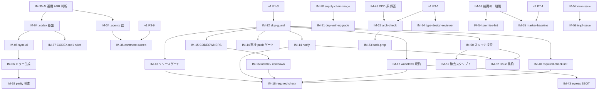

# go-boilerplate 機構 輸入作業計画

隣接する `go-boilerplate` リポジトリの開発機構のうち、本リポジトリへ輸入する対象・翻案方針・着手順序を定める。

## 0. 本書の位置づけ

- **役割分担**
  - [v1-implementation-plan.md](v1-implementation-plan.md) — v1.0.0 までの実装 PR の SSOT。本書はその PR 枠へ**輸入元と輸入すべき設計**を供給する
  - [BACKLOG.md](../adr/BACKLOG.md#go-boilerplate-claude-資産-移植バックログ)「go-boilerplate Claude 資産 移植バックログ」節 — 枠 ID・移植グループ ID `GB-N` との紐づけと資産単位の分類の SSOT
  - 本書 — 比較結果と作業定義、および各項目の状態。**完了した項目も削除せず、状態と決着内容を記して残す** — 何をどう輸入したか(および輸入時に取り下げた判断)を後から辿れるようにするため
- **対象スナップショット**: `go-boilerplate` `release/v2.2.0`(2026-08-11 時点)。`.claude/`(スキル 42 / エージェント 22 / 共有スペック 5)、`.agents/`(AI ツール非依存の成果物 3 ドメイン)、`.codex/`(エージェント 22 / スキル 42 / 実行禁止 rules 3)、`.github/`(workflow 67 + composite action 4)、`scripts/`(ツール 29 + 共有 `lib/`)、`.makefiles/` / `docs-viewer/` / ルート lint 設定群
- **輸入の原則**
  - **ADR が正**。[AGENTS.md](../../AGENTS.md) Instruction Priority に従い、ADR で未決の領域へ go 側の規約を持ち込まない。該当枠が Accepted になるまで着手しない
  - **仕組みを輸入し、内容は翻案する**。Go / Docker / sqlc / OpenAPI 生成に依存する中身は捨て、言語非依存の構造(fan-out / read-only 分離 / ロックファイル SSOT / 検疫 / 台帳)だけを持ち込む
  - **受け皿を優先する**。v1 計画に既存 PR 枠があるものは新規枠を立てず、その PR 定義へ輸入元を書き足す
  - **`scripts/` 配下は TypeScript へ変換して輸入する**。go 側の Go / シェル実装をそのまま持ち込まず、`scripts/<tool>/index.ts` + 判定モジュールへ書き換えたうえで `pnpm exec tsx` から実行する形にする。理由は 3 つ — 本リポジトリの言語は TypeScript であり、シェル / 素の JS を混在させると `pnpm typecheck` と biome の検査対象から外れる / 実行系を `tsx` に一本化できる / mise 管理外のシェル依存(GNU coreutils 差異など)を持ち込まずに済む。呼び出し側(`.makefiles/*.mk` / `package.json` scripts / `.lefthook.yaml` / workflow)も `tsx` 実行へ合わせて書き換える
    - **1 ツール = 1 ディレクトリ**。`index.ts` が入口(引数処理 / ファイル I/O / 終了コード)で、判定は隣のモジュールへ切り出しテストを付ける。呼び出しはディレクトリ単位(`tsx scripts/<tool>`)とし、入口が持てないものは除外理由ごと宣言する
    - **例外**: スキル同梱スクリプト(`.claude/skills/*/scripts/`)のうち、**依存インストール前に単体で動くこと**を要件とするもの(`full-verify` の `run.sh` のような他リポジトリへ無編集コピーする前提の headless 駆動系)はシェルのまま輸入してよい。この例外に当たるかは輸入時に個別判断し、当たらないものは TypeScript へ変換する
  - **AI ツールに依存しない成果物は `.agents/` へ置く**。`.claude/` / `.codex/` は 1 アシスタント向けの設定であり、スキルが書き出す機械可読な台帳はどのアシスタントから走らせても同じデータになる。ベンダディレクトリへ置くと台帳が二重化して互いに食い違う([IM-34](#im-34-agents-の器))
  - **run ごとの再開状態は共有しない**。進行ログをリポジトリ状態として積まず、当該 run の `tmp/` 成果物に閉じる。再開形式をスキル間で統一もしない([IM-35](#im-35-ai-運用の判断を-adr-として持つかの決定))
  - **README の実ファイル列挙をゲートにしない**。README が並べたファイル名をパースして実体と突合するゲートは、README の書き方を縛るだけで腐りを防げない。構造ドリフトは `sync-readme` / `back-prop` の判断に委ねる

---

## 1. 差分サマリ

### 1.1 資産数

| 区分 | go-boilerplate | nextjs-boilerplate | 差分 |
| --- | --- | --- | --- |
| Claude スキル | 42 | 19 | 23 |
| Claude エージェント | 22 | 6 | 16 |
| 共有スペック(`.claude/scaffold-spec/`) | 5 | 0 | 5 |
| AI 非依存の成果物(`.agents/`) | 3 ドメイン | 0 | 全数 |
| Codex 資産(`.codex/`) | エージェント 22 / スキル 42 / rules 3 | 0 | 全数 |
| GitHub workflow | 67 | 15 | 52 |
| composite action | 4 | 1 | 3 |
| `scripts/` ツール | 29 | 14 | 15 |

差分の内訳は 3 種に分かれる。**表示層に載らないもの**(Go / DB / Docker / spec 駆動 / DDD 層監査)は §4 で対象外として記録し、**すでに翻案済みのもの**(`node-upgrade` / `design-export` / `adr-scan` など本リポジトリ固有の 5 スキルを含む)は差分に見えても輸入対象ではない。残りが §2 の作業一覧である。

### 1.2 台帳の鮮度

[BACKLOG.md](../adr/BACKLOG.md) の移植バックログ節は旧スナップショット(スキル 35 / エージェント 19)を指しており、上記 42 / 22 とずれている。再取得は [IM-33](#im-33-移植バックログ節を現行スナップショットへ改訂) が持つ。

### 1.3 分類凡例

- **[A] 無翻案** — 言語非依存。パスと対象ツールの差し替えのみ
- **[B] 翻案** — 構造は流用、中身は Next.js / TypeScript へ書き換え
- **[C] 保留** — ADR 未決。該当枠が Accepted になってから着手
- **[D] 対象外** — 本リポジトリの ADR と非互換。記録のみ残す

---

## 2. 作業一覧

全 59 項目(完了 10 / 一部完了 2 / 未着手 47)。issue 化の単位はこの 1 行 = 1 issue。「受け皿」は v1 実装計画の PR ID、`—` は新規枠。

| ID | 内容 | 分類 | 受け皿 | 依存 / トリガー | 状態 |
| --- | --- | --- | --- | --- | --- |
| **W0: 前提整備** | | | | | |
| IM-01 | 移植バックログ節をスナップショット 35/19 へ改訂 | A | — | なし | 完了(issue #38) |
| IM-33 | 移植バックログ節を現行スナップショット 42/22 へ改訂 | A | — | なし | 未着手 |
| **W1: レビュー体系の追随** | | | | | |
| IM-02 | `impl-review` を go 側現行仕様へ追随 | B | — | IM-01 | 完了(issue #40) |
| IM-36 | `comment-sweep` + コメント在庫の管轄ゲート | B | — | IM-34, P3-9 | 未着手 |
| **W2: AI 環境二重運用**(受け皿なし / 即着手可) | | | | | |
| IM-03 | `manage-skill` 移植 | A | — | なし | 完了(issue #39) |
| IM-35 | AI 運用の判断を ADR として持つかの決定 | C | — | なし。IM-34 / IM-04 の前 | 未着手 |
| IM-34 | `.agents/` の器 | A | — | IM-35 | 未着手 |
| IM-04 | `.codex/` 基盤(README 対訳 / config.toml / スコープ規約) | B | — | IM-35 | 未着手 |
| IM-05 | `sync-ai` + handoff スクリプト双方向 | B | — | IM-04 | 未着手 |
| IM-06 | `.codex/` へのスキル / エージェント一括ミラー | B | — | IM-05 | 未着手 |
| IM-37 | `CODEX.md` + `.codex/rules/*.rules`(実行禁止ルール) | B | — | IM-04 | 未着手 |
| IM-38 | `skill-lint` の Claude ↔ Codex parity 検査 | A | — | IM-06 | 未着手 |
| **W3: ローカル品質ゲート**(v1 Phase 1 併走) | | | | | |
| IM-07 | commitlint | A | P1-1 | なし | 完了(issue #36) |
| IM-08 | lefthook の段階設計の残り(lint の glob 分割) | B | — | なし | 一部完了 |
| IM-09 | `.editorconfig` | B | P1-3 | なし | 完了(issue #35) |
| IM-10 | 抑止ポリシー様式の統一 | A | P1-2 | なし | 完了(issue #37) |
| IM-11 | `.makefiles/README` + `make help` 未文書化警告 | A | P1-3 | なし | 完了(issue #35)。EN 正典の形は PR #63 で撤回 |
| IM-39 | `load-band`(窓数でローカルゲートの帯を決める) | B | — | なし。issue #128 と対 | 未着手 |
| **W4: CI 設計パターン**(v1 Phase 2 併走) | | | | | |
| IM-12 | skip-guard ペア方式 | A | P2-1 | P1-3 | 未着手 |
| IM-13 | 二重リリースゲート | A | P5-17 | IM-12 | 未着手 |
| IM-14 | notify workflow(failure / detection 2 モード) | A | P2-1 | IM-12 | 未着手 |
| IM-15 | CODEOWNERS + dependabot cooldown の対構造 | A | P5-17 | IM-12 | 未着手 |
| IM-16 | lockfile-integrity + pnpm cooldown 監査 | B | P5-17 | IM-15 | 未着手 |
| IM-17 | workflows README + harden-runner + `cache: false` 規約 | A | P2-1 | IM-12 | 未着手 |
| IM-18 | `required_status_checks` の branch ruleset 反映 | A | Phase 2 完了条件 | IM-12〜IM-17, IM-40 | 未着手 |
| IM-40 | `required-check-lint`(required check 宣言と workflow の突合) | B | P2-1 | IM-12 | 未着手 |
| IM-41 | Job 打ち切り規約 + `actions-cutoff-lint` | B | P2-1 | なし | 未着手 |
| IM-42 | `pr-comment-fence-lint` | B | P2-1 | なし | 未着手 |
| IM-43 | harden-runner の `allowed-endpoints` SSOT 化 + `egress-check` | B | P2-1 | IM-17 | 未着手 |
| IM-44 | 保護ブランチへの直接 push でもゲートを走らせる | A | P2-1 | IM-12 | 未着手 |
| IM-45 | commitlint / md 系の CI 引き上げ | A | P2-1 | IM-07 | 未着手 |
| IM-46 | `@claude` メンション workflow | A | P2-1 | なし | 未着手 |
| **W5: サプライチェーン**(v1 Phase 2 後) | | | | | |
| IM-19 | actions-pin 機構 + スキル(GB-6) | B | P2-3 | IM-12 | 完了(issue #86) |
| IM-20 | `supply-chain-triage` スキル | B | — | IM-19 | 未着手 |
| IM-21 | `dep-vuln-upgrade` スキル | B | — | IM-20 | 未着手 |
| IM-47 | `tool-cooldown`(mise pin のクールダウン gate) | B | — | IM-19 | 未着手 |
| **W6: アーキ監査・ドリフト**(v1 Phase 3 後) | | | | | |
| IM-22 | `arch-check` + 層別 auditor(GB-1) | C | — | A3 Accepted + P3-1 | 未着手 |
| IM-23 | `back-prop` + drift-detector(GB-2) | C | — | IM-22 | 未着手 |
| IM-24 | `type-design-reviewer`(GB-7) | C | — | A3 Accepted + P3-1 | 未着手 |
| IM-25 | 2 段 lint 構成の思想を ESLint へ適用 | B | P3-2 | P3-2 | 未着手 |
| IM-48 | DDD / 語彙 / コンテキストマップ系の採否判断 | C | — | A3 Accepted。IM-22 の前 | 未着手 |
| **W7: spec / scaffold**(v1 Phase 4 前後) | | | | | |
| IM-26 | GB-3(spec 駆動)の採否判断 | C | P5-18 | Phase 5 の画面実装完了 | 未着手 |
| IM-27 | GB-4 の骨格のみ P4-6 へ吸収 | B | P4-6 | P4-5(着地済み) | 未着手 |
| **W8: テスト**(v1 Phase 3 後) | | | | | |
| IM-28 | `scaffold-test` / `test-review`(GB-5) | C | P4-0 | P3-6 完了 | `test-review` 完了 / `scaffold-test` 未着手 |
| IM-49 | `scripts/` の 1:1 テスト対応ゲート + ツールのディレクトリ化 | B | — | なし | 完了(PR #143) |
| **W9: docs portal**(v1 Phase 8) | | | | | |
| IM-29 | `portal-manifest-sync` 復活 | A | P8-2 | P5-16 | 未着手 |
| IM-30 | `docs/maintenance/` の新設 | B | P3-10 | P3-10 | 未着手 |
| **W10: 外部スキル** | | | | | |
| IM-31 | graphify 導入(pin / bootstrap / 権限境界 / 除外) | B | — | go 側の検証決着 | 完了(issue #102) |
| IM-32 | `affected` に絞った repo スコープの薄いラッパースキル | B | — | go 側で着地済み。着手可 | 未着手 |
| **W11: スキャナ面の拡張と結果集約**(v1 Phase 5 後) | | | | | |
| IM-50 | スキャナ採否の確定と report-only 追加 | B | P5-17 | IM-12 | 未着手 |
| IM-51 | 資格情報 / ライセンス条件付きスキャナの撤去スクリプト + 撤去検査 | A | P5-17 | IM-50 | 未着手 |
| IM-52 | スキャン結果の Issue 集約 | A | P5-17 | IM-14, IM-50 | 未着手 |
| **W12: 前提の焼き込み解体** | | | | | |
| IM-53 | 「文書が生き延びる前提を置かない」一般則 + 集約先ドキュメント | B | P3-9 | なし | 未着手 |
| IM-54 | `premise-lint` | B | — | IM-53 | 未着手 |
| IM-55 | 除去マーカーのベースライン固定(`marker-baseline`) | B | P7-2 | IM-53, P7-1 | 未着手 |
| IM-56 | `doc-ref-lint`(ADR ファイル名 / H1 / 参照 / 対訳の整合) | B | — | なし | 未着手 |
| **W13: issue 運用** | | | | | |
| IM-57 | `new-issue` | B | — | なし | 未着手 |
| IM-58 | `impl-issue` | B | — | IM-57 | 未着手 |
| **W14: リポジトリ運用ツール** | | | | | |
| IM-59 | `base-branch`(最新 release ラインの解決) | B | — | なし | 未着手 |

### 2.1 依存マップ

未着手の項目のみを描く(完了済みは着手順序に影響しないため省く)。矢印は**着手をブロックする依存**だけを引く。

---

## 3. 作業定義

v1 計画に受け皿がある項目は、その PR 定義へ書き足す内容のみを記す。完了した項目は **状態**(決着内容 / 当初定義から変えた点)を添えて残す。

### W0: 前提整備

#### IM-01: 移植バックログ節をスナップショット 35/19 へ改訂

- **目的**: 台帳が古いスナップショットを指しているため、以降の判断が go 側の現状とずれる。基準を現在へ揃える
- **主な変更先**: [BACKLOG.md](../adr/BACKLOG.md) 移植バックログ節
- **完了条件**: BACKLOG の分類に当時の全 35 スキル / 19 エージェントが漏れなく現れる
- **状態**: **完了**(issue #38)。移植グループ ID は当初 `C-N` としたが、Tier 5 の枠 ID `CN` と記号が衝突するため後に `GB-N` へ改名した(issue #58)

#### IM-33: 移植バックログ節を現行スナップショットへ改訂

- **目的**: go 側がスキル 42 / エージェント 22 へ増えており、台帳の分類に現れない資産が生じている。IM-01 と同じ作業を現行スナップショットに対して行う
- **主な変更先**: [BACKLOG.md](../adr/BACKLOG.md) 移植バックログ節
- **追加分類が必要な資産**: スキル 7 件(`comment-sweep` / `context-map` / `context-map-audit` / `ddd-audit` / `glossary` / `impl-issue` / `new-issue`)、エージェント 3 件(`ddd-origin-auditor` / `drift-detector-ddd` / `drift-detector-glossary`)、`.agents/` の 3 ドメイン
- **併せて反映する**: GB-2(`back-prop`)の検出カテゴリに語彙漏れ(E)が増えた点、GB-5 の受け皿が P4-0 である点
- **完了条件**: BACKLOG の分類に go 側の全 42 スキル / 22 エージェント / `.agents/` 全ドメインが漏れなく現れる
- **依存**: なし

### W1: レビュー体系の追随

#### IM-02: `impl-review` を go 側現行仕様へ追随

- **目的**: 移植後に go 側で拡張された 4 機能が本リポジトリに無い。レビュー品質の差がそのまま実装品質の差になる
- **輸入元**: `.claude/skills/impl-review/SKILL.md`
- **主な変更先**: `.claude/skills/impl-review/SKILL.md`(+ `SKILL.ja.md`)、`.claude/agents/adversarial-reviewer.md`、`.claude/agents/comment-reviewer.md`
- **輸入する 4 点**:

| # | 機能 | 翻案メモ |
| --- | --- | --- |
| 1 | **`test-gap` レンズ**(第 5 の code-origin レンズ) | 変更された本番コードを読み、到達可能な分岐 / 変更シンボルのうち未テスト・空虚アサートを検出。対象は `src/**` の非生成 `.ts` / `.tsx`(除外は `*.test.ts` / `gen/**`) |
| 2 | **`comment-reviewer` のライフサイクル組込 + 自動修正** | CONFIRMED なコメント指摘を 1 度の確認後に作業ツリーへ適用。機能ディレクティブ(`// @ts-expect-error` / `biome-ignore` / `"use client"` 等)は削除しない、export された API の TSDoc は削除でなく書換 or 補強、生成物 / Markdown 散文 / deny リストは除外。検証は `pnpm fix` → `pnpm lint:ci` |
| 3 | **PR インラインコメント投稿**(既定 on / `--no-comment`) | CONFIRMED + PLAUSIBLE をレンズ別に `path:line` へアンカーして投稿。REFUTED は投稿しない。**外向き操作のため投稿前に 1 度だけ確認**する規約もそのまま輸入 |
| 4 | **モデル選択**(fable / sonnet / opus / haiku、既定 auto = 実装者 ≠ レビュアー) | 無翻案 |

- **完了条件**: 5 レンズ + comment-reviewer が走り、コメント指摘が自動修正され、残る指摘が PR へインライン投稿される。`--no-comment` / `--no-apply` が効く
- **依存**: IM-01
- **状態**: **完了**(issue #40)。その後 `test-review` の移植(IM-28)に伴い、スキル名を `local-review` から go 側と同じ `impl-review` へ改名し、テスト観点は Step 5 で `test-review` へ委譲する形にした(`test-gap` レンズは委譲が動かない場合の fallback)。PR インライン投稿は `gh api` の実行許可が前提で、これを許可する判断は issue #48 で別途決着させた。Step 1 の layer 検出・ランタイム検証段・`runtime-gap` のレンズ定義本文には go 由来の記述が残っており、未翻案分は BACKLOG の移植バックログ節が持つ。その後の追随で 3 点を取り込んだ — コメント内容の判定を go 側現行の分類へ揃え(下記 IM-36 の 3 番目を除く)、テスト観点委譲の状態を 4 分岐へ割り直して「テストのみの変更で委譲不可」のとき `test-gap` を空振りさせない形にし、`テスト観点:` 行を必須の 4 値へ固定した。併せて `architecture` レンズの前提を実態(`pnpm lint:ci` が `eslint-plugin-boundaries` と `check:architecture` を走らせる)へ訂正した

#### IM-36: `comment-sweep` + コメント在庫の管轄ゲート

- **目的**: 既存レビュー体系が答えられない問いを 1 つ足す。`comment-reviewer` は差分上のコメントを「削除 / 書換」でしか裁けず、**「この内容はここに置くべきか」という管轄の判定**(= 設計根拠を ADR / 層 README へ移設し、コード側には効力のある残余とリンクだけを残す)を持たない。結果として、1 行ずつは正しいが総量が読み手の負担になったコメント在庫が減らない
- **輸入元**: `.claude/skills/comment-sweep/`、`.agents/comment-remediation/`、`docs/rules.md` のコメント規則
- **主な変更先**: `.claude/skills/comment-sweep/SKILL.md`(+ `.ja.md`)、`.agents/comment-remediation/`、`docs/rules.md`、`.claude/settings.json`(hooks)
- **輸入する 3 点**:
  1. **管轄判定を持つスキル本体** — パッケージ単位に read-only の監査を fan-out し、1 件ずつ承認を取って**コード側と移設先ドキュメントの両方を自分で書く**(移設した根拠が行き先を失わないため)。移設先の誤配 2 種(ライブラリ固有の挙動はコードに残す / 業務知識は ADR ではなく仕様側へ)を拒否する規約も輸入
  2. **在庫台帳 + 編集前の照会フック** — 掃き終えたファイルを `.agents/comment-remediation/` の台帳に記録し、`Edit` / `Write` の `PreToolUse` フックで未掃引ファイルへの編集を検知する。フックは worktree でも黙らない形にする
  3. **流入ゲートを規則側に置く** — 「変更はコメントを獲得するものであって、コメントを伴って到来するものではない(既定は新規コメント 0 行)」「入場基準は前提の近さ — その宣言を編集せずに偽にできる前提はコメントにしない」を [docs/rules.md](../rules.md) のコメント節へ入れる。在庫を掃くだけでは流入が続く
- **翻案メモ**: 移設先の表は go 側の `docs/design/**` / `docs/spec/**` / パッケージ README から、本リポジトリの `docs/adr/**` / 層別 README(P3-1)へ差し替える。`// Name は、〜です。` 形式の維持は go 固有の規約なので採らない。フックは本リポジトリ初の `.claude/settings.json` hooks 利用になるため、IM-35 の判断を先に通す
- **完了条件**: 1 パッケージについて掃引が完走し、移設された根拠が移設先ドキュメントに現れ、台帳が更新される。未掃引ファイルの編集でフックが照会を出す
- **依存**: IM-34、[docs/rules.md](../rules.md) のコメント節(P3-9)

### W2: AI 環境二重運用

#### IM-03: `manage-skill` 移植

- **目的**: スキルの新規作成・更新の単一入口を作る。これが無いと IM-05 の受け側が定まらない
- **輸入元**: `.claude/skills/manage-skill/`
- **翻案メモ**: 公式 marketplace `anthropics/claude-plugins-official` の `skill-creator` プラグインをラップする構造は無翻案。上乗せする規約を本リポジトリのものへ差し替える — `SKILL.ja.md` 対訳([0140](../adr/0140-documentation-operations.md))、スキル配置・命名・frontmatter([0154](../adr/0154-claude-skills-operations.md) / [0155](../adr/0155-claude-skills-development.md))、[AGENTS.md](../../AGENTS.md) の AI Modification Scope
- **完了条件**: `manage-skill` 経由で作成したスキルが対訳ペアと frontmatter 規約を満たす。対訳片落ちの 3 件(`adr-scan` / `commit` / `tool-map`)が解消される
- **状態**: **完了**(issue #39)。導入スクリプトは輸入元の `.claude/scripts/bootstrap-plugins.sh` ではなく、§0 の TypeScript 変換原則に従い `scripts/bootstrap-plugins/`(`pnpm exec tsx` 実行)として着地した

#### IM-34: `.agents/` の器

- **目的**: スキルが書き出す機械可読な台帳の置き場を、アシスタント非依存の位置に作る。`.claude/` へ置くと Codex / Cursor から見えず二重化し、二重化した台帳は互いに食い違う
- **輸入元**: `.agents/README.md`(+ `.ja.md`)
- **主な変更先**: `.agents/README.md`(+ `.ja.md`)、[AGENTS.md](../../AGENTS.md) の「Agent configuration file protection」節
- **輸入する線引き**: 置くのは「次の run が読む、コミット済みの共有機械可読状態」だけ。アシスタントへの指示(= ベンダ設定)、run ごとの再開状態(= 当該スキルの `tmp/`)、1 ベンダの契約に紐づくものは置かない。ピン用ロックファイル(`.github/actions-pin.toml`)は概念的には同種だが、マニフェストの隣に置くほうがツールの参照位置と一致するため移さない
- **翻案メモ**: [AGENTS.md](../../AGENTS.md) は Codex CLI の置き場を `.agents/skills/` と記載しており、この器と衝突する。go 側は Codex を `.codex/` に置いて `.agents/` を成果物専用にしているため、**同じ線引きへ揃えるか、器の名前を変えるか**を IM-35 で決着させてから着手する
- **完了条件**: `.agents/README.md` が置き場の線引きを持ち、`.claude/` / `.codex/` の README と相互参照する。AI Modification Scope に成果物ディレクトリとしての扱いが現れる
- **依存**: IM-35

#### IM-35: AI 運用の判断を ADR として持つかの決定

- **判断すべきこと**: go 側が AI 運用について新たに 3 本の判断を持った。本リポジトリの ADR [0154](../adr/0154-claude-skills-operations.md) / [0155](../adr/0155-claude-skills-development.md) は配置と開発手順しか持たないため、以下を ADR として持つか、既存 ADR の追補で足りるかを決める
  1. **統制の判断基準**(go ADR-0008 相当) — 外部の呼称(「harness engineering」等)への準拠を宣言せず、リポジトリ自身の検査可能な性質へ揃える。統制は「明確な指示」「判定可能なものは機械強制」「判定不能なものは独立にレビューできるシグナル」のいずれかを備えること。決定可能な性質はツールで gate し、読解判断は finder → verifier のレビュー形で扱う
  2. **恒久的なエージェント状態の置き場**(go ADR-0009 相当) — 進行ログをリポジトリ状態として積まない。記述文書を変える発見はその README / `docs/` へ返し、統治文書との衝突は人へ上げる。run ごとの状態は当該スキルの ignored な `tmp/` に閉じ、`.agents/` へは移さず、スキル間で再開形式を統一しない
  3. **多モデル敵対レビューの根拠**(go ADR-0090 相当) — 実装者 ≠ レビュアー / finder → verifier の二段という現行 `impl-review` / `test-review` の前提が、本リポジトリでは ADR に無い
- **注意**: [AGENTS.md](../../AGENTS.md) の Codex 置き場(`.agents/skills/`)と IM-34 の器の衝突も、ここで同時に決着させる
- **完了条件**: 上記 3 点について「ADR を立てる / 既存 ADR へ追補する / 採らない」が決まり、決めた形が反映されている
- **依存**: なし(IM-34 / IM-36 / IM-37 のブロック元)

#### IM-04: `.codex/` 基盤

- **目的**: Codex CLI 側の運用契約を置く器を作る
- **輸入元**: `.codex/README.md`(+ `.ja.md`)、`.codex/config.toml`
- **主な変更先**: `.codex/README.md`(+ `.ja.md`)、`.codex/config.toml`
- **翻案メモ**: `config.toml` は codex-cli がプロジェクト設定を読まないため**「記録された意図」**である旨を go 側同様に明記する。個人設定(MCP / 認証)は `~/.codex/` へ置く分離方針も踏襲。ツール実行系の記述を Go/Docker から pnpm / mise へ差し替える
- **完了条件**: `.codex/README.md` が Claude 側 `.claude/README.md` と鏡像の構成で存在し、両者が互いを参照する
- **依存**: IM-35(置き場の線引き)

#### IM-05: `sync-ai` + handoff スクリプト双方向

- **目的**: 片方の環境で更新したスキルを、もう片方へ**セマンティックに**移植する。生ディレクトリコピーを禁じ、受け側の `manage-skill` に翻案させる
- **輸入元**: `.claude/skills/sync-ai/`(+ `scripts/handoff-to-codex.sh`)、`.codex/skills/sync-ai/`(+ `scripts/handoff-to-claude.sh`)
- **翻案メモ**: 中身は言語非依存でほぼ無翻案。**再帰防止の機構は無改造で必須輸入** — `tmp/sync-ai/.handoff.lock` の `mkdir` アトミックロック + TTL 3600s、非対話 CLI 起動、Codex sandbox の writable roots への `.codex/` 追加、Claude 側への `--permission-mode bypassPermissions` 引き渡し。handoff スクリプトは §0 の原則に従い `*.sh` から `scripts/<tool>/` へ変換する — ロック機構は `fs.mkdirSync` の失敗判定で等価に再現できるため、この変換で再帰防止の要件は落ちない
- **完了条件**: 片方向ハンドオフが完走し、受け側にネイティブな形でスキルが生成される。同時起動でロックが効き再帰しない
- **依存**: IM-04

#### IM-06: `.codex/` へのスキル / エージェント一括ミラー

- **目的**: 既存資産を Codex 側へ展開し、二重運用を成立させる
- **主な変更先**: `.codex/agents/*.toml`、`.codex/skills/*/`(`SKILL.md` + `agents/openai.yaml`)
- **翻案メモ**: **IM-05 の `sync-ai` で 1 資産ずつ駆動する**(手コピーしない)。エージェントは `name` / `description` / `developer_instructions`(日本語、read-only 規律 + プロンプトインジェクション耐性 + `file:line` 根拠必須)の TOML 形式へ。`full-verify` は `prompts/` と `scripts/run.sh` を同梱する
- **完了条件**: `.claude/` 側の全スキル / エージェントに対応する `.codex/` 資産が存在し、`tool-map` が両環境を棚卸しできる
- **依存**: IM-05

#### IM-37: `CODEX.md` + `.codex/rules/*.rules`

- **目的**: Codex 側にも正典への入口と、実行してはならない操作の宣言を置く。`config.toml` が読まれない前提のもとで、危険操作の抑止を規約ではなくルールファイルで表現する
- **輸入元**: `CODEX.md`、`.codex/rules/local-safety.rules` / `make-safety.rules` / `github.rules`
- **主な変更先**: `CODEX.md`、`.codex/rules/*.rules`
- **翻案メモ**: `prefix_rule(pattern, decision, justification)` の形式は無翻案。禁止対象を本リポジトリのものへ差し替える — 削除系(`rm` / `rmdir`)、`make` の破壊的ターゲット(リリース / ブランチ操作 / `setup-repository`)、`gh` の書き込み操作。`CODEX.md` は [AGENTS.md](../../AGENTS.md) を参照する薄い入口とし、内容を重複させない
- **完了条件**: `.codex/rules/` が禁止操作を理由付きで宣言し、`CODEX.md` が `AGENTS.md` を参照する入口として存在する
- **依存**: IM-04

#### IM-38: `skill-lint` の Claude ↔ Codex parity 検査

- **目的**: スキルが片方の環境にだけ着地する事故を機械で捕まえる。本リポジトリの `skill-lint` は frontmatter / 対訳ペア / 参照の実在性までを持ち、環境間の対応は見ていない
- **輸入元**: `scripts/skill-lint/checks.ts` の parity 検査と `PLATFORM_ONLY_SKILLS`
- **主な変更先**: `scripts/skill-lint/`
- **輸入する 3 点**: (1) `.claude/skills/<name>/` ⇔ `.codex/skills/<name>/`、`.claude/agents/<name>.md` ⇔ `.codex/agents/<name>.toml` の**存在のみ**の相互検査。(2) 意図的に片側のみのスキルは**理由付きの宣言**を必須とし、理由が空のエントリと、両側(または両側とも不在)へ変わったのに残っているエントリを fail させる — 例外リストが例外より長生きしないようにする。(3) 本文の対応は検査しない(`sync-ai` はセマンティックな移植であり、恒久的な差異が正常)
- **注意**: エージェントには例外の抜け穴を作らない。片側だけに置く実例が現に無いためで、必要になってから機構を足す
- **完了条件**: 片側にだけスキル / エージェントを置くと `make md-lint` が落ちる。理由の無い例外エントリも落ちる
- **依存**: IM-06

### W3: ローカル品質ゲート

v1 計画 Phase 1 の各 PR へ書き足した輸入内容と、その決着。

| ID | 受け皿 | 輸入内容 | 状態 |
| --- | --- | --- | --- |
| IM-07 | P1-1 | 輸入元 `commitlint.config.js`。type-enum は [0150](../adr/0150-git-workflow.md) の prefix 11 種と同一。**大文字混在のため `type-case` を課さない**点をそのまま輸入 | **完了**(issue #36)。config は TypeScript 変換原則に従い `commitlint.config.ts` として着地 |
| IM-09 | P1-3 | `.editorconfig` を新規追加。go 側から Go 節を除去し、TS / TSX / JSON / YAML / MD / CSS の indent 規約を biome の設定と一致させる | **完了**(issue #35) |
| IM-10 | P1-2 | **抑止ポリシー様式**を輸入 — `.gitleaks.toml` / `.gitleaksignore` / `.trivyignore.yaml` に共通する「一括無効化禁止・抑止はファイル or フィンガープリント単位・理由必須・条件が変われば削除」を各ファイル冒頭に明文化。`.gitleaksignore` は 1 行ごとに「なぜ秘密でないか」を書く | **完了**(issue #37) |
| IM-11 | P1-3 | `.makefiles/README.md`(EN)を新設し `README.ja.md` の対訳を成立させる。`make help` の未文書化ターゲット警告も併せて入れる | **完了**(issue #35)。ただし **EN 正典 + `.ja.md` 対訳の形は撤回**した(PR #63)。[0140](../adr/0140-documentation-operations.md) が v1.0.0 未満は日本語 canonical をサフィックス無しのパスへ置くと定めるため、`.makefiles/README.md` 日本語 1 本へ戻した |

#### IM-08: lefthook 段階設計の残り

- **目的**: pre-commit は変更に関係する検査だけを走らせ、重い検証を pre-push へ寄せる。全部を毎回走らせると hook が邪魔になり、`--no-verify` の常用へ流れる
- **輸入元**: go 側 `.lefthook.yaml`
- **主な変更先**: `.lefthook.yaml`
- **残っている差分**: biome の完全版 lint(`pnpm lint:ci`)が glob 無しで全コミットに発火する。go 側は対象言語の glob で分割している
- **完了条件**: lint が対象ファイルを含むコミットでのみ発火する
- **依存**: なし
- **状態**: **一部完了**。commit-msg フック(issue #36)、pre-push の秘密スキャン(issue #37)、テスト・生成物ドリフト・Actions 系の glob 分割は着地済み。上記「残っている差分」のみ未着手

#### IM-39: `load-band`

- **目的**: ローカルゲートが並行作業の窓数に対して線形に重くなる問題を、帯の判定で解く。飽和したホストではゲートの失敗自体が信用できなくなるため、**重い検査を CI へ委ねる帯**を持つ
- **輸入元**: `scripts/load-band/`、`.makefiles/` の `gate-*` ターゲット
- **主な変更先**: `scripts/load-band/`、`.makefiles/testing/`、`.lefthook.yaml`
- **輸入する解**: `git worktree` の数からホストの負荷帯(`full` / `low` / `ci-first`)と 1 窓あたりの CPU 配分を解決し、`KEY=VALUE` で recipe に `eval` させる。**解決は make のパース時ではなく recipe の中で行う**(重い検査を含まないターゲットが解決コストを払わないため)
- **翻案メモ**: 窓数の数え方をシェルに持たせない。go 側が置き換えた `git worktree list | grep -c . || echo 1` は git が答えられないときに `0` と `1` の両方を出し、比較が `integer expression expected` で落ちて帯が黙って `full` に劣化していた。判定は純関数としてテストを付ける。帯の閾値は本リポジトリの実測で決め、issue #128(`test:light` の閾値見直し)と対で扱う
- **完了条件**: `make load-status` が帯と CPU 配分を出し、`ci-first` 帯で重いローカルゲートが CI へ委ねられる。窓数が取れないときも帯が黙って劣化しない
- **依存**: なし

### W4: CI 設計パターン

v1 計画 Phase 2 の各 PR へ、以下を輸入元・輸入内容として書き足す。**設計そのものが輸入対象**であり、workflow の中身(golangci → biome / vitest 等)は本リポジトリのツールへ差し替える。

> 受け皿の注記: IM-13 / IM-15 / IM-16 の受け皿は当初 P2-2 としていたが、v1 計画 §4 の PR 一覧に P2-2 の行が無く、セキュリティ workflow は P5-17 が持つ。受け皿を P5-17 へ寄せている。

#### IM-12: skip-guard ペア方式(P2-1)

- **問題**: `paths:` フィルタ付きの workflow を required status check に登録すると、フィルタに合致しない PR ではコンテキストが報告されず**マージが永久にブロックされる**
- **輸入する解**: 本体の `paths:` を鏡写しにした `paths-ignore:`(branches 型は `branches-ignore:`)で**補集合側に発火し、本体と同名のジョブ名を即 success で報告する** guard workflow を対で置く。両方発火した場合 GitHub は同名チェック全部の成功を要求するため、guard が本体の失敗を隠すことは構造上起こらない
- **注意**: guard と本体のフィルタ同期がメンテコストになる。go 側では実際に paths のドリフトが発生しているため、**同期を機械検査する**(IM-40)ところまでを 1 組として輸入する
- **完了条件**: paths フィルタ付き workflow のすべてに guard が対で存在し、対象外 PR でもチェックが緑で報告される

#### IM-13: 二重リリースゲート(P5-17)

- **輸入する解**: 通常 PR ではスキャナを report-only とし、`develop` / `staging` / `production` 宛て PR でのみブロックする専用 workflow を置く。「その PR が持ち込んだ脆弱性でないもので通常 PR を止めない、しかし昇格時には必ず止める」
- **翻案メモ**: go 側の `trivy-release-gate` / `osv-release-gate` に相当するものを、本リポジトリの trivy / `pnpm audit` / osv-scanner に対して置く。osv-scanner・dependency-review・CodeQL(js-ts)・gitleaks・TruffleHog・zizmor・Scorecard は**そのまま使える**。リリースゲートは保護ブランチへの直接 push でも走らせる(IM-44)

#### IM-14: notify workflow(P2-1)

- **輸入する解**: `workflow_call` の再利用 workflow を 1 本置き、**failure モード**(scheduled 失敗は誰の目にも入らないため通知)と **detection モード**(report-only スキャナの検知を webhook へ)を持たせる。webhook 未設定なら green のままスキップする
- **翻案メモ**: detection の受け先はもう 1 経路ある(IM-52 の Issue 集約)。webhook は個人宛の即時通知、Issue は棚卸し可能な残留物として使い分ける

#### IM-15: CODEOWNERS + dependabot cooldown(P5-17)

- **輸入する解**: 検知と強制を**対**にする。dependabot の cooldown(patch 5 / minor 7 / major 30 日、security は即時)が「入りにくくする」側、CODEOWNERS が「入るときに必ず人が見る」側
- **主な変更先**: `.github/CODEOWNERS`(新規) — サプライチェーン統制ファイル限定で `pnpm-lock.yaml` / `.npmrc` / `pnpm-workspace.yaml` / `.github/actions-pin.toml` / `package.json` を owner レビュー必須に
- **翻案メモ**: go 側の gomod / docker エコシステムを削り、`npm`(pnpm)+ `github-actions` の 2 つに絞る

#### IM-16: lockfile-integrity + pnpm cooldown 監査(P5-17)

- **輸入する解**: 2 本立て。(1) lockfile の各 entry の resolved URL が公式レジストリ + HTTPS かを検証する workflow。(2) lockfile の各 entry を設定したクールダウン窓と突合する監査
- **翻案メモ**: go 側は当初 npm(`package-lock.json`)前提だったが、**pnpm を唯一の Node resolver とする判断へ移った**。輸入するのはその判断の根拠部分で、本リポジトリでは既に pnpm 単独(ADR [0001](../adr/0001-package-manager.md))のため結論は自明だが、**窓の強制点が resolver で違う**という事実は設定の形を決める
  - npm は `min-release-age` を**解決時のみ**適用する。`npm ci` は解決せずロックファイルを再生するため、窓の内側の版が一度ロックへ入ると以後は不可視になる
  - pnpm は `--frozen-lockfile` の再生経路を含め、**毎回ロックファイル全体を現行ポリシーで再検証する**。窓の内側の版を採るには版を名指しした除外エントリが必要で、無ければ CI を含む以後のインストールが落ちる
  - よって本リポジトリでは `pnpm-workspace.yaml` に `minimumReleaseAge` を置き、除外は**期限・理由付きの bypass 台帳**として持つ。期限切れ / 3 か月超 / 実体に一致しないエントリは検査で落とし、無効なエントリが効力を持ち続けないようにする
- **注意**: ロックファイル内の推移的依存は対象外とする(直接依存だけを gate する `tool-cooldown` / `go-cooldown` と同じ線引き)

#### IM-17: workflows 規約(P2-1)

- **輸入する解**: `.github/workflows/README.md` に**トリガ戦略表 / 全 workflow 表 / 打ち切り時間の表**を置く文書化様式。全ジョブ先頭の `step-security/harden-runner`。**`security-events: write` を持つジョブは `cache: false`**(低権限 run が書いたキャッシュを高権限 run が実行しない)。weekly cron は 1 時間ずつずらして渋滞を避ける
- **翻案メモ**: harden-runner の `egress-policy` は go 側が `audit` から `block` へ進んだ。block 化には許可先の宣言が必要で、その SSOT 化は IM-43 が持つ。打ち切り時間の表は「式で決まらないジョブだけを理由付きで並べる」形をそのまま採る

#### IM-18: required_status_checks の反映(Phase 2 完了条件)

- **輸入する解**: `.github/settings/` に `required_status_checks` ルールを記載し make ターゲットで適用する。**記載するまではすべて report のみ**である事実を明記する
- **注意**: GitHub 側への適用はユーザが実施(v1 計画 Phase 2 完了条件と同じ)。宣言と実効設定は別物である旨も併せて明記する

#### IM-40: `required-check-lint`(P2-1)

- **目的**: required check の宣言と workflow 定義のずれを機械で捕まえる。skip-guard 方式は本体と guard の `paths:` が鏡写しであることに依存しており、ドリフトすると「対象外 PR で永久にブロック」が静かに戻る
- **輸入元**: `scripts/required-check-lint/`
- **主な変更先**: `scripts/required-check-lint/`、`.makefiles/github/lint/`
- **輸入する解**: 宣言された required check 名がすべて実在する workflow のジョブ名に解決できること、guard 側のフィルタが本体の補集合であることを検査する。`actionlint` では表現できない規約なので別コマンドとして持つ
- **完了条件**: required check の宣言に実在しないジョブ名を書くと落ちる。guard と本体の paths がずれると落ちる
- **依存**: IM-12

#### IM-41: Job 打ち切り規約 + `actions-cutoff-lint`(P2-1)

- **目的**: ジョブが打ち切られたとき何が残るかを定義する。timeout が無いジョブは runner を占有し続け、打ち切られたジョブの PR コメントは `failure()` では発火しないため、失敗の痕跡が消える
- **輸入元**: `scripts/actions-cutoff-lint/`、`.github/workflows/README.md` の Job Cut-off 節
- **主な変更先**: `scripts/actions-cutoff-lint/`、`.makefiles/github/lint/`、全 workflow
- **輸入する 3 点**: (1) 全ジョブに `timeout-minutes` を必須化し、実測から式で決める(式で決まらないものは理由付きで表に並べる)。(2) PR コメント投稿ステップの `if:` は打ち切られたジョブから到達可能であること(`always()` / `cancelled()` を見る。`failure()` は打ち切り時に偽なので数えない)。(3) 打ち切り時の見出しを持つこと。3 つを 1 検査にするのは、いずれも「打ち切りが何を残すか」の同じ規約だから
- **翻案メモ**: 構造の読み取りは YAML パーサではなく列位置で行う(ブロックスカラーの本文は必ずキーより深くインデントされるため成立する)。`actionlint` を同じターゲットの前段に置き、入力がパースできること自体はそちらで保証する
- **完了条件**: `timeout-minutes` の無いジョブと、打ち切りから到達できない PR コメント条件が落ちる
- **依存**: なし

#### IM-42: `pr-comment-fence-lint`(P2-1)

- **目的**: PR コメント本文の Markdown フェンスが固定長だと、本文側に同じ長さのフェンスが現れた時点で構造が壊れる。壊れた本文はそのまま公開コメントになる
- **輸入元**: `scripts/pr-comment-fence-lint/`
- **主な変更先**: `scripts/pr-comment-fence-lint/`、`.makefiles/github/lint/`
- **輸入する解**: `run:` ブロックが固定長フェンスを出力していないか、複製された `fence_for` ヘルパ同士が一致しているか、本文を通す workflow が inline code span へ値を差し込んでいないかを検査する。到達範囲(変数経由で組んだフェンスや `jq` で組み立てた本文は見えない / 本文が攻撃者制御かは静的に決定不能)を明記し、そこは規約に委ねる
- **翻案メモ**: 本リポジトリは `scripts/actions-comment-secret-lint/` を既に持つ。同じ入力(workflow + composite action + 共有モジュール)を読む姉妹ツールとして `scripts/lib/` を共有する
- **完了条件**: 固定長フェンスと span 差し込みが落ちる。除外エントリは追跡 issue を名指しし、毎回出力される
- **依存**: なし

#### IM-43: harden-runner の `allowed-endpoints` SSOT 化(P2-1)

- **目的**: `egress-policy: block` を採るには全ジョブが許可先を宣言する必要があり、同じホスト群が全 workflow へ複製される。harden-runner は checkout 前に走るため composite action へ切り出せない
- **輸入元**: `scripts/egress/`、`.github/egress.toml`
- **主な変更先**: `scripts/egress/`、`.github/egress.toml`、全 workflow
- **輸入する解**: ジョブが所属する能力クラス(`base` / `mise` / 本リポジトリなら `registry` / `deploy` 等)と固有の `extra` を `.github/egress.toml` に宣言し、クラス定義がホストを持つ。`apply` が各 workflow の `allowed-endpoints` ブロックを書き換え、`check` が差分を fail させる。SSOT に無いブロック / どの workflow も名乗らない SSOT エントリ / SSOT と食い違う `egress-policy` / ブロック内の非ホスト行はすべて error(fail-closed)
- **完了条件**: `make egress-check` が全 workflow の許可先を SSOT と突合し、ドリフトで落ちる。`egress-policy: block` が全ジョブで成立する
- **依存**: IM-17

#### IM-44: 保護ブランチへの直接 push でもゲートを走らせる(P2-1)

- **輸入する解**: PR 経由でしか発火しない設定だと、保護ブランチへ直接入った変更がロックファイル検査やリリースゲートを通らない。`push` トリガを保護ブランチに対しても持たせ、PR 側と同じジョブ名で報告する
- **完了条件**: 保護ブランチへの push でロックファイル / リリースゲート系が走る
- **依存**: IM-12

#### IM-45: commitlint / md 系の CI 引き上げ(P2-1)

- **輸入する解**: ローカル hook にしかゲートが無い検査は、hook を入れていない環境と `--no-verify` を通り抜ける。commit-msg フックが覆えない経路(PR がベースブランチへ加える全コミット)を CI で検査する
- **翻案メモ**: 本リポジトリは `md-lint.yaml`(markdownlint + mermaid-lint + skill-lint)を既に CI に持つ。欠けているのは commitlint の CI 面のみ
- **完了条件**: PR が加える全コミットのメッセージが CI で検査される
- **依存**: IM-07

#### IM-46: `@claude` メンション workflow(P2-1)

- **輸入する解**: PR で `@claude` がメンションされたときに限り起動する workflow を置き、**write 権限を持つアカウントからの起動に限定する**
- **完了条件**: write 権限保有者のメンションでのみ起動し、それ以外では起動しない
- **依存**: なし

### W5: サプライチェーン

#### IM-19: actions-pin 機構 + スキル(GB-6 / 受け皿 P2-3)

**完了(issue #86)**。着地した形:

- `scripts/actions-pin/` に TypeScript で **resolve / apply / check の三相**を実装。ロックファイルは `.github/actions-pin.toml`(TOML パーサ依存を足さず、行指向の部分集合を自前で往復する)
- **検疫**: `ACTIONS_PIN_MIN_AGE_DAYS`(既定 14)未満の解決先は採用せず、既存ピンがあれば維持・無ければ見送る。1 つ前の通過済み版への step-back は `actions-pin` スキルが持つ
- **再ポイントタグ検知**: ロックファイルの差分監視としてスキルの手順に置いた(厳密版 tag の SHA が動いたらセキュリティイベント扱いで停止)
- `check` は fail-closed。go 版の「未登録 / 未固定」に加え、**壊れたロックファイル行**と**孤児エントリ**も error にした
- 二重掛けは pre-commit hook と CI の `actions-pin` job。`actions-lint` へは相乗りさせない([0153](../adr/0153-ci-configuration.md) 1「別関心として分ける」)

> go 側はこの後、補助スクリプト群の fail-open を一括で fail-close 化している。本リポジトリの `check` は当初から fail-closed のため追随不要。

#### IM-20: `supply-chain-triage` スキル

- **目的**: 検疫に掛かったアーティファクトを、勘でなく**直接証拠**で判定する。IM-19 / IM-47 / `tools-upgrade` の検疫が引っ掛けた 1 件を人間が捌けるようにする
- **輸入元**: `.claude/skills/supply-chain-triage/`(+ `references/npm.md` / `github-actions.md` / `go-modules.md` / `docker-images.md`)
- **主な変更先**: `.claude/skills/supply-chain-triage/SKILL.md`(+ `.ja.md`)、`references/npm.md`、`references/github-actions.md`
- **翻案メモ**: **references は npm / github-actions の 2 本のみ採用**し、`go-modules.md` / `docker-images.md` は捨てる([0011](../adr/0011-no-docker.md))。0–12 のスコアリングと **report-only(絶対に実行しない)** 原則は無翻案。参照する自リポジトリのセキュリティ観点は [0110](../adr/0110-security-operations.md) / [0111](../adr/0111-csp-security-headers.md) を読ませる
- **完了条件**: 検疫に掛かった 1 パッケージについて、直接証拠つきのスコアと採否推奨が出る。スキルが npm install / 実行を一切行わない
- **依存**: IM-19(完了済み)

#### IM-21: `dep-vuln-upgrade` スキル

- **目的**: CVE / GHSA を名指しで受け取り、当該依存だけをピンポイントに上げる。`tools-upgrade`(定期一括)/ `node-upgrade`(単一ランタイム)と役割を分ける
- **輸入元**: `.claude/skills/dep-vuln-upgrade/`
- **翻案メモ**: go 側は npm と Go の二本立て。**npm 側だけを採り**、pnpm の `overrides` へ読み替える。クールダウン整合チェックは IM-16 と対にする
- **完了条件**: GHSA ID を渡すと該当依存が最小差分で更新され、`pnpm audit` が当該項目を解消する
- **依存**: IM-20

#### IM-47: `tool-cooldown`(mise pin のクールダウン gate)

- **目的**: `tools-upgrade` スキルはクールダウンを持つが、**スキルを通らない経路**(手編集 / 別エージェント)で入った pin を止める機構が無い。ツール版の窓を CI のゲートとして持つ
- **輸入元**: `scripts/tool-cooldown/`、`.github/workflows/tool-cooldown.yaml`
- **主な変更先**: `scripts/tool-cooldown/`、`.makefiles/security/`、`.github/workflows/tool-cooldown.yaml`
- **輸入する解**: `mise.toml` が宣言するツール版を、**backend ごとに違う窓**で検査する — GitHub リリース経由(`aqua:` / `ubi:` / `github:`)は 14 日(tag が別コミットへ動きうるため `actions-pin` と同じ)、レジストリ経由(`npm:` / `go:` / PyPI)は 7 日(公開版が不変であるため)。公開時刻は各 backend の API から取る。短縮名の backend は表を持たずに `mise registry` へ問う(表は mise の変更で腐る)
- **翻案メモ**: **言語ランタイム(`core:` backend)は受容リスクとして除外する** — go / node / python の配布物の汚染は 1 リンクの問題ではなく言語の信頼モデルの失敗であり、クールダウンでは防げない。`gate` は base ref と比較して落とし、`audit` は棚卸しのみで窓では落とさない。bypass 台帳(期限切れ / 3 か月超 / 実体不一致で落ちる)は IM-16 と同じ様式にする
- **完了条件**: 窓の内側のツール版を `mise.toml` へ入れると CI が落ちる。既存の pin は grandfathered される
- **依存**: IM-19

### W6: アーキ監査・ドリフト

いずれも ADR 未決を含むため、トリガーが立つまで着手しない。

#### IM-22: `arch-check` + 層別 auditor(GB-1)

- **トリガー**: A3 Accepted + P3-1(11 カーネル物理化 + 層別 README)完了
- **輸入する骨格**: integrator が lint を 1 回だけ実行し、層別 auditor を**並列 fan-out** する。各 auditor は**自層の README を正として実行時に読み込む**(規約をエージェント本文にハードコードしない)。TODO ハンドオフコメントは opt-in
- **翻案メモ**: 層マッピングを go の domain / usecase / controller / infra / pkg から、本リポジトリの 11 カーネルへ差し替える。**`full-verify` Pass 1 との分担を SKILL.md に明記する**(`arch-check` = 層規約の準拠検査 / `full-verify` Pass 1 = 構造設計の妥当性)

#### IM-23: `back-prop` + drift-detector(GB-2)

- **トリガー**: IM-22 と同時期
- **輸入する骨格**: 検出カテゴリ A(README → Code)/ B(Code → README 未文書化)/ C(Skill ↔ README 重複)/ **E(語彙漏れ — 業務語彙が README / ADR へ流出)**と、**検出は read-only subagent・承認と書き込みは integrator** の分離
- **翻案メモ**: `sync-readme`(構造ドリフト)との分担を明記する。カテゴリ E は IM-48 で語彙表を持つと決めた場合にのみ足す

#### IM-24: `type-design-reviewer`(GB-7)

- **トリガー**: A3 Accepted + `src/model/` の型設計規約確定
- **目的**: `arch-auditor` 系の二値判定では拾えない「規約は満たすが弱い型」を程度で拾う
- **翻案メモ**: 4 軸ルーブリック(Encapsulation / Invariant Expression / Invariant Usefulness / Invariant Enforcement、各 1–10)は Anthropic 公式 `pr-review-toolkit` の `type-design-analyzer`(MIT)由来で**言語非依存**。Go の非公開フィールド + getter / `New()` 不変条件検査を、TypeScript の branded type / `readonly` / zod schema による parse-don't-validate / factory 関数へ読み替える。**Attribution 記述はそのまま残す**。読み込む正典は `src/model/README.md` + [docs/rules.md](../rules.md)(P3-9)

#### IM-25: 2 段 lint 構成の思想を ESLint へ適用(受け皿 P3-2)

- **輸入する解**: go 側の `.golangci.yaml`(IDE 用・最小)と `.golangci-full.yaml`(CI の正・フル)の二層。**ゲートにすべきルールは full 側にだけ置き、両者のドリフトは意図的**とする
- **翻案メモ**: 本リポジトリは biome で既に同型(`biome.json` / `biome.ci.jsonc`)。P3-2 で ESLint を境界検査に導入する際、**同じ二層を最初から適用する**。無効化したルールを理由付きでコメントカタログ化する様式も輸入

#### IM-48: DDD / 語彙 / コンテキストマップ系の採否判断

- **判断すべきこと**: go 側が増やした 4 スキル + 3 エージェント(`ddd-audit` / `context-map` / `context-map-audit` / `glossary`、`ddd-origin-auditor` / `drift-detector-ddd` / `drift-detector-glossary`)のうち、表示層に載るものを決める。3 つに分かれる
  1. **`ddd-audit` + `ddd-origin-auditor`** — Evans 原義との差異監査。本リポジトリは domain 層を持たず(ADR [0070](../adr/0070-backend-role-separation.md))、DDD への整合を謳っていない。**不採用が既定**で、判断は「不採用と記録する」ことに近い
  2. **`context-map` + `context-map-audit`** — 外部との接触点を Evans の関係語彙で特徴づける地図。表示層にも接触点は実在する(バックエンド API / 認証プロバイダ / メディアストレージ / 観測バックエンド)。ただし本リポジトリでの上流は原則交渉不能であり、関係語彙のほとんどが Conformist に潰れる可能性がある。**採るなら関係語彙ではなく「境界の所有と翻案の有無」を軸に置き換える**判断が要る
  3. **`glossary` + `drift-detector-glossary`** — 業務語彙の統括表。本リポジトリの業務語彙は OpenAPI 契約と生成型が SSOT であり([0072](../adr/0072-api-type-generation.md))、語彙表を別に持つと SSOT が二重化する。**採るなら「契約に無い語彙(UI 上の概念)だけを持つ表」に限定する**判断が要る
- **注意**: 2 / 3 を採らない場合、IM-23 のカテゴリ E は足さない
- **トリガー**: A3 Accepted。IM-22 より前に決着させる(層別 auditor の対象文書が変わるため)

### W7: spec / scaffold

#### IM-26: GB-3(spec 駆動)の採否判断

- **判断すべきこと**: `docs/spec/<feature>/` に 2 層 spec を置き、そこから実装を生成する **lean A 方式を採るか**
- **輸入可能な設計(採用する場合)**: **spec フォーマットを外部ファイル(`.claude/scaffold-spec/*`)から実行時に読み込む = SSOT** という構造は言語非依存。フォーマット変更がスキル改修なしで伝播する
- **注意**: v1 計画の **P4-6(スキャフォールドジェネレータ)は `architecture.ts` を読んで生成する方式**であり、spec 駆動とは前提が異なる。**両方を持つと SSOT が二重化する**ため、どちらか一方に倒す。go 側は spec 側に語彙表への登録まで足しており、採用する場合は IM-48 の 3 と一体で判断する
- **不採用の場合**: GB-3 の全資産(`new-spec` / `new-spec-{domain,usecase}` / `verify-spec` / `spec-validator-*` / `scaffold-spec/*`)を破棄と記録する
- **判断の時期**: **Phase 5 の画面実装が済んでから**(受け皿 P5-18)。画面が 1 枚も無い状態では、spec が実装のどれだけを言い当てられるかを測れない。実装済みの feature を 1 つ選び、後から spec を書き起こして材料にする
- **P4-6 は判断を待たずに着地させる**: 生成入力を `architecture.ts` の 1 本に固定して進める。採用の決定が出た場合は生成入力を差し替える改修が発生する
- **トリガー**: Phase 5 の画面実装完了

#### IM-27: GB-4 の骨格のみ P4-6 へ吸収

- go の onion + sqlc / OpenAPI 前提は表示層に載らない(DB が無い)。輸入するのは 2 点のみ:
  - **chain 構造** — 生成を段階に分け、前段の検証が通らなければ次段へ進まない
  - **halt / hand-off** — 生成由来のマッピングを name-match で導出し、**導出不能なら自動ロールバックせず TODO を残して停止する**
- **受け皿**: P4-6。上記 2 点を設計として書き足す。どちらも生成入力の形に依らないため、IM-26(spec 駆動の採否)の決着を待たない

### W8: テスト

#### IM-28: `scaffold-test` / `test-review`(GB-5)

- **受け皿**: P4-0(テスト関連 skill の回収)
- **輸入する骨格**:
  - `scaffold-test` — **テスト観点を README から実行時に導出**する構造。「1 関数 = 1 テスト」「正常系 / 異常系のグループ分け」「table-driven 禁止」は [0090](../adr/0090-testing-strategy.md) / [0091](../adr/0091-test-verification-methods.md) の規約に置き換える
  - `test-review` — 5 レンズ二段レビュー(構造準拠 / 観点カバレッジ / 意味品質 / 分岐 × 意味網羅 / 対象シンボル完全性)。**既移植の `adversarial-reviewer` / `review-verifier` を再利用**する
- **併せて見直す**: `full-apply` / `node-upgrade` に残る `pnpm test` の条件分岐(テスト基盤が無い前提で書かれている)。`repo-ops` は `make test-full` へ更新済み
- **状態**: `test-review` は移植済み(規則は [0090](../adr/0090-testing-strategy.md) / [0091](../adr/0091-test-verification-methods.md) とカーネル README の `test-requirement` を実行時に読む形へ翻案し、`impl-review` Step 5 の委譲先として結線した)。その後の追随で 3 点を取り込んだ — Lens 1 の構造規約を [0090](../adr/0090-testing-strategy.md) の実態(最外 `describe` は export 名 / 観点はコメント区切り)へ是正し、`it.skip` の許容条件(検証不可能なときのみ。「別テストでカバー済み」は無効)を ADR と Lens 1 の両方へ足し、`test-requirement` の宣言とテストが食い違うときの裁定基準 4 則を Lens 2 へ置いた。**skip 理由の機械検査は未実装**(規約は ADR にあるがゲートが無い)。`scaffold-test` は未着手

#### IM-49: `scripts/` の 1:1 テスト対応ゲート + ツールのディレクトリ化

- **目的**: 補助スクリプトは「壊れても静かに 0 件で緑」になりうるため、判定が入口に埋まっていると検査が効かない。export と test の 1:1 対応をゲートにし、判定を入口から切り出す
- **輸入元**: `scripts/one-to-one.gate.test.ts`、`scripts/lib/one-to-one.ts`、`scripts/lib/untested-modules.ts`
- **状態**: **完了**(PR #143)。着地した形:
  - 1 ツール = 1 ディレクトリ。`index.ts` が入口で判定は隣のモジュール、テストは判定側に置く
  - ゲートの走査対象は `scripts/` に限らず `src/` / `docs-viewer/` / `tokens/` / `mocks/` を含む。入口が持てないものは除外理由ごと宣言する
  - go 側はこの後ゲートの起動条件を走査対象へ追随させ、追従漏れ自体を検知する形にしている。本リポジトリは pre-commit の glob を `scripts/` に絞らないことで同じ穴を塞いでいる

### W9: docs portal

#### IM-29: `portal-manifest-sync` 復活(受け皿 P8-2)

P8-2 に受け皿があり、そこへ書き足す: pair_drift preflight → N1(API ドキュメント)フィルタ → manual-worthiness 判定の順。判定基準は `readme-review` が SSOT で、`portal-manifest-sync` は基準を持たない。

**追随分**: go 側はポータルを独立パッケージ(`docs-viewer/`)へ再編し、その型検査とテストを専用 workflow で持つ。本リポジトリは `docs-viewer/` を既に持ち、テストとカバレッジは主 suite に含めているため、追加で要るのは**型検査を CI のどこが持つかの確認**だけである。

#### IM-30: `docs/maintenance/` の新設(受け皿 P3-10)

- **目的**: スキルが実行時に読む手順書の置き場を作る。現在は手順がスキル本文に埋まっており、スキル改修なしに手順を直せない
- **翻案メモ**: go 側の `docs/maintenance/` から、本リポジトリに実在するものだけを採る — `node-upgrade.md`、`portal-manifest.md`(P8-2 と同時)、`docs-structure.md`。Docker / DB 系は対象外

### W10: 外部スキル

#### IM-31: graphify 導入

- **状態**: **完了**(issue #102)。リポジトリが持つのは pin / bootstrap / 権限境界 / 除外設定の 4 点で、`SKILL.md` 実体は持たない。線引きは [0154](../adr/0154-claude-skills-operations.md) の外部スキル節が権威
- **翻案メモ**: go 側から意図的に変えた点
  - bootstrap を `.sh` ではなく `scripts/bootstrap-external-skills/` として置く(§0 の TypeScript 変換原則)
  - `mise exec` で包まない。素の `graphify` を activate 済み mise の PATH から解決する([0003](../adr/0003-version-manager.md))。この帰結としてスクリプトは `mise.toml` の pin を読まない
  - 対象プラットフォームは Claude Code のみ。`.codex/` の器が無く着地検証ができない(IM-04 待ち)
  - `[sql]` extra を付けない。表示層に SQL ソースを持たない([0070](../adr/0070-backend-role-separation.md))
  - クールダウン基準の置き場は [0110](../adr/0110-security-operations.md) 1.1
  - `.graphifyignore` は `*.ja.md` の 1 件のみ。本リポジトリの生成物は gitignore 済みで graphify が自動的に外す
  - project スコープ書き換え命令の `deny` を、プラットフォーム名の列挙ではなくパターン(`graphify * install*`)で書く

#### IM-32: `affected` に絞った repo スコープの薄いラッパースキル

- **目的**: 上流の project モードは `AGENTS.md` / `CLAUDE.md` を書くため採れず、サードパーティの `SKILL.md` を vendoring すると対訳ペアの要求と SSOT の二重化が起きる。自作の薄いラッパーで `affected` だけを叩けるようにする
- **輸入元**: `.claude/scripts/graph-affected.ts`
- **主な変更先**: `.claude/scripts/`(または `scripts/<tool>/`)
- **輸入する解**: シンボル名から影響範囲を引く薄いラッパーを置き、実測に基づく使い分け(いつ graphify を使い、いつ通常の検索で足りるか)を明記する
- **注意**: go 側で着地済みのため、**トリガーは成立している**(着手可)
- **依存**: なし

### W11: スキャナ面の拡張と結果集約

受け皿は P5-17(セキュリティ workflow)。go 側はスキャナ面を大きく広げ、同時に**採否の判断そのものを記録する**形にしている。輸入するのは個別ツールではなく、この判断の骨格である。

#### IM-50: スキャナ採否の確定と report-only 追加

- **輸入する解**: GitHub Code Scanning の一覧に載らない OSS スキャナまで含めて**全数の採否を確定させ、採用したものは report-only で入れる**。判断軸は 3 つ — (1) 既存スキャナと**別のデータベース / 別のマッチャ**を持つか、(2) 判定を**ゲートにできるか**(できないものは report-only に留める)、(3) **ライセンスと資格情報**の条件が boilerplate の利用者に転嫁されないか
- **翻案メモ**: 本リポジトリで意味を持つのは TypeScript / workflow 定義 / 依存 / 秘密 / 生成物に効くものに限られる。go 側が採用した中では **Grype(別 DB の依存スキャン)/ DevSkim(言語非依存の regex)/ ESLint + `eslint-plugin-security`(TS)/ Checkov(workflow 定義)/ opengrep(taint 追跡)/ lockfile-lint** が候補。Go 固有(govulncheck / capslock / fuzz)と Docker 固有(Dockle / hadolint / image-scan)は対象外(§4)。DAST(ZAP)は表示層に API 契約が無いため、採るなら BFF Route Handler([0071](../adr/0071-bff-api-integration.md))を対象にする判断が別途要る
- **完了条件**: 候補スキャナの全数について採否と理由が記録され、採用分が report-only で走る。DevSkim のような全ファイル走査型は監査対象を本番コードへ絞る
- **依存**: IM-12(guard 方式)

#### IM-51: 資格情報 / ライセンス条件付きスキャナの撤去スクリプト

- **問題**: boilerplate は fork される。資格情報(SaaS のトークン)を要するスキャナや、ライセンスが利用者に条件を課すスキャナを同梱すると、fork 側が「動かないジョブ」または「条件を知らないまま使っている状態」を引き継ぐ
- **輸入する解**: 該当スキャナを**撤去するスクリプト**を同梱し、撤去が完全であることを検査する workflow を対で置く。ライセンス条件と資格情報要件は workflows README に明記する
- **完了条件**: 撤去スクリプトが該当 workflow と設定を漏れなく落とし、撤去検査が残骸を検出する
- **依存**: IM-50

#### IM-52: スキャン結果の Issue 集約

- **輸入する解**: report-only スキャナの結果を `workflow_run` で受け、**警告以上に絞って** Issue へ集約する。特権 run は既知のレポートファイルを読むだけで、完了した workflow の内容を checkout も実行もしない
- **翻案メモ**: 集約先を Issue にすることで、webhook 通知(IM-14)が流れて消えるのに対し棚卸し可能な残留物になる。テンプレート用 fixture のような**故意の検出**は例外として宣言し、例外が撤去可能であることまでを含めて輸入する
- **完了条件**: report-only スキャナの警告以上が 1 本の Issue へ集約され、特権 run が信頼できない内容を実行しない
- **依存**: IM-14, IM-50

### W12: 前提の焼き込み解体

boilerplate の中核原則(状況を焼き込まない)を、規則と機械検査の両方で持つ。go 側はこれを一般則 → 集約先 → 撤去手順 → lint の順で整備している。

#### IM-53: 「文書が生き延びる前提を置かない」一般則 + 集約先ドキュメント

- **目的**: `No rot`(過去が意味を失う)の鏡像として、**現在が成立しなくなる前提**を禁じる。リポジトリの現在の立ち位置・配布形態・ライフサイクル段階(「まだ v1 前」「サンプルが載っている」)に依存した記述は、書いた時点では正しく、後のレビューでも捕まらない — 文書が変わらず現実が変わるため
- **輸入元**: `docs/rules.md` の当該規則、集約先ドキュメントの様式
- **主な変更先**: [docs/rules.md](../rules.md)、集約先ドキュメント(新規)
- **輸入する解**: 恒久文書には**一般形**だけを置き、前提に縛られた部分は**前提が死ぬ場所**(撤去または書き換えされる文書)へ移す。移す先は**1 つの文書へ集約する**(散文の途中を切り出すと前後の修復が必要になり、以後の編集ごとに壊れる機会が生まれる)。その文書への相互参照は**1 行で自己完結し、単独で削除できる**形にする
- **翻案メモ**: 本リポジトリで前提に縛られているのは「v1.0.0 未満の暫定運用」([AGENTS.md](../../AGENTS.md) の当該節)、`docs/plan/**`、サンプル実装(Phase 5 の全画面)。集約先は Phase 7 の爆破 manifest と役割が重なるため、**manifest が持つ「消すもの」と、集約先が持つ「前提に縛られた記述」を同じ 1 か所にするか分けるか**を決めてから着手する
- **完了条件**: 一般則が [docs/rules.md](../rules.md) にあり、集約先の文書と 1 行参照の様式が定まる
- **依存**: なし

#### IM-54: `premise-lint`

- **輸入元**: `scripts/premise-lint/`
- **輸入する解**: fork を生き延びる Markdown(`docs/adr/**` / [docs/rules.md](../rules.md) / 層別 README …)をマーカー領域を除いて読み、**fork した時点で成立しなくなる自己参照**を落とす。別の意味で同じ語を使う箇所は理由付きの許容リストで宣言する
- **完了条件**: 恒久文書へ前提付きの記述を書くと `make md-lint` が落ちる。許容は理由付きで宣言される
- **依存**: IM-53

#### IM-55: 除去マーカーのベースライン固定(`marker-baseline`)

- **問題**: 発火するマーカーと、例として示されたマーカーは見た目が同じである。例のほうを宣言し忘れると、撤去が中断する(気付ける)か、例示された記述が黙って消える(気付けない — 空になったコードフェンスは有効な Markdown のまま)
- **輸入元**: `scripts/marker-baseline/`
- **輸入する解**: ファイルごとのマーカー行数を `baseline.json` に固定し、数が動いたら落とす。マーカーが増えることを**決定にする** — ベースラインを更新するか、リテラル扱いのファイルとして宣言するか
- **受け皿**: P7-2(マーカー埋め込み + purge 検証 CI)
- **依存**: IM-53, P7-1

#### IM-56: `doc-ref-lint`

- **輸入元**: `scripts/doc-ref-lint/`
- **輸入する解**: ADR のファイル名 / H1 / 参照の整合を検査する。**ADR 参照は番号とファイル名スラグを併記させる**ため、採番変更が参照を黙って別の ADR へ向け替えられない。対訳の存在検査も併せて持つ
- **翻案メモ**: 本リポジトリの `skill-lint` は「スキル本文が参照する ADR の実在性」を既に持つ(issue #96)。ADR 側から見た整合(ファイル名 ⇔ H1 ⇔ 参照表記)と対訳存在が未カバーで、そこが輸入対象。対訳は [0140](../adr/0140-documentation-operations.md) に従い v1.0.0 未満では日本語 1 本なので、**検査は v1.0.0 以降の形を先取りしない**
- **依存**: なし

### W13: issue 運用

#### IM-57: `new-issue`

- **目的**: 「これ issue にしといて」から、**前提が実装に対して検証済みの issue**、あるいは「issue にすべきでない」という結論までを出す。価値は文面ではなく、断定の前に経路を端から端まで辿り、情報が無いところを推測で埋めないこと
- **輸入元**: `.claude/skills/new-issue/`
- **輸入する骨格**: 起票をブロックする 5 条件(実行せずに実行時挙動を断定 / 現行か確かめずに実装を引用 / 実測なしに選択肢を比較 / 探索を尽くさずに影響範囲を主張 / 既存 issue を検索していない)。本文の節構成(概要 / 前提 / 背景 / やること / 論点 + 推奨 / やらないこと / 完成の定義 / 関連)と、**各前提をどこで検証したかを記録する**形(後から陳腐化を検知できる)。「そもそも issue にすべきか」のゲート(コメントで足りる既存 issue / 直せば済む小さな修正は新規 issue にしない)
- **翻案メモ**: 節構成は本リポジトリの issue テンプレート(P0-7)へ合わせる。検証手段は `make serve` + curl ではなく `pnpm dev` / `pnpm build` / テスト実行へ差し替える
- **依存**: なし

#### IM-58: `impl-issue`

- **目的**: issue を受け取り、環境整備から PR まで**半自動で進めつつ、人が持つべき判断ごとに停止する**。長時間の自律実行がブラックボックスにならないよう、承認済み計画からの逸脱をその場で可視化する
- **輸入元**: `.claude/skills/impl-issue/`
- **輸入する骨格**: (1) 隔離 worktree の用意、(2) **別モデルに計画を書かせてユーザ承認を取ってから実装**、(3) 逸脱を検知する機械的トリップワイヤ、(4) 実装判断は持たず `commit` / `submit-pr` / `impl-review` / `test-review` へ委譲、(5) PR 作成後にランタイム検証を行い、**CI の緑では代替しない**、(6) モード確認は 1 度だけ
- **翻案メモ**: DB スロットの取得は本リポジトリに存在しない(表示層に DB を持たない)。ランタイム検証は `pnpm dev` / `pnpm build` + `next start` の起動確認と、実 API または MSW モックに対する画面の到達確認へ差し替える。run ごとの状態は `tmp/` に閉じる(IM-35 の 2)
- **依存**: IM-57

### W14: リポジトリ運用ツール

#### IM-59: `base-branch`

- **問題**: feature ブランチを切る基点(最新の release ライン)をローカル参照から解決すると世代遅れになる。`refs/remotes/origin/HEAD` は clone 時に固定され `git fetch` で更新されず、GitHub の既定ブランチも古い release ラインを指しうる
- **輸入元**: `scripts/base-branch/`
- **輸入する解**: `git ls-remote --heads origin 'refs/heads/release/*'` で**origin の生の状態**から解決する。「最新」は `major` / `minor` / `patch` の数値比較(コミット日時は hotfix や base マージで並びが変わり、文字列順は `v1.10.0` を `v1.9.0` より前に置く)。release ブランチが 1 本も無い remote はエラーとし、空の答えを返さない
- **翻案メモ**: 本リポジトリのブランチ戦略([0150](../adr/0150-git-workflow.md))では feature の基点は `develop` だが、`develop` が release ラインより後退している状態が現に起こる。**基点の解決を宣言でなく実測にする**という骨格だけを採り、対象 ref は本リポジトリの戦略に合わせる
- **依存**: なし

---

## 4. 対象外(記録)

| 資産 | 理由 |
| --- | --- |
| `images-pin` / `.hadolint.yaml` / `trivy-config` / `image-scan` / Dockle / SBOM 系 | [0011](../adr/0011-no-docker.md) no-docker |
| `go-upgrade` | `node-upgrade` として翻案移植済み |
| `*-boot-check`(3 種)/ `gen-*-artifacts-check`(4 種)/ `migration-check` / `migration-lint` / `sql-lint`(sqlfluff) | Go / DB / コード生成固有。「生成物ドリフト検証」の型は `gen-drift.yaml`(P4-2)として着地済み |
| `govulncheck` / `capslock` / `fuzz` / `go-cooldown` | Go 固有 |
| `genctxkey` / `sync-versions` | Go コード生成 / Go・Docker への版伝播。本リポジトリは `mise.toml` の版を伝播させる先を持たない |
| `cover-gate` | Vitest がしきい値を native に持つ。外付けのゲートは要らない |
| `stamp-openapi-version` / `.spectral.yaml` / `redocly.yaml` / `openapi-security` | OpenAPI を**書かない**(取得する側)。契約側の lint と版スタンプは上流の責務 |
| `reset-mock-auth-users` | go 側の mock-auth-server 固有。本リポジトリのモックは orval + MSW 生成物(P4-4) |
| `scaffold-infra-db` / `scaffold-{domain,usecase,controller,endpoint}` | 表示層に DB / onion 層を持たない([0070](../adr/0070-backend-role-separation.md))。生成は P4-6 が `architecture.ts` から行う |
| `ddd-audit` / `ddd-origin-auditor` | domain 層を持たず、DDD 整合を謳っていない。判断は IM-48 の 1 で記録する |
| `repo-ops` の Docker / sqlc 項目 | 移植済みの器のみ採用。BACKLOG に記載済み |
| `new-env` の再設計 | 再設計済([0030](../adr/0030-environment-variable-management.md) の `src/config/` 構造) |
| `sync-versions-check` | v1 計画 §5 未決 #11(Phase 2 実装時に採否判断)へ委譲 |
| `repo-setup` | git / gh の初期化手順。本リポジトリは `.makefiles/github/` に同等の器を持つ。ツール化は必要になってから |

---

## 5. 本書の運用

- **living 運用**: 完了した項目は削除せず、§2 の表と §3 の定義に **状態**(完了 / 一部完了 / 未着手)と決着内容を記す。資産単位の分類は [BACKLOG.md](../adr/BACKLOG.md) の移植バックログ節へ反映する
- 状態欄に書くのは**決着した事実と、当初定義から変わった点**だけとする。検討の経緯は書かない
- go 側が再度強化された場合は §0 の対象スナップショットと §1.1 を取り直し、差分を作業一覧へ追加する。スナップショットは go 側の**現行 release ラインの先頭**で取る(`develop` は release ラインより後退していることがある)
- go 側の issue / PR を参照するときは、逆リンクを上流へ残さないためコードスパンで書く(例: `go-boilerplate#1032`)
- 判断の経緯・比較検討は本書に書かない([v1-implementation-plan.md](v1-implementation-plan.md) §2 の暫定規約に従う)
