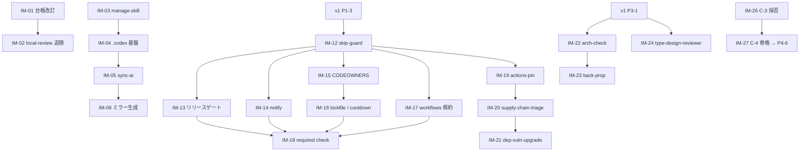

# go-boilerplate 機構 輸入作業計画

隣接する `go-boilerplate` リポジトリの開発機構のうち、本リポジトリへ輸入する対象・翻案方針・着手順序を定める。

## 0. 本書の位置づけ

- **役割分担**
  - [v1-implementation-plan.md](v1-implementation-plan.md) — v1.0.0 までの実装 PR の SSOT。本書はその PR 枠へ**輸入元と輸入すべき設計**を供給する
  - [BACKLOG.md](../adr/BACKLOG.md) 「go-boilerplate Claude 資産 移植バックログ」節 — 枠 ID との紐づけと追跡ステータスの SSOT。本書は作業定義を持ち、ステータスは持たない
  - 本書 — 比較結果と作業定義。完了した項目は BACKLOG へ反映のうえ本書から削除する(living 運用)
- **対象スナップショット**: `go-boilerplate` `.claude/`(スキル 35 / エージェント 19 / 共有スペック 5)、`.codex/`(エージェント 19 / スキル 34)、`.github/`(workflow 48 + composite action 4)、`.makefiles/` / `scripts/` / ルート lint 設定群
- **輸入の原則**
  - **ADR が正**。[AGENTS.md](../../AGENTS.md) Instruction Priority に従い、ADR で未決の領域へ go 側の規約を持ち込まない。該当枠が Accepted になるまで着手しない
  - **仕組みを輸入し、内容は翻案する**。Go / Docker / sqlc / OpenAPI 生成に依存する中身は捨て、言語非依存の構造(fan-out / read-only 分離 / ロックファイル SSOT / 検疫 / 台帳)だけを持ち込む
  - **受け皿を優先する**。v1 計画に既存 PR 枠があるものは新規枠を立てず、その PR 定義へ輸入元を書き足す

---

## 1. 差分サマリ

### 1.1 資産数

| 区分 | go-boilerplate | nextjs-boilerplate | 差分 |
| --- | --- | --- | --- |
| Claude スキル | 35 | 15 | 20 |
| Claude エージェント | 19 | 6 | 13 |
| 共有スペック(`scaffold-spec/`) | 5 | 0 | 5 |
| Codex 資産(`.codex/`) | エージェント 19 / スキル 34 | 0 | 全数 |
| GitHub workflow | 48 | 0 | 全数 |
| composite action | 4 | 0 | 全数 |

### 1.2 台帳の鮮度

BACKLOG の移植バックログ節はスナップショット「スキル 31 / エージェント 18 / 共有スペック 5」時点で書かれており、以降に go 側へ追加された次の資産が**未登録**:

| 資産 | 種別 | 本書での扱い |
| --- | --- | --- |
| `supply-chain-triage`(+ references 4) | スキル | IM-20 |
| `dep-vuln-upgrade` | スキル | IM-21 |
| `images-pin` | スキル | 対象外([0011](../adr/0011-no-docker.md) no-docker) |
| `manage-skill` | スキル | IM-03 |
| `sync-ai`(+ handoff スクリプト) | スキル | IM-05 |
| `type-design-reviewer` | エージェント | IM-24(新設枠 C-7) |

加えて `impl-review` は移植時点から機能拡張されており、本リポジトリの `local-review`(130 行)は go 側(256 行)の現行仕様に追随していない(IM-02)。

### 1.3 分類凡例

- **[A] 無翻案** — 言語非依存。パスと対象ツールの差し替えのみ
- **[B] 翻案** — 構造は流用、中身は Next.js / TypeScript へ書き換え
- **[C] 保留** — ADR 未決。該当枠が Accepted になってから着手
- **[D] 対象外** — 本リポジトリの ADR と非互換。記録のみ残す

---

## 2. 作業一覧

全 30 項目。issue 化の単位はこの 1 行 = 1 issue。「受け皿」は v1 実装計画の PR ID、`—` は新規枠。

| ID | 内容 | 分類 | 受け皿 | 依存 / トリガー |
| --- | --- | --- | --- | --- |
| **W0: 前提整備** | | | | |
| IM-01 | 移植バックログ節をスナップショット 35/19 へ改訂 | A | — | なし |
| **W1: レビュー体系の追随**(受け皿なし / 即着手可) | | | | |
| IM-02 | `local-review` を `impl-review` 現行仕様へ追随 | B | — | IM-01 |
| **W2: AI 環境二重運用**(受け皿なし / 即着手可) | | | | |
| IM-03 | `manage-skill` 移植 | A | — | なし |
| IM-04 | `.codex/` 基盤(README 対訳 / config.toml / スコープ規約) | B | — | IM-03 |
| IM-05 | `sync-ai` + handoff スクリプト双方向 | A | — | IM-03, IM-04 |
| IM-06 | `.codex/` へのスキル / エージェント一括ミラー | B | — | IM-05 |
| **W3: ローカル品質ゲート**(v1 Phase 1 併走) | | | | |
| IM-07 | commitlint | A | P1-1 | なし |
| IM-08 | lefthook の glob 別並列 + 段階設計 | B | P1-1, P1-2 | IM-07 |
| IM-09 | `.editorconfig` | B | P1-3 | なし |
| IM-10 | 抑止ポリシー様式の統一 | A | P1-2 | なし |
| IM-11 | `.makefiles/README.md`(EN) + `make help` 未文書化警告 | A | P1-3 | なし |
| **W4: CI 設計パターン**(v1 Phase 2 併走) | | | | |
| IM-12 | skip-guard ペア方式 | A | P2-1 | P1-3 |
| IM-13 | 二重リリースゲート | A | P2-2 | IM-12 |
| IM-14 | notify workflow(failure / detection 2 モード) | A | P2-1 | IM-12 |
| IM-15 | CODEOWNERS + dependabot cooldown の対構造 | A | P2-2 | IM-12 |
| IM-16 | lockfile-integrity + pnpm cooldown audit | B | P2-2 | IM-15 |
| IM-17 | workflows README + harden-runner + `cache: false` 規約 | A | P2-1 | IM-12 |
| IM-18 | `required_status_checks` の branch ruleset 反映 | A | Phase 2 完了条件 | IM-12〜IM-17 |
| **W5: サプライチェーン**(v1 Phase 2 後) | | | | |
| IM-19 | actions-pin 機構 + スキル(C-6) | B | P2-3 | IM-12 |
| IM-20 | `supply-chain-triage` スキル | B | — | IM-19 |
| IM-21 | `dep-vuln-upgrade` スキル | B | — | IM-20 |
| **W6: アーキ監査・ドリフト**(v1 Phase 3 後) | | | | |
| IM-22 | `arch-check` + 層別 auditor(C-1) | C | — | A3 Accepted + P3-1 |
| IM-23 | `back-prop` + drift-detector(C-2) | C | — | IM-22 |
| IM-24 | `type-design-reviewer`(新設枠 C-7) | C | — | A3 Accepted + P3-1 |
| IM-25 | 2 段 lint 構成の思想を ESLint へ適用 | B | P3-2 | P3-2 |
| **W7: spec / scaffold**(v1 Phase 4 前後) | | | | |
| IM-26 | C-3(spec 駆動)の採否判断 | C | — | A1 Accepted。**P4-6 着手前に決着** |
| IM-27 | C-4 の骨格のみ P4-6 へ吸収 | C | P4-6 | IM-26 |
| **W8: テスト**(v1 Phase 3 後) | | | | |
| IM-28 | `scaffold-test` / `test-review`(C-5) | C | — | P3-6 完了 |
| **W9: docs portal**(v1 Phase 8) | | | | |
| IM-29 | `portal-manifest-sync` 復活 | A | P8-2 | P8-1 |
| IM-30 | `docs/maintenance/` の新設 | B | P3-10 | P3-10 |

### 2.1 依存マップ

---

## 3. 作業定義

v1 計画に受け皿がある項目は、その PR 定義へ書き足す内容のみを記す。

### W0: 前提整備

#### IM-01: 移植バックログ節をスナップショット 35/19 へ改訂

- **目的**: 台帳が古いスナップショットを指しているため、以降の判断が go 側の現状とずれる。基準を現在へ揃える
- **主な変更先**: [BACKLOG.md](../adr/BACKLOG.md) 移植バックログ節
- **変更内容**:
  - 対象スナップショットを「スキル 35 / エージェント 19 / 共有スペック 5」+ `.codex/`(エージェント 19 / スキル 34)へ更新
  - §1.2 の未登録 6 資産を分類へ追加
  - **C-6**(actions-pin)の受け皿が P2-3 であることを明記
  - **C-7** を新設: `type-design-reviewer`。ブロック元 A3、着手トリガーは `src/model/` の型設計規約確定
  - 「対象外(D)」へ `images-pin` を追加([0011](../adr/0011-no-docker.md))
  - 本書へのリンクを張り、作業定義の所在を示す
- **完了条件**: BACKLOG の分類に go 側の全 35 スキル / 19 エージェントが漏れなく現れる
- **依存**: なし

### W1: レビュー体系の追随

#### IM-02: `local-review` を `impl-review` 現行仕様へ追随

- **目的**: 移植後に go 側で拡張された 4 機能が本リポジトリに無い。レビュー品質の差がそのまま実装品質の差になる
- **輸入元**: `.claude/skills/impl-review/SKILL.md`
- **主な変更先**: `.claude/skills/local-review/SKILL.md`(+ `SKILL.ja.md`)、`.claude/agents/adversarial-reviewer.md`、`.claude/agents/comment-reviewer.md`
- **輸入する 4 点**:

| # | 機能 | 翻案メモ |
| --- | --- | --- |
| 1 | **`test-gap` レンズ**(第 5 の code-origin レンズ) | 変更された本番コードを読み、到達可能な分岐 / 変更シンボルのうち未テスト・空虚アサートを検出。対象は `src/**` の非生成 `.ts` / `.tsx`(除外は `*.test.ts` / `gen/**`)。sentinel 検証は `require.ErrorIs` → `expect(...).toThrow(ErrClass)` 等へ読み替え。**P3-6(テスト基盤)完了まではレンズを無効化** |
| 2 | **`comment-reviewer` のライフサイクル組込 + 自動修正** | CONFIRMED なコメント指摘を 1 度の確認後に作業ツリーへ適用。ガードは Go 固有部を差し替え — 機能ディレクティブ(`// @ts-expect-error` / `biome-ignore` / `"use client"` 等)は決して削除しない、export された API の TSDoc は削除でなく書換 or 補強、生成物 / Markdown 散文 / deny リストは除外。検証は `make fix` → `pnpm lint:ci` |
| 3 | **PR インラインコメント投稿**(既定 on / `--no-comment`) | CONFIRMED + PLAUSIBLE をレンズ別に `path:line` へアンカーして投稿。REFUTED は投稿しない。**外向き操作のため投稿前に 1 度だけ確認**する規約もそのまま輸入 |
| 4 | **モデル選択**(fable / sonnet / opus / haiku、既定 auto = 実装者 ≠ レビュアー) | 無翻案 |

- **完了条件**: 5 レンズ + comment-reviewer が走り、コメント指摘が自動修正され、残る指摘が PR へインライン投稿される。`--no-comment` / `--no-apply` が効く
- **依存**: IM-01

### W2: AI 環境二重運用

#### IM-03: `manage-skill` 移植

- **目的**: スキルの新規作成・更新の単一入口を作る。これが無いと IM-05 の受け側が定まらない
- **輸入元**: `.claude/skills/manage-skill/`
- **主な変更先**: `.claude/skills/manage-skill/SKILL.md`(+ `.ja.md`)、`.claude/scripts/bootstrap-plugins.sh`
- **翻案メモ**: 公式 marketplace `anthropics/claude-plugins-official` の `skill-creator` プラグインをラップする構造は無翻案。上乗せする規約を本リポジトリのものへ差し替える — 英語正典 + `SKILL.ja.md` 対訳([0140](../adr/0140-documentation-operations.md))、スキル配置・命名・frontmatter([0154](../adr/0154-claude-skills-operations.md) / [0155](../adr/0155-claude-skills-development.md))、[AGENTS.md](../../AGENTS.md) の AI Modification Scope
- **完了条件**: `manage-skill` 経由で作成したスキルが対訳ペアと frontmatter 規約を満たす。既存 15 スキルのうち対訳片落ちの 3 件(`adr-scan` / `commit` / `tool-map`)が解消される
- **依存**: なし

#### IM-04: `.codex/` 基盤

- **目的**: Codex CLI 側の運用契約を置く器を作る
- **輸入元**: `.codex/README.md`(+ `.ja.md`)、`.codex/config.toml`
- **主な変更先**: `.codex/README.md`(+ `.ja.md`)、`.codex/config.toml`、[AGENTS.md](../../AGENTS.md) の「Agent configuration file protection」節(`.codex/` は記載済みのため確認のみ)
- **翻案メモ**: `config.toml` は codex-cli がプロジェクト設定を読まないため**「記録された意図」**である旨を go 側同様に明記する。個人設定(MCP / 認証)は `~/.codex/` へ置く分離方針も踏襲。ツール実行系の記述を Go/Docker から pnpm / mise へ差し替える
- **完了条件**: `.codex/README.md` が Claude 側 `.claude/README.md` と鏡像の構成で存在し、両者が互いを参照する
- **依存**: IM-03

#### IM-05: `sync-ai` + handoff スクリプト双方向

- **目的**: 片方の環境で更新したスキルを、もう片方へ**セマンティックに**移植する。生ディレクトリコピーを禁じ、受け側の `manage-skill` に翻案させる
- **輸入元**: `.claude/skills/sync-ai/`(+ `scripts/handoff-to-codex.sh`)、`.codex/skills/sync-ai/`(+ `scripts/handoff-to-claude.sh`)
- **主な変更先**: `.claude/skills/sync-ai/`、`.codex/skills/sync-ai/`
- **翻案メモ**: 中身は言語非依存でほぼ無翻案。**再帰防止の機構は無改造で必須輸入** — `tmp/sync-ai/.handoff.lock` の `mkdir` アトミックロック + TTL 3600s、非対話 CLI 起動、Codex sandbox の writable roots への `.codex/` 追加、Claude 側への `--permission-mode bypassPermissions` 引き渡し。`tmp/` は本リポジトリの `.gitignore` に未登録のため**併せて追加する**
- **完了条件**: 片方向ハンドオフが完走し、受け側にネイティブな形でスキルが生成される。同時起動でロックが効き再帰しない
- **依存**: IM-03, IM-04

#### IM-06: `.codex/` へのスキル / エージェント一括ミラー

- **目的**: 既存資産を Codex 側へ展開し、二重運用を成立させる
- **主な変更先**: `.codex/agents/*.toml`、`.codex/skills/*/`(`SKILL.md` + `agents/openai.yaml`)
- **翻案メモ**: **IM-05 の `sync-ai` で 1 資産ずつ駆動する**(手コピーしない)。エージェントは `name` / `description` / `developer_instructions`(日本語、read-only 規律 + プロンプトインジェクション耐性 + `file:line` 根拠必須)の TOML 形式へ。`full-verify` は `prompts/` と `scripts/run.sh` を同梱する
- **完了条件**: `.claude/` 側の全スキル / エージェントに対応する `.codex/` 資産が存在し、`tool-map` が両環境を棚卸しできる
- **依存**: IM-05

### W3: ローカル品質ゲート

v1 計画 Phase 1 の各 PR へ、以下を輸入元・輸入内容として書き足す。

| ID | 受け皿 | 書き足す内容 |
| --- | --- | --- |
| IM-07 | P1-1 | 輸入元 `commitlint.config.js`。type-enum は [0150](../adr/0150-git-workflow.md) の prefix 11 種と同一。**大文字混在のため `type-case` を課さない**点をそのまま輸入 |
| IM-08 | P1-1, P1-2 | lefthook の**段階設計**を輸入 — pre-commit = glob 別に並列発火する速い lint + キャッシュテスト / pre-push = 重い検証(秘密スキャン・フルテスト・生成物ドリフト)。現行は pre-commit 一括のため、`*.md` / `*.ts` / `.github/**` の glob 分割へ組み替える |
| IM-09 | P1-3 | `.editorconfig` を新規追加。go 側から Go 節を除去し、TS / TSX / JSON / YAML / MD / CSS の indent 規約を biome の設定と一致させる |
| IM-10 | P1-2 | **抑止ポリシー様式**を輸入 — `.gitleaks.toml` / `.gitleaksignore` / `.trivyignore.yaml` に共通する「一括無効化禁止・抑止はファイル or フィンガープリント単位・理由必須・条件が変われば削除」を各ファイル冒頭に明文化。`.gitleaksignore` は 1 行ごとに「なぜ秘密でないか」を書く |
| IM-11 | P1-3 | `.makefiles/README.md`(EN)を新設し `README.ja.md` の対訳を成立させる(現在リンク切れ)。`make help` の未文書化ターゲット警告は P1-3 に既に記載あり |

### W4: CI 設計パターン

v1 計画 Phase 2 の各 PR へ、以下を輸入元・輸入内容として書き足す。**設計そのものが輸入対象**であり、workflow の中身(golangci → biome / vitest 等)は本リポジトリのツールへ差し替える。

#### IM-12: skip-guard ペア方式(P2-1)

- **問題**: `paths:` フィルタ付きの workflow を required status check に登録すると、フィルタに合致しない PR ではコンテキストが報告されず**マージが永久にブロックされる**
- **輸入する解**: 本体の `paths:` を鏡写しにした `paths-ignore:`(branches 型は `branches-ignore:`)で**補集合側に発火し、本体と同名のジョブ名を即 success で報告する** guard workflow を対で置く。両方発火した場合 GitHub は同名チェック全部の成功を要求するため、guard が本体の失敗を隠すことは構造上起こらない
- **注意**: guard と本体のフィルタ同期がメンテコストになる点も併せて記録する
- **完了条件**: paths フィルタ付き workflow のすべてに guard が対で存在し、対象外 PR でもチェックが緑で報告される

#### IM-13: 二重リリースゲート(P2-2)

- **輸入する解**: 通常 PR ではスキャナを report-only とし、`develop` / `staging` / `production` 宛て PR でのみブロックする専用 workflow を置く。「その PR が持ち込んだ脆弱性でないもので通常 PR を止めない、しかし昇格時には必ず止める」
- **翻案メモ**: go 側の `trivy-release-gate` / `osv-release-gate` に相当するものを、P2-2 が導入する trivy / `pnpm audit` / osv-scanner に対して置く。osv-scanner・dependency-review・CodeQL(js-ts)・gitleaks・TruffleHog・zizmor・Scorecard は**そのまま使える**

#### IM-14: notify workflow(P2-1)

- **輸入する解**: `workflow_call` の再利用 workflow を 1 本置き、**failure モード**(scheduled 失敗は誰の目にも入らないため通知)と **detection モード**(report-only スキャナの検知を webhook へ)を持たせる。webhook 未設定なら green のままスキップする

#### IM-15: CODEOWNERS + dependabot cooldown(P2-2)

- **輸入する解**: 検知と強制を**対**にする。dependabot の cooldown(patch 5 / minor 7 / major 30 日、security は即時)が「入りにくくする」側、CODEOWNERS が「入るときに必ず人が見る」側
- **主な変更先**: `.github/CODEOWNERS`(新規) — サプライチェーン統制ファイル限定で `pnpm-lock.yaml` / `.npmrc` / `actions-pin.toml` / `package.json` を owner レビュー必須に。`.github/dependabot.yml` は P2-2 に記載済み
- **翻案メモ**: go 側の gomod / docker エコシステムを削り、`npm`(pnpm)+ `github-actions` の 2 つに絞る

#### IM-16: lockfile-integrity + pnpm cooldown audit(P2-2)

- **輸入する解**: lockfile の各 entry の resolved URL が公式レジストリ + HTTPS かを検証する workflow(lockfile-lint)と、lockfile の各 entry を `.npmrc` の `min-release-age` と突合する report-only 監査
- **翻案メモ**: go 側の cooldown 監査は Go 実装かつ `package-lock.json` 前提。**`pnpm-lock.yaml` 対応の TS 実装として書き直す**。「設計として絶対に fail しない」性質をツール側に内蔵し、YAML 編集でゲート化できないようにする点は無翻案で輸入

#### IM-17: workflows 規約(P2-1)

- **輸入する解**: `.github/workflows/README.md`(+ 対訳)にトリガ戦略表と全 workflow 表を置く文書化様式。全ジョブ先頭の `step-security/harden-runner`(egress-policy: audit)。**`security-events: write` を持つジョブは `cache: false`**(低権限 run が書いたキャッシュを高権限 run が実行しない)。weekly cron は 1 時間ずつずらして渋滞を避ける

#### IM-18: required_status_checks の反映(Phase 2 完了条件)

- **輸入する解**: `.github/settings/branch-protection.json` に `required_status_checks` ルールを記載し `make apply-branch-protection` で適用する。**記載するまではすべて report のみ**である事実を明記する
- **注意**: GitHub 側への適用はユーザが実施(v1 計画 Phase 2 完了条件と同じ)

### W5: サプライチェーン

#### IM-19: actions-pin 機構 + スキル(C-6 / 受け皿 P2-3)

P2-3 に受け皿があり、そこへ書き足す:

- `git ls-remote` で `uses:` のタグ → SHA を解決し、ロックファイル `actions-pin.toml` を SSOT とする **resolve / apply / check の三相**構造
- **検疫**: `PIN_ACTIONS_MIN_AGE_DAYS`(既定 14)未満の新リリースは自動採用せず、1 つ前へ step-back する
- **再ポイントタグ検知**: 既知 SHA と現在の解決結果の乖離を fail 扱いにする
- `check` は fail-closed(未登録 / 未固定の `uses:` は error)
- Go 実装のため TS への書き換えが必要(P2-3 に記載済み)

#### IM-20: `supply-chain-triage` スキル

- **目的**: 検疫に掛かったアーティファクトを、勘でなく**直接証拠**で判定する。IM-19 / `tools-upgrade` の検疫が引っ掛けた 1 件を人間が捌けるようにする
- **輸入元**: `.claude/skills/supply-chain-triage/`(+ `references/npm.md` / `github-actions.md` / `go-modules.md` / `docker-images.md`)
- **主な変更先**: `.claude/skills/supply-chain-triage/SKILL.md`(+ `.ja.md`)、`references/npm.md`、`references/github-actions.md`
- **翻案メモ**: **references は npm / github-actions の 2 本のみ採用**し、`go-modules.md` / `docker-images.md` は捨てる([0011](../adr/0011-no-docker.md))。0–12 のスコアリングと **report-only(絶対に実行しない)** 原則は無翻案。参照する自リポジトリのセキュリティ観点は、go 側の `docs/design/security.md` に代えて [0110](../adr/0110-security-operations.md) / [0111](../adr/0111-csp-security-headers.md) を読ませる
- **完了条件**: 検疫に掛かった 1 パッケージについて、直接証拠つきのスコアと採否推奨が出る。スキルが npm install / 実行を一切行わない
- **依存**: IM-19

#### IM-21: `dep-vuln-upgrade` スキル

- **目的**: CVE / GHSA を名指しで受け取り、当該依存だけをピンポイントに上げる。`tools-upgrade`(定期一括)/ `node-upgrade`(単一ランタイム)と役割を分ける
- **輸入元**: `.claude/skills/dep-vuln-upgrade/`
- **翻案メモ**: go 側は npm(overrides)と Go(`go get` / `tidy` / `vendor`)の二本立て。**npm 側だけを採り**、pnpm の `overrides` / `pnpm.overrides` へ読み替える。`.npmrc` の cooldown 整合チェックは IM-16 と対にする
- **完了条件**: GHSA ID を渡すと該当依存が最小差分で更新され、`pnpm audit` が当該項目を解消する
- **依存**: IM-20

### W6: アーキ監査・ドリフト

いずれも ADR 未決を含むため、トリガーが立つまで着手しない。

#### IM-22: `arch-check` + 層別 auditor(C-1)

- **トリガー**: A3 Accepted + P3-1(11 カーネル物理化 + 層別 README)完了
- **輸入する骨格**: integrator が lint を 1 回だけ実行し、層別 auditor を**並列 fan-out** する。各 auditor は**自層の README を正として実行時に読み込む**(規約をエージェント本文にハードコードしない)。TODO ハンドオフコメントは opt-in
- **翻案メモ**: 層マッピングを go の domain / usecase / controller / infra / pkg から、本リポジトリの 11 カーネルへ差し替える。**`full-verify` Pass 1 との分担を SKILL.md に明記する**(`arch-check` = 層規約の準拠検査 / `full-verify` Pass 1 = 構造設計の妥当性)

#### IM-23: `back-prop` + drift-detector(C-2)

- **トリガー**: IM-22 と同時期
- **輸入する骨格**: 検出カテゴリ A(README → Code)/ B(Code → README 未文書化)/ C(Skill ↔ README 重複)と、**検出は read-only subagent・承認と書き込みは integrator** の分離
- **翻案メモ**: `sync-readme`(構造ドリフト)との分担を明記する

#### IM-24: `type-design-reviewer`(新設枠 C-7)

- **トリガー**: A3 Accepted + `src/model/` の型設計規約確定
- **目的**: `arch-auditor` 系の二値判定では拾えない「規約は満たすが弱い型」を程度で拾う
- **輸入元**: `.claude/agents/type-design-reviewer.md`
- **翻案メモ**: 4 軸ルーブリック(Encapsulation / Invariant Expression / Invariant Usefulness / Invariant Enforcement、各 1–10)は Anthropic 公式 `pr-review-toolkit` の `type-design-analyzer`(MIT)由来で**言語非依存**。Go の非公開フィールド + getter / `New()` 不変条件検査を、TypeScript の branded type / `readonly` / zod schema による parse-don't-validate / factory 関数へ読み替える。**Attribution 記述はそのまま残す**。読み込む正典は `internal/domain/README.md` + `docs/rules.md` から `src/model/README.md` + `docs/rules.md`(P3-9)へ差し替える

#### IM-25: 2 段 lint 構成の思想を ESLint へ適用(受け皿 P3-2)

- **輸入する解**: go 側の `.golangci.yaml`(IDE 用・最小)と `.golangci-full.yaml`(CI の正・フル)の二層。**ゲートにすべきルールは full 側にだけ置き、両者のドリフトは意図的**とする
- **翻案メモ**: 本リポジトリは biome で既に同型(`biome.json` / `biome.ci.jsonc`)。P3-2 で ESLint を境界検査に導入する際、**同じ二層(エディタ用軽量 / CI 用フル)を最初から適用する**。無効化したルールを理由付きでコメントカタログ化する様式も輸入

### W7: spec / scaffold

#### IM-26: C-3(spec 駆動)の採否判断

- **判断すべきこと**: `docs/spec/<feature>/` に domain / usecase の 2 層 spec を置き、そこから実装を生成する **lean A 方式を採るか**
- **輸入可能な設計(採用する場合)**: **spec フォーマットを外部ファイル(`.claude/scaffold-spec/*`)から実行時に読み込む = SSOT** という構造は言語非依存。フォーマット変更がスキル改修なしで伝播する
- **注意**: v1 計画の **P4-6(スキャフォールドジェネレータ)は `architecture.ts` を読んで生成する方式**であり、spec 駆動とは前提が異なる。**両方を持つと SSOT が二重化する**ため、P4-6 着手前に決着させる
- **不採用の場合**: C-3 の全資産(`new-spec` / `new-spec-{domain,usecase}` / `verify-spec` / `spec-validator-*` / `scaffold-spec/*`)を破棄と記録する
- **トリガー**: A1 Accepted。遅くとも P4-6 着手前

#### IM-27: C-4 の骨格のみ P4-6 へ吸収

- go の onion + sqlc / OpenAPI 前提は表示層に載らない(DB が無い)。輸入するのは 2 点のみ:
  - **chain 構造** — 生成を段階に分け、前段の検証が通らなければ次段へ進まない
  - **halt / hand-off** — 生成由来のマッピングを name-match で導出し、**導出不能なら自動ロールバックせず TODO を残して停止する**
- **受け皿**: P4-6。上記 2 点を設計として書き足す

### W8: テスト

#### IM-28: `scaffold-test` / `test-review`(C-5)

- **トリガー**: P3-6(テスト基盤 Vitest + RTL + MSW)完了
- **輸入する骨格**:
  - `scaffold-test` — **テスト観点を README から実行時に導出**する構造。「1 関数 = 1 テスト」「正常系 / 異常系のグループ分け」「table-driven 禁止」は [0090](../adr/0090-testing-strategy.md) / [0091](../adr/0091-test-verification-methods.md) の規約に置き換える
  - `test-review` — 5 レンズ二段レビュー(構造準拠 / 観点カバレッジ / 意味品質 / 分岐 × 意味網羅 / 対象シンボル完全性)。**既移植の `adversarial-reviewer` / `review-verifier` を再利用**する
- **併せて見直す**: `full-apply` / `node-upgrade` / `repo-ops` に残る `pnpm test` の条件分岐(テスト基盤が無い前提で書かれている)

### W9: docs portal

#### IM-29: `portal-manifest-sync` 復活(受け皿 P8-2)

P8-2 に受け皿があり、そこへ書き足す: pair_drift preflight → N1(API ドキュメント)フィルタ → manual-worthiness 判定の順。判定基準は `readme-review` が SSOT で、`portal-manifest-sync` は基準を持たない。

#### IM-30: `docs/maintenance/` の新設(受け皿 P3-10)

- **目的**: スキルが実行時に読む手順書の置き場を作る。現在は手順がスキル本文に埋まっており、スキル改修なしに手順を直せない
- **翻案メモ**: go 側の `docs/maintenance/` から、本リポジトリに実在するものだけを採る — `node-upgrade.md`(go-upgrade.md 相当)、`portal-manifest.md`(P8-1 と同時)、`docs-structure.md`。Docker / DB 系(`db-worktree-pool.md` / `local-environment.md`)は対象外

---

## 4. 対象外(記録)

| 資産 | 理由 |
| --- | --- |
| `images-pin` / `.hadolint.yaml` / `trivy-config` / `image-scan` | [0011](../adr/0011-no-docker.md) no-docker |
| `go-upgrade` | `node-upgrade` として翻案移植済み |
| `*-boot-check`(3 種)/ `gen-*-artifacts-check`(4 種)/ `migration-check` / `sql-lint`(sqlfluff) | Go / DB / コード生成固有。ただし「生成物ドリフト検証」の型は P4-2(orval)導入時に再検討する |
| `govulncheck` / `capslock` / `fuzz` | Go 固有 |
| `scaffold-infra-db` | 表示層に DB を持たない([0070](../adr/0070-backend-role-separation.md)) |
| `.spectral.yaml` / `redocly.yaml` | OpenAPI を**書かない**(取得する側)。P4-1 で契約を取得する形が固まったら再検討 |
| `repo-ops` の Docker / sqlc 項目 | 移植済みの器のみ採用。BACKLOG に記載済み |
| `new-env` の再設計 | 本書の対象外。A7 の実装タスクとして BACKLOG が追跡 |
| `sync-versions-check` | v1 計画 §5 未決 #11(Phase 2 実装時に採否判断)へ委譲 |

---

## 5. 本書の運用

- **living 運用**: 完了した項目は [BACKLOG.md](../adr/BACKLOG.md) へ反映のうえ本書から削除する
- go 側が再度強化された場合は §1.1 のスナップショットを取り直し、差分を作業一覧へ追加する
- 判断の経緯・比較検討は本書に書かない([v1-implementation-plan.md](v1-implementation-plan.md) §2 の暫定規約に従う)
