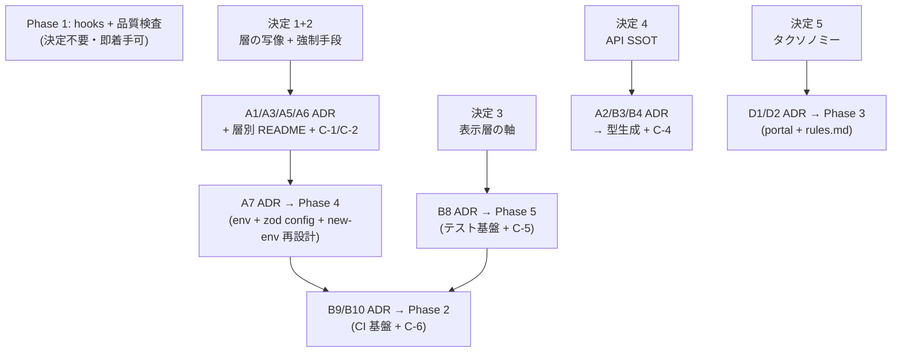

# 実装フェーズ前の決定事項と決定後アクション

「べき論かつ go-boilerplate 実体に最大限準拠する」方針のもと、実装フェーズ前に**ユーザが決める必要が残るもの**と、**各決定が下りたら動く内容**を整理した計画書。

- 作成日: 2026-07-12
- 前提方針: 同階層の `go-boilerplate` リポジトリの実体(ADR 95 本 / rules.md / テスト規約 / CI 26 本 / portal 運用)を正とし、Next.js 表示層に写像できないものだけを個別に決定する
- 関連文書:
  - [docs/adr/BACKLOG.md](../adr/BACKLOG.md) — 枠 ID(A1〜D6)と依存マップ、Claude 資産移植バックログ(C-1〜C-6)
  - [docs/plan/go-boilerplate-feature-port-plan.md](go-boilerplate-feature-port-plan.md) — リポジトリ機能移植の Phase 1〜5 計画
  - [docs/plan/go-boilerplate-feature-port-candidates.md](go-boilerplate-feature-port-candidates.md) — 移植候補インベントリ

## 全体像

go-boilerplate 準拠により、BACKLOG の未決定枠の大半は「go 側 ADR の翻案(写経)」に縮退する。ユーザ決定が本当に必要なのは以下の **5 点**。この 5 点が決まれば、残りの ADR は AI がドラフトを量産でき(Accepted 判断はユーザ)、移植計画書の Phase 2〜5 とスキル移植 C-1〜C-6 が全てアンブロックされる。

| # | 決定テーマ | 対応 BACKLOG 枠 | 決まると動くもの(要約) |
| --- | --- | --- | --- |
| 決定 1 ✅ | 層の写像 → **B 改 2: 機能スライス × 表示層カーネル**(`app / features / model / components / adapters / config / errors / logging / observability`。go 語彙 domain/usecase 不採用(ADR 0011 整合)+ 命名規律(役割名のみ)+ 横断関心事は go 式に第一階層分離・各所フラット。詳細は [a1-layer-mapping-options.md](a1-layer-mapping-options.md)) | A1 / A3(→ A5 / A6) | A 系 ADR ドラフト、層別 README 整備、C-1 / C-2 / C-3 |
| 決定 2 ✅ | 層規約の機械的強制手段 → **biome 優先 + biome 非対応の検査のみ ESLint で補完**(ADR 0002 改定要) | A3 付随(T2 = ADR 0002 改定) | A3 ADR の Enforcement 節、B9 CI job への組込み |
| 決定 3 ✅ | 表示層固有の軸 → 大半は既存 ADR / 決定 1 から**導出**(A4 追認 / B1 Tailwind 追認 / **B2・B5 は fork 先判断の exclusion** / B8 = Vitest+RTL+MSW+Playwright、実装中に補正可) | A4 / B1 / B2 / B5 / B8 | A4・B 系 ADR、Phase 5(テスト基盤)、C-5 |
| 決定 4 ✅ | API 契約 SSOT → **バックエンドリポの `openapi.gen.yaml` を gh 経由で取り込む**(setup 時に座標を静的マニフェスト化 → make/pnpm で取得・`info.version` に backend short SHA 付与) | A2 / B3 / B4 | A2・B3・B4 ADR、型生成パイプライン、C-4 |
| 決定 5 ✅ | ADR タクソノミー → **rule は最終的に `rules.md` へ集約**(AGENTS.md 肥大回避)/ decision・exclusion=ADR / inventory=BACKLOG / EN・JA=追認。**0.0.x の ADR は living(改定履歴なし)、不可変化・採番確定は v1 凍結時から** | D1(→ D2) | D1・D2 ADR、rules.md 新設、Phase 3(portal) |

Phase 1(commitlint / md lint / secret・脆弱性スキャン)は**決定不要で即着手可能**(go 側に `commitlint.config.js` / `.gitleaks.toml` の完成形実体あり)。なお **lefthook は 2026-07-12 に導入済み(G2 解消)** — Phase 1 の残スコープは移植計画書 PR 1-1 の更新注記を参照。

---

## 決定 1: 層の写像 — 責務分離のきり方(A1 / A3)— ✅ 方針決定済(2026-07-12)

**採用: パターン B 改 2(機能スライス × 表示層カーネル)** — `src/{app, features/<name>, model, components, adapters, config, errors, logging, observability}`。go の層語彙 `domain` / `usecase` は ADR 0011(表示層ロール)との混同防止のため不採用とし、go 対応は層マッピング表で担保。カーネルは**役割名のみ許可**の命名規律を新設(`common` / `shared` / `utils` / `lib` 等禁止)。横断関心事(config / errors / logging / observability)は go 式に第一階層へ分離し、各ディレクトリ内はフラット共置を基本(ネスト深化防止)。物理ディレクトリは対応決定(A7 / B6 / B7)が下りた時に作成。受入基準は go `pkg/README.md` Policy の翻案。選択肢比較・依存ルール・整合確認・ADR 0011 差異検討・ADR 化時の明示事項は [a1-layer-mapping-options.md](a1-layer-mapping-options.md) を正とする。以下の「決めること」は同文書で回答済み。残 = A1/A3 ADR ドラフト作成 → Accepted → 「決まったら動く」の実行。

### go 側の実体(原則としてそのまま持ち込む部分)

- Pragmatic Onion(`docs/adr/0002`): `controller → usecase → domain`、infrastructure は domain の interface を実装
- 依存は常に内向き(`docs/rules.md` Layer Dependency Rules)
- usecase は boundary interface 経由でのみ外側に触れる(DI 注入)
- 生成型(sqlc / OpenAPI)を内層に漏らさない型漏洩禁止(DTO/Type Boundary)
- 各層 README(`internal/**/README.md`)が正 — 監査・テスト観点の実行時読込元
- REST / Worker / Job は driving adapter であり分割軸にしない(`docs/adr/0005`)

### 決めること

- Next.js における層の実体: `components` / `hooks` / `features` / `lib` 等の物理配置と、onion の各層(domain 相当 / usecase 相当 / controller 相当)への対応付け
- RSC(Server Components)は「controller と view が同居する」ため、onion の写像が素直に切れない — この境界をどこに引くか
- 「route(App Router セグメント)= driving adapter であり分割軸にしない」翻案を採用するか
- ドメインロジックはバックエンド側(BACKLOG out of scope)である前提で、表示層に残る「domain 相当」(表示用 ValueObject / フォーマッタ等)の範囲

### 決まったら動く

1. A1(採用アーキテクチャ)・A3(フロント内責務分離)ADR ドラフト作成 → Accepted **[完了: ADR 0020 / 0021]**
2. A5(ディレクトリ構造)・A6(命名規則)ADR — 層の実体が決まれば go 側規約の翻案でほぼ自動確定 **[完了: ADR 0027 / 0028(2026-07-12)。A6 の命名方針は Next.js > React > nextjs-boilerplate 自身・業界スタンダード優先(2026-07-12 ユーザ変更。go-boilerplate は命名の権威に置かない)= 全ソース kebab-case 統一・特殊ファイル/route は Next.js 小文字規約・識別子は React 規約]**
3. `src/**` への層別 README 整備(go の per-package README ペア方式)
4. C-1(arch-check + 層別監査エージェント)/ C-2(back-prop + drift-detector)スキル移植 — 層マッピング差し替えのみ
5. C-3(spec 駆動 scaffold)の採否確定 — A1 で「spec 駆動を採用」と決めた場合のみ移植、不採用なら破棄
6. AGENTS.md の該当 `[TODO]` セクション(Overall Architecture / Frontend Responsibility / Directory Structure / Naming)削除提案

---

## 決定 2: 層規約の機械的強制手段 — ✅ 完了(2026-07-12・ADR 反映済)

**決定・運用ルールの正は [ADR 0002](../adr/0002-formatter-linter.md)「ESLint による補完」節に移管済み**(biome 優先 / 能力ベース / 重複禁止 / 縮小方向・移管。移管判定 = [0004](../adr/0004-library-management.md) 定期監査、hook 組込み = [0151](../adr/0151-git-hooks.md))。連動反映済み: `docs/adr/README.md` / BACKLOG T2(✅→⚠️)。ADR 0002 本体はユーザ stash 由来の biome 2.5.3 + プロファイル分割(`biome.json` / `biome.ci.jsonc`)とマージ適用。

残タスク:

1. ~~**AGENTS.md 4 箇所の連動変更**~~ → ✅ **2026-07-12 適用済み**(deny 一時解除 → A-1/A-2 = ESLint 改定分、A-3/A-4 = scripts 分割(`lint:ci` / `typecheck`)追従分を適用 → deny 復元)。文面は本書末尾「付録 A」に記録として残置
2. ESLint 実導入 PR — **A3([0021](../adr/0021-frontend-responsibility.md))Accepted 済(2026-07-12)によりアンブロック済み**。0021 でプラグイン(`eslint-plugin-boundaries`)・層定義(依存マトリクス)・severity(error)確定。残る実装 = `eslint.config.mjs` 具体記述 + exact pin + `pnpm audit` + flat config + `lint:ci` 直列(超過時 pre-push 退避)
3. C-1(arch-check)との分担明記(静的強制 = ESLint / 意味的監査 = スキル)+ `.claude/skills/` の biome 一本化前提記述の更新(付録 A 参照)

---

## 決定 3: 表示層固有の軸(A4 / B1 / B2 / B5 / B8)— ✅ 方針決定済(2026-07-12)/ ✅ ADR 化完了(2026-07-12)

当初「go に対応物がなく寄せても決まらない」としていたが、**大半は既存 ADR・決定 1 から導出でき**、純粋な選定は B8 のみだった(それも 0004 基準で一意)。以下は導出結果。

> **[成文化済み]** — A4 = [ADR 0040](../adr/0040-routing-rendering-strategy.md) / B1 = [ADR 0050](../adr/0050-styling-strategy.md) / B2 = [ADR 0052](../adr/0052-ui-component-policy.md)(exclusion)/ B5 = [ADR 0013](../adr/0060-state-management.md)(exclusion + 既定)/ B8 = [ADR 0014](../adr/0090-testing-strategy.md)。以降は各 ADR が正、本節は導出経緯の記録。

### A4: ルーティング・レンダリング戦略 — 追認 ADR

| 論点 | 結論 | 導出元 |
| --- | --- | --- |
| App Router / Server Components 既定 | 採用 | AGENTS.md 暫定挙動 + de facto |
| `"use client"` の置き方 | feature 内の葉に押し下げ | 決定 1(B 改 2) |
| Server Actions | **採用**(feature 内 `actions.ts` = controller 相当、編成のみ・ロジック禁止) | 決定 1(置き場を決めた時点で採否確定) |
| page.tsx の責務 | 薄い driving adapter | 決定 1 + ADR 0011(thin proxy) |
| CSR/SSR/SSG/ISR | **特定モードを強制しない**(静的書き出しと SSR の両対応を保つ) | ADR 0011 想定デプロイ表(静的 CDN と SSR PaaS を両方主想定 → boilerplate 本体はどのモードも閉ざさない) |
| `loading.tsx` / `error.tsx` 配置 | B6(エラー)と併せて決める | — |

### B1: スタイリング — 追認 + 小決定

- Tailwind 単独(CSS Modules / styled-components 不採用)は de facto + AGENTS.md 暫定の追認で確定
- `cn()` ヘルパは採用し、置き場は `components` カーネル内(決定 1 命名規律。`utils/` は禁止)。design token は CSS 変数で管理 — この 2 点のみ小さな確定事項

### B2 / B5: UI ライブラリ・クライアント状態 — **exclusion(fork 先判断)**

- shadcn/ui 等の UI ライブラリ、グローバル状態(Zustand / Jotai)、form state ライブラリは **boilerplate 本体に同梱しない**。用途依存のため fork 先で必要時に判断
- 導出元: ADR 0011 の「用途未定の表示層」ロール定義 + BACKLOG out of scope 原則(認証・DB を fork 先判断とするのと同じ論理)+ AGENTS.md 暫定(グローバル状態ライブラリ導入禁止・local state から)
- **exclusion ADR として記録**(決定 5 のタクソノミーで exclusion=ADR)。Server state は「Server Component fetch 既定」で確定済み

### B8: テスト — 戦略は go 準拠、FW は **Vitest + RTL + MSW + Playwright**

go 準拠で自動確定する戦略(不変):

- co-location(実装の隣に配置)/ `正常系`・`異常系` の日本語命名 / table-driven 禁止・sequential sibling 方式
- カバレッジ 90% ハードゲート(`cover-gate`)+ octocov PR レポート + 除外 glob
- カバレッジ例外は所有パッケージ README に記録 + 承認(超法規的措置の統治)
- integration = HTTP boundary のみ・内側 mock・型/形状アサート(値の正しさは unit で担保)
- 二層実行: CI = 厳格キャッシュ無効 / pre-commit = 高速キャッシュ有効

**FW 選定(2026-07-12 決定)**: Vitest + React Testing Library + MSW + Playwright(0004 の選定基準 = メンテ活発・エコシステム標準 から実質一意)。**実装中に不都合が出たら補正する**前提。以下の写像は実装時に確定:

- 「integration = HTTP boundary で mock」の Next.js 写像(route handler / RSC / E2E の線引き)
- Server Components のテスト方針
- mock 戦略の翻案(gomock 生成 → `vi.mock` / MSW / 手書き禁止ルールの読み替え)

### 決まったら動く

1. A4 / B1 ADR ドラフト(追認)+ B2 / B5 **exclusion** ADR → Accepted
2. B8 ADR → **Phase 5(テスト基盤)着手**: FW 導入 + `make test` / `test-cached` 二層 + lefthook 接続 + カバレッジゲート CI
3. C-5(scaffold-test / scaffold-integration-test / test-review スキル)移植 — テスト観点の README 実行時導出 + 2 段レビュー構造は流用
4. full-apply / node-upgrade / repo-ops スキルの `pnpm test` 条件分岐見直し
5. AGENTS.md の該当 `[TODO]` セクション(Routing & Rendering / Styling / State Management / Testing Strategy)削除提案

---

## 決定 4: API 契約 SSOT の所在(A2 / B3 / B4)— ✅ 方針決定済(2026-07-12)/ ✅ ADR 化完了(2026-07-13)

> **[成文化済み]** — A2 = [ADR 0015](../adr/0070-backend-role-separation.md) / B3 = [ADR 0016](../adr/0071-bff-api-integration.md) / B4 = [ADR 0017](../adr/0072-api-type-generation.md)。以降は各 ADR が正、本節は導出経緯の記録。
> **ADR 化時のユーザ決定(2026-07-13)**: (1) B4 の生成方式を「型のみ(openapi-typescript)」→ **型 + runtime validation(orval で zod 生成)** に変更(go 境界値所有哲学 = フロントが response 検証の最後の砦、に忠実化)。(2) B3 の fetch wrapper は **go ADR 0019 resilience を広く翻案**(dual timeout + idempotent retry + retry budget + circuit breaker)。

### 背景

go-boilerplate は OpenAPI-first(`docs/adr/0009`)で `openapi/` を**同一リポ**に持ち、Redocly でバンドル(`openapi.gen.yaml` をコミット・契約成果物として保持)→ oapi-codegen で生成する。さらに go 側 **ADR 0012 が「バンドル済み `openapi.gen.yaml` をクロスリポ契約成果物として保持」と宣言済み** = 消費側(本リポ)はこの成果物を参照する、が対の相手側で既に決まっている。

### 決定: バックエンドリポの `openapi.gen.yaml` を gh 経由で取り込む

**SSOT はバックエンドリポの `openapi.gen.yaml`**(go ADR 0012 の成果物)。取得メカニズムは以下:

1. **セットアップ時(一度)**: セットアップスクリプト(`gh` コマンド形式)に **バックエンドのリポジトリ名** と **リポジトリルートからの `openapi.gen.yaml` へのパス** を渡す。この座標を**静的な設定ファイル(マニフェスト)**としてこのリポに保存する
2. **取得時(`make` または `pnpm` コマンド)**: 記録した座標から `gh` 経由で `openapi.gen.yaml` をこのリポへコピーする。このとき **openapi の `info.version` の末尾にバックエンドコミットの short SHA を付与**し、取り込んだ spec がどのバックエンドコミット由来か一意に定まるようにする
3. コピーした spec は生成入力(do-not-edit)。**orval で zod スキーマ + 型を生成**(型 + runtime validation。B4。※当初 openapi-typescript 型のみ → 2026-07-13 変更)

- **利点**: フロント側の型がどのバックエンド版に対応するかを short SHA で追跡可能(デバッグ・互換確認)。drift gate は「再取得して差分が出ないか」で検査
- **接続**: セットアップスクリプト側は移植インベントリ **A-9(setup スクリプト拡充)** の枠組みに載る

### go 準拠で自動確定する部分(写経)

- OpenAPI = API の SSOT / 手書き型の重複禁止
- 生成器の翻案: oapi-codegen → **orval(zod + 型生成)**(go ADR 0012 が消費者パスに名指し。型 + runtime validation。※当初案 openapi-typescript 型のみから 2026-07-13 変更)
- 生成物は `gen/` 配置 + do-not-edit ルール + 生成物 drift の CI ゲート(`docs/adr/0076` 相当)
- boundary value ownership(「request ⊂ domain ⊂ response」/ wire contract はドメインルールではない)の哲学
- A2(BFF 境界)は ADR 0011 の thin proxy と一致で確定済み

### 決まったら動く

1. A2(バックエンド役割分離 — BFF 境界 / `/api/*` 責務)・B3(fetch wrapper / API クライアント配置)・B4(型生成 + 上記取り込みパイプライン)ADR ドラフト → Accepted
2. 取り込み + 型生成パイプライン導入 PR(setup マニフェスト + `gh` 取得 + short SHA スタンプ + `make gen-api` 相当 + drift gate)
3. C-4(scaffold-endpoint 系スキル)翻案 — chain 構造と「gen 由来マッピング name-match 導出 → 不能なら halt」骨格のみ流用(翻案コスト最大)
4. AGENTS.md の該当 `[TODO]` セクション(Backend Role Separation / BFF・API / Type Generation)削除提案

---

## 決定 5: ADR タクソノミー(D1 / D2)— ✅ 方針決定済(2026-07-12・採番のみ保留)/ ✅ ADR 化完了(2026-07-13)

> **[成文化済み]** — D1 = [ADR 0140](../adr/0140-documentation-operations.md) / D2 = [ADR 0141](../adr/0141-portal-operations.md)。以降は各 ADR が正、本節は導出経緯の記録。
> **ADR 化時のユーザ決定(2026-07-13)**: canonical 言語モデル = **EN canonical + JA mirror(go ADR 0008)を最終目標として方向宣言・0.0.x は日本語 canonical のまま living・実移行は v1 大規模整理**(採番・不可変化と同じ v1 境界)。下記「EN canonical / JA ペア」の de facto 追認はこの「方向宣言 + v1 移行」に確定。

go 側の 4 分類タクソノミー(参考):

| 分類 | 意味 | go の置き場 |
| --- | --- | --- |
| decision | 選択肢からの選定 | `docs/adr/`(MADR-lite) |
| exclusion | 「意図的にやらない」判断 | `docs/adr/`(`setup-review` タグ) |
| rule | 日常的に強制される制約 | `docs/rules.md` |
| inventory | コードと共にドリフトする目録 | living doc |

### 決定

| 分類 | 本リポの置き場 | 備考 |
| --- | --- | --- |
| decision | `docs/adr/` | 現行追認 |
| exclusion | `docs/adr/` | B2 / B5 等の「fork 先判断」をここに記録 |
| rule | **最終的に `rules.md` へ集約** | **AGENTS.md が確実に肥大化するため、rule は `rules.md` に集約する。** 段階移行でよい(AGENTS.md の rule を順次 `rules.md` へ移す)。※ [0152](../adr/0152-agents-md-policy.md)「AGENTS.md = 規約集約ファイル」の一部を更新する含意 → D1 ADR 化時に 0152 の該当節を整合(supersede/追記) |
| inventory | BACKLOG + 候補インベントリ | 現行追認 |

- **EN canonical / JA ペア**: **方向は EN canonical + JA mirror(go ADR 0008 翻案)、移行は v1**(2026-07-13 ユーザ決定)。0.0.x は日本語 canonical のまま living。移行時は `canonicalize-doc` スキル(0154/0005 公認)で実施。詳細は [ADR 0140](../adr/0140-documentation-operations.md)
- **ADR の不可変性 = v1 凍結時から**(2026-07-12 更新): **0.0.x(pre-v1)の ADR は living document** として本文をクリーンに直接上書きし、設計フェーズの逐次改定を改定履歴に残さない(0.0.x なので過去記述の破棄を許容 — ユーザ決定)。**不可変化 + 改定履歴(or supersede)の規律は v1 凍結時から開始**し、採番確定と同じ v1 境界で行う。それまでに 0002 / 0004 / 0151 へ一時的に入れていた改定履歴表は撤去済み(各 ADR Status に living document である旨を注記)
  - v1 凍結時に決める: 履歴の記録方式(in-place + 改定履歴表 vs go 式 immutable + supersede)。`docs/adr/README.md` の不可変性・履歴・「連番管理」記述の整合もそこで確定
- **採番方式 = 確定(2026-07-14 ユーザ決定)**: **ブロック帯(0001〜0155 を主題ブロックで採番)**とする。系列プレフィックス(`Dev-` / `Toolchain-`)は数値列(`0150` 番台等)へ畳み込み、全 ADR ファイルをリネーム + 相互参照を一括更新した。`docs/adr/README.md`「連番管理」記述は実体と整合済み。旧 Status の暫定/単調連番の記述は同日除去した

### 決まったら動く

1. D1(ドキュメント運用: canonical/翻訳ペア + 上記タクソノミー + 改定履歴規約)・D2(portal 登録基準)ADR ドラフト → Accepted
2. `docs/rules.md` 新設 + AGENTS.md からの rule 段階移行 + 0152 整合 + exclusion ADR の運用開始
3. **Phase 3(docs ポータル)着手**: portal 基盤移植(manifest.yaml + gen スクリプト + SPA)+ Pages 配信(Phase 2 完了後)+ portal-manifest-sync スキル復活
4. 既存ドキュメントの EN canonical 化 / `docs/ja/` ツリー整備

---

## 決定不要 — go 準拠で自動的に決まるもの(写経+翻案リスト)

以下は各決定の後、AI が go 側実体を翻案して ADR ドラフト・実装 PR を作成できる。「追加軸」= go に対応物がなく翻案時に小さな判断が要る部分(ドラフト時に選択肢を添えてユーザ確認)。

| 枠 | go 側の参照実体 | 翻案ポイント | 追加軸 |
| --- | --- | --- | --- |
| A6 命名 | env 変数 `{SUBSYSTEM}_{NAME}` / ADR `NNNN-kebab` / テスト命名規約 | ほぼ as-is | React コンポーネント / hook のファイル命名のみ新規 |
| A7 環境変数 | `env/.env.{ci,dev,stg,prd}` + `.env`(local)/ `env/README.md` 変数表 / envspec・model・config 三点セット / immutable fail-fast(`adr/0036`)/ default-vs-required 統治(`adr/0035`)/ Secret required・recommended ラベル | 三点セット → zod ベース loader。**詳細は後述「A7 の翻案方針(討議確定)」** | **`NEXT_PUBLIC_` 境界**(server/client config 分割 — go に対応物なし) |
| B6 エラー | `internal/apperror`(protocol-agnostic センチネル分類、`adr/0038`)/ 境界層で HTTP マッピング / xerrors(swallow 禁止・Join 優先) | センチネル分類 → TS の error taxonomy | `error.tsx` / `global-error.tsx` 階層への写像 |
| B7 観測性 | OTel + vendor-neutral OTLP-only(`adr/0060`)/ シグナル別 config gating(`adr/0059`)/ trace_id ctx 自動注入 / 公式 semconv のみ(`adr/0061` exclusion) | zap → pino 等 + otel-js | ブラウザ側テレメトリ(RUM)の扱い |
| B9 CI | workflows 26 本 + README trigger 戦略表 / SHA ピン + concurrency + 最小 permissions / hooks mirror CI(`adr/0073`)/ pin-actions(min-age-days 検疫、`adr/0078`)/ upsert-pr-comment | job 中身を TS 系(biome / tsc / next build / 起動スモーク)に差し替え | required check の粒度 |
| B10 セキュリティ | dependabot cooldown(patch5/minor7/major30)/ SECURITY.md / gitleaks allowlist / trivy 二段(dev PR / release gate)/ CodeQL / 多層防御(`adr/0077`) | ほぼ as-is。CodeQL は `javascript-typescript` | cosign / SBOM / image-scan 系は no-docker(ADR 0011)で対象外 — exclusion 記録候補 |
| D2 portal | `docs/portal/manifest.yaml`(構造制御のみ・カードは README 自動発見)/ maintenance 契約 / readme-review → manifest 登録ループ | Go 結合ゼロ、ほぼ as-is | — |
| リリース / ブランチ | production HEAD タグ / release ブランチ = default branch / `.github/release/vX.Y.Z.md` 形式 | **既に 0150 で同型 — 決定不要** | — |

> **[成文化済み]** — B6 = [ADR 0020](../adr/0080-error-handling.md) / B7 = [ADR 0021](../adr/0081-observability-logging.md) / B9 = [ADR 0153](../adr/0153-ci-configuration.md) / B10 = [ADR 0110](../adr/0110-security-operations.md)(いずれも 2026-07-13)/ D2 = [ADR 0141](../adr/0141-portal-operations.md)。A6 / A7 は各決定節を参照。以降は各 ADR が正、本表は翻案元の記録。

### A7 の翻案方針(2026-07-12 討議で確定)

> **[成文化済み: ADR 0030(2026-07-12)]** — 本節の設計は [ADR 0030 環境変数管理](../adr/0030-environment-variable-management.md) に落とし込み済み。以降は 0030 が正、本節は討議経緯の記録。

env/config 周りは討議により以下の設計で確定(A7 ADR ドラフトの Decision 節にそのまま落とす):

**検証(全量・ユーザ非負担)**

- **全 ENV を検証対象にする(`NEXT_PUBLIC_` か否かを問わず)**。単一のスキーマ群で server / client 両変数を定義
- 実行点は 2 箇所のみ: **ビルド時**(`next.config.ts` からスキーマを import して全量評価 → 欠落・不正でビルド失敗)+ **サーバ起動時 1 回**(`instrumentation.ts` の `register()` で config モジュールを import = 評価 = 検証。serverless はインスタンスのコールドスタート毎に 1 回)
- **リクエスト経路・ブラウザでは検証を実行しない** — エンドユーザーに検証・焼き込みのコストを払わせない。リクエストハンドラ内での parse、Client Component での実行時 config fetch はアンチパターンとして禁止

**Config オブジェクト(不変・単一入口)**

- 参照は **class の `#` private フィールド + getter のみの不変 Config オブジェクト**経由(go `model.go` の直訳。`#` は実行時にも不可触なので freeze 不要。plain object を公開する場合のみ deep freeze 必須)。setter なし。テスト以外での再生成禁止
- `process.env` 直読は config モジュール 1 箇所のみ(**biome `noProcessEnv` で機械強制** — 決定 2 の能力ベース原則の biome 側で賄う。config モジュールは override で除外)
- server/client 分割: `src/config/server.ts`(`import "server-only"` で client バンドル混入をビルド時遮断)/ `src/config/client.ts`(`NEXT_PUBLIC_` の**静的ドット参照のみ**で構成。動的アクセス・分割代入はビルド時置換が効かないため禁止)
- `NEXT_PUBLIC_` はビルド時に参照箇所ごとのリテラルへ置換されるため、ブラウザ側は構造的に書き換え不能。ただし集約 client config オブジェクト自体は通常オブジェクトなので上記の不変化が必要

**配布(Fx DI の代替)**

- 配布メカニズム = **ESM モジュールキャッシュによるシングルトン**(1 プロセス 1 評価。import した全員が同一不変インスタンスを取得)
- DI の統制部分 = **import 境界ルール**: `src/config/` を import してよい層を制限し、内側の層は config でなく値を引数で受け取る(go「domain は config を知らない」の維持)。許可層の確定は決定 1(層の写像)の従属決定
- SubConfig(go `adr/0034`)は getter がサブシステム別サブオブジェクトを返す形で維持

**受け手側の実装パターン(4 分類)**

go の「コンストラクタが SubConfig を受け取る」1 パターンは、Next.js では受け手により 4 つに分かれる:

| 受け手 | 受け取り方 | config 型への依存 |
| --- | --- | --- |
| 境界アダプタ(fetch wrapper / API クライアント等) | モジュールスコープで SubConfig スライスを factory に注入し singleton を組む(mini composition root)。factory は自前の引数型のみ知り config 非依存 | あり(**唯一の許可層**) |
| RSC / Route Handler / Server Action | 組み立て済みアダプタを import して使うだけ。config 直接参照禁止 | なし |
| 内側ロジック(usecase / domain 相当) | 値を引数で受領(出所 = env を知らない)。呼び出し側が SubConfig から値を剥がして渡す | なし |
| Client Component / hooks | `clientConfig` のみ import | client 側のみ |

- 対応関係: Fx の provide → inject = モジュールスコープでの組み立て → import / 「domain は config 不可視」= 引数渡し + import 境界強制(決定 2 のツールで機械化、許可層の線引きは決定 1 の従属決定)
- **禁止則: RSC から Client Component へ server config の値を props で渡さない**(RSC ペイロードとして HTML に直列化されブラウザへ漏れる)。client が要る値は最初から `NEXT_PUBLIC_` で `clientConfig` に置く
- 漏洩防御は 2 段構え: `import "server-only"`(確実・安定)を必須とし、React taint API(`experimental_taintObjectReference` / `taintUniqueValue`)は Next.js 16 時点で experimental フラグ要 + React experimental チャンネル切替を伴うため、**「stable 化したら有効化」と A7 ADR に記録するに留める**(推奨)

**周辺ルール**

- 再デプロイなしで変えたい値は env に置かず BFF runtime config へ逃がす(**例外扱い・キャッシュ必須**・ユーザー体感レイテンシに載せない)— 逃し先の具体設計(エンドポイント / キャッシュ方式)は **B3(BFF/API 統合)の責務**として引き渡す(B3 ADR に相互参照を置く)
- `NEXT_PUBLIC_` の表面積は最小化(変更 = 再ビルドのリードタイムが必ず発生するため)
- SSG / ISR ページ内で読んだ server env はプリレンダー結果に凍結される — A4(レンダリング戦略)と相互参照を置く
- Edge runtime(`middleware.ts`)は Node API 非依存の config スライスが別途要るか C6 と交点 — A7 ADR に相互参照のみ
- テスト: 凍結インスタンスの変異ではなく **env スタブ + factory(`new ServerConfig(stubEnv)`)再生成**(go `config_testing_setter` の翻案。本番コード使用禁止の但し書きを維持)。※`vi.stubEnv` という具体 API は **B8(テスト FW 選定)を先取りしない** — A7 ADR には「スタブ + factory 再生成」の方針のみ書き、API 名は B8 ADR 確定後にそちらへ引き渡す

---

## 決定後の実行順序(既存 Phase 計画へのマッピング)



- **今すぐ**: Phase 1 着手(ユーザの保護対象パス承認のみ必要)。並行して決定 1〜5 をユーザが判断
- **決定 1+2 後**: A 系 ADR ドラフト一括作成 → Accepted → 層別 README → A7 → Phase 4
- **決定 3 後**: A4 / B1 / B2 / B5 / B8 ADR → Phase 5
- **A7 + B8 後**: B9 / B10 ADR → Phase 2(CI)→ C-6(actions-pin)
- **決定 4 後**: A2 / B3 / B4 ADR → 型生成パイプライン → C-4(最後で可。翻案コスト最大)
- **決定 5 後**: D1 / D2 ADR → Phase 3(portal は Phase 2 の workflows 導入後に Pages 配信)

## 運用メモ

- ADR ドラフトは AI が go 側該当 ADR を翻案して作成できるが、**ADR ファイル新規作成は事前のユーザ指示、Accepted 判断はユーザ**(AGENTS.md)
- 各決定で「go に寄せない」を選んだ場合は、その旨を **exclusion** として記録する(決定 5 でタクソノミーを採用した場合は `accepted (exclusion)` 方式)
- 本書は決定が下り次第、該当節を BACKLOG.md の枠ステータス更新に反映して役目を終える(one-off。恒常運用は BACKLOG.md 側)

---

## 付録 A: AGENTS.md 連動変更の適用待ち文面(決定 2 の残タスク 1)

`Edit/Write(AGENTS.md)` が permissions.deny のため未適用。ユーザが手動適用するか deny 解除後に適用する。

**A-1. ADR 要約表(0002 行)** — 置換前:

```text
| [0002](docs/adr/0002-formatter-linter.md) | Formatter / Linter | Unify on biome / ESLint and Prettier not adopted |
```

置換後:

```text
| [0002](docs/adr/0002-formatter-linter.md) | Formatter / Linter | biome-first / ESLint only for checks biome cannot express (e.g. layer-boundary imports) / formatter is biome alone / Prettier not adopted |
```

**A-2. Code Style > Disallowed** — 置換前:

```text
- Using ESLint / Prettier alongside biome (contradicts ADR 0002)
```

置換後:

```text
- Using Prettier (the formatter is biome alone — ADR 0002)
- Adding ESLint rules that biome can express, applying preset bundles (`eslint:recommended` / `eslint-config-next`), or using ESLint as a formatter (ADR 0002: capability-based split — biome-first, ESLint only fills the checks biome cannot express, e.g. layer-boundary imports)
```

**A-3. Recommended Commands(pnpm 節)** — `lint:ci` / `typecheck` の追加(2026-07-12 の scripts 分割に追従。ESLint とは独立に今から必要)。置換前:

```text
pnpm lint                  # biome check (ADR 0002)
pnpm fix                   # biome check --fix
pnpm format                # biome format --write
```

置換後:

```text
pnpm lint                  # biome check, light profile (ADR 0002)
pnpm lint:ci               # biome check, full profile (biome.ci.jsonc + --error-on-warnings; pre-commit / CI)
pnpm typecheck             # tsc --noEmit (pre-push)
pnpm fix                   # biome check --fix
pnpm format                # biome format --write
```

**A-4. Code Style 節の「Run before committing」** — 置換前:

```text
pnpm fix     # Auto-fix
pnpm lint    # Check remaining errors
```

置換後:

```text
pnpm fix       # Auto-fix
pnpm lint:ci   # Check remaining errors (full profile — same as the pre-commit hook)
```

**将来連動(ESLint 導入 PR 側)**: AGENTS.md のコマンド表コメント・Code Style 冒頭「(biome) is authoritative」、`.vscode/extensions.json` への `dbaeumer.vscode-eslint` 追加、`.claude/skills/`(repo-ops / node-upgrade / full-apply / full-verify)の biome 一本化前提記述の更新。
