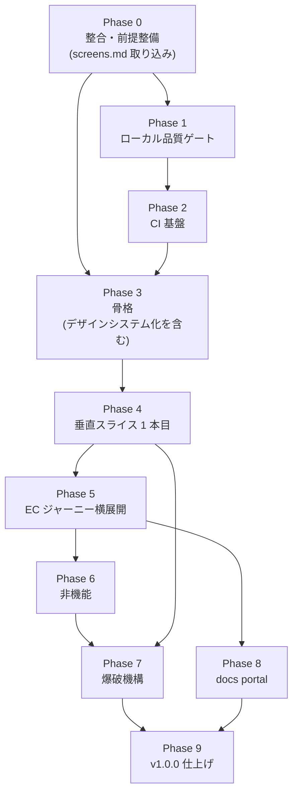

# nextjs-boilerplate v1 実装計画

本書は v1.0.0 到達までの**工程計画**である。役割分担は次のとおり。

- **決定の正 = ADR**(`docs/adr/00NN-*.md`)。本書は決定を再掲せず、ADR 番号 + 相対リンクで参照する
- **進捗ボードの正 = [BACKLOG.md](../adr/BACKLOG.md)**。枠 ID のステータスは BACKLOG が正
- **ADR 外の恒久確定事項 = [master-plan.md](master-plan.md)**(滑走路原則・採用ロードマップ・棄却)
- **サンプル仕様の正 = [screens.md](../screens.md)**(19 画面 + API 概要)。Phase 5 の PR 分解はここを入力とする
- **本書 = 工程**。Phase → PR の分解と、各 PR の完了条件・依存関係を持つ

- 生成日: 2026-07-26
- 本書は master-plan 第 2 章「実装ロードマップ」(旧 Phase 1〜5)を吸収した後継である

---

## 0. 進め方

### 0.1 作業手順

```text
本書(一覧) → GitHub issue 発行 → issue 上で精緻化 → 実装(PR)
```

**issue の発行は設計方針が固まってから行う。** 本書の段階では発行しない。issue 化の単位は本書の PR 1 件 = issue 1 件、マイルストーンは Phase 単位とする。

### 0.2 実装順の原則 — 垂直スライス優先

カーネルを作り切ってからサンプルを載せる(水平優先)のではなく、**まず 1 画面を端から端まで通す**。

- Phase 3 で全カーネルの「薄い実体」を用意し、Phase 4 で**ユーザー向け商品一覧 1 画面**を `app → features → adapters → gen → errors → logging → components` まで貫通させる
- 貫通後に横へ太らせる(Phase 5)
- **スキャフォールドジェネレータ(B2)は貫通後に作る**。1 本も通っていない段階では「何を生成すべきか」が確定しないため

### 0.3 PR の記法

各 PR は次の 6 項目を持つ。

| 項目 | 内容 |
| --- | --- |
| 目的 | その PR が解決する問題。1〜2 文 |
| 対象 ADR | 実装対象の ADR。ここに無い ADR の決定を実装しない |
| 主な変更先 | 触るファイル / ディレクトリ |
| **強制手段** | **その PR が持ち込む規約を何が守らせるか — 型 / biome / ESLint boundaries / CI ゲート / テスト / scaffold 生成 / 散文のみ** |
| 完了条件 | 検証可能な状態。「動く」ではなく「何が緑になるか」で書く |
| 依存 | 先行させる PR |

**「強制手段」は master-plan 1.3 の B10 をこの記法へ埋め込んだものである。** 台帳を Phase 9 で後から作ると、その時点で散文が大量に溜まっている。各 PR に強制手段を書かせれば「散文のみ」がその場で可視になり、機械強制へ寄せる余地をレビュー時に検討できる。P9-4 はこの欄を集計する作業へ変わる。

**この欄は issue テンプレートの必須項目として決定論的に強制する**(P0-7)。本書の段階では、**強制手段の選択そのものが設計判断になる PR にのみ記入済み**であり、残りは issue 発行時(§0.1 の「精緻化」)に埋める。本書に書かれていないことを「未決定」と読まないための注記である。

---

## 1. v1.0.0 の完了条件

**v1.0.0 の定義 = アプリケーション基盤として成立するクオリティに達すること。**

その指標を **「go-boilerplate のサンプル API を使った EC サイトとして、実際のジャーニーを不足なく満たせること」** とする。ADR の網羅や枠の消化ではなく、**動くものとして成立しているか**で判定する。

判定可能にするための具体条件:

| # | 条件 |
| --- | --- |
| 1 | [screens.md](../screens.md) の **19 画面すべてが実バックエンド接続で動作する** |
| 2 | 主要ジャーニーの **E2E が CI で緑**(P6-4) |
| 3 | **一括破棄(爆破)後もビルド・型検査・テストが通る**(P7-2) |
| 4 | master-plan 1.3 の 14 仕掛けのうち **B9 / B11 を除く 12 件が実装済み**(B9 は §3.11 の手順上の例外で v1 では実施しない、B11 は v1.x.x) |
| 5 | ドキュメントが **EN canonical + `.ja.md` mirror** で整合している(P9-2) |
| 6 | ADR が **immutable 運用へ移行**している(P9-3) |

**BACKLOG はゲートではなく記録**として扱う。ADR 65 本のうち BACKLOG に枠があるのは 39 本のみで、枠のない 26 本には [0111](../adr/0111-csp-security-headers.md)(CSP)/ [0079](../adr/0079-auth-frontend-seam.md)(認証)/ [0061](../adr/0061-form-mutation-ux.md)〜[0063](../adr/0063-mutation-result-notification.md)(フォーム)/ [0073](../adr/0073-pagination-fetch-boundary.md)〜[0078](../adr/0078-dynamic-feature-flag-seam.md)(データ境界 seam)等が含まれる。したがって「全枠 ✅」は **CSP もフォーム機構も未実装のまま形式的に満たせてしまい、完了条件として機能しない**。枠の増設は P9-5 で記録の整合として行う。

**Tier 5 の [0121](../adr/0121-i18n-strategy.md) / [0100](../adr/0100-accessibility-target.md) / [0101](../adr/0101-performance-budget.md) / [0102](../adr/0102-browser-support.md) は後回し**とし、必須条件から外す(P9-5 で現状のまま出せるか確認する)。

**条件 1 の「実バックエンド接続」は、認証の主たる経路については stand-alone で判定する。** cloud の経路は別リポジトリ 2 本の後ろにあり、v1 のスコープに入らない(Phase 5「Phase 5 の範囲外: 認証の cloud 経路」)。

### 1.1 バージョン運用

- **0.1.0 は「本書の方針が確定した時点」のタグ**。中身は Phase 0 完了分であり、Phase 1 の完了は待たない
- 以降は Phase 完了ごとにマイナーを上げる(Phase 1 完了 = **0.2.0**)。全 Phase 完了で **1.0.0**
- `package.json` の `version` は **作業中の `release/vX.Y.Z` に一致させる**。タグは [0150](../adr/0150-git-workflow.md) に従い `production` HEAD へ打つため、リリースブランチを切ってからタグを打つまでの間、`package.json` は最新タグより 1 つ先行する。この先行は正常な状態であり、一致させる相手はタグではなくリリースブランチである
- **GitHub のデフォルトブランチは `release/vX.Y.Z`**(go-boilerplate と同形式)。実測では go-boilerplate = `release/v2.1.0` / 本リポ = `release/v0.0.6` で **既に de facto そうなっており、[0150](../adr/0150-git-workflow.md) の「`develop` = デフォルトブランチ」という記述の方が誤りだった**。運用変更ではなく記述修正として P0-4 で反映済み。PR のベースは 0150 どおり `develop`

---

## 2. v1.0.0 までの暫定運用

> **(このセクションは v1.0.0 時には消すこと)**

0.0.x〜0.x.x の間、通常は保護されている以下の制約を**一時的に解除**する。理由は、v1 実装が設計の全面的な具体化であり、都度承認を挟むと工程が成立しないため。

- **Protected Documentation の直接編集を許可する** — `AGENTS.md` / Accepted ADR 本体 / `LICENSE` を、ユーザ承認を都度取らずに上書き編集してよい
- **AI Modification Scope の保護パスを解除する** — `package.json` / `tsconfig.json` / `next.config.ts` / `mise.toml` / `biome.json` / `Makefile` / `.makefiles/` / `.github/` / `.claude/` を直接編集してよい
- **`.claude/settings.json` の permissions を実態に合わせる** — `AGENTS.md` / `LICENSE` / `settings.json` 自身を `deny` ではなく `ask` に置く。ハード禁止では v1 実装が進まないため、承認を挟む形に落とす。**ADR 本体は permissions に載せない** — living document として日常的に上書きするため、都度確認が通常作業のたびに発火する
- **ADR は living document として直接上書きする** — [0140](../adr/0140-documentation-operations.md) の 0.0.x living 運用を v1.0.0 未満まで延長する
- **経緯・変遷コメントを本文に残さない** — 「当初は X だったが Y に改訂」「2026-07-14 に反転」のような改定履歴・検討経緯を文書本文に書かない。決定の**現在形**だけを書く。経緯は git 履歴が持つ

v1.0.0 到達時に本セクションを削除し、同時に:

1. `AGENTS.md` の Protected Documentation / AI Modification Scope を復活させる
2. `.claude/settings.json` の `AGENTS.md` / `LICENSE` / `settings.json` 自身を `ask` から `deny` へ戻し、**ADR 本体(`docs/adr/*-*.md`)を `deny` へ追加する**(3 の immutable 化の裏付け)
3. [0140](../adr/0140-documentation-operations.md) の ADR 不可変性を immutable へ切り替える
4. 全 ADR 本文と [BACKLOG.md](../adr/BACKLOG.md) から経緯記述を除去する(P9-3)

---

## 3. この計画で確定した ADR 外の事項

ADR に載らない、本計画固有の確定事項。

### 3.1 開発環境 — 自前の compose を持たない

nextjs-boilerplate は `docker-compose.yaml` を持たない([0011](../adr/0011-no-docker.md) と整合)。開発時は **go-boilerplate の compose スタックに接続**する。

| 接続先 | 既定 | 用途 |
| --- | --- | --- |
| API | `http://localhost:8080` | BFF の向き先 |
| OTLP | `http://localhost:4318` | 観測性([0081](../adr/0081-observability-logging.md))。go 側 `observability`(otel-lgtm)。Grafana は `:3000` |
| Object Storage | `http://gobp-local.web.garage.localhost:3902` | 画像配信。**virtual-host 形式のみ**(§3.2) |
| 認証 | `http://localhost:4000` | go 側 `mock_auth_server`(疑似 OIDC) |

起動は `cd ../go-boilerplate && docker compose --profile development up`。フロント単独で作業する場合は **MSW モック**(`APP_API_MODE=mock`)へ切り替える。

### 3.2 画像配信 — 配信レイヤは持たず「拾う側」だけ実装する

- Garage は **public storage** として扱う(匿名 read 可・listing 不可)。private bucket ではない
- したがって本 repo に**配信プロキシ(Route Handler)は置かない**。持つのは `mediaUrl()` 純関数と `next.config.ts` の `images.remotePatterns` のみ
- 最適化は `next/image` が単独で担う。`/cdn` のような自前の配信経路は作らない

```ts
mediaUrl(path) => `${MEDIA_ORIGIN}/${path}`
// サンプル時: MEDIA_ORIGIN = Garage の公開エンドポイント
// 爆破後   : MEDIA_ORIGIN = fork 先の実ストレージ / CDN
```

- オブジェクトキーは backend が発行する `products/{uuid}.{ext}`。**表示 URL の組み立てはフロント責務**(backend はパスのみを持ち、フル URL を保存しない)
- **配信 URL は virtual-host 形式で確定した**(go-boilerplate #707 マージ済み。`[s3_web]` bind `:3902` / `bucket website --allow` / `Cache-Control: immutable` 付与まで実装済み)

```text
http://gobp-local.web.garage.localhost:3902/products/{uuid}.png
```

- **パス形式(`localhost:3902/<bucket>/<key>`)は動作しない** — Garage が `Host` ヘッダでバケットを解決するため。#668 で依頼したパス形式は採用されなかった
- **`*.localhost` の名前解決に注意が要る**: macOS と主要ブラウザは自前で解決するが、**glibc の Linux コンテナ / CI では解決しない**。`next/image` の最適化は**サーバ側 fetch** なので、Next.js を動かすホスト側の解決が必要になる。CI では `/etc/hosts` 追記が要る見込み。加えて `*.localhost` が IPv6(`::1`)に解決され、Docker の公開が IPv4 のみだと掴み損ねる可能性がある
- `next.config.ts` の `remotePatterns` と CSP `img-src` の両方に同オリジンを登録する
- 爆破後の `public/` にフォールバック画像は同梱しない。favicon / app icon は App Router の metadata file 規約により `app/` 配下にあり、PWA は [0130](../adr/0130-pwa-strategy.md) で v1 非採用のため、`public/` はほぼ空になる
- **`public/` は実行時書き込み不可**(ビルド時に焼き込まれ、PaaS のファイルシステムは読み取り専用)。よって爆破後の本線は「`MEDIA_ORIGIN` を実ストレージに向ける」であり、`public/` 配下からの配信はバックエンドを持たない開発時の逃げ道という位置づけ

### 3.3 画像のローディング表現 — CSS Skeleton を既定にする

EC サンプルのバックエンド由来画像は `imagePath` だけを API 契約にし、`blurDataURL` は載せない。後者は自前供給が必要で、一覧レスポンスが件数分肥大するためである。ただし `MediaImage` は Next.js 標準の `placeholder` / `blurDataURL` を透過し、static import や fork 後のプロダクト判断で利用側が明示指定できるようにする。

代わりに **`components` カーネルに画像用ローディングコンポーネント**を置く。

- 既定は **CSS のみのスケルトン**(ラッパに `aspect-ratio` + スケルトン背景、その上に `<Image fill>`)。`"use client"` 不要で [0040](../adr/0040-routing-rendering-strategy.md) と整合
- アスペクト比固定が CLS 対策を兼ねる(`rules.md` #17 の「スケルトンと実 UI の形状一致」)
- エラー時フォールバックが必要な場合のみ `onError` を使う client 版を用意する(既定にはしない)
- **LCP になる画像(一覧の先頭数枚・詳細のメイン画像)は `preload` を指定し、Skeleton を挟まない**
- OpenAPI の契約は `imagePath` のみで確定する

### 3.4 滑走路原則の改訂

master-plan 1.1 の滑走路原則を次のとおり改める。

- **設置面(mount point)が実在する場合にのみ seam を敷く。** 設置面がなければ何も置かない
- 従来の「形は 2 種 — ① 動くローカル最小機構 / ② インターフェース(IF/port)定義」のうち、**② 空の IF 定義は採用しない**(使われない IF は腐るため)
- 結果として master-plan 1.2 の v2 採用マトリクス 7 件は、v1 では**何も置かない**

### 3.5 サンプル(EC)の破棄境界

- **破棄するのはジャーニー**(画面・feature・ルート・E2E・モック・生成物)。画面系はほぼ全て破棄する
- **残すのはドメインを持たないもの**。UI パーツは「作り替えるもよし、捨てるもよし、あくまで参考」の但し書きを README に置いたうえで残す
- **破棄対象をディレクトリ名で表現しない。** ファイルは自然な場所・自然な名前に置き、破棄対象は爆破 manifest の**明示パス宣言**と、共有ファイル内の**マーカー**で表現する(下記「宣言方式」)

| 対象 | 例 | 扱い |
| --- | --- | --- |
| ジャーニー | `features/**` / `app/(shop)` / `app/(admin)` / `e2e/` / `mocks/` / `gen/` | **破棄** |
| カーネル内サンプル固有 | `stores/cart-store.ts` / `adapters/server/product-client.ts` | **破棄**(manifest 宣言) |
| **EC 特化 UI パーツ** | `components/product-card.tsx` / `cart-line-item.tsx` / `price-display.tsx` | **破棄**(manifest 宣言) |
| **汎用 UI パーツ** | `components/` 直下(button / input / dialog / table / skeleton 等・shadcn/ui 由来) | **残す**(README に但し書き) |
| **機構** | `cn()` / 画像ローディングの仕組み / `ActionState<T>` / 4 状態の型 | **残す** |
| **デザイントークン** | 色 / タイポ / スペーシング | **残す** |
| 認証・認可の機構 | session cookie 取扱い / 保護ルート判定 / RBAC ヘルパ | **残す** |
| 認証・認可の画面 | ログイン画面は残す / 管理画面は破棄 | **混在** |

境界の判定基準は **「用途特化か汎用か」**。EC でしか使わないパーツと装飾目的のパーツは破棄し、どのプロジェクトでも使う汎用パーツと機構は残す。

#### 宣言方式 — `_sample/` のようなディレクトリ隔離は採らない

破棄対象を `_sample/` 等の命名で隔離する方式は**採用しない**。理由は 2 つ。

- **参照実装であることと矛盾する** — サンプルは B5 ゴールデンパスであり、production 品質で書かれた**模範コード**である。`_sample/` はこれを「仮のコード」に見せてしまう
- **fork 先が見る構造が歪む** — 自分で書くときには存在しないディレクトリ階層を、参照実装だけが持つことになる

代わりに go-boilerplate と同じ 2 系統で宣言する。

| 粒度 | 宣言方法 |
| --- | --- |
| ファイル / ディレクトリ丸ごと | 爆破 manifest(`scripts/setup/lib/sample-manifest.ts`)の `paths[]` に**明示列挙** |
| 共有ファイル内の混在行 | ファイル内の**マーカー**(`sample:begin`/`end` / `sample:line` / `sample:replace-*`) |

これによりコードは自然な場所・自然な名前のまま置ける。破棄対象かどうかは manifest を読めば分かる。

### 3.6 認証の責務分界

**Authorization Code + PKCE で、Next.js の Route Handler が IdP と直接やりとりする**([screens.md](../screens.md) U9)。

- ブラウザは **httpOnly BFF Session Cookie のみ**を保持し、JWT(Access Token)はブラウザに露出しない
- フロントの画面実装は「ログインボタン → BFF の URL(`/api/auth/login`)へ遷移」のみ。Go API を一切叩かない
- 認証が要る API 呼び出しは、BFF 経由で Bearer が自動付与される前提で実装する(個別に Authorization ヘッダを組み立てない)
- 401 = 未ログイン / セッション切れ → ログイン画面へ。403 = 権限不足 → 導線ごと出し分ける
- ローカルの IdP は go 側 `mock_auth_server`(`http://localhost:4000`)

これは [0079](../adr/0079-auth-frontend-seam.md) の「session = httpOnly cookie / payload 最小」「認可は 2 層(optimistic + 確定)」に忠実な形である。

**コア残留と差し替え可能性の両立 — Resolver IF 方式**: 0079:69 は「特定の session 実装詳細(暗号化方式 / stateless vs DB)を boilerplate 本体に前提として組み込む」ことを禁じている。これを次の形で満たす。

- **大部分(seam・保護ルート判定・`returnUrl`・状態破棄・RBAC ヘルパ)はコア残留**
- **各社の事情が入る箇所(暗号化 / OIDC クライアント)は IF で切り、Resolver として内部処理を隠蔽する**。既定実装を 1 つ同梱し、fork 先は Resolver を差し替えるだけで済む
- これは §3.4 の改訂滑走路原則と整合する。**設置面(サンプルが実際に使う既定実装)を伴った IF** であり、禁じた「空の IF 定義」ではない

実装時に確定する項目(§5 に登録): Resolver の IF 形状 / 既定実装のライブラリ選定 / refresh の扱い / role の取得元(IdP claim か `/v1/users/me` か)。

### 3.7 Cookie 同意 — 軽量機構を採用する

[0131](../adr/0131-cookie-consent.md) の exclusion を**採用へ反転**する。

- **理由**: [0031](../adr/0031-policy-state-supply.md)(policy state supply)が consent 状態供給を既に規定しており**設置面が実在する**(§3.4)。加えて同意はサードパーティスクリプトの**読み込みをゲートする**機構であり、layout / CSP `script-src` / `next/script` strategy に同時に食い込むため、後付けコストが高い
- **範囲は「軽量 consent 機構 + ゲート」まで**。同意状態の保持([0031](../adr/0031-policy-state-supply.md) 経由)/ 同意バナー / スクリプト読み込みゲート / 計測用 cookie_id の発行までを持つ
- **GTM / PostHog 本体は v1 では入れない**(master-plan の「Medium = 統合するが既定は控えめ」)。CMP・IAB TCF 等の本格的な同意管理も対象外

### 3.8 TipTap を v1 スコープへ繰り上げる

商品説明(description)がリッチテキストであるため([screens.md](../screens.md) A6 / A7)、TipTap は master-plan 1.2 の v2 マトリクスから外し **v1 採用**とする。[0053](../adr/0053-ui-component-interaction-seam.md) の「Thin: seam + sanitizer + デモ」が実使用へ格上げされる。

- 表示側は **必ず sanitizer を通す**(`rules.md` #48。生の `dangerouslySetInnerHTML` は禁止)
- TipTap が inline style を出力するため、CSP の `style-src` が論点になる(§3.9)

### 3.9 CSP — enforce seam は「sanitizer の検証結果」で決める

[0111](../adr/0111-csp-security-headers.md) は **seam A(`next.config.ts` の非 nonce CSP)を既定**とし、seam B(`proxy.ts` の per-request nonce)は「**既定にしない**」と明記している。理由は「nonce を使うと全ページが dynamic rendering を要求し、静的最適化・ISR・CDN キャッシュ・**PPR / Cache Components と非互換**になる」ため。

したがって **nonce へ倒す判断は、P6-8(Cache Components の有効化判断)と同時に決まる**(両立しない)。

**判断の前に検証すべき事実が 2 つある。**

1. **TipTap の inline `style=` 属性に nonce は原理的に効かない** — nonce は要素(`<style>` / `<script>`)にしか付かず、属性は `style-src-attr` の管轄で `'unsafe-inline'` 以外に許可手段がない。つまり「リッチテキストのために `'unsafe-inline'`」は **nonce へ倒しても解消しない**
2. **sanitizer で `style` 属性を落とせるなら、`'unsafe-inline'` 自体が不要になる** — 商品説明に必要なのは太字 / 斜体 / リスト / 見出し / リンク程度で、いずれも inline style ではなくクラスへ写像できる

**よって順序を固定する**: P3-8 の `rich-text` 実装(sanitizer と allowlist は §3.10 で確定済み)で「`style` 属性を落として TipTap の要件を満たせるか」を検証し、その結果と **P6-8 の Cache Components 判断**を入力として、**0111 追補(seam A 維持 / seam B へ反転)を P6-2 で確定する**(P0-4 では扱わない)。この検証には TipTap の出力サンプルがあれば足り、実 API や生成型を必要としないため、**Phase 4 / 5 の到達を待たない**。静的を保ったまま script を厳格化したい場合の道は nonce ではなく **hash ベース**([0111](../adr/0111-csp-security-headers.md) が挙げる実験的 SRI)であり、採るなら別途判断する。

**検証結果は次のとおり(P3-8 で実施済み)。上の 2 と 1 の順に対応する。**

1. **リッチテキストは inline `style` 属性を 1 つも出さない。** sanitizer の schema は `a` の `href` だけを通し、他のタグは属性を持たない。editor 側も、allowlist 相当の全書式を含む内容と toolbar の全操作を通した状態で、編集面配下の `[style]` 要素が 0 件・`getHTML()` の出力属性が `a[href]` と `hr[contenteditable]` だけだった。位置指定の inline style を注入する `Gapcursor` / `Dropcursor` を extension 集合から外していることがここに効いている(starter-kit を採らない判断の副次的な担保)。**よって「リッチテキストのために `'unsafe-inline'`」は成立しない。**
2. **ただし `'unsafe-inline'` はリッチテキストと無関係に必要な状態が残る。** Radix の popper が `position` / `transform` / `minWidth` / `zIndex` / `--radix-popper-*` を**要素の `style` 属性**へ書き、`next/image` も `color: transparent` を img へ付ける。これらは `style-src-attr` の管轄で **nonce も hash も効かない**。Radix を import する component は現時点で 27 個あり、浮動 UI は全て popper 経由である。
3. **TipTap が注入する `<style data-tiptap-style>` は別問題として残る。** `@tiptap/core` の `injectCSS`(既定 `true`)が runtime で style **要素**を 1 本挿す。要素なので nonce / hash が効き、`injectCSS: false` にして CSS を `globals.css` 側で持てば消える。

**したがって判断の形が変わる**: 「`'unsafe-inline'` を外せるか」ではなく「`style-src-elem` と `style-src-attr` を割って、要素側だけ厳格にするか」になる。属性側は Radix を使う限り `'unsafe-inline'` から降りられない。**割る指定は Safari が未対応で `style-src` にフォールバックする**ため、その環境では強化が効かないことも織り込む。要素側を厳格にするなら `injectCSS: false` が前提条件になるが、CSP 本体を書くまで単体では防御が変わらない(効果は FOUC の解消に留まる)。

### 3.10 TypeScript / ライブラリの確定事項

[0004](../adr/0004-library-management.md) の未決 3 件を確定する。

**`cn()` の実装 = `clsx` + `tailwind-merge`。** これは新規決定ではなく [0052](../adr/0052-ui-component-policy.md) の追認である(同 ADR が `clsx` / `tailwind-merge` を「shadcn が引き込む実 npm 依存」として exact-pin 対象に名指ししている)。責務が join / 衝突解決に 1 対 1 対応し、[0004](../adr/0004-library-management.md) の一次判定を各々単独で通る。`tailwind-variants` は責務を 1 語で言えず(variant + slots + responsive + merge の束)`cva` とも衝突するため**一次判定で落選**。

> **`clsx` は release が止まっているが採用してよい**: 最新版 `2.1.1` から更新が無いが、未修正の既知脆弱性が無いため [0004](../adr/0004-library-management.md) の不採用理由に当たらない。実装が数十行で **fork コスト実質ゼロ**(最悪 `components` カーネルへコピーインすれば自前実装と等価)であり、`class-variance-authority@0.7.1` が `clsx ^2.1.1` に依存するため**どのみち推移依存に入る**。

**`cva`(class-variance-authority): 採用。** shadcn/ui の公式コンポーネントは cva を使った状態で配布されるため、入れないと配布物を毎回書き換えることになる。[0010](../adr/0010-standards-and-non-lockin.md)「独自に機構を発明しない」とも整合する。`rules.md` #34 / #35 の規約はこれに従う形で埋まる。

**リッチテキストの sanitize = `hast-util-from-html` + `hast-util-sanitize` + `hast-util-to-jsx-runtime`。** HTML 文字列を経由せず hast から直接 React 要素を組むため `dangerouslySetInnerHTML` を使わず、`rules.md` #48 と biome `noDangerouslySetInnerHtml` に抵触しない。`parse5` による仕様準拠パースの後に木を検査するので、文字列ベース sanitizer の parser differential(sanitizer とブラウザの解釈差)を構造的に避けられる。3 本とも単一責務・単一 upstream・MIT・未修正脆弱性ゼロで [0004](../adr/0004-library-management.md) を通る。**代替は `sanitize-html` + `html-react-parser`** — 推移依存が 1/3 に収まる一方、sanitizer 本体に advisory 11 件の履歴があり、allowlist がライブラリ固有形式になる。`interweave` は責務を 1 語で言えず一次判定で落選、`isomorphic-dompurify` は jsdom を引く bridge のため採らない。

**TipTap は `@tiptap/starter-kit` を採らず extension を個別に入れる。** starter-kit は要件外を含む 24 個を引く。**editor が出せるタグ ⊆ sanitizer が通すタグ** を保たないと、入力できるのに保存後に落ちる不整合が生じるため、extension 集合は allowlist から導出する。

**sanitize の port は `src/model/rich-text/` に置く。** 純粋な表示上の変換・検証規則であり `model` の責務に当たる(`adapters` は外部接続、`capabilities` は client hook のため不適合)。抜けと境界の曖昧化は **private field を持つ class による nominal type**(`eslint.config.mjs` が `as` を全面禁止しているため brand は使えない)と `boundaries/external` による `hast-util-*` の import 制限で塞ぎ、暴走は **入力サイズ・ノード数・深さの上限 + fail-closed** で塞ぐ。木ベースの sanitize は冪等なので、二重適用による content 破壊は起きない。

**tsconfig の追加フラグ: 5 件を採用。**

| フラグ | 採否 | 理由 |
| --- | --- | --- |
| `noUncheckedIndexedAccess` | 採用 | 配列 / インデックス参照の undefined を型で捕まえる |
| `erasableSyntaxOnly` | 採用 | `enum` / `namespace` を禁止し、`rules.md` #38 の「enum 可否」を機械的に決着させる |
| `verbatimModuleSyntax` | 採用 | `import type` の規律 |
| `noImplicitOverride` | 採用 | 低摩擦 |
| `noPropertyAccessFromIndexSignature` | 採用 | index signature へのドット参照を禁止。流入口([0030](../adr/0030-environment-variable-management.md) の `process.env` / `rules.md` #42 の searchParams)が既に塞がれているため**実質ゼロコストで決定論が得られる** |
| `exactOptionalPropertyTypes` | **見送り** | React props との摩擦が高い。残る穴(「未指定」と「明示的 undefined」を型で区別できない)は下記の実行時機構で埋める |
| `noUnusedLocals` / `noUnusedParameters` | **入れない** | biome が `correctness/noUnusedVariables` / `noUnusedFunctionParameters` で **error として捕捉することを実測で確認済み**。[0002](../adr/0002-formatter-linter.md) の重複禁止に従う |

あわせて `target` を `ES2017` から引き上げる(現状は Next.js 16 / [0102](../adr/0102-browser-support.md) と釣り合っていない)。

**`exactOptionalPropertyTypes` 見送りの穴を埋める機構**(散文の規約にしない): `JSON.stringify` は値が `undefined` のキーを落とすため、`{name: undefined}` と `{}` はワイヤ上で同一になる。残る危険は直列化より手前のローカル組み立てだけなので、**`adapters` に PATCH ペイロード正規化関数を置き、そこに閉じ込める**。

- 「触らない」= キーを含めない / 「消す」= `null` を明示。`undefined` に意味を持たせない
- adapters の公開面を**正規化済み型でしか受け付けない形にする**(型で強制)
- 「`undefined` キーは消える / `null` は残る」をテストで固定する
- 実装は P4-3(fetch wrapper)、使用は P5-12(A7 商品編集の部分更新)

**`nuqs` 等 searchParams ヘルパ: v1 不採用。** [0004](../adr/0004-library-management.md) の一次判定(単一責務 × 単一 upstream)は通るが、[screens.md](../screens.md) U2 の主眼が **RSC 再取得**であり client state 同期層を必要としない。§3.4「設置面が実在する時のみ」に従い、実装して不足を感じてから入れる。

**ただし「入れない」は「何も決めない」ではない。** `searchParams` の標準形(zod スキーマ / パース関数 / URL 更新ヘルパの置き場)を **scaffold(B2 = P4-6)の生成物に含める**ことで、各画面がバラバラに実装するのを防ぐ。`rules.md` #42 は「この生成物を使う」という参照に留める。

### 3.11 デザインワークフロー — v1 は Figma を使わない(手順上の例外)

**原則は Figma が SSOT である。** ADR / `rules.md` / master-plan はこの軸で書く(本節はそれを覆さない)。

**ただし v1 の手順としてはこれを省略する。** 理由は 3 つ:

- 手順を減らしたい
- 個人開発では Figma を挟むメリットが薄い
- Figma 領域まで保守する意思がない

**これは恒久的な規約の変更ではなく、v1 における手順上の例外判断である。** fork 先が Figma を SSOT に据えるなら、B9(トークン同期パイプ)を足すだけで原則どおりに戻せる。

**v1 の実際の手順**:

```text
shadcn/ui を import
  → Storybook で閲覧可能化
  → 改修してデザインシステムとして成立させる
  → デザインシステムを外部のデザイン支援ツールへ書き出す
  → そこで feature / page の見た目を検討する
  → 検討結果を参照して repo に実装する(実装ロジックは壁打ちで詰める)
```

**目的はデザインセンスを AI で補うこと**であり、コードを生成させることではない。外部ツールの出力は **Figma の代替 = 仕様の入力**として扱う。repo のコードは B2(`pnpm gen`)が骨を作り、実装が見た目を合わせにいく。

**依存の向きは `repo → design` の一本で確定する。**

作業の場所は層によって異なる(デザインシステムは repo 側、page の組み合わせは外部ツール側)が、**依存は常に repo → design** である。外部ツール側の成果物は検討結果であって、repo へ自動同期しない。**人間が見て実装する**(参照は逆向きに流れるが、それは依存ではない)。

**ツール固有の手順は ADR / `rules.md` / master-plan に書かない。** 特定 SaaS の名前を恒久文書へ持ち込むことは [0010](../adr/0010-standards-and-non-lockin.md)(非ロックイン)に反する。書き出し・同期の具体手順は `.claude/skills/` のスキル 1 本に閉じ込め、[0154](../adr/0154-claude-skills-operations.md) / [0155](../adr/0155-claude-skills-development.md) の運用規約に従わせる。

**実装の形**: `pnpm design:bundle`(`scripts/design-bundle.ts`)が送り先を知らない bundle を `tmp/design-bundle` へ出し、`design-export` スキルがそれを送り先へ運ぶ。bundle の中身は shadcn registry(各 component のソースとメタ)・目録(用途・責務境界・story 名)・生成済みトークンの 3 つで、いずれも取り込みで使っている形式か、リポジトリが既に持っている生成物である。**書き出し側で新しい形式を発明しない。**

**Figma を書き出し先に選べる。** 上の「v1 は Figma を使わない」は、Figma を SSOT に据えず手順の途中に挟まないという判断であり、書き出し先として選べることと矛盾しない(依存の向きは repo → design のままで、Figma 側の成果物をリポジトリへ戻す経路は作らない)。ただし **Figma だけは bundle を渡す口が無い** — REST API はデザイン内容を作れず、frame / component / variable の作成は Figma エディタの中で動く Plugin API の担当である。したがって経路は script ではなくエージェント経由になり、スキルはそこだけ既存の Figma 向けスキルへ委譲する。

**v1 で実施しないもの**: **B9(Figma → CSS 変数の同期パイプ)**。原則としては master-plan 1.3 の記述が正だが、v1 は Figma を使わないため搬送すべき上流が存在しない。v1 では `tokens.json` を手書きの SSOT とし、`tokens.json → Tailwind @theme` の後段のみを実装する。

**B1 テンプレの「状態表 × デザイン参照」**: 参照先の形式は fork 先が決める(Figma フレーム / Storybook story)。**v1 では Storybook story を参照先とする** — story は実在し CI で検証できるため、この repo の手順では強い。

**代わりに必要になる規律**: Figma で全画面を並べて見る場が無いため、一貫性は **Storybook が唯一の在庫リストであること**で担保する。「**Storybook に story を持たないコンポーネントを feature 配下に新規作成しない**」を B11(構造 CI ゲート・v1.x.x)の検査項目に含める。

### 3.12 `src/app` は足場として扱い、画面実装で全面的に置き換える

**`src/app` の現在の中身は足場であり、画面実装の段階で全面的に作り直す。** これは劣化ではなく意図した順序である。route segment の切り方・layout の階層・metadata の値は、いずれも app shell の情報設計と画面一覧に従属する。情報設計が決まる前にこの層へ構造を作り込むと、決まった時点で捨てる量が増えるだけであり、しかも「既にあるもの」に引きずられて情報設計そのものが歪む。

したがってこの層では次の規律を採る。

- **設置面が実在する配線だけを置く。** 3.4 の滑走路原則をこの層へ適用したものであり、将来必要になりそうな階層・Provider・segment を先回りで置かない
- **判断が要るものは画面実装まで持ち越す。** 情報設計に踏み込む変更(route group の切り方・shell の分割・具体的なタイトル文言)は、この段階では確定させない
- **この層を構造の参考にしない。** fork 先および後続の実装が参考にしてよいのは mount の作法だけである

現時点で足場として置いてあるものと、置き換わる契機は次のとおり。

| 対象 | 現状 | 置き換わる契機 |
| --- | --- | --- |
| `layout.tsx` の html / body | 言語と font 変数、`min-h-full` の骨格のみ | app shell の実装 |
| 横断通知の Provider mount | root layout へ mount 済み([0026](../adr/0026-layout-shell-mount.md) の薄い mount) | app shell の実装時に配置を見直す |
| `metadata` の `title` / `description` | リポジトリ名と一行説明の**仮値**。恒久的なのは `title.template` の枠だけ | fork 先または画面実装 |
| `metadata` の `metadataBase` | **未設定** | 公開 URL を保持する config を足す時点([0030](../adr/0030-environment-variable-management.md)) |
| `page.tsx` | 動作確認用の最小ページ | 画面実装 |

3.5 の破棄境界における位置づけは**ジャーニー側**であり、`app/**` の route segment は破棄対象である。ただし root layout の mount 作法と metadata の枠組みは機構であり、残す。この区別は `src/app/README.md` にも置き、この層を最初に読む人へ直接届くようにする。

### 3.13 双方向/ストリーム通信 — 設置面が実在する場合に限り seam を実体化する

3.4 により、[0074](../adr/0074-runtime-communication-seam.md) の購読 seam は v1 では何も置かない。設置面が無いためである。

backend が server→client push の入口機構(SSE)と、その配信基盤である Pub/Sub を正式な機構として持つ場合、この設置面が生まれる(`go-boilerplate #1180`)。輸入 EC サンプルの「お問い合わせチャット」がその実使用箇所になる。

**ただし v1.0.0 の完了条件には含めない。** backend 側の作り込みが大きく、こちらの着手がその機構実装に従属するためである。1 の完了条件に対しては必要条件ではなく、満たせば質が上がる十分条件として扱う。この位置づけの PR には `EX` を付す。

実体化する場合の契約は次のとおり確定している。

| 項目 | 内容 |
| --- | --- |
| transport | SSE。長寿命接続の hosting は backend が持ち、本体は同梱しない([0011](../adr/0011-no-docker.md) / [0074](../adr/0074-runtime-communication-seam.md) のまま) |
| 認証 | BFF が発行する短命 ticket(user / thread / stream scope に束縛)を query に載せ、ブラウザが backend の endpoint を直接叩く。one-time にはしない — `EventSource` の標準再接続と競合するため |
| stream が運ぶもの | message ではなく event(`message.created` 等)。意味ごとに event 名を分け、本文変更と状態変更を同居させる広い名前は使わない |
| 順序 | event sequence は thread 単位で単調増加。**歯抜けを許容し、SSE の到達順は保証しない**。整列と重複排除はフロント側の責務 |
| 初期表示 | History API が message projection を返す。応答の `eventCursor.sequence` が購読開始位置になる |
| 送信 | REST + `Idempotency-Key`。`clientMessageId` の echo で、楽観追加した自分の発言と突合する |
| 添付 | 初期実装では扱わない |

**責務分界**: 順序・重複・再接続・cursor・接続状態は transport 都合であり `adapters/client` が持つ。`message.created` のようなドメインイベントの畳み込みは feature が持つ。`adapters` は境界であって状態の所有者ではない([0021](../adr/0021-frontend-responsibility.md) / [0024](../adr/0024-adapters-server-client-split.md))。

**mock**: SSE は契約から MSW ハンドラを生成できない。`mocks/` の「生成物だけを置く」一方向を守り、**SSE は差し替えず実 compose に依存させる**。画像を差し替えない扱いと同じ列に置く。したがって開発時にオペレータ返信を発生させる手段は backend 側が持つ。

**backend 側に残る未確定**: resume cursor を渡す query パラメータ名、heartbeat の形式(コメント行 / `event: ping`)と間隔の契約値、開発用モックオペレータの方式。いずれも着手を止めないが、実装 PR の入力として要る。

---

## 4. PR 一覧

全 66 PR。issue 化の単位はこの 1 行 = 1 issue。

`EX-N` の行は**拡張枠**であり、この 66 本には含めない。v1.0.0 の完了条件から外れる(3.13)。**どの Phase にも属さない**ため、表の末尾と本文の末尾(Phase 9 の後)に置く。

| ID | タイトル | Phase | 依存 |
| --- | --- | --- | --- |
| P0-1 | v1.0.0 までの暫定運用を明文化 | 0 | — |
| P0-2 | リンク切れ一括修正 | 0 | P0-1 |
| P0-3 | バージョン・依存の整合 | 0 | — |
| P0-4 | ADR 追補・不整合解消 | 0 | P0-1 |
| P0-5 | master-plan の再編 | 0 | P0-4 |
| P0-6 | 画面一覧の取り込み(`docs/screens.md`) | 0 | — |
| P0-7 | issue テンプレートの整備 | 0 | P0-1 |
| P1-1 | commitlint | 1 | — |
| P1-2 | gitleaks + trivy | 1 | — |
| P1-3 | actionlint 先行移植 + setup スクリプト拡充 | 1 | — |
| P2-1 | 基本 workflow(upsert-pr-comment / lint / typecheck / build / smoke) | 2 | P1-3 |
| P2-3 | actions SHA ピン機構 | 2 | P2-1 |
| P3-1 | 11 カーネルの物理化 + 層別 README(B13) | 3 | P0-4 |
| P3-2 | architecture.ts SSOT + ESLint boundaries(B4) | 3 | P3-1 |
| P3-3 | env / 型付き Config | 3 | P3-1 |
| P3-4 | errors カーネル | 3 | P3-1, P3-2, P3-6 |
| P3-5 | logging / observability カーネル | 3 | P3-3, P3-4 |
| P3-6 | テスト基盤(Vitest + RTL + MSW) | 3 | P3-1, P2-1 |
| P3-7 | styling 基盤(design token はコードが SSOT) | 3 | P3-1 |
| P3-8 | components + Storybook + デザインシステム化 | 3 | P3-7 |
| P3-9 | rules.md 骨格 35 エントリ | 3 | P0-4 |
| P3-10 | ドキュメントレール(B1 / B6 / B14) | 3 | P3-1 |
| P4-0 | テスト関連 skill の回収 | 4 | P3-6 |
| P4-1 | OpenAPI 取得機構 | 4 | P3-3 |
| P4-2 | orval による型 + zod 生成 | 4 | P4-1 |
| P4-3 | adapters — fetch wrapper | 4 | P4-2, P3-4, P3-2, P3-6 |
| P4-4 | MSW モック(B3) | 4 | P4-2, P3-6 |
| P4-5 | 商品一覧の貫通 | 4 | P4-3, P4-4, P3-8, P3-2, P3-6, P3-10 |
| P4-6 | スキャフォールドジェネレータ(B2) | 4 | P4-5 |
| P5-1 | U3 商品詳細 + エラー境界の配置規約 + sanitizer | 5 | P4-5 |
| P5-2 | U2 商品一覧の完成(フィルタ / sort / cursor)+ ページネーション基盤 | 5 | P4-5 |
| P5-3 | U1 トップ(並行 fetch)+ マスタ API | 5 | P5-2 |
| P5-4 | 認証基盤(U9・PKCE + BFF Route Handler + 保護ルート) | 5 | P4-3, P4-5 |
| P5-5 | U4 カート(サーバカート + 明細の再評価) | 5 | P5-1, P5-4 |
| P5-6 | U5 購入確認 + 通貨・為替(USD セント / `display_currency` / degrade) | 5 | P5-5, P5-4 |
| P5-7 | U6 購入完了 + `ActionState<T>`(B8)+ Idempotency-Key | 5 | P5-6 |
| P5-8 | U7 購入履歴(無限スクロール)+ U8 購入詳細 | 5 | P5-7 |
| P5-9 | U11 マイページ + U12 ユーザー更新(CollectAll)+ 退会 | 5 | P5-4 |
| P5-10 | U10 登録(オンボーディング)+ 住所補完 degrade | 5 | P5-9 |
| P5-11 | admin シェル + RBAC + A2 商品一覧 | 5 | P5-4, P5-2 |
| P5-12 | A6 商品作成 / A7 商品編集(TipTap + 画像アップロード + 楽観ロック 409) | 5 | P5-11 |
| P5-13 | A3 商品補充 + A5 ユーザー一覧 | 5 | P5-11 |
| P5-14 | A1 ダッシュボード + A4 集計(backend 合成) | 5 | P5-11 |
| P5-15 | purchases ステータス遷移(cancel / pay / ship / deliver) | 5 | P5-8, P5-11 |
| P5-16 | ゴールデンパス README 整備(B5 完成) | 5 | P5-1〜P5-15 |
| P5-17 | セキュリティ workflow(CodeQL / gitleaks / trivy / Dependabot) | 5 | P5-16 |
| P5-18 | spec 駆動の採否判断(GB-3) | 5 | P5-16, P4-6 |
| P6-1 | クライアント観測性 | 6 | P3-5, P4-5 |
| P6-2 | CSP / セキュリティヘッダ + CI 適合ゲート | 6 | P5-16, P6-8 |
| P6-3 | SEO / metadata + fonts | 6 | P5-1, P5-4 |
| P6-4 | E2E + visual regression | 6 | P5-16, P3-8 |
| P6-5 | capabilities カーネル | 6 | P5-7 |
| P6-6 | メンテナンスモード | 6 | P5-4 |
| P6-7 | Cookie 同意(軽量 consent 機構 + ゲート) | 6 | P6-2 |
| P6-8 | プラットフォーム機能の有効化判断 | 6 | P6-4, P6-9 |
| P6-9 | データ分類とキャッシュ境界(PII / user-scoped の取り扱い) | 6 | P5-4 |
| P7-1 | 爆破スクリプト移植 | 7 | P5-16 |
| P7-2 | マーカー埋め込み + purge 検証 CI | 7 | P7-1, P6-4 |
| P7-3 | `new-feature` スキル(B12) | 7 | P4-6, P3-10 |
| P8-2 | portal 運用スキルの復活 + Pages 有効化 | 8 | P5-16 |
| P9-1 | rules.md 磨き上げ | 9 | P7-2, Phase 6 全 PR, Phase 8 全 PR |
| P9-2 | EN canonical 化 + `.ja.md` mirror | 9 | P9-1 |
| P9-3 | ADR immutable 化 + 経緯除去 + 暫定運用の撤去 | 9 | P9-2 |
| P9-4 | トレーサビリティ台帳(B10) | 9 | P9-1 |
| P9-5 | Tier 5 後回し分の最終確認 | 9 | P9-3 |
| P9-6 | boilerplate 導入時の変更点を集約 | 9 | P9-2, P9-5 |
| P9-7 | v1.0.0 リリース | 9 | P9-7 を除く全 PR |
| EX-1 | ストリーム前提の文書反映(0074 / screens.md / mocks) | EX | — |
| EX-2 | 購読 seam の実体化(subscription adapter) | EX | EX-1, P4-3 |
| EX-3 | U13 お問い合わせ一覧 + U14 チャット画面 | EX | EX-2, P5-4 |

### 4.1 依存マップ



---

## Phase 0: 整合・前提整備

既存文書の不整合を先に潰す。実装に入ってから直すと差分が読みにくくなる。

### P0-1: v1.0.0 までの暫定運用を明文化

- **目的**: 本書 §2 の暫定運用を、参照される場所すべてに書き込む。以降の全 PR がこの緩和の上で動くため最初に置く
- **対象 ADR**: [0140](../adr/0140-documentation-operations.md) / [0152](../adr/0152-agents-md-policy.md)
- **主な変更先**:
  - `AGENTS.md` — 「v1.0.0 までの暫定運用」節を新設(Protected Documentation / AI Modification Scope の一時解除)
  - `docs/adr/0140-documentation-operations.md` — living 運用を「0.0.x」から「v1.0.0 未満」へ延長。経緯記述の禁止を追記
- **完了条件**: 両ファイルに削除マーカー `(このセクションは v1.0.0 時には消すこと)` 付きの節が存在する
- **依存**: なし
- **状態**: **実施済み**。`AGENTS.md` に「Temporary Operating Rules until v1.0.0」節、[0140](../adr/0140-documentation-operations.md) に「v1.0.0 までの暫定運用」節を新設。節の追加は [0152](../adr/0152-agents-md-policy.md) が ADR 改訂を要求するため、同 ADR の節構造表へ期間限定節(#1.5)を追加済み

### P0-2: リンク切れ一括修正

- **目的**: 2026-07-18 の `docs/plan/` 統合で発生したリンク切れを解消する
- **対象 ADR**: [0140](../adr/0140-documentation-operations.md)
- **主な変更先**:
  - `AGENTS.md` — ADR 表のリンク切れ 2 件(`0075-bff-external-boundary-seam.md` → `0075-file-upload-seam.md` / `0091-testing-and-catalog-policy.md` → `0091-test-verification-methods.md`)
  - `docs/adr/*.md` — **55 ファイル / 160 リンク**が削除済み `../plan/*.md` を参照

| 参照先 | 件数 | 処理 |
| --- | --- | --- |
| `pre-implementation-decisions.md` | 62 | 内容は各 ADR 本体へ移管済み。リンク削除 |
| `adr-gap-triage.md` | 35 | 仕分け経緯。§2 に従いリンクごと削除 |
| `adoption-matrix.md` | 29 | master-plan 1.2 へ付け替え |
| `adr-gap-audit.md` | 21 | 監査番号(#NN)の参照元。master-plan へ付け替えるか削除 |
| `structural-blocker-resolutions.md` | 9 | 解決済み。リンク削除 |
| `a1-layer-mapping-options.md` | 4 | 選択肢比較。リンク削除 |

- **強制手段**: markdownlint + リンク検査
- **完了条件**: `docs/` 配下に解決不能な相対リンクが存在しない(markdownlint + リンク検査で確認)
- **依存**: P0-1
- **状態**: **実施済み**(PR #26)。参照 145 件を振り分けて解消。実測で ADR 側の残存参照 0 件 / `AGENTS.md` のリンク切れ 0 件を確認済み。issue 化の際はクローズ済みとして扱う

### P0-3: バージョン・依存の整合

- **目的**: `package.json` の実態ずれを解消する
- **対象 ADR**: [0004](../adr/0004-library-management.md) / [0142](../adr/0142-license.md)
- **主な変更先**: `package.json`
  - `version` を `0.2.0` → `0.0.7` に修正(タグの最新は `v0.0.6`、現ブランチは `release/v0.0.7`)
  - `"license": "MIT"` を追加([0142](../adr/0142-license.md) の follow-up)
  - PR テンプレートへ「ライブラリ採用チェック」を組込([0004](../adr/0004-library-management.md) の改訂版テンプレ。一次判定 / 例外パス / fork コスト上限を含む)
  - **`docs/adr/BACKLOG.md` の T4 記述を修正** — 「`typescript: "^5"` が caret 指定」は stale(実際は `6.0.3` で exact 済み)。残るギャップは PR テンプレ未組込のみ
- **強制手段**: CI(lockfile-drift / lint)+ PR テンプレの記入欄
- **完了条件**: BACKLOG T4 の実装ギャップが解消され ✅ になる。`package.json` の version が §1.1 のバージョン運用に沿う
- **依存**: なし
- **状態**: **実施済み**。`version` は `0.0.7` / `"license": "MIT"` を追加 / PR テンプレートに「ライブラリ採用チェック」節を組込 / BACKLOG T4 を ✅ 化。[0142](../adr/0142-license.md) の `license` フィールド follow-up も解消済み。`typescript` の caret 指定は実測で既に exact(`6.0.3`)

### P0-4: ADR 追補・不整合解消

- **目的**: 実装前に決着が必要な決定を ADR 本体へ反映する。ここが片付かないと Phase 3 以降で判断が止まる
- **対象 ADR**: 下表のとおり
- **主な変更先**:

| 追補先 | 内容 | 種別 |
| --- | --- | --- |
| [0050](../adr/0050-styling-strategy.md) | `cva` の採否 | 未決定の decision |
| [0110](../adr/0110-security-operations.md) | CSP CI 適合ゲート 1 本の追加(`> Rationale: 0111`) | 追加 |
| [0091](../adr/0091-test-verification-methods.md) | visual regression を「tooling defer」→ **採用**(Playwright スクリーンショット) | 不整合解消 |
| [0022](../adr/0022-capabilities-kernel.md) | hook 例から keyboard shortcut registry を削除(据え置き除外のため) | 不整合解消 |
| [0075](../adr/0075-file-upload-seam.md) | **バックエンドが multipart を採る場合は multipart proxy を既定とする** | 前提更新 |
| [0011](../adr/0011-no-docker.md) | 開発環境は go 側 compose に接続する(本書 §3.1)を追記 | 前提更新 |
| [0045](../adr/0045-fonts-and-images.md) | 画像配信は public storage 前提・自前配信レイヤなし(本書 §3.2)を追記 | 前提更新 |
| [0028](../adr/0028-naming-convention.md) | 標準名を持つ env(`OTEL_*` 等)は `{SUBSYSTEM}_{NAME}` の例外とする | 例外条項 |
| [0131](../adr/0131-cookie-consent.md) | **exclusion → 採用へ反転**。軽量 consent 機構 + ゲートまで(本書 §3.7) | 反転 |
| [0053](../adr/0053-ui-component-interaction-seam.md) | **TipTap を Thin seam → v1 実使用へ格上げ**(本書 §3.8)+ keyboard shortcut registry seam の記述を削除(0022 側と同時) | 前提更新 |
| [0079](../adr/0079-auth-frontend-seam.md) | **動く最小 session 機構の本体同梱へ反転**。0079:69 は「特定の session 実装詳細を本体に前提として組み込む」ことを禁じているため、Resolver IF 方式(本書 §3.6)を decision として明記する | 反転 |
| [0027](../adr/0027-directory-structure.md) | **MSW モック生成物の配置**。0027:60 は `src/` 外の `mocks/` と規定。P4-4 をこれに合わせる(計画側を修正・ADR は変更不要の可能性あり。突合して確定) | 違反解消 |
| [0052](../adr/0052-ui-component-policy.md) | 禁止事項「❌ リッチテキストを本体へ持ち込むこと」と v2 記述を、TipTap の v1 採用に合わせて改訂 + **`cva` 採用を明記**(本書 §3.10) | 前提更新 |
| [0024](../adr/0024-adapters-server-client-split.md) | 決定表の「presigned 直 PUT」を multipart proxy 既定に合わせて改訂(0075 と同時) | 前提更新 |
| [0031](../adr/0031-policy-state-supply.md) | 「consent 本体の非同梱は 0131 のまま不変」の記述を、0131 の反転に合わせて改訂 | 前提更新 |
| [0150](../adr/0150-git-workflow.md) | **デフォルトブランチの記述修正**。実測では `release/vX.Y.Z` が de facto(本書 §1.1) | 記述修正 |
| [0002](../adr/0002-formatter-linter.md) or [0020](../adr/0020-adopted-architecture.md) | **tsconfig の追加フラグを確定**(本書 §3.10)+ `target` 引き上げ | 未決定の decision → 確定 |
| [0060](../adr/0060-state-management.md) | **`nuqs` 等ヘルパは v1 不採用**を明記し、searchParams の標準形は scaffold 生成で担保すると記す(本書 §3.10) | 未決定の decision → 確定 |
| [0074](../adr/0074-runtime-communication-seam.md) / [0076](../adr/0076-payment-ui-seam.md) / [0078](../adr/0078-dynamic-feature-flag-seam.md) / [0082](../adr/0082-client-observability.md) / [0121](../adr/0121-i18n-strategy.md) / [0130](../adr/0130-pwa-strategy.md) | **滑走路原則改訂の伝播**。6 本とも「seam 敷済 / 敷設予定」と書いているが、改訂後は**設置面のない seam を敷かない**(本書 §3.4)。該当記述を「採用時の拡張点の記述に留め、v1 では何も置かない」へ改める | 前提更新 |

> [0004](../adr/0004-library-management.md)(ライブラリ選定の一次判定 / 例外パス / fork コスト上限)は **本計画の策定過程で実施済み**のため本 PR の対象外。

- **強制手段**: 散文のみ(ADR 本文の改訂)。ただし各追補が指す機械強制は後続 PR が持つ
- **完了条件**: 上表 19 件が ADR 本文に反映され、`docs/adr/BACKLOG.md` の該当行が更新されている
- **0111(CSP)は本 PR で扱わない** — 追補内容が P5-1 の sanitizer 検証と P6-8 の Cache Components 判断を入力とするため、**P6-2 で確定する**(§3.9。Phase 0 が Phase 5/6 に依存する循環を避けるため)
- **依存**: P0-1
- **状態**: **実施済み**。上表の全件を ADR 本文へ反映し、BACKLOG の該当行(T2 / T4 / A6 / B1 / B2 / B5 / B10 / C5 / C9)を更新した。個別の補足:
  - **[0027](../adr/0027-directory-structure.md) は変更不要だった** — 同 ADR は既に「MSW 等のモック生成物は `src/` 外の `mocks/`」と規定しており、P4-4 の記述もこれに一致している(突合の結果、計画側の修正も不要)
  - **[0002](../adr/0002-formatter-linter.md) 側に tsconfig 節を新設**した(型で捕まえる検査は tsc / lint と重複させない、という同 ADR の能力ベース分担に接続するため。0020 には置かない)
  - **[0022](../adr/0022-capabilities-kernel.md) の Web Worker seam は追加していない** — §5 未決 #14(ADR 化要否)が P6-5 の判断事項として残っているため、ここで先取りしない

### P0-5: master-plan の再編

- **目的**: master-plan 第 2 章(旧 Phase 1〜5)を本書へ吸収し、工程の SSOT を 1 つにする
- **対象 ADR**: [0140](../adr/0140-documentation-operations.md)
- **主な変更先**: `docs/plan/master-plan.md`
  - **第 2 章(2.0〜2.8)を削除**し、本書へのポインタ 1 行に置き換える(工程の SSOT を 1 つにする)
  - 旧 2.6 の **14 仕掛けの表を第 1 章へ移送**する(工程ではなく「ADR 外の確定事項」のため)
  - 旧 2.7 の rules.md 33 エントリは P3-9 へ転記済みのため削除
  - 1.1 滑走路原則を本書 §3.4 のとおり改訂(② 空の IF 定義は不採用 / 設置面が実在する時のみ敷く)
  - 1.2 の v2 採用マトリクスから **TipTap / Cookie 同意の 2 行を削除**(v1 採用へ移動。本書 §3.7 / §3.8)
  - 1.3(旧)棄却の exclusion 一覧から [0131](../adr/0131-cookie-consent.md) を外す
- **強制手段**: 散文のみ(文書構成)
- **完了条件**: master-plan に工程記述が残っていない。本書と master-plan の記述が重複しない
- **依存**: P0-4
- **状態**: **本計画の策定過程で実施済み**(master-plan は 190 → 96 行、第 2 章はポインタ 1 行)。issue 化の際はクローズ済みとして扱う

### P0-6: 画面一覧の取り込み

- **目的**: サンプル仕様の SSOT を repo 内へ持ち込む。Phase 5 の PR 分解と爆破対象の宣言が両方これを入力にする
- **対象 ADR**: [0140](../adr/0140-documentation-operations.md)
- **主な変更先**: `docs/screens.md` — 19 画面(ユーザー側 12 / admin 側 7)+ API 概要 + 未決事項 + 除外事項
- **注意**: 元資料は go-boilerplate #651(画像アップロード基盤)を反映していないため、**画像まわりの記述に「#651 で改訂済み」の注記を入れる**。stale を伝播させない
- **強制手段**: 散文のみ(Phase 5 の PR が画面 ID を参照する)
- **完了条件**: `docs/screens.md` が存在し、Phase 5 の全 PR がここの画面 ID(U1〜U12 / A1〜A7)と対応している
- **依存**: なし
- **状態**: **本計画の策定過程で実施済み**。issue 化の際はクローズ済みとして扱う

### P0-7: issue テンプレートの整備

- **目的**: §0.3 の PR 記法を issue 発行時に機械的に強制する。散文へ逃げる余地を運用側で塞ぐ
- **対象 ADR**: [0150](../adr/0150-git-workflow.md) / [0140](../adr/0140-documentation-operations.md)
- **主な変更先**: `.github/ISSUE_TEMPLATE/` — 実装 PR 用テンプレート(目的 / 対象 ADR / 主な変更先 / **強制手段** / 完了条件 / 依存)
- **設計**: go-boilerplate の PBI テンプレート(概要 / やること / やらないこと / 完成の定義 / 補足)を参考に、**「強制手段」を必須入力(`validations.required: true`)にする**。空欄では issue を作れないため、「散文のみ」を選ぶ場合も明示的な選択になる
- **強制手段**: issue フォームの必須バリデーション
- **完了条件**: 強制手段を空欄にすると issue が作成できない
- **依存**: P0-1
- **状態**: **実施済み**。`.github/ISSUE_TEMPLATE/implementation_task.yaml` を追加(計画 ID / 目的 / 対象 ADR / 主な変更先 / 強制手段 / 完了条件 / 依存 を必須入力)。既存の PBI テンプレートは残し、v1 実装計画の PR 起票はこちらを使う

---

## Phase 1: ローカル品質ゲート

master-plan 旧 2.1 の残り。lefthook + markdownlint + mermaid-lint は導入済み。

### P1-1: commitlint

- **目的**: コミット規約([0150](../adr/0150-git-workflow.md) の prefix 11 種)を機械強制する
- **対象 ADR**: [0150](../adr/0150-git-workflow.md) / [0151](../adr/0151-git-hooks.md)
- **主な変更先**:
  - `package.json` — `@commitlint/cli` を exact pin で devDependency に追加
  - `commitlint.config.*` — go 側 config を移植(prefix 11 種は [0150](../adr/0150-git-workflow.md) と同一)
  - `.lefthook.yaml` — commit-msg フックを接続
  - `.makefiles/tools/commitlint.mk`
- **注意**: mise の `npm:` バックエンドではなく lefthook と同居させる([0151](../adr/0151-git-hooks.md) 整合)
- **完了条件**: 規約外の prefix でコミットが失敗する。規約内の prefix は通る
- **依存**: なし
- **状態**: **実施済み**(issue #36)。`@commitlint/cli` / `@commitlint/types` を exact pin で追加 / config は TypeScript 変換原則に従い `commitlint.config.ts` として新設 / `.makefiles/tools/commitlint.mk` の `make commitlint` を `.lefthook.yaml` の commit-msg フックから呼ぶ形で接続
  - 機械強制するのは **prefix 11 種 / 件名が空でないこと / 件名が句点で終わらないこと** の 3 点に限る。日本語であること・72 文字の目安・why を本文に残すことは判定が主観に依存し、誤検知する hook は `--no-verify` の常用を招いて強制済みの 3 点まで無効化する。この線引きは [0150](../adr/0150-git-workflow.md) に明記した
  - 輸入元は `type-case` を課さない(prefix が大文字混在のため)。この判断もそのまま引き継いでいる

### P1-2: gitleaks + trivy

- **目的**: シークレット混入と脆弱依存をローカルで止める。CI 導入(P5-17)に先行して開発者の手元で塞ぐ
- **対象 ADR**: [0110](../adr/0110-security-operations.md) / [0151](../adr/0151-git-hooks.md)
- **主な変更先**:
  - `mise.toml` — gitleaks / trivy を aqua バックエンドで登録
  - `.gitleaks.toml` — go 側から移植
  - `.makefiles/tools/` — `make secret-scan` / `make trivy-fs`
  - `.lefthook.yaml` — pre-push へ接続
- **完了条件**: `make secret-scan` / `make trivy-fs` が動作し、pre-push で走る。既知のシークレット形式を仕込むと fail する
- **依存**: なし
- **状態**: **実施済み**。`mise.toml` に gitleaks / Trivy を登録 / `.makefiles/security/` に `make secret-scan`(fail-closed)と `make trivy-fs`(報告専用)を新設 / 抑止ポリシー様式を `.gitleaks.toml` / `.gitleaksignore` / `.trivyignore.yaml` の冒頭に明文化。秘密スキャンは作業ツリーではなく **push 予定のコミット範囲**を走査する(取りこぼしと誤検知の双方を避ける根拠は [0110](../adr/0110-security-operations.md))。`useDefault` 同伴の global allowlist が本ポリシーの管理外である点も同 ADR に明記
  - **完了条件のうち「`make trivy-fs` が pre-push で走る」は意図的に満たしていない**。脆弱性スキャンはゲートの形として成立しない(その場で解消できず、変更と独立に状態が変わる)ため hook に接続せず、報告は PR コメント・ブロックは昇格ゲートが持つ([0110](../adr/0110-security-operations.md) 3.1、撤回条件は [BACKLOG](../adr/BACKLOG.md) W1・W2)。本書の完了条件はこの判断で置き換える
  - あわせて `mise.toml` の**全エントリで backend を明示**する規約を [0003](../adr/0003-version-manager.md) に確定(撤回条件 W3)

### P1-3: actionlint 先行移植 + setup スクリプト拡充

- **目的**: Phase 2 の受け皿を用意する。workflow を書き始める前に検査を用意する
- **対象 ADR**: [0153](../adr/0153-ci-configuration.md)
- **主な変更先**:
  - `mise.toml` — actionlint を登録
  - `.makefiles/` — `make actionlint` / `make help` の未文書化ターゲット警告
  - `scripts/setup/` — repo 参照書換・`package.json` name 書換
- **完了条件**: `make actionlint` が動作する。`make help` が未文書化ターゲットを警告する。setup スクリプトで fork 後の repo 名置換が完了する
- **依存**: なし
- **状態**: **実施済み**(issue #35)。`mise.toml` に actionlint を登録し `.makefiles/github/lint/actionlint.mk` の `make actionlint` を新設 / `scripts/make-help.ts` に未文書化ターゲットの警告を追加 / `scripts/setup/replace-repository-reference.ts` で fork 後のリポジトリ参照とプロジェクト名を置換
  - **shellcheck も mise で版を固定**する。actionlint は `run:` ステップの検査で PATH 上の shellcheck を別バイナリとして呼ぶため、固定しないと検査結果が実行者の環境に依存する
  - ワークフロー定義の lint は [0153](../adr/0153-ci-configuration.md) へ明記のうえ、`.github/workflows/*` を glob とする pre-commit フックへ接続した(対象を含まないコミットでは発火しない)
  - 併せて輸入計画の同梱 2 件が着地 — `.editorconfig` の新設と、`.makefiles/README` + `make help` 警告。ただし README を EN 正典 + `.ja.md` 対訳とした形は [0140](../adr/0140-documentation-operations.md) の日本語 canonical 方針に反するため後に撤回し、日本語 1 本へ戻した

---

## Phase 2: 基本 CI 基盤

[0153](../adr/0153-ci-configuration.md) の基本検査と Actions 供給網対策を実装する。1 関心事 = 1 workflow / SHA ピン / 最小 permissions / concurrency / hooks mirror CI を全 workflow で守る。

### P2-1: 基本 workflow

- **目的**: 全レポーティングの背骨と基本検査を立てる
- **対象 ADR**: [0153](../adr/0153-ci-configuration.md)
- **主な変更先**:
  - `.github/actions/upsert-pr-comment/` — composite action。go 側から as-is 移植。coverage 以外の検査ログを冪等に報告する
  - `.github/workflows/lint.yaml` / `typecheck.yaml` / `build.yaml` / `lockfile-drift.yaml`
  - `.github/workflows/smoke.yaml` — `next start` → `curl` の起動スモーク
  - `.github/workflows/README.md`
- **注意**: matrix は非採用(単一 ubuntu・mise が版数 SSOT)
- **完了条件**: PR で全 job が緑になる。`upsert-pr-comment` が PR コメントを冪等に更新する
- **依存**: P1-3

### P2-3: actions SHA ピン機構

- **目的**: Actions の供給網リスクを検疫付きで管理する
- **対象 ADR**: [0153](../adr/0153-ci-configuration.md) / [0110](../adr/0110-security-operations.md)
- **主な変更先**:
  - `scripts/actions-pin/` — go 側の機構を TS へ書換(resolve / apply / check)
  - `actions-pin.toml` — 解決済み `uses: → SHA` のロックファイル
  - `.makefiles/tools/actions-pin.mk`
  - `.claude/skills/actions-pin/` — BACKLOG GB-6 の移植
- **設計**: `min-age-days` の検疫を入れ、公開直後のリリースは自動採用しない(`tools-upgrade` の quarantine と同系)
- **完了条件**: `make actions-pin-check` が fail-closed で動作する。未登録 / 未固定の `uses:` が error になる
- **依存**: P2-1

---

## Phase 3: 骨格

垂直スライスを通すための土台。ここまで `src/` は `app/` のみで、実装コードがほぼ存在しない。

ドキュメント portal([0141](../adr/0141-portal-operations.md))の生成基盤・ビューアー・配信 workflow も、デザインシステムの最初の利用者として P3-8 と同じ PR で着地させる。Storybook の中だけでは掛からない負荷(実データ量・実文書長・実際の組み合わせ)を部品へ掛けるためであり、Phase 8 には運用スキルと Pages 有効化だけが残る。

### P3-1: 11 カーネルの物理化 + 層別 README(B13)

- **目的**: `src/` にカーネルを実体化し、責務と公開面を README で宣言する
- **対象 ADR**: [0020](../adr/0020-adopted-architecture.md) / [0021](../adr/0021-frontend-responsibility.md) / [0027](../adr/0027-directory-structure.md) / [0028](../adr/0028-naming-convention.md) / [0022](../adr/0022-capabilities-kernel.md) / [0023](../adr/0023-stores-kernel.md) / [0024](../adr/0024-adapters-server-client-split.md)
- **主な変更先**: `src/{app,features,model,components,adapters,capabilities,stores,config,errors,logging,observability}/` + 各 README
- **B13 を同時に実施**: 各 README 冒頭に機械可読 frontmatter を置く

```yaml
imports-allowed: [model, errors]
forbidden: [features, app]
test-requirement: unit
```

- **同時に確定すること**: barrel(`index.ts`)の可否。[0021](../adr/0021-frontend-responsibility.md) の公開面規律を物理表現へ落とす
- **注意**: [0027](../adr/0027-directory-structure.md) は空ディレクトリを禁止しているため、各カーネルは最小 1 ファイルを伴って作る
- **強制手段**: README frontmatter(次の PR で `architecture.ts` と突合される)+ 散文のみ(責務記述)
- **完了条件**: 11 カーネルが存在し、全てに README + frontmatter がある。BACKLOG A1 / A5 / A6 が ✅ になる。**A3 は ESLint boundaries による Enforcement を実装要件に含むため、ここでは ⚠️ に留め P3-2 で ✅ にする**
- **依存**: P0-4

### P3-2: architecture.ts SSOT + ESLint boundaries(B4)

- **目的**: 依存マトリクスを 1 箇所で宣言し、機械強制を生成する。宣言と強制の二重管理を作らない
- **対象 ADR**: [0002](../adr/0002-formatter-linter.md) / [0021](../adr/0021-frontend-responsibility.md)
- **主な変更先**:
  - `architecture.ts` — 依存マトリクスの宣言(SSOT)
  - `eslint.config.ts` — `architecture.ts` を import して境界検査へ変換する
  - `scripts/architecture/` — 層 README の frontmatter と `architecture.ts` の突合(食い違えば fail)
  - `package.json` — eslint 本体 + `eslint-plugin-boundaries` + import resolver + `jiti` を exact pin。`lint:eslint` と `check:architecture` を追加し `lint:ci` へ直列組込
  - `.claude/skills/` — **`repo-ops` / `node-upgrade` / `full-apply` / `full-verify` の 4 本に残る「lint = biome 一本」前提の記述を更新する**
  - `.vscode/extensions.json` — `dbaeumer.vscode-eslint` を追加([0002](../adr/0002-formatter-linter.md) に記録済み)
- **設計**: マトリクスの表現を `architecture.ts` 1 箇所に閉じ、強制側は**生成物を挟まず直接 import する**。生成にすると生成物・drift ゲート・再生成手順が増えるが、宣言と強制の距離は縮まない。README frontmatter だけは人間向けに同じ内容を持つため、突合を機械検査として持つ
- **注意**: [0002](../adr/0002-formatter-linter.md) の能力ベース分割を守る。ESLint はプリセット束(`eslint:recommended` / `eslint-config-next`)を入れず、biome が表現できない検査のみを担う
- **境界検査は import 解決に依存する**: 解決できない import は「どの層でもない」と分類され、違反があっても報告されない。**検査が空振りしていないことを、違反を仕込んで error になるところまで確認する**(相対パスと `@/*` の両方)
- **完了条件**: 層境界違反が `lint:ci` で error になる。README の境界宣言が `architecture.ts` と食い違えば `lint:ci` で error になる。BACKLOG T2 が ✅ になる
- **依存**: P3-1

### P3-3: env / 型付き Config

- **目的**: 全 ENV の検証と不変 Config を用意する。以降の全 PR がここから設定を読む
- **対象 ADR**: [0030](../adr/0030-environment-variable-management.md) / [0028](../adr/0028-naming-convention.md)
- **主な変更先**:
  - `src/config/` — zod ベース loader / `#` private + getter の不変 Config / server・client 分割 / ESM singleton 配布
  - `env/.env.{local,ci,dev,stg,prd}`
  - `env/README.md` — 変数表(サブシステム別)。**環境変数の存在の正**(プレースホルダのみの変数・config を経由しない変数も載る)
  - `src/config/README.md` — **設定値の解説の正**(purpose 区分 / server・client 境界 / required と code default / 受け手の使い方)
  - `biome.json` — `noProcessEnv` を有効化し `process.env` 直読を config モジュールのみに限定
- **この PR で入る変数**: `APP_API_BASE_URL` / `APP_API_MODE` / `MEDIA_ORIGIN` / `OTEL_EXPORTER_OTLP_ENDPOINT` / 認証関連
- **判断が要る点**: OTel の標準名 `OTEL_EXPORTER_OTLP_ENDPOINT` と [0028](../adr/0028-naming-convention.md) の `{SUBSYSTEM}_{NAME}` 規約が競合する。**標準名を優先**する([0010](../adr/0010-standards-and-non-lockin.md) の標準準拠)。0028 への例外条項追記は P0-4 で実施済み
- **同時に実施**: `new-env` スキルの実装突合。スキルは既に本 ADR の構造(`src/config/` の目的別 config モジュール + 変数表)を対象に再設計済みで、`src/config/` 未着地の間は自らガードして停止する。本 PR では実際に着地した purpose 名 / スキーマ記述 / 変数表の配置とスキルの前提が一致するかを確認し、ずれていればスキル側を合わせる
- **fail-safe の検証は P4-3 で行う**: 「必須 ENV 欠落でビルドが失敗する」は、**その変数を実際に読む層が存在して初めて検証できる**。この PR の時点では config を読む呼び出し元が無く、欠落を仕込んでも落ちる先が無い。したがって本 PR は loader・Config・変数表・`noProcessEnv` までを置き、**欠落時の停止と `NEXT_PUBLIC_` 境界の型防御は、外部接続が入る P4-3 の完了条件として検証する**。BACKLOG A7 の実装済みが ✅ になるのもその時点である
- **完了条件**: `src/config/` の loader と不変 Config が存在し、`env/README.md` と `src/config/README.md` が変数表と設定値の解説を持つ。`biome.json` の `noProcessEnv` により `process.env` の直読が config モジュール以外で error になる
- **依存**: P3-1

### P3-4: errors カーネル

- **目的**: protocol-agnostic な分類を用意し、HTTP 語彙が上位層へ漏れないようにする
- **対象 ADR**: [0080](../adr/0080-error-handling.md)
- **主な変更先**: `src/errors/` — sentinel 分類 / cause chain / redact / 分類 → code + message のマッピング
- **設計**: go の apperror 翻案。分類は protocol-agnostic な13種(`InvalidArgument` / `Unauthenticated` / `PermissionDenied` / `NotFound` / `Conflict` / `Validation` / `UnsupportedMediaType` / `PayloadTooLarge` / `TooManyRequests` / `Canceled` / `Internal` / `Unimplemented` / `Unavailable`)で、HTTP status からの変換は adapters 境界(P4-3)が 1 回だけ行う
- **注意**: swallow 禁止 / cause chain 必須 / 5xx=error・4xx=warn のログレベル規約。status を持たない失敗(timeout / abort / DNS)の分類は**未決 #8 のとおり P4-3 で確定する**ため、本 PR の網羅はその時点の分類集合に限る
- **強制手段**: 型(分類は判別可能な union)+ ESLint boundaries(HTTP 語彙の混入検出)+ テスト
- **完了条件**: 分類の網羅テストが通る。`errors` が HTTP 語彙を持たない(boundaries で検査)
- **依存**: P3-1, P3-2(完了条件が boundaries 検査を要求するため), P3-6(完了条件がテスト基盤を要求するため)

### P3-5: logging / observability カーネル

- **目的**: 抽象ロガーと OTLP 配線を用意する
- **対象 ADR**: [0081](../adr/0081-observability-logging.md)
- **主な変更先**:
  - `src/logging/` — ctx-native ロガー / `trace_id` 自動注入 / 構造化ログ / redact
  - `src/observability/` — OTel SDK 初期化 / signal 別 config gating / 公式 semconv のみ
- **接続先**: go 側 compose の `observability`(otel-lgtm、OTLP HTTP は `:4318`、Grafana は `:3000`)。送信先は env で切替(本書 §3.1)
- **注意**: OTLP-only(vendor-neutral)。Sentry 等の RUM SaaS は [0081](../adr/0081-observability-logging.md) で exclusion
- **完了条件**: ローカルで trace と構造化ログが Grafana に届く。`trace_id` がログに載る
- **依存**: P3-3, P3-4

### P3-6: テスト基盤

- **目的**: テスト FW と二層実行を用意する。以降の全 PR がテスト付きで入るための前提
- **対象 ADR**: [0090](../adr/0090-testing-strategy.md) / [0091](../adr/0091-test-verification-methods.md) / [0028](../adr/0028-naming-convention.md)
- **主な変更先**:
  - `package.json` — Vitest + RTL + MSW を exact pin
  - `vitest.config.ts` — カバレッジ設定 / 環境分離
  - `.makefiles/` — `make test-full`(CI 厳格・キャッシュ無効)/ `make test-cached`(pre-commit 高速)の二層
  - `.lefthook.yaml` — pre-commit へ `test-cached` を接続
  - `.github/workflows/test.yaml` — カバレッジ 100% ゲート + PR レポート(octocov)
- **規約**: co-location(`__tests__` 集約は否定)/ 正常系・異常系を分ける / table-driven 禁止 / 命名は kebab + `.test.ts` / integration は HTTP 境界を mock
- **カバレッジ**: 100% ハードゲート。**到達不可能コード以外は全てテストする**方針のため閾値は維持できる想定(維持できない場合は相談)
- **async RSC のテスト配置**: [0091](../adr/0091-test-verification-methods.md) に従う
- **持越し**: BACKLOG GB-5(テスト scaffold スキル)の移植、`full-apply` / `node-upgrade` / `repo-ops` スキルのテスト導入後の検証手順への更新は、Claude 利用可能後の **P4-0** で回収する
- **強制手段**: CI(カバレッジ 100% ハードゲート)+ lefthook(pre-commit)
- **完了条件**: `make test-full` が CI で緑。カバレッジゲートが PR にレポートされる。**BACKLOG B8 は Playwright を含む(P6-4)ため、ここでは ⚠️ に留め P6-4 で ✅ にする**
- **依存**: P3-1, P2-1

### P3-7: styling 基盤(design token はコードが SSOT)

- **目的**: design token と `cn()` を用意する。**トークンの値そのものは P3-8 のデザインシステム化の中で確定する**ため、ここでは器と生成パイプだけを作る
- **対象 ADR**: [0050](../adr/0050-styling-strategy.md) / [0051](../adr/0051-styling-system.md)
- **主な変更先**:
  - `tokens/*.json` — **W3C Design Tokens 形式**。**これが SSOT**(手書き。Figma からの生成物ではない)
  - `tokens/scripts/gen-tokens.ts` — `tokens.json` → Tailwind v4 `@theme`(**生成物・do-not-edit**)
  - `src/app/globals.css` — design token = CSS 変数 / テーマ・ダークモード(`prefers-color-scheme` 追従 + token 切替)
  - `src/components/cn.ts` — `cn()` ヘルパ
  - `.github/workflows/` — token の drift ゲート
- **B9 の前段は v1 では実装しない**: §3.11 のとおり v1 は Figma を使わないため搬送すべき上流が無い。**原則としては master-plan 1.3 の B9 が正**であり、fork 先が Figma を SSOT に据えるなら前段を足せば戻せる。v1 は `tokens.json` を手書き SSOT とし後段のみ実装する
- **スクリプトの配置判断**:
  - `scripts/`: リポジトリ全体に関わるが、特定のシステム・カーネル・機能の責務には属さない補助スクリプトを置く
  - `**/scripts/`: 特定のシステム・カーネル・機能が守る生成、検査、変換などのスクリプトを、その責務の近くに co-location する
  - token の生成・検査は `tokens/` の SSOT と生成物を扱う token システム自身の責務であるため、`tokens/scripts/` に置く
- **`cn()` の実装は `clsx` + `tailwind-merge`**(§3.10 で確定)。実装時の注意 3 点:
  - **`tailwind-merge` は Tailwind のメジャーに連動する**(v3 → 2.6.0 / v4 → 3.x)。現行 `tailwindcss 4.3.2` に対し `tailwind-merge 3.6.0` が対応。**Tailwind のメジャー更新時は両者をセットで 1 PR に乗せる**([0004](../adr/0004-library-management.md) の「メジャー更新は別 PR」)
  - **shadcn の既定の置き場は `lib/utils` だが、[0050](../adr/0050-styling-strategy.md) は `components` カーネル内を指定**している(`utils/` / `lib/` は [0021](../adr/0021-frontend-responsibility.md) の命名規律で禁止)。copy-in 時に import パスの付け替えが要る
  - design token で独自ユーティリティを増やすと `tailwind-merge` のヒューリスティックが誤マージしうるため、`extendTailwindMerge` の設定が必要になる場合がある
- **注意**: CSS Modules は限定許可。styled-components / emotion は非採用。`@apply` は抑制(`rules.md` #34)
- **強制手段**: CI(token の drift ゲート)+ 生成物 do-not-edit
- **完了条件**: token の drift ゲートが CI で動く。ダークモードが token 切替で動作する
- **依存**: P3-1

### P3-8: components カーネル + Storybook + デザインシステム化

- **目的**: shadcn/ui を起点に、**コードを SSOT とするデザインシステム**を立ち上げる(§3.11)。P3-7 のトークン確定はこの改修の結果として決まる
- **対象 ADR**: [0052](../adr/0052-ui-component-policy.md) / [0053](../adr/0053-ui-component-interaction-seam.md) / [0054](../adr/0054-ui-catalog-storybook.md) / [0051](../adr/0051-styling-system.md) / [0100](../adr/0100-accessibility-target.md)
- **主な変更先**:
  - `src/components/` — shadcn/ui + lucide-react + 複雑入力を import(`cva` 込み。§3.10)
  - `.storybook/` — builder / framework 統合
  - `*.stories.tsx` — 対象コンポーネントへ co-location([0027](../adr/0027-directory-structure.md))
  - `src/components/component-template.md` — component README の必須見出しを固定するコピー元
  - `src/components/**/README.md` — template から作成する、component ごとの用途・役割・公開 component・利用ケース・責務境界・Storybook / test 確認範囲
  - `src/components/README.md` — **「作り替えるもよし、捨てるもよし、あくまで参考」の但し書き**と component の配置・命名・SSR first 規約(本書 §3.5)
  - `src/model/rich-text/` — sanitize の port(§3.10。`model` カーネルの最初の住人)
  - `src/components/rich-text/` — `RichTextContent`(表示・Server Component)と `RichTextEditor`(TipTap・client island)
  - `scripts/design-bundle.ts` — **story からデザイン支援ツール向けのプレビューを書き出す**
  - `.claude/skills/` — 書き出し・同期のツール固有手順を**スキル 1 本に閉じ込める**(§3.11。[0154](../adr/0154-claude-skills-operations.md) / [0155](../adr/0155-claude-skills-development.md) に従う)
- **工程**(§3.11 の順序):
  1. shadcn/ui を import する
  2. Storybook で閲覧可能にする
  3. **Claude Code でデザインを改修し、デザインシステムとして成立させる** — ここが本 PR の実質。出力の質の上限をここが決めるため、時間はここへ配分する
  4. プレビューを書き出し、外部のデザイン支援ツールへ push する(**依存の向きは repo → design の一本**)
- **同時に実施**: **`MediaImage`**(本書 §3.3)。CSS のみの Skeleton + `aspect-ratio` を既定にし、`placeholder` / `blurDataURL` は明示指定をそのまま通す。error fallback などの client 版は opt-in
- **注意**: vendor 直参照を feature / component に散らさない([0010](../adr/0010-standards-and-non-lockin.md))。interaction a11y seam は [0053](../adr/0053-ui-component-interaction-seam.md) に従う
- **Story の中立性**: `components` / `Foundations` の Story は boilerplate 自体のカタログであり、EC などサンプル固有の業務語彙・API・route を props / 文言 / link に埋め込まない。汎用的な表示値で component 自身の状態・利用方法を示し、業務文脈を伴う実例は feature の Story または画面実装へ置く。fork 後の portal URL のような repository 固有値は P7 の setup 置換対象とする
- **Story と README の構成**: component は実装・test・Story・README を同じディレクトリへ置く。README は用途・役割・公開 component・利用ケース・責務境界・Storybook / test の確認範囲を見出しで示し、公開 component がある場合は名称と個別の役割を表にする。自身が状態を所有する UI だけが loading / empty / error / success を Story で示し、`Button` のように状態を所有しない UI は disabled / pending など当該部品の操作状態だけを示す。`native` / `client` の対は同じ選択肢・ラベル・配置で Story を作り、runtime の違いと見た目を比較できるようにする
- **`rich-text` はここで完成させる**: port と両 component はいずれも業務型を持たず、実 API も生成型も参照しない。したがって **Phase 4 / 5 の到達を待たずに着手できる**。実装順は port の nominal type → sanitizer + allowlist → `RichTextContent` → allowlist から導出した extension 集合で `RichTextEditor`。feature 側の配線(description を渡す / Server Action で保存)だけが P5-1 / P5-12 に残る。§3.9 の CSP 検証もここで済ませる
- **Typeset**: Markdown / sanitizer 済み HTML の組版は `typeset/` の CSS 基盤として持ち、Storybook は `Foundations/Typeset` に置く。renderer・sanitizer・layout の最大幅は持たず、`typeset` / preset・`not-typeset`・`typeset-scroll` を通じて適用範囲だけを定義する
- **SSR first の部品選定**: 初期表示に置く基礎部品は native HTML と Server Component を既定にし、初期配置を理由に CSR へ寄せない。Radix・Portal・browser API を使う部品は native 要素で満たせない操作要件が確定した client island に限定する。静的な少数選択は `select-native` を優先し、カスタム popup や高度な keyboard interaction が必要になった時点で `select-client` を再評価する
- **native / client の命名と文書化**: 同じ UI 概念に両実装が成立する場合は、`<concept>-native` / `<concept>-client` と `ConceptNative` / `ConceptClient` を使う。`client` は利用上の境界を表し、Radix など vendor 名は README の実装詳細に閉じる。README には hydration の要否と、native を選ぶ条件・client island を選ぶ条件を記す
- **native / client の視覚設計**: 取り込み監査の時点でも、対になる native / client 部品のサイズ・semantic token・focus・disabled・invalid の基本設計を可能な限り揃え、SSR・form・a11y と公開 API を固める。layout・motion・visual regression を含む完全整合は、P3-8 のデザインシステム構築で Storybook を見ながら仕上げる。OS 固有の popup などは pixel-perfect な一致を求めない
- **外部ツールへの反映は Phase 5 の直前に行う**: 書き出しの機構(`pnpm design:bundle` と `design-export` スキル)は本 PR で完成させるが、**実際に反映する作業はここでは行わない**。理由は 2 つある。第一に、高忠実度のインポートは全 component のプレビューを 1 つずつ描画して検証するため、実行に数時間とそれに見合う量のトークンを要し、**同じセッションで進む他の作業の速度を落とす**。第二に、反映の目的はデザインセンスを補って**画面を設計すること**であり、画面を作らない間は反映しても使い道が無い。したがって**画面実装に入る直前(Phase 5 の着手時)に一度反映する**。デザインシステム自体がその時点まで動き続けるため、遅らせるほど反映内容が実態に近づくという利点もある
- **完了条件**: Storybook が起動する。基礎コンポーネントが 4 状態(loading / empty / error / success)の story を持つ。biome の a11y ルールが緑。**デザインシステムを外部ツールへ書き出す機構が動作する**(反映そのものは Phase 5 着手時)
- **依存**: P3-7

### P3-9: rules.md 骨格 35 エントリ

- **目的**: rule クラスの規約の置き場を作る。ADR にも AGENTS.md にも書かない規約の受け皿
- **対象 ADR**: [0140](../adr/0140-documentation-operations.md)
- **主な変更先**: `docs/rules.md` — master-plan 旧 2.7 由来の 33 エントリ
- **方針**: **ここで 35 本を一度書き切る。荒削りで可。** 各レイヤーの実装 PR で精度を上げ、P9-1 で磨き上げる。各エントリに `> Rationale: [ADR-NNNN]` の逆参照を付す
- **エントリ一覧**(番号は master-plan 2.7 の監査番号を踏襲):

| # | 項目 | 主 Rationale |
| --- | --- | --- |
| 4 | ミューテーション後 UI 更新(`revalidateTag` / `revalidatePath` / `router.refresh()`) | [0071](../adr/0071-bff-api-integration.md) |
| 5 | リクエスト重複排除 `cache()`(adapters 側に組込・呼び出し側責務にしない) | [0071](../adr/0071-bff-api-integration.md) |
| 6 | プリフェッチ方針(`<Link prefetch>` 既定許容 / 大量リンク一覧は明示 off) | [0040](../adr/0040-routing-rendering-strategy.md) |
| 8 | Route Handler 設計規約(thin proxy / Node runtime / `waitUntil`) | [0070](../adr/0070-backend-role-separation.md) |
| 12 | 楽観的更新・二重送信防止(submit disabled + 冪等キー / `useOptimistic` はロールバック前提) | [0071](../adr/0071-bff-api-integration.md) |
| 12b | **楽観ロック競合(409)**(「他の人が更新済み」表示・再読み込み導線・差分提示の可否) | [0080](../adr/0080-error-handling.md) |
| 17 | ローディング / スケルトン(スケルトン優先・遅延表示・形状一致で CLS 抑制) | [0080](../adr/0080-error-handling.md) |
| 18 | 空状態 / ゼロデータ(4 状態必須・部分エラー) | [0080](../adr/0080-error-handling.md) |
| 20 | エラー画面 UX 階層(404 / 5xx / 権限なし・`reset()` 再試行・復帰導線) | [0080](../adr/0080-error-handling.md) |
| 23 | z-index / レイヤリング(token 化した z スケール・単調増加合戦の禁止) | [0050](../adr/0050-styling-strategy.md) |
| 24 | スクロール制御(復元 / モーダル時 body ロック / `scroll-behavior`) | — |
| 26 | クリップボード操作(`navigator.clipboard` + フィードバック + 権限失敗フォールバック) | — |
| 29 | モバイル対応(`viewport` export / `env(safe-area-inset-*)` / タッチターゲット / ホバー非依存) | [0044](../adr/0044-seo-metadata-strategy.md) |
| 33 | アイコン / SVG 運用(置き場 / SVGR 採否 / `currentColor`) | [0052](../adr/0052-ui-component-policy.md) |
| 34 | Tailwind クラス運用(class 順序 / 長大クラス列の分割 / `@apply` 抑制) | [0050](../adr/0050-styling-strategy.md) |
| 35 | コンポーネント API 設計(props 命名 / variant / compound / `...rest`) | [0021](../adr/0021-frontend-responsibility.md) |
| 38 | TypeScript 言語規約(`type` 優先 / `enum` 可否 / `satisfies` / `any`・`as` 禁止度) | [0020](../adr/0020-adopted-architecture.md) |
| 39 | TSDoc / コメント規約(公開面への TSDoc / 日本語コメント / `@deprecated`) | [0140](../adr/0140-documentation-operations.md) |
| 40 | 関数 export の使い分け(公開 API は `export function`、値として渡す callback は arrow function。React component / hook は既存規約に従う) | [0028](../adr/0028-naming-convention.md) |
| 42 | searchParams 型付け(zod 検証 / シリアライズ形式 / 既定値) | [0060](../adr/0060-state-management.md) |
| 43 | Web Storage 利用規約(可否 / キー命名 / SSR 安全 / 機微情報の禁止) | [0060](../adr/0060-state-management.md) |
| 44 | アプリ用 cookie 規約(命名 / SameSite・Secure・HttpOnly・Max-Age / 読み書き場所) | [0131](../adr/0131-cookie-consent.md) |
| 47 | CSRF / origin 検証(Server Actions `allowedOrigins` / Route Handler 側方針) | [0070](../adr/0070-backend-role-separation.md) |
| 48 | XSS / サニタイズ(`dangerouslySetInnerHTML` 原則禁止 / URL 検証) | [0110](../adr/0110-security-operations.md) |
| 50 | サードパーティスクリプト(`next/script` strategy / CSP 連動 / `@next/third-parties` 採否) | [0131](../adr/0131-cookie-consent.md) |
| 53 | TZ / hydration mismatch(表示 TZ 既定 / `suppressHydrationWarning` 可否) | [0040](../adr/0040-routing-rendering-strategy.md) |
| 54 | 相対時刻・更新(`Intl.RelativeTimeFormat` + client interval 再描画) | [0040](../adr/0040-routing-rendering-strategy.md) |
| 55 | UI 文言管理(feature 内定数へ寄せる / エラーメッセージの管理場所) | [0121](../adr/0121-i18n-strategy.md) |
| 57 | ポーリング規約(許可条件 / 間隔 / バックグラウンドタブ抑制) | [0060](../adr/0060-state-management.md) |
| 63 | 環境別ビルド差分(preview / staging の `noindex` 強制 / 環境識別バナー) | [0044](../adr/0044-seo-metadata-strategy.md) |
| 65 | build info / version 露出(commit SHA / build time / health エンドポイント) | [0072](../adr/0072-api-type-generation.md) |
| 66 | dynamic import / コード分割(`next/dynamic` 使用基準 / `ssr:false` 可否) | [0101](../adr/0101-performance-budget.md) |
| 67 | server-only / client-only 境界(adapters 全体へ `import "server-only"` 必須化) | [0071](../adr/0071-bff-api-integration.md) |
| 68 | version skew 対応(Server Action ID 不一致 → フルリロード誘導 or PaaS 依存) | [0040](../adr/0040-routing-rendering-strategy.md) |
| 69 | typed routes / リンク規約(`typedRoutes` 有効化 / 生 `<a>` 禁止 / 外部リンクの `rel`) | [0040](../adr/0040-routing-rendering-strategy.md) |

- **追加エントリ**: 33 件に加え、**#12b 楽観ロック競合(409)**([screens.md](../screens.md) A7 の要件。既存 33 件に該当項目がない)と、**#40 関数 export の使い分け**を新設する
- **各エントリに「強制手段」列を必須にする**(§0.3 と同じ趣旨)。散文に逃がす前に機械強制の余地を検討させるため。実測で既に機械強制できるものがある:

| rule | 強制手段 |
| --- | --- |
| #48(`dangerouslySetInnerHTML` 原則禁止) | **biome `lint/security/noDangerouslySetInnerHtml` が error で落ちる**(実測確認済み) |
| #67(`server-only`) | import 自体がビルド時に失敗する |
| #38(`enum` 可否) | `erasableSyntaxOnly`(§3.10)で決着 |
| #42(searchParams 型付け) | scaffold(P4-6)が zod パースを生成する |
| #69(生 `<a>` 禁止) | **biome では落ちない**(実測確認済み)。`next/link` を必須にするため **ESLint 側(P3-2)で拾う**(確定) |

- **強制手段**: markdownlint(構造)+ 各エントリの強制手段列(内容)
- **完了条件**: 35 エントリが存在し、全てに Rationale と**強制手段列**がある。markdownlint が緑
- **依存**: P0-4

### P3-10: ドキュメントレール(B1 / B6 / B14)

- **目的**: 「デザイン + README を見れば実装できる」の器を作る
- **対象 ADR**: [0140](../adr/0140-documentation-operations.md) / [0021](../adr/0021-frontend-responsibility.md)
- **主な変更先**:
  - `docs/templates/feature-readme.md` — **B1**。必須セクション = route / 使う operationId / **状態表 × デザイン参照** / 依存カーネル / Action 戻り値契約 / テスト観点。参照先の形式は fork 先が決め、**v1 では Storybook story を使う**(§3.11)
  - `docs/playbook.md` — **B6**。意図 → 置き場 → 使う型 → 模範コードの逆引き + 決定木(「〜したくなったら」形式)
  - `.github/pull_request_template.md` — **B14**。DoD = 4 状態 / a11y 手動チェック / README 更新 / カバレッジ例外記録
- `.claude/skills/readme-review/` — 採点基準を B1 テンプレへ接続
- **注意**: B7(UI 状態契約)の 4 状態は B1 テンプレの「状態表」として実体化する。`rules.md` #18 と同じものを二重に定義しない
- **持越し**: `readme-review` の B1 必須節チェックは、Claude 利用可能後の P4-0 で接続する。P3-10 ではテンプレート・playbook・PR DoD を先行して整備する
- **完了条件**: B1 テンプレート、B6 playbook、B14 PR DoD が存在する。`readme-review` による B1 必須節の欠落検出は P4-0 で完了する
- **依存**: P3-1

---

## Phase 4: 垂直スライス 1 本目(ユーザー向け商品一覧)

**認証を必要としない公開画面**を選ぶことで、認証を最初の貫通に持ち込まずに済む。この Phase の終了時点で全カーネルと主要 ADR の交差点が 1 度は踏まれる。

### P4-0: テスト関連 skill の回収

- **目的**: P3-6 で導入したテスト基盤を、Claude の利用再開後に skill 運用へ反映する
- **主な変更先**:
  - BACKLOG GB-5 — `scaffold-test` / `scaffold-integration-test` / `test-review` を移植する
  - `.claude/skills/full-apply/` / `node-upgrade/` / `repo-ops/` — テスト未導入を前提とした `pnpm test` の条件分岐を、`make test-full` を必須検証とする手順へ更新する
- **完了条件**: 上記 skill が P3-6 のテスト基盤を前提に動作し、テスト未導入を前提にした条件分岐が残っていない
- **依存**: P3-6

### P4-1: OpenAPI 取得機構

- **目的**: バックエンド契約を取り込む経路を作る
- **対象 ADR**: [0072](../adr/0072-api-type-generation.md) / [0070](../adr/0070-backend-role-separation.md)
- **主な変更先**:
  - `openapi/sources.yaml` — 契約の宣言。複数契約に対応可能な形にしておく
  - `.makefiles/tools/gen-api.mk` — `gh` をラップした `make fetch-api`
  - `scripts/openapi/` — CLI エントリと純粋関数(既存の `scripts/actions-pin/` / `scripts/portal/` と同じ粒度)

```yaml
# openapi/sources.yaml
sources:
  - name: api
    repo: Tomy-ch/go-boilerplate
    path: openapi/openapi.gen.yaml
    ref: <取得元のコミット SHA>
    sha: <取得時の blob SHA>
    fetchedAt: <ISO8601>
  - name: auth
    repo: Tomy-ch/go-boilerplate
    path: docker/mock-auth-server/openapi/openapi.gen.yaml
    ref: <取得元のコミット SHA>
    sha: <取得時の blob SHA>
    fetchedAt: <ISO8601>
```

- **取得は GitHub Contents API を使う**: `gh api repos/<owner>/<repo>/contents/<path>?ref=<ref>`
  - レスポンスの **`sha` が blob SHA**(内容が変われば変わり、同じなら同じ)であり、[0072](../adr/0072-api-type-generation.md) の「short SHA スタンプ」を**自前でハッシュ計算せずに**満たせる
  - `gh` が認証を持つため private repo でも動く。`ref` でブランチ / タグ / コミットを固定できる
  - **1MB 超で `content` が空になる制限**があるが、実測 **133.9 KB**(3376 行)で問題なし
- **本体 API の契約は 1 本で足りる(実測で確定)**: go 側の本体契約は `openapi/openapi.gen.yaml` の 1 本のみ。**admin と一般が同居しており、tags でも `security` でも scope でも区別できない**ため、機械的に 2 本へ割ることはできない。`name` は `api` の 1 ユニットとする
- **認証は別契約として並べる**: mock OIDC Provider は本体とは別サービスであり、本体契約に認証エンドポイントは存在しない([screens.md](../screens.md) §0)。`name: auth` として `sources.yaml` に並べ、契約ごとに blob SHA を独立してスタンプする
- **ref はコミット SHA で固定する**: tag `v2.1.0` に `/v1/products` は存在せず(12 paths)、商品 API は未タグの `release/v2.2.0`(31 paths)にしかない。上流の進展の取り込みは `ref` の書き換えとして明示的に行う
- **完了条件**: `make fetch-api` で全契約が取得され、blob SHA が `sources.yaml` にスタンプされる。private repo でも `gh` の認証で通る
- **依存**: P3-3

### P4-2: orval による型 + zod 生成

- **目的**: 契約から型と runtime validation を生成する。境界値所有(フロントが response 検証の最後の砦)を機械化する
- **対象 ADR**: [0072](../adr/0072-api-type-generation.md)
- **主な変更先**:
  - `orval.config.ts` — 契約ごとに型 + zod スキーマ + MSW ハンドラを生成
  - `src/adapters/gen/<契約名>/` — **do-not-edit**。`.gitattributes` で linguist-generated 指定
  - `mocks/` — MSW ハンドラ。**P4-4 ではなくここで生成する**(orval の 1 回の実行で型 / zod / mock を出せば生成物間の不整合が起きず、drift ゲートも 1 本で済む)。P4-4 には配線と mock 時の画像戦略が残る
  - `.makefiles/tools/gen-api.mk` — `make gen-api` / `make gen-api-check`
  - `.github/workflows/gen-drift.yaml`
- **drift ゲートの観点は 2 つ**(**再取得はしない**):
  1. **生成物が手動で変更されていないか** — 取得済み契約から再生成して差分を検出
  2. **契約を取得したのに生成していないか** — `sources.yaml` の SHA と生成物のスタンプを突合
- **クライアント生成から除外するもの**: `/_internal/types/error-response`(`ErrorResponse` 型を生成させるためだけの擬似エンドポイント)/ `/metrics`(BasicAuth)/ `/health` 系。orval の `filters` は tag 単位で効き、契約側の tag がこれらのパスと 1 対 1 に対応する。除外しても `ErrorResponse` は各 operation の異常系レスポンスから参照されるため生成される
- **生成された HTTP client は採用しない**: orval は client の出力先を必須とするが、resilience は P4-3 の手書き wrapper が所有する。生成 client は `mocks/` 側へ置き、本番が参照する `src/adapters/gen/` には wire 型と zod だけを置く
- **生成物は linter の対象外にする**: 整形のみ掛ける。生成器の出力作風で CI が止まると、直す手段が生成器へのパッチしか無くなる
- **完了条件**: `make gen-api` で `src/adapters/gen/<契約名>/` が再生成される。上記 2 観点の drift ゲートが CI で fail する
- **依存**: P4-1

### P4-3: adapters — fetch wrapper

- **目的**: 外部接続の境界を作る。resilience と正規化をここに閉じ込め、上位層に散らさない
- **対象 ADR**: [0071](../adr/0071-bff-api-integration.md) / [0024](../adr/0024-adapters-server-client-split.md) / [0080](../adr/0080-error-handling.md)
- **主な変更先**: `src/adapters/server/`
  - fetch wrapper — dual timeout / idempotent retry / retry budget / circuit breaker(go ADR 0019 の翻案)
  - response の zod 検証(P4-2 の生成スキーマを使用)
  - 生 status → errors カーネル分類への正規化(**1 回だけ**)
  - React `cache()` / fetch memoization の組込(`rules.md` #5。呼び出し側責務にしない)
  - `import "server-only"`(`rules.md` #67)
- **注意**: 型漏洩禁止。`gen/` の型を features / components へ渡さず adapters で変換する。POST の retry は opt-in
- **強制手段**: 型(公開面は正規化済み型のみ受け付ける)+ ESLint boundaries(`gen/` の型漏洩検出)+ テスト
- **P3-3 の fail-safe をここで検証する**: adapters が config を実際に読む最初の層であり、ここで初めて ENV の欠落が「落ちる先」を持つ。必須 ENV を落としてビルドが失敗すること、`NEXT_PUBLIC_` 境界を越えた secret 参照が型で防がれることを確認し、BACKLOG A7 の実装済みを ✅ にする
- **完了条件**: 商品一覧の取得が動く。異常系(タイムアウト / 5xx / スキーマ不一致)のテストが通る。boundaries が `gen/` の型漏洩を検出する。**PATCH ペイロード正規化関数(§3.10)のテストが通る**。**必須 ENV 欠落でビルドが失敗し、`NEXT_PUBLIC_` 境界を越えた secret 参照が型で防がれる(P3-3 からの引き取り)**
- **依存**: P4-2, P3-4, P3-2(boundaries), P3-6(テスト基盤), P3-3(config)

### P4-4: MSW モック(B3)

- **目的**: 契約駆動モックを 1 パイプにする。dev モック / integration / e2e を同じ生成物で賄う
- **対象 ADR**: [0090](../adr/0090-testing-strategy.md) / [0072](../adr/0072-api-type-generation.md)
- **主な変更先**:
  - `mocks/` — orval から MSW ハンドラ + faker を生成。**[0027](../adr/0027-directory-structure.md):60 が「`src/` 外の `mocks/`」と規定しているため `src/mocks/` にはしない**
  - `APP_API_MODE=mock` の切替配線(P3-3 の Config 経由)
  - **mock モード時の画像戦略** — `MEDIA_ORIGIN` が Garage を指せない状況で `mediaUrl()` が何を返すか。MSW でプレースホルダ画像を返すか、mock 専用の `MEDIA_ORIGIN` を置くかをここで確定する
- **設計**: 生成物であり手書きしない。契約が変われば自動的にモックも変わる
- **注意**: **認証(U9)は Go API に存在せず OpenAPI 契約外**([screens.md](../screens.md) §2)なので、MSW ハンドラは生成されない。認証のモック戦略は P5-4 が持つ
- **強制手段**: 生成物(手書き禁止)+ CI の drift ゲート
- **完了条件**: バックエンド未起動で `pnpm dev` が動く。integration テストが同じハンドラを使う。**mock モードで画像を含む画面が成立する**
- **依存**: P4-2, P3-6(MSW パッケージは P3-6 で導入される)

### P4-5: 商品一覧の貫通

- **目的**: 1 画面を端から端まで通し、全カーネルの噛み合わせを検証する
- **対象 ADR**: [0040](../adr/0040-routing-rendering-strategy.md) / [0025](../adr/0025-app-layer-elements.md) / [0026](../adr/0026-layout-shell-mount.md) / [0045](../adr/0045-fonts-and-images.md) / [0021](../adr/0021-frontend-responsibility.md)
- **主な変更先**:
  - `src/app/(shop)/products/page.tsx` — 薄い driving adapter
  - `src/app/layout.tsx` — **layout shell / Provider の mount([0026](../adr/0026-layout-shell-mount.md))をここで確定**
  - `src/features/products/` — README(B1 テンプレ準拠)/ 一覧コンポーネント / 4 状態
  - `src/model/media.ts` — `mediaUrl()`(本書 §3.2)
  - `next.config.ts` — `images.remotePatterns` に Garage の公開ホストを登録
- **注意**: Server Components 既定。`"use client"` は feature の葉へ押し下げる
- **app shell をここで作る**: `components` 側は `app-shell` / `sidebar` を未実装のまま残している。user 側と admin 側を共通の 1 枚にするか別 shell にするかが情報構造の決定であり、それが決まるまで着手できないためである。**`app-shell` が持つのは header / footer / nav / skip link と `main` 要素そのもの**で、`main` は full-bleed とし読み幅・左右余白は持たない(それは `ContentContainer` の責務。両方が幅を持つと二重管理になり、後から剥がすことになる)。admin 側の shell は P5-11、`sidebar` は admin の route・権限・操作項目が確定する P5-11 と一体で評価する
- **header のモバイル導線をここで決める**: side menu を採るなら `Sheet` を使う。情報構造と不可分なので shell と同時に決める
- **参照する Blocks**: `dashboard-01`(sidebar・header・card 群・data table を含む画面骨格)。dummy data と画面専用 component を含むため、user / admin の情報構造と API 接続は本リポジトリで定義する
- **`components` へ上げないものの線引きをここで踏む**: 業務型(`Product` / `Purchase` / `User`)と遷移先に依存する UI(商品カード・一覧行・明細)は feature に置き、`card` / `table` などの primitive を feature 内で合成する。status badge の色・文言・許可操作は backend の状態遷移に依存するため feature が持ち、`components` が供給するのは汎用 `badge` の variant までである。金額・日時・割合の整形は `model/`、API error の分類と `details` / request ID の解釈は `errors/` と feature が持つ
- **強制手段**: `lint:ci`(biome + boundaries)+ カバレッジゲート + Storybook の story 存在
- **完了条件**: 商品一覧が表示される。4 状態が揃う。テストが通りカバレッジゲートを満たす。`lint:ci`(biome + boundaries)が緑。Storybook に一覧コンポーネントの story がある
- **依存**: P4-3, P4-4, P3-8, **P3-2**(`lint:ci` の boundaries), **P3-6**(カバレッジゲート), **P3-10**(B1 README テンプレ)

### P4-6: スキャフォールドジェネレータ(B2)

- **目的**: 1 本通した形を型にして生成可能にする。迷いが発生する前に介入できる唯一の装置
- **対象 ADR**: [0027](../adr/0027-directory-structure.md) / [0028](../adr/0028-naming-convention.md) / [0021](../adr/0021-frontend-responsibility.md)
- **主な変更先**: `scripts/gen/` — `pnpm gen feature` / `pnpm gen component` / `pnpm gen adapter`
- **設計**: P4-5 で確定した構造をテンプレート化する。命名・配置・境界・テスト・README を**生成時点で正**にする。`architecture.ts`(P3-2)を読んで境界を決めるため、生成物が boundaries に違反しない
- **spec 駆動は採らずに進める**: 仕様書(`docs/spec/route/**`)から生成する方式(BACKLOG GB-3)は**判断を P5-18 へ送る**。両方を持つと SSOT が二重化するため、本 PR の時点では `architecture.ts` を唯一の生成入力とする。P5-18 で spec 駆動を採る決定になった場合、本 PR の生成入力を差し替える改修が発生する
- **完了条件**: `pnpm gen feature <name>` が出力した雛形が、無修正で `lint:ci` / boundaries / README 必須節 / カバレッジゲートを満たす
- **依存**: P4-5

---

## Phase 5: EC ジャーニー横展開

[screens.md](../screens.md) の 19 画面(ユーザー側 12 / admin 側 7)+ purchases ステータス遷移 4 本を実装する。Phase 4 の型に沿って横へ太らせる Phase であり、feature は原則 `pnpm gen`(P4-6)から作る。

**すべてサンプル = 破棄対象**(§3.5)。ただし**ディレクトリ名では隔離しない** — 破棄対象は爆破 manifest の明示パス宣言とマーカーで表現する。各 PR は「コア残留」と「破棄対象」を明記し、P7-1 の manifest 作成時の入力とする。

**サンプルは component を実データ・実操作へ配線した実装例として作る。** `components` に持っている部品を、画面要件に直接現れないことだけを理由に使わずに終えない。API から取得した実データ・form の実入力・Server Action・4 状態へ接続した形で残すことが、fork 後に参照される実装パターンになる。部品を並べただけのカタログや固定ダミー値の story はこの代わりにならない(それは `components` 側の story の役割である)。主導線の UX を不自然に壊す部品は、画面内の補助導線・管理用の表示領域・専用のサンプル画面のいずれかへ置く。

**shadcn/ui の Blocks は参照元として読む。** 完成したアプリ断片の copy-in であり、`components` としてそのまま採用しない。layout・responsive な部品合成・Story の実例を読み、依存境界・ディレクトリ規約・実 API 接続・型安全性の規約に合わせて必要な範囲だけを再構成する。`as React.CSSProperties` など規約に反する型指定は移植しない。どの Block を見るかは各 PR に記す。

**この Phase の着手時に、デザインシステムを外部ツールへ反映する。** P3-8 が用意した `pnpm design:bundle` と `design-export` スキルを使い、一度だけ反映する。**画面の設計を始める前に済ませる**のは、反映の目的がデザインセンスを補って画面を設計することにあり、設計を始めてからでは間に合わないためである。高忠実度のインポートは全 component を 1 つずつ検証するため数時間を要するので、他の作業と並行させず単独で回す。反映後にデザインシステムを変更した場合は、再度の反映を Phase 5 の途中で行うのではなく、変更をまとめてから 1 回で行う。

**画面を通す過程で App Parts の候補が出る。** 次の 4 つは、一般的な業務システム・toC システムで再利用性が高く、App Starter の完成度を上げる横断パターンである。いずれも情報構造が決まらないと形を固定できないため、この Phase で該当画面を組む中で必要性を判定する。**先回りで作らない。** 業務語彙・API 型・特定の業務状態は持たず、利用側から serializable な表示データと操作結果を受け取る形に限る。

| 候補 | 主な用途 | 構成要素と、持たない責務 |
| --- | --- | --- |
| `settings-shell` | 設定・アカウント領域 | 設定カテゴリの navigation、section header、設定項目の key-value / form 表示、保存状態。認証情報と設定値の意味は feature が所有する。P4-5 の `app-shell` に従属する |
| `master-detail-layout` | 一覧と詳細の併置 | responsive な一覧 / 詳細 pane、選択状態の URL 同期、mobile での route / drawer 切替。データ取得と選択対象の型は feature が所有する。P4-5 の `app-shell` に従属する |
| `maintenance-state` | サービス運用状態 | メンテナンス、部分障害、rate limit、retry-after、復旧確認、status page への導線。障害判定と復旧時刻は運用層が所有する。`ApiErrorAlert` / `FeedbackState` との重複を先に判定する |
| `offline-recovery` | 通信断からの復帰 | offline 表示、再接続、再試行、送信保留、競合時の案内。同期方式と再送保証は `capabilities` / feature が所有するため、`components` 単独では完結しない |

置き場は `components/patterns` または `components/shell` の候補と、`features` に残す責務を先に分けてから決める。primitive の追加ではなく「アプリを運用可能な状態まで組み立てる」ための部品として扱う。

### P5-1: U3 商品詳細 + エラー境界の配置規約 + sanitizer

- **目的**: 動的ルートと単一リソース取得を通し、エラー境界・ローディング境界の配置規約と sanitizer 経路を確定する
- **対象 ADR**: [0040](../adr/0040-routing-rendering-strategy.md) / [0080](../adr/0080-error-handling.md) / [0025](../adr/0025-app-layer-elements.md) / [0053](../adr/0053-ui-component-interaction-seam.md)
- **主な変更先**:
  - `src/app/(shop)/products/[id]/page.tsx` / `loading.tsx` / `error.tsx` / `not-found.tsx`
  - `src/app/global-error.tsx`
  - `src/features/products/detail/` — `model/rich-text` の port を通した description を `RichTextContent` へ渡す配線(component と port 自体は P3-8 で完成済み)
- **設計**: `error.tsx` / `not-found.tsx` / `global-error.tsx` は**表示のみ**([0080](../adr/0080-error-handling.md))。分類・正規化は adapters が済ませている。関連商品は一覧 API をカテゴリフィルタで再利用する(専用 API なし)
- **注意**: description はリッチテキストなので**必ず sanitizer を通す**(`rules.md` #48)。sanitizer スタックと port の設計は §3.10 で確定済みであり、ここでは選定を行わない。feature は port の戻り値をそのまま component へ渡すだけで、生の HTML 文字列を扱わない
- **画面判断**: **商品画像が単一か複数かをここで確定する。** 複数なら `Carousel` を使い、単一なら使わない(部品は `components` にあるので、判断は使う / 使わないだけである)
- **完了条件**: 存在しない ID で `not-found.tsx` が出る。adapters が投げた分類ごとに適切なエラー画面が出る。`reset()` による再試行が動く。XSS ペイロードを含む description が無害化される
- **依存**: P4-5
- **状態**: **完了**（#156）

### P5-2: U2 商品一覧の完成 + ページネーション基盤

- **目的**: `searchParams` 駆動の RSC 再取得と cursor ページネーションを確定する
- **対象 ADR**: [0073](../adr/0073-pagination-fetch-boundary.md) / [0060](../adr/0060-state-management.md) / [0040](../adr/0040-routing-rendering-strategy.md)
- **主な変更先**:
  - `src/app/(shop)/products/page.tsx` — filter / sort / keyword / cursor を `searchParams` から
  - `src/model/pagination.ts` — **cursor 型(コア残留)**
  - `src/features/products/` — フィルタ UI
  - `src/adapters/server/api/products.ts` — 一覧と総件数の取得口
- **設計**: **`searchParams` が変わるたびに RSC が再取得する構成が主眼**。URL とフィルタ状態を同期させる。`searchParams` は zod で検証する(`rules.md` #42)
- **画面判断**: **一覧を URL 遷移型で通すか、client island で即時反映にするかをここで確定する。**この決定は A2(P5-11)/ A5(P5-13)の一覧も従う基盤側の判断であり、画面ごとに割らない。即時反映へ倒す場合に使う部品(`ComboboxClient` / `PopoverContent` / table の client 拡張)は `components` に揃っているので、判断は方式の選択だけである
- **確定した方式**: 絞り込みは脇に常設できる幅では選ぶたびに反映し、それ未満では overlay の中でまとめて確定する(帯の境界は [0051](../adr/0051-styling-system.md) §2)。並び替えは幅によらず即時。増分取得は無限スクロールで、続きを読む操作は失敗したときだけ出す。読み進めた件数を `first` として URL へ書き戻し、戻る操作と再読み込みで復元する(契約の `first` 上限までが復元できる範囲)
- **総件数**: cursor ページネーションは総数を持たないため、一覧の応答からは取り出せない。`GET /v1/products/count` が一覧と同じ条件を受け取って返す。条件を渡さない口にすると、絞り込んだ後も絞り込む前の数が出て並んでいる件数と食い違う
- **完了条件**: フィルタ / sort / keyword が URL に反映され、リロード・共有で再現する。不正な `searchParams` で 400 相当の表示になる。ブラウザバックでスクロール位置が復元される(`rules.md` #24)。条件を変えると総件数が追随し、総件数の取得だけが失敗しても一覧は出る
- **依存**: P4-5
- **状態**: **完了**。#158 で着地し、#248 で絞り込みを作り直し、#263 で URL 長の予算ガードを足した

### P5-3: U1 トップ + マスタ API

- **目的**: 複数系統のデータを RSC 内で並行 fetch する形を作る
- **対象 ADR**: [0040](../adr/0040-routing-rendering-strategy.md) / [0071](../adr/0071-bff-api-integration.md)
- **主な変更先**: `src/app/(shop)/page.tsx` / `src/features/home/` / `src/adapters/server/ranking-client.ts` / `category-client.ts`(いずれも**破棄対象**)
- **設計**: ランキング・新着・カテゴリ導線を並置するだけなので RSC 内で `Promise.all`。パーソナライズなし。マスタ系(categories / statuses)はキャッシュ opt-in の対象([0040](../adr/0040-routing-rendering-strategy.md))
- **完了条件**: 3 系統が並行取得される(直列になっていないことをテストで確認)。一部の系統が失敗しても他が表示される(部分エラー = `rules.md` #18)
- **依存**: P5-2
- **状態**: **完了**（#187）

### P5-4: 認証基盤(U9)

- **目的**: session を BFF が所有する形を作る。以降の保護ルートがこれに乗る
- **対象 ADR**: [0079](../adr/0079-auth-frontend-seam.md) / [0043](../adr/0043-middleware-policy.md) / [0031](../adr/0031-policy-state-supply.md) / [0030](../adr/0030-environment-variable-management.md)
- **主な変更先**:
  - `src/app/api/auth/login/route.ts` / `logout/route.ts` / `callback/route.ts` — **Authorization Code + PKCE で IdP と直接やりとり(コア残留)**
  - `src/adapters/server/auth/` — トークン → **httpOnly BFF Session Cookie** への載せ替え(コア残留)
  - `src/proxy.ts` — optimistic 認可(保護ルート判定・未認証リダイレクト・`returnUrl`)
  - `src/model/session.ts` — session 型(**payload 最小**)
  - `src/app/(auth)/login/page.tsx` — ログイン画面(**コア残留**。「ボタン → BFF の URL へ遷移」のみ)
  - `env/` — IdP の issuer / audience / client_id(ローカルは `mock_auth_server`)
- **設計**: 本書 §3.6。**JWT はブラウザに露出しない**。認可は 2 層 — optimistic = `proxy.ts` / 確定 = データ源に最も近い所([0079](../adr/0079-auth-frontend-seam.md))
- **注意**: `proxy.ts` は thin・last resort。既定 Node runtime で `runtime` 指定不可([0043](../adr/0043-middleware-policy.md))。matcher で静的アセット・metadata ルートを除外する
- **`mock_auth_server` の実測結果(調査済み)**: Authorization Code + PKCE(S256)を**必須強制**、OIDC discovery / JWKS あり、`redirect_uri` は **`http://localhost:3000/api/auth/callback` が登録済み**(nextjs 前提で作られている)。**PKCE 設計はそのまま動く**
- **ただし mock 側に無いものが 3 つあり、設計で吸収する**:
  - **refresh token が無い**(`grant_types_supported` は `authorization_code` のみ。access token TTL は 3600 秒)。Resolver の refresh 部分は mock では検証できない。失効は TTL の経過ではなく `/bypass/token` の `expired` プロファイルで到達する
  - **authorize の subject が `user-john-doe` 固定で、その人は admin ロール保持者**。つまり **PKCE フローで取れるのは常に admin トークン**で、U1〜U12(一般ユーザー画面)を正規フローで検証できない。一般ユーザーは `POST /bypass/token {subject: "user-jane-smith"}` を使う
  - `end_session_endpoint` は **POST のみ**(ブラウザの GET ナビゲーションは 404)。CORS ヘッダも無い(= BFF 経由を維持すべき根拠)
- **テスト用の認証経路をここで用意する**: 認証は Go API に存在せず OpenAPI 契約外のため **MSW では偽装できない**(P4-4)。また `mock_auth_server` は go 側 compose 内にあり、CI で compose を立てない方針(P6-4)と両立しない。したがって **テスト専用の session 発行経路**(go 側の `/bypass/token` を利用する、テスト環境限定の Route Handler)を本 PR で用意し、P6-4 の E2E がこれを使う。**本番モードでは起動を拒否する**ガードを付ける(go 側 `MOCK_AUTH_DEV_ENDPOINTS` と同型)
- **参照する Blocks**: `login-03` / `login-04`(中央寄せ・狭い viewport・form 周辺のレイアウト)。認証は BFF 経由の OIDC redirect のため、Block の email/password form は導入せずレイアウトだけを読む
- **強制手段**: 型(session 型は payload 最小)+ テスト(cookie 属性・リダイレクト・状態破棄)+ 環境ガード(本番で起動拒否)
- **完了条件**: 未認証で保護ルートへアクセスすると `returnUrl` 付きでログインへリダイレクトされる。ログアウトで cookie と client 状態が破棄される。session cookie が httpOnly + Secure + SameSite で発行される。ブラウザの JS から Access Token が観測できない。**テスト専用経路が本番ビルドで無効化されることをテストで確認**
- **依存**: P4-3, P4-5
- **状態**: **完了**（#208）

### P5-5: U4 カート(stores カーネル)

- **目的**: server state と横断 client 状態の境界を、同じ画面の中で引いて見せる
- **対象 ADR**: [0023](../adr/0023-stores-kernel.md) / [0060](../adr/0060-state-management.md) / [0071](../adr/0071-bff-api-integration.md) / [0079](../adr/0079-auth-frontend-seam.md) §7
- **主な変更先**:
  - `src/features/cart/` / `src/app/(shop)/cart/page.tsx`
  - `src/stores/cart-store.ts` — Zustand。**「中身を見たいという要求」だけを持つ**。**破棄対象**(manifest 宣言)
  - BFF — ゲストトークン(`X-Cart-Session`)の cookie 持ち回りと、callback からの引き継ぎ
- **設計**: **カートはバックエンドが持つ**([screens.md](../screens.md) U4)。取得は明細ごとの再評価つきで、買えない明細・値の変わった明細に `issues` が立ち、小計は `issues` が空の明細だけの合算(参考値)である。数量は加算ではなく設定(upsert)で、自然キーが冪等性を持つため `Idempotency-Key` を要さない
- **注意**: **「買えるか / 値が変わったか」の判定をフロントに持たない**([0070](../adr/0070-backend-role-separation.md))。client がスナップショットを持ち回ると、在庫切れと値上がりに気づけないまま U5 へ渡ることになり、それを塞ぐためにフロントへ業務ロジックを書くことになる。この画面が server state の側にある理由がここにある
- **注意**: `stores` に残るのは「中身を見たい」という**要求**だけである。商品側の「カートに追加」がこれを立てるため feature を跨ぎ、README が挙げる「グローバル UI トグル」に当たる。明細そのものを store へ写すと [0023](../adr/0023-stores-kernel.md) の二重キャッシュ禁止に触れる
- **P5-1 で先行して着地した範囲(ユーザのデザインディレクション由来)**: カートの状態と**画面右に出現するサイドバー**は P5-1 で実装済み。`zustand` の導入(exact pin)もそこで済んでいる
  - `src/stores/cart-store.ts` — 追加 / 数量指定 / 削除。同じ商品の再追加は行を増やさず数量を上げ、数量 0 以下の指定は行を落とす
  - `src/features/cart/` — サイドバー(空なら描画しない)/ header の点数(0 点なら数字を出さない)/ 数量ステッパー(**数量 1 のときだけ `−` をゴミ箱にする**)/ 小計(decimal 文字列のまま整数で合算)
  - `src/features/products/detail/add-to-cart-button.tsx` — 在庫 0 なら押せない
  - `AppShell` に `sidebar` / `headerActions` の差込口を追加し、mount は `(shop)/layout.tsx`([0026](../adr/0026-layout-shell-mount.md))
- **この PR に残る範囲**: `src/app/(shop)/cart/page.tsx`(U4 のカートページ)と、サイドバーの「カートを見る」からの遷移。**先行分をサーバカートへ載せ替える**ぶんもここに含む — 明細と小計の出所、数量上限の判定、追加の経路が入れ替わる。**器(サイドバー / drawer / header の入口)の実装は移設せず、そのまま使う**
- **サイドバー / drawer の導線は 2 本**: 主が「購入手続きへ」(U5)、副が「カートを見る」(U4)。ドロワーを持つ実装の定型に合わせる。**副を落とさない**のは、U5 が `GET /v1/users/me` を使う認証の内側にあり、未ログインの利用者がカートの中身を全画面で確かめられる経路が U4 しか無いためである。明細が増えたときの数量変更・削除も 280px 前後のレールでは辛い
- **注意(先行分に対して)**: 数量の上限も `issues` の判定も**バックエンドが持つ**。先行分は在庫数を追加時点のスナップショットとして store に持ち、上限の判定も store に置いていたが、どちらも載せ替えで落ちる。`total.ts`(decimal 文字列のまま合算)は `subtotalAmount` が返るため用済みになる。数量ステッパーは 2 箇所目の参照が出るまで cart feature 内に置く([0021](../adr/0021-frontend-responsibility.md) 昇格ルール)
- **この PR で併せて確定したこと(計画外)**: 画面仕様の置き場と構造。`docs/spec/route/**` へ `src/app` の階層を写し、画面ごとに**機能要件(`*.function.md`)と画面要件(`*.screen.md`)の 2 層**へ分ける。layout の仕様は配下すべてに効く。仕様書は契約 / token / `rules.md` / 部品カタログ / ADR を指すだけで写さない。既存の 5 本(account 2 / site-info 3)も同じ形へ移した。**P5-18 に残るのは生成 scaffold の採否だけ**になる(詳細は [`docs/spec/README.md`](../spec/README.md))
- **完了条件**: カートページが動く。サイドバーの「カートを見る」が U4 へ、「購入手続きへ」が U5 へ遷移する。**リロードで消えない**。未ログイン(ゲスト)でも使える。買えない明細・値の変わった明細が画面に出て、小計は買える明細だけの合算である。ログイン時にゲストのカートが引き継がれる。`stores` の store が乱立していない
- **依存**: P5-1, P5-4(ゲストトークンの持ち回りと引き継ぎが BFF に入るため)
- **状態**: **完了**（#247）

### P5-6: U5 購入確認 + 通貨・為替

- **目的**: 通貨表現と外部依存の degrade を確定する
- **対象 ADR**: [0120](../adr/0120-locale-aware-formatting.md) / [0080](../adr/0080-error-handling.md) / [0071](../adr/0071-bff-api-integration.md)
- **主な変更先**:
  - `src/app/(shop)/checkout/page.tsx` / `src/features/checkout/`
  - `src/model/money.ts` — **USD セント単位の金額型 + `Intl.NumberFormat` 整形(コア残留)**
  - `src/components/price-display.tsx` — **USD-JPY 併記 UI(破棄対象)**
- **設計**: 保存・表示の基準は **USD**。円換算は `display_currency=JPY` 指定時のみ `reference_amount` として付与される**参考値**であり、UI 上「参考」であることを明示する
- **注意**: **為替取得失敗時は参考額なしで購入自体は継続できる(degrade)**。ここが [0080](../adr/0080-error-handling.md) の「部分エラーで全体を落とさない」の実例になる
- **注意**: カートのサイドバー / drawer の主操作「購入手続きへ」がこの画面の入口である。**認証の内側にある**ため、未ログインで踏んだ場合は P5-4 の保護ルート判定に乗って `returnUrl` 付きで戻る
- **注意**: **明細は client から引き継がず、この画面が `GET /v1/carts/me` で取り直す**。再評価が入るため、U4 で見た時点から買えなくなった明細・値の変わった明細がここで初めて現れうる。買える明細が 1 件も無い状態で購入へ進ませない
- **完了条件**: JPY 表示切替が動く。`exchange-rates` を落としても購入導線が生きている。金額の丸め・桁区切りがロケール依存で正しい。カートからの「購入手続きへ」が着地する。**U4 から遷移する間に買えなくなった明細が、この画面で利用者に伝わる**
- **依存**: P5-5, P5-4
- **状態**: **完了**。#261 で P5-7 と同一 PR として着地した

### P5-7: U6 購入完了 + `ActionState<T>`(B8)

- **目的**: フォーム送信の標準機構を確定し、戻り値の標準型をカーネルにコードで同梱する
- **対象 ADR**: [0061](../adr/0061-form-mutation-ux.md) / [0062](../adr/0062-form-input-validation.md) / [0063](../adr/0063-mutation-result-notification.md) / [0071](../adr/0071-bff-api-integration.md)
- **主な変更先**:
  - `src/model/action-state.ts` — **`ActionState<T>`(B8・コア残留)**。型が「考えない」を強制する
  - `src/features/checkout/actions.ts` — Server Action(**Idempotency-Key 必須**)
  - `src/components/` — toast / live region(**コア残留**)
- **設計**: `<form action>` + `useActionState` + `useFormStatus` を canonical 機構とする([0061](../adr/0061-form-mutation-ux.md))。client 検証は P4-2 の生成 zod を再利用([0062](../adr/0062-form-input-validation.md))。通知は inline / toast / redirect の使い分け + live region([0063](../adr/0063-mutation-result-notification.md))
- **注意**: **二重送信防止 = submit disabled + Idempotency-Key**(`rules.md` #12)。二重クリック / リロードでの二重購入を防ぐ。409(在庫不足)の表示経路を持つ。CSRF は Server Actions の `allowedOrigins`(`rules.md` #47)
- **完了条件**: 成功 / 検証エラー / 在庫不足 409 の 3 経路が動く。同じ Idempotency-Key での再送で二重購入が発生しない。`ActionState<T>` が `model` にあり、全 Server Action がこれを返す。live region がスクリーンリーダに読まれる
- **依存**: P5-6
- **状態**: **完了**。#261 で P5-6 と同一 PR として着地した

### P5-8: U7 購入履歴 + U8 購入詳細

- **目的**: 無限スクロール(増分取得)を確定する。P5-2 のページ送りと**対**になる実例
- **対象 ADR**: [0073](../adr/0073-pagination-fetch-boundary.md) / [0040](../adr/0040-routing-rendering-strategy.md)
- **主な変更先**: `src/app/(shop)/purchases/page.tsx` / `[id]/page.tsx` / `src/features/purchases/` / `src/capabilities/`(交差監視 hook があればコア残留)
- **パンくずを置く**: U8 購入詳細(`購入履歴 > 注文番号`)。基準は [0026](../adr/0026-layout-shell-mount.md)「パンくずを置く画面」。U7 一覧は nav が直接指すので置かない
- **設計**: **無限スクロール方式でページ送り UI ではない**([screens.md](../screens.md) U7)。[0073](../adr/0073-pagination-fetch-boundary.md) は client 増分取得を「**same-origin(`/api/*` BFF / Route Handler)への薄い fetch**」に限定しているため、**その Route Handler を本 PR で新設する**(`src/app/api/purchases/route.ts` 等。[0070](../adr/0070-backend-role-separation.md) の thin proxy 規約に従う)。Server Action 経由や「もっと見る」の RSC 化に倒す場合も、選択理由をここで記録する
- **期間で絞る操作はこの画面が持つ**。契約(`GET /v1/purchases`)は cursor(`after` / `first`)に加えて `period` / `from` / `to` / `month` / `days` を受け取る。**client 側で取得済みのページに日付の条件を掛けてはならない** —— 条件に合う古い購入が落ちた一覧になるためで、絞り込みは必ずクエリでサーバへ渡す。`period` の区分(`all` / `month` / `range` / `recent`)と DatePicker の対応、および区分ごとの必須パラメータが欠けたときの `400` の扱いをここで決める。P5-9 のマイページは集計の詳細を上位 10 件で打ち切ってこの画面へ送っているので、**ここに範囲選択が無いと「古い購入を見る」経路が閉じたままになる**
- **強制手段**: ESLint boundaries(client から外部オリジンへの直 fetch を禁止)+ テスト
- **完了条件**: スクロールで追加読み込みされる。取得中・末尾到達・エラーの 3 状態が表示される。詳細で JOIN 済み明細が表示される。**client から外部オリジンへ直接 fetch していない**。**期間で絞れる**(契約側のクエリ追加を含む)
- **依存**: P5-7
- **状態**: **完了**（#267）

### P5-9: U11 マイページ + U12 ユーザー更新(CollectAll)

- **目的**: **CollectAll**(独立リソースをフロント側で並置合成)の実例を作る。A1 の backend 合成と対になる
- **対象 ADR**: [0040](../adr/0040-routing-rendering-strategy.md) / [0061](../adr/0061-form-mutation-ux.md) / [0062](../adr/0062-form-input-validation.md)
- **主な変更先**: `src/app/(shop)/mypage/page.tsx` / `mypage/edit/page.tsx` / `src/features/account/`
- **パンくずを置く**: U12 ユーザー更新(`マイページ > プロフィール編集`)。基準は [0026](../adr/0026-layout-shell-mount.md)。U11 マイページは nav が直接指すので置かない
- **設計**: U11 と U12 は**独立ルート**。U12 は「自分の情報 + 都道府県マスタ」を RSC 内 `Promise.all` で並置合成する。**合成にドメイン計算が要らないのでフロント合成でよい**(判断基準は [screens.md](../screens.md) §1)
- **注意**: 退会は**確認モーダル必須**(不可逆操作)。退会後はキャンセル・在庫復元が非同期の結果整合で走るため、**即時反映を保証しない UI 文言**にする
- **画面判断**: **U12 の各入力項目を、`SelectNative` の単純な選択で済ませるか `ComboboxClient` の候補検索にするかをここで決める。**静的で少数の選択肢は native を優先し(SSR first)、候補が多く絞り込みが要る項目だけ client island へ倒す
- **P5-4 からの申し送り — `verifySession()` のメモ化を実機で確かめる**: `src/adapters/server/auth/session.ts` は `readSessionRecord` / `verifySession` を React の `cache()` で包み、「復号は 1 リクエストにつき 1 度」を設計意図としている。しかし **Vitest は `react-server` 条件で解決しないため、公開 `react` の `cache` は素通しの実装になり、メモ化されているかをテストで確かめられない**。P5-4 の時点では `verifySession()` を呼ぶ画面が無く、実機でも踏めなかった。**この PR が最初の消費者になる**ので、`resolver.restore` の呼び出し回数を一時的に数え、同一リクエスト内で複数回 `verifySession()` を通しても 1 度で済むことを `pnpm build && pnpm start` の実プロセスで確認する。畳めていなければ `cache()` を外し、呼び出し側で 1 度だけ引く形へ倒す(効いていない機構をコメントで主張しない)
- **完了条件**: プロフィール編集が動く。退会に確認モーダルがある。結果整合を前提とした文言になっている。`verifySession()` のメモ化が実機で確認済み、または `cache()` を外して呼び出し規約へ移してある
- **依存**: P5-4
- **状態**: **完了**（#229）

### P5-10: U10 登録(オンボーディング)+ 住所補完

- **目的**: 段階的検証と外部依存の degrade をフォームで踏む
- **対象 ADR**: [0062](../adr/0062-form-input-validation.md) / [0080](../adr/0080-error-handling.md)
- **主な変更先**: `src/app/(auth)/onboarding/page.tsx` / `src/features/onboarding/`
- **設計**: **郵便番号入力 → 住所自動補完、失敗時は都道府県手入力にフォールバック**(degrade)。段階的検証は [0062](../adr/0062-form-input-validation.md)
- **未決**: **U10 の方式が未確定**(JIT 自動プロビジョニング / 明示オンボーディングフォーム)。[screens.md](../screens.md) §3 の推奨に従い**明示オンボーディング側で実装し、確定後に差分を吸収**する
- **画面判断**: 都道府県などの選択項目も U12 と同じ基準で `SelectNative` / `ComboboxClient` を選ぶ(P5-9 の判断に揃える)
- **完了条件**: 住所補完が動く。`addresses` API を落としても手入力で登録が完了する
- **依存**: P5-9
- **状態**: **完了**（#272）

### P5-11: admin シェル + RBAC + A2 商品一覧

- **目的**: 確定認可とロール分離の土台を作る。以降の admin 画面がこれに乗る
- **対象 ADR**: [0079](../adr/0079-auth-frontend-seam.md) / [0031](../adr/0031-policy-state-supply.md) / [0026](../adr/0026-layout-shell-mount.md)
- **主な変更先**:
  - `src/app/(admin)/layout.tsx` — admin シェル。**破棄対象**
  - `src/app/(admin)/products/page.tsx` — A2。**破棄対象**
  - `src/model/authz.ts` — **RBAC ヘルパ(コア残留)**
  - `src/proxy.ts` — admin ルートの optimistic 判定を追加
- **設計**: 403 は「ログイン済みだが権限不足」。**UI 上は該当ボタン / 導線ごと出し分けるのが基本**([screens.md](../screens.md) §0)。確定認可はデータ取得時の 403
- **admin shell と `sidebar` をここで確定する**: `components` は `sidebar` を未実装のまま残している。admin の route・権限・操作項目が確定しないと navigation 構造を固定できないためであり、その確定がこの PR に当たる。user 側 shell(P4-5)と共通の 1 枚にするか別 shell にするかもここで決める
- **参照する Blocks**: `sidebar-03` / `sidebar-07`(submenu・折り畳み・breadcrumb と sidebar の組み合わせ)、`dashboard-01`(summary card と data table の併置)。いずれも固定 JSON を持つため、server-driven な検索・ページングへ差し替えて再構成する
- **完了条件**: 非 admin が admin 画面へ到達しない(optimistic = proxy のリダイレクト / 確定 = データ取得時 403)。非 admin には admin 導線自体が出ない。RBAC ヘルパが manifest の破棄対象に入っていない
- **依存**: P5-4, P5-2
- **状態**: **完了**（#273）

### P5-12: A6 商品作成 / A7 商品編集

- **目的**: リッチテキスト編集・画像アップロード・楽観ロックという 3 つの新機構を通す。**Phase 5 で最も重い PR**
- **対象 ADR**: [0053](../adr/0053-ui-component-interaction-seam.md) / [0075](../adr/0075-file-upload-seam.md) / [0061](../adr/0061-form-mutation-ux.md) / [0071](../adr/0071-bff-api-integration.md)
- **主な変更先**:
  - `src/app/(admin)/products/new/page.tsx` / `[id]/edit/page.tsx` — **破棄対象**
  - `src/features/admin/products/` — `RichTextEditor`(P3-8 で完成済み)を form へ載せ、送信値を `model/rich-text` の port へ通す配線
  - `src/features/admin/products/actions.ts` — Server Action(作成 / 更新 / 画像アップロード)
  - `next.config.ts` — **`serverActions.bodySizeLimit` を引き上げる**
- **パンくずを置く**: A6 商品作成(`商品一覧 > 新規作成`)と A7 商品編集(`商品一覧 > 商品名 > 編集`)。基準は [0026](../adr/0026-layout-shell-mount.md)
- **技術制約**: Server Action の body size limit は**既定 1MB**。アップロード上限 5MiB 想定のため引き上げ必須
- **設計**:
  - **画像**: `POST /v1/products/images`(multipart)へ Server Action 経由で転送し、返却された `imagePath` を保存する(go-boilerplate #651)。[0075](../adr/0075-file-upload-seam.md) は 2 経路を対等な seam として持ち**選択は backend の能力で決まる**ため、multipart 受け口しか持たないこの構成では proxy が正規経路である(劣った例外ではない)。この経路ではサイズ上限・content-type 検証を Route Handler / Server Action 側にも置く
  - **楽観ロック**: A7 の更新で **409 が返ったら「他の人が更新済み」の再読み込み導線**を出す
  - **在庫数はここでは編集不可**(A3 の担当)
  - price は USD セント単位で送信
- **画面判断**:
  - **画像 upload の UI を、`FileUpload` + `UploadPreview` + `Attachment` の合成で組むか画面専用 UI にするかをここで決める。**部品は選択・検証・表示だけを持ち送信経路を持たないため、multipart proxy でもそのまま載る
  - **admin の編集画面を、単一カラム・固定 table・可変ペインのどれにするかをここで決める。**可変ペインを採る場合だけ `Resizable` を使う(常用する部品ではないので、採らないなら入れない)
- **注意**: Server Action は進捗イベントを持たないため、アップロード進捗表示は実装しない
- **完了条件**: 商品の作成・編集が動く。画像をアップロードすると一覧に反映される。上限超過(413)/ 未対応 content-type(415)がエラー表示される。409 で再読み込み導線が出る
- **依存**: P5-11
- **状態**: **完了**（#274）

### P5-13: A3 商品補充 + A5 ユーザー一覧

- **目的**: 単一項目更新と、結果整合を前提とした一覧操作を作る
- **対象 ADR**: [0061](../adr/0061-form-mutation-ux.md) / [0080](../adr/0080-error-handling.md)
- **主な変更先**: `src/app/(admin)/products/[id]/stock/page.tsx` / `src/app/(admin)/users/page.tsx` / `src/features/admin/`
- **パンくずを置く**: A3 在庫補充(`商品一覧 > 商品名 > 在庫補充`)。基準は [0026](../adr/0026-layout-shell-mount.md)。A5 ユーザー一覧は置かない
- **設計**: A3 は**在庫数のみ**を更新する(他項目は A7 の担当)。A5 の退会は**確認モーダル必須**で、キャンセル・在庫復元は非同期の結果整合のため**即時反映を保証しない文言**にする
- **完了条件**: 在庫補充が動く。退会に確認モーダルがある。進行中購入がある場合の 409 が表示される
- **依存**: P5-11
- **状態**: **完了**（#275）

### P5-14: A1 ダッシュボード + A4 集計

- **目的**: **backend 合成**(1 画面 1 API)の実例を作る。U12 の CollectAll と対になる
- **対象 ADR**: [0070](../adr/0070-backend-role-separation.md) / [0040](../adr/0040-routing-rendering-strategy.md)
- **主な変更先**: `src/app/(admin)/page.tsx` / `src/app/(admin)/analytics/page.tsx` / `src/features/admin/dashboard/`
- **設計**: サマリは **backend 側で合成済みの値をそのまま表示する**。フロント側で複数 API から計算しない([0070](../adr/0070-backend-role-separation.md) の「業務ロジックはバックエンド」)。主導線は**数値カード + 一覧**とする。`Chart` を配線する場合も主導線をグラフへ置き換えず、数値表を併置してグラフを唯一の伝達手段にしない
- **参照する Blocks**: `dashboard-01`(summary card と data table の併置)。固定 JSON は使わず、backend 合成済みの値へ差し替える
- **完了条件**: ダッシュボードが表示される。フロント側に集計ロジックが存在しない(コードレビューで確認)
- **依存**: P5-11
- **状態**: **完了**（#276）

### P5-15: purchases ステータス遷移

- **目的**: 状態遷移 API 群と不正遷移(409)の扱いを確定する
- **対象 ADR**: [0061](../adr/0061-form-mutation-ux.md) / [0080](../adr/0080-error-handling.md) / [0063](../adr/0063-mutation-result-notification.md)
- **主な変更先**: `src/features/purchases/actions.ts`(cancel / pay)/ `src/features/admin/purchases/actions.ts`(ship / deliver)
- **対象 API**: `PATCH /v1/purchases/{id}/cancel` / `/pay`(擬似決済)/ `/ship`(admin)/ `/deliver`(admin)
- **設計**: **409 = 不正遷移**を errors カーネルの分類として扱い、UI では「現在の状態では実行できない」旨と再読み込み導線を出す。決済 SDK・PSP 連携は対象外(擬似決済)
- **完了条件**: 4 つの遷移が動く。不正遷移で 409 が適切に表示される。ロール別に操作が出し分けられている
- **依存**: P5-8, P5-11

### P5-16: ゴールデンパス README 整備(B5 完成)

- **目的**: 19 画面が「全 ADR の交差点を踏む実物」として文書化された状態にする
- **対象 ADR**: [0140](../adr/0140-documentation-operations.md) / [0021](../adr/0021-frontend-responsibility.md)
- **主な変更先**:
  - `src/features/*/README.md` — B1 テンプレ準拠へ揃える
  - `docs/playbook.md` — 実装済みの実物へリンクを張り直す(B6 の完成)
  - `src/components/README.md` — 「作り替えるもよし、捨てるもよし、あくまで参考」の但し書きを最終化
  - `docs/screens.md` — 実装との差分を反映
- **強制手段**: `readme-review` スキルの採点(B11 の構造 CI ゲート化は v1.x.x)
- **完了条件**: 全 sample feature が B1 必須セクション(route / operationId / 状態表 / 依存カーネル / Action 戻り値契約 / テスト観点)を持つ。`readme-review` が manual-worthy と判定する
- **依存**: **P5-1〜P5-15**(完了条件が「全 feature」を対象にするため)

### P5-17: セキュリティ workflow

- **目的**: [0110](../adr/0110-security-operations.md) の多層防御を、全サンプル機能が揃った後に CI へ載せる
- **対象 ADR**: [0110](../adr/0110-security-operations.md) / [0004](../adr/0004-library-management.md)
- **主な変更先**:
  - `.github/workflows/codeql.yaml` — js-ts。PR + push baseline + 週次 cron
  - `.github/workflows/gitleaks.yaml` — fail-closed
  - `.github/workflows/trivy.yaml` — 二段(dev advisory / release strict)
  - `.github/dependabot.yml` — cooldown patch 5 / minor 7 / major 30、security は即時
  - `SECURITY.md` — 報告窓口
  - `pnpm audit` の CI 組込(severity high+ / 修正可能性で blocking)
- **注意**: image-scan / cosign / SBOM は [0011](../adr/0011-no-docker.md) の no-docker により exclusion
- **完了条件**: 全 workflow が動作する。既知の脆弱依存を入れると trivy / audit が fail する
- **依存**: P5-16

### P5-18: spec 駆動の採否判断(GB-3)

- **目的**: 実装済みの画面を材料に、spec 駆動を採るかを決める。画面が 1 枚も無い状態では、spec が実装のどれだけを言い当てられるかを測れない
- **決定: 採用する。** 仕様書から実装を導く方式(BACKLOG GB-3)を採る。**生成 scaffold は持たない**(下記)。残る 1 点は下記「持ち越し」を参照
- **確定済み(P5-5)**: 仕様書は `docs/spec/route/**` に置き、`src/app` の階層をそのまま写す。画面ごとに **機能要件(`*.function.md`)と画面要件(`*.screen.md`)の 2 層**へ分け、振り分けは「契約と利用者の目的が同じまま、その記述だけが違う画面があり得るか」で決める。layout の仕様はその配下すべてに効く。仕様書は契約 / token / `rules.md` / 部品カタログ / ADR を**指すだけ**で写さない(部品名・単位つきの数値・層をまたぐ規約を書かない)。詳細は [`docs/spec/README.md`](../spec/README.md)
- **判断の材料と、実際に測れたこと**: `docs/spec/route/**` には **25 画面 + 4 つの器ぶん 57 本**の仕様書がある。当初の材料は「実装済みの feature を 1 つ選び、後から spec を書き起こす」ことだったが、3 点のうち測れたのは 2 点である

  | 材料 | 結果 |
  | --- | --- |
  | (1) spec が実装を再現できるだけの情報を持てるか | **持てる。** 既存 57 本と同じ様式で破綻なく書ける |
  | (2) `architecture.ts` と重複しない情報だけで構成できるか | **できる。** 依存の向きも層の責務も写していない |
  | (3) 画面の追加時に spec を先に書くほうが速いか | **測れない。** 未実装の画面が残っていないため |

  書き起こしで分かったのは、**画面の約束が文書の外に居やすい**ことである。トップの書き起こしでは、spec に載せた事実の出所が文書 12 / 実装のコード 6 / **実装の doc コメント 4** に分かれ、最後の 4 つ(描画の時点の宣言とその理由・待ちの境界の掛け方・断り書きを待ちの外へ置く理由・節の並びの理由)は画面の約束でありながら TSDoc にしか無かった。**spec 駆動を採る値打ちはここにある** —— 生成の速さではなく、約束の置き場が決まることである

- **生成 scaffold は持たない。** spec から実装の骨格を機械生成する経路は設けない。上の材料がそのまま理由になる —— **spec 駆動の値打ちは生成の速さではなく約束の置き場が決まること**であり、生成器はその値打ちを 1 つも運ばない。加えて 2 点ある

  1. **spec は機械可読な構造を持たず、持たせるべきでもない。** 中身は判断の散文で、価値の中心は「やらない理由」にある(`/products` の「状態で絞り込む口は置かない」は、状態マスタが売り手の語彙だという判断そのものである)。生成器の入力にするには構造化データへ寄せることになり、その部分が落ちる
  2. **spec が書くのは観測可能な契約であって機構ではない。** 「既定と同じ値は URL に載せない」から、既定を空文字で表す実装は導けない。導けるのは spec と契約の両方を読む側だけである

  したがって **`pnpm gen`(P4-6)の生成入力は `architecture.ts` + 層 README の 1 本に据え置く**(第 2 の入力を足すと SSOT が二重化する)。**spec は生成入力ではなく `new-feature` スキル(P7-3)の読み込み入力として扱う** —— 散文から実装を導けるのは scaffold ではなく LLM である

- **輸入資産の扱い**: `new-spec` / `new-spec-{domain,usecase}` / `.claude/scaffold-spec/*` は生成 scaffold の資産のため**破棄**する。「spec フォーマットを外部ファイルから実行時読込 = SSOT」の構造は言語非依存だが、生成器を持たない以上その読み手がいない。`verify-spec` + `spec-validator-{domain,usecase}`(spec と実装の突合)は生成と独立に成立するため**別枠で保留**する
- **持ち越し: spec を先に書くことを手順として強制するかは、v1 を切る直前の最終品質チェックで確定する。** 上の材料 (3) が測れていないため、いま強制すると測っていない前提を規約にすることになる。**測れる場が P7-3 である** —— `new-feature` スキルの実行は未実装の画面を 1 枚作ることそのものなので、強制の可否は **P7-3 の後**に判断する
- **完了条件**: 採用の決定と生成 scaffold の不採用が BACKLOG GB-3 と [go-boilerplate-import-plan.md](go-boilerplate-import-plan.md) の IM-26 へ反映されている。**P4-6 の改修 PR は起票しない** —— 生成入力を `architecture.ts` の 1 本に据え置くため
- **依存**: P5-16, P4-6

### Phase 5 の範囲外: 認証の cloud 経路

**この Phase で着地するのは stand-alone(`local` / `ci`)の認証だけである。** cloud(`dev` / `stg` / `prd`)の経路は v1 のスコープに入らない。番号の付いた項目を持たないのはそのためで、**やり残しではなく範囲外**である。

#### 前提の連鎖

**aws-boilerplate での IdP 構築が先、次に go-boilerplate の認証機構、最後にこのリポジトリの画面。**

逆順に着手すると、**正規化されたチャレンジの契約が無い状態で画面を書く**ことになり、契約が決まった時点で必ず書き直しになる。cloud 側の作業はすべてこの前提の下にあり、このリポジトリの中だけでは前へ進められない。

| 待っているもの | 置き場 |
| --- | --- |
| IdP の構築 | 別リポジトリ(aws-boilerplate) |
| 認証機構を backend に置き、正規化されたチャレンジを返す | 別リポジトリ(go-boilerplate) |
| `/login` の主たる経路を所有画面へ変え、上記へ繋ぐ | 本リポジトリ |
| `dev` / `stg` / `prd` の env を埋める | 本リポジトリ |
| federation の連携先と IdP の終了口へ、design token から意匠を供給する | 本リポジトリ |

#### v1 の間、実装と ADR は食い違ったままになる

[0079](../adr/0079-auth-frontend-seam.md) §8 は**入力面を所有し、検証機構は持たない**(資格情報は backend へ中継するだけ)と定めている。しかし v1 の実装では、`/login` の主たる経路は認証基盤の authorize endpoint へ 302 する借り物の画面のままである。これは同 ADR §6 が **federation に限って**認めている形であり、主たる経路がその形を採っているのは上記の連鎖が解けていないためである。

**この食い違いを既知として持ち越す。** ADR を実装に合わせて書き戻さないのは、**決定のほうが正しく、実装が追いついていないだけ**だからである。ADR を実態へ倒すと、連鎖が解けたときに戻す根拠が消える。

**stand-alone の穴は v1 の範囲に残る** —— `ci` で `/login` が押しても何も起きない件と、mock で「認証済み・未登録」を作れず `/onboarding` へ到達できない件は、外部依存を持たないためこのリポジトリで閉じられる。

## Phase 6: 非機能

機能が出揃ってから掛ける横断的関心事。

### P6-1: クライアント観測性

- **目的**: ブラウザ側のシグナルを OTLP へ集約する
- **対象 ADR**: [0082](../adr/0082-client-observability.md) / [0081](../adr/0081-observability-logging.md) / [0101](../adr/0101-performance-budget.md)
- **主な変更先**:
  - `src/adapters/http/telemetry-report.ts` — 送る側と受ける側が共有する報告の形
  - `src/adapters/client/telemetry/` — Web Vitals / client error を報告へ組んで送る面と、ブラウザ側の計装([0082](../adr/0082-client-observability.md) の送信面)
  - `src/adapters/server/telemetry/` — 受けた本体の検証と signal への受け渡し、ブラウザが作った span の collector への中継
  - `src/observability/web-vital-metric.server.ts` — Web Vitals を OTel の metric として記録する口
  - `src/app/api/telemetry/route.ts` / `traces/route.ts` — **ブラウザ → BFF 中継 seam**([0081](../adr/0081-observability-logging.md))。ブラウザから collector を直接叩かせない
  - `src/app/telemetry.tsx` / `src/app/layout.tsx` — 計装の mount
- **注意**: RUM SaaS は [0081](../adr/0081-observability-logging.md) で exclusion(fork 先判断)。PostHog 等の分析 adapter は v2 マトリクス
- **設計**: [0101](../adr/0101-performance-budget.md) は「計測の仕組みは持つ / 具体閾値は fork 先」なので、閾値は設定せず計測経路のみ作る。**収集と送信は `observability` ではなく `adapters` に置く** —— [0082](../adr/0082-client-observability.md) が送信面を `adapters/client`・受けを `adapters/server` と定めており、`observability` は末端カーネルで `adapters` を参照できないため、そこへ置くと送る先が無い。Web Vitals は指標ごとのヒストグラムで出す —— 公式 semconv は event 名(`browser.web_vital`)しか定めていないが、event で出すと 1 レコードごとに中継の POST の span が付き、測定が起きていない要求と親子になる
- **完了条件**: Web Vitals(LCP / CLS / INP)が Grafana に届く。client の未捕捉例外が中継経由で記録される
- **依存**: P3-5, P4-5

### P6-2: CSP / セキュリティヘッダ + CI 適合ゲート

- **目的**: 実行時の CSP と、その適合を検査する CI ゲートを両輪で入れる
- **対象 ADR**: [0111](../adr/0111-csp-security-headers.md) / [0110](../adr/0110-security-operations.md)
- **主な変更先**:
  - `next.config.ts` or `src/proxy.ts` — CSP / セキュリティヘッダ(**seam B へ反転した場合のみ** nonce 生成)
  - `docs/adr/0111-csp-security-headers.md` — **CSP enforce seam の確定追補**(§3.9。P0-4 から移管)
  - `.github/workflows/csp-check.yaml` — inline 違反検出 + ヘッダ well-formed 検証
- **設計**: `img-src` に `MEDIA_ORIGIN` を含める必要がある(本書 §3.2)。**`script-src` の方式は未決 #1 の確定に従う**(seam A 既定 = 静的維持。seam B へ反転した場合のみ nonce)。`next/script` の strategy 使い分けは `rules.md` #50
- **注意**: **[0111](../adr/0111-csp-security-headers.md)(実行時本体)と [0110](../adr/0110-security-operations.md)(CI 適合スライス)は両輪であり、片側だけでは閉じない**
- **入力**: `.github/zap/rules.tsv` の一覧。DAST([0110](../adr/0110-security-operations.md) 3.5)を先に置いてあるので、**配信面に何が足りないかは実測済みで並んでいる**。本 PR は「その一覧を空にする作業」であり、1 行 = 1 ヘッダ = 1 作業単位として並行して潰せる
- **完了条件**: 全画面が CSP 違反ゼロで動作する。意図的に inline script を入れると CI が fail する。**0111 に enforce seam の確定が記録されている**。**`rules.tsv` からヘッダ由来の行が消えている**
- **依存**: P5-16, **P6-8**(CSP seam と Cache Components を同時に決めるため — §3.9)

### P6-3: SEO / metadata + fonts

- **目的**: 表示層 boilerplate の中心的関心事である metadata 体系を揃える
- **対象 ADR**: [0044](../adr/0044-seo-metadata-strategy.md) / [0045](../adr/0045-fonts-and-images.md)
- **主な変更先**:
  - `src/app/sitemap.ts` / `robots.ts`
  - `src/app/icon.tsx` / `apple-icon.tsx` / `opengraph-image.tsx`(`ImageResponse` による動的 OG)
  - `src/app/layout.tsx` — `metadataBase` / `title.template`
  - `src/app/(shop)/products/[id]/page.tsx` — `generateMetadata` / `alternates.canonical` / JSON-LD
  - `src/app/fonts.ts` — `next/font`
  - `src/proxy.ts` — matcher から metadata ルートを除外
- **注意**: preview / staging は `noindex` を強制する(`rules.md` #63)。アイコン体系は [0044](../adr/0044-seo-metadata-strategy.md) が持ち、[0045](../adr/0045-fonts-and-images.md) は静的 favicon の配置のみ
- **設計**: **検査は「在るか」ではなく「公開面として成立しているか」を見る。** 存在検査だけを置くと、空の `sitemap.xml`・他人を指す canonical・実行時に落ちる OG 画像が、いずれも緑で通る。metadata は**中身が壊れていても画面が壊れない**ため、通常のテストとレビューでは気づけない。見る対象は 4 つ:
  - `sitemap.xml` が挙げる URL が実在する(404 を挙げていない)
  - 各ページの canonical が自分自身を指す
  - `opengraph-image` が画像を返す(`ImageResponse` は build を通っても実行時に落ちうる)
  - `robots.txt` と `noindex` が `APP_ENV` で切り替わる
- **強制手段**: CI(公開面の内容検査。上の 4 点)+ 散文のみ(環境別 noindex は env 経由)
- **完了条件**: `/sitemap.xml` / `/robots.txt` が生成される。詳細ページに canonical と JSON-LD が出る。preview 環境が `noindex` になる。**上の 4 点が CI で緑になる**
- **依存**: P5-1, **P5-4**(`src/proxy.ts` を新設するのは P5-4 のため)

### P6-4: E2E + visual regression

> **story 単位の visual regression は前倒しで着地済み**（issue #159）。画面の量産が始まる前に退行を捕まえる必要があり、story 単位の VRT の依存は P3-8 だけで P5-16 を待つ理由が無かったため。残りは E2E ジャーニーと画面単位の比較。

- **目的**: ジャーニー全体の回帰検知と、視覚的回帰の検知を入れる
- **対象 ADR**: [0090](../adr/0090-testing-strategy.md) / [0091](../adr/0091-test-verification-methods.md)
- **主な変更先**:
  - `playwright.e2e.config.ts` — story 単位の撮影（`playwright.config.ts`）とは開く相手も走る単位も違うため分ける
  - `e2e/` — 主要ジャーニー(一覧 → 詳細 → カート → 注文 / ログイン → 管理画面 → 画像アップロード)。**破棄対象**
  - `e2e/visual/` — ページ単位のスクリーンショット比較（story 単位は着地済みの `vrt/`。**破棄対象と分けてある**）
  - `.github/workflows/e2e.yaml`
- **設計**: E2E は **MSW モードで実行**しバックエンド非依存にする(CI で go の compose を立てない)。ページ単位の比較は既存の `browser_runner`(digest 固定した Playwright コンテナ)へ相乗りし、基準画像の置き場も共有する。**アプリはホストで起動し、コンテナで動かすのはブラウザだけ**にする（`node_modules` は入れた OS と CPU 向けに解決されるため、コンテナ内で `next start` を起動できない）
- **射程に含める 3 件**（同じ Playwright の土台に乗るため、独立させずここで扱う）:
  - **Browser Errors** — hydration の不一致 / 描画中の例外 / 通信の失敗を検出する。**hydration の不一致は build も型検査も通り、実機でしか出ない**
  - **Responsive** — [0051](../adr/0051-styling-system.md) §2 の 3 段で見る。境界の値は design token が持ち、テストへ数値を書かない
  - **Cross Browser** — [0102](../adr/0102-browser-support.md) が追認するモダンブラウザを 3 つの描画エンジンへ畳んだもの（Chromium / Firefox / WebKit）だけを見る。**銘柄も版も見ていない**ことを job に書く
- **前提**: モックが**同じ要求へ同じ応答を返す**こと。生成物は faker で応答を組み立てるため素のままでは呼ぶたび中身が変わり、画面の基準画像も中身の検証も成立しない
- **注意**: visual regression の採用は P0-4 で [0091](../adr/0091-test-verification-methods.md) の「tooling defer」を反転済み
- **完了条件**: 主要ジャーニーの E2E が 3 つの描画エンジンで CI で緑。ブラウザが報告する異常が全 spec で見張られる。主要画面の VR ベースラインが帯ごとに登録される（story 単位は着地済み）
- **依存**: P5-16, P3-8

### P6-5: capabilities カーネル —— 足すものの確定

- **目的**: 横断 client hook として `capabilities` へ足すものを確定する
- **対象 ADR**: [0022](../adr/0022-capabilities-kernel.md) / [0021](../adr/0021-frontend-responsibility.md)(昇格ルール)/ [0053](../adr/0053-ui-component-interaction-seam.md) §5
- **設計**: 3.4 の滑走路原則に従い、**設置面(実使用箇所)を伴わないものは置かない**。この PR の仕事は「作ること」ではなく、候補ごとに設置面の有無を確かめて足す / 足さないを確定することである

| 候補 | 判断 |
| --- | --- |
| 離脱ガード(navigation-block) | **着地済み**。`components/app-starter/navigation-guard`(link click の傍受)と `unload-guard`(`beforeunload`)を、`features/admin/ui/unsaved-changes-guard` の器が束ね、商品フォームが `dirty` を申告している。**`capabilities` へは上げない** —— 申告するのが 1 つの feature だけである以上、[0021](../adr/0021-frontend-responsibility.md) の昇格ルール(複数 feature からの参照)を満たさない。2 つ目の feature が申告した時点で上げる |
| `useConnectivity` | **置かない**。`navigator.onLine` は「回線はあるがインターネットへ出られない」を `true` と答えるため、送信可否の判断に使うと嘘をつく。送れなかったことを伝える経路は [0063](../adr/0063-mutation-result-notification.md) が既に持っており、そこへ精度の低い二つ目の答えを足すことになる([0020](../adr/0020-adopted-architecture.md) 設計原則 6)。本命の設置面は長寿命接続を持つ画面(EX 枠)側にある |
| Web Worker オフロード seam | **置かない**。client 側に重い処理が存在しない(`canvas` / `FileReader` / client 側パースのいずれも不使用で、画像は Server Action 経由)。EX 枠が着地しても、client が持つのは重複排除と時間窓バッファだけで設置面は生まれない |
| キーボード shortcut の実行機構 | **判断しない**。[0053](../adr/0053-ui-component-interaction-seam.md) §5 が exclusion を確定し、BACKLOG の撤回条件も既にある。ここで再決定しない |

- **代わりに置くもの**: **リッチテキストの toolbar へキー操作の案内を出す**。extension が登録しているキー(`Mod-B` 等)は既に効いているが、どのキーで効くのかがどこにも出ていない。案内は `KeyboardShortcut` が持ち、**案内と登録が食い違わないことをテストで固定する**。これは表示であって機構ではないため、0053 §5 の除外に触れない
- **強制手段**: 案内と extension の登録の突合(component テスト)+ 散文
- **完了条件**: 上の 4 候補それぞれの判断が記録され、置かないものは BACKLOG の撤回条件を持つ。リッチテキストの toolbar が、実際に効くキーだけを案内している
- **依存**: —

### P6-6: メンテナンスモード

- **目的**: 全ルートを停止する機構を持つ
- **対象 ADR**: [0043](../adr/0043-middleware-policy.md) / [0030](../adr/0030-environment-variable-management.md)
- **主な変更先**:
  - `src/proxy.ts` — env フラグによる rewrite
  - `src/app/maintenance/page.tsx`
  - `env/` — `APP_MAINTENANCE_MODE`
- **注意**: capabilities ではなく proxy 側の機構(master-plan 1.2)。静的アセットと health エンドポイントは除外する
- **完了条件**: env フラグを立てると全ルートが maintenance へ rewrite される。フラグを外すと復帰する
- **依存**: P5-4

### P6-7: Cookie 同意(軽量 consent 機構 + ゲート)

- **目的**: 同意状態の供給と、それによるサードパーティスクリプトのゲートを持つ(本書 §3.7)
- **対象 ADR**: [0131](../adr/0131-cookie-consent.md)(P0-4 で採用へ反転)/ [0031](../adr/0031-policy-state-supply.md) / [0111](../adr/0111-csp-security-headers.md)
- **主な変更先**:
  - `src/model/consent.ts` — 同意状態の型(**コア残留**)
  - `src/stores/consent-store.ts` — client 側の同意状態(**コア残留**)
  - `src/proxy.ts` / `src/app/layout.tsx` — 同意 cookie の読み出しと初期状態の供給([0031](../adr/0031-policy-state-supply.md))
  - `src/components/consent-banner/` — 同意バナー(**コア残留**)
  - `src/components/analytics-gate.tsx` — **同意が無いとサードパーティスクリプトを読み込まないゲート**
- **設計**: 計測用 cookie_id はここで発行する。cookie の命名・属性(SameSite / Secure / HttpOnly / Max-Age)は `rules.md` #44、スクリプト読み込みは `next/script` の strategy(`rules.md` #50)に従う
- **スコープ外**: **GTM / PostHog 本体は入れない**。CMP・IAB TCF 等の本格的な同意管理も対象外。ゲートの先に何も繋がっていない状態で v1 を出す
- **注意**: CSP(P6-2)の `script-src` と連動する。同意前はゲート対象のスクリプトが DOM に存在しないことをテストで担保する
- **完了条件**: 同意前後でゲート対象スクリプトの読み込み有無が切り替わる。同意状態が cookie で永続化され RSC 側から読める。バナーが a11y 要件(フォーカストラップ / キーボード操作)を満たす
- **依存**: P6-2

### P6-8: プラットフォーム機能の有効化判断

- **目的**: 安定化待ちにしていた Next.js / React のプラットフォーム機能について、v1 時点の採否を確定する
- **対象 ADR**: [0041](../adr/0041-cache-components-decision.md) / [0042](../adr/0042-react19-rendering-api.md) / [0030](../adr/0030-environment-variable-management.md)
- **主な変更先**: `next.config.ts` / 各 ADR
- **対象**:

| 機能 | 現状 | 判断内容 |
| --- | --- | --- |
| Cache Components(PPR) | 無効 | 有効化するか、無効のまま v1 を出すか |
| React Compiler | 無効 | 基盤の必須機能にはしない。opt-in の性能最適化手段として扱う([0042](../adr/0042-react19-rendering-api.md) 決定 4)。実際に適用するかは計測で決まるため、本 PR の判断対象は方針まで |
| React taint API | 無効 | 有効化して `NEXT_PUBLIC_` 境界を強化するか |

- **設計**: E2E + VR(P6-4)が揃った後に判断する。有効化の影響を回帰で検証できるため
- **Cache Components の有効化は P6-9 を前提にする**: PPR は「何が静的な殻へ入るか」を決める機構であり、user-scoped な値が共有・静的な領域へ載る経路をここで作る。**分類とキャッシュ境界(P6-9)が無いまま有効化すると、事故の起こる面だけが先に開く**
- **完了条件**: 3 機能それぞれの扱いが該当 ADR に記録されている。Cache Components と taint は「有効化した」または「v1 では無効のまま」、React Compiler は**基盤の前提にしない opt-in 機構としての方針**が記録されていること
- **依存**: P6-4, **P6-9**
- **状態**: **判断は確定済み**。Cache Components は [0041](../adr/0041-cache-components-decision.md) が v1 採用に確定(有効化と移行は別 PR。前提は P6-9)。React taint API は [0030](../adr/0030-environment-variable-management.md) §8 が experimental を承知の例外として採用に確定(有効化範囲は全環境)。React Compiler は [0042](../adr/0042-react19-rendering-api.md) 決定 4 が「基盤の必須機能にしない opt-in の性能最適化手段」に確定し、実際に opt-in する箇所があるかの判断は RUM(P6-1)後へ分離

### P6-9: データ分類とキャッシュ境界(PII / user-scoped の取り扱い)

- **目的**: 値を「どの実行境界・どのキャッシュ範囲で使ってよいか」で分類し、**誤った置き場へ入れる書き方を通常の実装経路から消す**
- **対象 ADR**: **[0112](../adr/0112-data-classification-cache-boundary.md)(本 PR の決定が正)** / [0020](../adr/0020-adopted-architecture.md)(設計原則 6)/ [0071](../adr/0071-bff-api-integration.md)(キャッシュの所有層)/ [0030](../adr/0030-environment-variable-management.md) §8(漏洩防御)/ [0041](../adr/0041-cache-components-decision.md)(PPR)/ [0040](../adr/0040-routing-rendering-strategy.md)(モード選択)
- **爆破対象外**: 本 PR が置くものは**すべて基盤**である。サンプル API 固有ではなく、Server / Client 境界とキャッシュ境界そのものを守る機構であり、サンプル破棄後も残る

#### 防ぎたい事故クラス

| # | 事故 | 現在の防御 |
| --- | --- | --- |
| 1 | PII を含む server object を Client Component へ丸ごと渡す | 規約のみ(詰め替えを書く人が判断) |
| 2 | token / secret を RSC ペイロードへ載せる | `import "server-only"` + 目的別 config |
| 3 | request 固有の値を static generation へ焼き込む | **無し**(PPR 未導入のため面が無い) |
| 4 | User A のデータを共有キャッシュへ入れ、User B へ配る | **無し**(`cache` / `tags` は全 client が受け取れる) |
| 5 | projection / clone で分類が消える | **無し** |
| 6 | サンプル破棄でセキュリティ基盤まで消える | 破棄対象の宣言次第 |
| 7 | キャッシュの口を直接使って制約を迂回する | **無し**(`use cache` / `unstable_cache` は誰でも書ける) |

#### 設計は [0112](../adr/0112-data-classification-cache-boundary.md) が正

不変条件 6 件・分類の持たせ方・段ごとの関所・責務分界は同 ADR が持つ。本 PR はその実装であり、
着手時はまず 0112 を読む。要点だけ:

- **機密性 > キャッシュ効率 > SSR 率 > PPR 適用率 > バンドル最小化**。PII は最適化の対象ではなく露出範囲を最小化する対象
- 分類は値ではなく**取得の口**に持たせ、user-scoped の口からキャッシュ能力を型ごと外す
- 守りは 1 か所に集約せず、**型 / lint / framework / 取得時 / 境界 / 配信**の段に分ける

#### 主な変更先

- `src/adapters/server/http/request.ts` —— `scope` の宣言、分類ごとの spec 型、取得時の関門
- `src/adapters/server/api/*.ts` —— 各 client の `scope` 宣言(既に public / 認証つきで分かれており、宣言を足すだけ)
- `eslint.config.ts` —— `use cache` を持つモジュールの import 制約
- `docs/rules.md` —— 分類の選び方と `use cache: private` の位置づけ

#### この PR で確かめること

- **`cache()` メモ化と cached scope の関係**。`verifySession` は React `cache()` でメモ化されており、cached scope の外で解決済みの値が中で再利用されると `cookies()` が再読されず、framework 側の防御が発火しない可能性がある
- **資格情報の解決経路を機械検査にできるか**。framework の防御は「使用地点で cookie から解決される」ことに乗っており、持ち回りやメモ化で静かに外れる

#### トレードオフ

- 通常実装の可読性はほぼ変わらない。feature 側の記述は増えず、変わるのは adapter を書くときに口を選ぶ 1 行だけ
- 資格情報を載せうる口は共有キャッシュの選択肢を失う。「匿名でも取れるものを共有キャッシュへ」という最適化は、口を分けない限り選べなくなる
- `use cache` の lint は import で判定するため、間接参照の深い経路を取りこぼしうる

- **完了条件**: user-scoped な取得に `cache` / `tags` を渡すコードが**型検査で落ちる**。`use cache` の下から user-scoped adapter へ到達する import が `lint:ci` で落ちる。資格情報つきの要求にキャッシュ指定を与えると実行時に落ちる。上の 5 層が `docs/rules.md` と ADR に記録されている
- **依存**: P5-4(認証の口が揃っていること)

---

---

## Phase 7: 爆破機構

go-boilerplate の `scripts/setup/` を移植する。マーカー除去ロジックは**無改造で流用できる**(`//` / `#` / `<!--` がそのまま TS / YAML / MD に効く)。

### P7-1: 爆破スクリプト移植

- **目的**: サンプルを一括破棄する機構を用意する
- **対象 ADR**: [0011](../adr/0011-no-docker.md)(boilerplate の性格)
- **主な変更先**:
  - `scripts/setup/lib/sample-manifest.mjs` — 破棄対象の宣言(データのみ)。ドメイン単位 = products / cart / purchases / admin / auth。**Phase 5 の各 PR が明記した「破棄対象」をここへ集約する**(§3.5 の宣言方式)
  - `scripts/setup/lib/sample.mjs` — マーカー除去。**go 側のロジックを無改造で流用**
  - `scripts/setup/remove-sample.mjs`
  - `scripts/setup/verify-sample-removal.mjs`
  - `.makefiles/github/operation/setup-repository.mk` — `make setup-remove-sample`
- **repository 固有 URL の置換**: `replace-repository-reference` の入力に portal URL を加える。既定は repository owner / name から GitHub Pages の project site URL を組み立て、custom domain を使う導入先は明示値で上書きする。`typeset` の Storybook 例を含む boilerplate 内の「詳細」リンクは、この値で portal への外部リンクへ置換する
- **移植すべき設計判断 3 点**:

| # | 設計 | 理由 |
| --- | --- | --- |
| 1 | **マーカー 3 種** — `sample:begin`/`end`(ブロック・ネスト可)/ `sample:line`(行末)/ **`sample:replace-begin`/`replace-with`/`replace-end`**(サンプル在時のコードを除去し `// =` で退避したコードをアンコメント) | 3 つめが `MEDIA_ORIGIN` の既定値切替など「削除後にだけ有効化したい代替コード」に効く |
| 2 | **マーカー除去を削除より先に実行** | 不整合があれば throw して中断し、「消したがマーカーが残った」半端な状態を作らない |
| 3 | **`verify` が過不足を両方見て最後に自爆する** | 不足(登録パスの残留)/ 過剰(`git status` 上の登録外削除)/ make ターゲット消失 / 残留参照 grep。検証後に自身とスナップショットを削除しコアのみを残す |

- **安全策**: `assertWithinRoot`(`..` / 絶対パス / ROOT 自体を指す manifest ミスを検出)を移植する。`DRY_RUN` はプレビュー(空でない値はすべてプレビュー扱い)
- **P4-4 からの申し送り — 画像の配信元を爆破後に切り替える**: サンプル在時の mock モードは **API だけを MSW で差し替え、画像は実配信(Garage の公開エンドポイント)から取得する**。バックエンドと同じ compose に居る別コンテナが配信しており、実物が取れる間はプレースホルダで代用する理由が無いためである。サンプルを破棄すると Garage も go-boilerplate も前提から外れるので、**`MEDIA_ORIGIN` の既定値と画像の取得経路を MSW 側へ倒す**。上の設計判断 1（`sample:replace-begin` / `replace-with` / `replace-end`）が効く箇所であり、`env/.env.local` の `MEDIA_ORIGIN` と `next.config.ts` の `images.remotePatterns`(検証済み ENV から組み立てている)が対象になる
- **BUILD_STEPS**: `gen-api → fix → lint:ci → typecheck → build → test`
- **完了条件**: `DRY_RUN=1 make setup-remove-sample` がプレビューを出す。実行後に `verify` が過不足なしと判定する
- **依存**: P5-16

### P7-2: マーカー埋め込み + purge 検証 CI

- **目的**: 実際に爆破できる状態にし、その状態が腐らないようにする
- **主な変更先**:
  - 全サンプル箇所へのマーカー付与(`src/app/layout.tsx` の nav 配線 / `architecture.ts` の sample 層宣言 / `openapi/sources.yaml` の admin 契約 / `env/*` の `MEDIA_ORIGIN` 既定値 / `vitest.config.ts` の閾値・除外)
  - `typeset` の Storybook 例に portal URL 用の置換マーカーを付与し、未設定時の汎用リンクと fork 後の portal リンクを切り替える
  - `.github/workflows/purge-verify.yaml`
  - `scripts/setup/lib/sample-manifest.mjs` — **P6-4 の `e2e/` など Phase 6 で追加された破棄対象を追記**(P7-1 は Phase 5 分しか集約していないため)
- **設計**: 使い捨てチェックアウトで `purge → gen-api → fix → lint:ci → typecheck → build → test` を回す。go 側の `verify` は fork 先で一度きり自爆する設計のため、**boilerplate 自身の腐敗防止にはこの CI ジョブが必要**
- **カバレッジ**: 爆破でサンプルのテストが消えるため、purge スクリプトが `vitest.config.ts` の閾値・除外も書き換える
- **完了条件**: 爆破後の CI が緑。爆破後の `src/` にドメインを持つコードが残っていない
- **依存**: P7-1, P6-4

### P7-3: `new-feature` スキル(B12)

- **目的**: 全提案を束ねる AI 動線を作る
- **対象 ADR**: [0155](../adr/0155-claude-skills-development.md)
- **主な変更先**: `.claude/skills/new-feature/`
- **設計**: **デザイン参照** + feature 名 → **B6 プレイブック読込 → B2 生成(`pnpm gen`)→ B1 README 記入 → B3 モックで実装 → ゲート(`lint:ci` / test / README 必須節)**。v1 の入力は外部デザイン支援ツールでの検討結果(§3.11)。既存のスキル運用規約([0155](../adr/0155-claude-skills-development.md) / [0154](../adr/0154-claude-skills-operations.md))に従う
- **完了条件**: スキル 1 回の実行で、README + 実装 + テストが揃った feature が生成され、全ゲートが緑になる
- **依存**: P4-6, P3-10

---

## Phase 8: docs portal

[0141](../adr/0141-portal-operations.md) の残務。生成基盤(`docs/portal/manifest.yaml` / `scripts/portal/` / `docs-viewer/`)と GitHub Pages への配信 workflow は Phase 3 で着地済みで、ここに残るのは manifest のキュレーションを支える運用スキルと、リポジトリ設定である Pages の有効化だけである。スキルの判定対象が README である以上、README が出揃ってから着手する。

### P8-2: portal 運用スキルの復活 + Pages 有効化

- **目的**: manifest の同期をスキル化し、portal を公開する
- **対象 ADR**: [0141](../adr/0141-portal-operations.md) / [0155](../adr/0155-claude-skills-development.md)
- **主な変更先**:
  - `.claude/skills/portal-manifest-sync/` — BACKLOG「対象外(D)」からの復活移植
  - `.claude/skills/readme-review/` — manual-worthy 判定から `portal-manifest-sync` への導線を接続
- **完了条件**: GitHub Pages で portal が公開される(**Pages の有効化はユーザが実施**)。`portal-manifest-sync` が manifest の drift を検出する
- **URL 整合**: setup が書き込む portal URL（既定の GitHub Pages project site または導入先指定の custom domain）で、Typeset の Storybook 例から公開 portal へ到達できる
- **依存**: P5-16

---

## Phase 9: v1.0.0 仕上げ

ドキュメントの大規模整理と運用モードの切替。

### P9-1: rules.md 磨き上げ

- **目的**: P3-9 で荒削りに書いた 35 エントリを、実装済みコードと突合して精度を上げる
- **対象 ADR**: [0140](../adr/0140-documentation-operations.md)
- **主な変更先**: `docs/rules.md`
- **設計**: 各エントリが**実在のコード / 設定 / 生成物を指す**状態にする。実装で採らなかった選択肢の記述を削る。Rationale ADR のリンクが生きていることを確認する
- **完了条件**: 全 35 エントリが実在の参照先を持つ。**強制手段列に「散文のみ」が残るものが棚卸しされている**。`doc-reviewer` が accuracy の指摘を出さない
- **依存**: P7-2, **Phase 6 全 PR / Phase 8 全 PR**(#44 / #50 は P6-7、#66 は P6-8 の実装を参照先にするため)

### P9-2: EN canonical 化 + `.ja.md` mirror

- **目的**: canonical 言語を EN へ移行し、日本語を mirror として整合させる
- **対象 ADR**: [0140](../adr/0140-documentation-operations.md)
- **主な変更先**: ADR 66 本 / 各カーネル README / `docs/rules.md` / `docs/playbook.md` / `docs/templates/` / ルート README / `AGENTS.md`
- **設計**: `canonicalize-doc` スキルを使う。canonical EN + `.ja.md`(または `docs/ja/` mirror)のペア運用へ再編する。**単一 PR では収まらないため 3 本程度に分割する**(ADR / コード README / その他 docs)
- **注意**: AI エージェントの canonical 読込元は EN 側になる([0140](../adr/0140-documentation-operations.md))。`AGENTS.md` の Language Rules もこれに合わせて更新する
- **完了条件**: 全 canonical が EN。JA mirror が sync-note ヘッダ付きで存在し、内容が一致する
- **依存**: P9-1

### P9-3: ADR immutable 化 + 経緯除去 + 暫定運用の撤去

- **目的**: living 運用を終了し、v1 の運用モードへ切り替える
- **対象 ADR**: [0140](../adr/0140-documentation-operations.md) / [0152](../adr/0152-agents-md-policy.md)
- **主な変更先**:
  - `docs/adr/0140-documentation-operations.md` — ADR 不可変性を immutable へ切替(accepted 後は Status 行のみ編集 / supersede は新 ADR / 番号は再利用しない)
  - `docs/adr/*.md` — **全 ADR 本文から経緯記述を除去**(「当初は X だったが」「2026-07-14 に反転」等)
  - `docs/adr/BACKLOG.md` — **経緯記述を除去**。BACKLOG は ADR 本文ではなく進捗ボードだが、経緯を本文に残さない規約は同じく掛かる。対象は各 Tier の de facto 状態欄に散在する「当初 N → その後 M」「YYYY-MM-DD に反転」型の記述で、現在の状態だけを残して経緯を落とす
  - `AGENTS.md` — 「v1.0.0 までの暫定運用」節を**削除**し、Protected Documentation / AI Modification Scope を復活
  - `docs/plan/v1-implementation-plan.md` — **本書 §2 を削除**
- **完了条件**: 全 ADR と `docs/adr/BACKLOG.md` に改定履歴・検討経緯の記述がない。保護が復活している。本書と AGENTS.md から暫定運用節が消えている
- **依存**: P9-2

### P9-4: トレーサビリティの棚卸し(B10)

- **目的**: 各 PR / rule の「強制手段」欄を集計し、**散文のみで終わっている決定を棚卸しする**
- **対象 ADR**: [0140](../adr/0140-documentation-operations.md)
- **主な変更先**: `docs/traceability.md`
- **設計**: **台帳をここで新規作成するのではない。** 強制手段は §0.3 により各 PR が、P3-9 により各 rule が既に持っている。本 PR はそれを集計し、「散文のみ」が残った項目について ① 機械強制へ寄せる ② 散文のままとする理由を記録する のどちらかへ決着させる
- **強制手段**: 散文のみ(集計結果の記録)
- **完了条件**: 全 PR / 全 rule の強制手段が一覧化され、「散文のみ」の各項目に決着(寄せた / 残す理由)が付いている
- **依存**: P9-1

### P9-5: Tier 5 後回し分の最終確認

- **目的**: v1.0.0 の必須条件から外していた Tier 5 を、現状のまま出せるか確認する
- **対象 ADR**: [0100](../adr/0100-accessibility-target.md) / [0101](../adr/0101-performance-budget.md) / [0102](../adr/0102-browser-support.md) / [0121](../adr/0121-i18n-strategy.md)
- **確認内容**:

| ADR | 確認すること |
| --- | --- |
| [0100](../adr/0100-accessibility-target.md) | biome の a11y ルールが `lint:ci` で効いている。UI feature の手動チェックが PR テンプレ(B14)に入っている |
| [0101](../adr/0101-performance-budget.md) | 計測の仕組み(P6-1)が動いている。閾値は fork 先判断のまま |
| [0102](../adr/0102-browser-support.md) | Next.js 既定 browserslist の追認で足りている |
| [0121](../adr/0121-i18n-strategy.md) | 文言が feature 内定数に寄っている(`rules.md` #55)= 将来の i18n 移行が容易 |

#### 併せて開封する: spec 駆動の How(GB-3 / IM-26)

**spec 駆動は採用が決まっており、生成 scaffold を持たないことまで決まっている**(P5-18)。
**ここへ持ち越してあるのは 1 点だけ**である。**v1 を切る前に決めきる。**

| 決めること | 選択肢 | 決めるのに要る情報 |
| --- | --- | --- |
| spec を先に書くことを強制するか | 手順に入れる / 入れない | **判断材料 (3)「先に書くほうが速いか」は測れていない**(未実装の画面が残っていないため)。測らずに強制すると、測っていない前提を規約にすることになる。**測れる場は P7-3** —— `new-feature` スキルの実行が未実装の画面を 1 枚作ることそのものであるため、P7-3 の後に判断する |

**ここまでの材料**: 仕様書は 25 画面 + 4 つの器ぶん 57 本あり、(1) 実装を再現できるだけの情報を
持てること、(2) `architecture.ts` と重複しない情報だけで構成できることは確認済み。書き起こしで
分かったのは、**画面の約束が文書の外(実装の doc コメント)に居やすい**ことで、spec 駆動を採る
値打ちは生成の速さではなく約束の置き場が決まることにある。**生成 scaffold を持たないと決めたのは
この材料の裏返しである** —— 生成器はその値打ちを 1 つも運ばない。

**反映先**: BACKLOG GB-3 と [go-boilerplate-import-plan.md](go-boilerplate-import-plan.md) の
IM-26。**P4-6 の改修 PR は起票しない**(生成入力を `architecture.ts` の 1 本に据え置くため)。

#### 併せて開封する: 認証の cloud 経路

**v1 のスコープ外として持ち越してある**(Phase 5「Phase 5 の範囲外: 認証の cloud 経路」)。ここで
確認するのは、**出す時点で前提の連鎖が解けているかどうか**の 1 点だけである。

| 状態 | v1 で何をするか |
| --- | --- |
| 連鎖が解けていない | **現状のまま出す。** [0079](../adr/0079-auth-frontend-seam.md) §8 と実装の食い違いは既知として残り、ADR は書き戻さない |
| 解けている | 主たる経路を所有画面へ変える PR を切るか、それでも v1 では出さないと決めて記録する |

**判定を先送りにしない。** 連鎖が解けているのに気付かないまま出すと、v1 の利用者は ADR が決めた形とは違う認証を受け取り、しかもその差が文書のどこにも無い状態になる。

- **完了条件**: 4 件について「v1 では現状のまま」または「対応 PR を切る」の判断が記録されている。**spec 駆動の How が上表の 3 点とも確定し、BACKLOG GB-3 / IM-26 へ反映されている**。§1 のとおり **BACKLOG に枠のない ADR 26 本の枠増設が完了している**
- **依存**: P9-3

### P9-6: boilerplate 導入時の変更点を集約

- **目的**: 各 README に分散する「boilerplate 導入時の変更点」を、fork / setup 時に最初に読むルート README へ集約する
- **対象 ADR**: [0140](../adr/0140-documentation-operations.md)
- **主な変更先**:
  - `README.md` — 導入先で見直す設定・契約・外部サービス・運用上の選択を集約する setup チェックリスト
  - 各カーネル README — 個別の「boilerplate 導入時の変更点」節を正として保ち、ルート README の集約先への導線を整える
- **設計**: ルート README は項目一覧と参照先だけを持ち、詳細な理由・変更手順は所有者である各 README に残す。各項目は「既定値」「導入先での判断 / 変更箇所」「参照先」を明示し、契約依存の設定を暗黙知にしない
- **完了条件**: ルート README の setup チェックリストから、全カーネル README の導入時変更点へ到達できる。fork 後に変更すべき契約・環境・外部接続・運用設定が一覧で確認できる
- **依存**: P9-2, P9-5

### P9-7: v1.0.0 リリース

- **目的**: v1.0.0 をリリースする
- **対象 ADR**: [0150](../adr/0150-git-workflow.md)
- **手順**: `release/v1.0.0` ブランチ → リリースノート(`release-notes` スキル)→ `make tag-major`
- **完了条件**: §1 の完了条件がすべて満たされている
- **依存**: **P9-7 を除く全 PR**

> **v1 対象外**: B11(構造 CI ゲート = README 必須節 / feature 完全性 lint / README 列挙 export と実ファイルの突合)は v1.x.x で追加する。

---

## 拡張枠(EX): リアルタイム型お問い合わせチャット

3.13 の位置づけに従う枠であり、**v1.0.0 の完了条件に含めない**。着手は backend の stream 機構が契約として公開されることを前提とする。

**どの Phase にも属させない。** 着手時期が backend 側の工程に従属するため、Phase の中に置くとその Phase の完了までが同じ従属を負う。番号も `P<Phase>-` 系列から外し `EX-N` とする。

3 本に割るのは、寿命が違うものを同じ diff に混ぜないためである。EX-1 は前提文書、EX-2 は fork 後も残る機構、EX-3 は fork 時に破棄するサンプルであり、破棄 manifest(P7-1)への入力もそれぞれ異なる。

会話系の component(`Message` / `Bubble` / `MessageScroller` / `Marker`)は、この枠以外に設置面を持たない。admin 画面をいくら積んでも埋まらないため、Phase 5 の他の PR では代替できない。

**runtime の能力は `capabilities` へ置く(P6-5 からの申し送り)。** この枠は、**本体で唯一 runtime 能力の設置面がまとまって現れる場所**である。P6-5 は候補を調べたうえで「設置面が無い」ことを理由に `useConnectivity` を置かず、本命の設置面がこちらにあると判断して見送っている。したがって EX 枠が着手されるとき、次を feature の内側で書き切らないこと。

- **回線の有無**(`navigator.onLine` の購読)は `capabilities` へ置く。これは runtime の能力であり、chat に固有ではない
- **stream が生きているか**(`EventSource` の状態・backoff の残り)は `capabilities` **ではない**。通信機構の状態であり、EX-2 の購読 adapter が持つ。**この 2 つは別物で、画面はどちらも必要とする**
- **ページの可視性**(既読の確定・隠れている間の再接続の抑制)も runtime の能力であり、`capabilities` へ置く
- **下書きの永続化**を `localStorage` へ持たせる場合、[0112](../adr/0112-data-classification-cache-boundary.md) 決定 8 が先に効く —— 本文は user-scoped であり、保持を最小にし、必要性を説明できる範囲に限る
- **キー操作**(`⌘Enter` で送信・`Esc` で閉じる)は chat の UI 内で完結するため [0053](../adr/0053-ui-component-interaction-seam.md) §5 の例外に当たり、**登録機構を作らずに置ける**。作らないこと

### EX-1: ストリーム前提の文書反映

- **目的**: stream 機構の設置面が確定したことを、前提側の文書へ反映する
- **対象 ADR**: [0074](../adr/0074-runtime-communication-seam.md)
- **主な変更先**: `docs/adr/0074-runtime-communication-seam.md` / `docs/screens.md` / `mocks/README.md`
- **設計**: 0074 の「v1 では購読 seam をコードとして置かない」は、設置面が無いことを理由にしている。理由が消えるので、**設置面が実在する場合に実体化する**形へ書き換える。3.4 の滑走路原則そのものは変えない — 原則の適用結果が変わるだけである
- **強制手段**: 散文のみ
- **完了条件**: 0074 の本文が実体化の前提と契約(3.13 の表)を持つ。`docs/screens.md` の除外事項からリアルタイム機能が外れ、画面一覧に U13 / U14 が入る。`mocks/README.md` に SSE を差し替えない旨と、その理由が入る
- **依存**: —

### EX-2: 購読 seam の実体化(subscription adapter)

- **目的**: [0074](../adr/0074-runtime-communication-seam.md) が座標だけ持っていた購読 seam を、動く実体として置く。**コア残留**
- **対象 ADR**: [0074](../adr/0074-runtime-communication-seam.md) / [0024](../adr/0024-adapters-server-client-split.md) / [0021](../adr/0021-frontend-responsibility.md) / [0080](../adr/0080-error-handling.md)
- **主な変更先**: `src/adapters/client/stream/` / `src/errors/redact.ts` / ticket 発行の Route Handler(`src/app/api/`)
- **設計**: `EventSource` の組み込み再接続は使わない。backoff と jitter を自前で持つ以上、間隔をサーバの `retry:` でしか動かせない組み込み再接続とは共存できないため、`onerror` で即 `close()` して自前で張り直す。結果として `Last-Event-ID` ヘッダは使わず、cursor は毎回明示的に渡す
- **設計**: 到達順が保証されないため、受信を短い時間窓で溜めて sequence 昇順へ整列してから上へ流す。窓を超えて遅れて届いたものは、描画済みの位置へ挿入すると append-only が崩れるので History を取り直して整合させる。歯抜けが正常である以上「穴が埋まるまで待つ」判断は成立しない
- **設計**: 再接続ループが止まらない経路を作らない。ticket 取得の 401 はセッション切れとして打ち切り、再ログイン導線へ落とす。stream の 403 は権限喪失として打ち切る。5xx とネットワーク断だけが backoff の対象になる
- **注意**: ticket は URL に載るため、接続エラーを `logging` へ送る経路で `redact` の対象に加える
- **強制手段**: ESLint boundaries(`features` / `components` からの直接購読を禁止)+ テスト
- **完了条件**: 切断 → 再接続 → resume で状態が復元される。重複配信と順不同到達を注入したテストが通る。ticket がログへ出ない。生の接続エラーが `errors` の分類へ正規化され、上位へ漏れない
- **依存**: EX-1, P4-3

### EX-3: U13 お問い合わせ一覧 + U14 チャット画面

- **目的**: 会話系 component を実データ・実操作へ配線する。**破棄対象**
- **対象 ADR**: [0061](../adr/0061-form-mutation-ux.md) / [0063](../adr/0063-mutation-result-notification.md) / [0060](../adr/0060-state-management.md) / [0091](../adr/0091-test-verification-methods.md)
- **主な変更先**: `src/app/(shop)/inquiries/page.tsx` / `[threadId]/page.tsx` / `src/features/inquiry/`
- **設計**: 初期表示は RSC が History API の message projection を取得する。以降は購読が渡す差分を feature の reducer が畳む。メッセージ列は feature の local state に置き、`stores` へは載せない — server state の二重キャッシュを禁じる [0060](../adr/0060-state-management.md) / [0023](../adr/0023-stores-kernel.md) に対し、差分は「まだ取り直していない追記分」であって server state の写しではないためである。画面を離れれば RSC が最新を返すので、消えても正しさが壊れない
- **設計**: 送信は Server Action + `Idempotency-Key`。`clientMessageId` の echo で、楽観追加した自分の発言と受信したものを突合する。突合できないと自分の発言が二重に並ぶ
- **使う component**: `Message` / `Bubble` / `MessageScroller` / `Marker` / `Avatar`。一覧側に `List` / `CursorPagination` / `FeedbackState`
- **入口**: 商品一覧(U2)の在庫なしの商品に置く「お問い合わせ」がこの画面へ入る。**在庫の再入荷を尋ねる先が要る**ためで、この枠が着地するまでは押しても案内だけを出す。入口を先に置いておくのは、後から導線を足すと在庫なしのカードの構成を組み直すことになるからである
- **画面判断**: 送信欄は `Textarea` を使う。`RichTextEditor` の設置面は商品登録(P5-12)であり、問い合わせの入力に書式は要らない
- **a11y**: `MessageScrollerContent` の `log` は追加だけを通知する。配送状態・既読の変化は `MessageFooter` の表示更新に留め、`log` で読み上げさせない
- **範囲外**: admin 返信画面は作らない。開発時の返信は backend の dev モックオペレータに依存する。添付も扱わない(3.13)
- **完了条件**: 送信 → オペレータ返信の受信 → 切断 → 復帰 が通る。楽観追加した自分の発言が二重表示されない。`APP_API_MODE=mock` ではこの画面が動かないことが `docs/screens.md` に書かれている
- **依存**: EX-2, P5-4

---

## 5. 未決事項

| # | 内容 | 決着させる時期 |
| --- | --- | --- |
| 1 | **CSP の enforce seam**(0111 seam A 維持 / seam B へ反転)。**sanitizer 検証は P3-8 で完了済み**(結果は §3.9)。残る判断は **P6-8 の Cache Components 判断と同時**に決める(両立しないため)。判断時に扱う論点は「`'unsafe-inline'` を外せるか」ではなく「`style-src-elem` / `style-src-attr` を割って要素側だけ厳格にするか」であり、属性側は Radix popper と `next/image` が要求するため降りられない | P6-8 と同時 → **P6-2 で ADR 追補・実装** |
| 1b | **CSP 本体が未実装**。`next.config.ts` に `headers()` が無く、`src/proxy.ts` も存在しない。0111 は配置先を **seam A = `next.config.ts` `headers()`(既定)/ seam B = `src/proxy.ts`(nonce・opt-in)** と定めているが、どちらの実体も無い。`Content-Security-Policy-Report-Only` での段階導入(0111 §3)もこの実装に含める | #1 と同じ(P6-2) |
| 1c | **`injectCSS: false` の採否**(`rich-text-editor` の `useEditor` options)。`style-src-elem` を厳格にする場合の前提条件。採る場合は ProseMirror の基礎 CSS を `globals.css` から持つ(0050「グローバル CSS は `globals.css` に集約」。`.ProseMirror` は library が生成する class 名のため CSS Modules ではスコープできない)。単体では防御が変わらず、効果は FOUC の解消に留まる | #1 の判断と同時 |
| 2 | **認証 Resolver の具体化**(IF 形状 / 既定実装のライブラリ選定 / refresh の扱い / role の取得元)。refresh は mock に無いため実機検証できない | P5-4 |
| 3 | **admin 判定の手段** — go 側の契約に `roles` が 1 度も出てこない(実測 0 件)。`UserResponse` にも roles が無く **admin かどうかを型から導けない**。[screens.md](../screens.md) §0 の「UI 上は導線ごと出し分ける」が実装できないため、go 側へ roles 露出を依頼するか別手段を設計する | **P5-11 着手前**(必要なら go 側へ起票) |
| 4 | **`*.localhost` の名前解決** — `next/image` はサーバ側 fetch のため Next.js 実行ホストでの解決が要る。Linux コンテナ / CI では `/etc/hosts` 追記が必要な見込みで、IPv6(`::1`)解決の可能性もある(§3.2) | **P4-5 着手前に実測** |
| 5 | **U10 登録フローの方式**(JIT 自動プロビジョニング / 明示オンボーディング)。[screens.md](../screens.md) の推奨に従い後者で実装し、確定後に差分吸収する | P5-10 |
| 6 | **sanitizer ライブラリの選定**(`rules.md` #48。#1 の入力でもある) | P5-1 |
| 7 | **status を持たない失敗の分類** — [0080](../adr/0080-error-handling.md) は一次キーを HTTP status とし、timeout / abort / DNS 失敗の分類を「実装 PR で判断」と保留している | P4-3 |
| 9 | `ActionState<T>` の具体型(判別子 / fieldErrors の形 / sentinel の直列化)。**B1 テンプレ(P3-10)と scaffold(P4-6)が P5-7 より先行するため、P4-6 時点で草案を切る** | P4-6 で草案 → P5-7 で確定 |
| 10 | **外部デザイン支援ツール連携スキルの仕様**(書き出し形式 / 同期手順 / 対象パス)。§3.11 の方針変更で新たに生じた | P3-8 |
| 11 | Phase 2 の残余候補(sync-versions-check / auto-generate-docs)の採否 | Phase 6 実装時 |
| 12 | issue のラベル体系 / 親子関係(task list か Projects か) | issue 発行時 |
| 13 | barrel(`index.ts`)の可否。**推奨は作らない** — 循環参照 / tree-shaking の問題に加え、[0021](../adr/0021-frontend-responsibility.md) の「公開面を明示する」目的に対し barrel はむしろ境界を曖昧にするため。公開面は `architecture.ts` と README frontmatter で宣言する | P3-1 |
| 14 | Web Worker オフロード seam の ADR 化要否 | P6-5 |

### 解決済み(記録)

| 内容 | 結論 |
| --- | --- |
| Garage 公開エンドポイントのホスト形式 | **virtual-host 形式で確定**。`http://gobp-local.web.garage.localhost:3902/products/{uuid}.png`。パス形式は動作しない(§3.2)。派生の名前解決問題は上表 #4 |
| OpenAPI 契約の本数 | **本体 API + 認証の 2 本**。本体(実測 133.9 KB / 3376 行)は admin と一般が同居し tags / security / scope で区別できないため分割不可能で `api` 1 ユニット。認証は別サービスの契約なので `auth` として並べる |
| `mock_auth_server` の PKCE / OIDC discovery | **完全対応**。`redirect_uri` も nextjs 前提で登録済み。ただし refresh 無し / subject が admin 固定 / logout は POST のみ(P5-4 に反映済み) |
| `cn()` の実装ライブラリ | **`clsx` + `tailwind-merge`**。[0052](../adr/0052-ui-component-policy.md) が既に名指ししており追認(§3.10) |
| `rules.md` #69(生 `<a>` 禁止) | **ESLint で拾う**。`next/link` を必須にするため機械強制が要る(P3-2) |
| Figma Variables の輸出経路 | §3.11 の方針変更により**消滅**(SSOT がコード側) |
| `/api/telemetry` の最小防御([0077](../adr/0077-bff-abuse-protection-boundary.md) §2 の保留分) | **Route Handler が持つ**。content-type が JSON を名乗らない要求を 415、契約が許す最大の報告(約 15.7 KB)を超える本体を 413 で落とす。宣言された長さで先に落とし、宣言の無い要求は読んだ後の実測で落とす。レート制限と大域的な遮断は同 §1 のとおり edge / WAF の責務であり本体に置かない |

## 6. go-boilerplate への依頼

### 完了(#668 / 実装 PR #707 マージ済み)

画像の公開配信は実装済み。`[s3_web]`(port 3902)+ `bucket website --allow` による匿名 read、匿名 ListObjects の遮断、`Cache-Control: public, max-age=31536000, immutable` の付与まで確認済み。

**ただし依頼 4 点目(パス形式での到達)は採用されず、virtual-host 形式で確定した。** 派生する `*.localhost` の名前解決問題は §5 #4 として本書側で扱う。

### 未起票(必要なら起こす)

- **`roles` の露出**(§5 #3)— 契約に `roles` が存在せず admin 判定が型から導けない。[screens.md](../screens.md) §0 が要求する「UI 上の導線出し分け」が実装できない。P5-11 着手前に、go 側へ `UserResponse` への roles 追加を依頼するか、nextjs 側で別手段を設計するかを決める

## 7. 本書の運用

- **living 運用**: 完了した PR は [BACKLOG.md](../adr/BACKLOG.md) へ反映のうえ本書から削除する
- 判断の経緯・比較検討は本書に書かない(§2 の暫定規約)
- 本書と master-plan の記述は重複させない(P0-5 で分離を確定する)
