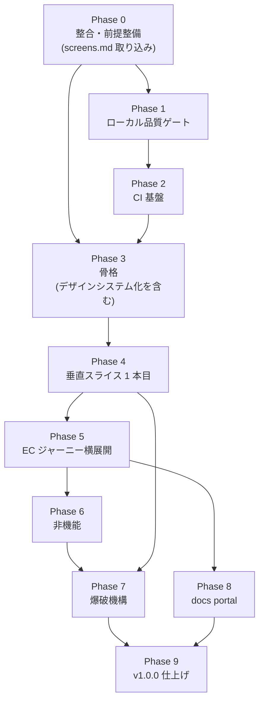

# nextjs-boilerplate v1 実装計画

本書は v1.0.0 到達までの**工程計画**である。役割分担は次のとおり。

- **決定の正 = ADR**(`docs/adr/00NN-*.md`)。本書は決定を再掲せず、ADR 番号 + 相対リンクで参照する
- **進捗ボードの正 = [BACKLOG.md](../adr/BACKLOG.md)**。枠 ID のステータスは BACKLOG が正
- **ADR 外の恒久確定事項 = [master-plan.md](master-plan.md)**(滑走路原則・採用ロードマップ・棄却)
- **サンプル仕様の正 = [screens.md](../screens.md)**(19 画面 + API 概要)。Phase 5 の PR 分解はここを入力とする
- **本書 = 工程**。Phase → PR の分解と、各 PR の完了条件・依存関係を持つ

- 生成日: 2026-07-26
- 本書は master-plan 第 2 章「実装ロードマップ」(旧 Phase 1〜5)を吸収した後継である

---

## 0. 進め方

### 0.1 作業手順

```text
本書(一覧) → GitHub issue 発行 → issue 上で精緻化 → 実装(PR)
```

**issue の発行は設計方針が固まってから行う。** 本書の段階では発行しない。issue 化の単位は本書の PR 1 件 = issue 1 件、マイルストーンは Phase 単位とする。

### 0.2 実装順の原則 — 垂直スライス優先

カーネルを作り切ってからサンプルを載せる(水平優先)のではなく、**まず 1 画面を端から端まで通す**。

- Phase 3 で全カーネルの「薄い実体」を用意し、Phase 4 で**ユーザー向け商品一覧 1 画面**を `app → features → adapters → gen → errors → logging → components` まで貫通させる
- 貫通後に横へ太らせる(Phase 5)
- **スキャフォールドジェネレータ(B2)は貫通後に作る**。1 本も通っていない段階では「何を生成すべきか」が確定しないため

### 0.3 PR の記法

各 PR は次の 6 項目を持つ。

| 項目 | 内容 |
| --- | --- |
| 目的 | その PR が解決する問題。1〜2 文 |
| 対象 ADR | 実装対象の ADR。ここに無い ADR の決定を実装しない |
| 主な変更先 | 触るファイル / ディレクトリ |
| **強制手段** | **その PR が持ち込む規約を何が守らせるか — 型 / biome / ESLint boundaries / CI ゲート / テスト / scaffold 生成 / 散文のみ** |
| 完了条件 | 検証可能な状態。「動く」ではなく「何が緑になるか」で書く |
| 依存 | 先行させる PR |

**「強制手段」は master-plan 1.3 の B10 をこの記法へ埋め込んだものである。** 台帳を Phase 9 で後から作ると、その時点で散文が大量に溜まっている。各 PR に強制手段を書かせれば「散文のみ」がその場で可視になり、機械強制へ寄せる余地をレビュー時に検討できる。P9-4 はこの欄を集計する作業へ変わる。

**この欄は issue テンプレートの必須項目として決定論的に強制する**(P0-7)。本書の段階では、**強制手段の選択そのものが設計判断になる PR にのみ記入済み**であり、残りは issue 発行時(§0.1 の「精緻化」)に埋める。本書に書かれていないことを「未決定」と読まないための注記である。

---

## 1. v1.0.0 の完了条件

**v1.0.0 の定義 = アプリケーション基盤として成立するクオリティに達すること。**

その指標を **「go-boilerplate のサンプル API を使った EC サイトとして、実際のジャーニーを不足なく満たせること」** とする。ADR の網羅や枠の消化ではなく、**動くものとして成立しているか**で判定する。

判定可能にするための具体条件:

| # | 条件 |
| --- | --- |
| 1 | [screens.md](../screens.md) の **19 画面すべてが実バックエンド接続で動作する** |
| 2 | 主要ジャーニーの **E2E が CI で緑**(P6-4) |
| 3 | **一括破棄(爆破)後もビルド・型検査・テストが通る**(P7-2) |
| 4 | master-plan 1.3 の 14 仕掛けのうち **B9 / B11 を除く 12 件が実装済み**(B9 は §3.11 の手順上の例外で v1 では実施しない、B11 は v1.x.x) |
| 5 | ドキュメントが **EN canonical + `.ja.md` mirror** で整合している(P9-2) |
| 6 | ADR が **immutable 運用へ移行**している(P9-3) |

**BACKLOG はゲートではなく記録**として扱う。ADR 65 本のうち BACKLOG に枠があるのは 39 本のみで、枠のない 26 本には [0111](../adr/0111-csp-security-headers.md)(CSP)/ [0079](../adr/0079-auth-frontend-seam.md)(認証)/ [0061](../adr/0061-form-mutation-ux.md)〜[0063](../adr/0063-mutation-result-notification.md)(フォーム)/ [0073](../adr/0073-pagination-fetch-boundary.md)〜[0078](../adr/0078-dynamic-feature-flag-seam.md)(データ境界 seam)等が含まれる。したがって「全枠 ✅」は **CSP もフォーム機構も未実装のまま形式的に満たせてしまい、完了条件として機能しない**。枠の増設は P9-5 で記録の整合として行う。

**Tier 5 の [0121](../adr/0121-i18n-strategy.md) / [0100](../adr/0100-accessibility-target.md) / [0101](../adr/0101-performance-budget.md) / [0102](../adr/0102-browser-support.md) は後回し**とし、必須条件から外す(P9-5 で現状のまま出せるか確認する)。

### 1.1 バージョン運用

- 現在の正は **v0.0.7**(`package.json` の `0.2.0` は更新漏れ。P0-3 で修正する)
- 本書の方針が確定した時点で **0.1.0** を切る
- 以降は Phase 完了ごとにマイナーを上げ、全 Phase 完了で **1.0.0**
- **GitHub のデフォルトブランチは `release/vX.Y.Z`**(go-boilerplate と同形式)。実測では go-boilerplate = `release/v2.1.0` / 本リポ = `release/v0.0.6` で **既に de facto そうなっており、[0150](../adr/0150-git-workflow.md) の「`develop` = デフォルトブランチ」という記述の方が誤り**。運用変更ではなく 0150 の記述修正として P0-4 で扱う。PR のベースは 0150 どおり `develop`

---

## 2. v1.0.0 までの暫定運用

> **(このセクションは v1.0.0 時には消すこと)**

0.0.x〜0.x.x の間、通常は保護されている以下の制約を**一時的に解除**する。理由は、v1 実装が設計の全面的な具体化であり、都度承認を挟むと工程が成立しないため。

- **Protected Documentation の直接編集を許可する** — `AGENTS.md` / Accepted ADR 本体 / `LICENSE` を、ユーザ承認を都度取らずに上書き編集してよい
- **AI Modification Scope の保護パスを解除する** — `package.json` / `tsconfig.json` / `next.config.ts` / `mise.toml` / `biome.json` / `Makefile` / `.makefiles/` / `.github/` / `.claude/` を直接編集してよい
- **ADR は living document として直接上書きする** — [0140](../adr/0140-documentation-operations.md) の 0.0.x living 運用を v1.0.0 未満まで延長する
- **経緯・変遷コメントを本文に残さない** — 「当初は X だったが Y に改訂」「2026-07-14 に反転」のような改定履歴・検討経緯を文書本文に書かない。決定の**現在形**だけを書く。経緯は git 履歴が持つ

v1.0.0 到達時に本セクションを削除し、同時に:

1. `AGENTS.md` の Protected Documentation / AI Modification Scope を復活させる
2. [0140](../adr/0140-documentation-operations.md) の ADR 不可変性を immutable へ切り替える
3. 全 ADR 本文から経緯記述を除去する(P9-3)

---

## 3. この計画で確定した ADR 外の事項

ADR に載らない、本計画固有の確定事項。

### 3.1 開発環境 — 自前の compose を持たない

nextjs-boilerplate は `docker-compose.yaml` を持たない([0011](../adr/0011-no-docker.md) と整合)。開発時は **go-boilerplate の compose スタックに接続**する。

| 接続先 | 既定 | 用途 |
| --- | --- | --- |
| API | `http://localhost:8080` | BFF の向き先 |
| OTLP | `http://localhost:4318` | 観測性([0081](../adr/0081-observability-logging.md))。go 側 `observability`(otel-lgtm)。Grafana は `:3000` |
| Object Storage | Garage の公開エンドポイント | 画像配信。bucket = `gobp-local` |
| 認証 | `http://localhost:4000` | go 側 `mock_auth_server`(疑似 OIDC) |

起動は `cd ../go-boilerplate && docker compose --profile development up`。フロント単独で作業する場合は **MSW モック**(`APP_API_MODE=mock`)へ切り替える。

### 3.2 画像配信 — 配信レイヤは持たず「拾う側」だけ実装する

- Garage は **public storage** として扱う(匿名 read 可・listing 不可)。private bucket ではない
- したがって本 repo に**配信プロキシ(Route Handler)は置かない**。持つのは `mediaUrl()` 純関数と `next.config.ts` の `images.remotePatterns` のみ
- 最適化は `next/image` が単独で担う。`/cdn` のような自前の配信経路は作らない

```ts
mediaUrl(path) => `${MEDIA_ORIGIN}/${path}`
// サンプル時: MEDIA_ORIGIN = Garage の公開エンドポイント
// 爆破後   : MEDIA_ORIGIN = fork 先の実ストレージ / CDN
```

- オブジェクトキーは backend が発行する `products/{uuid}.{ext}`。**表示 URL の組み立てはフロント責務**(backend はパスのみを持ち、フル URL を保存しない)
- 爆破後の `public/` にフォールバック画像は同梱しない。favicon / app icon は App Router の metadata file 規約により `app/` 配下にあり、PWA は [0130](../adr/0130-pwa-strategy.md) で v1 非採用のため、`public/` はほぼ空になる
- **`public/` は実行時書き込み不可**(ビルド時に焼き込まれ、PaaS のファイルシステムは読み取り専用)。よって爆破後の本線は「`MEDIA_ORIGIN` を実ストレージに向ける」であり、`public/` 配下からの配信はバックエンドを持たない開発時の逃げ道という位置づけ

### 3.3 画像のローディング表現 — blur プレースホルダを採用しない

`blurDataURL` は静的 import でのみ自動生成され、バックエンド由来の画像では自前供給が必要になる。これを契約に載せると **一覧レスポンスが件数分肥大する**(1 件あたり数百バイト)ため採用しない。

代わりに **`components` カーネルに画像用ローディングコンポーネント**を置く。

- 既定は **CSS のみのスケルトン**(ラッパに `aspect-ratio` + スケルトン背景、その上に `<Image fill>`)。`"use client"` 不要で [0040](../adr/0040-routing-rendering-strategy.md) と整合
- アスペクト比固定が CLS 対策を兼ねる(`rules.md` #17 の「スケルトンと実 UI の形状一致」)
- エラー時フォールバックが必要な場合のみ `onError` を使う client 版を用意する(既定にはしない)
- **LCP になる画像(一覧の先頭数枚・詳細のメイン画像)は `priority` を付け、スケルトンを挟まない**
- OpenAPI の契約は `imagePath` のみで確定する

### 3.4 滑走路原則の改訂

master-plan 1.1 の滑走路原則を次のとおり改める。

- **設置面(mount point)が実在する場合にのみ seam を敷く。** 設置面がなければ何も置かない
- 従来の「形は 2 種 — ① 動くローカル最小機構 / ② インターフェース(IF/port)定義」のうち、**② 空の IF 定義は採用しない**(使われない IF は腐るため)
- 結果として master-plan 1.2 の v2 採用マトリクス 9 件は、v1 では**何も置かない**

### 3.5 サンプル(EC)の破棄境界

- **破棄するのはジャーニー**(画面・feature・ルート・E2E・モック・生成物)。画面系はほぼ全て破棄する
- **残すのはドメインを持たないもの**。UI パーツは「作り替えるもよし、捨てるもよし、あくまで参考」の但し書きを README に置いたうえで残す
- **破棄対象をディレクトリ名で表現しない。** ファイルは自然な場所・自然な名前に置き、破棄対象は爆破 manifest の**明示パス宣言**と、共有ファイル内の**マーカー**で表現する(下記「宣言方式」)

| 対象 | 例 | 扱い |
| --- | --- | --- |
| ジャーニー | `features/**` / `app/(shop)` / `app/(admin)` / `e2e/` / `mocks/` / `gen/` | **破棄** |
| カーネル内サンプル固有 | `stores/cart-store.ts` / `adapters/server/product-client.ts` | **破棄**(manifest 宣言) |
| **EC 特化 UI パーツ** | `components/product-card.tsx` / `cart-line-item.tsx` / `price-display.tsx` | **破棄**(manifest 宣言) |
| **汎用 UI パーツ** | `components/` 直下(button / input / dialog / table / skeleton 等・shadcn/ui 由来) | **残す**(README に但し書き) |
| **機構** | `cn()` / 画像ローディングの仕組み / `ActionState<T>` / 4 状態の型 | **残す** |
| **デザイントークン** | 色 / タイポ / スペーシング | **残す** |
| 認証・認可の機構 | session cookie 取扱い / 保護ルート判定 / RBAC ヘルパ | **残す** |
| 認証・認可の画面 | ログイン画面は残す / 管理画面は破棄 | **混在** |

境界の判定基準は **「用途特化か汎用か」**。EC でしか使わないパーツと装飾目的のパーツは破棄し、どのプロジェクトでも使う汎用パーツと機構は残す。

#### 宣言方式 — `_sample/` のようなディレクトリ隔離は採らない

破棄対象を `_sample/` 等の命名で隔離する方式は**採用しない**。理由は 2 つ。

- **参照実装であることと矛盾する** — サンプルは B5 ゴールデンパスであり、production 品質で書かれた**模範コード**である。`_sample/` はこれを「仮のコード」に見せてしまう
- **fork 先が見る構造が歪む** — 自分で書くときには存在しないディレクトリ階層を、参照実装だけが持つことになる

代わりに go-boilerplate と同じ 2 系統で宣言する。

| 粒度 | 宣言方法 |
| --- | --- |
| ファイル / ディレクトリ丸ごと | 爆破 manifest(`scripts/setup/lib/sample-manifest.mjs`)の `paths[]` に**明示列挙** |
| 共有ファイル内の混在行 | ファイル内の**マーカー**(`sample:begin`/`end` / `sample:line` / `sample:replace-*`) |

これによりコードは自然な場所・自然な名前のまま置ける。破棄対象かどうかは manifest を読めば分かる。

### 3.6 認証の責務分界

**Authorization Code + PKCE で、Next.js の Route Handler が IdP と直接やりとりする**([screens.md](../screens.md) U9)。

- ブラウザは **httpOnly BFF Session Cookie のみ**を保持し、JWT(Access Token)はブラウザに露出しない
- フロントの画面実装は「ログインボタン → BFF の URL(`/api/auth/login`)へ遷移」のみ。Go API を一切叩かない
- 認証が要る API 呼び出しは、BFF 経由で Bearer が自動付与される前提で実装する(個別に Authorization ヘッダを組み立てない)
- 401 = 未ログイン / セッション切れ → ログイン画面へ。403 = 権限不足 → 導線ごと出し分ける
- ローカルの IdP は go 側 `mock_auth_server`(`http://localhost:4000`)

これは [0079](../adr/0079-auth-frontend-seam.md) の「session = httpOnly cookie / payload 最小」「認可は 2 層(optimistic + 確定)」に忠実な形である。

**コア残留と差し替え可能性の両立 — Resolver IF 方式**: 0079:69 は「特定の session 実装詳細(暗号化方式 / stateless vs DB)を boilerplate 本体に前提として組み込む」ことを禁じている。これを次の形で満たす。

- **大部分(seam・保護ルート判定・`returnUrl`・状態破棄・RBAC ヘルパ)はコア残留**
- **各社の事情が入る箇所(暗号化 / OIDC クライアント)は IF で切り、Resolver として内部処理を隠蔽する**。既定実装を 1 つ同梱し、fork 先は Resolver を差し替えるだけで済む
- これは §3.4 の改訂滑走路原則と整合する。**設置面(サンプルが実際に使う既定実装)を伴った IF** であり、禁じた「空の IF 定義」ではない

実装時に確定する項目(§5 に登録): Resolver の IF 形状 / 既定実装のライブラリ選定 / refresh の扱い / role の取得元(IdP claim か `/v1/users/me` か)。

### 3.7 Cookie 同意 — 軽量機構を採用する

[0131](../adr/0131-cookie-consent.md) の exclusion を**採用へ反転**する。

- **理由**: [0031](../adr/0031-policy-state-supply.md)(policy state supply)が consent 状態供給を既に規定しており**設置面が実在する**(§3.4)。加えて同意はサードパーティスクリプトの**読み込みをゲートする**機構であり、layout / CSP `script-src` / `next/script` strategy に同時に食い込むため、後付けコストが高い
- **範囲は「軽量 consent 機構 + ゲート」まで**。同意状態の保持([0031](../adr/0031-policy-state-supply.md) 経由)/ 同意バナー / スクリプト読み込みゲート / 計測用 cookie_id の発行までを持つ
- **GTM / PostHog 本体は v1 では入れない**(master-plan の「Medium = 統合するが既定は控えめ」)。CMP・IAB TCF 等の本格的な同意管理も対象外

### 3.8 TipTap を v1 スコープへ繰り上げる

商品説明(description)がリッチテキストであるため([screens.md](../screens.md) A6 / A7)、TipTap は master-plan 1.2 の v2 マトリクスから外し **v1 採用**とする。[0053](../adr/0053-ui-component-interaction-seam.md) の「Thin: seam + sanitizer + デモ」が実使用へ格上げされる。

- 表示側は **必ず sanitizer を通す**(`rules.md` #48。生の `dangerouslySetInnerHTML` は禁止)
- TipTap が inline style を出力するため、CSP の `style-src` が論点になる(§3.9)

### 3.9 CSP — enforce seam は「sanitizer の検証結果」で決める

[0111](../adr/0111-csp-security-headers.md) は **seam A(`next.config.ts` の非 nonce CSP)を既定**とし、seam B(`proxy.ts` の per-request nonce)は「**既定にしない**」と明記している。理由は「nonce を使うと全ページが dynamic rendering を要求し、静的最適化・ISR・CDN キャッシュ・**PPR / Cache Components と非互換**になる」ため。

したがって **nonce へ倒す判断は、P6-8(Cache Components の有効化判断)と同時に決まる**(両立しない)。

**判断の前に検証すべき事実が 2 つある。**

1. **TipTap の inline `style=` 属性に nonce は原理的に効かない** — nonce は要素(`<style>` / `<script>`)にしか付かず、属性は `style-src-attr` の管轄で `'unsafe-inline'` 以外に許可手段がない。つまり「リッチテキストのために `'unsafe-inline'`」は **nonce へ倒しても解消しない**
2. **sanitizer で `style` 属性を落とせるなら、`'unsafe-inline'` 自体が不要になる** — 商品説明に必要なのは太字 / 斜体 / リスト / 見出し / リンク程度で、いずれも inline style ではなくクラスへ写像できる

**よって順序を固定する**: P5-1(sanitizer 選定)で「`style` 属性を落として TipTap の要件を満たせるか」を先に検証し、その結果を入力として P0-4 の 0111 追補(seam A 維持 / seam B へ反転)を確定する。静的を保ったまま script を厳格化したい場合の道は nonce ではなく **hash ベース**([0111](../adr/0111-csp-security-headers.md) が挙げる実験的 SRI)であり、採るなら別途判断する。

### 3.10 TypeScript / ライブラリの確定事項

[0004](../adr/0004-library-management.md) の未決 3 件を確定する。

**`cva`(class-variance-authority): 採用。** shadcn/ui の公式コンポーネントは cva を使った状態で配布されるため、入れないと配布物を毎回書き換えることになる。[0010](../adr/0010-standards-and-non-lockin.md)「独自に機構を発明しない」とも整合する。`rules.md` #34 / #35 の規約はこれに従う形で埋まる。

**tsconfig の追加フラグ: 5 件を採用。**

| フラグ | 採否 | 理由 |
| --- | --- | --- |
| `noUncheckedIndexedAccess` | 採用 | 配列 / インデックス参照の undefined を型で捕まえる |
| `erasableSyntaxOnly` | 採用 | `enum` / `namespace` を禁止し、`rules.md` #38 の「enum 可否」を機械的に決着させる |
| `verbatimModuleSyntax` | 採用 | `import type` の規律 |
| `noImplicitOverride` | 採用 | 低摩擦 |
| `noPropertyAccessFromIndexSignature` | 採用 | index signature へのドット参照を禁止。流入口([0030](../adr/0030-environment-variable-management.md) の `process.env` / `rules.md` #42 の searchParams)が既に塞がれているため**実質ゼロコストで決定論が得られる** |
| `exactOptionalPropertyTypes` | **見送り** | React props との摩擦が高い。残る穴(「未指定」と「明示的 undefined」を型で区別できない)は下記の実行時機構で埋める |
| `noUnusedLocals` / `noUnusedParameters` | **入れない** | biome が `correctness/noUnusedVariables` / `noUnusedFunctionParameters` で **error として捕捉することを実測で確認済み**。[0002](../adr/0002-formatter-linter.md) の重複禁止に従う |

あわせて `target` を `ES2017` から引き上げる(現状は Next.js 16 / [0102](../adr/0102-browser-support.md) と釣り合っていない)。

**`exactOptionalPropertyTypes` 見送りの穴を埋める機構**(散文の規約にしない): `JSON.stringify` は値が `undefined` のキーを落とすため、`{name: undefined}` と `{}` はワイヤ上で同一になる。残る危険は直列化より手前のローカル組み立てだけなので、**`adapters` に PATCH ペイロード正規化関数を置き、そこに閉じ込める**。

- 「触らない」= キーを含めない / 「消す」= `null` を明示。`undefined` に意味を持たせない
- adapters の公開面を**正規化済み型でしか受け付けない形にする**(型で強制)
- 「`undefined` キーは消える / `null` は残る」をテストで固定する
- 実装は P4-3(fetch wrapper)、使用は P5-12(A7 商品編集の部分更新)

**`nuqs` 等 searchParams ヘルパ: v1 不採用。** [0004](../adr/0004-library-management.md) の一次判定(単一責務 × 単一 upstream)は通るが、[screens.md](../screens.md) U2 の主眼が **RSC 再取得**であり client state 同期層を必要としない。§3.4「設置面が実在する時のみ」に従い、実装して不足を感じてから入れる。

**ただし「入れない」は「何も決めない」ではない。** `searchParams` の標準形(zod スキーマ / パース関数 / URL 更新ヘルパの置き場)を **scaffold(B2 = P4-6)の生成物に含める**ことで、各画面がバラバラに実装するのを防ぐ。`rules.md` #42 は「この生成物を使う」という参照に留める。

### 3.11 デザインワークフロー — v1 は Figma を使わない(手順上の例外)

**原則は Figma が SSOT である。** ADR / `rules.md` / master-plan はこの軸で書く(本節はそれを覆さない)。

**ただし v1 の手順としてはこれを省略する。** 理由は 3 つ:

- 手順を減らしたい
- 個人開発では Figma を挟むメリットが薄い
- Figma 領域まで保守する意思がない

**これは恒久的な規約の変更ではなく、v1 における手順上の例外判断である。** fork 先が Figma を SSOT に据えるなら、B9(トークン同期パイプ)を足すだけで原則どおりに戻せる。

**v1 の実際の手順**:

```text
shadcn/ui を import
  → Storybook で閲覧可能化
  → 改修してデザインシステムとして成立させる
  → デザインシステムを外部のデザイン支援ツールへ書き出す
  → そこで feature / page の見た目を検討する
  → 検討結果を参照して repo に実装する(実装ロジックは壁打ちで詰める)
```

**目的はデザインセンスを AI で補うこと**であり、コードを生成させることではない。外部ツールの出力は **Figma の代替 = 仕様の入力**として扱う。repo のコードは B2(`pnpm gen`)が骨を作り、実装が見た目を合わせにいく。

**依存の向きは `repo → design` の一本で確定する。**

作業の場所は層によって異なる(デザインシステムは repo 側、page の組み合わせは外部ツール側)が、**依存は常に repo → design** である。外部ツール側の成果物は検討結果であって、repo へ自動同期しない。**人間が見て実装する**(参照は逆向きに流れるが、それは依存ではない)。

**ツール固有の手順は ADR / `rules.md` / master-plan に書かない。** 特定 SaaS の名前を恒久文書へ持ち込むことは [0010](../adr/0010-standards-and-non-lockin.md)(非ロックイン)に反する。書き出し・同期の具体手順は `.claude/skills/` のスキル 1 本に閉じ込め、[0154](../adr/0154-claude-skills-operations.md) / [0155](../adr/0155-claude-skills-development.md) の運用規約に従わせる。

**v1 で実施しないもの**: **B9(Figma → CSS 変数の同期パイプ)**。原則としては master-plan 1.3 の記述が正だが、v1 は Figma を使わないため搬送すべき上流が存在しない。v1 では `tokens.json` を手書きの SSOT とし、`tokens.json → Tailwind @theme` の後段のみを実装する。

**B1 テンプレの「状態表 × デザイン参照」**: 参照先の形式は fork 先が決める(Figma フレーム / Storybook story)。**v1 では Storybook story を参照先とする** — story は実在し CI で検証できるため、この repo の手順では強い。

**代わりに必要になる規律**: Figma で全画面を並べて見る場が無いため、一貫性は **Storybook が唯一の在庫リストであること**で担保する。「**Storybook に story を持たないコンポーネントを feature 配下に新規作成しない**」を B11(構造 CI ゲート・v1.x.x)の検査項目に含める。

---

## 4. PR 一覧

全 64 PR。issue 化の単位はこの 1 行 = 1 issue。

| ID | タイトル | Phase | 依存 |
| --- | --- | --- | --- |
| P0-1 | v1.0.0 までの暫定運用を明文化 | 0 | — |
| P0-2 | リンク切れ一括修正 | 0 | P0-1 |
| P0-3 | バージョン・依存の整合 | 0 | — |
| P0-4 | ADR 追補・不整合解消 | 0 | P0-1 |
| P0-5 | master-plan の再編 | 0 | P0-4 |
| P0-6 | 画面一覧の取り込み(`docs/screens.md`) | 0 | — |
| P0-7 | issue テンプレートの整備 | 0 | P0-1 |
| P1-1 | commitlint | 1 | — |
| P1-2 | gitleaks + trivy | 1 | — |
| P1-3 | actionlint 先行移植 + setup スクリプト拡充 | 1 | — |
| P2-1 | 基本 workflow(upsert-pr-comment / lint / typecheck / build / smoke) | 2 | P1-3 |
| P2-2 | セキュリティ workflow(CodeQL / gitleaks / trivy / Dependabot) | 2 | P2-1 |
| P2-3 | actions SHA ピン機構 | 2 | P2-2 |
| P3-1 | 11 カーネルの物理化 + 層別 README(B13) | 3 | P0-4 |
| P3-2 | architecture.ts SSOT + ESLint boundaries(B4) | 3 | P3-1 |
| P3-3 | env / 型付き Config | 3 | P3-1 |
| P3-4 | errors カーネル | 3 | P3-1, P3-6 |
| P3-5 | logging / observability カーネル | 3 | P3-3, P3-4 |
| P3-6 | テスト基盤(Vitest + RTL + MSW) | 3 | P3-1, P2-1 |
| P3-7 | styling 基盤(design token はコードが SSOT) | 3 | P3-1 |
| P3-8 | components + Storybook + デザインシステム化 | 3 | P3-7 |
| P3-9 | rules.md 骨格 34 エントリ | 3 | P0-4 |
| P3-10 | ドキュメントレール(B1 / B6 / B14) | 3 | P3-1 |
| P4-1 | OpenAPI 取得機構 | 4 | P3-3 |
| P4-2 | orval による型 + zod 生成 | 4 | P4-1 |
| P4-3 | adapters — fetch wrapper | 4 | P4-2, P3-4, P3-2, P3-6 |
| P4-4 | MSW モック(B3) | 4 | P4-2, P3-6 |
| P4-5 | 商品一覧の貫通 | 4 | P4-3, P4-4, P3-8, P3-2, P3-6, P3-10 |
| P4-6 | スキャフォールドジェネレータ(B2) | 4 | P4-5 |
| P5-1 | U3 商品詳細 + エラー境界の配置規約 + sanitizer | 5 | P4-5 |
| P5-2 | U2 商品一覧の完成(フィルタ / sort / cursor)+ ページネーション基盤 | 5 | P4-5 |
| P5-3 | U1 トップ(並行 fetch)+ マスタ API | 5 | P5-2 |
| P5-4 | 認証基盤(U9・PKCE + BFF Route Handler + 保護ルート) | 5 | P4-3, P4-5 |
| P5-5 | U4 カート(stores カーネル・永続化なし) | 5 | P5-1 |
| P5-6 | U5 購入確認 + 通貨・為替(USD セント / `display_currency` / degrade) | 5 | P5-5, P5-4 |
| P5-7 | U6 購入完了 + `ActionState<T>`(B8)+ Idempotency-Key | 5 | P5-6 |
| P5-8 | U7 購入履歴(無限スクロール)+ U8 購入詳細 | 5 | P5-7 |
| P5-9 | U11 マイページ + U12 ユーザー更新(CollectAll)+ 退会 | 5 | P5-4 |
| P5-10 | U10 登録(オンボーディング)+ 住所補完 degrade | 5 | P5-9 |
| P5-11 | admin シェル + RBAC + A2 商品一覧 | 5 | P5-4, P5-2 |
| P5-12 | A6 商品作成 / A7 商品編集(TipTap + 画像アップロード + 楽観ロック 409) | 5 | P5-11 |
| P5-13 | A3 商品補充 + A5 ユーザー一覧 | 5 | P5-11 |
| P5-14 | A1 ダッシュボード + A4 集計(backend 合成) | 5 | P5-11 |
| P5-15 | purchases ステータス遷移(cancel / pay / ship / deliver) | 5 | P5-8, P5-11 |
| P5-16 | ゴールデンパス README 整備(B5 完成) | 5 | Phase 5 全 PR |
| P6-1 | クライアント観測性 | 6 | P3-5, P4-5 |
| P6-2 | CSP / セキュリティヘッダ + CI 適合ゲート | 6 | P5-16 |
| P6-3 | SEO / metadata + fonts | 6 | P5-1, P5-4 |
| P6-4 | E2E + visual regression | 6 | P5-16, P3-8 |
| P6-5 | capabilities カーネル | 6 | P5-7 |
| P6-6 | メンテナンスモード | 6 | P5-4 |
| P6-7 | Cookie 同意(軽量 consent 機構 + ゲート) | 6 | P6-2 |
| P6-8 | プラットフォーム機能の有効化判断 | 6 | P6-4 |
| P7-1 | 爆破スクリプト移植 | 7 | P5-16 |
| P7-2 | マーカー埋め込み + purge 検証 CI | 7 | P7-1, P6-4 |
| P7-3 | `new-feature` スキル(B12) | 7 | P4-6, P3-10 |
| P8-1 | portal 基盤移植 | 8 | P5-16 |
| P8-2 | deploy-docs workflow + スキル復活 | 8 | P8-1, P2-1 |
| P9-1 | rules.md 磨き上げ | 9 | P7-2, Phase 6 全 PR, Phase 8 全 PR |
| P9-2 | EN canonical 化 + `.ja.md` mirror | 9 | P9-1 |
| P9-3 | ADR immutable 化 + 経緯除去 + 暫定運用の撤去 | 9 | P9-2 |
| P9-4 | トレーサビリティ台帳(B10) | 9 | P9-1 |
| P9-5 | Tier 5 後回し分の最終確認 | 9 | P9-3 |
| P9-6 | v1.0.0 リリース | 9 | 全て |

### 4.1 依存マップ



---

## Phase 0: 整合・前提整備

既存文書の不整合を先に潰す。実装に入ってから直すと差分が読みにくくなる。

### P0-1: v1.0.0 までの暫定運用を明文化

- **目的**: 本書 §2 の暫定運用を、参照される場所すべてに書き込む。以降の全 PR がこの緩和の上で動くため最初に置く
- **対象 ADR**: [0140](../adr/0140-documentation-operations.md) / [0152](../adr/0152-agents-md-policy.md)
- **主な変更先**:
  - `AGENTS.md` — 「v1.0.0 までの暫定運用」節を新設(Protected Documentation / AI Modification Scope の一時解除)
  - `docs/adr/0140-documentation-operations.md` — living 運用を「0.0.x」から「v1.0.0 未満」へ延長。経緯記述の禁止を追記
- **完了条件**: 両ファイルに削除マーカー `(このセクションは v1.0.0 時には消すこと)` 付きの節が存在する
- **依存**: なし

### P0-2: リンク切れ一括修正

- **目的**: 2026-07-18 の `docs/plan/` 統合で発生したリンク切れを解消する
- **対象 ADR**: [0140](../adr/0140-documentation-operations.md)
- **主な変更先**:
  - `AGENTS.md` — ADR 表のリンク切れ 2 件(`0075-bff-external-boundary-seam.md` → `0075-file-upload-seam.md` / `0091-testing-and-catalog-policy.md` → `0091-test-verification-methods.md`)
  - `docs/adr/*.md` — **55 ファイル / 160 リンク**が削除済み `../plan/*.md` を参照

| 参照先 | 件数 | 処理 |
| --- | --- | --- |
| `pre-implementation-decisions.md` | 62 | 内容は各 ADR 本体へ移管済み。リンク削除 |
| `adr-gap-triage.md` | 35 | 仕分け経緯。§2 に従いリンクごと削除 |
| `adoption-matrix.md` | 29 | master-plan 1.2 へ付け替え |
| `adr-gap-audit.md` | 21 | 監査番号(#NN)の参照元。master-plan へ付け替えるか削除 |
| `structural-blocker-resolutions.md` | 9 | 解決済み。リンク削除 |
| `a1-layer-mapping-options.md` | 4 | 選択肢比較。リンク削除 |

- **強制手段**: markdownlint + リンク検査
- **完了条件**: `docs/` 配下に解決不能な相対リンクが存在しない(markdownlint + リンク検査で確認)
- **依存**: P0-1
- **状態**: **実施済み**(PR #26)。参照 145 件を振り分けて解消。実測で ADR 側の残存参照 0 件 / `AGENTS.md` のリンク切れ 0 件を確認済み。issue 化の際はクローズ済みとして扱う

### P0-3: バージョン・依存の整合

- **目的**: `package.json` の実態ずれを解消する
- **対象 ADR**: [0004](../adr/0004-library-management.md) / [0142](../adr/0142-license.md)
- **主な変更先**: `package.json`
  - `version` を `0.2.0` → `0.0.7` に修正(タグの最新は `v0.0.6`、現ブランチは `release/v0.0.7`)
  - `"license": "MIT"` を追加([0142](../adr/0142-license.md) の follow-up)
  - PR テンプレートへ「ライブラリ採用チェック」を組込([0004](../adr/0004-library-management.md) の改訂版テンプレ。一次判定 / 例外パス / fork コスト上限を含む)
  - **`docs/adr/BACKLOG.md` の T4 記述を修正** — 「`typescript: "^5"` が caret 指定」は stale(実際は `6.0.3` で exact 済み)。残るギャップは PR テンプレ未組込のみ
- **強制手段**: CI(lockfile-drift / lint)+ PR テンプレの記入欄
- **完了条件**: BACKLOG T4 の実装ギャップが解消され ✅ になる。`package.json` の version がタグと一致する
- **依存**: なし

### P0-4: ADR 追補・不整合解消

- **目的**: 実装前に決着が必要な決定を ADR 本体へ反映する。ここが片付かないと Phase 3 以降で判断が止まる
- **対象 ADR**: 下表のとおり
- **主な変更先**:

| 追補先 | 内容 | 種別 |
| --- | --- | --- |
| [0050](../adr/0050-styling-strategy.md) | `cva` の採否 | 未決定の decision |
| [0020](../adr/0020-adopted-architecture.md) or [0002](../adr/0002-formatter-linter.md) | tsconfig strict フラグの選定 | 未決定の decision |
| [0060](../adr/0060-state-management.md) | `nuqs` 等 searchParams ヘルパの採否 | 未決定の decision |
| [0110](../adr/0110-security-operations.md) | CSP CI 適合ゲート 1 本の追加(`> Rationale: 0111`) | 追加 |
| [0091](../adr/0091-test-verification-methods.md) | visual regression を「tooling defer」→ **採用**(Playwright スクリーンショット) | 不整合解消 |
| [0022](../adr/0022-capabilities-kernel.md) | hook 例から keyboard shortcut registry を削除(据え置き除外のため) | 不整合解消 |
| [0075](../adr/0075-file-upload-seam.md) | **バックエンドが multipart を採る場合は multipart proxy を既定とする** | 前提更新 |
| [0011](../adr/0011-no-docker.md) | 開発環境は go 側 compose に接続する(本書 §3.1)を追記 | 前提更新 |
| [0045](../adr/0045-fonts-and-images.md) | 画像配信は public storage 前提・自前配信レイヤなし(本書 §3.2)を追記 | 前提更新 |
| [0028](../adr/0028-naming-convention.md) | 標準名を持つ env(`OTEL_*` 等)は `{SUBSYSTEM}_{NAME}` の例外とする | 例外条項 |
| [0131](../adr/0131-cookie-consent.md) | **exclusion → 採用へ反転**。軽量 consent 機構 + ゲートまで(本書 §3.7) | 反転 |
| [0053](../adr/0053-ui-component-interaction-seam.md) | **TipTap を Thin seam → v1 実使用へ格上げ**(本書 §3.8)+ keyboard shortcut registry seam の記述を削除(0022 側と同時) | 前提更新 |
| [0111](../adr/0111-csp-security-headers.md) | **CSP enforce seam の確定**。0111 は seam A(非 nonce・静的)を既定とし seam B(nonce)を「既定にしない」と明記している。P6-2 の nonce 前提はこれに違反するため、**seam A 維持で P6-2 を書き換える / seam B へ反転する のいずれかを確定**する(本書 §3.9) | 違反解消 |
| [0079](../adr/0079-auth-frontend-seam.md) | **動く最小 session 機構の本体同梱へ反転**。0079:69 は「特定の session 実装詳細を本体に前提として組み込む」ことを禁じているため、Resolver IF 方式(本書 §3.6)を decision として明記する | 反転 |
| [0027](../adr/0027-directory-structure.md) | **MSW モック生成物の配置**。0027:60 は `src/` 外の `mocks/` と規定。P4-4 をこれに合わせる(計画側を修正・ADR は変更不要の可能性あり。突合して確定) | 違反解消 |
| [0052](../adr/0052-ui-component-policy.md) | 禁止事項「❌ リッチテキストを本体へ持ち込むこと」と v2 記述を、TipTap の v1 採用に合わせて改訂 + **`cva` 採用を明記**(本書 §3.10) | 前提更新 |
| [0024](../adr/0024-adapters-server-client-split.md) | 決定表の「presigned 直 PUT」を multipart proxy 既定に合わせて改訂(0075 と同時) | 前提更新 |
| [0031](../adr/0031-policy-state-supply.md) | 「consent 本体の非同梱は 0131 のまま不変」の記述を、0131 の反転に合わせて改訂 | 前提更新 |
| [0150](../adr/0150-git-workflow.md) | **デフォルトブランチの記述修正**。実測では `release/vX.Y.Z` が de facto(本書 §1.1) | 記述修正 |
| [0002](../adr/0002-formatter-linter.md) or [0020](../adr/0020-adopted-architecture.md) | **tsconfig の追加フラグを確定**(本書 §3.10)+ `target` 引き上げ | 未決定の decision → 確定 |
| [0060](../adr/0060-state-management.md) | **`nuqs` 等ヘルパは v1 不採用**を明記し、searchParams の標準形は scaffold 生成で担保すると記す(本書 §3.10) | 未決定の decision → 確定 |
| [0074](../adr/0074-runtime-communication-seam.md) / [0076](../adr/0076-payment-ui-seam.md) / [0078](../adr/0078-dynamic-feature-flag-seam.md) / [0082](../adr/0082-client-observability.md) / [0121](../adr/0121-i18n-strategy.md) / [0130](../adr/0130-pwa-strategy.md) | **滑走路原則改訂の伝播**。6 本とも「seam 敷済 / 敷設予定」と書いているが、改訂後は**設置面のない seam を敷かない**(本書 §3.4)。該当記述を「採用時の拡張点の記述に留め、v1 では何も置かない」へ改める | 前提更新 |

> [0004](../adr/0004-library-management.md)(ライブラリ選定の一次判定 / 例外パス / fork コスト上限)は **本計画の策定過程で実施済み**のため本 PR の対象外。

- **強制手段**: 散文のみ(ADR 本文の改訂)。ただし各追補が指す機械強制は後続 PR が持つ
- **完了条件**: 上表 22 件が ADR 本文に反映され、`docs/adr/BACKLOG.md` の該当行が更新されている
- **依存**: P0-1

### P0-5: master-plan の再編

- **目的**: master-plan 第 2 章(旧 Phase 1〜5)を本書へ吸収し、工程の SSOT を 1 つにする
- **対象 ADR**: [0140](../adr/0140-documentation-operations.md)
- **主な変更先**: `docs/plan/master-plan.md`
  - **第 2 章(2.0〜2.8)を削除**し、本書へのポインタ 1 行に置き換える(工程の SSOT を 1 つにする)
  - 旧 2.6 の **14 仕掛けの表を第 1 章へ移送**する(工程ではなく「ADR 外の確定事項」のため)
  - 旧 2.7 の rules.md 33 エントリは P3-9 へ転記済みのため削除
  - 1.1 滑走路原則を本書 §3.4 のとおり改訂(② 空の IF 定義は不採用 / 設置面が実在する時のみ敷く)
  - 1.2 の v2 採用マトリクスから **TipTap / Cookie 同意の 2 行を削除**(v1 採用へ移動。本書 §3.7 / §3.8)
  - 1.3(旧)棄却の exclusion 一覧から [0131](../adr/0131-cookie-consent.md) を外す
- **強制手段**: 散文のみ(文書構成)
- **完了条件**: master-plan に工程記述が残っていない。本書と master-plan の記述が重複しない
- **依存**: P0-4
- **状態**: **本計画の策定過程で実施済み**(master-plan は 190 → 96 行、第 2 章はポインタ 1 行)。issue 化の際はクローズ済みとして扱う

### P0-6: 画面一覧の取り込み

- **目的**: サンプル仕様の SSOT を repo 内へ持ち込む。Phase 5 の PR 分解と爆破対象の宣言が両方これを入力にする
- **対象 ADR**: [0140](../adr/0140-documentation-operations.md)
- **主な変更先**: `docs/screens.md` — 19 画面(ユーザー側 12 / admin 側 7)+ API 概要 + 未決事項 + 除外事項
- **注意**: 元資料は go-boilerplate #651(画像アップロード基盤)を反映していないため、**画像まわりの記述に「#651 で改訂済み」の注記を入れる**。stale を伝播させない
- **強制手段**: 散文のみ(Phase 5 の PR が画面 ID を参照する)
- **完了条件**: `docs/screens.md` が存在し、Phase 5 の全 PR がここの画面 ID(U1〜U12 / A1〜A7)と対応している
- **依存**: なし
- **状態**: **本計画の策定過程で実施済み**。issue 化の際はクローズ済みとして扱う

### P0-7: issue テンプレートの整備

- **目的**: §0.3 の PR 記法を issue 発行時に機械的に強制する。散文へ逃げる余地を運用側で塞ぐ
- **対象 ADR**: [0150](../adr/0150-git-workflow.md) / [0140](../adr/0140-documentation-operations.md)
- **主な変更先**: `.github/ISSUE_TEMPLATE/` — 実装 PR 用テンプレート(目的 / 対象 ADR / 主な変更先 / **強制手段** / 完了条件 / 依存)
- **設計**: go-boilerplate の PBI テンプレート(概要 / やること / やらないこと / 完成の定義 / 補足)を参考に、**「強制手段」を必須入力(`validations.required: true`)にする**。空欄では issue を作れないため、「散文のみ」を選ぶ場合も明示的な選択になる
- **強制手段**: issue フォームの必須バリデーション
- **完了条件**: 強制手段を空欄にすると issue が作成できない
- **依存**: P0-1

---

## Phase 1: ローカル品質ゲート

master-plan 旧 2.1 の残り。lefthook + markdownlint + mermaid-lint は導入済み。

### P1-1: commitlint

- **目的**: コミット規約([0150](../adr/0150-git-workflow.md) の prefix 11 種)を機械強制する
- **対象 ADR**: [0150](../adr/0150-git-workflow.md) / [0151](../adr/0151-git-hooks.md)
- **主な変更先**:
  - `package.json` — `@commitlint/cli` を exact pin で devDependency に追加
  - `commitlint.config.*` — go 側 config を移植(prefix 11 種は [0150](../adr/0150-git-workflow.md) と同一)
  - `.lefthook.yaml` — commit-msg フックを接続
  - `.makefiles/tools/commitlint.mk`
- **注意**: mise の `npm:` バックエンドではなく lefthook と同居させる([0151](../adr/0151-git-hooks.md) 整合)
- **完了条件**: 規約外の prefix でコミットが失敗する。規約内の prefix は通る
- **依存**: なし

### P1-2: gitleaks + trivy

- **目的**: シークレット混入と脆弱依存をローカルで止める。CI 導入(P2-2)に先行して開発者の手元で塞ぐ
- **対象 ADR**: [0110](../adr/0110-security-operations.md) / [0151](../adr/0151-git-hooks.md)
- **主な変更先**:
  - `mise.toml` — gitleaks / trivy を aqua バックエンドで登録
  - `.gitleaks.toml` — go 側から移植
  - `.makefiles/tools/` — `make secret-scan` / `make trivy-fs`
  - `.lefthook.yaml` — pre-push へ接続
- **完了条件**: `make secret-scan` / `make trivy-fs` が動作し、pre-push で走る。既知のシークレット形式を仕込むと fail する
- **依存**: なし

### P1-3: actionlint 先行移植 + setup スクリプト拡充

- **目的**: Phase 2 の受け皿を用意する。workflow を書き始める前に検査を用意する
- **対象 ADR**: [0153](../adr/0153-ci-configuration.md)
- **主な変更先**:
  - `mise.toml` — actionlint を登録
  - `.makefiles/` — `make actionlint` / `make help` の未文書化ターゲット警告
  - `scripts/setup/` — repo 参照書換・`package.json` name 書換
- **完了条件**: `make actionlint` が動作する。`make help` が未文書化ターゲットを警告する。setup スクリプトで fork 後の repo 名置換が完了する
- **依存**: なし

---

## Phase 2: CI 基盤

[0153](../adr/0153-ci-configuration.md) / [0110](../adr/0110-security-operations.md) の実装。1 関心事 = 1 workflow / SHA ピン / 最小 permissions / concurrency / hooks mirror CI を全 workflow で守る。

### P2-1: 基本 workflow

- **目的**: 全レポーティングの背骨と基本検査を立てる
- **対象 ADR**: [0153](../adr/0153-ci-configuration.md)
- **主な変更先**:
  - `.github/actions/upsert-pr-comment/` — composite action。go 側から as-is 移植。以降の全レポーティングがこれに乗る
  - `.github/workflows/lint.yaml` / `typecheck.yaml` / `build.yaml` / `lockfile-drift.yaml`
  - `.github/workflows/smoke.yaml` — `next start` → `curl` の起動スモーク
  - `.github/workflows/README.md`
- **注意**: matrix は非採用(単一 ubuntu・mise が版数 SSOT)
- **完了条件**: PR で全 job が緑になる。`upsert-pr-comment` が PR コメントを冪等に更新する
- **依存**: P1-3

### P2-2: セキュリティ workflow

- **目的**: [0110](../adr/0110-security-operations.md) の多層防御を CI に載せる
- **対象 ADR**: [0110](../adr/0110-security-operations.md) / [0004](../adr/0004-library-management.md)
- **主な変更先**:
  - `.github/workflows/codeql.yaml` — js-ts。PR + push baseline + 週次 cron
  - `.github/workflows/gitleaks.yaml` — fail-closed
  - `.github/workflows/trivy.yaml` — 二段(dev advisory / release strict)
  - `.github/dependabot.yml` — cooldown patch 5 / minor 7 / major 30、security は即時
  - `SECURITY.md` — 報告窓口
  - `pnpm audit` の CI 組込(severity high+ / 修正可能性で blocking)
- **注意**: image-scan / cosign / SBOM は [0011](../adr/0011-no-docker.md) の no-docker により exclusion
- **完了条件**: 全 workflow が動作する。既知の脆弱依存を入れると trivy / audit が fail する
- **依存**: P2-1

### P2-3: actions SHA ピン機構

- **目的**: Actions の供給網リスクを検疫付きで管理する
- **対象 ADR**: [0153](../adr/0153-ci-configuration.md) / [0110](../adr/0110-security-operations.md)
- **主な変更先**:
  - `scripts/actions-pin/` — go 側の機構を TS へ書換(resolve / apply / check)
  - `actions-pin.toml` — 解決済み `uses: → SHA` のロックファイル
  - `.makefiles/tools/actions-pin.mk`
  - `.claude/skills/actions-pin/` — BACKLOG C-6 の移植
- **設計**: `min-age-days` の検疫を入れ、公開直後のリリースは自動採用しない(`tools-upgrade` の quarantine と同系)
- **完了条件**: `make actions-pin-check` が fail-closed で動作する。未登録 / 未固定の `uses:` が error になる
- **依存**: P2-2

> **Phase 2 の完了条件**: required check を branch ruleset へ反映する(**GitHub 側の設定はユーザが実施**)。
>
> **採否未判断の残余候補**(Phase 2 実装時に確定する): sync-versions-check(`mise.toml` SSOT ↔ CI の Node 版数 drift 検査)/ auto-generate-docs(bot による生成物更新 PR + 再帰防止 guard)。

---

## Phase 3: 骨格

垂直スライスを通すための土台。ここまで `src/` は `app/` のみで、実装コードがほぼ存在しない。

### P3-1: 11 カーネルの物理化 + 層別 README(B13)

- **目的**: `src/` にカーネルを実体化し、責務と公開面を README で宣言する
- **対象 ADR**: [0020](../adr/0020-adopted-architecture.md) / [0021](../adr/0021-frontend-responsibility.md) / [0027](../adr/0027-directory-structure.md) / [0028](../adr/0028-naming-convention.md) / [0022](../adr/0022-capabilities-kernel.md) / [0023](../adr/0023-stores-kernel.md) / [0024](../adr/0024-adapters-server-client-split.md)
- **主な変更先**: `src/{app,features,model,components,adapters,capabilities,stores,config,errors,logging,observability}/` + 各 README
- **B13 を同時に実施**: 各 README 冒頭に機械可読 frontmatter を置く

```yaml
imports-allowed: [model, errors]
forbidden: [features, app]
test-requirement: unit
```

- **同時に確定すること**: barrel(`index.ts`)の可否。[0021](../adr/0021-frontend-responsibility.md) の公開面規律を物理表現へ落とす
- **注意**: [0027](../adr/0027-directory-structure.md) は空ディレクトリを禁止しているため、各カーネルは最小 1 ファイルを伴って作る
- **強制手段**: README frontmatter(次の PR で `architecture.ts` と突合される)+ 散文のみ(責務記述)
- **完了条件**: 11 カーネルが存在し、全てに README + frontmatter がある。BACKLOG A1 / A5 / A6 が ✅ になる。**A3 は ESLint boundaries による Enforcement を実装要件に含むため、ここでは ⚠️ に留め P3-2 で ✅ にする**
- **依存**: P0-4

### P3-2: architecture.ts SSOT + ESLint boundaries(B4)

- **目的**: 依存マトリクスを 1 箇所で宣言し、機械強制を生成する。宣言と強制の二重管理を作らない
- **対象 ADR**: [0002](../adr/0002-formatter-linter.md) / [0021](../adr/0021-frontend-responsibility.md)
- **主な変更先**:
  - `architecture.ts` — 依存マトリクス / 公開面 / 禁止名の宣言(SSOT)
  - `eslint.config.mjs` — **生成物・do-not-edit**
  - `package.json` — eslint 本体 + `eslint-plugin-boundaries` を exact pin。`lint:eslint` を追加し `lint:ci` へ直列組込
  - `.github/workflows/` — 生成物の drift ゲート
  - `.claude/skills/` — **`repo-ops` / `node-upgrade` / `full-apply` / `full-verify` の 4 本に残る「lint = biome 一本」前提の記述を更新する**
  - `.vscode/extensions.json` — `dbaeumer.vscode-eslint` を追加([0002](../adr/0002-formatter-linter.md) に記録済み)
- **設計**: `architecture.ts` を SSOT とし `eslint.config.mjs` を生成する。P3-1 の README frontmatter との突合もここで行う(README と `architecture.ts` が食い違えば fail)
- **注意**: [0002](../adr/0002-formatter-linter.md) の能力ベース分割を守る。ESLint はプリセット束(`eslint:recommended` / `eslint-config-next`)を入れず、biome が表現できない検査のみを担う
- **完了条件**: 層境界違反が `lint:ci` で error になる。BACKLOG T2 が ✅ になる
- **依存**: P3-1

### P3-3: env / 型付き Config

- **目的**: 全 ENV の検証と不変 Config を用意する。以降の全 PR がここから設定を読む
- **対象 ADR**: [0030](../adr/0030-environment-variable-management.md) / [0028](../adr/0028-naming-convention.md)
- **主な変更先**:
  - `src/config/` — zod ベース loader / `#` private + getter の不変 Config / server・client 分割 / ESM singleton 配布
  - `env/.env.{local,ci,dev,stg,prd}`
  - `env/README.md` — 変数表(サブシステム別)
  - `biome.json` — `noProcessEnv` を有効化し `process.env` 直読を config モジュールのみに限定
- **この PR で入る変数**: `APP_API_BASE_URL` / `APP_API_MODE` / `MEDIA_ORIGIN` / `OTEL_EXPORTER_OTLP_ENDPOINT` / 認証関連
- **判断が要る点**: OTel の標準名 `OTEL_EXPORTER_OTLP_ENDPOINT` と [0028](../adr/0028-naming-convention.md) の `{SUBSYSTEM}_{NAME}` 規約が競合する。**標準名を優先**する([0010](../adr/0010-standards-and-non-lockin.md) の標準準拠)。0028 への例外条項追記は P0-4 で実施済み
- **同時に実施**: `new-env` スキルの再設計([0155](../adr/0155-claude-skills-development.md) 記載の既知課題。go 由来パス → 実パス)
- **完了条件**: 必須 ENV 欠落でビルドが失敗する。`NEXT_PUBLIC_` 境界を越えた secret 参照が型で防がれる。BACKLOG A7 が ✅ になる
- **依存**: P3-1

### P3-4: errors カーネル

- **目的**: protocol-agnostic な分類を用意し、HTTP 語彙が上位層へ漏れないようにする
- **対象 ADR**: [0080](../adr/0080-error-handling.md)
- **主な変更先**: `src/errors/` — sentinel 分類 / cause chain / redact / 分類 → code + message のマッピング
- **設計**: go の apperror 翻案。分類は protocol-agnostic(`NotFound` / `Unauthorized` / `Conflict` / `Internal` 等)で、HTTP status からの変換は adapters 境界(P4-3)が 1 回だけ行う
- **注意**: swallow 禁止 / cause chain 必須 / 5xx=error・4xx=warn のログレベル規約
- **強制手段**: 型(分類は判別可能な union)+ ESLint boundaries(HTTP 語彙の混入検出)+ テスト
- **完了条件**: 分類の網羅テストが通る。`errors` が HTTP 語彙を持たない(boundaries で検査)
- **依存**: P3-1, P3-6(完了条件がテスト基盤を要求するため)

### P3-5: logging / observability カーネル

- **目的**: 抽象ロガーと OTLP 配線を用意する
- **対象 ADR**: [0081](../adr/0081-observability-logging.md)
- **主な変更先**:
  - `src/logging/` — ctx-native ロガー / `trace_id` 自動注入 / 構造化ログ / redact
  - `src/observability/` — OTel SDK 初期化 / signal 別 config gating / 公式 semconv のみ
- **接続先**: go 側 compose の `observability`(otel-lgtm、OTLP HTTP は `:4318`、Grafana は `:3000`)。送信先は env で切替(本書 §3.1)
- **注意**: OTLP-only(vendor-neutral)。Sentry 等の RUM SaaS は [0081](../adr/0081-observability-logging.md) で exclusion
- **完了条件**: ローカルで trace と構造化ログが Grafana に届く。`trace_id` がログに載る
- **依存**: P3-3, P3-4

### P3-6: テスト基盤

- **目的**: テスト FW と二層実行を用意する。以降の全 PR がテスト付きで入るための前提
- **対象 ADR**: [0090](../adr/0090-testing-strategy.md) / [0091](../adr/0091-test-verification-methods.md) / [0028](../adr/0028-naming-convention.md)
- **主な変更先**:
  - `package.json` — Vitest + RTL + MSW を exact pin
  - `vitest.config.ts` — カバレッジ設定 / 環境分離
  - `.makefiles/` — `make test`(CI 厳格・キャッシュ無効)/ `make test-cached`(pre-commit 高速)の二層
  - `.lefthook.yaml` — pre-commit へ `test-cached` を接続
  - `.github/workflows/test.yaml` — カバレッジ 90% ゲート + PR レポート(`upsert-pr-comment` 経由)
- **規約**: co-location(`__tests__` 集約は否定)/ 正常系・異常系を分ける / table-driven 禁止 / 命名は kebab + `.test.ts` / integration は HTTP 境界を mock
- **カバレッジ**: 90% ハードゲート。**到達不可能コード以外は全てテストする**方針のため閾値は維持できる想定(維持できない場合は相談)
- **async RSC のテスト配置**: [0091](../adr/0091-test-verification-methods.md) に従う
- **同時に実施**: BACKLOG C-5(テスト scaffold スキル)の移植、`full-apply` / `node-upgrade` / `repo-ops` スキルの `pnpm test` 条件分岐見直し
- **強制手段**: CI(カバレッジ 90% ハードゲート)+ lefthook(pre-commit)
- **完了条件**: `make test` が CI で緑。カバレッジゲートが PR にレポートされる。**BACKLOG B8 は Playwright を含む(P6-4)ため、ここでは ⚠️ に留め P6-4 で ✅ にする**
- **依存**: P3-1, P2-1

### P3-7: styling 基盤(design token はコードが SSOT)

- **目的**: design token と `cn()` を用意する。**トークンの値そのものは P3-8 のデザインシステム化の中で確定する**ため、ここでは器と生成パイプだけを作る
- **対象 ADR**: [0050](../adr/0050-styling-strategy.md) / [0051](../adr/0051-styling-system.md)
- **主な変更先**:
  - `tokens/*.json` — **W3C Design Tokens 形式**。**これが SSOT**(手書き。Figma からの生成物ではない)
  - `scripts/gen-tokens.ts` — `tokens.json` → Tailwind v4 `@theme`(**生成物・do-not-edit**)
  - `src/app/globals.css` — design token = CSS 変数 / テーマ・ダークモード(`prefers-color-scheme` 追従 + token 切替)
  - `src/components/cn.ts` — `cn()` ヘルパ
  - `.github/workflows/` — token の drift ゲート
- **B9 の前段は v1 では実装しない**: §3.11 のとおり v1 は Figma を使わないため搬送すべき上流が無い。**原則としては master-plan 1.3 の B9 が正**であり、fork 先が Figma を SSOT に据えるなら前段を足せば戻せる。v1 は `tokens.json` を手書き SSOT とし後段のみ実装する
- **未決**: `cn()` の実装ライブラリ選定(`clsx` + `tailwind-merge` 等)。[0004](../adr/0004-library-management.md) の一次判定にかける
- **注意**: CSS Modules は限定許可。styled-components / emotion は非採用。`@apply` は抑制(`rules.md` #34)
- **強制手段**: CI(token の drift ゲート)+ 生成物 do-not-edit
- **完了条件**: token の drift ゲートが CI で動く。ダークモードが token 切替で動作する
- **依存**: P3-1

### P3-8: components カーネル + Storybook + デザインシステム化

- **目的**: shadcn/ui を起点に、**コードを SSOT とするデザインシステム**を立ち上げる(§3.11)。P3-7 のトークン確定はこの改修の結果として決まる
- **対象 ADR**: [0052](../adr/0052-ui-component-policy.md) / [0053](../adr/0053-ui-component-interaction-seam.md) / [0054](../adr/0054-ui-catalog-storybook.md) / [0051](../adr/0051-styling-system.md) / [0100](../adr/0100-accessibility-target.md)
- **主な変更先**:
  - `src/components/` — shadcn/ui + lucide-react + 複雑入力を import(`cva` 込み。§3.10)
  - `.storybook/` — builder / framework 統合
  - `*.stories.tsx` — 対象コンポーネントへ co-location([0027](../adr/0027-directory-structure.md))
  - `src/components/README.md` — **「作り替えるもよし、捨てるもよし、あくまで参考」の但し書き**(本書 §3.5)
  - `scripts/design-bundle.ts` — **story からデザイン支援ツール向けのプレビューを書き出す**
  - `.claude/skills/` — 書き出し・同期のツール固有手順を**スキル 1 本に閉じ込める**(§3.11。[0154](../adr/0154-claude-skills-operations.md) / [0155](../adr/0155-claude-skills-development.md) に従う)
- **工程**(§3.11 の順序):
  1. shadcn/ui を import する
  2. Storybook で閲覧可能にする
  3. **Claude Code でデザインを改修し、デザインシステムとして成立させる** — ここが本 PR の実質。出力の質の上限をここが決めるため、時間はここへ配分する
  4. プレビューを書き出し、外部のデザイン支援ツールへ push する(**依存の向きは repo → design の一本**)
- **同時に実施**: **画像用ローディングコンポーネント**(本書 §3.3)。CSS のみのスケルトン + `aspect-ratio`、client 版は opt-in
- **注意**: vendor 直参照を feature / component に散らさない([0010](../adr/0010-standards-and-non-lockin.md))。interaction a11y seam は [0053](../adr/0053-ui-component-interaction-seam.md) に従う
- **強制手段**: Storybook の story 存在 + biome の a11y ルール + スキルによる同期手順の固定
- **完了条件**: Storybook が起動する。基礎コンポーネントが 4 状態(loading / empty / error / success)の story を持つ。biome の a11y ルールが緑。**デザイン支援ツール側でデザインシステムが閲覧できる**
- **依存**: P3-7

### P3-9: rules.md 骨格 34 エントリ

- **目的**: rule クラスの規約の置き場を作る。ADR にも AGENTS.md にも書かない規約の受け皿
- **対象 ADR**: [0140](../adr/0140-documentation-operations.md)
- **主な変更先**: `docs/rules.md` — master-plan 旧 2.7 由来の 33 エントリ
- **方針**: **ここで 33 本を一度書き切る。荒削りで可。** 各レイヤーの実装 PR で精度を上げ、P9-1 で磨き上げる。各エントリに `> Rationale: [ADR-NNNN]` の逆参照を付す
- **エントリ一覧**(番号は master-plan 2.7 の監査番号を踏襲):

| # | 項目 | 主 Rationale |
| --- | --- | --- |
| 4 | ミューテーション後 UI 更新(`revalidateTag` / `revalidatePath` / `router.refresh()`) | [0071](../adr/0071-bff-api-integration.md) |
| 5 | リクエスト重複排除 `cache()`(adapters 側に組込・呼び出し側責務にしない) | [0071](../adr/0071-bff-api-integration.md) |
| 6 | プリフェッチ方針(`<Link prefetch>` 既定許容 / 大量リンク一覧は明示 off) | [0040](../adr/0040-routing-rendering-strategy.md) |
| 8 | Route Handler 設計規約(thin proxy / Node runtime / `waitUntil`) | [0070](../adr/0070-backend-role-separation.md) |
| 12 | 楽観的更新・二重送信防止(submit disabled + 冪等キー / `useOptimistic` はロールバック前提) | [0071](../adr/0071-bff-api-integration.md) |
| 12b | **楽観ロック競合(409)**(「他の人が更新済み」表示・再読み込み導線・差分提示の可否) | [0080](../adr/0080-error-handling.md) |
| 17 | ローディング / スケルトン(スケルトン優先・遅延表示・形状一致で CLS 抑制) | [0080](../adr/0080-error-handling.md) |
| 18 | 空状態 / ゼロデータ(4 状態必須・部分エラー) | [0080](../adr/0080-error-handling.md) |
| 20 | エラー画面 UX 階層(404 / 5xx / 権限なし・`reset()` 再試行・復帰導線) | [0080](../adr/0080-error-handling.md) |
| 23 | z-index / レイヤリング(token 化した z スケール・単調増加合戦の禁止) | [0050](../adr/0050-styling-strategy.md) |
| 24 | スクロール制御(復元 / モーダル時 body ロック / `scroll-behavior`) | — |
| 26 | クリップボード操作(`navigator.clipboard` + フィードバック + 権限失敗フォールバック) | — |
| 29 | モバイル対応(`viewport` export / `env(safe-area-inset-*)` / タッチターゲット / ホバー非依存) | [0044](../adr/0044-seo-metadata-strategy.md) |
| 33 | アイコン / SVG 運用(置き場 / SVGR 採否 / `currentColor`) | [0052](../adr/0052-ui-component-policy.md) |
| 34 | Tailwind クラス運用(class 順序 / 長大クラス列の分割 / `@apply` 抑制) | [0050](../adr/0050-styling-strategy.md) |
| 35 | コンポーネント API 設計(props 命名 / variant / compound / `...rest`) | [0021](../adr/0021-frontend-responsibility.md) |
| 38 | TypeScript 言語規約(`type` 優先 / `enum` 可否 / `satisfies` / `any`・`as` 禁止度) | [0020](../adr/0020-adopted-architecture.md) |
| 39 | TSDoc / コメント規約(公開面への TSDoc / 日本語コメント / `@deprecated`) | [0140](../adr/0140-documentation-operations.md) |
| 42 | searchParams 型付け(zod 検証 / シリアライズ形式 / 既定値) | [0060](../adr/0060-state-management.md) |
| 43 | Web Storage 利用規約(可否 / キー命名 / SSR 安全 / 機微情報の禁止) | [0060](../adr/0060-state-management.md) |
| 44 | アプリ用 cookie 規約(命名 / SameSite・Secure・HttpOnly・Max-Age / 読み書き場所) | [0131](../adr/0131-cookie-consent.md) |
| 47 | CSRF / origin 検証(Server Actions `allowedOrigins` / Route Handler 側方針) | [0070](../adr/0070-backend-role-separation.md) |
| 48 | XSS / サニタイズ(`dangerouslySetInnerHTML` 原則禁止 / URL 検証) | [0110](../adr/0110-security-operations.md) |
| 50 | サードパーティスクリプト(`next/script` strategy / CSP 連動 / `@next/third-parties` 採否) | [0131](../adr/0131-cookie-consent.md) |
| 53 | TZ / hydration mismatch(表示 TZ 既定 / `suppressHydrationWarning` 可否) | [0040](../adr/0040-routing-rendering-strategy.md) |
| 54 | 相対時刻・更新(`Intl.RelativeTimeFormat` + client interval 再描画) | [0040](../adr/0040-routing-rendering-strategy.md) |
| 55 | UI 文言管理(feature 内定数へ寄せる / エラーメッセージの管理場所) | [0121](../adr/0121-i18n-strategy.md) |
| 57 | ポーリング規約(許可条件 / 間隔 / バックグラウンドタブ抑制) | [0060](../adr/0060-state-management.md) |
| 63 | 環境別ビルド差分(preview / staging の `noindex` 強制 / 環境識別バナー) | [0044](../adr/0044-seo-metadata-strategy.md) |
| 65 | build info / version 露出(commit SHA / build time / health エンドポイント) | [0072](../adr/0072-api-type-generation.md) |
| 66 | dynamic import / コード分割(`next/dynamic` 使用基準 / `ssr:false` 可否) | [0101](../adr/0101-performance-budget.md) |
| 67 | server-only / client-only 境界(adapters 全体へ `import "server-only"` 必須化) | [0071](../adr/0071-bff-api-integration.md) |
| 68 | version skew 対応(Server Action ID 不一致 → フルリロード誘導 or PaaS 依存) | [0040](../adr/0040-routing-rendering-strategy.md) |
| 69 | typed routes / リンク規約(`typedRoutes` 有効化 / 生 `<a>` 禁止 / 外部リンクの `rel`) | [0040](../adr/0040-routing-rendering-strategy.md) |

- **追加エントリ**: 33 件に加え、**#12b 楽観ロック競合(409)** を新設する([screens.md](../screens.md) A7 の要件。既存 33 件に該当項目がない)
- **各エントリに「強制手段」列を必須にする**(§0.3 と同じ趣旨)。散文に逃がす前に機械強制の余地を検討させるため。実測で既に機械強制できるものがある:

| rule | 強制手段 |
| --- | --- |
| #48(`dangerouslySetInnerHTML` 原則禁止) | **biome `lint/security/noDangerouslySetInnerHtml` が error で落ちる**(実測確認済み) |
| #67(`server-only`) | import 自体がビルド時に失敗する |
| #38(`enum` 可否) | `erasableSyntaxOnly`(§3.10)で決着 |
| #42(searchParams 型付け) | scaffold(P4-6)が zod パースを生成する |
| #69(生 `<a>` 禁止) | **biome では落ちない**(実測確認済み)。ESLint 側(P3-2)で拾うか散文のままかを P3-2 で判断する |

- **強制手段**: markdownlint(構造)+ 各エントリの強制手段列(内容)
- **完了条件**: 34 エントリが存在し、全てに Rationale と**強制手段列**がある。markdownlint が緑
- **依存**: P0-4

### P3-10: ドキュメントレール(B1 / B6 / B14)

- **目的**: 「デザイン + README を見れば実装できる」の器を作る
- **対象 ADR**: [0140](../adr/0140-documentation-operations.md) / [0021](../adr/0021-frontend-responsibility.md)
- **主な変更先**:
  - `docs/templates/feature-readme.md` — **B1**。必須セクション = route / 使う operationId / **状態表 × デザイン参照** / 依存カーネル / Action 戻り値契約 / テスト観点。参照先の形式は fork 先が決め、**v1 では Storybook story を使う**(§3.11)
  - `docs/playbook.md` — **B6**。意図 → 置き場 → 使う型 → 模範コードの逆引き + 決定木(「〜したくなったら」形式)
  - `.github/pull_request_template.md` — **B14**。DoD = 4 状態 / a11y 手動チェック / README 更新 / カバレッジ例外記録
  - `.claude/skills/readme-review/` — 採点基準を B1 テンプレへ接続
- **注意**: B7(UI 状態契約)の 4 状態は B1 テンプレの「状態表」として実体化する。`rules.md` #18 と同じものを二重に定義しない
- **完了条件**: テンプレートが存在し、`readme-review` が B1 必須セクションの欠落を検出する
- **依存**: P3-1

---

## Phase 4: 垂直スライス 1 本目(ユーザー向け商品一覧)

**認証を必要としない公開画面**を選ぶことで、認証を最初の貫通に持ち込まずに済む。この Phase の終了時点で全カーネルと主要 ADR の交差点が 1 度は踏まれる。

### P4-1: OpenAPI 取得機構

- **目的**: バックエンド契約を取り込む経路を作る
- **対象 ADR**: [0072](../adr/0072-api-type-generation.md) / [0070](../adr/0070-backend-role-separation.md)
- **主な変更先**:
  - `openapi/sources.yaml` — 契約の宣言。**複数契約に対応**
  - `.makefiles/tools/gen-api.mk` — `gh` をラップした `make fetch-api`
  - `scripts/fetch-api.ts`

```yaml
# openapi/sources.yaml
sources:
  - name: shop
    url: https://raw.githubusercontent.com/.../openapi.gen.yaml
    sha: <取得時の short SHA>
    fetchedAt: <ISO8601>
```

- **設計**: `name` が生成先(`gen/<name>/`)と adapters の分割単位になる。EC では `shop` / `admin` の 2 本になる想定。`gh` 経由で取得することで commit SHA をスタンプできる
- **完了条件**: `make fetch-api` で契約が取得され、SHA が `sources.yaml` にスタンプされる。private repo でも `gh` の認証で通る
- **依存**: P3-3

### P4-2: orval による型 + zod 生成

- **目的**: 契約から型と runtime validation を生成する。境界値所有(フロントが response 検証の最後の砦)を機械化する
- **対象 ADR**: [0072](../adr/0072-api-type-generation.md)
- **主な変更先**:
  - `orval.config.ts` — 型 + zod スキーマを生成
  - `gen/` — **do-not-edit**。`.gitattributes` で linguist-generated 指定
  - `.makefiles/tools/gen-api.mk` — `make gen-api`
  - `.github/workflows/gen-drift.yaml`
- **drift ゲートの観点は 2 つ**(**再取得はしない**):
  1. **生成物が手動で変更されていないか** — 取得済み契約から再生成して差分を検出
  2. **契約を取得したのに生成していないか** — `sources.yaml` の SHA と生成物のスタンプを突合
- **完了条件**: `make gen-api` で `gen/` が再生成される。上記 2 観点の drift ゲートが CI で fail する
- **依存**: P4-1

### P4-3: adapters — fetch wrapper

- **目的**: 外部接続の境界を作る。resilience と正規化をここに閉じ込め、上位層に散らさない
- **対象 ADR**: [0071](../adr/0071-bff-api-integration.md) / [0024](../adr/0024-adapters-server-client-split.md) / [0080](../adr/0080-error-handling.md)
- **主な変更先**: `src/adapters/server/`
  - fetch wrapper — dual timeout / idempotent retry / retry budget / circuit breaker(go ADR 0019 の翻案)
  - response の zod 検証(P4-2 の生成スキーマを使用)
  - 生 status → errors カーネル分類への正規化(**1 回だけ**)
  - React `cache()` / fetch memoization の組込(`rules.md` #5。呼び出し側責務にしない)
  - `import "server-only"`(`rules.md` #67)
- **注意**: 型漏洩禁止。`gen/` の型を features / components へ渡さず adapters で変換する。POST の retry は opt-in
- **強制手段**: 型(公開面は正規化済み型のみ受け付ける)+ ESLint boundaries(`gen/` の型漏洩検出)+ テスト
- **完了条件**: 商品一覧の取得が動く。異常系(タイムアウト / 5xx / スキーマ不一致)のテストが通る。boundaries が `gen/` の型漏洩を検出する。**PATCH ペイロード正規化関数(§3.10)のテストが通る**
- **依存**: P4-2, P3-4, P3-2(boundaries), P3-6(テスト基盤)

### P4-4: MSW モック(B3)

- **目的**: 契約駆動モックを 1 パイプにする。dev モック / integration / e2e を同じ生成物で賄う
- **対象 ADR**: [0090](../adr/0090-testing-strategy.md) / [0072](../adr/0072-api-type-generation.md)
- **主な変更先**:
  - `mocks/` — orval から MSW ハンドラ + faker を生成。**[0027](../adr/0027-directory-structure.md):60 が「`src/` 外の `mocks/`」と規定しているため `src/mocks/` にはしない**
  - `APP_API_MODE=mock` の切替配線(P3-3 の Config 経由)
  - **mock モード時の画像戦略** — `MEDIA_ORIGIN` が Garage を指せない状況で `mediaUrl()` が何を返すか。MSW でプレースホルダ画像を返すか、mock 専用の `MEDIA_ORIGIN` を置くかをここで確定する
- **設計**: 生成物であり手書きしない。契約が変われば自動的にモックも変わる
- **注意**: **認証(U9)は Go API に存在せず OpenAPI 契約外**([screens.md](../screens.md) §2)なので、MSW ハンドラは生成されない。認証のモック戦略は P5-4 が持つ
- **強制手段**: 生成物(手書き禁止)+ CI の drift ゲート
- **完了条件**: バックエンド未起動で `pnpm dev` が動く。integration テストが同じハンドラを使う。**mock モードで画像を含む画面が成立する**
- **依存**: P4-2, P3-6(MSW パッケージは P3-6 で導入される)

### P4-5: 商品一覧の貫通

- **目的**: 1 画面を端から端まで通し、全カーネルの噛み合わせを検証する
- **対象 ADR**: [0040](../adr/0040-routing-rendering-strategy.md) / [0025](../adr/0025-app-layer-elements.md) / [0026](../adr/0026-layout-shell-mount.md) / [0045](../adr/0045-fonts-and-images.md) / [0021](../adr/0021-frontend-responsibility.md)
- **主な変更先**:
  - `src/app/(shop)/products/page.tsx` — 薄い driving adapter
  - `src/app/layout.tsx` — **layout shell / Provider の mount([0026](../adr/0026-layout-shell-mount.md))をここで確定**
  - `src/features/products/` — README(B1 テンプレ準拠)/ 一覧コンポーネント / 4 状態
  - `src/model/media.ts` — `mediaUrl()`(本書 §3.2)
  - `next.config.ts` — `images.remotePatterns` に Garage の公開ホストを登録
- **注意**: Server Components 既定。`"use client"` は feature の葉へ押し下げる
- **強制手段**: `lint:ci`(biome + boundaries)+ カバレッジゲート + Storybook の story 存在
- **完了条件**: 商品一覧が表示される。4 状態が揃う。テストが通りカバレッジゲートを満たす。`lint:ci`(biome + boundaries)が緑。Storybook に一覧コンポーネントの story がある
- **依存**: P4-3, P4-4, P3-8, **P3-2**(`lint:ci` の boundaries), **P3-6**(カバレッジゲート), **P3-10**(B1 README テンプレ)

### P4-6: スキャフォールドジェネレータ(B2)

- **目的**: 1 本通した形を型にして生成可能にする。迷いが発生する前に介入できる唯一の装置
- **対象 ADR**: [0027](../adr/0027-directory-structure.md) / [0028](../adr/0028-naming-convention.md) / [0021](../adr/0021-frontend-responsibility.md)
- **主な変更先**: `scripts/gen/` — `pnpm gen feature` / `pnpm gen component` / `pnpm gen adapter`
- **設計**: P4-5 で確定した構造をテンプレート化する。命名・配置・境界・テスト・README を**生成時点で正**にする。`architecture.ts`(P3-2)を読んで境界を決めるため、生成物が boundaries に違反しない
- **完了条件**: `pnpm gen feature <name>` が出力した雛形が、無修正で `lint:ci` / boundaries / README 必須節 / カバレッジゲートを満たす
- **依存**: P4-5

> **Phase 4 完了時点で 0.2.0 相当。** ここまでで全カーネルと主要 ADR の交差点が 1 度は踏まれている。

---

## Phase 5: EC ジャーニー横展開

[screens.md](../screens.md) の 19 画面(ユーザー側 12 / admin 側 7)+ purchases ステータス遷移 4 本を実装する。Phase 4 の型に沿って横へ太らせる Phase であり、feature は原則 `pnpm gen`(P4-6)から作る。

**すべてサンプル = 破棄対象**(§3.5)。ただし**ディレクトリ名では隔離しない** — 破棄対象は爆破 manifest の明示パス宣言とマーカーで表現する。各 PR は「コア残留」と「破棄対象」を明記し、P7-1 の manifest 作成時の入力とする。

### P5-1: U3 商品詳細 + エラー境界の配置規約 + sanitizer

- **目的**: 動的ルートと単一リソース取得を通し、エラー境界・ローディング境界の配置規約と sanitizer 経路を確定する
- **対象 ADR**: [0040](../adr/0040-routing-rendering-strategy.md) / [0080](../adr/0080-error-handling.md) / [0025](../adr/0025-app-layer-elements.md) / [0053](../adr/0053-ui-component-interaction-seam.md)
- **主な変更先**:
  - `src/app/(shop)/products/[id]/page.tsx` / `loading.tsx` / `error.tsx` / `not-found.tsx`
  - `src/app/global-error.tsx`
  - `src/features/products/detail/`
  - `src/components/rich-text/` — **sanitizer 経由の表示コンポーネント(コア残留)**
- **設計**: `error.tsx` / `not-found.tsx` / `global-error.tsx` は**表示のみ**([0080](../adr/0080-error-handling.md))。分類・正規化は adapters が済ませている。関連商品は一覧 API をカテゴリフィルタで再利用する(専用 API なし)
- **注意**: description はリッチテキストなので**必ず sanitizer を通す**(`rules.md` #48。biome の `noDangerouslySetInnerHtml` が error で落ちることを実測確認済み)。sanitizer ライブラリの選定をここで行う([0004](../adr/0004-library-management.md) の一次判定にかける)
- **CSP 判断の入力をここで出す(§3.9)**: **`style` 属性を落として TipTap の要件(太字 / 斜体 / リスト / 見出し / リンク)を満たせるか**を検証し、結果を記録する。落とせるなら `style-src` に `'unsafe-inline'` が不要になり、[0111](../adr/0111-csp-security-headers.md) の seam 反転の議論自体が消える
- **完了条件**: 存在しない ID で `not-found.tsx` が出る。adapters が投げた分類ごとに適切なエラー画面が出る。`reset()` による再試行が動く。XSS ペイロードを含む description が無害化される
- **依存**: P4-5

### P5-2: U2 商品一覧の完成 + ページネーション基盤

- **目的**: `searchParams` 駆動の RSC 再取得と cursor ページネーションを確定する
- **対象 ADR**: [0073](../adr/0073-pagination-fetch-boundary.md) / [0060](../adr/0060-state-management.md) / [0040](../adr/0040-routing-rendering-strategy.md)
- **主な変更先**:
  - `src/app/(shop)/products/page.tsx` — filter / sort / keyword / cursor を `searchParams` から
  - `src/model/pagination.ts` — **cursor 型(コア残留)**
  - `src/features/products/` — フィルタ UI
- **設計**: **`searchParams` が変わるたびに RSC が再取得する構成が主眼**。URL とフィルタ状態を同期させる。`searchParams` は zod で検証する(`rules.md` #42)
- **完了条件**: フィルタ / sort / keyword が URL に反映され、リロード・共有で再現する。不正な `searchParams` で 400 相当の表示になる。ブラウザバックでスクロール位置が復元される(`rules.md` #24)
- **依存**: P4-5

### P5-3: U1 トップ + マスタ API

- **目的**: 複数系統のデータを RSC 内で並行 fetch する形を作る
- **対象 ADR**: [0040](../adr/0040-routing-rendering-strategy.md) / [0071](../adr/0071-bff-api-integration.md)
- **主な変更先**: `src/app/(shop)/page.tsx` / `src/features/home/` / `src/adapters/server/ranking-client.ts` / `category-client.ts`(いずれも**破棄対象**)
- **設計**: ランキング・新着・カテゴリ導線を並置するだけなので RSC 内で `Promise.all`。パーソナライズなし。マスタ系(categories / statuses)はキャッシュ opt-in の対象([0040](../adr/0040-routing-rendering-strategy.md))
- **完了条件**: 3 系統が並行取得される(直列になっていないことをテストで確認)。一部の系統が失敗しても他が表示される(部分エラー = `rules.md` #18)
- **依存**: P5-2

### P5-4: 認証基盤(U9)

- **目的**: session を BFF が所有する形を作る。以降の保護ルートがこれに乗る
- **対象 ADR**: [0079](../adr/0079-auth-frontend-seam.md) / [0043](../adr/0043-middleware-policy.md) / [0031](../adr/0031-policy-state-supply.md) / [0030](../adr/0030-environment-variable-management.md)
- **主な変更先**:
  - `src/app/api/auth/login/route.ts` / `logout/route.ts` / `callback/route.ts` — **Authorization Code + PKCE で IdP と直接やりとり(コア残留)**
  - `src/adapters/server/auth/` — トークン → **httpOnly BFF Session Cookie** への載せ替え(コア残留)
  - `src/proxy.ts` — optimistic 認可(保護ルート判定・未認証リダイレクト・`returnUrl`)
  - `src/model/session.ts` — session 型(**payload 最小**)
  - `src/app/(auth)/login/page.tsx` — ログイン画面(**コア残留**。「ボタン → BFF の URL へ遷移」のみ)
  - `env/` — IdP の issuer / audience / client_id(ローカルは `mock_auth_server`)
- **設計**: 本書 §3.6。**JWT はブラウザに露出しない**。認可は 2 層 — optimistic = `proxy.ts` / 確定 = データ源に最も近い所([0079](../adr/0079-auth-frontend-seam.md))
- **注意**: `proxy.ts` は thin・last resort。既定 Node runtime で `runtime` 指定不可([0043](../adr/0043-middleware-policy.md))。matcher で静的アセット・metadata ルートを除外する
- **テスト用の認証経路をここで用意する**: 認証は Go API に存在せず OpenAPI 契約外のため **MSW では偽装できない**(P4-4)。また `mock_auth_server` は go 側 compose 内にあり、CI で compose を立てない方針(P6-4)と両立しない。したがって **テスト専用の session 発行経路**(テスト環境限定の Route Handler、または session cookie の直接注入ヘルパ)を本 PR で用意し、P6-4 の E2E がこれを使う。**本番モードでは起動を拒否する**ガードを付ける(go 側 `mock_auth_server` の `MOCK_AUTH_DEV_ENDPOINTS` と同型)
- **強制手段**: 型(session 型は payload 最小)+ テスト(cookie 属性・リダイレクト・状態破棄)+ 環境ガード(本番で起動拒否)
- **完了条件**: 未認証で保護ルートへアクセスすると `returnUrl` 付きでログインへリダイレクトされる。ログアウトで cookie と client 状態が破棄される。session cookie が httpOnly + Secure + SameSite で発行される。ブラウザの JS から Access Token が観測できない。**テスト専用経路が本番ビルドで無効化されることをテストで確認**
- **依存**: P4-3, P4-5

### P5-5: U4 カート(stores カーネル)

- **目的**: 横断 client 状態のカーネルを実体化する
- **対象 ADR**: [0023](../adr/0023-stores-kernel.md) / [0060](../adr/0060-state-management.md)
- **主な変更先**:
  - `src/stores/cart-store.ts` — Zustand。**破棄対象**(manifest 宣言)
  - `src/features/cart/` / `src/app/(shop)/cart/page.tsx`
- **設計**: **永続化しない**([screens.md](../screens.md) U4。ページリロードで消える前提でよい)。購入確認へ渡す際に明細配列として組み立てる
- **注意**: `stores` は**横断 client 状態のみ**。単一 feature に閉じる状態は feature 内 local に置く([0060](../adr/0060-state-management.md))。永続化しないため hydration mismatch(`rules.md` #53)の論点も発生しない
- **完了条件**: 商品追加・数量変更・削除が動く。リロードで空になる。`stores` の store が乱立していない
- **依存**: P5-1

### P5-6: U5 購入確認 + 通貨・為替

- **目的**: 通貨表現と外部依存の degrade を確定する
- **対象 ADR**: [0120](../adr/0120-locale-aware-formatting.md) / [0080](../adr/0080-error-handling.md) / [0071](../adr/0071-bff-api-integration.md)
- **主な変更先**:
  - `src/app/(shop)/checkout/page.tsx` / `src/features/checkout/`
  - `src/model/money.ts` — **USD セント単位の金額型 + `Intl.NumberFormat` 整形(コア残留)**
  - `src/components/price-display.tsx` — **USD-JPY 併記 UI(破棄対象)**
- **設計**: 保存・表示の基準は **USD**。円換算は `display_currency=JPY` 指定時のみ `reference_amount` として付与される**参考値**であり、UI 上「参考」であることを明示する
- **注意**: **為替取得失敗時は参考額なしで購入自体は継続できる(degrade)**。ここが [0080](../adr/0080-error-handling.md) の「部分エラーで全体を落とさない」の実例になる
- **完了条件**: JPY 表示切替が動く。`exchange-rates` を落としても購入導線が生きている。金額の丸め・桁区切りがロケール依存で正しい
- **依存**: P5-5, P5-4

### P5-7: U6 購入完了 + `ActionState<T>`(B8)

- **目的**: フォーム送信の標準機構を確定し、戻り値の標準型をカーネルにコードで同梱する
- **対象 ADR**: [0061](../adr/0061-form-mutation-ux.md) / [0062](../adr/0062-form-input-validation.md) / [0063](../adr/0063-mutation-result-notification.md) / [0071](../adr/0071-bff-api-integration.md)
- **主な変更先**:
  - `src/model/action-state.ts` — **`ActionState<T>`(B8・コア残留)**。型が「考えない」を強制する
  - `src/features/checkout/actions.ts` — Server Action(**Idempotency-Key 必須**)
  - `src/components/` — toast / live region(**コア残留**)
- **設計**: `<form action>` + `useActionState` + `useFormStatus` を canonical 機構とする([0061](../adr/0061-form-mutation-ux.md))。client 検証は P4-2 の生成 zod を再利用([0062](../adr/0062-form-input-validation.md))。通知は inline / toast / redirect の使い分け + live region([0063](../adr/0063-mutation-result-notification.md))
- **注意**: **二重送信防止 = submit disabled + Idempotency-Key**(`rules.md` #12)。二重クリック / リロードでの二重購入を防ぐ。409(在庫不足)の表示経路を持つ。CSRF は Server Actions の `allowedOrigins`(`rules.md` #47)
- **完了条件**: 成功 / 検証エラー / 在庫不足 409 の 3 経路が動く。同じ Idempotency-Key での再送で二重購入が発生しない。`ActionState<T>` が `model` にあり、全 Server Action がこれを返す。live region がスクリーンリーダに読まれる
- **依存**: P5-6

### P5-8: U7 購入履歴 + U8 購入詳細

- **目的**: 無限スクロール(増分取得)を確定する。P5-2 のページ送りと**対**になる実例
- **対象 ADR**: [0073](../adr/0073-pagination-fetch-boundary.md) / [0040](../adr/0040-routing-rendering-strategy.md)
- **主な変更先**: `src/app/(shop)/purchases/page.tsx` / `[id]/page.tsx` / `src/features/purchases/` / `src/capabilities/`(交差監視 hook があればコア残留)
- **設計**: **無限スクロール方式でページ送り UI ではない**([screens.md](../screens.md) U7)。[0073](../adr/0073-pagination-fetch-boundary.md) は client 増分取得を「**same-origin(`/api/*` BFF / Route Handler)への薄い fetch**」に限定しているため、**その Route Handler を本 PR で新設する**(`src/app/api/purchases/route.ts` 等。[0070](../adr/0070-backend-role-separation.md) の thin proxy 規約に従う)。Server Action 経由や「もっと見る」の RSC 化に倒す場合も、選択理由をここで記録する
- **強制手段**: ESLint boundaries(client から外部オリジンへの直 fetch を禁止)+ テスト
- **完了条件**: スクロールで追加読み込みされる。取得中・末尾到達・エラーの 3 状態が表示される。詳細で JOIN 済み明細が表示される。**client から外部オリジンへ直接 fetch していない**
- **依存**: P5-7

### P5-9: U11 マイページ + U12 ユーザー更新(CollectAll)

- **目的**: **CollectAll**(独立リソースをフロント側で並置合成)の実例を作る。A1 の backend 合成と対になる
- **対象 ADR**: [0040](../adr/0040-routing-rendering-strategy.md) / [0061](../adr/0061-form-mutation-ux.md) / [0062](../adr/0062-form-input-validation.md)
- **主な変更先**: `src/app/(shop)/mypage/page.tsx` / `mypage/edit/page.tsx` / `src/features/account/`
- **設計**: U11 と U12 は**独立ルート**。U12 は「自分の情報 + 都道府県マスタ」を RSC 内 `Promise.all` で並置合成する。**合成にドメイン計算が要らないのでフロント合成でよい**(判断基準は [screens.md](../screens.md) §1)
- **注意**: 退会は**確認モーダル必須**(不可逆操作)。退会後はキャンセル・在庫復元が非同期の結果整合で走るため、**即時反映を保証しない UI 文言**にする
- **完了条件**: プロフィール編集が動く。退会に確認モーダルがある。結果整合を前提とした文言になっている
- **依存**: P5-4

### P5-10: U10 登録(オンボーディング)+ 住所補完

- **目的**: 段階的検証と外部依存の degrade をフォームで踏む
- **対象 ADR**: [0062](../adr/0062-form-input-validation.md) / [0080](../adr/0080-error-handling.md)
- **主な変更先**: `src/app/(auth)/onboarding/page.tsx` / `src/features/onboarding/`
- **設計**: **郵便番号入力 → 住所自動補完、失敗時は都道府県手入力にフォールバック**(degrade)。段階的検証は [0062](../adr/0062-form-input-validation.md)
- **未決**: **U10 の方式が未確定**(JIT 自動プロビジョニング / 明示オンボーディングフォーム)。[screens.md](../screens.md) §3 の推奨に従い**明示オンボーディング側で実装し、確定後に差分を吸収**する
- **完了条件**: 住所補完が動く。`addresses` API を落としても手入力で登録が完了する
- **依存**: P5-9

### P5-11: admin シェル + RBAC + A2 商品一覧

- **目的**: 確定認可とロール分離の土台を作る。以降の admin 画面がこれに乗る
- **対象 ADR**: [0079](../adr/0079-auth-frontend-seam.md) / [0031](../adr/0031-policy-state-supply.md) / [0026](../adr/0026-layout-shell-mount.md)
- **主な変更先**:
  - `src/app/(admin)/layout.tsx` — admin シェル。**破棄対象**
  - `src/app/(admin)/products/page.tsx` — A2。**破棄対象**
  - `src/model/authz.ts` — **RBAC ヘルパ(コア残留)**
  - `src/proxy.ts` — admin ルートの optimistic 判定を追加
- **設計**: 403 は「ログイン済みだが権限不足」。**UI 上は該当ボタン / 導線ごと出し分けるのが基本**([screens.md](../screens.md) §0)。確定認可はデータ取得時の 403
- **完了条件**: 非 admin が admin 画面へ到達しない(optimistic = proxy のリダイレクト / 確定 = データ取得時 403)。非 admin には admin 導線自体が出ない。RBAC ヘルパが manifest の破棄対象に入っていない
- **依存**: P5-4, P5-2

### P5-12: A6 商品作成 / A7 商品編集

- **目的**: リッチテキスト編集・画像アップロード・楽観ロックという 3 つの新機構を通す。**Phase 5 で最も重い PR**
- **対象 ADR**: [0053](../adr/0053-ui-component-interaction-seam.md) / [0075](../adr/0075-file-upload-seam.md) / [0061](../adr/0061-form-mutation-ux.md) / [0071](../adr/0071-bff-api-integration.md)
- **主な変更先**:
  - `src/app/(admin)/products/new/page.tsx` / `[id]/edit/page.tsx` — **破棄対象**
  - `src/components/rich-text/editor.tsx` — **TipTap エディタ(コア残留・§3.8)**
  - `src/features/admin/products/actions.ts` — Server Action(作成 / 更新 / 画像アップロード)
  - `next.config.ts` — **`serverActions.bodySizeLimit` を引き上げる**
- **技術制約**: Server Action の body size limit は**既定 1MB**。アップロード上限 5MiB 想定のため引き上げ必須
- **設計**:
  - **画像**: `POST /v1/products/images`(multipart)へ Server Action 経由で転送し、返却された `imagePath` を保存する(go-boilerplate #651)。[0075](../adr/0075-file-upload-seam.md) は presigned direct PUT が既定だが**バックエンドが multipart を採用したため proxy 側に倒れる**(前提更新は P0-4 で実施済み)
  - **楽観ロック**: A7 の更新で **409 が返ったら「他の人が更新済み」の再読み込み導線**を出す
  - **在庫数はここでは編集不可**(A3 の担当)
  - price は USD セント単位で送信
- **注意**: Server Action は進捗イベントを持たないため、アップロード進捗表示は実装しない。TipTap の inline style が CSP `style-src` に影響する(P6-2)
- **完了条件**: 商品の作成・編集が動く。画像をアップロードすると一覧に反映される。上限超過(413)/ 未対応 content-type(415)がエラー表示される。409 で再読み込み導線が出る
- **依存**: P5-11

### P5-13: A3 商品補充 + A5 ユーザー一覧

- **目的**: 単一項目更新と、結果整合を前提とした一覧操作を作る
- **対象 ADR**: [0061](../adr/0061-form-mutation-ux.md) / [0080](../adr/0080-error-handling.md)
- **主な変更先**: `src/app/(admin)/products/[id]/stock/page.tsx` / `src/app/(admin)/users/page.tsx` / `src/features/admin/`
- **設計**: A3 は**在庫数のみ**を更新する(他項目は A7 の担当)。A5 の退会は**確認モーダル必須**で、キャンセル・在庫復元は非同期の結果整合のため**即時反映を保証しない文言**にする
- **完了条件**: 在庫補充が動く。退会に確認モーダルがある。進行中購入がある場合の 409 が表示される
- **依存**: P5-11

### P5-14: A1 ダッシュボード + A4 集計

- **目的**: **backend 合成**(1 画面 1 API)の実例を作る。U12 の CollectAll と対になる
- **対象 ADR**: [0070](../adr/0070-backend-role-separation.md) / [0040](../adr/0040-routing-rendering-strategy.md)
- **主な変更先**: `src/app/(admin)/page.tsx` / `src/app/(admin)/analytics/page.tsx` / `src/features/admin/dashboard/`
- **設計**: サマリは **backend 側で合成済みの値をそのまま表示する**。フロント側で複数 API から計算しない([0070](../adr/0070-backend-role-separation.md) の「業務ロジックはバックエンド」)。**数値カード + 一覧のみ・グラフなし**
- **完了条件**: ダッシュボードが表示される。フロント側に集計ロジックが存在しない(コードレビューで確認)
- **依存**: P5-11

### P5-15: purchases ステータス遷移

- **目的**: 状態遷移 API 群と不正遷移(409)の扱いを確定する
- **対象 ADR**: [0061](../adr/0061-form-mutation-ux.md) / [0080](../adr/0080-error-handling.md) / [0063](../adr/0063-mutation-result-notification.md)
- **主な変更先**: `src/features/purchases/actions.ts`(cancel / pay)/ `src/features/admin/purchases/actions.ts`(ship / deliver)
- **対象 API**: `PATCH /v1/purchases/{id}/cancel` / `/pay`(擬似決済)/ `/ship`(admin)/ `/deliver`(admin)
- **設計**: **409 = 不正遷移**を errors カーネルの分類として扱い、UI では「現在の状態では実行できない」旨と再読み込み導線を出す。決済 SDK・PSP 連携は対象外(擬似決済)
- **完了条件**: 4 つの遷移が動く。不正遷移で 409 が適切に表示される。ロール別に操作が出し分けられている
- **依存**: P5-8, P5-11

### P5-16: ゴールデンパス README 整備(B5 完成)

- **目的**: 19 画面が「全 ADR の交差点を踏む実物」として文書化された状態にする
- **対象 ADR**: [0140](../adr/0140-documentation-operations.md) / [0021](../adr/0021-frontend-responsibility.md)
- **主な変更先**:
  - `src/features/*/README.md` — B1 テンプレ準拠へ揃える
  - `docs/playbook.md` — 実装済みの実物へリンクを張り直す(B6 の完成)
  - `src/components/README.md` — 「作り替えるもよし、捨てるもよし、あくまで参考」の但し書きを最終化
  - `docs/screens.md` — 実装との差分を反映
- **強制手段**: `readme-review` スキルの採点(B11 の構造 CI ゲート化は v1.x.x)
- **完了条件**: 全 sample feature が B1 必須セクション(route / operationId / 状態表 / 依存カーネル / Action 戻り値契約 / テスト観点)を持つ。`readme-review` が manual-worthy と判定する
- **依存**: **Phase 5 全 PR**(完了条件が「全 feature」を対象にするため)

## Phase 6: 非機能

機能が出揃ってから掛ける横断的関心事。

### P6-1: クライアント観測性

- **目的**: ブラウザ側のシグナルを OTLP へ集約する
- **対象 ADR**: [0082](../adr/0082-client-observability.md) / [0081](../adr/0081-observability-logging.md) / [0101](../adr/0101-performance-budget.md)
- **主な変更先**:
  - `src/observability/client/` — Web Vitals RUM / client error 収集
  - `src/app/api/telemetry/route.ts` — **ブラウザ → BFF 中継 seam**([0081](../adr/0081-observability-logging.md))。ブラウザから OTLP を直接叩かせない
  - `src/app/layout.tsx` — 計装の mount
- **注意**: RUM SaaS は [0081](../adr/0081-observability-logging.md) で exclusion(fork 先判断)。PostHog 等の分析 adapter は v2 マトリクス
- **設計**: [0101](../adr/0101-performance-budget.md) は「計測の仕組みは持つ / 具体閾値は fork 先」なので、閾値は設定せず計測経路のみ作る
- **完了条件**: Web Vitals(LCP / CLS / INP)が Grafana に届く。client の未捕捉例外が中継経由で記録される
- **依存**: P3-5, P4-5

### P6-2: CSP / セキュリティヘッダ + CI 適合ゲート

- **目的**: 実行時の CSP と、その適合を検査する CI ゲートを両輪で入れる
- **対象 ADR**: [0111](../adr/0111-csp-security-headers.md) / [0110](../adr/0110-security-operations.md)
- **主な変更先**:
  - `next.config.ts` or `src/proxy.ts` — CSP / セキュリティヘッダ(nonce 生成含む)
  - `.github/workflows/csp-check.yaml` — inline 違反検出 + ヘッダ well-formed 検証
- **設計**: `img-src` に `MEDIA_ORIGIN` を含める必要がある(本書 §3.2)。`script-src` は nonce ベース。`next/script` の strategy 使い分けは `rules.md` #50
- **注意**: **[0111](../adr/0111-csp-security-headers.md)(実行時本体)と [0110](../adr/0110-security-operations.md)(CI 適合スライス)は両輪であり、片側だけでは閉じない**
- **完了条件**: 全画面が CSP 違反ゼロで動作する。意図的に inline script を入れると CI が fail する
- **依存**: P5-16

### P6-3: SEO / metadata + fonts

- **目的**: 表示層 boilerplate の中心的関心事である metadata 体系を揃える
- **対象 ADR**: [0044](../adr/0044-seo-metadata-strategy.md) / [0045](../adr/0045-fonts-and-images.md)
- **主な変更先**:
  - `src/app/sitemap.ts` / `robots.ts`
  - `src/app/icon.tsx` / `apple-icon.tsx` / `opengraph-image.tsx`(`ImageResponse` による動的 OG)
  - `src/app/layout.tsx` — `metadataBase` / `title.template`
  - `src/app/(shop)/products/[id]/page.tsx` — `generateMetadata` / `alternates.canonical` / JSON-LD
  - `src/app/fonts.ts` — `next/font`
  - `src/proxy.ts` — matcher から metadata ルートを除外
- **注意**: preview / staging は `noindex` を強制する(`rules.md` #63)。アイコン体系は [0044](../adr/0044-seo-metadata-strategy.md) が持ち、[0045](../adr/0045-fonts-and-images.md) は静的 favicon の配置のみ
- **強制手段**: CI(生成物の存在検査)+ 散文のみ(環境別 noindex は env 経由)
- **完了条件**: `/sitemap.xml` / `/robots.txt` が生成される。詳細ページに canonical と JSON-LD が出る。preview 環境が `noindex` になる
- **依存**: P5-1, **P5-4**(`src/proxy.ts` を新設するのは P5-4 のため)

### P6-4: E2E + visual regression

- **目的**: ジャーニー全体の回帰検知と、視覚的回帰の検知を入れる
- **対象 ADR**: [0090](../adr/0090-testing-strategy.md) / [0091](../adr/0091-test-verification-methods.md)
- **主な変更先**:
  - `playwright.config.ts`
  - `e2e/` — 主要ジャーニー(一覧 → 詳細 → カート → 注文 / ログイン → 管理画面 → 画像アップロード)。**破棄対象**
  - `e2e/visual/` — スクリーンショット比較
  - `.github/workflows/e2e.yaml`
- **設計**: E2E は **MSW モードで実行**しバックエンド非依存にする(CI で go の compose を立てない)。visual regression は Storybook(P3-8)のコンポーネント単位と、E2E のページ単位の両方を対象にする
- **注意**: visual regression の採用は P0-4 で [0091](../adr/0091-test-verification-methods.md) の「tooling defer」を反転済み
- **完了条件**: 主要ジャーニーの E2E が CI で緑。VR ベースラインが登録され、意図的な UI 変更で差分が検出される
- **依存**: P5-16, P3-8

### P6-5: capabilities カーネル

- **目的**: 横断 client hook のカーネルを実体化する
- **対象 ADR**: [0022](../adr/0022-capabilities-kernel.md)
- **主な変更先**: `src/capabilities/`
  - 離脱ガード(navigation-block hook)— P5-4 の注文フォームで使用
  - `useConnectivity`(オンライン / オフライン検知)
  - Web Worker オフロード seam
- **注意**: keyboard shortcut registry は据え置き除外(P0-4 で [0022](../adr/0022-capabilities-kernel.md) から削除済み)。**Web Worker はどの ADR にも記載がなく master-plan 1.2 が唯一の記録**のため、実装時に ADR 化の要否を判断する
- **設計**: 本書 §3.4 の改訂滑走路原則に従い、**3 件とも設置面(実使用箇所)を伴って作る**。使われない hook は置かない
- **完了条件**: 3 機構が動作し、それぞれサンプルから 1 箇所以上使われている
- **依存**: P5-7

### P6-6: メンテナンスモード

- **目的**: 全ルートを停止する機構を持つ
- **対象 ADR**: [0043](../adr/0043-middleware-policy.md) / [0030](../adr/0030-environment-variable-management.md)
- **主な変更先**:
  - `src/proxy.ts` — env フラグによる rewrite
  - `src/app/maintenance/page.tsx`
  - `env/` — `APP_MAINTENANCE_MODE`
- **注意**: capabilities ではなく proxy 側の機構(master-plan 1.2)。静的アセットと health エンドポイントは除外する
- **完了条件**: env フラグを立てると全ルートが maintenance へ rewrite される。フラグを外すと復帰する
- **依存**: P5-4

### P6-7: Cookie 同意(軽量 consent 機構 + ゲート)

- **目的**: 同意状態の供給と、それによるサードパーティスクリプトのゲートを持つ(本書 §3.7)
- **対象 ADR**: [0131](../adr/0131-cookie-consent.md)(P0-4 で採用へ反転)/ [0031](../adr/0031-policy-state-supply.md) / [0111](../adr/0111-csp-security-headers.md)
- **主な変更先**:
  - `src/model/consent.ts` — 同意状態の型(**コア残留**)
  - `src/stores/consent-store.ts` — client 側の同意状態(**コア残留**)
  - `src/proxy.ts` / `src/app/layout.tsx` — 同意 cookie の読み出しと初期状態の供給([0031](../adr/0031-policy-state-supply.md))
  - `src/components/consent-banner/` — 同意バナー(**コア残留**)
  - `src/components/analytics-gate.tsx` — **同意が無いとサードパーティスクリプトを読み込まないゲート**
- **設計**: 計測用 cookie_id はここで発行する。cookie の命名・属性(SameSite / Secure / HttpOnly / Max-Age)は `rules.md` #44、スクリプト読み込みは `next/script` の strategy(`rules.md` #50)に従う
- **スコープ外**: **GTM / PostHog 本体は入れない**。CMP・IAB TCF 等の本格的な同意管理も対象外。ゲートの先に何も繋がっていない状態で v1 を出す
- **注意**: CSP(P6-2)の `script-src` と連動する。同意前はゲート対象のスクリプトが DOM に存在しないことをテストで担保する
- **完了条件**: 同意前後でゲート対象スクリプトの読み込み有無が切り替わる。同意状態が cookie で永続化され RSC 側から読める。バナーが a11y 要件(フォーカストラップ / キーボード操作)を満たす
- **依存**: P6-2

### P6-8: プラットフォーム機能の有効化判断

- **目的**: 安定化待ちにしていた Next.js / React のプラットフォーム機能について、v1 時点の採否を確定する
- **対象 ADR**: [0041](../adr/0041-cache-components-decision.md) / [0042](../adr/0042-react19-rendering-api.md) / [0030](../adr/0030-environment-variable-management.md)
- **主な変更先**: `next.config.ts` / 各 ADR
- **対象**:

| 機能 | 現状 | 判断内容 |
| --- | --- | --- |
| Cache Components(PPR) | 無効 | 有効化するか、無効のまま v1 を出すか |
| React Compiler | 無効 | 同上 |
| React taint API | 無効 | 有効化して `NEXT_PUBLIC_` 境界を強化するか |

- **設計**: E2E + VR(P6-4)が揃った後に判断する。有効化の影響を回帰で検証できるため
- **完了条件**: 3 機能それぞれについて「有効化した」または「v1 では無効のまま」の判断が該当 ADR に記録されている
- **依存**: P6-4

---

## Phase 7: 爆破機構

go-boilerplate の `scripts/setup/` を移植する。マーカー除去ロジックは**無改造で流用できる**(`//` / `#` / `<!--` がそのまま TS / YAML / MD に効く)。

### P7-1: 爆破スクリプト移植

- **目的**: サンプルを一括破棄する機構を用意する
- **対象 ADR**: [0011](../adr/0011-no-docker.md)(boilerplate の性格)
- **主な変更先**:
  - `scripts/setup/lib/sample-manifest.mjs` — 破棄対象の宣言(データのみ)。ドメイン単位 = products / cart / purchases / admin / auth。**Phase 5 の各 PR が明記した「破棄対象」をここへ集約する**(§3.5 の宣言方式)
  - `scripts/setup/lib/sample.mjs` — マーカー除去。**go 側のロジックを無改造で流用**
  - `scripts/setup/remove-sample.mjs`
  - `scripts/setup/verify-sample-removal.mjs`
  - `.makefiles/github/operation/setup-repository.mk` — `make setup-remove-sample`
- **移植すべき設計判断 3 点**:

| # | 設計 | 理由 |
| --- | --- | --- |
| 1 | **マーカー 3 種** — `sample:begin`/`end`(ブロック・ネスト可)/ `sample:line`(行末)/ **`sample:replace-begin`/`replace-with`/`replace-end`**(サンプル在時のコードを除去し `// =` で退避したコードをアンコメント) | 3 つめが `MEDIA_ORIGIN` の既定値切替など「削除後にだけ有効化したい代替コード」に効く |
| 2 | **マーカー除去を削除より先に実行** | 不整合があれば throw して中断し、「消したがマーカーが残った」半端な状態を作らない |
| 3 | **`verify` が過不足を両方見て最後に自爆する** | 不足(登録パスの残留)/ 過剰(`git status` 上の登録外削除)/ make ターゲット消失 / 残留参照 grep。検証後に自身とスナップショットを削除しコアのみを残す |

- **安全策**: `assertWithinRoot`(`..` / 絶対パス / ROOT 自体を指す manifest ミスを検出)を移植する。`DRY_RUN` はプレビュー(空でない値はすべてプレビュー扱い)
- **BUILD_STEPS**: `gen-api → fix → lint:ci → typecheck → build → test`
- **完了条件**: `DRY_RUN=1 make setup-remove-sample` がプレビューを出す。実行後に `verify` が過不足なしと判定する
- **依存**: P5-16

### P7-2: マーカー埋め込み + purge 検証 CI

- **目的**: 実際に爆破できる状態にし、その状態が腐らないようにする
- **主な変更先**:
  - 全サンプル箇所へのマーカー付与(`src/app/layout.tsx` の nav 配線 / `architecture.ts` の sample 層宣言 / `openapi/sources.yaml` の admin 契約 / `env/*` の `MEDIA_ORIGIN` 既定値 / `vitest.config.ts` の閾値・除外)
  - `.github/workflows/purge-verify.yaml`
- **設計**: 使い捨てチェックアウトで `purge → gen-api → fix → lint:ci → typecheck → build → test` を回す。go 側の `verify` は fork 先で一度きり自爆する設計のため、**boilerplate 自身の腐敗防止にはこの CI ジョブが必要**
- **カバレッジ**: 爆破でサンプルのテストが消えるため、purge スクリプトが `vitest.config.ts` の閾値・除外も書き換える
- **完了条件**: 爆破後の CI が緑。爆破後の `src/` にドメインを持つコードが残っていない
- **依存**: P7-1, P6-4

### P7-3: `new-feature` スキル(B12)

- **目的**: 全提案を束ねる AI 動線を作る
- **対象 ADR**: [0155](../adr/0155-claude-skills-development.md)
- **主な変更先**: `.claude/skills/new-feature/`
- **設計**: **デザイン参照** + feature 名 → **B6 プレイブック読込 → B2 生成(`pnpm gen`)→ B1 README 記入 → B3 モックで実装 → ゲート(`lint:ci` / test / README 必須節)**。v1 の入力は外部デザイン支援ツールでの検討結果(§3.11)。既存のスキル運用規約([0155](../adr/0155-claude-skills-development.md) / [0154](../adr/0154-claude-skills-operations.md))に従う
- **完了条件**: スキル 1 回の実行で、README + 実装 + テストが揃った feature が生成され、全ゲートが緑になる
- **依存**: P4-6, P3-10

---

## Phase 8: docs portal

[0141](../adr/0141-portal-operations.md) の実装。README が出揃ってから着手する。

### P8-1: portal 基盤移植

- **目的**: ドキュメント portal の生成基盤を用意する
- **対象 ADR**: [0141](../adr/0141-portal-operations.md) / [0004](../adr/0004-library-management.md) / [0140](../adr/0140-documentation-operations.md)
- **主な変更先**:
  - `docs/portal/manifest.yaml` — **構造制御のみ**(curated manual)。コード README は手動登録、`docs/*` は自動発見
  - `scripts/portal/` — gen-portal-docs / gen-docs-json / build-portal
  - React SPA 一式
  - `package.json` — deps は devDependencies([0004](../adr/0004-library-management.md) 準拠)
- **設計**: go 側から移植するが Go 結合はゼロ。manifest の中身と除外リストの差替のみ
- **完了条件**: `make build-portal` でローカルに portal が生成され、閲覧できる
- **依存**: P5-16

### P8-2: deploy-docs workflow + スキル復活

- **目的**: portal を公開し、manifest の同期をスキル化する
- **対象 ADR**: [0141](../adr/0141-portal-operations.md) / [0153](../adr/0153-ci-configuration.md)
- **主な変更先**:
  - `.github/workflows/deploy-docs.yaml` — GitHub Pages
  - `.claude/skills/portal-manifest-sync/` — BACKLOG「対象外(D)」からの復活移植
  - `.claude/skills/readme-review/` — manual-worthy 判定から `portal-manifest-sync` への導線を接続
- **完了条件**: GitHub Pages で portal が公開される(**Pages の有効化はユーザが実施**)。`portal-manifest-sync` が manifest の drift を検出する
- **依存**: P8-1, P2-1

---

## Phase 9: v1.0.0 仕上げ

ドキュメントの大規模整理と運用モードの切替。

### P9-1: rules.md 磨き上げ

- **目的**: P3-9 で荒削りに書いた 34 エントリを、実装済みコードと突合して精度を上げる
- **対象 ADR**: [0140](../adr/0140-documentation-operations.md)
- **主な変更先**: `docs/rules.md`
- **設計**: 各エントリが**実在のコード / 設定 / 生成物を指す**状態にする。実装で採らなかった選択肢の記述を削る。Rationale ADR のリンクが生きていることを確認する
- **完了条件**: 全 34 エントリが実在の参照先を持つ。**強制手段列に「散文のみ」が残るものが棚卸しされている**。`doc-reviewer` が accuracy の指摘を出さない
- **依存**: P7-2, **Phase 6 全 PR / Phase 8 全 PR**(#44 / #50 は P6-7、#66 は P6-8 の実装を参照先にするため)

### P9-2: EN canonical 化 + `.ja.md` mirror

- **目的**: canonical 言語を EN へ移行し、日本語を mirror として整合させる
- **対象 ADR**: [0140](../adr/0140-documentation-operations.md)
- **主な変更先**: ADR 66 本 / 各カーネル README / `docs/rules.md` / `docs/playbook.md` / `docs/templates/` / ルート README / `AGENTS.md`
- **設計**: `canonicalize-doc` スキルを使う。canonical EN + `.ja.md`(または `docs/ja/` mirror)のペア運用へ再編する。**単一 PR では収まらないため 3 本程度に分割する**(ADR / コード README / その他 docs)
- **注意**: AI エージェントの canonical 読込元は EN 側になる([0140](../adr/0140-documentation-operations.md))。`AGENTS.md` の Language Rules もこれに合わせて更新する
- **完了条件**: 全 canonical が EN。JA mirror が sync-note ヘッダ付きで存在し、内容が一致する
- **依存**: P9-1

### P9-3: ADR immutable 化 + 経緯除去 + 暫定運用の撤去

- **目的**: living 運用を終了し、v1 の運用モードへ切り替える
- **対象 ADR**: [0140](../adr/0140-documentation-operations.md) / [0152](../adr/0152-agents-md-policy.md)
- **主な変更先**:
  - `docs/adr/0140-documentation-operations.md` — ADR 不可変性を immutable へ切替(accepted 後は Status 行のみ編集 / supersede は新 ADR / 番号は再利用しない)
  - `docs/adr/*.md` — **全 ADR 本文から経緯記述を除去**(「当初は X だったが」「2026-07-14 に反転」等)
  - `AGENTS.md` — 「v1.0.0 までの暫定運用」節を**削除**し、Protected Documentation / AI Modification Scope を復活
  - `docs/plan/v1-implementation-plan.md` — **本書 §2 を削除**
- **完了条件**: 全 ADR に改定履歴・検討経緯の記述がない。保護が復活している。本書と AGENTS.md から暫定運用節が消えている
- **依存**: P9-2

### P9-4: トレーサビリティの棚卸し(B10)

- **目的**: 各 PR / rule の「強制手段」欄を集計し、**散文のみで終わっている決定を棚卸しする**
- **対象 ADR**: [0140](../adr/0140-documentation-operations.md)
- **主な変更先**: `docs/traceability.md`
- **設計**: **台帳をここで新規作成するのではない。** 強制手段は §0.3 により各 PR が、P3-9 により各 rule が既に持っている。本 PR はそれを集計し、「散文のみ」が残った項目について ① 機械強制へ寄せる ② 散文のままとする理由を記録する のどちらかへ決着させる
- **強制手段**: 散文のみ(集計結果の記録)
- **完了条件**: 全 PR / 全 rule の強制手段が一覧化され、「散文のみ」の各項目に決着(寄せた / 残す理由)が付いている
- **依存**: P9-1

### P9-5: Tier 5 後回し分の最終確認

- **目的**: v1.0.0 の必須条件から外していた Tier 5 を、現状のまま出せるか確認する
- **対象 ADR**: [0100](../adr/0100-accessibility-target.md) / [0101](../adr/0101-performance-budget.md) / [0102](../adr/0102-browser-support.md) / [0121](../adr/0121-i18n-strategy.md)
- **確認内容**:

| ADR | 確認すること |
| --- | --- |
| [0100](../adr/0100-accessibility-target.md) | biome の a11y ルールが `lint:ci` で効いている。UI feature の手動チェックが PR テンプレ(B14)に入っている |
| [0101](../adr/0101-performance-budget.md) | 計測の仕組み(P6-1)が動いている。閾値は fork 先判断のまま |
| [0102](../adr/0102-browser-support.md) | Next.js 既定 browserslist の追認で足りている |
| [0121](../adr/0121-i18n-strategy.md) | 文言が feature 内定数に寄っている(`rules.md` #55)= 将来の i18n 移行が容易 |

- **完了条件**: 4 件について「v1 では現状のまま」または「対応 PR を切る」の判断が記録されている
- **依存**: P9-3

### P9-6: v1.0.0 リリース

- **目的**: v1.0.0 をリリースする
- **対象 ADR**: [0150](../adr/0150-git-workflow.md)
- **手順**: `release/v1.0.0` ブランチ → リリースノート(`release-notes` スキル)→ `make tag-major`
- **完了条件**: §1 の完了条件がすべて満たされている。BACKLOG の全枠(Tier 5 の後回し 4 件を除く)が ✅
- **依存**: 全 PR

> **v1 対象外**: B11(構造 CI ゲート = README 必須節 / feature 完全性 lint / README 列挙 export と実ファイルの突合)は v1.x.x で追加する。

---

## 5. 未決事項

| # | 内容 | 決着させる時期 |
| --- | --- | --- |
| 1 | **CSP の enforce seam**(0111 seam A 維持 / seam B へ反転)。P5-1 の sanitizer 検証を入力とする(§3.9)。**P6-8 の Cache Components 判断と両立しない**ため同時に決める | P5-1 の検証後 → P0-4 で確定 |
| 2 | **認証 Resolver の具体化**(IF 形状 / 既定実装のライブラリ選定 / refresh の扱い / role の取得元) | P5-4 |
| 3 | Garage 公開エンドポイントのホスト形式(virtual-host 形式だとローカルのワイルドカード名前解決が必要) | go-boilerplate #668 の回答時 |
| 4 | **U10 登録フローの方式**(JIT 自動プロビジョニング / 明示オンボーディング)。[screens.md](../screens.md) の推奨に従い後者で実装し、確定後に差分吸収する | P5-10 |
| 5 | **sanitizer ライブラリの選定**(`rules.md` #48。#1 の入力でもある) | P5-1 |
| 6 | **OpenAPI 契約の本数** — P4-1 は `shop` / `admin` の 2 本を想定するが、[0072](../adr/0072-api-type-generation.md) と [screens.md](../screens.md) はバックエンドの**単一** `openapi.gen.yaml` を前提とする。2 本化はバックエンド側の作業 | P4-1 着手前(必要なら go 側へ起票) |
| 7 | **`mock_auth_server` の PKCE(S256)/ OIDC discovery 対応** — 非対応なら P5-4 の設計が変わる | P5-4 着手前 |
| 8 | **status を持たない失敗の分類** — [0080](../adr/0080-error-handling.md) は一次キーを HTTP status とし、timeout / abort / DNS 失敗の分類を「実装 PR で判断」と保留している | P4-3 |
| 9 | `/api/telemetry` の最小防御(ボディサイズ上限 / content-type 検証)。[0077](../adr/0077-bff-abuse-protection-boundary.md) が実装 PR へ保留 | P6-1 |
| 10 | `ActionState<T>` の具体型(判別子 / fieldErrors の形 / sentinel の直列化)。**B1 テンプレ(P3-10)と scaffold(P4-6)が P5-7 より先行するため、P4-6 時点で草案を切る** | P4-6 で草案 → P5-7 で確定 |
| 11 | Phase 2 の残余候補(sync-versions-check / auto-generate-docs)の採否 | Phase 2 実装時 |
| 12 | issue のラベル体系 / 親子関係(task list か Projects か) | issue 発行時 |
| 13 | `cn()` の実装ライブラリ選定 | P3-7 |
| 14 | barrel(`index.ts`)の可否 | P3-1 |
| 15 | Web Worker オフロード seam の ADR 化要否 | P6-5 |
| 16 | `rules.md` #69(生 `<a>` 禁止)を ESLint で拾うか散文のままとするか | P3-2 |

## 6. go-boilerplate への依頼(起票予定)

画像配信を public storage 方式に倒すために必要な変更。

1. **バケットを匿名 read 可能にする** — `docker/garage/garage.toml` に `[s3_web]` + `docker/garage/init.sh` に `bucket website --allow gobp-local` 相当。現状の `init.sh` は `bucket allow --read --write --key` のみで匿名 read を開けていないため、ブラウザから画像を取得できない
2. **匿名の listing は無効のままにする** — キーが UUID(`products/{uuid}.{ext}`)のため列挙さえできなければ推測不能。ここが開くと全画像が一覧可能になる
3. **PutObject 時に `Cache-Control: public, max-age=31536000, immutable` を付与する** — 画像差し替え時に別 UUID が振られるため immutable が安全に成立する。backend で付けると `/_next/image` の TTL も upstream 値が採用され、フロント側の設定が不要になる
4. **公開エンドポイントのホスト形式を確定する** — パス形式(`http://localhost:PORT/<bucket>/<key>`)で到達できると dev 環境の摩擦が少ない。virtual-host 形式(`<bucket>.<root_domain>`)の場合、ローカルでワイルドカードサブドメインの名前解決(`/etc/hosts` または dnsmasq)が必要になる

---

## 7. 本書の運用

- **living 運用**: 完了した PR は [BACKLOG.md](../adr/BACKLOG.md) へ反映のうえ本書から削除する
- 判断の経緯・比較検討は本書に書かない(§2 の暫定規約)
- 本書と master-plan の記述は重複させない(P0-5 で分離を確定する)
