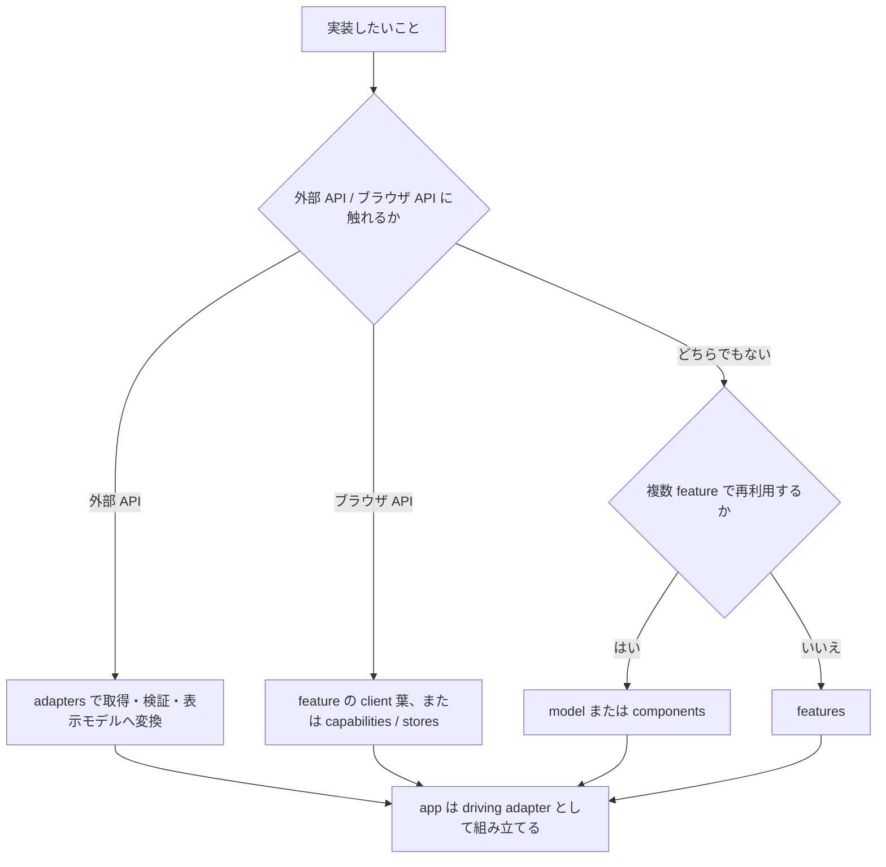

> **このファイルは [`playbook.md`](playbook.md) の日本語訳です。**
> 直接編集しないでください。変更は英語の canonical な `playbook.md` を先に更新し、そのうえでこの日本語訳を同期してください。
> エージェントが読むのは `playbook.md` だけです。このファイルは人間が読むための翻訳です。

# 実装プレイブック

この文書は、実装したいことから置き場と確認手段を逆引きするための短いガイドである。設計判断は ADR、具体的な規約は [rules.md](rules.ja.md) を正とする。

## 最初の決定

## 逆引き

| したくなったら | 置き場 | 使う型・仕組み | 最初に確認すること |
| --- | --- | --- | --- |
| 外部 API を呼びたい | `src/adapters/` | generated zod schema、正規化済み model | response 検証、timeout、retry、status → errors の変換を adapter で1回だけ行う。 |
| 画面固有の UI を作りたい | `src/features/<name>/` | props、表示モデル、状態コンポーネント | loading / empty / error / success と Storybook story を先に表へ書く。 |
| 複数 feature で UI を共有したい | `src/components/` | 意味のある props、variant | feature 固有の業務語彙が props に漏れていないか確認する。 |
| 複数 feature で表示モデルを共有したい | `src/model/` | `type`、純粋関数 | generated API 型や transport 語彙を持ち込まない。 |
| Server Action を追加したい | feature 内 `actions.ts`（受信エンドポイントが route 側にしか置けないなら `app` の同じ段） | `ActionState<T>` | 二重送信、idempotency key、再検証、field error を決める。 |
| client 横断 state が必要 | `src/stores/` | Zustand store | feature local state で足りないか先に確認する。 |
| client 横断 hook が必要 | `src/capabilities/` | browser API を包む hook | 実際に使う場所があるか、SSR 安全かを確認する。 |
| 環境値を読みたい | `src/config/` | purpose ごとの Config getter | `process.env` を直接読まず、server / client 境界を守る。 |
| 失敗を表示したい | `src/errors/` と feature | `ErrorKind`、表示用 Meta | HTTP status を上位レイヤーへ漏らさず、adapter で正規化済みか確認する。 |
| 記録・計測したい | `src/logging/` / `src/observability/` | structured log、OTel | 秘匿値を渡さず、trace context を引き継ぐ。 |

## 実物で読む

逆引きで置き場が決まったら、同じ形をしている実物を 1 つ開いてコピーするのが最短である。

<!-- sample:begin -->
**この repo には 19 画面ぶんのサンプル実装が入っている。**そのうち一覧を出す画面（`/products`）が
レイヤーをひととおり通る。

| レイヤー | 実物 | そこが持っているもの |
| --- | --- | --- |
| `app` | [`(shop)/products/page.tsx`](<../src/app/(shop)/products/page.tsx>) | metadata・待機の境界・feature の呼び出しだけ。判断を持たない |
| `features` | [`products/list/page-content.tsx`](../src/features/products/list/page-content.tsx) | 条件の解釈と組み立て。取り直す範囲の区切り |
| `features` | [`products/list/view.tsx`](../src/features/products/list/view.tsx) | 表示。取得を持たないので story で全状態を出せる |
| `adapters` | [`server/api/products.ts`](../src/adapters/server/api/products.ts) | 取得・検証・表示モデルへの変換。生成型はここから出ない |
| `app`（BFF） | [`api/products/route.ts`](../src/app/api/products/route.ts) | client からの続きの取得を同一オリジンで受けるエンドポイント |
| `model` | [`product/product.ts`](../src/model/product/product.ts) | feature をまたぐ表示モデル |
| `features`（変更） | [`cart/actions.ts`](../src/features/cart/actions.ts) | `<form action>` から呼ぶ Server Action。`ActionState<T>` を返す |

その画面が何を約束しているかは
[`spec/route/shop/products/`](spec/route/shop/products/page.function.ja.md)、置き場と線引きの理由は
[`features/products/README.md`](../src/features/products/README.ja.md) が持つ。
<!-- sample:end -->

<!-- sample:replace-begin -->
**レイヤーごとの README も同じ役割を持つ。**エントリポイントは
[`src/features/README.md`](../src/features/README.ja.md) で、そこから各カーネルの README へ辿れる。
サンプルを捨てた後に残るのはこちらである。
<!-- sample:replace-with -->
<!-- = **同じ形の実物がまだ無いなら、レイヤーごとの README が同じ役割を持つ。**エントリポイントは -->
<!-- = [`src/features/README.md`](../src/features/README.ja.md) で、そこから各カーネルの README へ辿れる。 -->
<!-- sample:replace-end -->

## 画面を作るときの順序

**見た目が決まってからテストを書く。** 逆にすると見た目が動くたびにテストを書き直すことになり、
書き直したテストは「通ること」だけを目的に緩む。

| # | 工程 | そこで決まるもの |
| --- | --- | --- |
| 1 | ディレクション | 何を出すか。[feature README テンプレート](templates/feature-readme.ja.md) の Route と契約・状態表・依存カーネルを埋める |
| 2 | story | loading / empty / error / success の 4 状態。取得を持たない `view` に切ると 4 状態すべてを story から出せる |
| 3 | レビュー | 見た目の確定。**ここを通るまでテストを書かない** |
| 4 | 分離 | 確定した見た目のレイヤーへの割り付け。基準は書き写さず、[逆引き](#逆引き)と[参照パス](#工程-4分離で読むもの)で持つ |
| 5 | 仕様書 | [`spec/`](spec/README.ja.md) の機能要件と画面要件。確定した約束を書くので、ここが最初ではない |
| 6 | テスト | 確定した形に対する検証 |

この順序を通すあいだ、次が常に効いている。

- **story は主題で数え、大まかなパターンを網羅する。**段（PC / タブレット / スマホ）は 1 主題と
  数える。主題が 15 を超えるときだけ、省いてよいかを利用者に問う。
- **目視で「良い」と言う前に機械で測る。**横あふれ・固定要素・a11y 違反は目では気づけない。
- **確認を求めるときは実物を開ける状態にして URL を渡す。**文章と screenshot だけで見た目の判断を
  求めない。段をまたいだ確認ができない。
- **立てたものは PR を出す時点で閉じる。**Storybook と dev サーバは作業中だけ要るもので、
  残すとポートを占有したまま次の作業とぶつかる。

**5 が終わるまで push しない。** 途中まででも CI は回るが、約束が書かれていない画面をレビューへ
出すと、読む側が実装から約束を推定することになる。

**カーネルはこの順序の対象外である。** `components` / `adapters` / `model` / `stores` /
`capabilities` は見た目が先に決まらないため、実装とテストを並べて進めてよい。

### 工程 4（分離）で読むもの

**基準はここに無い。**書き写した時点で古いバージョンが二重に残るので、この表が持つのは**どこを開くか**
だけである。右の列は、その ADR のどの中身を当てるかを要旨で示す —— 分離に着手する前に、ADR を実際に開いてその中身へ当てる。

| 何を決めるか | 参照先と、そこから持ってくるもの |
| --- | --- |
| **分ける / 分けないの判定（主）** | [0021](adr/0021-frontend-responsibility.ja.md) —— feature の内側で分けるのは、変わる理由が 2 つある・技術的に境界が強制される・状態の寿命と持ち主が違う・2 つ目の参照が実際に出た・React を外して検証できる、のどれかに当たるときだけ |
| 別名で立て直さない | [0021](adr/0021-frontend-responsibility.ja.md) —— SSOT / YAGNI / SOLID のような標語を規則として別立てせず、既に規定している側へ戻る |
| **粒度で切る分類を採らない** | [0020](adr/0020-adopted-architecture.ja.md) —— Atomic Design のように粒度で UI を分類しない。粒度は責務を表さない |
| 採らない分割モデル | [0040](adr/0040-routing-rendering-strategy.ja.md) —— Islands / render-as-you-fetch を別の語彙として持ち込まず、RSC の分割へ戻る |
| server（取得・編成）/ client（相互作用）の線 | [0040](adr/0040-routing-rendering-strategy.ja.md) —— `"use client"` はクライアント機能を実際に使うリーフにだけ付け、`page.tsx` / `layout.tsx` は Server Component のまま保つ |
| 待つ単位・失敗の単位 | [0040](adr/0040-routing-rendering-strategy.ja.md) —— `Suspense` の境界は待つものの単位で置き、外枠が既に await したものを待たない / [0080](adr/0080-error-handling.ja.md) —— `error.tsx` は失われて困る範囲の外側に置き、部分的な失敗は境界ではなく表示で受ける |
| **重さを持ち込まない分け方** | [0101](adr/0101-performance-budget.ja.md) —— 値を 1 つ取るためにスキーマ一式を引き込まない（綴りと数だけの module を分ける）、初期表示に要らない重いコンポーネントは `next/dynamic` で外す |
| コンポーネントが持つ状態と、外から渡すもの | [0053](adr/0053-ui-component-interaction-seam.ja.md) —— 見た目と操作の連続性のためだけの状態はコンポーネントが持ち、データ・可否・押した結果は外から渡す |
| コンポーネントの粒度 | [0053](adr/0053-ui-component-interaction-seam.ja.md) —— 1 つの要素が 2 つの操作を兼ねるなら 2 つのコンポーネントにする。粒度は role で決まる |
| 一度に見せる量 / 構造の差し替え | [0053](adr/0053-ui-component-interaction-seam.ja.md) —— その場の判断に要るものだけを出して残りは次の段へ送る。組み替えは props の分岐でなく `children` / `asChild` で開け、compound は子が単独で意味を持たないときだけ |
| variant の使いどころ / headless に分ける条件 | [0052](adr/0052-ui-component-policy.ja.md) —— variant は同時に成り立たない見た目にだけ使う。振る舞いを hook / headless へ出すのは、別の見た目で同じ振る舞いが実際に要るときだけ |
| 状態をどこまで上げるか | [0060](adr/0060-state-management.ja.md) —— 状態は必要な最小の共通祖先に置き、上げる・下げる理由は寿命で決める（再レンダリングの推測では決めない） |
| 状態遷移を書く手段の使い分け | [0060](adr/0060-state-management.ja.md) —— `useState` / `useReducer`・判別可能 union・Zustand・XState を目的で割り当て、同じ目的に複数の手段を許さない |
| 型で表すもの / 表さないもの | [0029](adr/0029-type-design-discipline.ja.md) —— 同時に立ち得ない状態は真偽値の組でなく判別可能 union で表す。値の型は注釈で広げず `satisfies` で確かめる |
| バンドで分けるか、器の幅で分けるか | [0051](adr/0051-styling-system.ja.md) —— 画面の骨格はバンド（viewport）で、コンポーネントの中身は器の幅（container query）で分ける |
| 物理配置 | [0027](adr/0027-directory-structure.ja.md) —— カーネルはフラット共置、`features/<name>/` は画面と性質の 2 軸だけで掘る |
| 共有モジュールの粒度 | [0027](adr/0027-directory-structure.ja.md) —— 判定を持つ module は per-file、UI コンポーネントは per-folder。feature を跨ぐ共有は昇格で受け、汎用フォルダを作らない |
| **やってはいけない分け方** | [0090](adr/0090-testing-strategy.ja.md) —— テストは実装の隣に 1 対 1 で置き、1 つの export に最上位 `describe` を 1 つだけ対応させる。分けた単位がそのままテストの単位になる |

**棄却側（0020 の採用しないパターン / 0040 の採らない分割モデル）を必ず含める。**同じ発想を
思いつくたびに一から議論し直さないためである。

**分離をテストの後へ回さない。** 1 対象 1 テストで付いた後に分けると、変更範囲がテストごと膨らむ。

## 着手前・完了前の確認

着手前:

- [ ] Config、error、adapter の既存公開面を確認した
- [ ] 各カーネル README と ESLint boundaries に反しない置き場を選んだ

完了前:

- [ ] 4 状態の story が feature README の状態表と対応している
- [ ] feature README と [rules.md](rules.ja.md) の該当規約を更新した
- [ ] commit / push して、hook と CI の判定を読んだ

### ゲートを先回りして回さない

**判定を持つのは hook と CI である**（[0151](adr/0151-git-hooks.ja.md)）。同じ検査を手元でもう一度
掛けても結果はより正しくならず、負荷の高い機械では二重に走らせたことそのものが、変更と無関係な
失敗の原因になる。

いまどのゲートが手元で走るかは `make load-status` が出す。機械が混んでいれば重いゲートは CI へ
委ねられる —— その判断は実測に基づくので、`--no-verify` で先回りしない。

いま書き換えた 1 ファイルだけを回すのは構わない。`pnpm exec vitest run <対象>` のように対象を
絞る。`vitest.config.ts` には並列度を書かない。デフォルトを書き換えると CI と手元で挙動が割れる。
