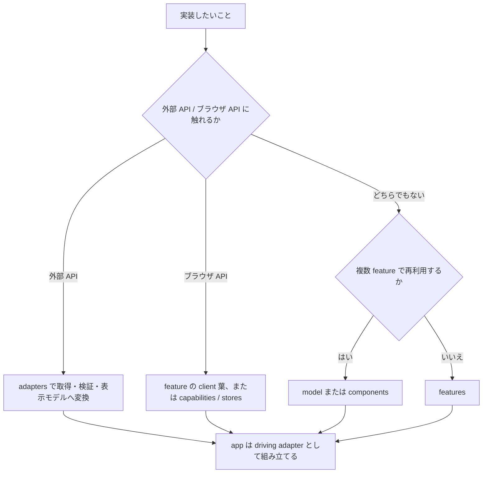

# 実装プレイブック

この文書は、実装したいことから置き場と確認手段を逆引きするための短いガイドである。設計判断は ADR、具体的な規約は [rules.md](rules.md) を正とする。

## 最初の決定

## 逆引き

| したくなったら | 置き場 | 使う型・仕組み | 最初に確認すること |
| --- | --- | --- | --- |
| 外部 API を呼びたい | `src/adapters/` | generated zod schema、正規化済み model | response 検証、timeout、retry、status → errors の変換を adapter で1回だけ行う。 |
| 画面固有の UI を作りたい | `src/features/<name>/` | props、表示モデル、状態コンポーネント | loading / empty / error / success と Storybook story を先に表へ書く。 |
| 複数 feature で UI を共有したい | `src/components/` | 意味のある props、variant | feature 固有の業務語彙が props に漏れていないか確認する。 |
| 複数 feature で表示モデルを共有したい | `src/model/` | `type`、純粋関数 | generated API 型や transport 語彙を持ち込まない。 |
| Server Action を追加したい | feature 内 `actions.ts`（受け口が route 側にしか置けないなら `app` の同じ段） | `ActionState<T>` | 二重送信、idempotency key、再検証、field error を決める。 |
| client 横断 state が必要 | `src/stores/` | Zustand store | feature local state で足りないか先に確認する。 |
| client 横断 hook が必要 | `src/capabilities/` | browser API を包む hook | 実際に使う場所があるか、SSR 安全かを確認する。 |
| 環境値を読みたい | `src/config/` | purpose ごとの Config getter | `process.env` を直接読まず、server / client 境界を守る。 |
| 失敗を表示したい | `src/errors/` と feature | `ErrorKind`、表示用 Meta | HTTP status を上位層へ漏らさず、adapter で正規化済みか確認する。 |
| 記録・計測したい | `src/logging/` / `src/observability/` | structured log、OTel | 秘匿値を渡さず、trace context を引き継ぐ。 |

## 実物で読む

逆引きで置き場が決まったら、同じ形をしている実物を 1 つ開いて写すのが最短である。

<!-- sample:begin -->
**この repo には 19 画面ぶんのサンプル実装が入っている。**そのうち一覧を出す画面（`/products`）が
層をひととおり通る。

| 層 | 実物 | そこが持っているもの |
| --- | --- | --- |
| `app` | [`(shop)/products/page.tsx`](<../src/app/(shop)/products/page.tsx>) | metadata・待機の境界・feature の呼び出しだけ。判断を持たない |
| `features` | [`products/list/page-content.tsx`](../src/features/products/list/page-content.tsx) | 条件の解釈と組み立て。取り直す範囲の区切り |
| `features` | [`products/list/view.tsx`](../src/features/products/list/view.tsx) | 表示。取得を持たないので story で全状態を出せる |
| `adapters` | [`server/api/products.ts`](../src/adapters/server/api/products.ts) | 取得・検証・表示モデルへの変換。生成型はここから出ない |
| `app`（BFF） | [`api/products/route.ts`](../src/app/api/products/route.ts) | client からの続きの取得を同一オリジンで受ける口 |
| `model` | [`product/product.ts`](../src/model/product/product.ts) | feature をまたぐ表示モデル |
| `features`（変更） | [`cart/actions.ts`](../src/features/cart/actions.ts) | `<form action>` から呼ぶ Server Action。`ActionState<T>` を返す |

その画面が何を約束しているかは
[`spec/route/shop/products/`](spec/route/shop/products/page.function.md)、置き場と線引きの理由は
[`features/products/README.md`](../src/features/products/README.md) が持つ。
<!-- sample:end -->

<!-- sample:replace-begin -->
**層ごとの README も同じ役割を持つ。**入口は
[`src/features/README.md`](../src/features/README.md) で、そこから各カーネルの README へ辿れる。
サンプルを捨てた後に残るのはこちらである。
<!-- sample:replace-with -->
<!-- = **同じ形の実物がまだ無いなら、層ごとの README が同じ役割を持つ。**入口は -->
<!-- = [`src/features/README.md`](../src/features/README.md) で、そこから各カーネルの README へ辿れる。 -->
<!-- sample:replace-end -->

## 画面を作るときの順序

**見た目が決まってからテストを書く。** 逆にすると見た目が動くたびにテストを書き直すことになり、
書き直したテストは「通ること」だけを目的に緩む。

| # | 工程 | そこで決まるもの |
| --- | --- | --- |
| 1 | ディレクション | 何を出すか。[feature README テンプレート](templates/feature-readme.md) の Route と契約・状態表・依存カーネルを埋める |
| 2 | story | loading / empty / error / success の 4 状態。取得を持たない `view` に切ると 4 状態すべてを story から出せる |
| 3 | レビュー | 見た目の確定。**ここを通るまでテストを書かない** |
| 4 | 分離 | 確定した見た目の層への割り付け。基準は書き写さず、[逆引き](#逆引き)と[参照パス](#工程-4分離で読むもの)で持つ |
| 5 | 仕様書 | [`spec/`](spec/README.md) の機能要件と画面要件。確定した約束を書くので、ここが最初ではない |
| 6 | テスト | 確定した形に対する検証 |

この順序を通すあいだ、次が常に効いている。

- **story は主題で数え、大まかなパターンを網羅する。**段（PC / タブレット / スマホ）は 1 主題と
  数える。主題が 15 を超えるときだけ、省いてよいかを利用者に問う。
- **目視で「良い」と言う前に機械で測る。**横あふれ・固定要素・a11y 違反は目では気づけない。
- **確認を求めるときは実物を開ける状態にして URL を渡す。**文章と screenshot だけで見た目の判断を
  求めない。段をまたいだ確認ができない。
- **立てたものは PR を出す時点で閉じる。**Storybook と dev サーバは作業中だけ要るもので、
  残すとポートを占有したまま次の作業とぶつかる。

**5 が終わるまで push しない。** 途中まででも CI は回るが、約束が書かれていない画面をレビューへ
出すと、読む側が実装から約束を推定することになる。

**カーネルはこの順序の対象外である。** `components` / `adapters` / `model` / `stores` /
`capabilities` は見た目が先に決まらないため、実装とテストを並べて進めてよい。

### 工程 4（分離）で読むもの

**基準はここに無い。**書き写した時点で古い版が二重に残るので、この表が持つのは**どこを開くか**
だけである。分離に着手する前に、該当する行の節を実際に開いて当てる。

| 何を決めるか | 参照先 |
| --- | --- |
| **分ける / 分けないの判定（主）** | [0021](adr/0021-frontend-responsibility.md) § feature 内で部品を分ける基準 |
| 別名で立て直さない | [0021](adr/0021-frontend-responsibility.md) § 別名で立て直さない考え方 |
| **粒度で切る分類を採らない** | [0020](adr/0020-adopted-architecture.md) § 採用しないパターン |
| 採らない分割モデル | [0040](adr/0040-routing-rendering-strategy.md) § 採らない分割モデル |
| server（取得・編成）/ client（相互作用）の線 | [0040](adr/0040-routing-rendering-strategy.md) § `"use client"` は feature 内の葉へ押し下げる |
| 待つ単位・失敗の単位 | [0040](adr/0040-routing-rendering-strategy.md) § 境界の粒度 / [0080](adr/0080-error-handling.md) § 境界の粒度 |
| **重さを持ち込まない分け方** | [0101](adr/0101-performance-budget.md) § 4. 重さを持ち込まない書き方 |
| 部品が持つ状態と、外から渡すもの | [0053](adr/0053-ui-component-interaction-seam.md) § 部品が持つ状態と、外から渡すもの |
| 部品の粒度 | [0053](adr/0053-ui-component-interaction-seam.md) つの操作に 1 つの role |
| 一度に見せる量 / 構造の差し替え | [0053](adr/0053-ui-component-interaction-seam.md) § 一度に見せる量は段階で絞る・§ 構造の差し替えは props ではなく slot で受ける |
| variant の使いどころ / headless に分ける条件 | [0052](adr/0052-ui-component-policy.md) § variant は排他の見た目にだけ使う・§ 振る舞いと見た目を分けるのは、振る舞いが 2 箇所目で要るときだけ |
| 状態をどこまで上げるか | [0060](adr/0060-state-management.md) § 状態をどこまで上げるか |
| 状態遷移を書く手段の使い分け | [0060](adr/0060-state-management.md) § 状態遷移を書く手段は 4 つあり、目的で使い分ける |
| 型で表すもの / 表さないもの | [0029](adr/0029-type-design-discipline.md) § 1. 状態は判別可能 union で表す・§ 4. 型は `satisfies` で確かめ、注釈で潰さない |
| 帯で分けるか、器の幅で分けるか | [0051](adr/0051-styling-system.md) § 幅で決めるものと、器で決めるもの |
| 物理配置 | [0027](adr/0027-directory-structure.md) § co-location 方針 |
| 共有モジュールの粒度 | [0027](adr/0027-directory-structure.md) § 共有モジュールの粒度 |
| **やってはいけない分け方** | [0090](adr/0090-testing-strategy.md) § 禁止事項 |

**棄却側（0020 の採用しないパターン / 0040 の採らない分割モデル）を必ず含める。**同じ発想を
思いつくたびに一から議論し直さないためである。

**分離をテストの後へ回さない。** 1 対象 1 テストで付いた後に分けると、変更範囲がテストごと膨らむ。

## 着手前・完了前の確認

着手前:

- [ ] Config、error、adapter の既存公開面を確認した
- [ ] 各カーネル README と ESLint boundaries に反しない置き場を選んだ

完了前:

- [ ] 4 状態の story が feature README の状態表と対応している
- [ ] feature README と [rules.md](rules.md) の該当規約を更新した
- [ ] commit / push して、hook と CI の判定を読んだ

### ゲートを先回りして回さない

**判定を持つのは hook と CI である**（[0151](adr/0151-git-hooks.md)）。同じ検査を手元でもう一度
掛けても結果はより正しくならず、負荷の高い機械では二重に走らせたことそのものが、変更と無関係な
失敗の原因になる。

いまどのゲートが手元で走るかは `make load-status` が出す。機械が混んでいれば重いゲートは CI へ
委ねられる —— その判断は実測に基づくので、`--no-verify` で先回りしない。

いま書き換えた 1 ファイルだけを回すのは構わない。`pnpm exec vitest run <対象>` のように対象を
絞る。`vitest.config.ts` には並列度を書かない。既定を書き換えると CI と手元で挙動が割れる。
