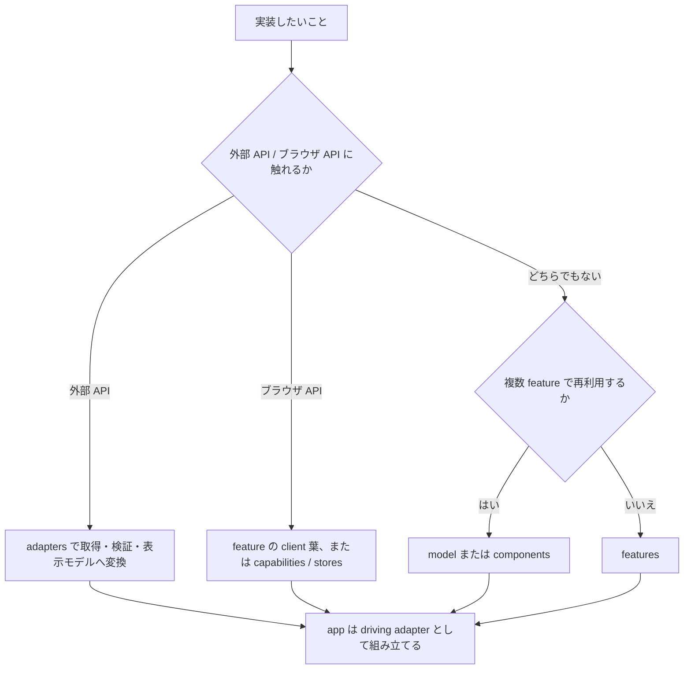

# 実装プレイブック

この文書は、実装したいことから置き場と確認手段を逆引きするための短いガイドである。設計判断は ADR、具体的な規約は [rules.md](rules.md) を正とする。

## 最初の決定



## 逆引き

| したくなったら | 置き場 | 使う型・仕組み | 最初に確認すること |
| --- | --- | --- | --- |
| 外部 API を呼びたい | `src/adapters/` | generated zod schema、正規化済み model | response 検証、timeout、retry、status → errors の変換を adapter で1回だけ行う。 |
| 画面固有の UI を作りたい | `src/features/<name>/` | props、表示モデル、状態コンポーネント | loading / empty / error / success と Storybook story を先に表へ書く。 |
| 複数 feature で UI を共有したい | `src/components/` | 意味のある props、variant | feature 固有の業務語彙が props に漏れていないか確認する。 |
| 複数 feature で表示モデルを共有したい | `src/model/` | `type`、純粋関数 | generated API 型や transport 語彙を持ち込まない。 |
| Server Action を追加したい | feature 内 `actions.ts` | `ActionState<T>` | 二重送信、idempotency key、再検証、field error を決める。 |
| client 横断 state が必要 | `src/stores/` | Zustand store | feature local state で足りないか先に確認する。 |
| client 横断 hook が必要 | `src/capabilities/` | browser API を包む hook | 実際の設置面があるか、SSR 安全かを確認する。 |
| 環境値を読みたい | `src/config/` | purpose ごとの Config getter | `process.env` を直接読まず、server / client 境界を守る。 |
| 失敗を表示したい | `src/errors/` と feature | `ErrorKind`、表示用 Meta | HTTP status を上位層へ漏らさず、adapter で正規化済みか確認する。 |
| 記録・計測したい | `src/logging/` / `src/observability/` | structured log、OTel | 秘匿値を渡さず、trace context を引き継ぐ。 |

## 模範: 一覧 feature

route は薄く保ち、取得と変換は adapter、状態を含む表示は feature に置く。

```tsx
import { ProductList } from "@/features/products/product-list";
import { listProducts } from "@/adapters/products/list-products";

export default async function ProductsPage() {
  const products = await listProducts();

  return <ProductList products={products} />;
}
```

adapter は API の生成型を feature へ返さず、`model` に変換する。

```ts
import "server-only";

import type { Product } from "@/model/product";

export async function listProducts(): Promise<readonly Product[]> {
  // fetch、schema 検証、error 正規化、Product への変換をここで行う。
  return [];
}
```

## 実装前・実装後の確認

実装前:

- [ ] [feature README テンプレート](templates/feature-readme.md) の状態表と依存カーネルを埋めた
- [ ] Config、error、adapter の既存公開面を確認した
- [ ] 各カーネル README と ESLint boundaries に反しない置き場を選んだ

実装後:

- [ ] 4状態のテストと story を追加した
- [ ] `pnpm lint:ci`、`pnpm typecheck`、`pnpm test` を実行した
- [ ] feature README と [rules.md](rules.md) の該当規約を更新した
