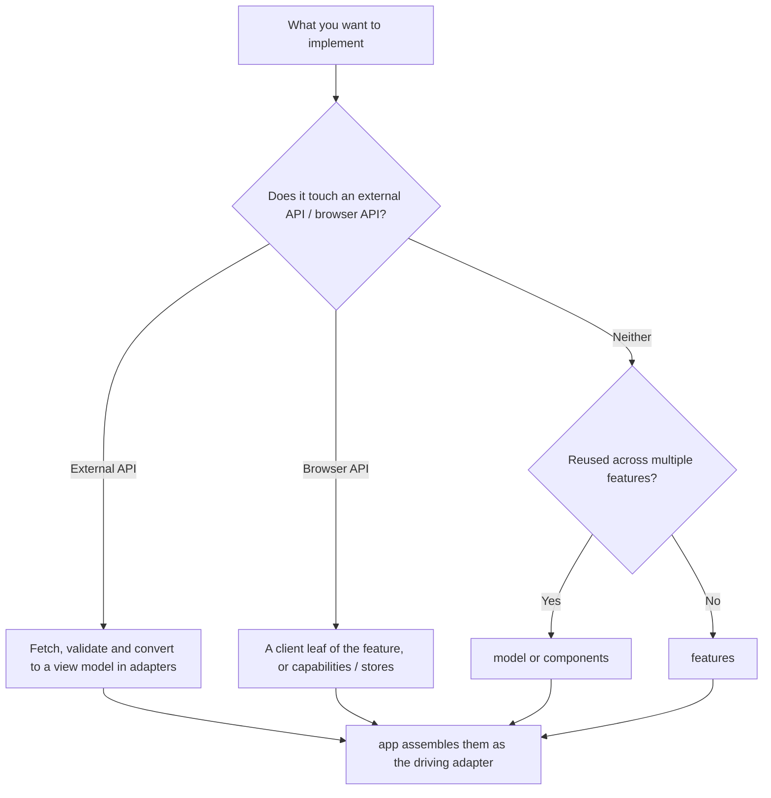

# Implementation Playbook

This document is a short guide for looking up, from what you want to implement, where it goes and how to verify it. Design decisions are owned by the ADRs, and the concrete rules by [rules.md](rules.md).

## First Decisions

```mermaid
flowchart TD
  A[What you want to implement] --> B{Does it touch an external API / browser API?}
  B -->|External API| C[Fetch, validate and convert to a view model in adapters]
  B -->|Browser API| D[A client leaf of the feature, or capabilities / stores]
  B -->|Neither| E{Reused across multiple features?}
  E -->|Yes| F[model or components]
  E -->|No| G[features]
  C --> H[app assembles them as the driving adapter]
  D --> H
  F --> H
  G --> H
```

## Reverse Lookup

| When you want to | Where it goes | Types and mechanisms used | What to check first |
| --- | --- | --- | --- |
| Call an external API | `src/adapters/` | generated zod schema, normalized model | Do response validation, timeout, retry, and status → errors conversion exactly once, in the adapter. |
| Build screen-specific UI | `src/features/<name>/` | props, display model, state components | Write loading / empty / error / success and the Storybook stories into the table first. |
| Share UI across features | `src/components/` | meaningful props, variants | Check that no feature-specific business vocabulary leaks into the props. |
| Share a display model across features | `src/model/` | `type`, pure functions | Do not bring in generated API types or transport vocabulary. |
| Add a Server Action | `actions.ts` in the feature (the same level in `app` if the receiving endpoint can only live on the route side) | `ActionState<T>` | Decide double submission, idempotency key, revalidation and field errors. |
| Need cross-cutting client state | `src/stores/` | Zustand store | First check whether feature-local state is enough. |
| Need a cross-cutting client hook | `src/capabilities/` | a hook wrapping a browser API | Check that there is a real place that uses it, and that it is SSR-safe. |
| Read an environment value | `src/config/` | per-purpose Config getter | Do not read `process.env` directly; keep the server / client boundary. |
| Display a failure | `src/errors/` and the feature | `ErrorKind`, display Meta | Do not leak HTTP status to upper layers; check that the adapter has already normalized it. |
| Record or measure | `src/logging/` / `src/observability/` | structured log, OTel | Do not pass secret values; propagate the trace context. |

## Read it in real code

Once the reverse lookup has decided where something goes, the shortest path is to open one real example of the same shape and copy it.

<!-- sample:begin -->
**This repo contains sample implementations for 19 screens.** Of them, the screen that shows a list (`/products`)
goes through every layer.

| Layer | Real code | What it holds |
| --- | --- | --- |
| `app` | [`(shop)/products/page.tsx`](<../src/app/(shop)/products/page.tsx>) | Only metadata, the loading boundary and the call into the feature. It holds no decisions |
| `features` | [`products/list/page-content.tsx`](../src/features/products/list/page-content.tsx) | Interpreting and assembling conditions. Delimiting the refetch scope |
| `features` | [`products/list/view.tsx`](../src/features/products/list/view.tsx) | Display. It has no fetching, so stories can show every state |
| `adapters` | [`server/api/products.ts`](../src/adapters/server/api/products.ts) | Fetching, validation, conversion to the display model. Generated types do not leave here |
| `app` (BFF) | [`api/products/route.ts`](../src/app/api/products/route.ts) | The endpoint that receives continuation fetches from the client on the same origin |
| `model` | [`product/product.ts`](../src/model/product/product.ts) | The display model shared across features |
| `features` (mutation) | [`cart/actions.ts`](../src/features/cart/actions.ts) | A Server Action called from `<form action>`. Returns `ActionState<T>` |

What that screen promises is held by
[`spec/route/shop/products/`](spec/route/shop/products/page.function.md), and the reasons for its placement and boundaries by
[`features/products/README.md`](../src/features/products/README.md).
<!-- sample:end -->

<!-- sample:replace-begin -->
**The per-layer READMEs play the same role.** The entry point is
[`src/features/README.md`](../src/features/README.md), and from there you can follow each kernel's README.
These are what remain after the sample is discarded.
<!-- sample:replace-with -->
<!-- = **If there is no real example of the same shape yet, the per-layer READMEs play the same role.** The entry point is -->
<!-- = [`src/features/README.md`](../src/features/README.md), and from there you can follow each kernel's README. -->
<!-- sample:replace-end -->

## Order of Work When Building a Screen

**Write tests after the look is settled.** The other way round, the tests have to be rewritten every time the look moves,
and rewritten tests loosen toward the sole aim of "passing".

| # | Step | What it settles |
| --- | --- | --- |
| 1 | Direction | What to show. Fill in Routes and Contracts, the state table and Kernel Dependencies of the [feature README template](templates/feature-readme.md) |
| 2 | Story | The four states loading / empty / error / success. Splitting off a `view` that has no fetching lets stories show all four states |
| 3 | Review | Settling the look. **Do not write tests until this passes** |
| 4 | Separation | Assigning the settled look to layers. The criteria are not copied out; they are held by [Reverse Lookup](#reverse-lookup) and the [reference paths](#what-to-read-at-step-4-separation) |
| 5 | Specification | The functional and screen requirements in [`spec/`](spec/README.md). It records promises that are settled, so it does not come first |
| 6 | Tests | Verification against the settled shape |

While going through this order, the following always apply.

- **Count stories by subject and cover the broad patterns.** The tiers (PC / tablet / smartphone) count as one
  subject. Only when there are more than 15 subjects, ask the user whether some may be omitted.
- **Measure with a machine before saying "looks good" by eye.** Horizontal overflow, fixed elements and a11y violations cannot be noticed by eye.
- **When asking for confirmation, make the real thing openable and hand over a URL.** Do not ask for a judgment on the look from
  text and screenshots alone. Confirmation across tiers is impossible that way.
- **Shut down what you started by the time you open the PR.** Storybook and the dev server are needed only while working;
  left running, they hold ports and collide with the next task.

**Do not push until step 5 is done.** CI runs on partial work too, but sending a screen whose promises are not written to review
makes the reader infer the promises from the implementation.

**Kernels are outside this order.** `components` / `adapters` / `model` / `stores` /
`capabilities` do not have their look settled first, so implementation and tests may proceed side by side.

### What to Read at Step 4 (Separation)

**The criteria are not here.** Copying them out leaves an old version duplicated, so what this table holds is **only where to open**.
The right column summarizes which content of that ADR to apply — before starting the separation, actually open the ADR and apply that content.

| What is decided | Where to look, and what to take from it |
| --- | --- |
| **Whether to split (primary)** | [0021](adr/0021-frontend-responsibility.md) — split inside a feature only when one of these holds: there are two reasons to change, the boundary is technically enforced, the lifetime and owner of state differ, a second reference has actually appeared, or it can be verified with React removed |
| Do not rebuild under another name | [0021](adr/0021-frontend-responsibility.md) — do not set up slogans such as SSOT / YAGNI / SOLID as separate rules; go back to whatever already prescribes it |
| **Do not adopt classification by granularity** | [0020](adr/0020-adopted-architecture.md) — do not classify UI by granularity as Atomic Design does. Granularity does not express responsibility |
| Splitting models not adopted | [0040](adr/0040-routing-rendering-strategy.md) — do not bring in Islands / render-as-you-fetch as separate vocabulary; go back to RSC's splitting |
| The server (fetching, composition) / client (interaction) line | [0040](adr/0040-routing-rendering-strategy.md) — put `"use client"` only on leaves that actually use client features, and keep `page.tsx` / `layout.tsx` as Server Components |
| Unit of waiting, unit of failure | [0040](adr/0040-routing-rendering-strategy.md) — place `Suspense` boundaries per unit of what is awaited, and do not await what the outer frame has already awaited / [0080](adr/0080-error-handling.md) — place `error.tsx` outside the range you cannot afford to lose, and receive partial failures in the display rather than at a boundary |
| **Splitting that does not bring in weight** | [0101](adr/0101-performance-budget.md) — do not pull in a whole schema to obtain one value (split out a module of only spellings and numbers), and move heavy components not needed for initial display out with `next/dynamic` |
| State a component holds, and what is passed from outside | [0053](adr/0053-ui-component-interaction-seam.md) — the component holds state that exists only for continuity of look and interaction; data, availability and the result of a press are passed from outside |
| Component granularity | [0053](adr/0053-ui-component-interaction-seam.md) — if one element serves two interactions, make it two components. Granularity is decided by role |
| How much to show at once / swapping structure | [0053](adr/0053-ui-component-interaction-seam.md) — show only what the judgment at hand needs and send the rest to the next step. Open recomposition through `children` / `asChild` rather than props branches; use compound components only when the children have no meaning alone |
| Where variants apply / when to split into headless | [0052](adr/0052-ui-component-policy.md) — use variants only for looks that cannot hold at the same time. Move behavior out to a hook / headless only when the same behavior is actually needed with a different look |
| How far to lift state | [0060](adr/0060-state-management.md) — place state at the smallest common ancestor that needs it, and decide lifting or lowering by lifetime (not by guesses about re-rendering) |
| Choosing the means of writing state transitions | [0060](adr/0060-state-management.md) — assign `useState` / `useReducer`, discriminated unions, Zustand and XState by purpose, and do not allow several means for the same purpose |
| What types express / do not express | [0029](adr/0029-type-design-discipline.md) — express states that cannot hold at the same time with a discriminated union, not a set of booleans. Do not widen a value's type with an annotation; check it with `satisfies` |
| Split by band, or by container width | [0051](adr/0051-styling-system.md) — split the screen skeleton by band (viewport), and a component's content by container width (container query) |
| Physical placement | [0027](adr/0027-directory-structure.md) — kernels are flat and co-located; `features/<name>/` is dug only along two axes, screen and nature |
| Granularity of shared modules | [0027](adr/0027-directory-structure.md) — modules that hold a judgment are per-file, UI components per-folder. Sharing across features is received by promotion, without creating generic folders |
| **Splits you must not make** | [0090](adr/0090-testing-strategy.md) — place tests next to the implementation one-to-one, and map exactly one top-level `describe` to each export. The unit you split into becomes the unit of testing as is |

**Always include the rejected side (0020's patterns not adopted / 0040's splitting models not adopted).** This is so that
the same idea is not argued from scratch every time someone thinks of it.

**Do not push separation past the tests.** Splitting after tests have attached one per target makes the change scope swell along with the tests.

## Checks Before Starting and Before Finishing

Before starting:

- [ ] Checked the existing public surface of Config, error and adapter
- [ ] Chose a location that violates neither each kernel's README nor ESLint boundaries

Before finishing:

- [ ] The four-state stories correspond to the state table in the feature README
- [ ] Updated the feature README and the relevant rules in [rules.md](rules.md)
- [ ] Committed / pushed, and read the verdict from the hook and CI

### Do not pre-run the gates

**The hook and CI hold the verdict** ([0151](adr/0151-git-hooks.md)). Running the same check again locally
does not make the result more correct, and on a heavily loaded machine running it twice is itself a cause of failures unrelated
to the change.

`make load-status` prints which gates run locally right now. When the machine is busy, the heavy gates are delegated to CI
— that decision is based on measurement, so do not pre-empt it with `--no-verify`.

Running just the one file you have just rewritten is fine. Narrow the target, as in `pnpm exec vitest run <target>`.
Do not write the parallelism into `vitest.config.ts`. Rewriting the default makes behavior diverge between CI and local.
